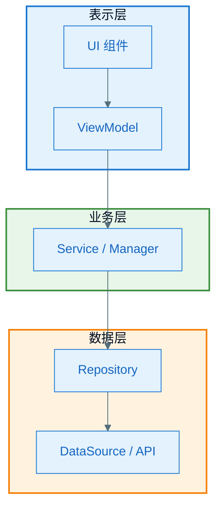
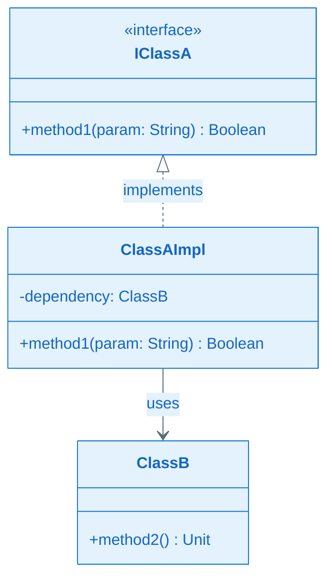
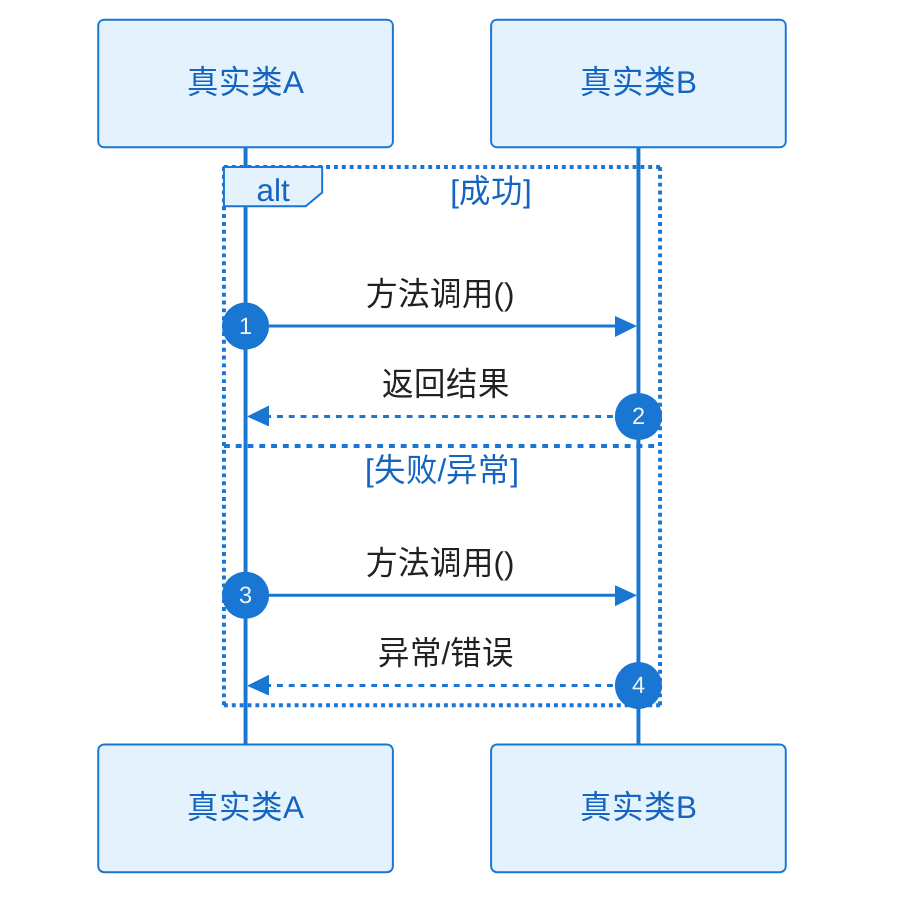
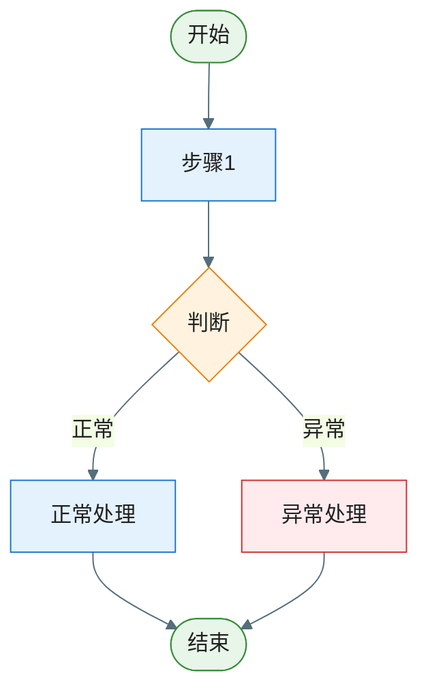

# [Feature/子功能名称]｜技术实现文档

## 文档元信息

| 项目 | 内容 |
|------|------|
| **文档目的** | [如：新人上手该模块 / 接需求与排期 / 排查问题] |
| **目标读者** | [如：首次接触该模块的工程师] |
| **阅读前提** | [如：先阅读《功能概览.md》、先了解 XX 模块] |
| **版本/更新日期** | [如：v1.0，2025-03-08] |

---

## 1. 功能介绍

[简要说明该功能的业务目的、主要能力、适用场景。若为子功能，说明在整体功能中的角色。]

### 1.1 范围与边界

- **包含**：[本功能负责的范围]
- **不包含**：[相邻模块或明确排除的内容]
- **边界说明**：[与上下游/周边模块的接口边界]

### 1.2 代码入口与文件索引

[列出本功能涉及的源码目录、关键类与接口文件路径，便于开发快速定位与阅读。路径使用仓库相对路径；若模块较多，可按「目录 → 关键文件」分层列出。]

- **相关目录**：
  - `[模块/包路径/，如：app/src/main/java/.../feature/]`
  - `[资源或其它目录，如：app/src/main/res/layout/]`
- **关键类 / 接口**（建议按职责分组）：

| 职责/角色 | 类型 | 路径 |
|-----------|------|------|
| [如：入口 Activity/Fragment] | [类/接口] | `[相对路径]` |
| [如：ViewModel / Presenter] | [类] | `[相对路径]` |
| [如：对外契约 / API] | [接口] | `[相对路径]` |
| [如：Repository / DataSource] | [类] | `[相对路径]` |
| ... | ... | ... |

- **备注**：[可选：与测试、多 flavor、生成代码相关的路径说明]

---

## 2. 领域概念

[列出该功能涉及的领域术语与概念，便于读者统一理解。]

| 概念 | 定义 | 备注 |
|------|------|------|
| [概念名] | [在本文档/本功能中的含义] | [可选：与通用含义的差异、约束等] |
| ... | ... | ... |

---

## 3. 整体架构（图 + 分层/数据流/设计决策）

### 3.1 架构图

图表须基于项目真实架构绘制，包含模块、组件与数据流方向。绘图样式须遵循 `.claude/rules/mermaid-style-guide.mdc`。



### 3.2 关键说明

- **分层/模块职责**：[各层或各模块的职责与边界]
- **数据流**：[数据从哪里进入、经哪些模块、到哪里结束]
- **关键设计决策**：[为何采用当前架构、主要约束]

---

## 4. 关键模块设计与实现要点

[紧接整体架构，按模块或层次展开；先概述调用链，再逐模块说明。]

### 4.0 模块调用链概览

[用一段话或伪代码描述各模块的调用顺序，说明请求如何从入口流经各模块、最终返回结果。与 §6 时序图相互呼应。]

```
入口（如 ViewModel / Controller）
  → 模块A.method()
    → 模块B.method()
      → 模块C.method()
  ← 结果逐层返回
```

### 4.1 [模块名称]

- **职责**：[该模块负责什么]
- **输入/输出**：[入参、返回值或副作用]
- **设计��点**：[核心设计思路、与其它模块的协作方式]
- **关键代码实现**（摘录真实代码片段并简要说明）：

```kotlin
// 文件路径
// 关键方法或逻辑片段
```

### 4.2 [模块名称]

[同上，可重复 4.3、4.4 等覆盖其他关键模块]

---

## 5. 类图

**必须包含该功能涉及的所有关键类和接口**，基于项目真实代码绘制，包含方法签名、依赖方向；禁止使用虚构或示例类名。类图后须附**关键类职责说明**表。



| 类/接口名 | 职责（一句话） |
|-----------|----------------|
| Xxx | ... |
| Yyy | ... |

---

## 6. 时序图（方法调用主流程 + 异常）

要求：

- **完整性**：必须覆盖从触发点到最终响应的**完整调用链**，不得遗漏关键流程节点与关键方法调用；有多条主流程时须分张绘制，每张独立完整。
- **参与者**：必须列出该流程中**所有**参与的真实类/接口，participant 使用项目**真实类名/接口名**，禁止伪造或省略。
- **方法调用**：流程中**所有关键方法调用**须在图中逐一体现，方法名与调用顺序须**与代码完全一致**，不得用「...」或泛化描述代替具体方法名。
- **正常与异常**：每张图须用 `alt/else` 同时表达**正常路径**与**关键异常路径**，不得只画 Happy Path。

### 6.1 [流程名称，如「登录与鉴权」]



#### 协作者与过程说明

1. **触发与入口**：[谁、在什么条件下发起交互]
2. **协作链与职责**：[沿调用方向每一跳「谁调用谁、为了什么、输入/输出语义」]
3. **工作过程与数据流**：[中间状态如何变化；关键业务决策在何处做出]
4. **分支与异常**：[每个 alt/else 的进入条件、各分支差异行为、最终可见结果]
5. **结束条件**：[正常结束与各类异常结束分别是什么]

### 6.2 [流程名称]

[同上结构，按实际流程数量补充 6.3、6.4 等]

---

## 7. 流程图（逻辑分支 + 异常）

要求：

- **完整性**：必须覆盖从触发条件到所有可能结束状态的**完整逻辑路径**，不得遗漏关键判断节点与分支；有多段独立逻辑时须分张绘制，每张独立完整。
- **分支覆盖**：所有关键的条件判断节点都须在图中体现，不得用「...」或泛化描述代替具体分支条件。
- **正常与异常**：每张图须同时覆盖**正常分支**与**异常/错误分支**，不得只画正常路径。
- **与时序图一致**：流程图与对应的时序图在流程节点和分支上须保持一致，不得相互矛盾。

每张流程图描述一段完整业务逻辑。

### 7.1 [逻辑名称]



**说明**：[该图对应的业务逻辑、分支条件]

### 7.2 [逻辑名称]

[同上结构，按实际逻辑数量补充 7.3、7.4 等]

---

## 8. 关��数据结构

[该功能涉及的核心数据模型：Entity、DTO、State、Config 等。]

### 8.1 [结构名称 1]

- **用途**：[在功能中的作用]
- **定义**（或关键字段说明）：

```kotlin
data class Xxx(
    val id: Long,      // 说明
    val name: String,  // 说明
)
```

### 8.2 [结构名称 2]

[同上]

---

## 9. 数据库、数据表设计

[若涉及持久化则列出；若无则写「本功能不涉及数据库」并说明数据来源。]

### 9.1 数据库/存储说明

[数据库类型、命名空间或 schema 等]

### 9.2 表：[表名]

| 字段名 | 含义 | 数据类型 | 约束/说明 |
|--------|------|----------|-----------|
| id | 主键 | BIGINT | 自增/主键 |
| xxx | 说明 | VARCHAR(64) | 可空/唯一/索引 |

### 9.3 表：[其他表名]

[同上格式]

---

## 10. 依赖的 SDK 与配置

### 10.1 依赖的 SDK

仅列出**第三方或外部 SDK**（groupId、artifactId），**不包含** `implementation project(':xxx')` 等项目内部模块。

| SDK 名称 | groupId | artifactId | 用途说明 |
|----------|---------|------------|----------|
| 示例库 | com.example | example-sdk | 用于 xxx |

### 10.2 配置项与开关

[关键配置项、环境差异、Feature Flag 等。]

| 配置项/开关 | 含义 | 默认值 | 说明 |
|-------------|------|--------|------|
| xxx | ... | ... | ... |

---

## 11. 对外提供的接口

[该功能对外暴露的 API：公开类/接口、方法签名、调用方、用途。]

### 11.1 接口/类：[名称]

- **位置**：[包名/文件路径]
- **用途**：[给谁用、做什么]
- **方法**：

| 方法签名 | 说明 |
|----------|------|
| fun doSomething(param: Type): Result | 说明 |

### 11.2 接口/类：[其他]

[同上]

---

## 12. 错误码与异常处理

[错误码表或异常类型、触发场景、含义、处理建议。]

| 错误码/异常类型 | 触发场景 | 含义 | 处理建议 |
|-----------------|----------|------|----------|
| XxxException | [在什么情况下抛出] | ... | ... |

---

## 13. 日志、埋点与常见问题

### 13.1 日志与埋点

**关键日志**

| Tag / 关键字 | 日志内容 | 排查场景 |
|--------------|----------|----------|
| [TAG_NAME] | [日志输出内容摘要] | [用于排查哪类问题] |

**埋点事件**

| 事件名 | 触发时机 | 关键参数 | 说明 |
|--------|----------|----------|------|
| [event_name] | [何时触发] | [param1, param2] | [业务含义] |

### 13.2 常见问题 / FAQ

[已知坑、配置错误、兼容性注意点等。]

---

## 附录

### A. 缩写对照表

[仅收录缩写，领域术语统一在 §2 领域概念中维护。]

| 缩写 | 全称 | 说明 |
|------|------|------|
| DTO | Data Transfer Object | 数据传输对象 |
| SDK | Software Development Kit | 软件开发工具包 |
| ... | ... | ... |

### B. 相关文档

- [文档名称](链接) — 说明

### C. 信息来源说明

- ✅ **已确认**：[依据的代码/配置]
- ⚠️ **合理推断**：[推断内容及依据]
