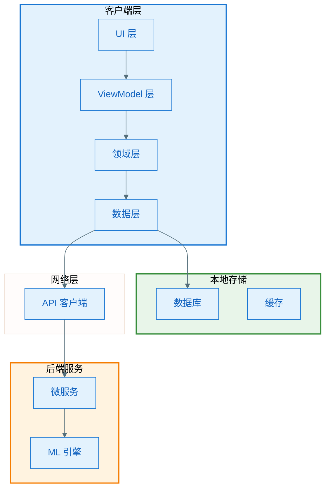
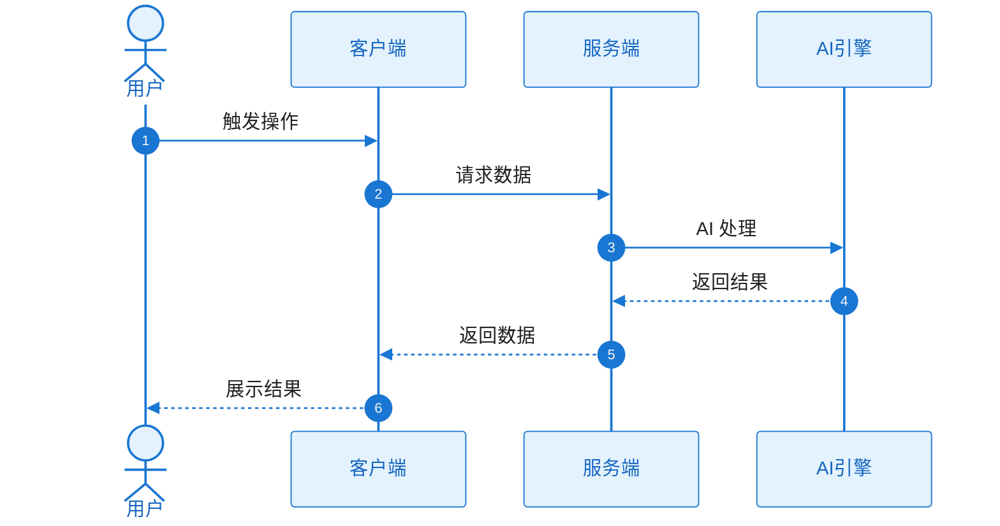

# 竞品技术分析

深度分析竞品的技术实现方案，为技术选型和架构设计提供依据。

## 核心原则

### 📚 资料来源优先级（关键）
1. **官方资料优先**：技术博客 > 开发者文档 > 技术演讲 > 工程分享
2. **必须标注来源**：每个关键信息都要提供引用链接和发布时间
3. **区分确认与推测**：明确标注"官方确认"、"行业分析"、"基于推测"
4. **数据可验证**：性能数据、测试结果必须说明测试条件和来源

### 🔬 技术分析为核心
- **深度优先**：不仅说"用了什么技术"，更要分析"为什么用"、"怎么实现的"、"效果如何"
- **数据支撑**：包含架构图、代码示例、性能数据、算法原理
- **横向对比**：对比不同方案的优劣，给出量化评估

## 分析流程

### 步骤 1：确定分析对象

询问用户：
- [ ] 竞品名称（建议 2-3 个进行对比）
- [ ] 分析的具体功能或模块
- [ ] 目标平台（Android/iOS/Web）

### 步骤 2：收集技术资料

**使用 WebSearch 搜索**：
```
"[竞品名] [功能名] technical implementation"
"[竞品名] architecture design"
"[竞品名] engineering blog"
"[竞品名] [功能名] technical deep dive"
```

**资料来源优先级**：

| 优先级 | 来源类型 | 可信度 | 示例 |
|-------|---------|-------|------|
| **P0** | 官方技术博客 | ⭐⭐⭐⭐⭐ | Google AI Blog, Apple Developer News |
| **P0** | 官方开发者文档 | ⭐⭐⭐⭐⭐ | API 文档、架构指南 |
| **P1** | 技术大会演讲 | ⭐⭐⭐⭐⭐ | Google I/O, WWDC |
| **P1** | 工程团队技术分享 | ⭐⭐⭐⭐ | Medium、InfoQ |
| **P2** | 权威第三方分析 | ⭐⭐⭐ | 技术专家深度文章 |

**资料记录要求**：
- [ ] 记录每个关键信息的来源 URL
- [ ] 标注信息发布时间
- [ ] 区分"官方确认"、"行业分析"、"推测"
- [ ] 建立资料清单

### 步骤 3：产品功能快速对比

**创建功能对比表格**（简化版）：

| 功能模块 | 竞品A | 竞品B | 竞品C | 行业最佳 |
|---------|------|------|------|---------|
| [功能1] | ✅ 支持<br>特点：XXX | ✅ 支持<br>特点：YYY | ❌ 不支持 | [谁做得最好] |
| [功能2] | ⚠️ 部分支持<br>限制：XXX | ✅ 完全支持<br>亮点：YYY | ✅ 支持<br>特点：ZZZ | [谁做得最好] |
| [功能3] | ... | ... | ... | ... |

**符号说明**：
- ✅ 完全支持
- ⚠️ 部分支持/有限制
- ❌ 不支持
- 🔥 核心亮点功能

### 步骤 4：技术实现深度分析（核心重点）

> **重要**：技术实现分析是竞品分析的核心价值所在，必须详细、深入、有数据支撑。

#### 4.1 技术架构分析

**为每个竞品创建技术架构图**：



**架构分析要点**：
- [ ] 架构模式（MVC/MVVM/Clean）及选择理由
- [ ] 技术分层及依赖关系
- [ ] 数据流完整路径
- [ ] 关键技术组件清单

#### 4.2 核心技术栈对比

**技术栈全景对比表**：

| 技术模块 | 竞品A | 竞品B | 竞品C | 深度分析 | 资料来源 |
|---------|------|------|------|---------|---------|
| **开发语言** | Kotlin 1.9 | Swift 5.9 | TypeScript 5.0 | 性能/生态对比 | [[链接]] |
| **UI 框架** | Jetpack Compose | SwiftUI | React Native | 渲染性能/开发效率 | [[链接]] |
| **架构模式** | MVVM + Clean | VIPER | Flux | 复杂度/可测试性 | [[链接]] |
| **依赖注入** | Hilt | Swinject | InversifyJS | 编译时/运行时性能 | [[链接]] |
| **响应式编程** | Kotlin Flow | Combine | RxJS | 学习曲线/性能 | [[链接]] |
| **网络层** | Retrofit + OkHttp | Alamofire | Axios | 请求性能/功能完整性 | [[链接]] |
| **本地数据库** | Room + SQLite | Core Data | SQLite | 查询性能/迁移友好度 | [[链接]] |
| **图片加载** | Coil | Kingfisher | Fast Image | 加载速度/内存管理 | [[链接]] |
| **AI/ML 框架** | TensorFlow Lite | Core ML | TensorFlow.js | 模型大小/推理速度 | [[链接]] |
| **视频处理** | ExoPlayer | AVFoundation | Video.js | 格式支持/编解码性能 | [[链接]] |

**技术选型理由分析**（每个关键技术必须分析）：

| 竞品 | 选型 | 选择理由 | 优势 | 劣势 | 适用场景 | 资料来源 |
|-----|-----|---------|-----|-----|---------|---------|
| 竞品A | Room + SQLite | 官方支持/类型安全 | ✅ SQL验证<br>✅ LiveData集成 | ⚠️ 复杂查询慢 | 关系型数据 | [[链接]] |
| 竞品B | Core Data | 系统原生/对象图管理 | ✅ 对象化操作<br>✅ 关系处理强 | ⚠️ 学习曲线陡 | 复杂对象关系 | [[链接]] |
| 竞品C | Realm | 性能极致/跨平台 | ✅ 速度快<br>✅ 易用 | ⚠️ 文件体积大 | 高性能需求 | [[链接]] |

#### 4.3 关键功能技术实现（必须深度剖析）

**针对每个核心功能，按以下结构分析**：

---

**功能：[具体功能名称]**

**一、整体技术方案对比**

| 维度 | 竞品A | 竞品B | 竞品C | 对比分析 | 资料来源 |
|-----|------|------|------|---------|---------|
| **实现位置** | 云端处理 | 设备端处理 | 混合模式 | 性能差异/隐私影响 | [[链接]] |
| **核心算法** | 深度学习 | 传统算法 | 规则+ML | 准确率/计算开销 | [[链接]] |
| **响应时间** | 2-5秒 | <1秒 | 1-3秒 | 用户感知/优化空间 | [[链接]] |
| **数据依赖** | 需联网上传 | 完全离线 | 可选上传 | 功能完整性/隐私 | [[链接]] |

**二、竞品A技术实现详解**

**方案概述**：
[1-2段详细描述整体技术方案]

**技术架构图**：


**核心技术栈**：
- **算法层**：[具体算法，如 ResNet-50, YOLO v8]
- **框架层**：[TensorFlow Lite 2.14, PyTorch Mobile]
- **加速层**：[GPU/NPU/DSP 使用情况]
- **优化技术**：[量化/剪枝/知识蒸馏]

**关键技术细节**：

1. **数据预处理**
   - 输入格式：[如 RGB 图像, 224x224]
   - 归一化方法：[具体数值范围]
   - 数据增强：[使用的技术]

2. **模型结构**
   - 网络架构：[层数、参数量]
   - 输入输出：[tensor 形状]
   - 模型大小：[MB]
   - 推理时间：[ms，在特定设备上]

3. **性能优化**
   - 量化方案：[INT8/FP16]
   - 并行策略：[多线程/GPU 加速]
   - 缓存机制：[中间结果复用]

**性能数据**（实测或官方公布）：

| 指标 | 数值 | 测试条件 | 资料来源 |
|-----|-----|---------|---------|
| 推理时间 | 45ms | Pixel 7 Pro | [[链接]] |
| 模型大小 | 12MB | 量化后 | [[链接]] |
| 准确率 | 94.2% | 测试集 | [[链接]] |
| 内存占用 | 85MB | 运行时峰值 | [[链接]] |
| CPU 占用 | 35% | 单核 | [[链接]] |

**技术优势**：
1. ✅ **[优势1]** - [详细说明，有数据支撑]
2. ✅ **[优势2]** - [详细说明]
3. ✅ **[优势3]** - [详细说明]

**技术劣势**：
1. ⚠️ **[劣势1]** - [详细说明，影响范围]
2. ⚠️ **[劣势2]** - [详细说明]
3. ⚠️ **[劣势3]** - [详细说明]

**适用场景**：
- ✅ 适合：[什么场景适合用这个方案]
- ❌ 不适合：[什么场景不适合]

**资料来源**：
- [[官方博客标题]] - https://... - 发布时间：YYYY-MM-DD
- [[技术演讲标题]] - https://... - 发布时间：YYYY-MM-DD
- [[开源代码]] - https://github.com/... - 最后更新：YYYY-MM-DD

---

**三、竞品B技术实现详解**

[同样的详细结构]

---

**四、竞品C技术实现详解**

[同样的详细结构]

---

**五、横向技术对比总结**

| 对比维度 | 竞品A | 竞品B | 竞品C | 最佳方案 | 分析 |
|---------|------|------|------|---------|-----|
| **技术成熟度** | ⭐⭐⭐⭐⭐ | ⭐⭐⭐⭐ | ⭐⭐⭐ | 竞品A | [理由] |
| **实现复杂度** | 高 | 中 | 低 | 竞品C | [理由] |
| **性能表现** | 优秀 | 良好 | 一般 | 竞品A | [理由] |
| **开发成本** | 高 | 中 | 低 | 竞品C | [理由] |
| **扩展性** | 强 | 中 | 弱 | 竞品A | [理由] |

---

**[对其他核心功能继续同样的深度分析]**

#### 4.4 数据流程分析

**核心流程时序图**：



**流程对比分析**：

| 流程环节 | 竞品A | 竞品B | 差异分析 | 性能影响 | 资料来源 |
|---------|------|------|---------|---------|---------|
| 数据采集 | [方式] | [方式] | [差异点] | [影响] | [[链接]] |
| 数据处理 | [方式] | [方式] | [差异点] | [影响] | [[链接]] |
| 结果生成 | [方式] | [方式] | [差异点] | [影响] | [[链接]] |
| 用户展示 | [方式] | [方式] | [差异点] | [影响] | [[链接]] |

#### 4.5 性能对比评测

**性能测试数据**：

| 维度 | 指标 | 竞品A | 竞品B | 竞品C | 分析 | 资料来源 |
|-----|-----|------|------|------|-----|---------|
| **性能** | 启动时间 | [数据] | [数据] | [数据] | [对比] | [[链接]] |
| **性能** | 响应速度 | [数据] | [数据] | [数据] | [对比] | [[链接]] |
| **资源** | 内存占用 | [数据] | [数据] | [数据] | [对比] | [[链接]] |
| **资源** | 流量消耗 | [数据] | [数据] | [数据] | [对比] | [[链接]] |
| **兼容** | 系统版本 | [范围] | [范围] | [范围] | [对比] | [[链接]] |

### 步骤 5：生成分析报告

使用以下模板输出完整的竞品技术分析报告：

````markdown
# [功能/产品] 竞品技术分析报告

> 分析时间：YYYY-MM-DD  
> 竞品对象：[竞品A]、[竞品B]、[竞品C]  
> 分析重点：技术实现方案深度对比

---

## 执行摘要

### 核心发现

- 🔥 **[竞品X] 的技术亮点**：[1-2句话总结]
- 🔥 **[竞品Y] 的技术亮点**：[1-2句话总结]
- 💡 **关键借鉴点**：[3-5个最值得借鉴的技术点]
- ⚠️ **主要技术风险**：[需要注意的问题]

### 技术方案快速对比

| 维度 | 最佳竞品 | 理由 |
|-----|---------|-----|
| 技术先进性 | [竞品X] | [理由] |
| 性能表现 | [竞品Y] | [理由] |
| 实现复杂度 | [竞品Z] | [理由] |
| 综合评价 | [竞品?] | [理由] |

---

## 一、产品功能对比（简化版）

### 功能对比矩阵

[插入步骤3的功能对比表格]

**功能亮点总结**：
- **最佳功能**：[竞品X的某功能]，特点：[简要说明]
- **创新功能**：[竞品Y的某功能]，特点：[简要说明]

---

## 二、技术实现深度分析（核心重点）

> **说明**：本部分是竞品分析的核心价值，所有关键技术点都需要提供资料来源。

### 2.1 整体技术架构

#### 竞品A：[产品名]

**架构图**：
[插入步骤4.1的详细架构图]

**架构分析**：
- **采用架构**：[如 MVVM + Clean Architecture]
- **选择理由**：[详细说明，必须有资料支撑]
- **技术分层**：[详细说明每层职责]
- **核心组件**：[列出关键技术组件]
- **资料来源**：[[链接]] - YYYY-MM-DD

**技术优势**：
1. ✅ [优势1] - [说明，有数据]
2. ✅ [优势2] - [说明，有数据]

**技术劣势**：
1. ⚠️ [劣势1] - [说明，有影响分析]
2. ⚠️ [劣势2] - [说明，有影响分析]

---

#### 竞品B：[产品名]

[同样详细的结构]

---

#### 竞品C：[产品名]

[同样详细的结构]

---

### 2.2 核心技术栈对比

[插入步骤4.2的详细技术栈对比表]

**关键技术选型分析**：

**案例1：[技术选型项，如UI框架]**

| 竞品 | 选型 | 决策理由 | 技术优势 | 技术劣势 | 资料来源 |
|-----|-----|---------|---------|---------|---------|
| 竞品A | [技术] | [理由] | [优势] | [劣势] | [[链接]] |
| 竞品B | [技术] | [理由] | [优势] | [劣势] | [[链接]] |

**案例2：[另一个技术选型项]**

[同样的分析结构]

---

### 2.3 关键功能技术实现深度剖析

#### 功能1：[具体功能名称]

[插入步骤4.3的完整深度分析，包含：]
- 整体技术方案对比表
- 每个竞品的详细技术实现（含架构图、性能数据）
- 横向对比总结
- 每个关键信息都标注资料来源

---

#### 功能2：[具体功能名称]

[同样的详细分析结构]

---

#### 功能3：[具体功能名称]

[同样的详细分析结构]

---

### 2.4 数据流程分析

**流程图**：
[插入步骤4.4的时序图]

**流程对比表**：
[插入步骤4.4的流程对比表]

**性能影响分析**：
- **最优方案**：[竞品X的方案]，优势：[具体优势]，性能：[数据]
- **创新方案**：[竞品Y的方案]，特点：[创新点]，适用：[场景]

---

### 2.5 性能对比评测

[插入步骤4.5的性能对比表]

**性能分析结论**：
- **性能最优**：[竞品]，[数据支撑]
- **资源消耗最低**：[竞品]，[数据支撑]
- **兼容性最佳**：[竞品]，[覆盖范围]

---

## 三、参考资料（必须详细列出）

> **重要**：每个关键信息都必须标注来源，确保分析的可信度和可追溯性。

### 3.1 官方技术资料

| 序号 | 竞品 | 资料类型 | 标题 | 链接 | 发布时间 | 关键信息 |
|-----|-----|---------|------|------|---------|---------|
| 1 | [竞品] | 技术博客 | [标题] | https://... | YYYY-MM-DD | [信息点] |
| 2 | [竞品] | API文档 | [标题] | https://... | YYYY-MM-DD | [信息点] |
| 3 | [竞品] | 技术演讲 | [标题] | https://... | YYYY-MM-DD | [信息点] |
| 4 | [竞品] | 开发者文档 | [标题] | https://... | YYYY-MM-DD | [信息点] |

### 3.2 工程团队分享

| 序号 | 来源 | 作者/团队 | 标题 | 链接 | 发布时间 | 关键信息 |
|-----|-----|----------|------|------|---------|---------|
| 1 | Medium | [名称] | [标题] | https://... | YYYY-MM-DD | [信息点] |
| 2 | InfoQ | [名称] | [标题] | https://... | YYYY-MM-DD | [信息点] |
| 3 | 技术公众号 | [名称] | [标题] | https://... | YYYY-MM-DD | [信息点] |

### 3.3 第三方深度分析

| 序号 | 来源 | 作者 | 标题 | 链接 | 发布时间 | 可信度 | 关键信息 |
|-----|-----|------|------|------|---------|-------|---------|
| 1 | [平台] | [作者] | [标题] | https://... | YYYY-MM-DD | ⭐⭐⭐⭐⭐ | [信息点] |
| 2 | [平台] | [作者] | [标题] | https://... | YYYY-MM-DD | ⭐⭐⭐⭐ | [信息点] |

### 3.4 开源代码参考

| 序号 | 项目名称 | 仓库地址 | Star数 | 最后更新 | 相关度 | 说明 |
|-----|---------|---------|--------|---------|-------|------|
| 1 | [项目] | https://github.com/... | [数量] | YYYY-MM-DD | 高 | [说明] |
| 2 | [项目] | https://github.com/... | [数量] | YYYY-MM-DD | 中 | [说明] |

### 3.5 性能测试数据来源

| 测试项 | 数据来源 | 测试方法 | 链接 | 可信度 |
|-------|---------|---------|------|-------|
| 启动时间 | 官方公布 | 标准测试 | https://... | ⭐⭐⭐⭐⭐ |
| 内存占用 | 第三方测试 | Profiler | https://... | ⭐⭐⭐⭐ |
| 推理速度 | 自行测试 | 实际设备 | - | ⭐⭐⭐ |

### 3.6 推测内容说明

以下内容基于公开信息推理，非官方确认：

| 序号 | 推测内容 | 推理依据 | 置信度 |
|-----|---------|---------|-------|
| 1 | [推测] | • 依据1<br>• 依据2<br>• 依据3 | 高/中/低 |
| 2 | [推测] | • 依据1<br>• 依据2 | 高/中/低 |

### 3.7 资料获取时间

- 资料收集时间：YYYY-MM-DD ~ YYYY-MM-DD
- 主要信息有效期：[说明时效性]
- 下次更新建议：[时间]

---

**分析人员**：[姓名]  
**版本历史**：v1.0 - YYYY-MM-DD - 初版
````

## 输出位置

将生成的报告保存至：
- **推荐路径**：`docs/competitor-docs/[product]-[feature]-analysis.md`

## 质量检查清单

### 资料来源质量（必须检查）
- [ ] 每个关键技术点都有资料来源链接
- [ ] 官方资料占比 > 60%
- [ ] 所有链接都可访问，无失效链接
- [ ] 标注了资料发布时间（确保时效性）
- [ ] 推测内容明确标注并说明推理依据
- [ ] 性能数据标明测试条件和来源
- [ ] 参考资料清单完整（至少10条）
- [ ] 区分了"官方确认"、"行业分析"、"推测"

### 技术分析深度（重点检查）
- [ ] 每个竞品都有详细的技术架构图
- [ ] 核心技术栈对比表完整
- [ ] 至少 3 个核心功能有深度技术剖析
- [ ] 每个核心功能分析包含：
  - [ ] 技术方案对比（含优劣势）
  - [ ] 架构图或流程图
  - [ ] 关键技术细节说明
  - [ ] 性能数据（至少 5 个指标）
  - [ ] 适用场景说明
  - [ ] 资料来源标注
- [ ] 技术选型有详细的决策分析
- [ ] 性能测试数据有测试方法说明

### 报告整体质量
- [ ] 结构清晰，逻辑连贯
- [ ] 结论有数据支撑，非主观判断
- [ ] 参考资料完整详细

### 可信度评估
- [ ] 官方资料占比 > 60% → ⭐⭐⭐⭐⭐ 高可信度
- [ ] 官方资料占比 30-60% → ⭐⭐⭐⭐ 较高可信度  
- [ ] 官方资料占比 < 30% → ⭐⭐⭐ 中等可信度
- [ ] 大量推测，少量官方资料 → ⚠️ 需要补充资料

## 常见陷阱

### 避免主观臆断
- ❌ "XX竞品的技术应该是YY"
- ✅ "根据官方博客，XX竞品使用YY技术"
- ✅ "推测XX竞品可能使用YY技术（基于ZZ现象）"

### 避免片面分析
- ❌ 只看功能，不看实现成本
- ✅ 平衡功能、技术、成本、时间

### 避免盲目借鉴
- ❌ "竞品有这个功能，我们也要做"
- ✅ "竞品这个功能解决了XX问题，我们的场景是YY，应该ZZ方案"

## 工具推荐

- **WebSearch**：搜索竞品技术资料
- **WebFetch**：获取竞品文档内容
- **Mermaid**：绘制架构图、流程图、时序图
