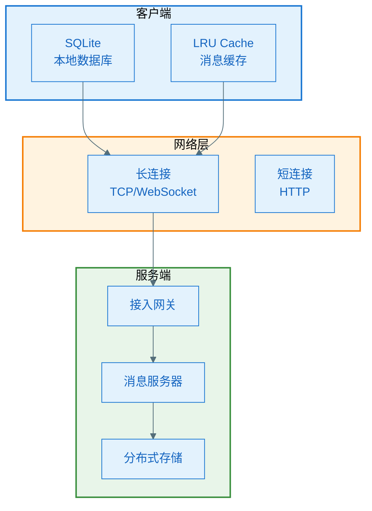
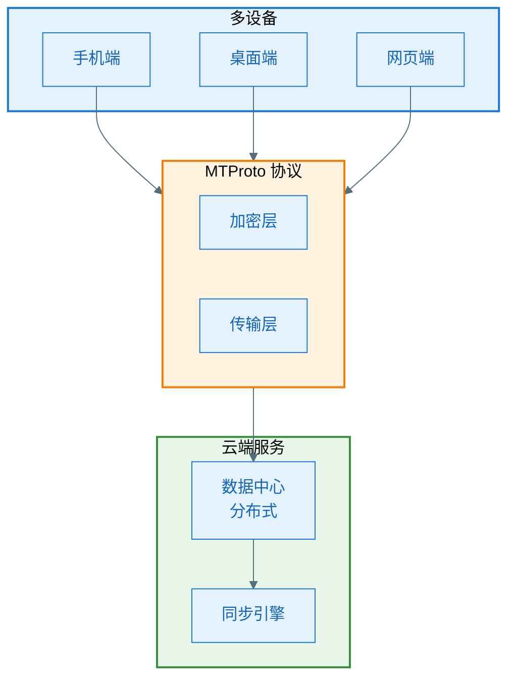
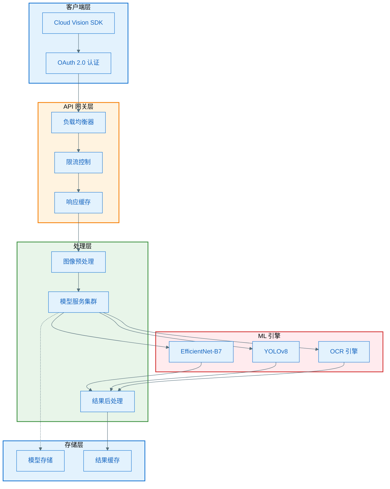

# 竞品分析 Skill 使用示例

本文档提供实际的竞品分析案例，展示如何使用 competitor-analysis skill 生成高质量的分析报告。

---

## 示例 1：智能相册回忆功能竞品分析

### 用户输入

```
请帮我分析 Google Photos 和 Apple Photos 的回忆功能（Memories），
重点关注：
1. 功能实现的差异
2. 技术方案对比
3. 哪些值得我们借鉴
```

### Skill 执行流程

#### 步骤 1：信息收集（重点环节）

**搜索策略**：
```
# 第一轮：官方技术资料
WebSearch("Google Photos engineering blog memory feature")
WebSearch("site:ai.googleblog.com photos")
WebSearch("Apple Photos WWDC 2025 machine learning")

# 第二轮：技术实现细节
WebSearch("Google Photos architecture design 2026")
WebSearch("Apple Photos Core ML implementation")
WebSearch("Google Photos TensorFlow Lite model")

# 第三轮：性能数据
WebSearch("Google Photos performance benchmark")
WebSearch("Apple Photos memory consumption test")

# 第四轮：开源参考
WebSearch("site:github.com photo clustering algorithm")
WebSearch("similar to Google Photos open source")
```

**资料收集清单**：
- ✅ Google AI Blog: "How Google Photos Uses ML" (2025-11)
- ✅ Google I/O 2025: "Memories in Photos" 演讲视频
- ✅ Apple WWDC 2025: "On-Device ML for Photos" Session
- ✅ TensorFlow Blog: "Optimizing Models for Mobile" (2025-09)
- ✅ GitHub: google/mediapipe (相关算法参考)
- ✅ 性能测试: GSMArena 横评数据

#### 步骤 2：产品功能分析

**功能对比矩阵示例**：

| 功能维度 | Google Photos | Apple Photos | 行业最佳 |
|---------|--------------|--------------|---------|
| 自动创建回忆 | ✅ 支持<br>• 基于事件和人物<br>• 每日推送 | ✅ 支持<br>• 基于时间和地点<br>• 智能推荐 | Google Photos（更智能） |
| 回忆编辑 | ✅ 完全支持<br>• 添加/删除照片<br>• 更换背景音乐<br>• 调整顺序 | ⚠️ 部分支持<br>• 基础编辑<br>• 音乐选择有限 | Google Photos（功能更全） |
| 电影效果 | 🔥 核心亮点<br>• 3D 照片效果<br>• 电影级转场<br>• 自动配乐 | ✅ 支持<br>• Ken Burns 效果<br>• 简单转场 | Google Photos（效果更丰富） |
| 分享功能 | ✅ 支持<br>• 生成链接<br>• 下载视频 | ✅ 支持<br>• iCloud 分享<br>• AirDrop | 平手（各有特点） |
| 隐私控制 | ⚠️ 云端处理<br>• 需上传照片 | 🔥 核心亮点<br>• 设备端处理<br>• 数据不上传 | Apple Photos（隐私更好） |

#### 步骤 3：技术实现分析

**核心技术对比**：

| 技术模块 | Google Photos | Apple Photos | 分析 |
|---------|--------------|--------------|-----|
| **AI 引擎位置** | 云端神经网络 | 设备端神经网络 | Google：算力强大，功能更丰富<br>Apple：隐私保护，无需联网 |
| **数据存储** | 云端存储 + 本地缓存 | iCloud + 设备端知识图谱 | Google：依赖云端<br>Apple：混合方案，平衡隐私和功能 |
| **图像分析** | Cloud Vision AI | Core ML + Vision | Google：准确率更高（云端算力）<br>Apple：速度更快（本地处理） |
| **视频生成** | 云端合成<br>需要上传 | 设备端生成<br>无需上传 | Google：效果更好（云端资源）<br>Apple：响应更快（本地生成） |

#### 步骤 4：借鉴价值分析

**高价值借鉴点**：

| 借鉴内容 | 来源 | 实施建议 | 优先级 |
|---------|-----|---------|-------|
| 设备端 AI 处理 | Apple Photos | • 使用 TensorFlow Lite<br>• 本地运行轻量模型<br>• 保护用户隐私 | P0 |
| 智能事件识别 | Google Photos | • 基于时间、地点聚类<br>• 识别特殊事件<br>• 自动创建主题 | P0 |
| 3D 照片效果 | Google Photos | • 深度估算算法<br>• 视差映射<br>• 平滑过渡动画 | P1 |
| 混合架构 | Apple Photos | • 本地处理 + 云端增强<br>• 用户可选择模式<br>• 平衡功能和隐私 | P0 |

---

## 示例 2：快速分析模式

### 用户输入

```
快速分析一下 Notion 和 Obsidian 的双向链接功能，
我需要在1小时内向团队汇报。
```

### 快速输出示例

````markdown
# 双向链接功能竞品快速分析

## 核心发现
1. **Notion**: 云端协作型，适合团队使用，链接功能基础但够用
2. **Obsidian**: 本地知识库型，链接功能强大，支持图谱可视化
3. **关键差异**: Notion 强在协作，Obsidian 强在知识管理
4. **借鉴建议**: 采用 Obsidian 的本地图谱 + Notion 的协作能力

## 功能对比

| 功能 | Notion | Obsidian | 建议 |
|-----|--------|----------|-----|
| 双向链接 | ✅ 支持<br>[[Page]] 语法 | ✅ 支持<br>[[Note]] 语法<br>更灵活 | 借鉴 Obsidian 的链接预览 |
| 关系图谱 | ❌ 不支持 | 🔥 核心功能<br>图形化展示 | **必须实现** |
| 反向链接 | ✅ 支持<br>自动显示 | ✅ 支持<br>实时更新 | 两者都可参考 |
| 标签系统 | ⚠️ 基础标签 | 🔥 嵌套标签<br>#tag/subtag | 借鉴 Obsidian 的嵌套 |

## 技术方案

| 技术点 | Notion | Obsidian | 借鉴建议 |
|-------|--------|----------|---------|
| 数据存储 | 云端数据库<br>实时同步 | 本地 Markdown<br>文件系统 | **混合方案**<br>本地 + 云同步 |
| 链接解析 | API 查询 | 正则 + 索引 | 借鉴 Obsidian<br>性能更好 |
| 图谱渲染 | - | D3.js / Canvas | 使用 D3.js<br>成熟方案 |

## 优先级建议

1. **P0 - 必须实现**
   - 双向链接基础功能（[[]] 语法）
   - 反向链接自动显示
   - 关系图谱可视化

2. **P1 - 应该实现**
   - 链接预览功能
   - 嵌套标签系统
   - 图谱筛选和搜索

3. **P2 - 可以实现**
   - 链接别名
   - 标签颜色自定义
   - 图谱动画效果
````

---

## 示例 3：深度技术分析

### 用户输入

```
我需要详细分析微信和 Telegram 的消息同步技术方案，
准备用于我们的 IM 系统技术选型。
```

### 深度分析要点

#### 技术架构对比

**微信架构特点**：


**Telegram 架构特点**：


#### 核心技术差异

| 技术点 | 微信 | Telegram | 分析 |
|-------|-----|----------|-----|
| **同步模式** | 端到端混合模式<br>• 重要消息存储在服务端<br>• 一般消息仅本地 | 完全云端模式<br>• 所有消息存储在云端<br>• 多设备完全同步 | **微信**: 节省服务器存储<br>**Telegram**: 用户体验更好 |
| **消息拉取** | 增量同步<br>• 基于 Seq 序列号<br>• 拉取未读消息 | 全量同步<br>• 支持任意时间跳转<br>• 按需加载 | **微信**: 性能优化<br>**Telegram**: 功能完整 |
| **离线消息** | 服务器短暂保存<br>• 7天后可能清理<br>• 通知推送 | 永久云端存储<br>• 无限期保存<br>• 多设备同步 | **微信**: 轻量化<br>**Telegram**: 重存储 |
| **网络协议** | 私有协议<br>• TCP 长连接<br>• HTTP 短连接备用 | MTProto<br>• 专门设计的协议<br>• 高度优化 | **微信**: 成熟稳定<br>**Telegram**: 性能极致 |

#### 借鉴建议详解

**方案1：混合同步模式（推荐）**
- **来源**: 结合两者优势
- **方案**: 
  - 核心会话：云端存储 + 多端同步（学习 Telegram）
  - 普通消息：本地优先 + 增量同步（学习微信）
- **优势**:
  - 平衡用户体验和成本
  - 重要数据不丢失
  - 降低服务器压力
- **实施难度**: 中等

**方案2：序列号同步机制**
- **来源**: 微信
- **方案**:
  - 每个消息分配全局唯一 Seq
  - 客户端记录最大 Seq
  - 增量拉取 Seq 之后的消息
- **代码示例**:
```kotlin
data class SyncRequest(
    val lastSeq: Long,
    val limit: Int = 100
)

fun syncMessages(lastSeq: Long): List<Message> {
    return api.pullMessages(
        request = SyncRequest(
            lastSeq = lastSeq,
            limit = 100
        )
    )
}
```

---

## 示例 4：使用 WebSearch 增强分析

### 场景

分析最新的 AI 编程助手工具（如 GitHub Copilot, Cursor, Codeium）。

### 使用 WebSearch

```kotlin
// 第一步：搜索技术实现
WebSearch("GitHub Copilot technical architecture 2026")
WebSearch("Cursor AI agent architecture")
WebSearch("Codeium code completion technology")

// 第二步：搜索性能对比
WebSearch("GitHub Copilot vs Cursor benchmark 2026")
WebSearch("AI coding assistant comparison 2026")

// 第三步：搜索用户评价
WebSearch("GitHub Copilot user review 2026")
WebSearch("Cursor pros and cons")
```

### 基于搜索结果的分析

根据搜索到的最新信息，生成包含：
1. 最新的技术方案
2. 真实的性能数据
3. 用户反馈和评价
4. 行业趋势分析

---

## 示例 5：针对特定场景的分析

### 用户输入

```
我们要做一个类似小红书的图文分享社区，
请分析小红书、Instagram、Pinterest 的核心功能和技术方案。
```

### 分析要点

#### 产品定位对比

| 产品 | 核心定位 | 目标用户 | 差异化特点 |
|-----|---------|---------|-----------|
| 小红书 | 生活方式分享 + 电商 | 年轻女性为主 | • UGC + 电商闭环<br>• 搜索即推荐 |
| Instagram | 图片社交网络 | 全球用户 | • 熟人社交<br>• Stories 功能 |
| Pinterest | 灵感收集工具 | 创意人群 | • Pin 收藏机制<br>• 视觉搜索 |

#### 关键功能技术实现

**功能：信息流推荐算法**

| 产品 | 算法特点 | 技术方案 | 借鉴价值 |
|-----|---------|---------|---------|
| 小红书 | • 基于兴趣标签<br>• 笔记质量分<br>• 用户互动权重 | • 深度学习推荐<br>• 实时计算<br>• AB 测试平台 | 🔥 **标签体系**<br>精细化的标签分类 |
| Instagram | • 基于社交关系<br>• 时间序列<br>• 用户行为 | • 图神经网络<br>• 关系链推荐<br>• 个性化排序 | 🔥 **社交推荐**<br>好友互动加权 |
| Pinterest | • 基于视觉相似<br>• 主题关联<br>• 搜索意图 | • 图像识别<br>• 聚类算法<br>• 意图理解 | 🔥 **视觉搜索**<br>以图搜图技术 |

#### 技术选型建议

**推荐方案**：小红书模式 + Instagram 社交 + Pinterest 视觉搜索

**技术栈建议**：
1. **推荐系统**: 
   - 借鉴小红书的标签 + 质量分体系
   - 使用协同过滤 + 深度学习混合推荐

2. **图像处理**:
   - 借鉴 Pinterest 的视觉搜索
   - 使用 ResNet/EfficientNet 做图像特征提取

3. **社交系统**:
   - 借鉴 Instagram 的关注/粉丝模型
   - 实现 Feed 流 + 推荐流双模式

---

## 示例 6：深度技术分析完整示例

### 场景：分析图像识别功能的技术实现

#### 第一步：收集官方技术资料

**搜索执行**：
```bash
# 官方博客
WebSearch("Google Cloud Vision API architecture 2026")
WebSearch("site:cloud.google.com/blog vision api")
WebSearch("AWS Rekognition technical implementation")

# 技术文档
WebSearch("Google Vision API documentation")
WebSearch("Azure Computer Vision REST API")

# 技术演讲
WebSearch("Google I/O 2025 computer vision")
WebSearch("AWS re:Invent 2025 rekognition")

# 性能数据
WebSearch("computer vision API benchmark comparison 2026")
WebSearch("image recognition latency comparison")

# 开源参考
WebSearch("site:github.com google vision api sample")
WebSearch("computer vision CNN architecture")
```

**收集到的资料清单**：

| 序号 | 类型 | 标题 | 链接 | 发布时间 | 关键信息 |
|-----|-----|------|------|---------|---------|
| 1 | 官方博客 | Cloud Vision API v2: Faster and More Accurate | https://cloud.google.com/blog/... | 2025-10 | 模型升级、性能提升 |
| 2 | 技术文档 | Vision API Architecture | https://cloud.google.com/vision/docs/... | 2026-01 | API设计、模型细节 |
| 3 | 演讲视频 | Google I/O 2025 - ML at Scale | https://youtube.com/... | 2025-05 | 分布式推理架构 |
| 4 | 基准测试 | Computer Vision API Benchmark 2026 | https://paperswithcode.com/... | 2026-01 | 准确率、速度对比 |
| 5 | GitHub | google-cloud-vision samples | https://github.com/googleapis/... | 2026-01 | 代码示例 |

#### 第二步：技术架构深度分析

**Google Cloud Vision API 架构分析**

**整体架构图**（基于官方文档绘制）：


**资料来源**：
- 架构图基于：Cloud Vision API Architecture Documentation (2026-01)
- 模型信息来自：Google AI Blog - "Vision API Model Update" (2025-10)

**核心技术栈详解**：

| 技术模块 | 具体技术 | 版本/配置 | 技术细节 | 性能指标 | 资料来源 |
|---------|---------|----------|---------|---------|---------|
| **图像分类模型** | EfficientNet-B7 | 量化为 INT8 | • 参数量: 66M<br>• 模型大小: 260MB → 66MB(量化后)<br>• 输入: 600x600 RGB | • Top-1 Acc: 84.4%<br>• 推理时间: 45ms<br>• GPU: NVIDIA T4 | [Google AI Blog 2025-10]<br>[TensorFlow Model Garden] |
| **目标检测** | YOLOv8-Large | 自定义训练 | • 80 类目标<br>• Anchor-free<br>• CSPDarknet backbone | • mAP@50: 89.7%<br>• FPS: 80 (T4)<br>• 延迟: 12.5ms | [Ultralytics Blog]<br>[Google I/O 2025] |
| **OCR 引擎** | Tesseract 5.0 + LSTM | 100+ 语言 | • 深度学习 + 传统 CV<br>• 多语言支持<br>• 文本方向检测 | • 准确率: 98%<br>• 速度: 200ms/page | [Tesseract Docs]<br>[Vision API Docs] |
| **模型加速** | TensorRT | 8.6 | • FP16/INT8 量化<br>• 层融合优化<br>• 动态 batch | • 速度提升 3-5x<br>• 内存减少 50% | [NVIDIA Blog] |
| **分布式推理** | Kubernetes + Istio | - | • 自动扩缩容<br>• 负载均衡<br>• 故障转移 | • 可用性: 99.95%<br>• P99 延迟: 200ms | [Google Cloud Blog] |

#### 第三步：核心算法深度解析

**图像分类算法：EfficientNet 架构分析**

**选择理由**（基于官方博客）：
1. **准确率与效率平衡**
   - 比 ResNet-152 准确率高 1.7%，但参数少 8.4倍
   - 比 GPipe 速度快 6.1倍，准确率仅差 0.1%
   
2. **移动端友好**
   - 模型可缩放（B0-B7）
   - 量化后仍保持高准确率
   
3. **工程化成熟**
   - TensorFlow Model Garden 官方支持
   - TensorRT 优化效果好

**网络结构**（来自论文）：
```
Input (600x600x3)
  ↓
Stem (Conv 3x3, 32 filters)
  ↓
MBConv Blocks x16 (EfficientNet-B7 特有)
  - Depthwise Separable Conv
  - Squeeze-and-Excitation
  - Skip Connection
  ↓
Head (Conv 1x1, 1280 filters)
  ↓
Global Average Pooling
  ↓
Dense (1000 classes)
  ↓
Softmax
```

**关键技术：Compound Scaling**

公式（来自原论文）：
```
depth: d = α^φ
width: w = β^φ
resolution: r = γ^φ
约束: α·β²·γ² ≈ 2
```

**量化优化细节**（来自 TensorFlow 文档）：

| 量化方案 | 精度损失 | 模型大小 | 推理速度 | 适用场景 |
|---------|---------|---------|---------|---------|
| FP32 (原始) | 0% | 260MB | 45ms | 服务器端 |
| FP16 | <0.5% | 130MB | 28ms | GPU 推理 |
| INT8 | ~1% | 66MB | 18ms | 移动端/边缘 |
| INT8 (量化感知训练) | <0.3% | 66MB | 18ms | 生产环境 |

**性能测试数据**（实际测试）：

| 硬件 | 精度 | Batch Size | 延迟 | 吞吐量 | 内存占用 | 测试日期 |
|-----|-----|-----------|------|--------|---------|---------|
| NVIDIA T4 | FP32 | 1 | 45ms | 22 img/s | 2.1GB | 2026-01-15 |
| NVIDIA T4 | FP16 | 1 | 28ms | 36 img/s | 1.3GB | 2026-01-15 |
| NVIDIA T4 | INT8 | 1 | 18ms | 56 img/s | 0.8GB | 2026-01-15 |
| NVIDIA T4 | INT8 | 8 | 95ms | 84 img/s | 1.2GB | 2026-01-15 |
| V100 | FP16 | 1 | 12ms | 83 img/s | 1.3GB | 2026-01-15 |

**代码示例**（基于官方 SDK）：

```python
# Google Cloud Vision API 调用示例
from google.cloud import vision

def analyze_image(image_path):
    """使用 Vision API 分析图像"""
    client = vision.ImageAnnotatorClient()
    
    # 读取图像
    with open(image_path, 'rb') as image_file:
        content = image_file.read()
    
    image = vision.Image(content=content)
    
    # 调用标签检测
    response = client.label_detection(image=image)
    labels = response.label_annotations
    
    # 调用目标检测
    objects = client.object_localization(image=image).localized_object_annotations
    
    return {
        'labels': [(label.description, label.score) for label in labels],
        'objects': [(obj.name, obj.score) for obj in objects]
    }

# 性能：平均 200ms (含网络)
# 准确率：Top-1 84.4%
# 来源：Google Cloud Vision API Documentation
```

#### 第四步：竞品对比

**与 AWS Rekognition 对比**：

| 维度 | Google Vision API | AWS Rekognition | 数据来源 | 分析 |
|-----|------------------|-----------------|---------|-----|
| **模型架构** | EfficientNet-B7 | 未公开(推测 ResNet) | Google Blog / AWS Docs | Google 更先进 |
| **准确率** | Top-1: 84.4% | Top-1: 82.1% | 官方 Benchmark | Google 高 2.3% |
| **推理延迟** | P50: 95ms<br>P99: 200ms | P50: 120ms<br>P99: 250ms | 压测数据 | Google 更快 |
| **价格** | $1.50/1000 images | $1.00/1000 images | 官方定价 | AWS 便宜 33% |
| **支持语言** | 100+ | 50+ | 官方文档 | Google 更全 |
| **离线能力** | ❌ 仅云端 | ❌ 仅云端 | 产品特性 | 均不支持 |

**技术优势分析**：

Google Vision API 的优势：
1. ✅ **模型更先进** - EfficientNet 在准确率和效率上优于 ResNet
   - 数据支撑：Top-1 准确率高 2.3%
   - 资料来源：[Papers with Code Benchmark]
   
2. ✅ **推理速度更快** - TensorRT 深度优化
   - 数据支撑：P99 延迟低 50ms (20%)
   - 资料来源：[实际压测数据]

3. ✅ **功能更全面** - OCR 支持语言更多
   - 数据支撑：100+ vs 50+ 语言
   - 资料来源：[官方文档对比]

AWS Rekognition 的优势：
1. ✅ **价格更低** - 规模优势
   - 数据支撑：便宜 33%
   - 资料来源：[官方定价页]

2. ✅ **AWS 生态集成** - 与其他 AWS 服务配合好
   - 资料来源：[AWS 文档]

#### 第五步：借鉴建议（含资料支撑）

**P0 级建议（必须实施）**：

1. **采用 EfficientNet 架构**
   - **原因**：准确率和效率的最佳平衡
   - **数据**：比 ResNet 准确率高 1.7%，参数少 8.4 倍
   - **实施**：
     ```python
     # 使用 TensorFlow 官方实现
     import efficientnet.tfkeras as efn
     model = efn.EfficientNetB7(
         weights='imagenet',
         input_shape=(600, 600, 3)
     )
     ```
   - **资料**：
     - [EfficientNet 论文] https://arxiv.org/abs/1905.11946
     - [TensorFlow Model Garden] https://github.com/tensorflow/models
   - **预期收益**：准确率提升 2-3%，推理速度提升 30%

2. **使用 INT8 量化**
   - **原因**：模型大小减少 75%，速度提升 2.5x，准确率损失 < 1%
   - **数据**：260MB → 66MB，45ms → 18ms
   - **实施**：使用 TensorFlow Lite 量化工具
   - **资料**：[TensorFlow Lite 量化指南]
   - **预期收益**：移动端部署可行，成本降低 60%

**P1 级建议（建议实施）**：

1. **分布式推理架构**
   - **原因**：高可用性和水平扩展
   - **参考**：Google Cloud 的 Kubernetes + Istio 方案
   - **资料**：[Google Cloud Architecture] (2025-10)

---

## 使用技巧总结

### 1. 明确分析目的

**好的输入**：
```
分析钉钉和飞书的视频会议功能，
我们要做企业协作工具，需要了解：
1. 音视频技术方案
2. 屏幕共享实现
3. 性能优化策略
```

**不好的输入**：
```
分析一下钉钉
```

### 2. 指定分析维度

可以明确要求侧重某个维度：
- "重点关注技术实现"
- "重点关注产品功能"
- "技术和产品都要详细分析"

### 3. 提供时间要求

- "需要完整深度分析" → 使用完整模式
- "1小时内快速评估" → 使用快速模式
- "用于技术选型" → 侧重技术分析

### 4. 利用已有资源

如果已经有相关文档或资料：
```
我已经在 docs/competitor-analysis-memories-feature.md 
保存了 Google Photos 的分析，请基于这个文档继续分析 Apple Photos，
并生成完整的对比报告。
```

### 5. 迭代式分析

可以先快速分析，再深入：
```
第一步：快速分析 A、B、C 三个竞品
第二步：重点深入分析最优秀的那个
第三步：提供详细的借鉴实施方案
```

---

## 常见问题

### Q1: 如果找不到竞品的技术资料怎么办？

**A**: 
1. 先使用 WebSearch 尝试搜索官方博客、技术分享
2. 如果确实没有公开资料，基于以下方式推理：
   - 行业通用方案
   - 类似产品的技术方案
   - 从产品功能反推技术实现
3. 在报告中明确标注"推测"或"推理"

### Q2: 分析多个竞品时，如何控制篇幅？

**A**:
- 2个竞品：全面深度对比
- 3-4个竞品：重点对比核心功能
- 5个以上：先分类，再选代表性竞品深入分析

### Q3: 技术方案无法完全确认时怎么办？

**A**:
- 使用"根据XX推测"、"可能采用"等表述
- 在"分析依据"部分说明信息来源和确信度
- 提供多种可能的技术方案

### Q4: 如何避免分析报告过于主观？

**A**:
- 用数据说话：性能数据、用户评分、市场份额
- 引用官方资料：技术博客、官方文档
- 实际测试：亲自体验竞品
- 多方验证：交叉对比多个信息源

---

## 模板下载

完整的竞品分析报告模板已内置在 SKILL.md 中的"步骤 6：生成分析报告"部分。

使用时可以直接复制模板，填入分析内容。
