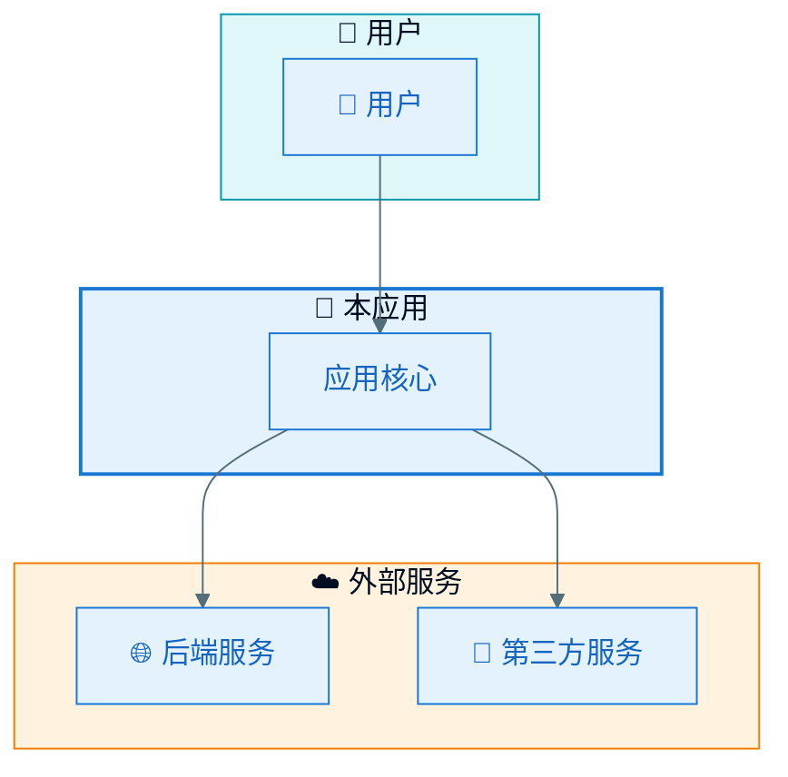
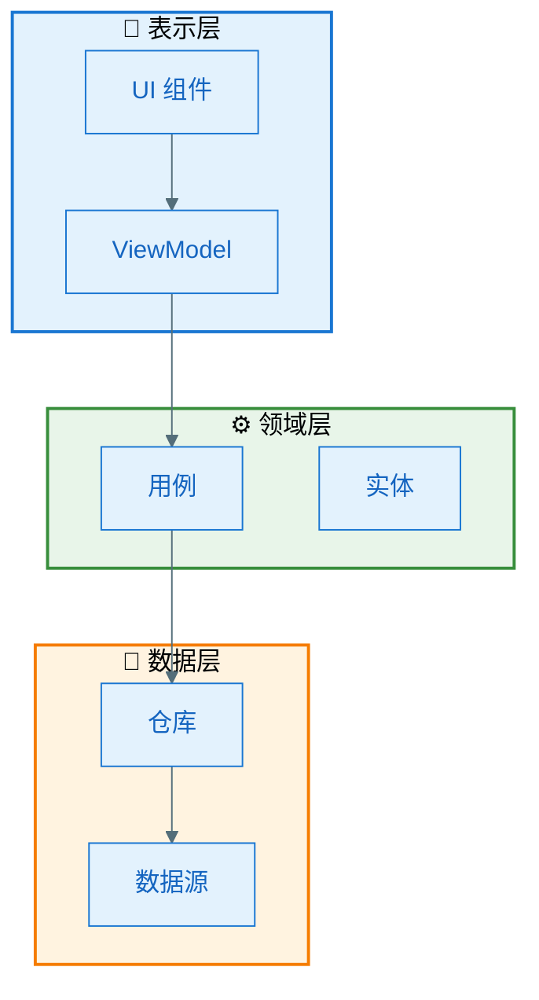
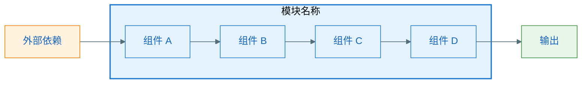
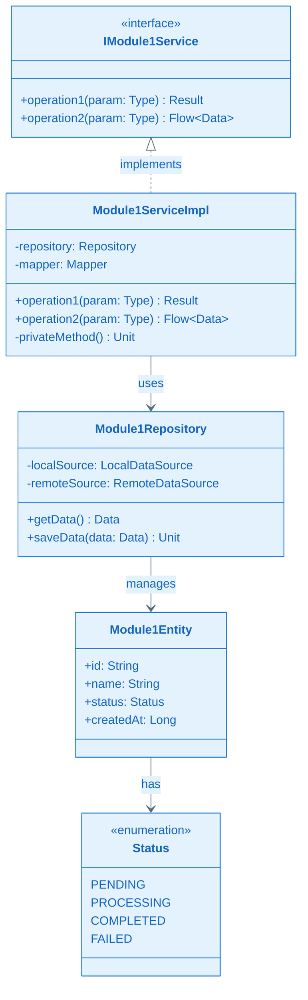
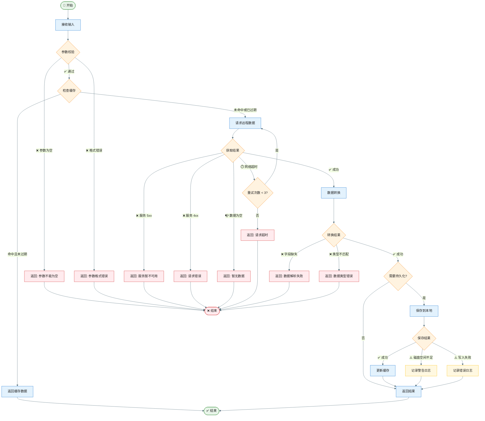
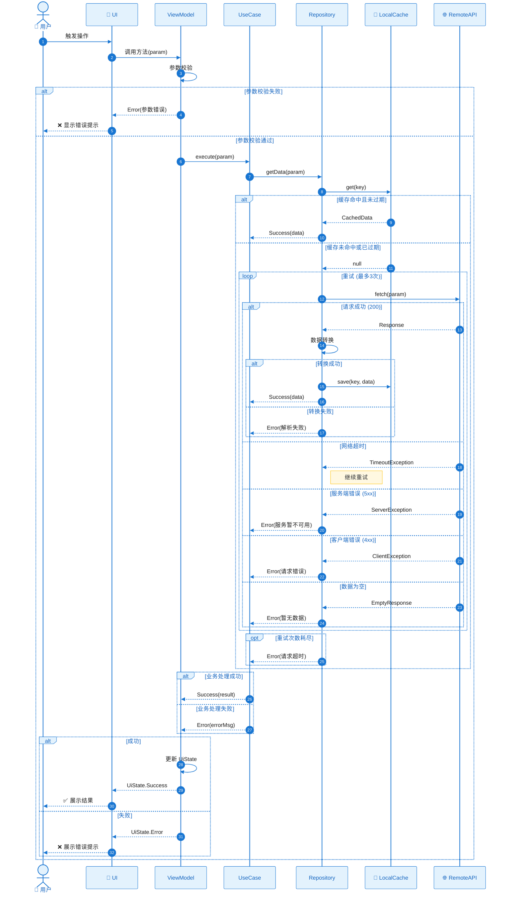

# 设计方案

根据需求分析结果或需求描述，生成结构化的技术设计方案文档。适用于中小型需求的快速设计。

## 输入要求

以下信息至少提供一项：
- 需求分析文档
- 功能需求描述
- 产品需求说明

如信息不足，优先询问：
1. 核心功能是什么？
2. 有哪些关键业务流程？
3. 是否有技术约束或偏好？

## 设计流程

### 步骤 1：理解需求边界

1. 明确功能范围和核心价值
2. 识别关键业务流程
3. 确定技术约束条件
4. 识别外部依赖（API、SDK、数据库）

### 步骤 2：架构设计

分层输出架构设计，从整体到细节。

### 步骤 3：模块设计

为每个关键模块提供详细设计，包含图表和说明。

### 步骤 4：生成设计文档

使用以下模板输出完整设计方案。

---

## 图表核心要求

### 流程图要求（必须遵守）

流程图**必须包含所有分支和异常流程**：
- ✅ 所有条件判断的每个分支
- ✅ 所有可能的异常情况（网络错误、数据为空、格式错误等）
- ✅ 所有边界条件处理
- ✅ 重试、降级、回滚等容错路径

### 时序图要求（必须遵守）

时序图**必须包含所有异常流程和分支流程**：
- ✅ 正常流程（主路径）
- ✅ 所有异常分支（网络超时、服务异常、数据错误等）
- ✅ 重试机制（如有）
- ✅ 降级策略（如有）
- ✅ 使用 alt/else/opt/loop 等片段表示分支

### 图表配色规范

> 详见 `.cursor/rules/mermaid-style-guide.mdc`

所有图表必须使用 Material Design 配色方案。

---

## 文档模板

```markdown
# [功能名称] 设计方案

> 设计版本：v1.0
> 设计时间：YYYY-MM-DD
> 需求来源：[链接或说明]

## 1. 设计概述

### 1.1 功能简述

[1-2 段描述要实现的功能]

### 1.2 设计目标

- **功能目标**：[要实现什么]
- **质量目标**：[性能/可靠性/可扩展性要求]
- **约束条件**：[技术限制、时间限制等]

### 1.3 核心挑战

1. [挑战 1]：[简要说明]
2. [挑战 2]：[简要说明]

---

## 2. 0 层架构设计（系统全景）

### 2.1 系统上下文图

展示系统与外部实体的关系。



### 2.2 系统边界定义

| 边界 | 在边界内 | 在边界外 |
|------|----------|----------|
| 功能边界 | [本次实现的功能] | [不在本次范围的功能] |
| 技术边界 | [本次涉及的技术栈] | [不涉及的部分] |

### 2.3 外部依赖

| 依赖项 | 类型 | 提供能力 | 通信方式 | 可用性 |
|--------|------|----------|----------|--------|
| [依赖 1] | API/SDK | [能力描述] | HTTP/本地 | [稳定性] |

---

## 3. 1 层架构设计（模块划分）

### 3.1 模块架构图



### 3.2 模块职责表

| 模块 | 职责 | 输入 | 输出 | 依赖 |
|------|------|------|------|------|
| [模块 1] | [职责描述] | [输入数据] | [输出数据] | [依赖模块] |
| [模块 2] | [职责描述] | [输入数据] | [输出数据] | [依赖模块] |

### 3.3 模块间通信

| 通信路径 | 通信方式 | 数据格式 | 说明 |
|----------|----------|----------|------|
| A → B | 方法调用/事件/回调 | [数据类型] | [补充说明] |

---

## 4. 关键模块设计

### 4.1 模块一：[模块名称]

#### 4.1.1 框架图

展示模块的整体结构和组件关系。



#### 4.1.2 设计说明

**设计目标**：
- [目标 1]
- [目标 2]

**工作原理**：

[详细描述模块如何工作，包括核心算法、状态管理、数据流转等]

**设计决策**：

| 决策点 | 选择方案 | 备选方案 | 选择原因 |
|--------|----------|----------|----------|
| [决策 1] | [选择] | [备选] | [原因] |

#### 4.1.3 类图



#### 4.1.4 流程图（含所有分支和异常）

展示模块内部的处理流程，**必须包含所有分支和异常流程**。



#### 4.1.5 时序图（含所有分支和异常）

**必须包含所有异常分支**，使用 alt/else/opt/loop 片段。



---

### 4.2 模块二：[模块名称]

#### 4.2.1 框架图

```mermaid
%%{init: {'theme': 'base', 'themeVariables': { 'primaryColor': '#E3F2FD', 'primaryTextColor': '#1565C0', 'primaryBorderColor': '#1976D2', 'lineColor': '#546E7A'}}}%%
flowchart LR
    [按照 4.1.1 格式]

    style ... fill:#E3F2FD,stroke:#1976D2
```

#### 4.2.2 设计说明

[按照 4.1.2 格式]

#### 4.2.3 类图

```mermaid
%%{init: {'theme': 'base', 'themeVariables': { 'primaryColor': '#E3F2FD', 'primaryTextColor': '#1565C0', 'primaryBorderColor': '#1976D2', 'lineColor': '#546E7A'}}}%%
classDiagram
    [按照 4.1.3 格式]
```

#### 4.2.4 流程图（含所有分支和异常）

```mermaid
%%{init: {'theme': 'base', 'themeVariables': { 'primaryColor': '#E3F2FD', 'primaryTextColor': '#212121', 'primaryBorderColor': '#1976D2', 'lineColor': '#546E7A'}}}%%
flowchart TD
    [按照 4.1.4 格式，必须包含所有分支和异常]
    
    style ... fill:#E3F2FD,stroke:#1976D2
    style ...Error fill:#FFEBEE,stroke:#D32F2F
    style ...Decision fill:#FFF3E0,stroke:#F57C00
```

#### 4.2.5 时序图（含所有分支和异常）

```mermaid
%%{init: {'theme': 'base', 'themeVariables': { 'actorBkg': '#E3F2FD', 'actorBorder': '#1976D2', 'actorTextColor': '#1565C0', 'signalColor': '#1976D2', 'signalTextColor': '#212121', 'noteBkgColor': '#FFF8E1', 'noteBorderColor': '#FFC107'}}}%%
sequenceDiagram
    [按照 4.1.5 格式，必须使用 alt/else/opt/loop 表示所有分支]
```

---

### 4.n 模块 N：[模块名称]

[重复上述结构]

---

## 5. 二层详细设计

### 5.1 数据模型设计

#### 5.1.1 核心实体

```kotlin
// 实体定义
data class [EntityName](
    val id: String,
    val field1: Type,  // 字段说明
    val field2: Type,  // 字段说明
    val status: Status,
    val createdAt: Long,
    val updatedAt: Long
)

// 状态定义
sealed class [State] {
    object Idle : [State]()
    object Loading : [State]()
    data class Success(val data: Data) : [State]()
    data class Error(val message: String) : [State]()
}
```

#### 5.1.2 数据表设计（如有本地存储）

```kotlin
@Entity(tableName = "table_name")
data class [EntityTable](
    @PrimaryKey val id: String,
    @ColumnInfo(name = "field_name") val field: Type,
    // ...
)
```

### 5.2 接口定义

#### 5.2.1 对外接口

```kotlin
interface [PublicInterface] {
    /**
     * 接口说明
     * @param param 参数说明
     * @return 返回值说明
     */
    suspend fun operation(param: Type): Result<Output>
}
```

#### 5.2.2 内部接口

```kotlin
internal interface [InternalInterface] {
    fun internalOperation(param: Type): Output
}
```

### 5.3 关键算法

#### 算法 1：[算法名称]

**目的**：[算法要解决的问题]

**复杂度**：时间 O(n)，空间 O(1)

**伪代码**：
```
function algorithmName(input):
    // 步骤 1: 初始化
    result = init()
    
    // 步骤 2: 核心处理
    for each item in input:
        process(item)
    
    // 步骤 3: 返回结果
    return result
```

### 5.4 异常处理设计

| 异常场景 | 异常类型 | 处理方式 | 用户提示 |
|----------|----------|----------|----------|
| 参数为空 | IllegalArgumentException | 校验拦截 | "请输入完整信息" |
| 网络超时 | TimeoutException | 重试3次后失败 | "网络连接超时，请重试" |
| 服务异常 | ServerException | 返回错误 | "服务暂不可用" |
| 数据为空 | EmptyDataException | 返回空状态 | "暂无数据" |
| 解析失败 | ParseException | 记录日志 | "数据加载失败" |
| 存储失败 | IOException | 降级处理 | 静默失败，不影响主流程 |

### 5.5 边界条件处理

| 边界条件 | 处理方式 | 说明 |
|----------|----------|------|
| 空数据 | 返回空状态 UI | 显示"暂无数据"占位图 |
| 数据量过大 | 分页加载 | 每页 20 条，支持上拉加载 |
| 网络异常 | 显示缓存 + 提示 | 优先显示缓存数据，toast 提示网络异常 |
| 并发请求 | 取消旧请求 | 使用 Job 管理，新请求取消旧请求 |
| 内存不足 | 降级策略 | 减少缓存大小，清理临时数据 |

---

## 6. 技术选型

| 领域 | 选择 | 备选 | 选择原因 |
|------|------|------|----------|
| 异步处理 | Kotlin Coroutines | RxJava | [原因] |
| 状态管理 | StateFlow | LiveData | [原因] |
| 本地存储 | Room | SQLite | [原因] |
| 网络请求 | Retrofit | Ktor | [原因] |

---

## 7. 风险与应对

| 风险 | 影响 | 概率 | 应对措施 |
|------|------|------|----------|
| [风险 1] | 高/中/低 | 高/中/低 | [应对策略] |
| [风险 2] | 高/中/低 | 高/中/低 | [应对策略] |

---

## 8. 待确认事项

1. [待确认项 1]
2. [待确认项 2]

---

## 附录

### A. 术语表

| 术语 | 定义 |
|------|------|
| [术语 1] | [定义] |

### B. 参考资料

- [参考链接或文档]
````

---

## 输出位置

将设计文档保存至：
- `docs/designs/[feature-name]-design.md`

## 快速设计模式

对于小型需求，可使用精简版：

````markdown
# [功能名称] 设计方案（精简版）

## 架构概览
[一张模块架构图 - Material Design 配色]

## 核心模块
### 模块 1
- **职责**：
- **类图**：[Mermaid classDiagram]
- **流程**：[Mermaid flowchart，含异常分支]

### 模块 2
...

## 关键实体
[数据模型定义]

## 接口定义
[核心接口签名]

## 异常处理
[异常场景表]
````

## 设计质量检查

- [ ] 架构图清晰展示系统边界
- [ ] 模块职责单一、边界清晰
- [ ] 每个模块有完整的 5 张图
- [ ] 类图包含所有关键类和接口
- [ ] **流程图包含所有分支和异常路径**
- [ ] **时序图使用 alt/else/opt/loop 覆盖所有分支**
- [ ] **所有图表使用 Material Design 配色**
- [ ] 数据模型定义完整
- [ ] 异常处理有明确设计
