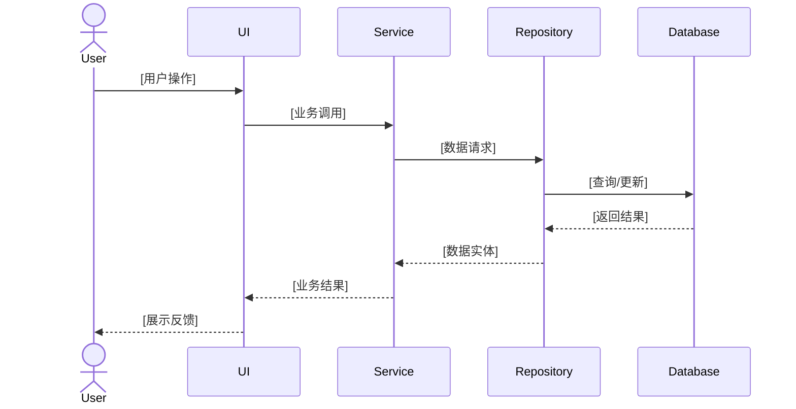

# Feature Documentation Generator

为项目中的业务功能自动生成结构化文档，包含业务视角和技术实现两个层面。

## 文档认知模型

```
Feature（业务功能）
 ├─ 业务文档（给人看）
 │   ├─ 业务背景与目标
 │   ├─ 核心业务概念
 │   ├─ 用户视角的业务流程
 │   ├─ 关键业务规则
 │   ├─ 业务状态与状态流转
 │   └─ 典型业务场景
 │
 └─ 技术实现文档（给工程师）
     ├─ 架构全景（0 层视图）
     │   ├─ 模块全景类图
     │   ├─ 数据流方向
     │   └─ 外部依赖关系
     │
     ├─ 端到端流程（核心业务流程）
     │   ├─ 正常流程时序图
     │   ├─ 异常流程时序图
     │   └─ 关键步骤说明
     │
     ├─ 模块拆解（1 层视图）
     │   ├─ 模块职责表
     │   ├─ Module A（深入）
     │   │   ├─ 模块定位与设计目标
     │   │   ├─ 核心数据结构/状态
     │   │   ├─ 对外接口（协议）
     │   │   ├─ 策略与算法
     │   │   ├─ 失败与降级
     │   │   └─ 优缺点与替代方案
     │   ├─ Module B（深入）
     │   └─ Module C（深入）
     │
     ├─ 类图（详细设计）
     │   ├─ 每个模块的详细类图
     │   ├─ 类之间的关联关系
     │   └─ 关键方法签名
     │
     ├─ 核心数据模型
     │   ├─ 关键对象定义
     │   ├─ 生命周期
     │   └─ 数据流转路径
     │
     ├─ 关键代码路径
     │   ├─ 关键技术与算法
     │   ├─ 异常处理与稳定性
     │   └─ 性能优化点
     │
     └─ 扩展点
         ├─ 可插拔接口
         └─ 已知技术债
```

## 适用场景

- 新功能上线，需要补齐项目文档
- 新人入职，需要快速理解某个业务模块
- 存量系统缺乏结构化文档
- 代码 Review / 架构演进前做系统梳理

## 核心原则

### 1. 基于事实，而非臆测

所有内容必须来源于：
- 代码结构
- 命名
- 注释
- 配置
- 已提供上下文

**不得凭经验"补全业务"**

### 2. 明确区分信息确定性

使用以下标记：
- ✅ **已确认信息**（From Code / Config）
- ⚠️ **合理推断**（Inference Based on Code）

### 3. 新人优先（New Joiner First）

默认读者：第一次接触该模块的工程师

禁止：
- 只给结论不给背景
- 直接引用类名代替概念说明（业务文档中）

## 使用流程

### 步骤 1：理解需求

当用户请求"创建XX功能的文档"时：

1. 确认功能范围：明确用户指的是哪个模块/包/功能
2. 询问是否需要两类文档，还是只需要其中一类：
   - 业务文档（Business Documentation）
   - 技术实现文档（Technical Documentation）
   - 两者都需要（默认）

### 步骤 2：代码探索

按照认知模型的层次结构收集信息：

#### 2.1 架构全景探索

1. **识别代码边界**：
   - 使用 Glob 找到相关的代码文件
   - 使用 SemanticSearch 理解："XX功能涉及哪些模块？"
   - 识别外部依赖（数据库、API、第三方库）

2. **绘制模块全景**：
   - 识别所有关键类和接口
   - 理解模块间的依赖关系
   - 确定数据流方向

#### 2.2 端到端流程探索

1. **主流程识别**：
   - 使用 SemanticSearch："XX功能的主流程是什么？"
   - 追踪从用户操作到系统响应的完整路径
   - 识别关键步骤和决策点

2. **异常流程识别**：
   - 查找 try-catch、错误处理代码
   - 识别降级策略和容错机制
   - 理解失败场景的处理方式

#### 2.3 模块拆解探索

1. **分析关键模块**：
   - 阅读核心类、接口、方法
   - 理解每个模块的职责边界
   - 识别模块的输入输出

2. **深入模块细节**：
   - 核心数据结构和状态管理
   - 对外接口和协议定义
   - 关键算法和策略实现

#### 2.4 业务概念提取

1. **提取业务概念**：
   - 从类名、方法名提取业务术语
   - 阅读注释理解业务规则
   - 识别状态机、流程节点

2. **收集配置信息**：
   - 查找配置文件、常量定义
   - 查找业务规则的硬编码部分

### 步骤 3：生成文档

根据[文档模板](#文档模板)生成相应的文档。

生成时：
- **业务文档**：不出现类名、方法名、表名
- **技术文档**：包含详细的类图、时序图、数据模型
- 对于不确定的信息，使用 ⚠️ 标记并说明推断依据

### 步骤 4：输出文件

将生成的文档保存到项目中的 `docs/features/` 目录：

```
docs/
└── features/
    └── [feature-name]/
        ├── business.md       # 业务文档
        └── technical.md      # 技术实现文档
```

## 文档模板

### 业务文档模板

```markdown
# [Feature 名称]｜业务文档

## 1. 业务背景与目标

### 1.1 该功能解决的业务问题
[描述业务场景和痛点]

### 1.2 在整体业务中的位置
[说明该功能在整个系统中的角色]

---

## 2. 核心业务概念说明

| 概念 | 定义 | 备注 |
|------|------|------|
| [概念1] | [定义] | [补充说明] |
| [概念2] | [定义] | [补充说明] |

---

## 3. 用户视角的业务流程

### 3.1 主流程

[使用顺序列表或流程图描述主要业务流程]

### 3.2 异常 / 中断流程

[描述可能的异常情况及处理方式]

---

## 4. 关键业务规则

### 规则 1：[规则名称]

- **规则描述**：[详细说明]
- **生效原因**：[为什么需要这个规则]
- **边界与例外**：[特殊情况]

### 规则 2：[规则名称]

...

---

## 5. 业务状态与状态流转

### 5.1 状态定义

| 状态 | 含义 | 备注 |
|------|------|------|
| [状态1] | [说明] | [补充] |
| [状态2] | [说明] | [补充] |

### 5.2 状态流转图

[状态机图或流转说明]

---

## 6. 典型业务场景

### 场景 1：[场景名称]

- **场景描述**：[情境说明]
- **业务行为**：[系统如何响应]

### 场景 2：[场景名称]

...

---

## 7. 非目标与历史说明

### 7.1 当前不支持的能力
[列出明确不在范围内的功能]

### 7.2 已知限制
[当前的技术或业务限制]

---

## 信息来源说明

本文档基于以下来源生成：
- ✅ 已确认：[列出代码文件、配置文件]
- ⚠️ 合理推断：[列出推断的内容及依据]
```

### 技术实现文档模板

```markdown
# [Feature 名称]｜技术实现文档

## 1. 架构全景（0 层视图）

### 1.1 模块全景类图

```mermaid
classDiagram
    %% 包含所有关键类、接口及其关联关系
    %% 显示模块间的依赖方向
    %% 标注外部系统/依赖
```

### 1.2 数据流方向

[说明数据如何在各个模块间流动，从输入到输出的完整路径]

### 1.3 外部依赖关系

| 外部系统/依赖 | 类型 | 关键能力 | 通信方式 | 故障模式 | 应对策略 |
|--------------|------|---------|---------|---------|---------|
| [依赖1] | [API/数据库/第三方库] | [提供什么能力] | [HTTP/RPC/本地调用] | [可能的失败] | [降级/重试] |

---

## 2. 端到端流程（核心业务流程）

### 2.1 主流程时序图



**关键步骤说明**：
1. [步骤1]：[详细说明该步骤的作用、输入输出、关键逻辑]
2. [步骤2]：[详细说明]
...

### 2.2 异常流程时序图

```mermaid
sequenceDiagram
    [展示异常场景的处理流程]
    [包含超时、失败、降级等分支]
```

**异常处理说明**：
- **场景1**：[异常触发条件] → [处理方式] → [用户感知]
- **场景2**：[异常触发条件] → [处理方式] → [用户感知]

---

## 3. 模块拆解（1 层视图）

### 3.1 模块职责表

| 模块 | 输入 | 输出 | 职责 | 非职责 |
|------|------|------|------|--------|
| [模块1] | [输入] | [输出] | [负责什么] | [不负责什么] |
| [模块2] | [输入] | [输出] | [负责什么] | [不负责什么] |

### 3.2 Module A：[模块名称]（深入）

#### 模块定位与设计目标

- **模块定位**：[在整体架构中的位置和角色]
- **设计目标**：[该模块要解决的核心问题]
- **设计约束**：[性能/内存/兼容性等约束]

#### 核心数据结构/状态

```kotlin
// 关键数据结构示例
data class [Entity] {
    val field1: Type  // [字段说明]
    val field2: Type  // [字段说明]
}

// 状态管理
sealed class [State] {
    object Idle : [State]()
    data class Loading(val progress: Int) : [State]()
    data class Success(val data: Data) : [State]()
    data class Error(val error: Throwable) : [State]()
}
```

#### 对外接口（协议）

```kotlin
interface [ModuleInterface] {
    suspend fun operation1(param: Type): Result<Output>
    fun operation2(param: Type): Flow<Output>
}

// 错误码定义
sealed class [ModuleError] {
    data class ValidationError(val field: String) : [ModuleError]()
    data class NetworkError(val code: Int) : [ModuleError]()
}
```

#### 策略与算法

- **策略1**：[策略名称]
  - 目标：[为什么需要这个策略]
  - 实现：[如何实现]
  - 权衡：[优缺点]

- **算法1**：[算法名称]
  - 复杂度：[时间/空间复杂度]
  - 适用场景：[什么情况下使用]
  - 实现要点：[关键代码逻辑]

#### 失败与降级

- **失败场景1**：[触发条件] → [处理方式] → [恢复策略]
- **降级策略**：[什么情况下降级] → [降级到什么程度] → [如何恢复]

#### 优缺点与替代方案

- **当前方案优点**：[列举优势]
- **当前方案缺点/代价**：[列举不足]
- **替代方案**：[其他可选方案]
- **否决理由**：[为什么不选择替代方案]

### 3.3 Module B：[模块名称]（深入）

[按照相同结构展开]

### 3.4 Module C：[模块名称]（深入）

[按照相同结构展开]

---

## 4. 类图（详细设计）

### 4.1 Module A 详细类图

```mermaid
classDiagram
    class [ClassName1] {
        -privateField: Type
        +publicField: Type
        +method1(param: Type): ReturnType
        +method2(param: Type): ReturnType
    }
    
    class [ClassName2] {
        +method1()
        +method2()
    }
    
    [ClassName1] --> [ClassName2] : 依赖
    [ClassName1] --|> [Interface] : 实现
```

### 4.2 Module B 详细类图

[类似结构]

---

## 5. 核心数据模型

### 5.1 关键对象定义

#### [对象名称1]

- **作用**：[该对象在系统中的作用]
- **生命周期**：
  - 创建：[何时创建，由谁创建]
  - 使用：[在哪些场景使用]
  - 销毁：[何时销毁，如何清理]
- **可变性**：[可变/不可变，为什么]
- **关键字段**：
  ```kotlin
  data class [ObjectName](
      val field1: Type,  // [字段说明]
      val field2: Type,  // [字段说明]
      var field3: Type   // [可变字段说明]
  )
  ```

#### [对象名称2]

[类似结构]

### 5.2 数据流转路径

```
[输入数据] 
    ↓
[转换1：Module A] → [中间对象1]
    ↓
[转换2：Module B] → [中间对象2]
    ↓
[转换3：Module C] → [输出数据]
```

**关键转换点说明**：
- **转换1**：[为什么转换，如何转换，数据变化]
- **转换2**：[为什么转换，如何转换，数据变化]

---

## 6. 关键代码路径

### 6.1 关键技术与算法

#### 技术点1：[技术名称]

- **设计目标**：[为什么需要这个技术]
- **方案选择原因**：[为什么选择当前方案]
- **Trade-off**：
  - 优点：[列举优势]
  - 缺点：[列举不足]
- **实现要点**：
  ```kotlin
  // 关键代码示例
  fun keyFunction() {
      // 核心逻辑
  }
  ```

#### 算法1：[算法名称]

- **算法目标**：[解决什么问题]
- **复杂度分析**：时间 O(n)，空间 O(1)
- **实现要点**：[关键步骤]

### 6.2 异常处理与稳定性

#### 超时处理

- **检测方式**：[如何检测超时]
- **超时阈值**：[多长时间算超时]
- **处理策略**：[超时后如何处理]

#### 失败重试

- **重试场景**：[什么情况下重试]
- **重试策略**：[重试次数、间隔、退避算法]
- **放弃条件**：[什么情况下放弃重试]

#### 降级策略

- **降级触发条件**：[什么情况下降级]
- **降级行为**：[降级到什么程度]
- **恢复机制**：[如何恢复正常]

### 6.3 性能优化点

- **优化点1**：[优化目标] → [优化手段] → [效果]
- **优化点2**：[优化目标] → [优化手段] → [效果]

---

## 7. 扩展点

### 7.1 可插拔接口

#### 接口1：[接口名称]

- **扩展场景**：[什么情况下需要扩展]
- **接口定义**：
  ```kotlin
  interface [InterfaceName] {
      fun method1(): ReturnType
      fun method2(): ReturnType
  }
  ```
- **实现示例**：
  ```kotlin
  class [Implementation1] : [InterfaceName] { ... }
  class [Implementation2] : [InterfaceName] { ... }
  ```

#### 接口2：[接口名称]

[类似结构]

### 7.2 已知技术债

#### 技术债1：[债务描述]

- **问题描述**：[当前实现的问题]
- **影响范围**：[影响哪些功能或性能]
- **改进方向**：[如何改进]
- **预计工作量**：[改进需要多少时间]

#### 技术债2：[债务描述]

[类似结构]

---

## 8. 相关代码清单

### 核心类列表

| 类名 | 文件路径 | 职责 | 关键方法 |
|------|----------|------|---------|
| [类1] | [路径] | [说明] | [method1, method2] |
| [类2] | [路径] | [说明] | [method1, method2] |

### 配置文件

| 文件 | 路径 | 说明 | 关键配置项 |
|------|------|------|-----------|
| [配置1] | [路径] | [说明] | [key1, key2] |

---

## 信息来源说明

本文档基于以下代码分析生成：
- ✅ 已确认：[列出分析的代码文件]
- ⚠️ 合理推断：[列出推断的内容及依据]
```

## 实施规范

### 禁止事项

**业务文档中禁止**：
- 出现类名、方法名、表名
- 直接描述技术实现
- 使用技术术语代替业务概念

**技术文档中禁止**：
- 遗漏关键类的类图
- 省略时序图中的关键步骤
- 不说明设计决策的原因

### 必须事项

**必须做到**：
- 所有业务规则必须有代码依据
- 所有类图必须包含关键关联关系
- 所有时序图必须包含异常分支
- 不确定的内容必须标注 ⚠️ 并说明推断依据

## 质量检查清单

生成文档后，使用此清单自查：

### 业务文档
- [ ] 没有出现任何类名、方法名、表名
- [ ] 业务概念有清晰定义
- [ ] 业务流程可以被非技术人员理解
- [ ] 所有业务规则都有明确来源
- [ ] 不确定的信息已标注 ⚠️

### 技术文档

#### 架构全景
- [ ] 包含完整的模块全景类图
- [ ] 数据流方向清晰
- [ ] 外部依赖关系明确

#### 端到端流程
- [ ] 主流程时序图完整
- [ ] 异常流程时序图完整
- [ ] 关键步骤有详细说明

#### 模块拆解
- [ ] 模块职责表清晰
- [ ] 每个关键模块都有深入分析
- [ ] 包含：定位、数据结构、接口、策略、失败处理、优缺点

#### 类图与数据模型
- [ ] 每个模块有详细类图
- [ ] 数据模型有生命周期说明
- [ ] 数据流转路径清晰

#### 关键代码路径
- [ ] 关键技术决策有说明原因
- [ ] 异常处理策略完整
- [ ] 性能优化点明确

#### 扩展点
- [ ] 可插拔接口清晰可识别
- [ ] 已知技术债有改进方向

### 通用检查
- [ ] 信息来源已说明
- [ ] 新人可以理解（无隐含知识）
- [ ] 结构符合模板要求

## 示例对话

**用户**：创建搜索功能的文档

**助手**：
1. 我将为搜索功能生成业务文档和技术实现文档
2. 首先让我探索代码，找到搜索相关的模块
3. [使用 Glob 和 SemanticSearch 探索]
4. [生成两份文档]
5. 文档已保存到 `docs/features/search/` 目录

## 附加说明

### 生成类图和时序图

使用 Mermaid 语法生成图表，确保：
- 类图包含类名、关键方法、关联关系
- 时序图包含所有参与者和关键交互
- 图表清晰易读，不过于复杂

### 处理大型模块

如果模块过大：
- 业务文档：按子功能拆分章节
- 技术文档：按子模块拆分，每个子模块一个详细类图

### 增量更新

如果文档已存在：
- 读取现有文档
- 对比代码变化
- 增量更新对应章节
- 在文档顶部添加更新日志
