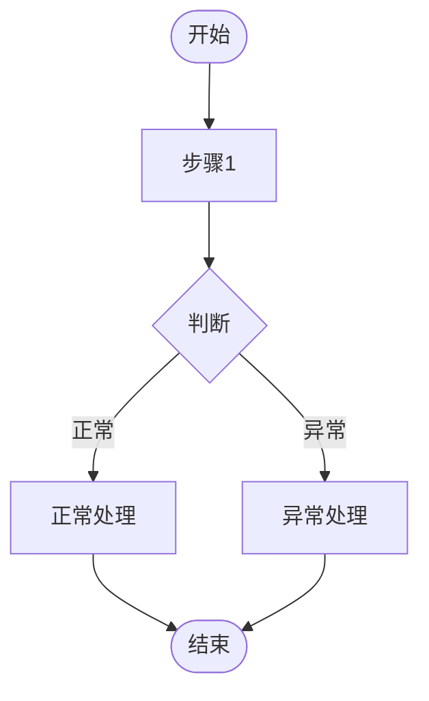

# Feature Documentation Generator

为项目中的业务功能自动生成结构化文档，包含业务视角和技术实现两个层面。

## 文档认知模型

### 多子功能时的文档拆分原则

- **若功能包含多个子功能**：用一篇 **overview** 文档整体介绍，再用多篇文档分别详细介绍每一个子功能。
- **若功能为单一功能**：可直接写一篇技术文档，无需单独的 overview。

```
Feature（业务功能）
 ├─ 概览文档（仅当存在多个子功能时）
 │   └─ overview.md — 功能整体介绍、子功能列表、整体架构与关系
 │
 ├─ 技术实现文档（给工程师，每篇必须包含下列全部内容）
 │   ├─ 功能介绍
 │   ├─ 功能内部整体架构（架构图 + 关键说明）
 │   ├─ 类图（必须包含所有关键类与接口）
 │   ├─ 时序图（多张，每张包含所有参与类/接口与重要方法调用，须基于事实代码、禁止伪造类，且含正常+异常流程）
 │   ├─ 流程图（多张逻辑描述，每张包含正常 + 异常流程）
 │   ├─ 关键模块设计与代码实现
 │   ├─ 关键数据结构
 │   ├─ 数据库、数据表设计（表字段、字段含义、字段数据类型）
 │   ├─ 依赖的 SDK（名称、groupId、artifactId，不含 implement project）
 │   └─ 对外提供的接口
 │
 └─ 场景地图文档（一篇）
     └─ scenario-map.md — 功能 → 子功能 → 场景表格（前提、操作、预期结果与表现）
```

## 适用场景

- 新功能上线，需要补齐项目文档
- 新人入职，需要快速理解某个业务模块
- 存量系统缺乏结构化文档
- 代码 Review / 架构演进前做系统梳理

## 核心原则

### 1. 基于事实，而非臆测

所有内容必须来源于：
- 代码结构
- 命名
- 注释
- 配置
- 已提供上下文

**不得凭经验"补全业务"**

### 2. 明确区分信息确定性

使用以下标记：
- ✅ **已确认信息**（From Code / Config）
- ⚠️ **合理推断**（Inference Based on Code）

### 3. 新人优先（New Joiner First）

默认读者：第一次接触该模块的工程师

禁止：
- 只给结论不给背景
- 技术文档中仅用类名代替概念说明而不加解释

## 使用流程

### 步骤 1：理解需求

当用户请求"创建XX功能的文档"时：

1. 确认功能范围：明确用户指的是哪个模块/包/功能

### 步骤 2：代码探索

按照认知模型的层次结构收集信息；**先判断该功能是否包含多个子功能**（按包/模块/用例边界划分），以决定是否生成 overview 及多篇 technical。

#### 2.1 架构全景探索

1. **识别代码边界与子功能**：
   - 使用 Glob 找到相关的代码文件
   - 使用 SemanticSearch 理解："XX功能涉及哪些模块？是否有可拆分的子功能？"
   - 识别外部依赖（数据库、API、第三方库，用于「依赖的 SDK」章节，且排除 project 依赖）

2. **绘制模块全景**：
   - 识别所有关键类和接口
   - 理解模块间的依赖关系
   - 确定数据流方向

#### 2.2 端到端流程探索

1. **主流程识别**：
   - 使用 SemanticSearch："XX功能的主流程是什么？"
   - 追踪从用户操作到系统响应的完整路径
   - 识别关键步骤和决策点

2. **异常流程识别**：
   - 查找 try-catch、错误处理代码
   - 识别降级策略和容错机制
   - 理解失败场景的处理方式

#### 2.3 模块拆解探索

1. **分析关键模块**：
   - 阅读核心类、接口、方法
   - 理解每个模块的职责边界
   - 识别模块的输入输出

2. **深入模块细节**：
   - 核心数据结构和状态管理
   - 对外接口和协议定义
   - 关键算法和策略实现

#### 2.4 业务概念提取

1. **提取业务概念**：
   - 从类名、方法名提取业务术语
   - 阅读注释理解业务规则
   - 识别状态机、流程节点

2. **收集配置信息**：
   - 查找配置文件、常量定义
   - 查找业务规则的硬编码部分

### 步骤 3：生成文档

根据[文档模板](#文档模板)生成相应文档。

- **多子功能**：生成 overview.md、technical-[子功能名].md（每子功能一篇）、scenario-map.md
- **单一功能**：生成 technical.md、scenario-map.md
- **技术文档**：每篇必须包含全部 10 项必含内容；类图须包含**所有**关键类与接口；时序图须包含**所有**参与类/接口与重要方法调用且基于事实代码不伪造，每张时序图/流程图须包含正常 + 异常流程
- 对于不确定的信息，使用 ⚠️ 标记并说明推断依据

### 步骤 4：输出文件

将生成的文档保存到项目中的 **`docs/project/features/`** 目录，创建以 **feature 名称命名的子目录**，并在其下存放所有文档：

```
docs/
└── project/
    └── features/
        └── [feature-name]/           # 以功能名称命名的目录
            ├── overview.md            # 仅多子功能时：功能整体概览
            ├── technical.md          # 单一功能时的技术文档
            ├── technical-[子功能A].md # 多子功能时：子功能 A 技术文档
            ├── technical-[子功能B].md # 多子功能时：子功能 B 技术文档
            └── scenario-map.md        # 场景地图（前提、操作、预期结果）
```

- **单一功能**：`overview.md` 可不生成；仅生成一篇 `technical.md`。
- **多子功能**：必须生成 `overview.md`，并为每个子功能生成一篇 `technical-[子功能名].md`。
- **场景地图**：始终生成一篇 `scenario-map.md`。

## 文档模板

### 技术实现文档模板（每篇技术文档必须包含以下全部章节）

每篇技术文档对应一个（子）功能，**必须**包含下列所有内容；图表须遵循 `.cursor/rules/mermaid-style-guide.mdc` 与 `.cursor/rules/specify-diagram-requirements.mdc`。

```markdown
# [Feature/子功能名称]｜技术实现文档

## 1. 功能介绍

[简要说明该功能的业务目的、主要能力、适用场景。若为子功能，说明在整体功能中的角色。]

---

## 2. 功能内部整体架构

### 2.1 架构图

```mermaid
%%{init: {'theme': 'base', 'themeVariables': { ... }}}%%
flowchart TB
    subgraph 模块/层次
    [按项目实际绘制：模块、组件、数据流方向]
    end
```

### 2.2 关键说明

- **分层/模块职责**：[简要说明各层或各模块的职责与边界]
- **数据流**：[数据从哪里进入、经哪些模块、到哪里结束]
- **关键设计决策**：[为何采用当前架构、主要约束]

---

## 3. 类图

**必须包含该功能涉及的所有关键类和接口**，不得遗漏。基于项目真实代码绘制，包含方法签名、依赖方向；若模块较多可拆为多张类图按模块展示，但合起来须覆盖全部关键类与接口。禁止使用虚构或示例类名。

```mermaid
%%{init: {'theme': 'base', 'themeVariables': { ... }}}%%
classDiagram
    direction TB
    [所有关键真实类名、接口名、方法签名与关系]
```

[类图后附**关键类职责说明**表：类名 | 职责（一句话）]

---

## 4. 时序图（多张，每张包含正常 + 异常流程）

要求：
- **参与者**：必须包含该流程中**所有**关联参与的类和接口，不得遗漏；participant 必须为项目中的**真实类名/接口名**，禁止伪造或示例类名。
- **方法调用**：流程中**重要的方法调用**均须在图中体现，且方法名、调用顺序须**基于事实代码**（与代码一致），不得编造。
- **正常与异常**：每张图必须用 `alt/else` 等表达**正常路径**与**异常路径**。

### 4.1 时序图一：[流程名称，如「登录与鉴权」]

```mermaid
%%{init: {'theme': 'base', 'themeVariables': { ... }}}%%
sequenceDiagram
    autonumber
    participant [真实类/接口A]
    participant [真实类/接口B]
    ...
    alt 成功
        [基于代码的真实方法调用序列]
    else 失败/异常
        [基于代码的异常分支调用]
    end
```

**说明**：[该图对应的业务场景、正常与异常分支含义]

### 4.2 时序图二：[流程名称]

[同上结构，每张图都包含正常 + 异常]

### 4.3 时序图 N

[按实际流程数量补充]

---

## 5. 流程图（多张逻辑描述，每张包含正常 + 异常流程）

要求：每张流程图描述一段完整业务逻辑，必须覆盖**正常分支**与**异常/错误分支**。

### 5.1 流程图一：[逻辑名称]


```mermaid
%%{init: {'theme': 'base', 'themeVariables': { ... }}}%%
flowchart TD
    Start([开始]) --> Step1[步骤1]
    Step1 --> Judge{判断}
    Judge -->|正常| Normal[正常处理]
    Judge -->|异常| Error[异常处理]
    Normal --> End([结束])
    Error --> End
```

**说明**：[该图对应的业务逻辑、分支条件]

### 5.2 流程图二：[逻辑名称]

[同上结构]

### 5.3 流程图 N

[按实际逻辑数量补充]

---

## 6. 关键模块设计与代码实现

[按模块或层次展开，每个关键模块包含：]

### 6.1 [模块名称]

- **职责**：[该模块负责什么]
- **输入/输出**：[入参、返回值或副作用]
- **设计要点**：[核心设计思路、与其它模块的协作方式]
- **关键代码实现**（摘录真实代码片段并简要说明）：

```kotlin
// 文件路径
// 关键方法或逻辑片段
```

[可重复 6.2、6.3 等子节覆盖其他关键模块]

---

## 7. 关键数据结构

[列出该功能涉及的核心数据模型：Entity、DTO、State、Config 等。]

### 7.1 [结构名称 1]

- **用途**：[在功能中的作用]
- **定义**（或关键字段说明）：

```kotlin
data class Xxx(
    val id: Long,      // 说明
    val name: String,  // 说明
    ...
)
```

### 7.2 [结构名称 2]

[同上]

---

## 8. 数据库、数据表设计

[若该功能涉及持久化，必须列出；若无则写「本功能不涉及数据库」并简要说明数据来源。]

### 8.1 数据库/存储说明

[使用的数据库类型、命名空间或 schema 等]

### 8.2 表：[表名]

| 字段名 | 含义 | 数据类型 | 约束/说明 |
|--------|------|----------|-----------|
| id | 主键 | BIGINT | 自增/主键 |
| xxx | 说明 | VARCHAR(64) | 可空/唯一/索引 |
| ... | ... | ... | ... |

### 8.3 表：[其他表名]

[同上格式]

---

## 9. 依赖的 SDK（名称、groupId、artifactId）

仅列出**第三方或外部 SDK**，**不包含** `implementation project(':xxx')` 等项目内部模块依赖。

| SDK 名称 | groupId | artifactId | 用途说明 |
|----------|---------|------------|----------|
| 示例库 | com.example | example-sdk | 用于 xxx |
| ... | ... | ... | ... |

---

## 10. 对外提供的接口

[该功能对外暴露的 API：公开类/接口、方法签名、调用方、用途。]

### 10.1 接口/类：[名称]

- **位置**：[包名/文件路径]
- **用途**：[给谁用、做什么]
- **方法**：

| 方法签名 | 说明 |
|----------|------|
| fun doSomething(param: Type): Result | 说明 |

### 10.2 接口/类：[其他]

[同上]

---

## 信息来源说明

- ✅ 已确认：[列出依据的代码/配置]
- ⚠️ 合理推断：[列出推断内容及依据]
```

### 概览文档模板（仅当功能包含多个子功能时使用）

```markdown
# [Feature 名称]｜功能概览

## 1. 功能整体介绍

[该功能的业务目标、在系统中的地位、面向用户/场景。]

## 2. 子功能列表与关系

| 子功能名称 | 说明 | 对应技术文档 |
|------------|------|--------------|
| 子功能 A | 简要说明 | technical-子功能A.md |
| 子功能 B | 简要说明 | technical-子功能B.md |

## 3. 整体架构与子功能关系

[架构图或模块图：展示各子功能在整体中的位置、依赖关系、数据流。]

## 4. 与场景地图的对应

[可简要说明子功能与 scenario-map.md 中场景的对应关系，或直接引用「详见 scenario-map.md」。]
```

### 场景地图文档模板（必生成一篇）

将功能拆解为多个**子功能**，每个子功能下用**表格**列出所有**场景**；每条场景包含三要素：**前提**、**操作**、**预期结果与表现**。

```markdown
# [Feature 名称]｜场景地图

## 1. 说明

- **功能**：[功能名称]
- **子功能划分**：[列出子功能名称]
- **场景要素**：每条场景包含「前提」「操作」「预期结果与表现」

---

## 2. 子功能一：[子功能名称]

| 序号 | 前提 | 操作 | 预期结果与表现 |
|------|------|------|-----------------|
| 1 | [执行该场景前的状态、条件] | [用户或系统的具体操作步骤] | [应看到的结果、界面变化、提示等] |
| 2 | ... | ... | ... |

---

## 3. 子功能二：[子功能名称]

| 序号 | 前提 | 操作 | 预期结果与表现 |
|------|------|------|-----------------|
| 1 | ... | ... | ... |

---

## 4. 子功能 N

[同上表格格式]

---

## 5. 跨子功能或异常场景（可选）

[若存在跨子功能流程或通用异常场景，可单独列表格。]
```

## 实施规范

### 禁止事项

**技术文档中禁止**：
- 遗漏必含章节（功能介绍、架构、类图、多时序图、多流程图、关键模块与代码、关键数据结构、数据库设计、依赖 SDK、对外接口）
- 类图遗漏关键类或接口（**必须包含所有关键类与接口**）
- 时序图遗漏参与类/接口或重要方法调用（**必须包含所有关联参与的类/接口，且重要方法调用须完整、基于事实代码**）
- 时序图或流程图缺少异常分支（每张图必须包含正常 + 异常流程）
- 类图、时序图使用虚构/伪造类名或编造方法调用（须严格基于项目真实代码）
- 将 `implementation project(':xxx')` 列为依赖 SDK

### 必须事项

**必须做到**：
- 存储目录固定为 **`docs/project/features/[feature-name]/`**，以 feature 名称建子目录
- 多子功能时：生成 **overview.md** + 每子功能一篇 **technical-[子功能名].md**
- 每篇技术文档**必须**包含：功能介绍、功能内部整体架构、类图（**所有**关键类与接口）、多张时序图（**所有**参与类/接口与重要方法调用、基于事实代码无伪造，每张含正常+异常）、多张流程图（每张含正常+异常）、关键模块设计与代码实现、关键数据结构、数据库/表设计、依赖的 SDK、对外提供的接口
- 始终生成一篇 **scenario-map.md**，场景三要素：前提、操作、预期结果与表现
- 所有业务规则必须有代码依据；不确定的内容必须标注 ⚠️ 并说明推断依据

## 质量检查清单

生成文档后，使用此清单自查：

### 存储与文件
- [ ] 所有文档存放在 **`docs/project/features/[feature-name]/`** 下
- [ ] 多子功能时已生成 **overview.md**
- [ ] 已生成 **scenario-map.md**，且每条场景含前提、操作、预期结果与表现

### 技术文档（每篇必含）

- [ ] **1. 功能介绍**：有明确说明
- [ ] **2. 功能内部整体架构**：含架构图 + 关键说明
- [ ] **3. 类图**：包含**所有**关键类与接口，基于真实代码，含方法签名与职责说明
- [ ] **4. 时序图**：多张，每张包含**所有**参与类/接口、**重要方法调用**均体现且基于事实代码无伪造，且含正常 + 异常流程（alt/else）
- [ ] **5. 流程图**：多张，每张均包含正常 + 异常流程
- [ ] **6. 关键模块设计与代码实现**：有模块划分与关键代码摘录
- [ ] **7. 关键数据结构**：列出核心数据模型
- [ ] **8. 数据库、数据表设计**：表字段、含义、数据类型（不涉及则明确说明）
- [ ] **9. 依赖的 SDK**：仅第三方/外部 SDK，含 groupId、artifactId，不含 project 依赖
- [ ] **10. 对外提供的接口**：有接口/类与方法说明

### 场景地图
- [ ] 功能已拆解为子功能，每子功能下列出场景表
- [ ] 每条场景包含三列：前提、操作、预期结果与表现

### 通用检查
- [ ] 信息来源已说明
- [ ] 新人可以理解（无隐含知识）
- [ ] 图表符合 mermaid-style-guide 与 specify-diagram-requirements 规则

## 示例对话

**用户**：创建搜索功能的文档

**助手**：
1. 将为搜索功能生成文档：技术实现文档、场景地图；若包含多个子功能则先生成概览文档，再为每个子功能生成技术文档。
2. 探索代码，识别搜索相关模块及是否有多子功能。
3. [使用 Glob 和 SemanticSearch 探索]
4. [按模板生成：overview（若多子功能）、technical 或 technical-子功能X、scenario-map]
5. 文档已保存到 **`docs/project/features/search/`** 目录。

## 附加说明

### 生成类图、时序图、流程图

- 须遵循 **`.cursor/rules/mermaid-style-guide.mdc`** 与 **`.cursor/rules/specify-diagram-requirements.mdc`**（真实类名、方法签名、正常+异常分支）。
- **类图**：必须包含**所有**关键类与接口，基于项目真实代码，含方法签名与依赖方向；禁止虚构类名。
- **时序图**：必须包含**所有**关联参与的类与接口，**重要方法调用**均须在图中体现且与代码一致；participant 与调用序列须基于事实代码，禁止伪造类或编造调用；每张图须用 alt/else 包含正常 + 异常流程。
- **流程图**：多张，每张描述一段业务逻辑，**每张都必须包含正常 + 异常分支**。

### 多子功能时的拆分

- 先写 **overview.md** 整体介绍及子功能列表与关系。
- 每个子功能单独一篇 **technical-[子功能名].md**，每篇都包含技术文档模板中的全部 10 项内容。
- **scenario-map.md** 按子功能分节，每节下用表格列出场景（前提、操作、预期结果与表现）。

### 存储目录

- 根目录：**`docs/project/features/`**
- 每个 feature 一个子目录：**`docs/project/features/[feature-name]/`**
- 该目录下存放：overview.md（可选）、technical*.md、scenario-map.md

### 增量更新

如果文档已存在：
- 读取现有文档
- 对比代码变化
- 增量更新对应章节
- 在文档顶部添加更新日志
