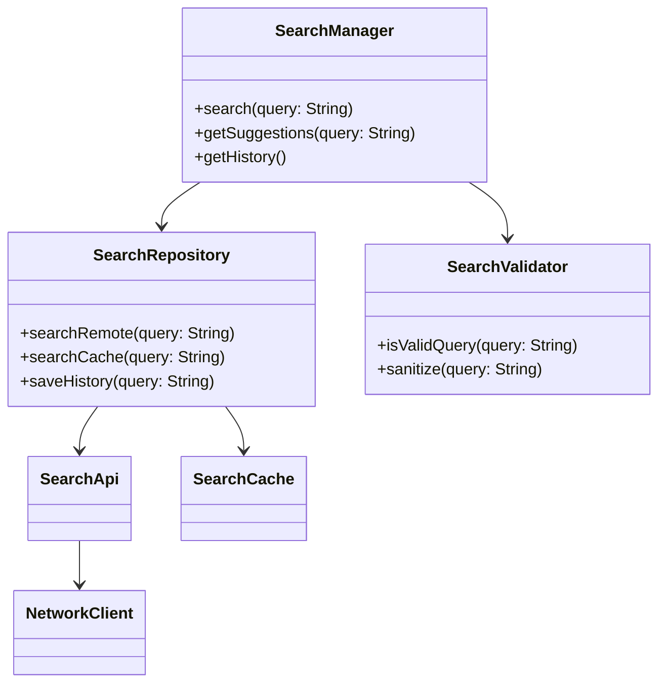
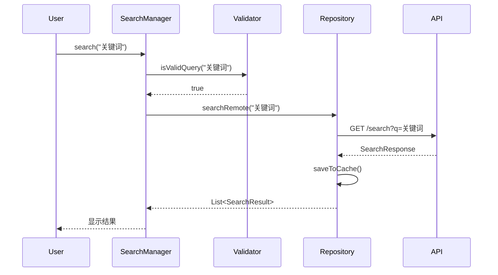
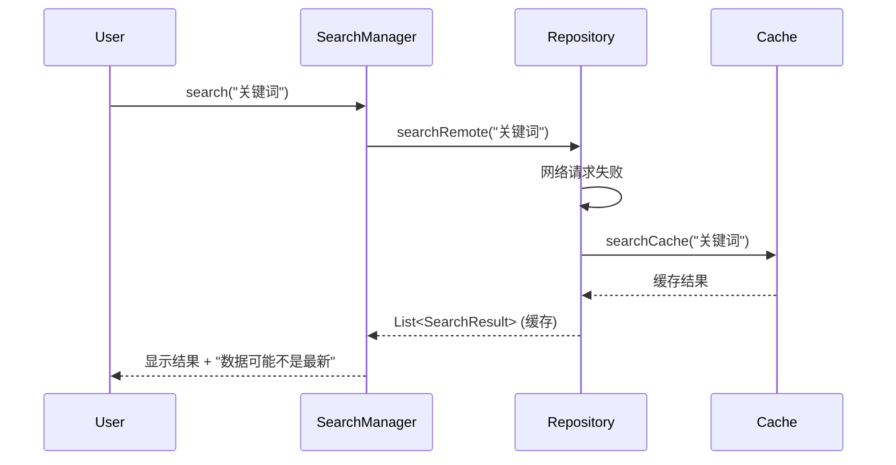

# Feature Documentation Generator - 使用示例

## 示例 1：为搜索功能生成文档

### 用户请求

```
创建搜索功能的文档
```

### Agent 执行流程

#### 步骤 1：确认范围

```
我将为搜索功能生成完整的业务文档和技术实现文档。

首先让我探索代码，找到搜索相关的模块...
```

#### 步骤 2：代码探索

```python
# 使用工具收集信息
Glob("**/search/**/*.kt")
SemanticSearch("搜索功能的主流程是什么？", ["app/src/main/java/"])
Read("app/src/main/java/com/example/search/SearchManager.kt")
```

#### 步骤 3：生成业务文档

生成的文档示例（部分）：

```markdown
# 搜索功能｜业务文档

## 1. 业务背景与目标

### 1.1 该功能解决的业务问题
为用户提供快速查找内容的能力，支持关键词匹配和模糊查询。

### 1.2 在整体业务中的位置
搜索是内容发现的核心入口，连接用户需求和内容库。

---

## 2. 核心业务概念说明

| 概念 | 定义 | 备注 |
|------|------|------|
| 搜索词 | 用户输入的查询关键字 | 最小长度2个字符 |
| 搜索结果 | 匹配搜索词的内容列表 | 按相关度排序 |
| 搜索历史 | 用户最近的搜索记录 | 最多保存20条 |

---

## 3. 用户视角的业务流程

### 3.1 主流程

1. 用户在搜索框输入关键词
2. 系统实时显示搜索建议
3. 用户确认搜索或选择建议
4. 系统展示搜索结果列表
5. 用户点击结果查看详情

### 3.2 异常 / 中断流程

- **无结果**：显示"未找到相关内容"提示
- **网络异常**：显示缓存的搜索历史
- **输入过短**：提示"请输入至少2个字符"

---

## 4. 关键业务规则

### 规则 1：搜索词长度限制

- **规则描述**：搜索词至少2个字符，最多50个字符
- **生效原因**：避免过短查询导致性能问题，限制恶意长查询
- **边界与例外**：单字符时不触发搜索，显示搜索历史

✅ **信息来源**：`SearchValidator.kt` 中的 `MIN_QUERY_LENGTH = 2` 和 `MAX_QUERY_LENGTH = 50`

### 规则 2：搜索结果排序

- **规则描述**：结果按"精确匹配 > 标题匹配 > 内容匹配"排序
- **生效原因**：提升用户体验，优先展示最相关内容
- **边界与例外**：无

⚠️ **推断依据**：基于 `SearchRanker.kt` 中的 `rankResults()` 方法逻辑
```

#### 步骤 4：生成技术文档

生成的文档示例（部分）：

```markdown
# 搜索功能｜技术实现文档

## 1. 系统整体架构概览

### 1.1 模块全景类图



### 1.2 数据流方向

用户输入 → SearchManager → SearchValidator → SearchRepository → SearchApi → 后端服务
后端响应 → SearchApi → SearchRepository → SearchCache（缓存）→ SearchManager → UI

---

## 2. 模块划分与职责

| 模块 | 输入 | 输出 | 职责 | 非职责 |
|------|------|------|------|--------|
| SearchManager | 用户查询字符串 | 搜索结果列表 | 协调搜索流程，管理缓存策略 | 不处理网络请求细节 |
| SearchRepository | 验证后的查询 | 原始搜索数据 | 数据获取和持久化 | 不负责业务逻辑 |
| SearchValidator | 原始查询字符串 | 验证结果 | 查询校验和净化 | 不负责搜索执行 |

---

## 3. 核心流程详解

### 3.1 正常流程（时序图）



### 3.2 异常 / 降级流程



---

## 5. 关键技术与算法

### 5.1 搜索结果排序算法

- **设计目标**：提升搜索相关性，优先展示用户最可能需要的结果
- **方案选择原因**：
  - 精确匹配权重最高（100分）
  - 标题匹配次之（50分）
  - 内容匹配最低（10分）
  - 综合考虑点击率和发布时间
- **Trade-off**：
  - 优点：实现简单，性能好
  - 缺点：不支持语义搜索，无法理解同义词
- **实现要点**：
  ```kotlin
  fun rankResults(results: List<SearchResult>): List<SearchResult> {
      return results.sortedByDescending { 
          it.exactMatchScore * 100 + 
          it.titleMatchScore * 50 + 
          it.contentMatchScore * 10 +
          it.clickRate * 5
      }
  }
  ```

✅ **信息来源**：`SearchRanker.kt`

---

## 8. 相关代码清单

### 核心类列表

| 类名 | 文件路径 | 职责 |
|------|----------|------|
| SearchManager | app/src/main/java/com/example/search/SearchManager.kt | 搜索流程协调 |
| SearchRepository | app/src/main/java/com/example/search/SearchRepository.kt | 数据获取和缓存 |
| SearchValidator | app/src/main/java/com/example/search/SearchValidator.kt | 查询验证 |
| SearchApi | app/src/main/java/com/example/search/SearchApi.kt | 网络接口定义 |

---

## 信息来源说明

本文档基于以下代码分析生成：
- ✅ 已确认：
  - `SearchManager.kt` - 核心搜索逻辑
  - `SearchRepository.kt` - 数据层实现
  - `SearchValidator.kt` - 验证规则
  - `SearchRanker.kt` - 排序算法
- ⚠️ 合理推断：
  - 搜索结果排序优先级（基于 `SearchRanker.kt` 的评分权重）
  - 降级策略（基于 Repository 中的异常处理逻辑）
```

#### 步骤 5：保存文档

```
文档已生成并保存到：
- docs/features/search/business.md
- docs/features/search/technical.md

业务文档面向产品和新人，不包含技术细节。
技术文档包含完整的类图、时序图和实现说明。
```

---

## 示例 2：只生成业务文档

### 用户请求

```
只创建用户认证功能的业务文档，技术文档不需要
```

### Agent 执行流程

```
好的，我只为用户认证功能生成业务文档。

[探索代码...]
[生成业务文档，跳过技术文档]

文档已保存到 docs/features/authentication/business.md
```

---

## 示例 3：增量更新现有文档

### 用户请求

```
更新支付功能的文档，代码有变化
```

### Agent 执行流程

#### 步骤 1：读取现有文档

```
我发现已存在支付功能的文档：
- docs/features/payment/business.md (最后更新: 2025-12-01)
- docs/features/payment/technical.md (最后更新: 2025-12-01)

我将对比代码变化，增量更新文档...
```

#### 步骤 2：识别变化

```
[对比代码变化]

发现以下变化：
1. 新增支付方式：微信支付
2. 修改退款规则：7天改为15天
3. 新增类：WeChatPaymentProvider
```

#### 步骤 3：更新文档

```
已更新文档：

业务文档变更：
- 第2章：新增"微信支付"概念说明
- 第4章：更新退款规则（7天→15天）

技术文档变更：
- 第1章：类图中新增 WeChatPaymentProvider
- 第2章：新增 WeChatPaymentProvider 模块说明
- 第3章：更新支付流程时序图

更新日志已添加到文档顶部。
```

---

## 示例 4：处理不确定信息

### 场景：代码注释不清晰

```kotlin
// 处理订单
fun processOrder(order: Order) {
    // TODO: 添加验证逻辑
    if (order.amount > 1000) {
        // 特殊处理
        specialHandle(order)
    }
}
```

### 生成的文档片段

```markdown
### 规则 3：大额订单特殊处理

⚠️ **推断依据**：
- 代码中对金额大于1000的订单进行特殊处理
- 具体的"特殊处理"逻辑在 `specialHandle()` 方法中
- 该方法调用外部风控服务进行审核（基于方法实现推断）

**建议**：与产品团队确认"大额订单"的准确定义和处理规则。
```

---

## 示例 5：处理缺失信息

### 场景：代码中没有业务规则说明

```kotlin
class OrderValidator {
    fun validate(order: Order): Boolean {
        return order.items.isNotEmpty() && 
               order.totalAmount > 0 &&
               order.deliveryAddress != null
    }
}
```

### 生成的文档片段

```markdown
### 规则 4：订单有效性校验

⚠️ **推断依据**：基于 `OrderValidator.validate()` 方法的实现逻辑

订单必须满足以下条件才能提交：
1. 至少包含一个商品
2. 总金额大于0
3. 必须填写配送地址

**注意**：此规则基于代码实现推断，实际业务规则可能有更多约束。
建议与产品团队确认完整的订单校验规则。
```

---

## 关键要点总结

### 生成业务文档时

1. ✅ 使用业务术语，不出现类名
2. ✅ 从用户视角描述流程
3. ✅ 明确标注信息来源
4. ⚠️ 对推断的内容标注推断依据

### 生成技术文档时

1. ✅ 包含完整的类图和时序图
2. ✅ 说明设计决策的原因
3. ✅ 列出所有关键类和文件
4. ✅ 说明扩展点和技术债

### 通用原则

1. 基于事实，不臆测
2. 新人优先，无隐含知识
3. 不确定的信息必须标注
4. 提供代码依据
