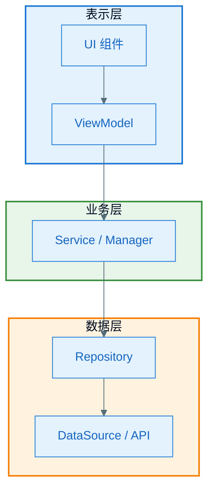
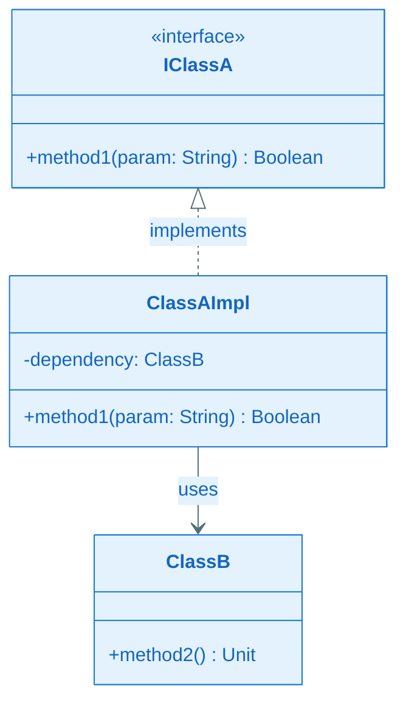
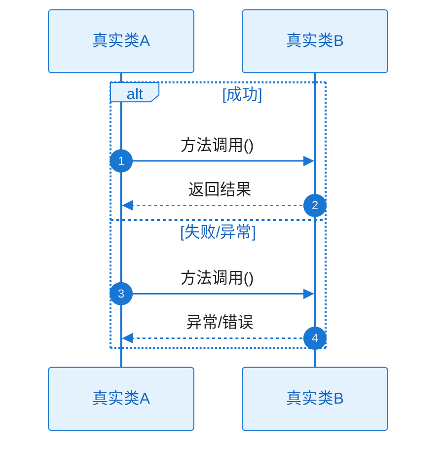
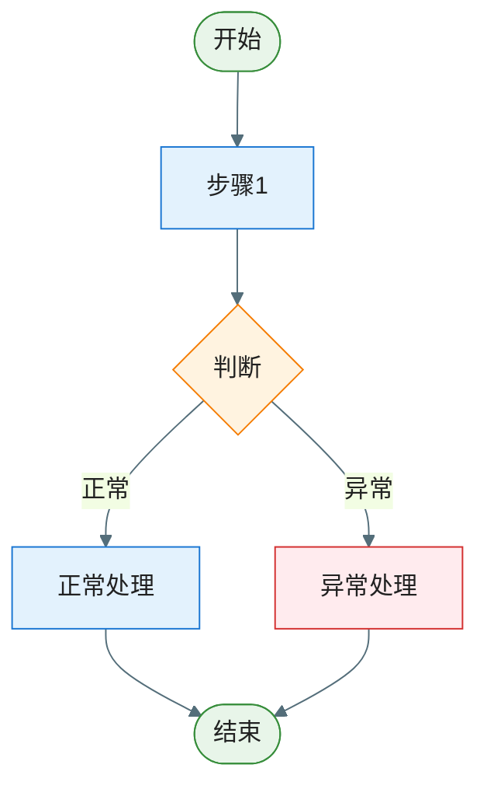

# 业务功能技术实现文档模板

> 本模板用于「业务功能文档套件」中每一个业务功能（或子功能）的技术实现文档。
> 输出文件名须为简体中文：单一功能用 `技术实现.md`；多子功能时每个子功能一篇 `技术实现-[子功能中文名].md`，并额外产出一篇 `功能概览.md`。
> 所有图表须遵循 `.cursor/rules/mermaid-style-guide.mdc`（样式）与 `.cursor/rules/specify-diagram-requirements.mdc`（内容）。
>
> **与框架/接口文档的复用边界**：本文档只写"该功能**如何使用**框架"（传了什么参数、注册了什么回调、走哪条调用链）；框架自身的机制原理（拦截链、缓存策略、线程模型等）属于 `技术框架/[模块]详细设计.md`，此处**链接过去，不要复制成文**。接口契约同理：完整请求/响应/字段规范在 `接口文档/`，此处只引用接口编号（API-xx / SDK-xx）+ 链接。

---

## 技术实现文档（每篇必须包含以下全部章节）

````markdown
# [Feature/子功能名称]｜技术实现文档

## 文档元信息

| 项目 | 内容 |
|------|------|
| **文档目的** | [如：新人上手该模块 / 接需求与排期 / 排查问题] |
| **目标读者** | [如：首次接触该模块的工程师] |
| **阅读前提** | [如：先阅读《文档总览.md》《功能概览.md》] |
| **版本/更新日期** | [如：v1.0，2025-03-08] |

---

## 1. 功能介绍

[简要说明该功能的业务目的、主要能力、适用场景。若为子功能，说明在整体功能中的角色。]

### 1.1 范围与边界

- **包含**：[本功能负责的范围]
- **不包含**：[相邻模块或明确排除的内容]
- **边界说明**：[与上下游/周边模块的接口边界]

### 1.2 代码入口与文件索引

| 职责/角色 | 类型 | 路径 |
|-----------|------|------|
| [如：入口 Activity/Fragment] | [类/接口] | `[相对路径]` |
| [如：ViewModel / Presenter] | [类] | `[相对路径]` |
| [如：对外契约 / API] | [接口] | `[相对路径]` |
| [如：Repository / DataSource] | [类] | `[相对路径]` |

---

## 2. 领域概念

| 概念 | 定义 | 备注 |
|------|------|------|
| [概念名] | [在本文档/本功能中的含义] | [可选：与通用含义的差异、约束等] |

---

## 3. 整体架构（图 + 分层/数据流/设计决策）

### 3.1 架构图



### 3.2 关键说明

- **分层/模块职责**：[各层或各模块的职责与边界]
- **数据流**：[数据从哪里进入、经哪些模块、到哪里结束]
- **关键设计决策**：[为何采用当前架构、主要约束]

---

## 4. 关键模块设计与实现要点

### 4.0 模块调用链概览

```
入口（如 ViewModel / Controller）
  → 模块A.method()
    → 模块B.method()
      → 模块C.method()
  ← 结果逐层返回
```

### 4.1 [模块名称]

- **职责**：[该模块负责什么]
- **输入/输出**：[入参、返回值或副作用]
- **设计要点**：[核心设计思路、与其它模块的协作方式]
- **关键代码实现**：

```kotlin
// 文件路径
// 关键方法或逻辑片段
```

### 4.2 [模块名称]

[同上，可重复 4.3、4.4 等]

---

## 5. 类图

**必须包含该功能涉及的所有关键类和接口**（含 `<<interface>>`），基于项目真实代码绘制，含方法签名与依赖方向；禁止虚构类名。类图后须附**关键类职责说明**表。



| 类/接口名 | 职责（一句话） |
|-----------|----------------|
| Xxx | ... |

---

## 6. 时序图（方法调用主流程 + 异常）

要求：
- **完整性**：覆盖从触发点到响应的完整调用链，不得遗漏关键方法，不得用「...」代替。
- **参与者**：使用项目真实类名/接口名，禁止伪造或省略。
- **方法调用**：所有关键方法逐一体现，与代码一致。
- **正常与异常**：每张图用 `alt/else` 同时表达正常 + 关键异常路径。

### 6.1 [流程名称]



#### 协作者与过程说明

1. **触发与入口**：[谁、在什么条件下发起交互]
2. **协作链与职责**：[沿调用方向每一跳「谁调用谁、为了什么、输入/输出语义」]
3. **工作过程与数据流**：[中间状态如何变化；关键业务决策在何处做出]
4. **分支与异常**：[每个 alt/else 的进入条件、各分支差异、最终可见结果；逐项判断 7 类异常（网络失败/解析错误/本地读写失败/协程取消/权限被拒/空状态/并发竞争），适用的写处理路径，不适用的注明 N/A 及理由]
5. **结束条件**：[正常结束与各类异常结束分别是什么]

### 6.2 [流程名称]

[同上结构]

---

## 7. 流程图（逻辑分支 + 异常）

要求：覆盖完整逻辑路径，所有关键判断节点都体现，正常 + 异常分支齐备，且与时序图一致。

### 7.1 [逻辑名称]



**说明**：[该图对应的业务逻辑、分支条件]

### 7.2 [逻辑名称]

[同上结构，按实际逻辑数量补充 7.3、7.4 等，须与 §6 各时序图一一对应]

---

## 8. 关键数据结构

### 8.1 [结构名称]

- **用途**：[在功能中的作用]
- **定义**：

```kotlin
data class Xxx(
    val id: Long,      // 说明
    val name: String,  // 说明
)
```

---

## 9. 数据库、数据表设计

[若不涉及则写「本功能不涉及数据库」并说明数据来源。]

### 9.1 数据库/存储说明

### 9.2 表：[表名]

| 字段名 | 含义 | 数据类型 | 约束/说明 |
|--------|------|----------|-----------|
| id | 主键 | BIGINT | 自增/主键 |

---

## 10. 依赖的 SDK 与配置

### 10.1 依赖的 SDK

仅列第三方/外部 SDK，**不含** `implementation project(':xxx')`。

| SDK 名称 | groupId | artifactId | 用途说明 |
|----------|---------|------------|----------|
| 示例库 | com.example | example-sdk | 用于 xxx |

### 10.2 配置项与开关

| 配置项/开关 | 含义 | 默认值 | 说明 |
|-------------|------|--------|------|
| xxx | ... | ... | ... |

---

## 11. 对外提供的接口

> 仅做摘要；完整接口规范集中维护在套件的 `接口文档/对外提供接口.md`，此处给出链接与速览。

### 11.1 接口/类：[名称]

- **位置**：[包名/文件路径]
- **用途**：[给谁用、做什么]
- **方法**：

| 方法签名 | 说明 |
|----------|------|
| fun doSomething(param: Type): Result | 说明 |

---

## 12. 错误码与异常处理

| 错误码/异常类型 | 触发场景 | 含义 | 处理建议 |
|-----------------|----------|------|----------|
| XxxException | [在什么情况下抛出] | ... | ... |

---

## 13. 日志、埋点与常见问题

### 13.1 日志与埋点

**关键日志**

| Tag / 关键字 | 日志内容 | 排查场景 |
|--------------|----------|----------|
| [TAG_NAME] | [日志输出内容摘要] | [用于排查哪类问题] |

**埋点事件**

| 事件名 | 触发时机 | 关键参数 | 说明 |
|--------|----------|----------|------|
| [event_name] | [何时触发] | [param1, param2] | [业务含义] |

### 13.2 常见问题 / FAQ

---

## 附录

### A. 缩写对照表

| 缩写 | 全称 | 说明 |
|------|------|------|
| DTO | Data Transfer Object | 数据传输对象 |

### B. 相关文档

[至少回链文档总览；按实际补充所依赖的框架详细设计与接口文档链接。]

- [文档总览](../../文档总览.md) — 套件入口
- [XX框架详细设计](../../技术框架/XX框架详细设计.md) — 本功能依赖的框架机制
- [依赖后端接口](../../接口文档/依赖后端接口.md) — 本功能使用的接口（API-xx）

### C. 信息来源说明

- ✅ **已确认**：[依据的代码/配置]
- ⚠️ **合理推断**：[推断内容及依据]
````

---

## 概览文档模板（仅多子功能时使用，文件名 `功能概览.md`）

````markdown
# [Feature 名称]｜功能概览

## 1. 功能整体介绍

[该功能的业务目标、在系统中的地位、面向用户/场景。]

## 2. 子功能列表与关系

| 子功能名称 | 说明 | 对应技术文档 |
|------------|------|--------------|
| 子功能 A | 简要说明 | 技术实现-子功能A.md |
| 子功能 B | 简要说明 | 技术实现-子功能B.md |

## 3. 整体架构与子功能关系

[架构图或模块图：展示各子功能在整体中的位置、依赖关系、数据流。]

## 4. 相关文档

- 功能树：`../功能树.md`
- 技术框架：`../技术框架/架构设计.md`
- 接口文档：`../接口文档/`
````
