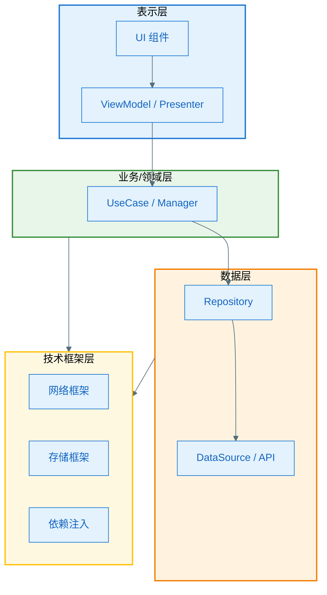
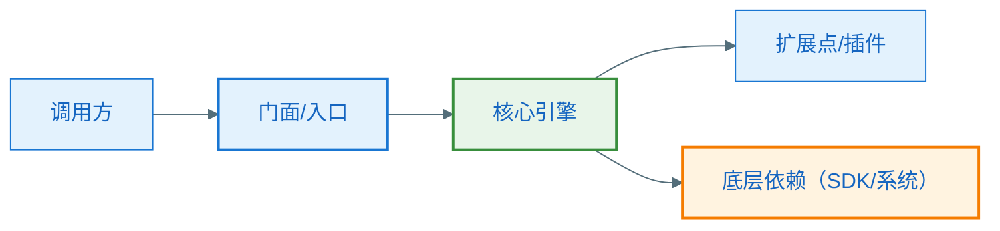
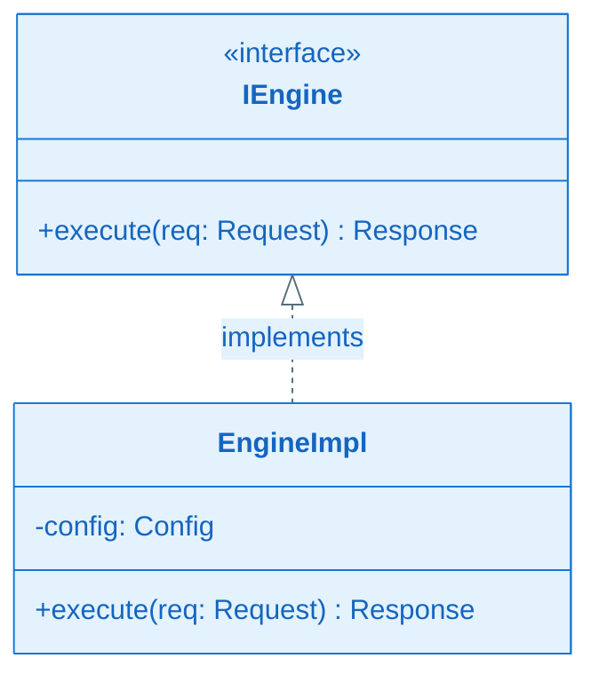
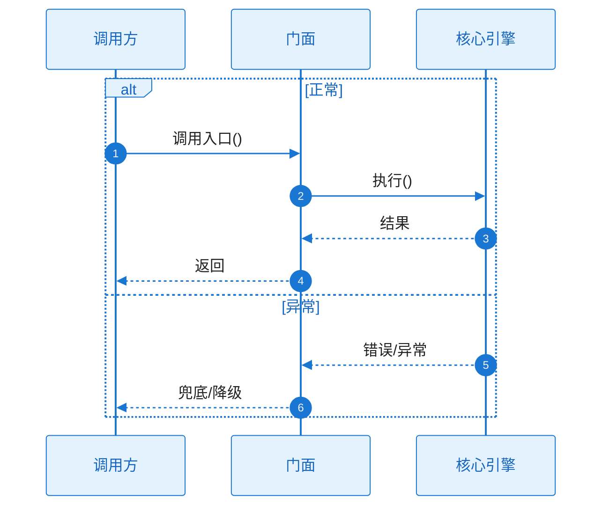

# 技术框架文档模板

> 本文件包含**两套**模板，用于「业务功能文档套件」的「技术框架」部分：
> - **模板 A：整体架构设计文档** —— 一篇，文件名 `架构设计.md`，描述工程整体分层、模块边界、技术选型与跨切面机制。
> - **模板 B：技术框架模块详细设计文档** —— 每个技术底座模块一篇，文件名 `[框架模块中文名]详细设计.md`（如 `网络框架详细设计.md`、`依赖注入详细设计.md`、`本地存储框架详细设计.md`、`图片加载框架详细设计.md`、`基础架构详细设计.md`）。
>
> 「技术框架」与「业务功能」的区别：技术框架是**横切的、被多个业务功能复用的技术底座**（网络、存储、DI、图片加载、线程调度、基础 UI 架构等），不直接对应某个用户可见功能；业务功能文档则面向具体可见功能。
> 所有图表须遵循 `.cursor/rules/mermaid-style-guide.mdc`（样式）与 `.cursor/rules/specify-diagram-requirements.mdc`（内容）。

---

## 模板 A：整体架构设计文档（`架构设计.md`）

````markdown
# [模块/工程名称]｜整体架构设计

## 文档元信息

| 项目 | 内容 |
|------|------|
| **文档目的** | [如：让团队理解整体技术架构与设计取舍] |
| **目标读者** | [如：工程师、架构评审者] |
| **阅读前提** | [如：先读《文档总览.md》《功能树.md》] |
| **版本/更新日期** | [如：v1.0，2025-03-08] |

---

## 1. 架构概述

[用一段话说明：这是什么系统/模块，采用了什么架构风格（按工程真实情况，如 MVVM、MVI、自定义或混合，不要套模板），核心设计目标（可维护性、可测试性、性能、解耦等）。]

> ⚠️ 必须基于工程**真实分层与真实类名**描述，禁止套用 Clean Architecture 等示例分层凭空编造。

---

## 2. 分层与模块边界

### 2.1 分层架构图



### 2.2 各层/模块职责

| 层 / 模块 | 职责 | 关键类/包（真实命名） | 依赖方向 |
|-----------|------|----------------------|----------|
| 表示层 | ... | `...` | 依赖业务层 |
| 业务层 | ... | `...` | 依赖数据层 |
| 数据层 | ... | `...` | 依赖技术框架层 |
| 技术框架层 | ... | `...` | 被各层复用 |

### 2.3 依赖原则

- [如：上层依赖下层，禁止下层反依赖上层；模块间通过接口解耦等]

---

## 3. 技术选型

| 关注点 | 选型 | 版本 | 选型理由 / 取舍 |
|--------|------|------|-----------------|
| 网络 | [如 Retrofit + OkHttp] | x.y.z | ... |
| 异步 | [如 Coroutines + Flow] | x.y.z | ... |
| 依赖注入 | [如 Hilt / Koin] | x.y.z | ... |
| 本地存储 | [如 Room / DataStore] | x.y.z | ... |
| 图片加载 | [如 Glide / Coil] | x.y.z | ... |
| 其他 | ... | ... | ... |

---

## 4. 跨切面机制（横切关注点）

[描述贯穿全工程的机制，每项一小节，说明设计意图与统一约定。]

- **线程与调度**：[主线程/IO 调度约定、协程作用域管理]
- **错误与异常**：[统一异常体系、错误码、全局兜底]
- **日志与监控**：[日志框架、Tag 规范、埋点/APM]
- **配置与开关**：[Feature Flag、环境区分、灰度]
- **生命周期与内存**：[作用域、泄漏防护约定]

---

## 5. 技术框架模块清单

> 每个技术框架模块都有一篇独立的「详细设计」文档（模板 B），此处只做索引与定位。
> ⚠️ 下表条目仅为示例：**只列工程中真实存在的框架模块**（来自功能树的「技术框架候选清单」），没有的不要硬凑，工程特有的（如自研播放器内核、插件框架）须补充。

| 框架模块 | 职责 | 详细设计文档 | 主要被谁复用 |
|----------|------|--------------|--------------|
| [如：网络框架] | ... | `网络框架详细设计.md` | [业务功能/数据层] |
| [如：依赖注入] | ... | `依赖注入详细设计.md` | 全工程 |
| [工程特有框架] | ... | `[模块名]详细设计.md` | ... |

---

## 6. 关键架构决策记录（ADR）

[记录重要的架构决策与其背景，便于后人理解"为什么这么做"。]

| 编号 | 决策 | 背景/问题 | 备选方案 | 选择理由 | 影响 |
|------|------|-----------|----------|----------|------|
| ADR-01 | [如：采用单 Activity + 多 Fragment] | ... | ... | ... | ... |

---

## 7. 信息来源说明

- ✅ **已确认**：[依据的代码/构建脚本/配置]
- ⚠️ **合理推断**：[推断内容及依据]
````

---

## 模板 B：技术框架模块详细设计文档（`[框架模块中文名]详细设计.md`）

````markdown
# [框架模块名称]｜详细设计

## 文档元信息

| 项目 | 内容 |
|------|------|
| **文档目的** | [如：让使用者正确接入并理解该框架的扩展点] |
| **目标读者** | [如：使用该框架的业务工程师 / 维护者] |
| **阅读前提** | [如：先读《架构设计.md》] |
| **版本/更新日期** | [如：v1.0，2025-03-08] |

---

## 1. 框架定位与职责

- **解决的问题**：[该框架为什么存在，统一收敛了哪些重复/复杂度]
- **核心能力**：[对外提供的主要能力清单]
- **范围与边界**：包含 / 不包含 / 与相邻框架的边界
- **主要使用方**：[哪些业务功能在用，链接到对应技术实现文档，与功能树「技术框架候选清单」一致]

### 1.1 代码索引

| 角色 | 类型 | 路径 |
|------|------|------|
| [对外入口/门面] | [类/接口] | `[相对路径]` |
| [核心实现] | [类] | `[相对路径]` |
| [配置/初始化] | [类] | `[相对路径]` |

---

## 2. 设计目标与约束

| 目标 | 说明 | 如何达成 |
|------|------|----------|
| [如：可扩展] | ... | ... |
| [如：线程安全] | ... | ... |
| [如：低耦合] | ... | ... |

---

## 3. 架构与组成

### 3.1 模块结构图



### 3.2 组成说明

| 组件 | 职责 | 关键类（真实命名） |
|------|------|--------------------|
| 门面/入口 | ... | `...` |
| 核心引擎 | ... | `...` |
| 扩展点 | ... | `...` |

---

## 4. 类图

**必须基于真实代码**，包含核心类与接口（含 `<<interface>>`）、方法签名与依赖关系。类图后附职责说明表。



| 类/接口名 | 职责（一句话） |
|-----------|----------------|
| Xxx | ... |

---

## 5. 核心机制与工作流程

### 5.1 [核心机制名，如「请求拦截链 / 缓存策略 / 初始化时序」]

[文字 + 时序图。说明该机制的内部工作过程。]



#### 协作者与过程说明

1. **触发与入口**：[谁、何时、调用哪个入口]
2. **协作链与职责**：[每一跳谁调用谁、为了什么、输入/输出语义]
3. **工作过程与数据流**：[内部状态/缓存/线程切换如何变化]
4. **分支与异常**：[每个 alt/else 的进入条件与差异结果；逐项判断适用的异常类型，不适用注明 N/A]
5. **结束条件**：[正常与异常各自如何收尾]

### 5.2 [核心机制名]

[同上结构，按实际机制数量补充 5.3 等；一个框架至少应覆盖「初始化时序」与「一次典型调用的完整链路」两个机制]

---

## 6. 扩展点与定制

| 扩展点 | 类型（接口/抽象类/回调） | 用途 | 如何接入 |
|--------|--------------------------|------|----------|
| [如：拦截器] | interface | ... | [实现并注册] |

---

## 7. 接入方式（Usage）

[展示业务方如何使用该框架的最小可用示例。]

```kotlin
// 初始化
// 调用
// 处理结果与错误
```

---

## 8. 配置与初始化

| 配置项 | 含义 | 默认值 | 说明 |
|--------|------|--------|------|
| xxx | ... | ... | ... |

- **初始化时机**：[Application 启动 / 懒加载 / 首次调用]

---

## 9. 性能、线程与资源

- **线程模型**：[运行在哪个线程/调度器，是否阻塞]
- **并发安全**：[共享状态如何保护]
- **资源管理**：[连接/缓存/句柄的创建与释放]
- **性能注意点**：[已知开销与优化建议]

---

## 10. 错误处理与降级

| 错误/异常 | 触发场景 | 框架的处理 | 调用方应对 |
|-----------|----------|------------|------------|
| XxxException | ... | [重试/兜底/上抛] | ... |

---

## 11. 依赖的 SDK

仅列第三方/外部 SDK。

| SDK 名称 | groupId | artifactId | 用途 |
|----------|---------|------------|------|
| ... | ... | ... | ... |

---

## 12. 信息来源说明

- ✅ **已确认**：[依据的代码/配置]
- ⚠️ **合理推断**：[推断内容及依据]
````
