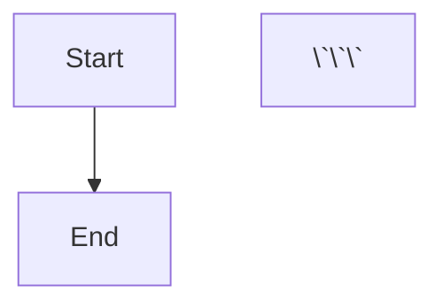
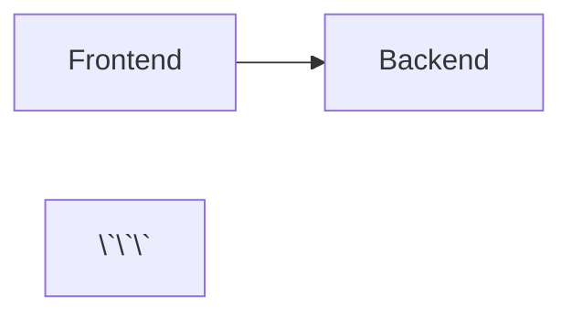

# Mermaid 图表导出器

自动将 Markdown 文件中的 Mermaid 图表导出为 PNG 图片，支持中文文件命名。

## 快速开始

### 1. 安装依赖

```bash
# 安装 Mermaid CLI（全局）
npm install -g @mermaid-js/mermaid-cli

# 验证安装
mmdc --version
```

### 2. 使用方法

```bash
# 导出单个 Markdown 文件中的图表
python scripts/export_mermaid.py your-file.md

# 导出整个目录（递归）
python scripts/export_mermaid.py ./docs/ --recursive

# 指定输出目录
python scripts/export_mermaid.py design.md --output-dir ./images/
```

## 命名规则

脚本会按以下优先级提取图表名称：

1. **Mermaid 代码中的 title 注释**（最高优先级）
2. **代码块前面的 Markdown 标题**（## 标题）
3. **自动编号**（如无标题）

### 示例 1：使用 title 注释

```markdown


导出文件：`用户登录流程.png`

### 示例 2：使用前置标题

```markdown
## 系统架构图



导出文件：`系统架构图.png`

### 示例 3：自动编号

```markdown


导出文件：`mermaid-图表-1.png`

## 高级选项

```bash
# 自定义图片尺寸
python scripts/export_mermaid.py design.md --width 2560 --height 1440

# 使用深色主题
python scripts/export_mermaid.py design.md --theme dark

# 透明背景
python scripts/export_mermaid.py design.md --background transparent

# 高分辨率（2x）
python scripts/export_mermaid.py design.md --scale 2
```

## 完整示例

假设有以下 Markdown 文件 `architecture.md`：

```markdown
# 系统设计文档

## 整体架构

```mermaid
%%{init: {'theme': 'base'}}%%
flowchart TB
    subgraph Frontend["前端层"]
        UI[用户界面]
    end
    
    subgraph Backend["后端层"]
        API[API服务]
        DB[(数据库)]
    end
    
    UI --> API --> DB
\`\`\`

## 用户认证流程

```mermaid
sequenceDiagram
    actor User as 用户
    participant UI as 界面
    participant Auth as 认证服务
    
    User->>UI: 输入账号密码
    UI->>Auth: 验证
    Auth-->>UI: 返回Token
    UI-->>User: 登录成功
\`\`\`
```

执行命令：

```bash
python scripts/export_mermaid.py architecture.md
```

输出：

```
处理文件: architecture.md
找到 2 个 Mermaid 图表

导出: 整体架构.png ... ✓
导出: 用户认证流程.png ... ✓

完成! 2/2 个图表已保存到: ./
```

生成的文件：
- `整体架构.png`
- `用户认证流程.png`

## 集成到项目

### 在 Cursor/VSCode 中配置任务

创建 `.vscode/tasks.json`：

```json
{
  "version": "2.0.0",
  "tasks": [
    {
      "label": "导出当前文件的 Mermaid 图表",
      "type": "shell",
      "command": "python",
      "args": [
        "${workspaceFolder}/.cursor/skills/mermaid-exporter/scripts/export_mermaid.py",
        "${file}"
      ],
      "group": "build",
      "presentation": {
        "reveal": "always",
        "panel": "new"
      }
    }
  ]
}
```

然后通过 `Ctrl+Shift+P` → `Tasks: Run Task` → `导出当前文件的 Mermaid 图表` 执行。

### Git 钩子集成

在 `.git/hooks/pre-commit` 中添加：

```bash
#!/bin/bash
# 自动导出修改过的 Markdown 文件中的图表

changed_md_files=$(git diff --cached --name-only --diff-filter=ACM | grep '\.md$')

if [ -n "$changed_md_files" ]; then
  echo "导出 Mermaid 图表..."
  for file in $changed_md_files; do
    python .cursor/skills/mermaid-exporter/scripts/export_mermaid.py "$file"
  done
  
  # 将生成的 PNG 添加到提交
  git add *.png
fi
```

## 常见问题

### Q: 为什么图表导出失败？

A: 检查以下几点：
1. 确保 Mermaid CLI 已正确安装：`mmdc --version`
2. 检查 Mermaid 语法是否正确
3. 查看终端输出的详细错误信息

### Q: 中文文件名显示为乱码？

A: 在 Windows PowerShell 中执行：
```powershell
[Console]::OutputEncoding = [System.Text.Encoding]::UTF8
chcp 65001
```

### Q: 图表很大时导出很慢？

A: 正常现象。复杂图表渲染需要时间，可以：
- 减小 `--width` 和 `--height` 参数
- 简化图表内容
- 使用 `--scale 1` 而不是更高的缩放比例

### Q: 支持哪些 Mermaid 图表类型？

A: 支持所有 Mermaid 图表类型：
- flowchart / graph（流程图）
- sequenceDiagram（时序图）
- classDiagram（类图）
- stateDiagram（状态图）
- erDiagram（ER 图）
- gantt（甘特图）
- pie（饼图）
- gitGraph（Git 图）
- C4 架构图等

## 技术细节

### 依赖项

- **Node.js** ≥ 16
- **@mermaid-js/mermaid-cli** (npm 包)
- **Python** ≥ 3.7

### 工作原理

1. 使用正则表达式解析 Markdown 文件，提取 ` ```mermaid ` 代码块
2. 从代码或上下文中提取图表标题
3. 创建临时 `.mmd` 文件保存 Mermaid 代码
4. 调用 `mmdc` 命令行工具渲染 PNG
5. 清理临时文件，输出结果

### 限制

- 文件名中的非法字符（`<>:"/\|?*`）会被替换为 `-`
- 同名文件会被覆盖，请注意备份
- 导出大量图表时可能需要较长时间

## 更新日志

### v1.0.0 (2026-01-30)

- 初始版本
- 支持从 Markdown 提取 Mermaid 图表
- 支持中文文件命名
- 支持自定义输出目录、主题、尺寸等
- 支持递归处理目录

## 许可

MIT License

## 反馈

如有问题或建议，欢迎提交 Issue。
