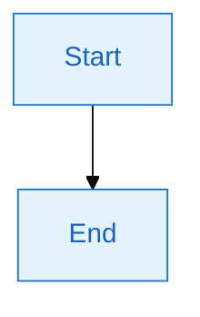

# Mermaid 图表导出器

自动扫描 Markdown 文件中的 Mermaid 图表，将其导出为 PNG 格式图片，保存在 Markdown 文件同级目录下的专属子目录中（格式：`文件名-images/`）。

## 功能特性

- 自动识别所有 Mermaid 代码块
- 提取图表标题（中文名称）
- 高质量 PNG 图片导出
- 智能文件命名（使用中文标题）
- 支持所有 Mermaid 图表类型（流程图、时序图、类图等）

## 使用方法

### 1. 前置条件检查

确保系统已安装 Mermaid CLI：

```bash
# 检查是否已安装
npm list -g @mermaid-js/mermaid-cli

# 如未安装，执行安装
npm install -g @mermaid-js/mermaid-cli
```

### 2. 导出图表

使用提供的脚本导出图表：

```bash
python scripts/export_mermaid.py <markdown文件路径>
```

**示例**：
```bash
# 导出单个文件
python scripts/export_mermaid.py ./docs/architecture.md

# 导出整个目录
python scripts/export_mermaid.py ./docs/
```

## 目录结构

脚本会自动在 Markdown 文件同级目录下创建专属子目录来存放图片：

**结构示例**：
```
docs/
├── design.md              # Markdown 源文件
└── design-images/         # 自动创建的图片目录
    ├── 系统架构图.png
    ├── 用户流程.png
    └── 数据模型.png
```

**命名规则**：子目录名 = `Markdown文件名-images`

例如：
- `plan-template.md` → `plan-template-images/`
- `architecture.md` → `architecture-images/`
- `README.md` → `README-images/`

## 图表命名规则

脚本会按以下规则提取图表名称：

### 1. 优先使用标题注释

```markdown


**导出文件名**: `用户认证流程.png`

### 2. 使用前置标题

```markdown
### 系统架构图


**导出文件名**: `系统架构图.png`

### 3. 自动生成编号

如果没有找到标题，使用编号：

**导出文件名**: `mermaid-图表-1.png`, `mermaid-图表-2.png`

## 工作流程

1. **扫描文件**: 读取 Markdown 内容
2. **识别图表**: 查找所有 ` ```mermaid ` 代码块
3. **提取名称**: 按命名规则提取图表名称
4. **创建目录**: 在 Markdown 同级目录下创建 `文件名-images/` 子目录
5. **生成图片**: 调用 Mermaid CLI 渲染 PNG
6. **保存文件**: 保存到专属子目录中

## 输出示例

```
处理文件: docs/design.md
找到 3 个 Mermaid 图表

输出目录: docs/design-images

导出进度:
✓ 系统架构图.png
✓ 用户登录流程.png
✓ 数据库设计.png

完成! 所有图表已保存到: docs/design-images/
```

## 配置选项

脚本支持以下可选参数：

| 参数 | 说明 | 默认值 |
|------|------|--------|
| `--output-dir` | 指定输出目录 | `文件名-images/` 子目录 |
| `--width` | 图片宽度 | 1920 |
| `--height` | 图片高度 | 1080 |
| `--theme` | Mermaid 主题 | default |
| `--background` | 背景颜色 | white |

**示例**：
```bash
python scripts/export_mermaid.py docs/design.md \
  --output-dir ./images/ \
  --width 2560 \
  --theme dark
```

## 批量处理

处理整个目录下所有 Markdown 文件：

```bash
# 递归处理所有 .md 文件
python scripts/export_mermaid.py ./docs/ --recursive
```

## 常见问题

### 图表渲染失败

**症状**: 生成的 PNG 文件为空或报错

**解决方案**:
1. 检查 Mermaid 语法是否正确
2. 确保安装了最新版本的 mermaid-cli
3. 查看错误日志，修复语法问题

### 中文文件名乱码

**症状**: 文件名显示为乱码

**解决方案**:
1. 确保系统支持 UTF-8 编码
2. 在 PowerShell 中执行: `[Console]::OutputEncoding = [System.Text.Encoding]::UTF8`

### 图片质量不佳

**解决方案**:
```bash
# 提高分辨率
python scripts/export_mermaid.py design.md --width 3840 --height 2160

# 使用 puppeteer 配置（高质量）
python scripts/export_mermaid.py design.md --scale 2
```

## 高级用法

### 自定义样式

在 Mermaid 代码块中使用样式配置：



### 与 Git 集成

在 pre-commit hook 中自动导出图表：

```bash
# .git/hooks/pre-commit
#!/bin/bash
python scripts/export_mermaid.py . --recursive --changed-only
git add *.png
```

## 注意事项

1. **文件覆盖**: 同名 PNG 文件会被覆盖，建议先备份
2. **性能**: 大量图表导出需要时间，耐心等待
3. **依赖**: 确保 Node.js 和 npm 版本足够新（Node.js ≥ 16）
4. **路径**: 使用绝对路径或相对于当前目录的路径

## 集成到工作流

### VS Code Task

在 `.vscode/tasks.json` 中配置：

```json
{
  "label": "导出 Mermaid 图表",
  "type": "shell",
  "command": "python",
  "args": [
    "${workspaceFolder}/.cursor/skills/mermaid-exporter/scripts/export_mermaid.py",
    "${file}"
  ],
  "problemMatcher": []
}
```

### 快捷键

建议用户配置快捷键快速导出当前文件的图表。

## 脚本位置

```
.cursor/skills/mermaid-exporter/
└── scripts/
    └── export_mermaid.py
```

直接执行脚本，无需额外配置。
