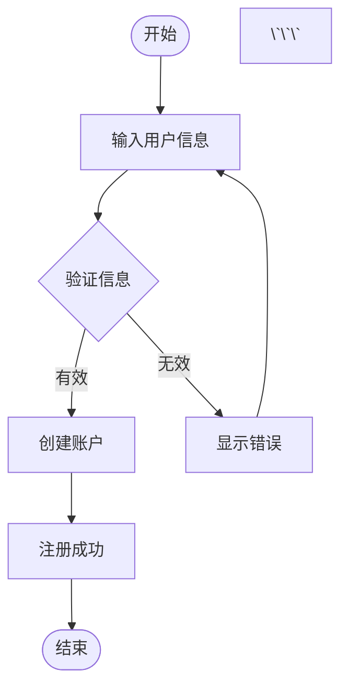
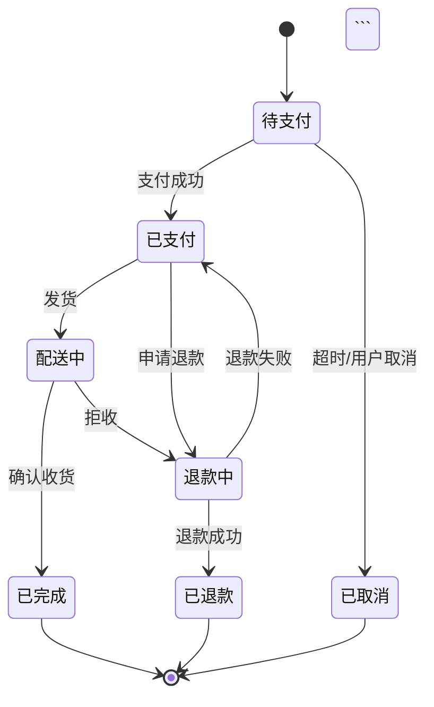
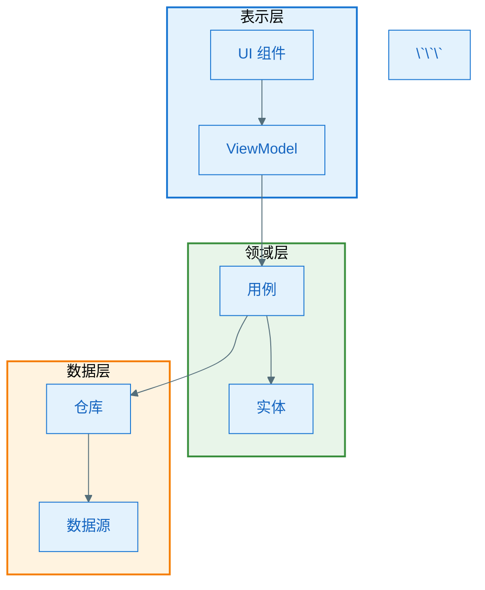

# Mermaid 图表导出示例

## 示例 1：基础流程图

### 输入 Markdown

```markdown
## 用户注册流程



### 执行命令

```bash
python scripts/export_mermaid.py example.md
```

### 输出结果

- 生成文件：`用户注册流程.png`
- 尺寸：1920x1080
- 主题：default

---

## 示例 2：时序图（使用 title 注释）

### 输入 Markdown

```markdown
下面是系统交互流程：

```mermaid
%%{title: "微服务通信时序"}%%
%%{init: {'theme': 'base', 'themeVariables': {
  'actorBkg': '#E3F2FD',
  'actorBorder': '#1976D2'
}}}%%
sequenceDiagram
    autonumber
    
    actor User as 用户
    participant Gateway as API网关
    participant Auth as 认证服务
    participant Order as 订单服务
    participant DB as 数据库

    User->>Gateway: 创建订单请求
    Gateway->>Auth: 验证Token
    Auth-->>Gateway: Token有效
    Gateway->>Order: 转发订单请求
    Order->>DB: 保存订单
    DB-->>Order: 成功
    Order-->>Gateway: 订单ID
    Gateway-->>User: 返回订单ID
\`\`\`
```

### 执行命令

```bash
python scripts/export_mermaid.py example.md --theme default
```

### 输出结果

- 生成文件：`微服务通信时序.png`
- 使用了 title 注释中的名称
- 保留了自定义样式配置

---

## 示例 3：类图（高分辨率）

### 输入 Markdown

```markdown
### 领域模型类图

```mermaid
classDiagram
    direction TB
    
    class User {
        +String id
        +String name
        +String email
        +login()
        +logout()
    }
    
    class Order {
        +String id
        +Date createdAt
        +BigDecimal total
        +calculateTotal()
        +submit()
    }
    
    class OrderItem {
        +String productId
        +int quantity
        +BigDecimal price
    }
    
    class Product {
        +String id
        +String name
        +BigDecimal price
        +int stock
    }
    
    User "1" --> "*" Order : places
    Order "1" --> "*" OrderItem : contains
    OrderItem "*" --> "1" Product : references
\`\`\`
```

### 执行命令

```bash
python scripts/export_mermaid.py example.md \
  --width 2560 \
  --height 1440 \
  --scale 2
```

### 输出结果

- 生成文件：`领域模型类图.png`
- 尺寸：2560x1440
- 缩放：2x（高清）

---

## 示例 4：状态图（深色主题）

### 输入 Markdown

```markdown
## 订单状态机



### 执行命令

```bash
python scripts/export_mermaid.py example.md \
  --theme dark \
  --background transparent
```

### 输出结果

- 生成文件：`订单状态机.png`
- 主题：dark
- 背景：透明

---

## 示例 5：ER 图（数据库设计）

### 输入 Markdown

```markdown
### 数据库 ER 图

```mermaid
erDiagram
    USER ||--o{ ORDER : places
    USER {
        string user_id PK
        string username
        string email
        datetime created_at
    }
    
    ORDER ||--|{ ORDER_ITEM : contains
    ORDER {
        string order_id PK
        string user_id FK
        decimal total_amount
        datetime created_at
        string status
    }
    
    ORDER_ITEM }o--|| PRODUCT : references
    ORDER_ITEM {
        string item_id PK
        string order_id FK
        string product_id FK
        int quantity
        decimal price
    }
    
    PRODUCT {
        string product_id PK
        string name
        decimal price
        int stock
    }
\`\`\`
```

### 执行命令

```bash
python scripts/export_mermaid.py example.md
```

### 输出结果

- 生成文件：`数据库 ER 图.png`
- 自动检测到前置 Markdown 标题

---

## 示例 6：甘特图（项目计划）

### 输入 Markdown

```markdown
## 项目开发计划

```mermaid
gantt
    title Android App 开发计划
    dateFormat YYYY-MM-DD
    
    section 需求阶段
    需求分析           :done, req1, 2026-01-01, 5d
    原型设计           :done, req2, after req1, 3d
    
    section 开发阶段
    UI开发            :active, dev1, 2026-01-10, 10d
    API对接           :dev2, after dev1, 7d
    功能测试          :dev3, after dev2, 5d
    
    section 发布阶段
    打包上线          :release1, after dev3, 2d
    监控反馈          :release2, after release1, 7d
\`\`\`
```

### 执行命令

```bash
python scripts/export_mermaid.py example.md --width 2400
```

### 输出结果

- 生成文件：`项目开发计划.png`
- 宽度：2400px（更宽以容纳时间轴）

---

## 示例 7：批量处理目录

### 目录结构

```
docs/
├── architecture.md    (包含 3 个图表)
├── api-design.md      (包含 2 个图表)
└── database.md        (包含 1 个图表)
```

### 执行命令

```bash
python scripts/export_mermaid.py ./docs/ --recursive
```

### 输出结果

```
找到 3 个 Markdown 文件

处理文件: docs/architecture.md
找到 3 个 Mermaid 图表

导出: 系统架构图.png ... ✓
导出: 模块依赖关系.png ... ✓
导出: 部署架构.png ... ✓

完成! 3/3 个图表已保存到: docs/

处理文件: docs/api-design.md
找到 2 个 Mermaid 图表

导出: 接口调用流程.png ... ✓
导出: 错误处理机制.png ... ✓

完成! 2/2 个图表已保存到: docs/

处理文件: docs/database.md
找到 1 个 Mermaid 图表

导出: 数据库表关系.png ... ✓

完成! 1/1 个图表已保存到: docs/

总计导出 6 个图表
```

---

## 示例 8：指定输出目录

### 执行命令

```bash
# 将所有图表集中导出到 images 目录
python scripts/export_mermaid.py ./docs/ \
  --recursive \
  --output-dir ./images/diagrams/
```

### 输出结果

```
images/
└── diagrams/
    ├── 系统架构图.png
    ├── 模块依赖关系.png
    ├── 部署架构.png
    ├── 接口调用流程.png
    ├── 错误处理机制.png
    └── 数据库表关系.png
```

---

## 示例 9：无标题图表（自动编号）

### 输入 Markdown

```markdown
一些图表示例：

```mermaid
graph LR
    A --> B --> C
\`\`\`

```mermaid
pie title 数据分布
    "类型A" : 40
    "类型B" : 30
    "类型C" : 30
\`\`\`
```

### 执行命令

```bash
python scripts/export_mermaid.py example.md
```

### 输出结果

- 生成文件：`mermaid-图表-1.png`（第一个图表）
- 生成文件：`mermaid-图表-2.png`（第二个图表）

---

## 示例 10：Material Design 风格图表

### 输入 Markdown

遵循项目的 Mermaid 样式规范：

```markdown
### Android 架构分层



### 执行命令

```bash
python scripts/export_mermaid.py example.md
```

### 输出结果

- 生成文件：`Android 架构分层.png`
- 保留了所有 Material Design 配色
- 自定义样式完整应用

---

## 最佳实践建议

### 1. 为图表添加标题

推荐使用 Markdown 标题（## 或 ###）或 Mermaid title 注释：

```markdown
## 清晰的图表标题


### 2. 保持图表简洁

复杂图表导出慢且难以阅读，建议：
- 单个图表节点数 < 20
- 拆分复杂流程为多个子图
- 使用 subgraph 组织结构

### 3. 统一样式配置

在项目中使用统一的主题配置：

```mermaid
%%{init: {'theme': 'base', 'themeVariables': {...}}}%%
```

### 4. 版本控制

将生成的 PNG 纳入 Git 管理：
- 方便查看历史变更
- 无需重新生成即可预览
- 适合文档发布

### 5. CI/CD 集成

在 CI 流程中自动导出图表：

```yaml
# .github/workflows/export-diagrams.yml
name: Export Mermaid Diagrams

on: [push]

jobs:
  export:
    runs-on: ubuntu-latest
    steps:
      - uses: actions/checkout@v3
      - uses: actions/setup-node@v3
      - run: npm install -g @mermaid-js/mermaid-cli
      - run: |
          python .cursor/skills/mermaid-exporter/scripts/export_mermaid.py ./docs/ --recursive
      - run: git add *.png && git commit -m "docs: update diagrams" || true
```

---

## 故障排查

### 问题：图表导出为空白图片

**原因**：Mermaid 语法错误

**解决**：
1. 在线验证语法：https://mermaid.live/
2. 查看终端错误信息
3. 检查特殊字符是否正确转义

### 问题：中文文字显示为方框

**原因**：系统缺少中文字体

**解决**：
```bash
# Ubuntu/Debian
sudo apt install fonts-noto-cjk

# macOS
brew install font-noto-sans-cjk

# Windows（通常已内置）
```

### 问题：导出速度很慢

**原因**：渲染引擎需要启动浏览器

**优化方案**：
- 批量处理而非单独导出
- 减小图片尺寸
- 降低 scale 参数
