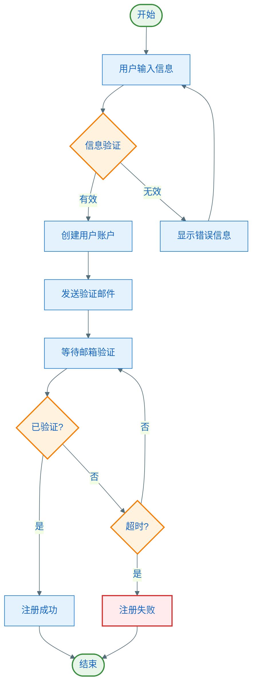
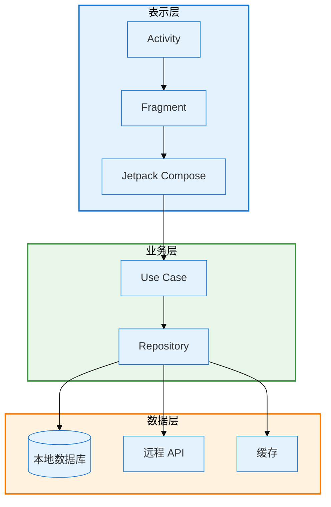
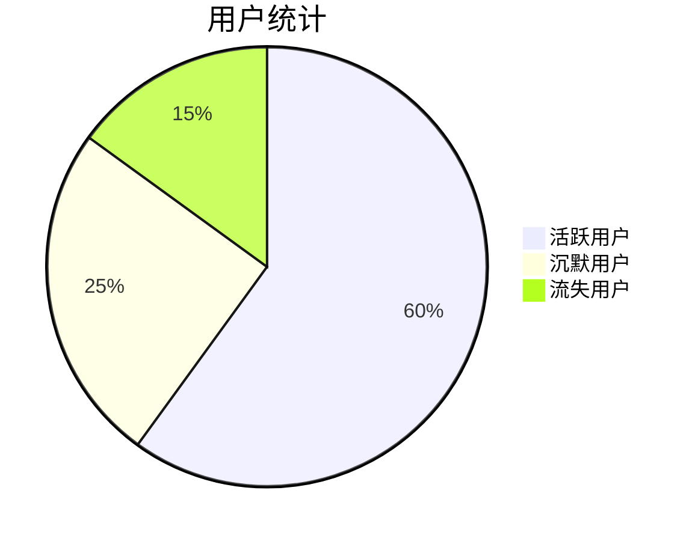

# 测试文档 - Mermaid 图表示例

本文档用于测试 Mermaid 图表导出功能。

## 用户注册流程

下面是用户注册的完整流程图：



## 系统架构



下面是一个没有标题的图表（将自动编号）：



## 测试说明

执行以下命令测试导出功能：

```bash
# 方法 1：直接导出本文件
python scripts/export_mermaid.py test-example.md

# 方法 2：导出到指定目录
python scripts/export_mermaid.py test-example.md --output-dir ./test-output/

# 方法 3：使用深色主题
python scripts/export_mermaid.py test-example.md --theme dark
```

预期输出文件：
- `用户注册流程.png`（从 Markdown 标题提取）
- `三层架构设计.png`（从 Mermaid title 注释提取）
- `mermaid-图表-3.png`（自动编号）
