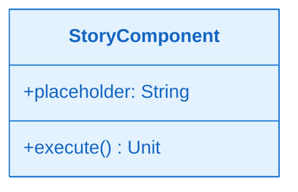
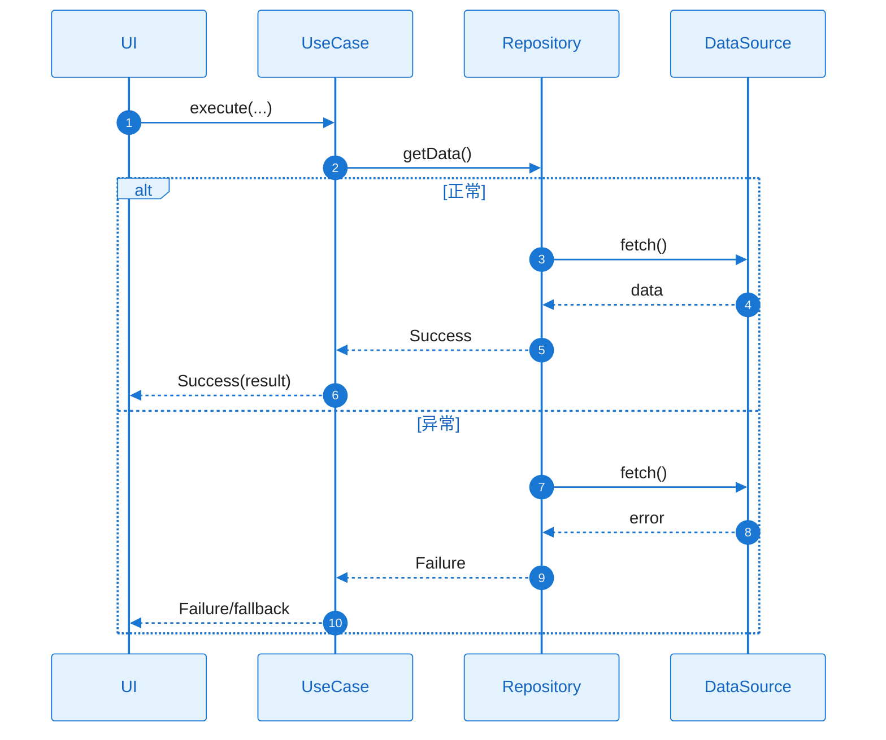

# L2 Story 详细设计（二层详细设计）

本文档与 **plan.md** 配套使用：当 Plan Level = Deep 时，各 Story 的 L2 详细设计在此文档中编写；plan.md 中通过「Story Detailed Design」章节引用本文档。

**使用方式**：建议将本文档与 plan.md 置于同一目录（如同一 Feature 目录下），便于版本管理与评审时一并查看。

---

## 文档约定

- 对每个 Story，必须同时覆盖：**需求描述**、**功能设计（类图/时序图/触发条件）**、**技术约束**、**验证方式**。
- tasks.md 的每个 Task 应明确引用对应 Story 的详细设计入口（例如：`L2_story_detail_design.md:ST-001:功能设计:时序图`）。

---

### ST-001 Detailed Design：[标题]

#### 1) 需求及描述

- **需求描述**：[Story 做什么，为什么需要，关联的 FR/NFR]
- **需求依赖**：[依赖的其他 Story、外部模块、前置条件]
- **使用范围**：[哪些模块/页面会使用，影响范围]
- **使用接口**：[对外暴露的接口/方法签名]
- **DoD（验收标准）**：
  - [ ] [功能验收：引用 FR-xxx]
  - [ ] [NFR 验收：性能/功耗/内存阈值，引用 NFR-xxx]

#### 2) 功能设计

##### 功能设计关键说明

> **目的**：用精炼的文字说清楚该 Story 的实现核心与关键技术路径。
>
> **要求**：3-5 段精炼文字（每段 2-3 句话），覆盖：核心实现思路、关键技术选型、主要类职责、数据流向、失败处理策略。

**核心实现思路**：
- [一句话说明本 Story 的实现核心]
- [关键技术决策：为什么选择这个方案而非其他方案]

**关键类与职责划分**：
- [列出 2-4 个核心类，每个类一句话说明职责]
- [说明类之间的协作关系：谁依赖谁，为什么这样分层]

**数据流向与转换**：
- [输入数据从哪里来，经过哪些转换，最终到哪里去]
- [如涉及缓存/持久化，说明数据一致性策略]

**失败处理与边界**：
- [关键错误场景的处理策略：重试/降级/提示]
- [资源释放与取消语义：协程取消时如何保证一致性]

##### 类图

**关键类职责说明**：

| 类/接口 | 核心职责 | 关键方法说明 |
|---|---|---|
| [类名] | [做什么] | [方法1]：用途；[方法2]：用途 |

##### 时序图（含正常+异常）

> **完整性要求**：时序图必须在 Story 内部完整，覆盖该 Story 从触发到响应的完整方法调用链，包括正常流程和关键异常处理，不得遗漏核心交互步骤。

##### 触发条件与系统响应

| 触发条件 | 系统响应（正常流程） | 异常处理 |
|---|---|---|
| [用户操作/事件] | [正常流程描述] | [异常情况及对策] |

#### 3) 技术约束（必要时补充）

- **并发/线程模型**：[如涉及并发：串行/并行、互斥策略、线程调度]
- **资源管理**：[如涉及资源：文件/连接/缓存的申请与释放时机]
- **性能/内存约束**：[如有性能要求：响应时间、内存占用、优化策略]

#### 4) 验证与测试

- **单元测试**：[覆盖核心逻辑与错误分支]
- **集成测试**：[覆盖用户主流程与关键异常场景]
- **NFR 验证**：[性能/功耗/内存测量方法、阈值、设备模型]

---

### ST-002 Detailed Design：[标题]

（同 ST-001 结构）

---

*更多 Story 按相同结构追加。*
