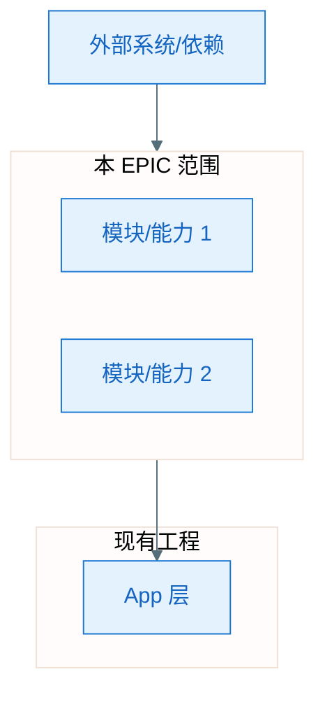
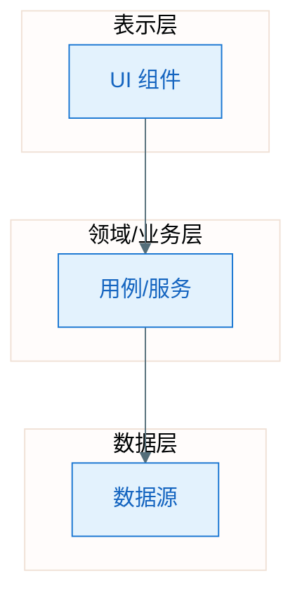

# EPIC 架构：EPIC-[编号] - [EPIC 名称]

（各 Feature 的 plan 的 A2/A3.1 须继承本架构；须基于现有工程代码，遵循 constitution。）

**Epic**：EPIC-[编号] - [名称]
**Epic Version**：v0.1.0（来自 `epic.md`）
**epic-arch Version**：v0.1.0
**创建/更新日期**：[YYYY-MM-DD]
**输入**：`epic.md`、各 `features/*/spec.md`、现有工程代码、`.specify/memory/constitution.md`

> **原则**：从**整个 EPIC 需求**整体看待与设计技术架构，保证各 Feature 的 plan 基于同一套 0 层/1 层与规范；须基于**现有工程代码**做演进式设计，遵循 constitution。

## 0 层架构（EPIC 与外部/现有工程边界）

> **目的**：明确本 EPIC 在整体系统中的位置、与外部系统及现有工程的边界、主要子系统或模块划分。各 Feature 的 plan 的 A2（Feature 全景架构）须在本图约束下展开。

- **边界说明**：[本 EPIC 与上游/下游系统、现有 App 模块的边界；哪些在 EPIC 内、哪些复用现有]
- **主要子系统/模块**：[高层模块或能力块列表，可与 Feature 或跨 Feature 能力对应]

### 0 层架构图（必须）

> 使用 Mermaid flowchart，遵循 `.cursor/rules/mermaid-style-guide.mdc`。图中须体现：EPIC 范围、外部依赖、现有工程衔接。

## 1 层架构（分层与模块职责）

> **目的**：明确 EPIC 内各层/模块的职责与依赖方向，与现有代码分层衔接。各 Feature 的 plan 的 A3.1（第一层整体框架）须在本图约束下展开。

- **分层说明**：[表示层 / 领域层 / 数据层 或本项目实际分层；与现有工程对应关系]
- **模块职责**：[各模块职责一句话；哪些由哪个 Feature Owner 设计见 epic.md「跨 Feature 技术策略」]

### 1 层架构图（必须）

> 使用 Mermaid flowchart，体现分层与依赖方向。

## 规范与约束（所有 Feature plan 必须遵守）

> 与 `epic.md` 的「跨 Feature 技术策略」中「技术约束」对齐或细化；不得与 constitution 冲突。

- **技术栈**：[语言、UI 框架、构建、最低/目标 API；与 constitution 一致]
- **分层与依赖**：[依赖方向、禁止反向依赖、模块边界]
- **接口/契约**：[跨 Feature 或跨层接口原则、错误语义]
- **线程与并发**：[如 IO 统一 Dispatchers.IO、主线程约束]
- **依赖注入**：[如统一 Hilt]
- **其他**：[安全、可观测性、性能预算等 EPIC 级约束]

## 与「跨 Feature 技术策略」的对应

| epic-arch 章节     | epic.md「跨 Feature 技术策略」对应项 |
|--------------------|--------------------------------------|
| 0 层架构图         | 共享能力识别、Feature Plan 执行顺序  |
| 1 层架构图         | 共享能力识别、技术约束               |
| 规范与约束         | 技术约束                             |

> 若 epic.md 该节尚为占位，可根据本 epic-arch 输出建议其内容；后续变更须双向同步。

## 变更记录（增量变更）

| 版本   | 日期       | 变更范围     | 变更摘要 | 影响 Feature / plan |
|--------|------------|--------------|----------|---------------------|
| v0.1.0 | [YYYY-MM-DD] | 初始         | 初版     | —                    |
