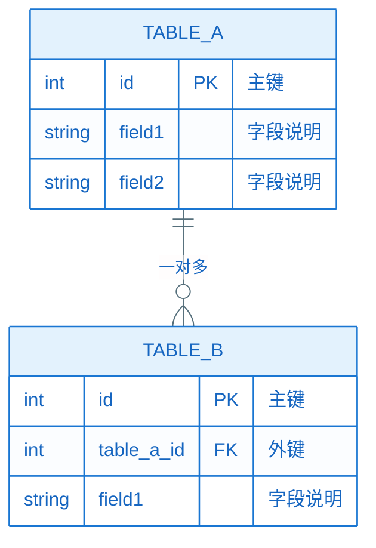

# 数据库设计：EPIC-[编号] - [EPIC 名称]

> **定位**：本文件对应 `epic-design.md` **§十**，面向方案评审，完整描述本 EPIC 涉及的所有数据库表结构设计，与各 Feature 的 `plan.md` §三「数据存储约束」对齐，确保数据模型在评审阶段得到充分论证。
>
> **互指**：`epic-design.md` §十仅保留定位说明、可选摘要与指向本文件的链接；**正文以本文件为准**。
>
> **与 plan.md 的关系**：各 Feature 的 `plan.md` §三（含 §3.1/§3.2）中定义了数据存储的**完整规约**（字段类型、约束、索引等），本文件从 EPIC 维度汇总与评审关键数据表，以整体视角描述数据模型。
>
> **适用场景**：本 EPIC 涉及本地数据库（Room/SQLite）、云端数据库、键值存储等持久化数据结构设计。若无数据库设计标注 N/A。

**Epic**：EPIC-[编号] - [名称]
**关联文件**：`epic-design.md` | 各 `features/*/plan.md` §三
**创建/更新日期**：[YYYY-MM-DD]

---

### 10.1 数据库概览

#### 10.1.1 数据存储清单

| 存储ID   | 存储名称       | 存储类型                                   | 所属 Feature | 表/集合数量 | 规约位置                   |
| ------ | ---------- | -------------------------------------- | ---------- | ------ | ---------------------- |
| DB-001 | [数据库/存储名称] | [Room/SQLite/SharedPrefs/DataStore/云端] | FEAT-xxx   | [N 张表] | FEAT-xxx plan.md §三（§3.1/§3.2） |

#### 10.1.2 数据库 ER 图（推荐）

> 用 ER 图展示关键数据表之间的关系，便于评审者理解整体数据模型。

### 10.2 数据表详细设计

> 每张表一节，完整描述字段含义、类型、约束和索引。

#### 10.2.1 [表名 / TABLE_A]

- **所属模块**：[模块名称]
- **所属 Feature**：FEAT-xxx
- **用途描述**：[一句话说明该表存储什么数据、用于什么场景]

##### 字段设计

| 字段名     | 类型                       | 是否必填 | 默认值     | 说明       | 约束                        |
| ------- | ------------------------ | ---- | ------- | -------- | ------------------------- |
| `id`    | INTEGER                  | 是    | 自增      | 主键       | PRIMARY KEY AUTOINCREMENT |
| `[字段名]` | [TEXT/INTEGER/REAL/BLOB] | 是/否  | [默认值/-] | [字段含义说明] | [UNIQUE/NOT NULL/外键等]     |

##### 索引设计

| 索引名             | 索引字段  | 索引类型          | 用途说明     |
| --------------- | ----- | ------------- | -------- |
| `idx_[表名]_[字段]` | [字段名] | UNIQUE / 普通索引 | [查询场景说明] |

##### 版本迁移

| 版本号 | 变更内容        | 迁移策略                   |
| --- | ----------- | ---------------------- |
| v1  | 初始建表        | 创建表                    |
| v2  | [新增字段/修改字段] | [ALTER TABLE / 数据迁移脚本] |

- **规约完整定义**：→ `FEAT-xxx plan.md §三（§3.1/§3.2）`

#### 10.2.2 [表名 / TABLE_B]

（结构同 10.2.1）

### 10.3 数据设计说明

> 说明关键的数据设计决策，包括数据一致性策略、缓存策略、数据生命周期管理等。

- **数据一致性**：[本地与远端数据的一致性策略，如 Single Source of Truth、乐观锁、最终一致性等]
- **缓存策略**：[缓存失效机制、缓存大小上限、LRU 策略等]
- **数据生命周期**：[数据保留策略、过期清理机制、用户注销后的数据处理]
- **数据迁移策略**：[版本升级时的 Migration 策略，与 `nfr.md` §8.6 兼容性评估中数据库升级项对应]
- **敏感数据处理**：[加密字段、脱敏策略，与 `nfr.md` §8.5 安全评估对应]

### 10.4 数据库设计一致性自检

- 所有数据表已在对应 Feature 的 `plan.md` §三 中有完整的数据存储规约定义
- §10.1 ER 图中的表关系与 `epic-design.md` §三 领域模型概念一致
- 所有外键关联已在字段约束中明确标注
- 数据库版本迁移策略已在 `nfr.md` §8.6 兼容性评估中覆盖
- 敏感字段已在 `nfr.md` §8.5 安全评估中标注加密/脱敏要求
