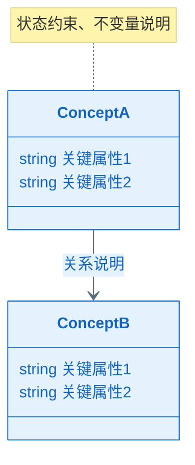
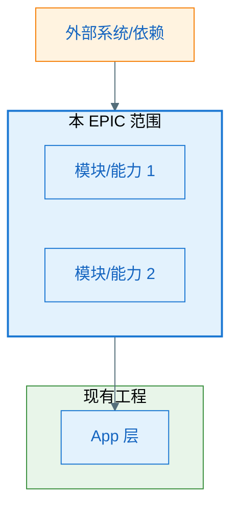
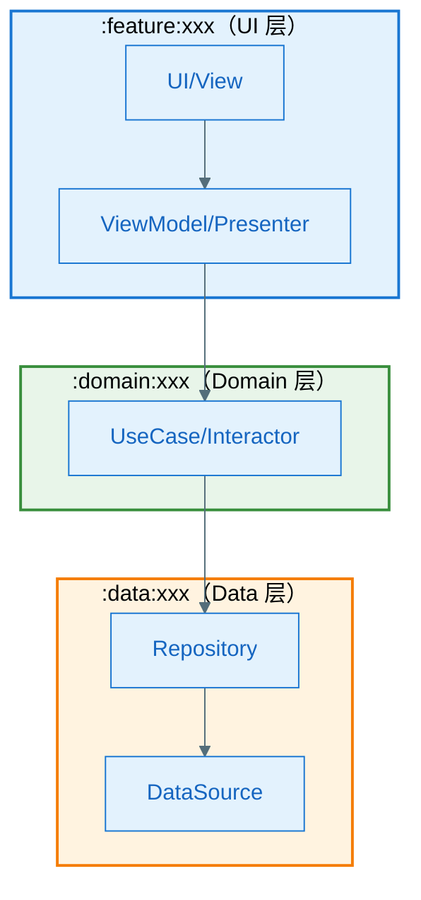
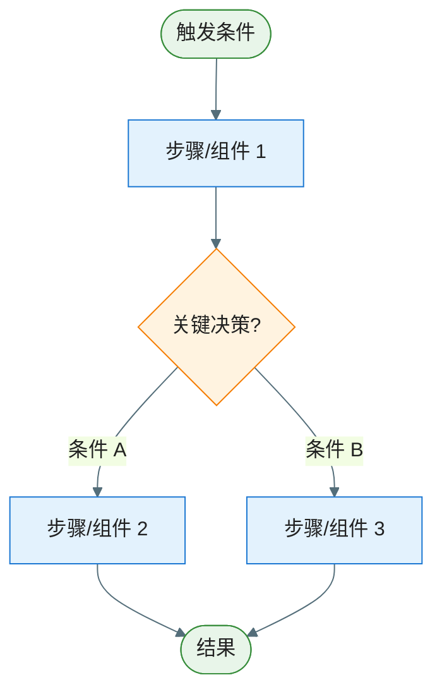
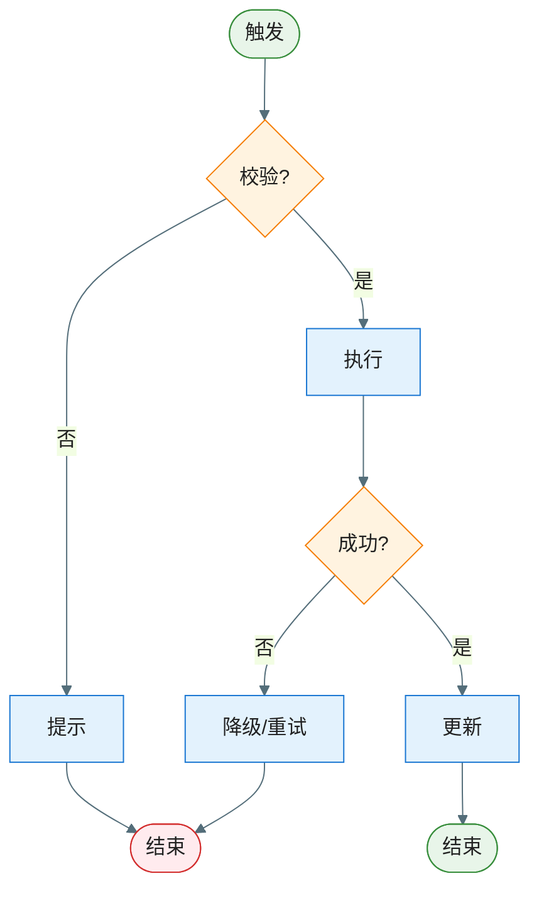
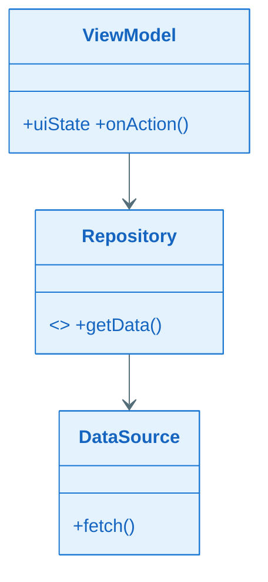
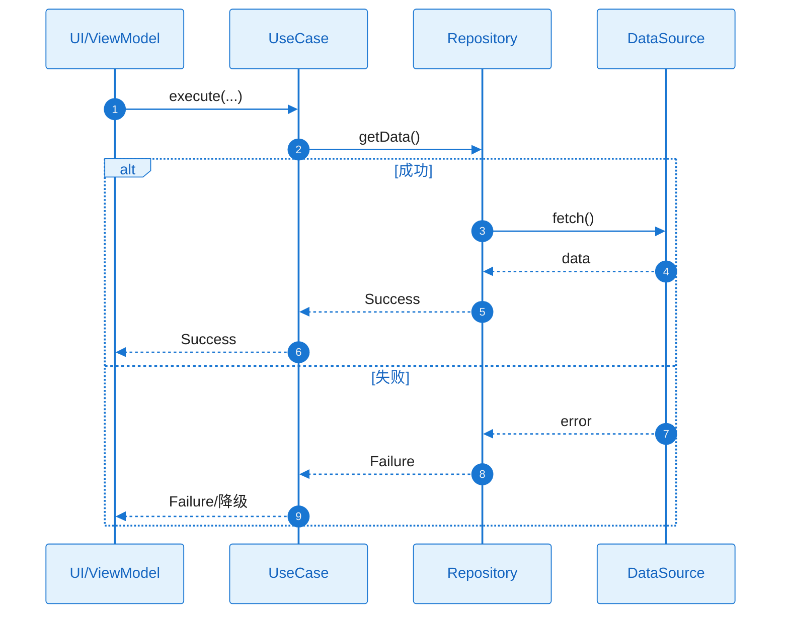
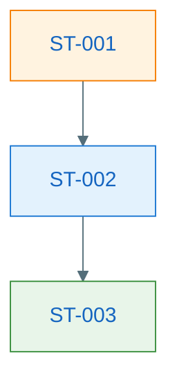

# EPIC 软件设计说明书：EPIC-[编号] - [EPIC 名称]

> **定位**：EPIC 需求级别的技术设计方案，面向人类评审与后续 Task 拆解、Implement 阶段的 AI 编码参考。与各 Feature 的 `plan.md`（技术规约）共同约束 tasks.md 与代码实现。
>
> **输入**：`epic.md`、`epic-plan.md`、各 `features/*/spec.md`、各 `features/*/plan.md`、现有工程代码
>
> **图表规范**：样式遵循 `.cursor/rules/mermaid-style-guide.mdc`；**内容与结构**须基于本工程实际架构与真实代码，遵循 `.cursor/rules/specify-diagram-requirements.mdc`。

**Epic**：EPIC-[编号] - [名称]
**Epic Version**：v0.1.0（来自 `epic.md`）
**设计说明书 Version**：v0.1.0
**创建/更新日期**：[YYYY-MM-DD]
**当前工作分支**：`[epic/... 或 story/... ]`
**EPIC 目录**：`specs/epics/EPIC-[编号]-[short-name]/`

---

## 变更记录（增量变更）

| 版本 | 日期 | 变更范围（EPIC/Feature/Story） | 变更摘要 | 影响模块 | 是否需要回滚设计 |
|------|------|--------------------------------|----------|----------|------------------|
| v0.1.0 | [YYYY-MM-DD] | EPIC | 初始版本 | — | 否 |

---

## 设计前置检查（必须，在开始设计前完成）

> **目的**：确保本 EPIC 设计基于整体规划，跨 Feature 技术策略已明确，避免各 Feature 重复设计共享组件。与各 Feature 的 plan.md「Plan 前置检查」形成上下级一致（本 EPIC 设计确立策略，各 Feature plan 复用并落单）。
>
> **强制规则**：
> - 在开始 EPIC 设计之前，**必须完成以下检查**
> - 共享能力须在 `epic.md` 的「跨 Feature 技术策略」中明确 Owner Feature，各 Feature 的 plan 须复用、不得另起炉灶
> - 若在设计过程中发现新的共享需求，**必须先更新 epic.md 的「跨 Feature 技术策略」**，再在本文中引用

### 前置检查清单

- [ ] 已阅读 `epic.md` 的「跨 Feature 技术策略」章节（若尚未定稿，本设计说明书产出后须与之同步）
- [ ] 已阅读 `epic-plan.md`，确认本 EPIC 下各 Feature 的**执行顺序与依赖关系**
- [ ] 本 EPIC 涉及的**共享能力**已在 `epic.md` 中登记 Owner Feature（或将在本设计说明书中拟定并回流至 epic.md）
- [ ] 若已有部分 Feature 的 **plan.md**，已阅读并识别可复用的组件/接口与约束，避免本设计说明书与既有 plan 冲突

### 本 EPIC 跨 Feature 共享能力登记情况（与 epic.md 一致）

> 列出本 EPIC 范围内由各 Feature 提供或复用的共享能力，与 `epic.md`「跨 Feature 技术策略」保持一致。设计说明书中的架构（§四、§五）应与此表对齐。

| 共享能力名称 | Owner Feature | 消费方 Feature | 设计/契约位置（本文或 plan 章节） |
|--------------|---------------|----------------|----------------------------------|
| [例如：UI 基础框架] | FEAT-001 | FEAT-002, FEAT-003 | 本文 §5.3 组件清单 / FEAT-001 plan.md §五 |
| [例如：错误处理] | FEAT-001 | FEAT-002 | 本文 §5.3 / FEAT-001 plan.md §五 |

> 若某共享能力 Owner 的 plan 尚未完成，后续 Feature 的 plan 需**等待**或与其**协商接口契约**后再设计（见各 Feature plan.md 前置检查）。

### 前置检查结论

- **检查日期**：[YYYY-MM-DD]
- **检查人**：[姓名/角色]
- **结论**：通过 / 需先更新 epic.md 或 epic-plan.md / 需等待 [外部依赖或评审]
- **备注**：[如有阻塞或需协商事项]

---

## 一、简介

### 1.1 目的和对象

说明本文的目的和适合阅读的对象。如：该文档用于描述XX产品的XX版本xx软件设计。适用于设计人员、开发人员、测试人员、资料开发人员等。

### 1.2 范围

说明该文档设计的软件范围，并说明其相关的设计关系，可直接描述，如有相关文档最好指明(如已完成的特性，不完成的特性等等）。

## 二、需求概述

### 2.1 需求背景

说明需求的历史发展过程、当前提出需求的背景（市场变化、技术变化、用户痛点等）、需求来源（提出人或组织）等。

### 2.2 需求范围及限制

说明需求的适用范围、场景和限制。比如：
1. 高、中、低端机是否全部适用
2. 地区是否都适用：内销、外销、欧盟；
3. 支持的机型品牌范围
4. 是否支持升级：项目升级上来以后是否支持新的需求功能
5. 是否支持回落：比如是否支持回落到低版本的机型上
6. 是否需要保密

## 三、领域模型

### 3.1 领域概念（Domain Concepts / Glossary，必须）

> **目的**：统一命名与语义口径，成为后续"架构图/流程图/类图/时序图/接口契约"的**命名权威**。
>
> 要求：
> - 只写本 EPIC/Feature 涉及或新引入的领域概念；已有概念可引用来源（其他 Feature/EPIC/已有模块文档）
> - 每个概念必须给出：名称、定义、关键属性/状态、与其他概念的关系（可用表格或简易概念图）

### 3.2 领域概念词汇表（必须）

| 概念（中文） | 名称（英文/代码名） | 定义（一句话） | 关键属性/状态（Top3） | 不变量/约束 | 关联概念 |
|---|---|---|---|---|---|
|  |  |  |  |  |  |

### 3.3 概念关系图（推荐，可选）

> **目的**：用类图语法表达**业务领域概念**之间的关系（非技术实现）。
>
> ⚠️ **重要区分**：本节（领域概念图）与 §7.2 全景类图（技术类图）的区别
>
> | 维度 | §三 领域概念图 | §7.2 全景类图 |
> |------|---------------|--------------|
> | **目的** | 统一业务语言，建立领域模型 | 定义技术实现的静态结构 |
> | **视角** | 业务视角（产品/领域专家能看懂） | 技术视角（开发者能实现） |
> | **内容** | 业务实体、值对象、聚合关系 | 按项目架构（Clean Architecture/MVP/MVC/MVVM 等）的技术类 |
> | **方法** | 只写关键业务属性，不写方法 | 必须写完整的方法签名 |
> | **示例** | `订单`、`用户`、`商品`（业务概念） | `OrderRepository`、`OrderUseCase` 或 Presenter/Controller 等（技术组件，依架构而定） |
> | **来源** | 来自需求分析、DDD 领域建模 | 来自架构设计（Clean Architecture / MVP / MVC / MVVM 等） |
> | **修改频率** | 业务需求变化时修改 | 技术方案调整时修改 |
>
> **使用建议**：
> - 若 Feature 的业务概念较复杂（多实体/复杂关系），推荐画此图
> - 若 Feature 业务简单（如单一 CRUD），可省略此图
> - 此图中的业务概念（如 `订单`）通常在 §7 全景类图中会对应多个技术类（如 `OrderEntity`、`OrderDTO`、`OrderUseCase`）

## 四、零层架构（EPIC 与外部/现有工程边界）

> **目的**：一张图展示本 EPIC 在整体系统中的位置、与外部的关系、内部主要子系统或模块。
> 
> 要求：
> - 明确 EPIC 边界：哪些是本 EPIC 新增/修改的，哪些是复用已有的
> - 明确系统对外部的依赖，外部依赖的**故障模式**与应对策略，依赖的承接方与交付的产物
> - 无论 EPIC 大小，都必须产出全景图（小 EPIC 图更简单，但不能省略）

### 4.1 边界说明

- **EPIC 范围**：[本 EPIC 与上游/下游系统、现有 App 模块的边界；哪些在 EPIC 内、哪些复用现有]
- **主要子系统/模块**：[高层模块或能力块列表，可与 Feature 或跨 Feature 能力对应]

### 4.2 零层架构图（必须）

> 一张图展示：EPIC 边界、内部核心组件、外部依赖、数据/控制流向

### 4.3 架构设计说明（必须：理由/决策/思考）

> 用文字把"为什么这样画"说清楚，便于评审与后续实现期不走样。
> **注意**：本节聚焦架构设计原理与决策，不涉及具体代码实现。

- **边界与职责**：为什么这些能力属于本 Feature（而不是其他模块）；哪些能力明确不做（Out of Scope）
- **分层与依赖方向**：为何这样分层；为何允许/禁止某些跨层依赖（例如 UI 不直连 DataSource）
- **关键数据流**：数据从哪里来、去哪里（System of Record）、缓存策略与一致性假设
- **外部依赖策略**：对每个关键依赖的失败模式选择了什么策略（重试/退避/降级/熔断/提示），为什么
- **可演进性**：预留哪些扩展点（接口/策略注入/版本兼容）；未来变化下的最小修改面

### 4.4 外部依赖清单（若有则必填，无依赖时标注 N/A）

> **适用场景**：涉及后端 API、系统能力、第三方 SDK、已有模块等外部依赖时必填。
> 若本 Feature 为纯本地功能（如纯 UI 组件、本地计算），可标注 N/A 并简述原因。

| 依赖项 | 类型 | 提供方（团队名称） | 提供的能力 | 通信方式 | 故障模式 | 我方策略 |
|--------|------|------------------|-----------|----------|----------|----------|
| [后端 API] | 内部服务 | [团队名称] | 数据读写 | HTTPS | 超时/限流/不可用 | 重试+降级 |
| [系统能力] | OS/SDK | [系统/平台] | 权限/存储 | 系统 API | 权限拒绝/不支持 | 提示+引导 |
| [已有模块] | 内部模块 | [团队名称] | 认证/日志 | 函数调用 | — | — |

---

## 五、一层架构（分层与模块职责）

> **目的**：用一张框架图 + 配套说明，把所设计的系统的内部组件划分、依赖关系、协作机制、数据流讲清楚。
>
> **要求**：
> - **必须在图上明确标注所属的代码工程模块名称**（如 `:feature:xxx`、`:core:data`），subgraph 或组件旁须可见模块归属
> - **静态结构**：用**实线箭头**（`-->`）表示依赖/调用方向
> - **动态协作**：用**虚线箭头**（`-..->`）表示事件/回调/异步消息
> - **架构**：必须基于本工程**实际代码**、**实际模块**与既有架构绘制，禁止照搬 Clean Architecture 等模板。参见 `.cursor/rules/specify-diagram-requirements.mdc`。

### 5.1 一层框架图（必须）

> 须在图上明确标注所属的代码工程模块名称（如 `:feature:xxx`、`:core:data`）。静态依赖用实线箭头，动态协作用虚线箭头。

> **跨层约束**：[例如：UI 不得直接依赖 DataSource；Domain 不得依赖 UI]

### 5.2 组件清单与职责（必须）

> **组件定义**：组件是职责内聚的一组类/接口构成的**子模块**，粒度介于工程模块与单个类之间。本表是 EPIC 的**组件目录**，从架构视角自顶向下设计，与各 Feature plan.md 中定义的接口与契约须保持**双向一致**——组件的对外接口须能支撑 Feature 契约，Feature 契约的变更须回检组件边界。若本表调整了组件边界或接口，须通过增量变更流程同步更新相关 Feature 的 plan.md。

| 组件 | 所属模块 | 职责（一句话） | 输入/输出 | 依赖 | 约束 |
|------|----------|----------------|-----------|------|------|
| [组件A] | `:module:xxx` | [做什么] | [输入→输出] | [依赖哪些组件/外部] | [线程/生命周期/并发约束] |

### 5.3 组件协作流程图（必须）

> **目的**：用带分区的流程图展示组件之间的**端到端协作流程**，覆盖正常 + 关键异常路径。每个 subgraph 分区对应 5.2 中的组件/模块边界，与 5.1 框架图形成互补——5.1 展示静态结构，本图展示动态控制流与异常分支。
>
> 本图从架构视角设计，须与各 Feature plan.md 中定义的接口契约保持**双向一致**；若全局视角下发现组件协作方式与 Feature 契约存在矛盾，须通过增量变更流程双向同步。
>
> **要求**：
> - subgraph 分区须与 5.2 组件清单中的组件/模块对应，不得遗漏关键组件
> - 从触发端到所有可能的结束状态，控制流须完整、无断点
> - 判断节点须覆盖正常 + 关键异常分支

---

## 六、关键功能与疑难点/亮点设计

> **定位**：面向方案评审，将重难点模块的**设计策略与决策逻辑**讲清楚。本节聚焦"为什么难 → 怎么解决 → 方案的处理流程"，抽象层级与 §五（模块/组件级）对齐，不下沉到类/方法级细节（类图、时序图见 §七）。
>
> **适用**：仅纳入**技术方案设计上的**疑难点（易踩坑、需专项论证）或亮点（可作为最佳实践/创新点）。简单、显而易见的设计不纳入。
>
> **何时省略**：若无疑难点且无方案亮点，可省略本节。

### 6.1 关键设计 1：[设计点名称]

- **类型**：疑难点 | 方案亮点
- **背景/亮点说明**：疑难点→[为何是疑难点，涉及哪些组件或跨层关注点，易出现哪些坑]；亮点→[为何是亮点，创新点或最佳实践，可复用价值]
- **方案选型与取舍**：[对比了哪些候选方案，各自优劣，为什么选当前方案]（疑难点必填，亮点选填）
- **核心方案**：[核心设计策略——用什么思路解决，关键约束是什么，分 2-3 段把方案讲透]
- **关联决策**：[零层/一层架构中的决策点]（若适用）
- **边界条件与注意事项**：[关键边界、异常、并发/生命周期等]（疑难点必填，亮点选填）

#### 方案流程图（推荐，方案涉及多步决策或分支逻辑时必须）

> 用流程图将核心方案的**处理逻辑**可视化：先做什么、再做什么、什么条件走哪条分支。粒度与 §五 对齐（组件/模块级），节点使用组件或步骤名称，不涉及具体类名和方法签名。

- **类图 / 时序图位置**：→ §7.2 类图中的 [相关类/接口名] + §7.3 SEQ-[xxx]（评审时配合本节一起讲解）

### 6.2 关键设计 2：[设计点名称]

（结构同上：类型、背景/亮点说明、方案选型与取舍、核心方案、关联决策、边界条件、方案流程图、类图/时序图位置）

---

## 七、全景类图与关键流程/时序（EPIC 或主 Feature 级）

> **目的**：从 EPIC 或主 Feature 纵览关键类/接口关系与主流程时序，便于评审与 Task 引用。须基于本工程实际架构与真实代码。
>
> **图表规范**：类图须覆盖所有关键类/接口及**完整方法签名**（方法名 + 参数 + 返回值）；依赖方向正确（上层依赖下层）。时序图 participant 使用真实类名，覆盖正常 + 关键异常（alt/else）。参见 `.cursor/rules/specify-diagram-requirements.mdc`。

### 7.1 Feature 流程图集（逻辑流程，必须）

> **要求**：列出 EPIC/主 Feature 级别的所有关键流程（与 §7.3 时序图一一对应）。每个流程 1 张流程图，覆盖正常 + 异常分支；从触发条件到所有可能结束状态的完整逻辑路径不得遗漏。

#### 流程 1：[流程名称]

| 分支 | 异常ID | 触发条件 | 对策 |
|------|--------|----------|------|
| 校验失败 | EX-001 |  | 提示用户 |
| 执行失败 | EX-002 |  | 降级/重试 |

### 7.2 全景类图（必须）

> 须覆盖所有关键类/接口及方法签名；依赖方向正确（上层依赖下层）。参见 `.cursor/rules/specify-diagram-requirements.mdc`。
>
> **关联 §六**：若 §六 中的疑难点/亮点涉及特定类/接口，在类图中用 `note` 标注"关联 §6.x"，便于评审时快速定位。

#### 关键类职责说明（必须，与项目实际架构一致）

| 类/接口 | 层级 | 职责 | 关键方法 |
|---------|------|------|----------|
| [类名] | UI/Domain/Data | [做什么] | [方法]：用途 |

### 7.3 关键时序图集（方法调用流程，必须）

> 每个关键流程 1 张时序图，覆盖**类/方法级调用细节**及正常 + 关键异常（alt/else）。participant 使用真实类名；覆盖从用户触发到最终响应的完整调用链。
>
> **关联 §六**：若时序图对应 §六 中的某个疑难点/亮点，在 Seq ID 表中标注"关联 §6.x"，便于评审时从策略（§六）到实现细节（§七）的衔接。

| Seq ID | 流程名称 | 覆盖的异常（EX-xxx） | 关联 §六 |
|--------|----------|----------------------|----------|
| SEQ-001 | [流程名称] | EX-001, EX-002 | §6.x / — |

#### SEQ-001：[流程名称]

### 7.4 图表一致性自检（建议）

- [ ] §5.2 框架图中的组件 **100% 覆盖** §5.3 组件清单
- [ ] §5.3 组件清单中的每个组件在 §7.2 类图中至少有 1 个对应类/接口
- [ ] §7.2 类图中的类/接口包含**所有必要字段**，公共方法均写出**完整签名**
- [ ] §7.3 时序图中的所有 participant 在 §7.2 类图中都有对应类/接口
- [ ] §7.1 流程图集与 §7.3 时序图集一一对应

---

## 八、技术风险与评估（必须量化）

> **说明**：本节涵盖技术风险、边界异常、算法/功耗/性能/内存/安全/兼容性的**完整评估**。各子节标注「如适用」的，若不适用须标注 N/A 并简述原因。

### 8.1 技术风险与消解策略（绑定 Feature/Story）

| 风险ID | 风险描述 | 触发条件 | 影响范围 | 严重度 | 消解策略 | 对应 Feature/Story |
|--------|----------|----------|----------|--------|----------|--------------------|
| RISK-001 |  |  |  | High/Med/Low |  | FEAT-xxx / ST-??? |

### 8.2 边界与异常场景枚举（数据/状态/生命周期/并发/用户行为）

> **范围**：仅列出**关键的**、或**难以洞察发现的**边界与异常场景。显而易见、常规处理的无需逐一罗列。

- **数据边界**：[空/超大/非法/重复/过期等]
- **状态边界**：[状态机不可达/回退/重入等]
- **生命周期**：[前后台切换/旋转/进程被杀/恢复等]
- **并发**：[多线程/协程/并发写/竞态等]
- **用户行为**：[快速连点/断网/弱网/权限拒绝等]

#### 8.2.1 场景 → 应对措施对照表（必须）

> 目的：把"枚举"落到"可执行对策"，并与 §7.1 流程图 / §7.3 时序图的异常分支互校。
>
> **对策类型说明**：
> - **技术对策**：通过代码/架构层面解决（重试/退避/降级/回滚/补偿/去重/限流等）
> - **设计对策**：需产品/设计层面介入（交互引导/文案提示/流程简化/功能裁剪等），标注 `TODO(PM)` 或 `TODO(UX)` 待确认

| 场景ID | 场景类别 | 触发条件（可复现） | 影响 | 预期行为（对用户/对系统） | 技术对策 | 设计对策（产品/UX） | 观测信号（日志/埋点/指标） | 映射（流程/时序/异常ID） |
|--------|----------|---------------------|------|--------------------------|----------|---------------------|---------------------------|--------------------------|
| SC-001 | 数据 |  |  |  | [重试/降级/...] | [引导文案/流程简化/N/A] |  | 流程1 / SEQ-001 / EX-001 |

### 8.3 算法评估（如适用）

> 适用于：推荐算法、检测算法、分类算法、生成算法等涉及机器学习/AI 的场景。不适用时标注 N/A。

#### 8.3.1 客观指标（必须量化）

| 指标 | 目标值 | 备注 |
|------|--------|------|
| 准确率 (Precision) | ≥ [阈值]% | 例如：≥ 90% |
| 召回率 (Recall) | ≥ [阈值]% | 例如：≥ 85% |
| 响应时延 (p95) | ≤ [阈值] ms | 例如：≤ 200ms |
| [其他指标] | [目标值] | 根据算法类型补充 |

#### 8.3.2 主观指标（如适用）

- **可用性评分**：≥ **4.0 分** (满分 5 分，用户样本 ≥ 100 人)
- **评分维度**：[相关性/准确性/易用性等]
- **达标标准**：平均分 ≥ 4.0，且 < 3 分的比例 ≤ 10%

#### 8.3.3 降级策略（必须）

| 触发条件 | 降级策略 |
|----------|----------|
| 低端设备/弱网 | 使用轻量模型、本地缓存 |
| 算法失败 | 降级到规则策略或默认推荐 |

### 8.4 功耗评估（必须量化，基于场景）

> **计算公式**：
> - 单次功耗 (mAh) = 平均电流增量 (mA) × 使用时长 (秒) / 3600
> - 每日功耗增量 (mAh) = 单次功耗 × 每日使用次数 × 功能渗透率 / 5%
>
> **温升计算公式**（工程估算）：
> - 温升 (°C) ≈ (电流增量 (mA) / 1000 × 3.7V) × 热阻 (8°C/W) × 修正系数
> - 修正系数：短时操作（<10s）约 0.4，持续操作（>1min）约 1.0

#### 8.4.1 Top 5% 重度用户模型

| 维度 | 定义 |
|------|------|
| 设备型号 | [例如：中端机型，4000mAh 电池] |
| 使用频次 | [例如：每天使用功能 X 次] |
| 使用场景 | [前台使用/后台运行] |

#### 8.4.2 功耗与温升场景评估（逐场景列出）

##### 场景 1：[场景名称]

| 参数 | 数值 | 计算 |
|------|------|------|
| 电流增量 | [例如：30 mA] | 相对 Baseline |
| 使用时长 | [例如：5 秒] | 单次操作时长 |
| 每日使用次数 | [例如：3 次] | Top5% 用户 |
| 功能渗透率 | [例如：1%] | 实际使用用户占比 |
| **每日功耗增量** | **[计算结果] mAh** | 30×5/3600×3×1%/5% = 0.025 mAh |
| **预估温升** | **[计算结果] °C** | 0.111×8×0.4 = 0.36°C ✅ |

##### 场景 2：[场景名称]

（同上结构，按需添加）

#### 8.4.3 汇总与验收标准

| 场景 | 每日功耗 (mAh) | 温升 (°C) | 是否达标 |
|------|----------------|-----------|----------|
| 场景 1 | 0.025 | 0.36 | ✅ |
| 场景 2 | [实测] | [实测] | ✅/❌ |
| **总计** | **[汇总]** | — | — |

**验收标准**：
- 每日功耗增量：≤ [阈值] mAh（例如：≤ 10 mAh）
- 单场景温升：≤ **0.5°C**（任何场景）
- 失败处置：超标必须优化，不得上线

#### 8.4.4 降级策略（必须）

| 触发条件 | 降级策略 |
|----------|----------|
| 功耗/温升超标 | 降低执行频率、间歇执行 |
| 低电量模式（<20%） | 关闭后台任务，仅前台触发 |
| 高温保护（>40°C） | 暂停功能，待温度降低后恢复 |

### 8.5 性能评估（必须量化，基于场景）

#### 8.5.1 测试设备基线

| 维度 | 定义 |
|------|------|
| 设备型号 | [例如：小米 11（中端机型）] |
| 系统版本 | [例如：Android 12] |
| 网络环境 | [例如：4G 良好信号] |

#### 8.5.2 性能场景与指标（根据功能类型选择适用场景）

##### 启动/加载场景（如适用）

| 场景 | 指标 | 验收标准 (p95) | 实测 |
|------|------|----------------|------|
| 冷启动 | 启动耗时 | ≤ 2000ms | [实测] |
| 热启动 | 启动耗时 | ≤ 1000ms | [实测] |
| 页面首屏加载 (TTI) | 加载耗时 | ≤ 1000ms | [实测] |
| 功能模块初始化 | 加载耗时 | ≤ 1500ms | [实测] |

**性能预算分解**（关键场景必填）：
- [场景名称] 总预算 [X]ms = 网络 [X]ms + 解析 [X]ms + 渲染 [X]ms + 其他 [X]ms

##### UI 交互场景（必须，统一验收标准）

> **通用 UI 性能标准**（适用于所有点击、滑动、输入、动画等交互）：

| 指标类型 | 验收标准 | 说明 |
|----------|----------|------|
| 点击/输入响应 (p95) | ≤ 200ms | 用户操作到视觉反馈的时延 |
| 页面切换/动画流畅度 | 平均 ≥ 55fps，p95 ≥ 50fps | 动画、过渡、滑动等场景 |
| 卡顿率 (Jank Rate) | ≤ 5% | 单帧耗时 >16.67ms 的比例 |

**本功能涉及的 UI 交互场景**（列出关键场景即可）：
- [场景 1]：[例如：商品列表滑动] → 遵循通用标准
- [场景 2]：[例如：页面切换动画] → 遵循通用标准
- [场景 3]：[例如：搜索输入响应] → 遵循通用标准

##### 后台任务场景（如适用）

| 场景 | 指标 | 验收标准 (p95) | 实测 |
|------|------|----------------|------|
| 后台数据同步 | 完成时间 | ≤ 30s | [实测] |
| 文件下载/上传 | 完成时间 | [根据文件大小] | [实测] |
| 后台计算任务 | 完成时间 | ≤ 10s | [实测] |

**约束**：CPU 占用平均 ≤ 10%，避免影响前台

#### 8.5.3 验收标准汇总

| 场景类型 | 核心指标 | 验收标准 (p95) |
|----------|----------|----------------|
| 冷启动 | 启动耗时 | ≤ 2000ms |
| 页面加载 | TTI | ≤ 1000ms |
| UI 交互（通用） | 响应时延 | ≤ 200ms |
| UI 交互（通用） | 帧率 | ≥ 55fps (平均), ≥ 50fps (p95) |
| 后台任务 | 完成时间 | ≤ 30s（根据任务调整） |

**失败处置**：性能超标必须优化，不得上线

#### 8.5.4 降级策略（必须）

| 触发条件 | 降级策略 |
|----------|----------|
| 低端设备 | 降低动画帧率、简化 UI、减少并发 |
| 弱网环境（< 100KB/s） | 启用缓存、降低图片质量 |
| 高负载（CPU > 80%） | 延迟非关键任务、降低刷新频率 |

### 8.6 内存评估（必须量化，基于场景）

#### 8.6.1 内存场景与增量分解

| 场景 | 验收标准 | 主要内存来源 | 预估 (MB) | 实测 (MB) | 优化方向 |
|------|----------|-------------|-----------|-----------|----------|
| 前台正常使用 | PSS ≤ 50MB | 图片缓存、UI 视图、数据缓存 | [预估] | [实测] | [优化方向] |
| 前台重度使用（峰值） | PSS ≤ 100MB | 图片缓存、临时数据、并发任务 | [预估] | [实测] | [优化方向] |
| 后台驻留 | 内存占用 ≤ 20MB | 核心服务、必要缓存 | [预估] | [实测] | [优化方向] |
| 长时间使用（30分钟） | 无持续增长 | 累积缓存、可能泄漏点 | [预估] | [实测] | [优化方向] |
| 内存泄漏检测（进出 10 次） | 回到 Baseline ±5MB | Activity/Fragment、监听器 | — | [实测] | [修复泄漏] |
| 内存抖动 | GC ≤ 10 次/分钟 | 频繁对象创建 | — | [实测] | 对象复用、减少分配 |

**失败处置**：内存增量超标（>100MB）或内存泄漏，必须修复，不得上线

### 8.7 安全评估（如适用）

> 适用于：涉及用户数据、网络通信、存储、权限的功能；不适用标注 N/A。

#### 8.7.1 数据安全（如涉及用户数据）

| 安全点 | 防护措施 | 验收标准 |
|--------|----------|----------|
| 敏感数据存储 | 加密存储（AES-256/Keystore） | 无明文密码/Token |
| 数据传输 | HTTPS + 证书校验 | 所有接口 HTTPS |
| 日志安全 | 敏感字段脱敏 | Release 无敏感日志 |

#### 8.7.2 权限安全（如申请敏感权限）

| 权限类型 | 使用场景 | 申请时机 | 拒绝后处理 |
|----------|----------|----------|------------|
| [例如：位置] | [场景] | 首次使用时 | 功能降级/提示 |

**原则**：最小权限、运行时申请、拒绝后降级

#### 8.7.3 代码安全与合规性

- **代码混淆**：ProGuard/R8 混淆（Release 版本）
- **合规性**：GDPR/个人信息保护法（隐私政策 + 用户同意）

### 8.8 兼容性评估（必须）

**兼容性检查清单**：

- [ ] **系统版本兼容**：支持的 Android API 范围（如 API 24+），需测试的关键版本（如 API 24/31/33）
- [ ] **设备兼容**：低端机（2GB RAM）降级方案、折叠屏/平板适配方案
- [ ] **屏幕兼容**：使用 dp/sp、响应式布局、适配刘海屏/挖孔屏（WindowInsets）
- [ ] **网络兼容**：弱网/断网降级方案（缓存/提示）
- [ ] **数据库升级**：Room Migration 方案、向前兼容、跨版本升级支持、失败回滚策略
- [ ] **APK 版本升级**：覆盖安装兼容、数据迁移策略、灰度发布计划、回滚方案
- [ ] **第三方库兼容**：依赖库版本与最低 API 要求
- [ ] **权限兼容**：新增权限在合适时机申请（非启动时）、老版本权限保留
- [ ] **不兼容场景**：低版本系统/低端设备/特殊机型的处理策略

**兼容性结论**：[一句话总结兼容性风险评估，例如："本需求兼容 API 24+，需重点测试数据库迁移和低端机降级方案，整体兼容性风险较低"]

---

## 九、Story 拆解

> **说明**：Story 从技术视角拆分 EPIC/Feature，服务于并行开发、提交原子性与避免冲突。Task 在 tasks.md 中拆解，须引用本设计说明书及（若存在）story_detail_design.md。

### 9.1 目标与价值

| 目标 | 说明 | 拆分时的落点 |
|------|------|--------------|
| **并行开发** | 多人可同时推进不同 Story | 依赖关系清晰、可并行 Story 标注、无阻塞链过长 |
| **提交原子性** | 每个 Story 可独立完成、单独提交、可追溯 | 单一职责、边界清晰、有明确 DoD 与交付物 |
| **避免重复冲突** | 减少合并冲突、降低改同一文件的概率 | 按技术层次拆分、接口契约前置、改动范围不重叠 |

**原则**：**Feature** = 需求视角，必须可独立交付用户价值；**Story** = 技术视角，按技术边界拆分，不要求独立交付，允许依赖关系。

### 9.2 拆分规则与指导原则（摘要）

- **Story 类型**：**Functional** / **Design-Enabler** / **Infrastructure** / **Optimization**
- **工作量约束**：单个 Story 预估工作量 **≤ 10 人天**（约 2 周），建议 **3–8 人天**；含编码、联调、CR、自检，按普通程序员评估
- **依赖关系**：须清晰、无环；可并行的须标注，改动路径不重叠
- **推荐拆解维度**（五类 Story）：① 数据库与表构建 → ② 数据模型与数据访问接口 → ③ 能力/算法（每个独立能力单独 Story）→ ④ ViewModel → ⑤ UI。接口契约在数据/能力 Story 中明确，供下游消费。

### 9.3 Story 拆分自检清单（必须通过）

- [ ] Story 预估工作量 ≤ 10 人天？（若超过，继续拆分）
- [ ] Story 在 §5 组件边界内？（不得新增未在设计中定义的组件）
- [ ] Story 依赖关系清晰、无循环？
- [ ] Story 有明确的技术验收标准？（DoD 可验证）
- [ ] Story 覆盖至少 1 个 FR 或 NFR？
- [ ] Infrastructure/Design-Enabler 类型有明确消费方？可并行的 Story 改动路径不重叠？

### 9.4 Story 列表

#### ST-001：[标题]

- **类型**：Functional / Design-Enabler / Infrastructure / Optimization
- **描述**：[做什么、为什么]
- **目标**：[可验证的结果]
- **预估工作量**：[X 人天]（必填，≤ 10 人天；含编码、联调、CR、自检）
- **覆盖 FR/NFR**：FR-???；NFR-???
- **依赖**：[其他 Story / 外部依赖 / 无]
- **可并行**：是/否（原因）
- **关键风险**：是/否（关联 RISK-???）
- **验收/验证方式（高层）**：[如何判断完成；细化到 tasks.md]
- **交付物**：[代码/文档/配置/方案]

#### ST-002：[标题]

（同上结构）

### 9.5 Story 依赖关系图（推荐）

> 说明：箭头表示依赖方向（例如 ST-002 依赖 ST-001）

### 9.6 Feature → Story 覆盖矩阵

| FR/NFR ID | 覆盖的 Story ID | 备注 |
|-----------|-----------------|------|
| FR-001 | ST-001, ST-003 | 主流程 |
| NFR-PERF-001 | ST-004 | 性能 |

### 9.7 Story 工作量汇总（用于 EPIC 整体评估）

| Story ID | 类型 | 预估工作量（人天） | 依赖关系 | 是否并行 |
|----------|------|--------------------|----------|----------|
| ST-001 | Infrastructure | 3 | 无 | — |
| ST-002 | Design-Enabler | 4 | ST-001 | 否 |
| ST-003 | Functional | 5 | ST-002 | 否 |
| **总计** | — | **12 人天** | — | — |

> **估算基准**：按普通程序员水平，含编码、联调、Code Review、用例自检（含单元/集成测试）。若有并行 Story，实际日历时间可缩短。

---

## 十、二层 Story 详细设计（L2）索引

> **规则**：L2 详细设计**统一写在各 Feature 目录下的 `story_detail_design.md`** 中（模板见 `.specify/templates/story_detail_design_template.md`），本节仅保留索引表。这样做的目的是：避免设计说明书过于庞大、支持 Feature 级独立评审、便于 tasks/implement 阶段精准引用。
>
> **何时需要 L2**：当 Story 的技术复杂度较高、涉及多组件协作或需要落码级指导时，须补充 L2 详细设计（按 Story 序号覆盖，不得遗漏）。
>
> tasks.md 的每个 Task 须明确引用 `story_detail_design.md:ST-xxx:功能设计:类图/时序图`。

### 10.1 L2 设计索引表

| Story ID | 标题 | 所属 Feature | L2 设计位置 | 状态 |
|----------|------|-------------|-------------|------|
| ST-001 | [标题] | FEAT-xxx | `features/FEAT-xxx-.../story_detail_design.md:ST-001` | 待设计/已完成 |
| ST-002 | [标题] | FEAT-xxx | `features/FEAT-xxx-.../story_detail_design.md:ST-002` | 待设计/已完成 |

### 10.2 L2 覆盖度检查

- [ ] 所有 §9 Story 拆解中的 ST-xxx 在索引表中有对应条目
- [ ] 所有 L2 设计状态为「已完成」（design-ready 关卡前置条件）

---

## 附录 A：设计说明书与 plan/tasks 的对应关系

| 本设计说明书章节 | plan.md 对应关系 | tasks.md 设计引用 |
|------------------|------------------|---------------------|
| 一、简介 | — | 范围/背景参考 |
| 二、需求概述 | — | 需求边界参考 |
| 三、领域模型 | — | 命名权威参考 |
| 四、零层架构 | plan.md §一 一致性互校 | 阶段/边界参考 |
| 五、一层架构 | plan.md §三 架构约束 | 模块/组件参考 |
| 六、疑难点/亮点（策略+流程图） | — | 设计决策参考；评审时配合 §7 类图/时序讲解 |
| 七、全景类图/流程图/时序 | — | 具体 Task 引用 §7 或 §10.x |
| 八、技术风险与评估（完整） | — | NFR/风险参考；Task 验收标准 |
| 九、Story 拆解 | plan.md Story 索引表 | 每个 Task 绑定 ST-xxx |
| 十、L2 索引 → story_detail_design.md | — | 设计引用：story_detail_design.md:ST-xxx:功能设计:类图/时序图 |

---

## 附录 B：复杂度跟踪（仅当合规性检查存在需说明理由的违规项时填写）

| 违规项 | 必要性说明 | 舍弃更简单方案的原因 |
|--------|------------|----------------------|
| [例如：某子项不满足 NFR 阈值] | [当前需求] | [为何更简单方案不满足] |
