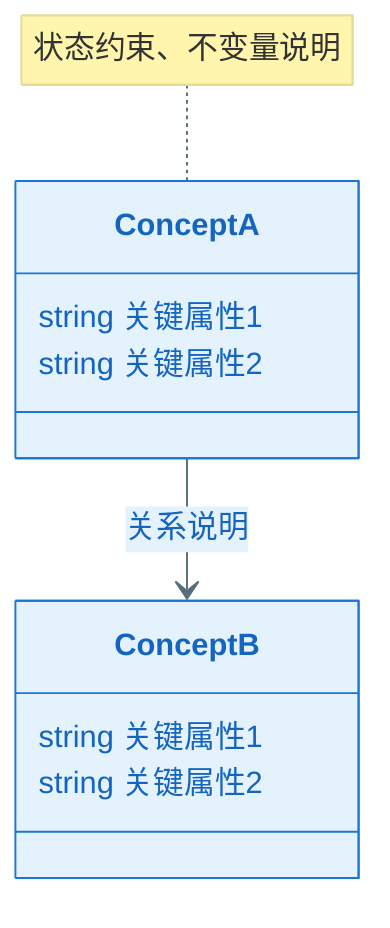
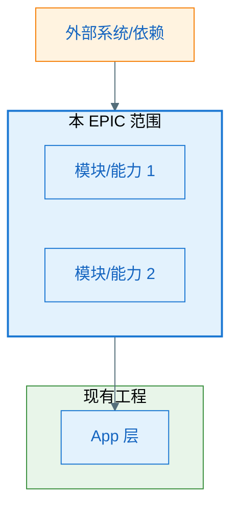
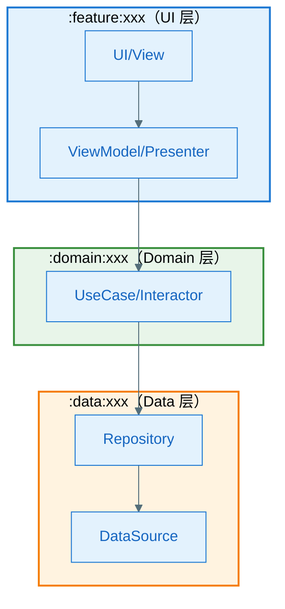
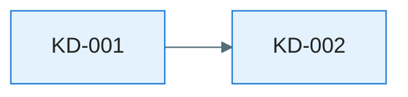
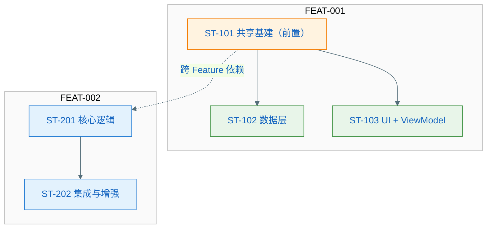
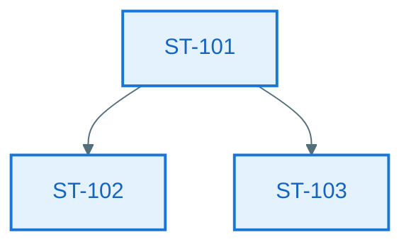

# EPIC 软件设计说明书：EPIC-[编号] - [EPIC 名称]

> **定位**：EPIC 需求级别的技术设计方案，面向人类评审与后续 Task 拆解、Implement 阶段的 AI 编码参考。与各 Feature 的 `plan.md`（技术规约）共同约束 tasks.md 与代码实现。
>
> **输入**：`epic.md`、`epic-plan.md`、各 `features/*/spec.md`、各 `features/*/plan.md`、`ux-design.md`（若已产出）、现有工程代码
>
> **图表规范**：样式遵循 `.cursor/rules/mermaid-style-guide.mdc`；**内容与结构**须基于本工程实际架构与真实代码，遵循 `.cursor/rules/specify-diagram-requirements.mdc`。

**Epic**：EPIC-[编号] - [名称]
**Epic Version**：v0.1.0（来自 `epic.md`）
**设计说明书 Version**：v0.1.0
**创建/更新日期**：[YYYY-MM-DD]
**当前工作分支**：`[epic/... 或 story/... ]`
**EPIC 目录**：`specs/epics/EPIC-[编号]-[short-name]/`

**本 EPIC 设计文件组成**：

| 文件 / 目录 | 对应章节 | 内容 |
| ----------- | -------- | ---- |
| `epic-design.md`（本文件） | 全部章节（摘要/引用） | EPIC 设计总览；**§七**含关键设计清单（含依赖）与逐文件引用；**§八**链接 `nfr.md` |
| `key-func-design/` 目录 | §七 | 各关键设计**独立文件**，命名 **`KD_${三位序号}_${精炼slug}.md`**（例：`KD_001_session_framework.md`）；**每个 KD 文件内须包含**：按需模型/方案架构图、**方案流程图**、**关键类图**（全量公共方法签名）、**核心调用链时序图**（穷举全异常分支）。跨 KD / 跨 Feature 流程须在相关 KD 中互链说明，不再单独产出流程图集。撰稿见 **`key-func-design-kd-template.md`**；**每张时序图紧下方须有详细协作者与过程说明**（见 `specify-diagram-requirements.mdc` §四） |
| `nfr.md` | §八 | 技术评估（设计产出验证，必须量化），模板见 `.specify/templates/nfr-template.md` |
| `interface-design.md` | §九 | 对外/外部接口详述，模板见 `.specify/templates/epic-design-interface-template.md` |
| `database-design.md` | §十 | 库表、ER、迁移与数据策略，模板见 `.specify/templates/epic-design-database-template.md` |
| `analytics-tracking.md` | §十一 | 埋点事件与字段规约，模板见 `.specify/templates/epic-design-analytics-tracking-template.md` |
| `features/FEAT-xxx/l2_design/` | §十三 | 复杂/高风险 Story 的落码级详细设计（L2）；按需生成独立 Markdown 文件（建议命名 `ST-xxx_<短slug>.md`），依赖关系与 L2 状态由 §十三.1 索引表与 §十三.2 总览共同维护 |

---

## 变更记录（增量变更）

| 版本     | 日期           | 变更范围（EPIC/Feature/Story） | 变更摘要 | 影响模块 | 是否需要回滚设计 |
| ------ | ------------ | ------------------------ | ---- | ---- | -------- |
| v0.1.0 | [YYYY-MM-DD] | EPIC                     | 初始版本 | —    | 否        |

---

## 设计前置检查（必须，在开始设计前完成）

> **目的**：确保本 EPIC 设计基于整体规划，跨 Feature 技术策略已明确，避免各 Feature 重复设计共享组件。与各 Feature 的 plan.md「Plan 前置检查」形成上下级一致（本 EPIC 设计确立策略，各 Feature plan 复用并落单）。
>
> **强制规则**：
>
> - 在开始 EPIC 设计之前，**必须完成以下检查**
> - 共享能力须在 `epic.md` 的「跨 Feature 技术策略」中明确 Owner Feature，各 Feature 的 plan 须复用、不得另起炉灶
> - 若在设计过程中发现新的共享需求，**必须先更新 epic.md 的「跨 Feature 技术策略」**，再在本文中引用

### 前置检查清单

- 已阅读 `epic.md` 的「跨 Feature 技术策略」章节（若尚未定稿，本设计说明书产出后须与之同步）
- 已阅读 `epic-plan.md`，确认本 EPIC 下各 Feature 的**执行顺序与依赖关系**
- 本 EPIC 涉及的**共享能力**已在 `epic.md` 中登记 Owner Feature（或将在本设计说明书中拟定并回流至 epic.md）
- 若已有部分 Feature 的 **plan.md**，已阅读并识别可复用的组件/接口与约束，避免本设计说明书与既有 plan 冲突
- 已通读所有 Feature 的 `spec.md`「完整场景矩阵」，确认每个 **P0 场景**在后续架构/时序设计中有对应覆盖策略；多 Feature EPIC 须特别关注「跨 Feature 集成」类场景

### 本 EPIC 跨 Feature 共享能力登记情况（与 epic.md 一致）

> 列出本 EPIC 范围内由各 Feature 提供或复用的共享能力，与 `epic.md`「跨 Feature 技术策略」保持一致。设计说明书中的架构（§四、§五）应与此表对齐。

| 共享能力名称       | Owner Feature | 消费方 Feature        | 设计/契约位置（本文或 plan 章节）               |
| ------------ | ------------- | ------------------ | ---------------------------------- |
| [例如：UI 基础框架] | FEAT-001      | FEAT-002, FEAT-003 | 本文 §5.3 组件清单 / FEAT-001 plan.md §四 |
| [例如：错误处理]    | FEAT-001      | FEAT-002           | 本文 §5.3 / FEAT-001 plan.md §四      |

> 若某共享能力 Owner 的 plan 尚未完成，后续 Feature 的 plan 需**等待**或与其**协商能力边界**后再设计（见各 Feature plan.md 前置检查）。

### P0 场景覆盖快照（与各 Feature spec.md 完整场景矩阵对照）

> 从各 Feature 的 `spec.md`「完整场景矩阵」中提取所有 **P0 场景**，在设计过程中逐条标注覆盖位置。设计完成后，本表应无「未覆盖」项。

| Feature | 场景ID | 场景名称 | 类别 | 覆盖的设计章节/图表 | 状态 |
|---------|--------|----------|------|---------------------|------|
| FEAT-001 | SC-001 | [从 spec.md 摘录] | 正常 | §七 KD-xxx SEQ-xxx / §七 KD-xxx | 已覆盖 / 未覆盖 / 部分覆盖 |
| FEAT-001 | SC-003 | [从 spec.md 摘录] | 异常 | §七 KD-xxx SEQ-xxx alt 分支 | 已覆盖 / 未覆盖 |
| FEAT-002 | SC-004 | [从 spec.md 摘录] | 跨Feature | §七 KD-xxx + §五.1 框架图 | 已覆盖 / 未覆盖 |

> **设计走查规则**：
> - 每个 P0 场景须在至少一处设计产物（时序图/流程图/类图方法签名/Story 拆解）中可追溯
> - 异常类 P0 场景须在时序图的 `alt/else` 分支中体现
> - 跨 Feature 集成 P0 场景须在 §五.1 一层框架图的跨 Feature 依赖关系中体现
> - 若某 P0 场景确认无需在设计层面体现（纯配置/数据变更），在「状态」列标注 `N/A：[理由]`

### 前置检查结论

- **检查日期**：[YYYY-MM-DD]
- **检查人**：[姓名/角色]
- **结论**：通过 / 需先更新 epic.md 或 epic-plan.md / 需等待 [外部依赖或评审]
- **备注**：[如有阻塞或需协商事项]

---

## 一、简介

### 1.1 目的和对象

说明本文的目的和适合阅读的对象。如：该文档用于描述XX产品的XX版本xx软件设计。适用于设计人员、开发人员、测试人员、资料开发人员等。

### 1.2 范围

说明该文档设计的软件范围，并说明其相关的设计关系，可直接描述，如有相关文档最好指明(如已完成的特性，不完成的特性等等）。

## 二、需求概述

### 2.1 需求背景

说明需求的历史发展过程、当前提出需求的背景（市场变化、技术变化、用户痛点等）、需求来源（提出人或组织）等。

### 2.2 需求范围及限制

说明需求的适用范围、场景和限制。比如：

1. 高、中、低端机是否全部适用
2. 地区是否都适用：内销、外销、欧盟；
3. 支持的机型品牌范围
4. 是否支持升级：项目升级上来以后是否支持新的需求功能
5. 是否支持回落：比如是否支持回落到低版本的机型上
6. 是否需要保密

## 三、领域模型

### 3.1 领域概念（Domain Concepts / Glossary，必须）

> **目的**：统一命名与语义口径，成为后续"架构图/流程图/类图/时序图/接口契约"的**命名权威**。
>
> 要求：
>
> - 只写本 EPIC/Feature 涉及或新引入的领域概念；已有概念可引用来源（其他 Feature/EPIC/已有模块文档）
> - 每个概念必须给出：名称、定义、关键属性/状态、与其他概念的关系（可用表格或简易概念图）

### 3.2 领域概念词汇表（必须）

| 概念（中文） | 名称（英文/代码名） | 定义（一句话） | 关键属性/状态（Top3） | 不变量/约束 | 关联概念 |
| ------ | ---------- | ------- | ------------- | ------ | ---- |
|        |            |         |               |        |      |

### 3.3 概念关系图（推荐，可选）

> **目的**：用类图语法表达**业务领域概念**之间的关系（非技术实现）。
>
> ⚠️ **重要区分**：本节（领域概念图）与 §8.2 全景类图（技术类图）的区别
>
>
> | 维度       | §三 领域概念图             | §8.2 全景类图                                                             |
> | -------- | -------------------- | --------------------------------------------------------------------- |
> | **目的**   | 统一业务语言，建立领域模型        | 定义技术实现的静态结构                                                           |
> | **视角**   | 业务视角（产品/领域专家能看懂）     | 技术视角（开发者能实现）                                                          |
> | **内容**   | 业务实体、值对象、聚合关系        | 按项目架构（Clean Architecture/MVP/MVC/MVVM 等）的技术类                          |
> | **方法**   | 只写关键业务属性，不写方法        | 必须写完整的方法签名                                                            |
> | **示例**   | `订单`、`用户`、`商品`（业务概念） | `OrderRepository`、`OrderUseCase` 或 Presenter/Controller 等（技术组件，依架构而定） |
> | **来源**   | 来自需求分析、DDD 领域建模      | 来自架构设计（Clean Architecture / MVP / MVC / MVVM 等）                       |
> | **修改频率** | 业务需求变化时修改            | 技术方案调整时修改                                                             |
>
>
> **使用建议**：
>
> - 若 Feature 的业务概念较复杂（多实体/复杂关系），推荐画此图
> - 若 Feature 业务简单（如单一 CRUD），可省略此图
> - 此图中的业务概念（如 `订单`）通常在 §7 全景类图中会对应多个技术类（如 `OrderEntity`、`OrderDTO`、`OrderUseCase`）

## 四、零层架构（EPIC 与外部/现有工程边界）

> **目的**：一张图展示本 EPIC 在整体系统中的位置、与外部的关系、内部主要子系统或模块。
>
> 要求：
>
> - 明确 EPIC 边界：哪些是本 EPIC 新增/修改的，哪些是复用已有的
> - 明确系统对外部的依赖，外部依赖的**故障模式**与应对策略，依赖的承接方与交付的产物
> - 无论 EPIC 大小，都必须产出全景图（小 EPIC 图更简单，但不能省略）

### 4.1 边界说明

- **EPIC 范围**：[本 EPIC 与上游/下游系统、现有 App 模块的边界；哪些在 EPIC 内、哪些复用现有]
- **主要子系统/模块**：[高层模块或能力块列表，可与 Feature 或跨 Feature 能力对应]

### 4.2 零层架构图（必须）

> 一张图展示：EPIC 边界、内部核心组件、外部依赖、数据/控制流向

### 4.3 架构设计说明（必须：理由/决策/思考）

> 用文字把"为什么这样画"说清楚，便于评审与后续实现期不走样。
> **注意**：本节聚焦架构设计原理与决策，不涉及具体代码实现。

- **边界与职责**：为什么这些能力属于本 Feature（而不是其他模块）；哪些能力明确不做（Out of Scope）
- **分层与依赖方向**：为何这样分层；为何允许/禁止某些跨层依赖（例如 UI 不直连 DataSource）
- **关键数据流**：数据从哪里来、去哪里（System of Record）、缓存策略与一致性假设
- **外部依赖策略**：对每个关键依赖的失败模式选择了什么策略（重试/退避/降级/熔断/提示），为什么
- **可演进性**：预留哪些扩展点（接口/策略注入/版本兼容）；未来变化下的最小修改面

### 4.4 外部依赖清单（若有则必填，无依赖时标注 N/A）

> **适用场景**：涉及后端 API、系统能力、第三方 SDK、已有模块等外部依赖时必填。
> 若本 Feature 为纯本地功能（如纯 UI 组件、本地计算），可标注 N/A 并简述原因。

| 依赖项      | 类型     | 提供方（团队名称） | 提供的能力 | 通信方式   | 故障模式      | 我方策略  |
| -------- | ------ | --------- | ----- | ------ | --------- | ----- |
| [后端 API] | 内部服务   | [团队名称]    | 数据读写  | HTTPS  | 超时/限流/不可用 | 重试+降级 |
| [系统能力]   | OS/SDK | [系统/平台]   | 权限/存储 | 系统 API | 权限拒绝/不支持  | 提示+引导 |
| [已有模块]   | 内部模块   | [团队名称]    | 认证/日志 | 函数调用   | —         | —     |

---

## 五、一层架构（分层与模块职责）

> **目的**：用一张框架图 + 配套说明，把所设计的系统的内部组件划分、依赖关系、协作机制、数据流讲清楚。
>
> **要求**：
>
> - **必须在图上明确标注所属的代码工程模块名称**（如 `:feature:xxx`、`:core:data`），subgraph 或组件旁须可见模块归属
> - **静态结构**：用**实线箭头**（`-->`）表示依赖/调用方向
> - **动态协作**：用**虚线箭头**（`-..->`）表示事件/回调/异步消息
> - **架构**：必须基于本工程**实际代码**、**实际模块**与既有架构绘制，禁止照搬 Clean Architecture 等模板。参见 `.cursor/rules/specify-diagram-requirements.mdc`。

### 5.1 一层框架图（必须）

> 须在图上明确标注所属的代码工程模块名称（如 `:feature:xxx`、`:core:data`）。静态依赖用实线箭头，动态协作用虚线箭头。

> **跨层约束**：[例如：UI 不得直接依赖 DataSource；Domain 不得依赖 UI]

### 5.2 组件清单与职责（必须）

> **组件定义**：组件是职责内聚的一组类/接口构成的**子模块**，粒度介于工程模块与单个类之间。本表是 EPIC 的**组件目录**，从架构视角自顶向下设计，与各 Feature plan.md 中定义的接口与契约须保持**双向一致**——组件的对外接口须能支撑 Feature 契约，Feature 契约的变更须回检组件边界。若本表调整了组件边界或接口，须通过增量变更流程同步更新相关 Feature 的 plan.md。

| 组件    | 所属模块          | 职责（一句话） | 输入/输出   | 依赖          | 约束             |
| ----- | ------------- | ------- | ------- | ----------- | -------------- |
| [组件A] | `:module:xxx` | [做什么]   | [输入→输出] | [依赖哪些组件/外部] | [线程/生命周期/并发约束] |

### 5.3 组件协作流程图（必须）

> **目的**：用带分区的流程图展示组件之间的**端到端协作流程**，覆盖正常 + 关键异常路径。每个 subgraph 分区对应 5.2 中的组件/模块边界，与 5.1 框架图形成互补——5.1 展示静态结构，本图展示动态控制流与异常分支。
>
> 本图从架构视角设计，须与各 Feature plan.md 中定义的能力边界保持**双向一致**；若全局视角下发现组件协作方式与 Feature 规约存在矛盾，须通过增量变更流程双向同步。
>
> **要求**：
>
> - subgraph 分区须与 5.2 组件清单中的组件/模块对应，不得遗漏关键组件
> - 从触发端到所有可能的结束状态，控制流须完整、无断点
> - 判断节点须覆盖正常 + 关键异常分支

### 5.4 技术方案选型

> **说明**：仅纳入**存在真实方案取舍**的技术决策点——候选方案之间各有优劣、需要论证才能确定选择的场景。显而易见、无争议的技术选择不列入本节。
>
> 每个决策点用一个独立小节呈现：先用表格对比候选方案，再给出采用结论与理由。

#### 选型 1：[技术决策点名称]

| 方案            | 描述     | 优点        | 缺点        |
| ------------- | ------ | --------- | --------- |
| 方案 A：[名称]     | [简要描述] | [优点1；优点2] | [缺点1；缺点2] |
| 方案 B：[名称]     | [简要描述] | [优点1；优点2] | [缺点1；缺点2] |
| 方案 C：[名称]（可选） | [简要描述] | [优点1；优点2] | [缺点1；缺点2] |

**采用方案 A（[名称]），理由如下：**

1. [理由 1]
2. [理由 2]
3. [理由 3]

#### 选型 2：[技术决策点名称]

（结构同选型 1：候选方案对比表 + 采用结论与理由）

---

## 六、技术风险与边界场景（设计输入）

> 📌 **占位**：待产出（随 `arch` 或后续扩展参数一并产出）。

> **定位**：在进入关键设计（§七）之前，先识别技术风险并枚举关键边界与异常场景，为后续设计提供**约束输入**——确保 §七 关键设计能充分考虑这些风险与边界的处理。
>
> **与 §八 技术评估的分工**：本节识别"**设计前已知的约束**"（风险、边界场景），§八 基于设计方案进行"**设计后的量化验证**"（性能、功耗、内存等是否达标）。

### 6.1 技术风险与消解策略（绑定 Feature/Story）

> **风险维度（须逐类审视，如不适用可标注 N/A 或省略该行）**：
>
> - **算法快稳省**：时延/吞吐、稳定性（崩溃/超时/降级）、资源占用（CPU/内存/电量/带宽）
> - **算法效果**：准确率/召回率/效果达标、离线与线上一致性、数据分布变化带来的效果漂移
> - **技术方案**：选型可行性、依赖/兼容性、可维护性、技术债与演进成本
> - **数据安全与隐私**：敏感数据存储/传输/脱敏、合规（如 GDPR、个保法）、权限与审计
> - **成本**：算力/存储/带宽/第三方 API 成本、人力与排期成本
> - **用户体验**：卡顿/等待时长、错误提示与降级体验、可访问性、多端一致性
> - **其他**：合规、供应链、运维/发布等；按项目需要补充。

| 风险ID     | 风险类别                                    | 风险描述 | 触发条件 | 影响范围 | 严重度          | 消解策略 | 对应 Feature/Story  |
| -------- | --------------------------------------- | ---- | ---- | ---- | ------------ | ---- | ----------------- |
| RISK-001 | [选填：算法快稳省/算法效果/技术方案/数据安全与隐私/成本/用户体验/其他] |      |      |      | High/Med/Low |      | FEAT-xxx / ST-??? |

### 6.2 边界与异常场景枚举（数据/状态/生命周期/并发/用户行为）

> **范围**：仅列出**关键的**、或**难以洞察发现的**边界与异常场景。显而易见、常规处理的无需逐一罗列。

- **数据边界**：[空/超大/非法/重复/过期等]
- **状态边界**：[状态机不可达/回退/重入等]
- **生命周期**：[前后台切换/旋转/进程被杀/恢复等]
- **并发**：[多线程/协程/并发写/竞态等]
- **用户行为**：[快速连点/断网/弱网/权限拒绝等]

#### 6.2.1 场景 → 应对措施对照表（必须）

> 目的：把"枚举"落到"可执行对策"，并与 §七 KD 时序图的异常分支互校。设计完成后如发现新场景，须回补本表。
>
> **对策类型说明**：
>
> - **技术对策**：通过代码/架构层面解决（重试/退避/降级/回滚/补偿/去重/限流等）
> - **设计对策**：需产品/设计层面介入（交互引导/文案提示/流程简化/功能裁剪等），标注 `TODO(PM)` 或 `TODO(UX)` 待确认

| Feature 名称    | 场景名称   | 场景及影响描述          | 严重程度         | 发生频率         | 技术对策        | 设计对策（产品/UX）     |
| ------------- | ------ | ---------------- | ------------ | ------------ | ----------- | --------------- |
| [FEAT-xxx 名称] | [场景名称] | [场景描述及对用户/系统的影响] | High/Med/Low | High/Med/Low | [重试/降级/...] | [引导文案/流程简化/N/A] |

---

## 七、关键功能与疑难点/亮点设计

> 📌 **占位**：待运行 `/aisdd.epicdesign key` 产出。

> **定位**：面向方案评审，将重难点模块的**设计策略与决策逻辑**讲清楚。每个设计点须在其 **`key-func-design/KD_*_*.md` 文档内**直接给出**方案流程图**（验逻辑分支）、**关键类图**（全量公共方法签名，验类型层面可行性）与**核心调用链时序图**（穷举全异常分支，验协作主干），使 §七 阶段即可判断方案是否 ok——全量签名与全分支时序由本节直接保障。跨 KD / 跨 Feature 流程须在相关 KD 中互链说明，不再单独产出流程图集。
>
> **核心方案（各 KD 必填）**：用清晰易懂的中文**详写设计方案与实现**；须**全覆盖**本设计点涉及的技术点，**写全每条相关的技术链路**（含方案明确纳入的异常/降级路径），并对链上**每一环说明如何达成**（机制、职责、数据/状态传递与约束）；**与**该 KD 文件内模型/方案架构图（若有）、流程图、**关键类图**、时序图**互证**，不得仅用标题或条目堆砌代替叙述。细则见 `.specify/templates/key-func-design-kd-template.md`。
>
> **内容文件**：**不**再使用 EPIC 根目录 `key-func-design.md`。详细内容写在 **`key-func-design/`** 目录下，**每个关键设计一个文件**，命名 **`KD_${三位序号}_${精炼slug}.md`**（与下列清单 **KD-001** 序号对齐，slug 建议英文/拼音，仅字母、数字、下划线）。**清单、依赖关系与逐文件引用均在本节（7.1 / 7.2）维护**。
>
> **KD 依赖**：基础/框架类 KD 可被业务类 KD 依赖；**§7.1 清单须表达有向无环依赖（DAG）**，禁止循环依赖。可选：于下方增加 Mermaid 图仅描述 KD 编号间依赖。
>
> **何时省略**：若无疑难点且无方案亮点，可在下方标注「本 EPIC 无关键疑难点/亮点，省略」。

### 7.1 关键设计清单

> 本表为 §七 **权威清单**；须与 `key-func-design/KD_*_*.md` 文首「依赖的其他 KD」一致。

| 编号   | 设计点名称   | 层级/类型   | 前置 KD / 依赖 | 设计文档路径 |
| ------ | ------------ | ----------- | -------------- | ------------ |
| KD-001 | [设计点名称] | 基础框架/业务/横切/… | —              | `./key-func-design/KD_001_[slug].md` |
| KD-002 | [设计点名称] | 业务        | KD-001         | `./key-func-design/KD_002_[slug].md` |

> （可选）**KD 依赖图**（仅 KD 编号与依赖边，勿与类图混淆）：

### 7.2 详细设计引用

- [KD-001 设计点名称](./key-func-design/KD_001_[slug].md)
- [KD-002 设计点名称](./key-func-design/KD_002_[slug].md)

---

## 八、技术评估（设计产出验证，必须量化）

> 📌 **占位**：待运行 `/aisdd.epicdesign nfr` 产出 **`nfr.md`**（模板见 `.specify/templates/nfr-template.md`）。

> **定位**：基于 §七 的设计方案，对算法/功耗/性能/内存/安全/兼容性进行**量化评估与实测验证**。各子节标注「如适用」的，若不适用须标注 N/A 并简述原因。
>
> **与 §六 的分工**：§六 在设计前识别风险与边界场景（设计输入），本节在设计完成后验证方案是否满足 NFR 目标（设计产出验证）。
>
> **与 spec.md NFR 的关系**：`spec.md` 的 NFR 定义**验收目标**（如"p95 ≤ 200ms"）；本节基于设计方案进行**技术评估与实测**，验证方案是否满足 NFR 目标。若评估结果超标，须调整设计方案或协商 NFR 目标变更（走 CR 流程）。
>
> **正文位置**：算法/功耗/性能/内存/安全/兼容性/RomSize 等**全部量化表格与结论**写在 EPIC 根目录 **[`nfr.md`](./nfr.md)**（章节编号 **8.1～8.7** 与模板一致），本节不重复粘贴。

**摘要**：（`nfr` 产出后填写 2～3 句：是否达标、主要风险项）

→ 详见 **[`nfr.md`](./nfr.md)**

---

## 九、接口设计

> 📌 **占位**：待运行 `/aisdd.epicdesign nfr`（或与 `all` 一并）产出 **`interface-design.md`**（模板见 `.specify/templates/epic-design-interface-template.md`）。

> **定位**：面向方案评审的接口契约详述；**正文**在 EPIC 根目录 **[`interface-design.md`](./interface-design.md)**（章节编号 **9.1～9.3** 与模板一致），本节不重复粘贴。

**摘要**：（产出后填写 2～3 句：对外接口数量级、关键外部依赖、主要评审关注点）

→ 详见 **[`interface-design.md`](./interface-design.md)**

---

## 十、数据库设计

> 📌 **占位**：待运行 `/aisdd.epicdesign nfr`（或与 `all` 一并）产出 **`database-design.md`**（模板见 `.specify/templates/epic-design-database-template.md`）。

> **定位**：面向方案评审的数据模型与表结构；**正文**在 EPIC 根目录 **[`database-design.md`](./database-design.md)**（章节编号 **10.1～10.4** 与模板一致），本节不重复粘贴。

**摘要**：（产出后填写 2～3 句：涉及存储类型、核心表数量级、迁移或一致性要点）

→ 详见 **[`database-design.md`](./database-design.md)**

---

## 十一、埋点技术方案

> 📌 **占位**：待运行 `/aisdd.epicdesign nfr`（或与 `all` 一并）产出 **`analytics-tracking.md`**（模板见 `.specify/templates/epic-design-analytics-tracking-template.md`）。

> **定位**：本 EPIC 新增/变更埋点的事件与字段规约；**正文**在 EPIC 根目录 **[`analytics-tracking.md`](./analytics-tracking.md)**（章节编号 **11.1～11.2** 与模板一致），本节不重复粘贴。

**摘要**：（产出后填写 2～3 句：事件规模、与存量埋点关系、合规注意点）

→ 详见 **[`analytics-tracking.md`](./analytics-tracking.md)**

---

## 十二、Story 拆解

> 📌 **占位**：待运行 `/aisdd.epicdesign story` 产出。

> **说明**：Story 是 Feature 内的**技术开发分解单位**，从技术视角拆分，服务于**并行开发**和**分笔 git 提交**。Feature 才是最小交付单位（面向 PM/QA 演示验收），Story 不要求独立可交付。Task 在 tasks.md 中拆解，须引用本设计说明书及（若存在）对应 Feature `l2_design/ST-xxx_<slug>.md` 中的 L2 详细设计。
>
> **下游追溯**：`/aisdd.featuretasks` 执行时在各 Feature 的 `tasks.md` 中生成 FR/NFR → Story → Task 追溯矩阵；不反向修改已冻结的 `spec.md` 或 `plan.md`。若发现上下游矛盾，须先通过 CR 或指定设计章节更新后再生成任务。

### 12.1 拆解策略

#### 拆解目标

Story 拆解的好坏取决于是否满足两个核心价值：

1. **可并行开发**：多个 Story 的改动路径不重叠，可分配给不同开发者同时进行
2. **可分笔提交**：每个 Story 完成后可形成一笔有意义的 git commit/PR，不破坏主干

#### 交付粒度分层

| 层级 | 粒度 | 交付对象 | 验收方式 |
|---|---|---|---|
| **Feature** | 最小交付单位 | PM / QA | 端到端功能演示 |
| **Story** | 开发分解单位 | 开发者 / CR reviewer | 代码审查 + 开发者自验 |
| **Task** | 执行步骤 | AI / 开发者 | 按步骤验证清单 |

#### 拆解维度（按优先级排序）

| 维度 | 适用场景 | 拆分价值 | 示例 |
|---|---|---|---|
| **按技术模块/分层** | 模块间接口清晰，各层可独立开发 | 最大化并行度 | 数据层 + Repository / ViewModel + UI / 通用组件 |
| **按变更边界** | 改动涉及多个独立文件集合 | CR 可聚焦，提交原子化 | 数据模型变更 / UI 布局 / 业务逻辑 |
| **按功能路径** | Feature 有多条独立操作入口 | 路径间无交叉依赖 | 账号密码登录 / 第三方登录 / 自动登录 |
| **按渐进集成** | 需先走通骨架再补齐细节 | 尽早暴露集成风险 | 核心链路骨架 → 异常处理 → 体验增强 |
| **按共享前置依赖** | 多个 Story 共享技术前提 | 解除后续 Story 的阻塞 | 通用网络层 / 第三方 SDK 初始化 / 基础数据模型 |

#### 拆分反模式

| 反模式 | 问题 | 改进 |
|---|---|---|
| 每个 Story 都强制端到端贯穿所有技术层 | 产生交叉依赖，无法并行 | 按模块/分层拆分，Feature 级集成验证 |
| 一个 Story 跨多个无关模块 | 改动范围发散，CR 无法聚焦 | 按变更边界拆分 |
| 过度碎片化（如单个文件一个 Story） | Story 无法独立验证，管理成本高 | 合并为有意义的技术增量 |
| 纯按时间排期拆分 | 技术依赖未理清，返工风险高 | 先理清依赖，再按技术模块拆分 |

### 12.2 拆分约束

- **工作量**：工作量是粒度的**参考信号，不是拆分的强约束**；拆分决策首先看改动路径独立性与技术边界合理性，工作量作为辅助判断
  - 典型区间 **2～5 人天**（含编码、联调、CR、自检，按普通程序员评估）
  - 工作量**严重偏高（> 7 人天）**：检查内部是否存在可独立并行的子工作；若有，按独立性拆；若无（高内聚），保持不拆
  - 工作量**严重偏低（< 1 人天）**：检查是否可与改动路径相近的相邻 Story 合并；若边界独立，保持不合并
- **架构遵从**：Story 不必与某个组件或类一一对应；实现时须遵循设计说明书中的架构与模块划分，不得擅自新增未在设计中定义的组件
- **依赖关系**：须清晰、无环；可并行的须标注，改动路径不重叠
- **提交原子性**：每个 Story 完成后可形成一笔有意义的 git commit，不破坏编译和现有功能
- **粒度判断**：

| 信号 | Story 太大 | Story 太小 |
|---|---|---|
| 工作量 | 过高，难以并行/分笔提交 | 过小，无独立提交意义 |
| 改动范围 | 涉及 3+ 个无关模块，CR 无法聚焦 | 仅改动单个文件的几行，无独立验证意义 |
| 描述特征 | 出现"并且"、"同时"等并列逻辑 | 不构成有意义的技术增量 |
| 并行性 | 内部存在可独立进行的子工作 | — |

### 12.3 Story 自检清单（必须通过）

每个 Story 须通过以下检查：

- **可并行**：与其他同阶段 Story 的改动路径是否不重叠？能否分配给不同开发者？
- **可独立提交**：完成后能否形成一笔有意义的 git commit，不破坏编译和现有功能？
- **变更边界清晰**：涉及的文件/模块范围是否明确？CR 能否聚焦审查？
- **可估算**：团队能否给出工时估算？（若不能，说明太大或太模糊，须继续拆）
- **工作量适中**：工作量是否适中？（过高则继续拆分，过小则考虑合并）
- **可验证**：能否写出开发者可自验的验证条件？
- **依赖可控**：依赖关系清晰、无循环？
- **架构遵从**：实现是否遵循设计说明书中的架构与模块划分，未擅自新增未定义的组件？
- **FR 覆盖**：本 Feature 下所有 FR/NFR 是否已在 §十二.6 覆盖矩阵中被至少一个 Story 覆盖？（无未覆盖的 FR）

### 12.4 Story 列表（按 Feature 分组）

> **组织方式**：按 Feature 分组，每个 Feature 下按**开发顺序**排列 Story（前置依赖在前，可并行的标注）。所有 Story 必须归属到某个 Feature。
>
> **共享 Story 归属规则**：当某个 Story 服务于多个 Feature 时，将其归入 **Owner Feature**（与 §前置检查 中「跨 Feature 共享能力」的 Owner 机制一致），并在「消费方」字段标注其他受益 Feature。
>
> **编号规则**：`ST-[Feature 序号][Story 序号]`，如 FEAT-001 下的 Story 为 ST-101、ST-102……；FEAT-002 下为 ST-201、ST-202……

#### FEAT-001：[Feature 名称] 的 Story 拆解

> **拆解思路**：[一句话说明本 Feature 的拆解策略——按哪个维度拆、为什么这样拆、并行度如何]

##### ST-101：[标题]

- **描述**：[做什么、技术范围]
- **目标**：[可验证的结果]
- **改动范围**：[涉及的模块/文件集合]
- **预估工作量**：[X 人天]（必填，工作量适中）
- **覆盖 FR/NFR**：FR-??? / NFR-???
- **依赖**：[其他 Story / 外部依赖 / 无]
- **可并行**：是/否（若是，标注可与哪些 Story 并行）
- **共享能力**：否 / 是（消费方：FEAT-yyy, FEAT-zzz）
- **关键风险**：是/否（关联 RISK-???）
- **验证条件**：
  1. [开发者可自验的具体条件]
  2. [开发者可自验的具体条件]
- **交付物**：[代码/文档/配置]

##### ST-102：[标题]

（同上结构）

##### ST-103：[标题]

（同上结构）

#### FEAT-002：[Feature 名称] 的 Story 拆解

> （结构同 FEAT-001：拆解思路 → Story 列表按开发顺序排列）

### 12.5 Story 依赖关系与并行度（推荐）

> 按 Feature 分组展示 Story 间的依赖关系与并行机会。各 Feature 的 Story 用 subgraph 分组。可并行的 Story 用绿色高亮，阻塞性前置用橙色。跨 Feature 依赖用虚线箭头标注。

> **图例**：🟠 橙色 = 阻塞性前置 | 🟢 绿色 = 可并行 | 🔵 蓝色 = 顺序执行。实线箭头 = Feature 内依赖；虚线箭头 = 跨 Feature 依赖。

### 12.6 Feature → Story 覆盖矩阵

> 确保每个 Feature 的 FR/NFR 被其下属 Story 完整覆盖，无遗漏。共享 Story 在 Owner Feature 行中标注，消费方 Feature 行中以「依赖 ST-xxx（Owner: FEAT-yyy）」形式引用。

| Feature | FR/NFR ID | 覆盖的 Story ID | 备注 |
|---|---|---|---|
| FEAT-001 | FR-001 | ST-102, ST-103 | 数据层 + UI 层共同覆盖 |
| FEAT-001 | NFR-xxx | ST-101 | 共享基建（消费方：FEAT-002） |
| FEAT-002 | FR-003 | ST-201, ST-202 | 核心逻辑 + 集成 |
| FEAT-002 | （依赖） | 依赖 ST-101（Owner: FEAT-001） | 跨 Feature 依赖 |

### 12.7 Story 工作量汇总（按 Feature 分组）

| Feature | Story ID | 共享 | 预估工作量（人天） | 依赖关系 | 可并行 |
|---|---|---|---|---|---|
| **FEAT-001** | ST-101 | 是（→FEAT-002） | 3 | 无 | — |
| | ST-102 | 否 | 5 | ST-101 | 是（与 ST-103 并行） |
| | ST-103 | 否 | 3 | ST-101 | 是（与 ST-102 并行） |
| | | | **小计：11** | | |
| **FEAT-002** | ST-201 | 否 | 4 | ST-101（FEAT-001） | 否 |
| | ST-202 | 否 | 3 | ST-201 | 否 |
| | | | **小计：7** | | |
| | | | **总计：18 人天** | | |

> **估算基准**：按普通程序员水平，含编码、联调、Code Review、用例自检。可并行 Story 的实际日历时间可缩短。
>
> **并行度检查**：可并行 Story [X] 组，最大并行宽度 [Y]；关键路径工作量 [Z] 人天（占总量 [%]）。若关键路径占比 > 80%，须审视是否存在并行拆分机会。

---

## 十三、二层 Story 详细设计（L2）索引

> 📌 **占位**：待运行 `/aisdd.epicdesign l2` 产出。

> **定位**：按 **Story** 的完整详细设计（含完整类图/时序图、触发条件与系统响应），是 tasks.md 与 implement 阶段的**详细设计事实源**，提供落码级指导。本节所索引的 L2 为各 Story 的局部完整设计，二者层级与粒度不同。
>
> **规则**：
> - 每个 Story 对应 **一个独立 Markdown 文件**，统一放在所属 Feature 目录下的 **`l2_design/`** 子目录中（路径示例：`features/FEAT-xxx/l2_design/ST-001_session_login.md`）。
> - **文件命名**：必须以 Story ID 为前缀，建议 `ST-xxx_<短slug>.md`（slug 用小写英文/数字与连字符，与 §十二 中 Story 标题语义一致即可），保证全局可通过 ID 唯一定位。
> - **KD 继承**：若 Story 涉及 §七 `key-func-design/KD_*_*.md` 中已定义的关键能力、核心类、接口契约、状态流转、异常策略或跨模块协作，L2 必须引用并继承对应 KD；L2 只能做 Story 级细化，不得脱离 KD 另起一套技术方案。若必须调整 KD 决策，须先更新 KD 或发起设计变更，再更新 L2。
> - **依赖关系**：§十三.1 索引表须列出每行 Story 的 **前置依赖 ST**（可为空）；§十三.2 给出 EPIC 级依赖总览（表 + 可选 Mermaid 图），且须与各 Story 文件首部的「L2 依赖与引用」小节 **一致**（双向可核对）。
> - 单 Story 文件撰稿模板见 `.specify/templates/story_detail_design_template.md`；本节保留索引与依赖总览，不内嵌 L2 正文。
>
> **何时需要 L2**：当 Story 的技术复杂度较高、涉及多组件协作或需要落码级指导时，须补充 L2 详细设计（按 Story 覆盖，不得遗漏）。
>
> tasks.md 的每个 Task 须明确引用对应 L2 文件中的设计段落，例如：`features/FEAT-xxx/l2_design/ST-001_xxx.md:功能设计:类图` 或 `...:功能设计:时序图`。

### 13.1 L2 设计索引表

| Story ID | 标题   | 所属 Feature | 关联 KD（无则填「—」） | L2 文件路径（相对 EPIC 根） | 前置依赖（须先完成的 ST，可跨 Feature；无则填「—」） | 状态      |
| -------- | ---- | ---------- | ------------------ | ------------------- | -------------------------------- | ------- |
| ST-001   | [标题] | FEAT-xxx   | KD-001              | `features/FEAT-xxx/l2_design/ST-001_<slug>.md` | —                                | 待设计/已完成 |
| ST-002   | [标题] | FEAT-xxx   | —                  | `features/FEAT-xxx/l2_design/ST-002_<slug>.md` | ST-001                           | 待设计/已完成 |

### 13.2 L2 Story 依赖关系（EPIC 总览）

> **要求**：与 §十二.4 Story 列表中的依赖列一致；若某 Story 仅依赖本 Feature 内其他 ST，仍须在此汇总，便于评审关键路径与并行度。
>
> **依赖表**（可与 §十三.1 合并维护时以 §十三.1 为准，此处侧重**跨 Feature** 与**图示**）：

| Story ID | 前置依赖 ST（可多值，逗号分隔） | 备注（如：跨 Feature、并行组） |
| -------- | ------------------- | ---------------- |
| ST-102   | ST-101              | 与 ST-103 可并行 |
| ST-201   | ST-101（FEAT-001）   | 跨 Feature       |

**依赖示意图**（可选；须遵循 `.cursor/rules/mermaid-style-guide.mdc`）：

### 13.3 L2 覆盖度检查

- 所有 §十二 Story 拆解中的 ST-xxx 在 §十三.1 索引表中有对应条目，且 **l2_design/** 下存在同名前缀文件 `ST-xxx_*.md`
- 所有 L2 设计状态为「已完成」（进入 featuretasks 的前置条件）
- 所有涉及 §七 KD 关键设计的 Story，在 §十三.1「关联 KD」与 L2 文件首部「L2 依赖与引用」中均已列出对应 KD
- 所有 L2 中与关联 KD 重叠的核心类、接口契约、状态流转、异常策略、并发/持久化策略与 KD 保持一致；若存在调整，已先更新 KD 或记录设计变更
- §十三.1「前置依赖」与 §十三.2、各 L2 文件首部「L2 依赖与引用」**无矛盾**

---

## 附录 A：设计说明书与 plan/tasks 的对应关系

| 本设计说明书章节                          | plan.md 对应关系      | tasks.md 设计引用                                  |
| --------------------------------- | ----------------- | ---------------------------------------------- |
| 一、简介                              | —                 | 范围/背景参考                                        |
| 二、需求概述                            | —                 | 需求边界参考                                         |
| 三、领域模型                            | —                 | 命名权威参考                                         |
| 四、零层架构                            | plan.md §一/§二 的约束摘要与增量边界 | 阶段/边界参考                                        |
| 五、一层架构                            | plan.md §二/§三 的增量约束、能力边界与外部依赖 | 模块/组件参考                                        |
| 六、技术风险与边界场景（设计输入）                 | —                 | NFR/风险参考；§七 的设计约束输入                         |
| 七、疑难点/亮点（策略+流程图）                  | —                 | 设计决策参考：`epic-design.md` §7.1 清单 + `key-func-design/KD_*_*.md`；KD 内类图/时序图即为完整编码蓝图 |
| 八、技术评估（设计产出验证）                    | —                 | **`nfr.md`**：NFR 量化验证；Task 验收标准；其中 **8.7 RomSize** 作为包体发布决策依据 |
| 九、接口设计（→ `interface-design.md`）       | plan.md §三 能力边界与外部依赖对齐；plan 不写方法签名/字段 | **`interface-design.md`**：接口设计事实源；Task 接口实现依据           |
| 十、数据库设计（→ `database-design.md`）     | plan.md §四 数据硬约束对齐；plan 不写表结构/字段/索引   | **`database-design.md`**：数据表结构参考；Task 数据层实现依据         |
| 十一、埋点技术方案（→ `analytics-tracking.md`） | —                 | **`analytics-tracking.md`**：埋点事件与字段规约参考                |
| 十二、Story 拆解                       | tasks.md 直接引用      | 每个 Task 绑定 ST-xxx                              |
| 十三、二层 Story 详细设计（L2）索引 → `features/*/l2_design/ST-xxx_*.md` | —                 | 设计引用：`features/FEAT-xxx/l2_design/ST-xxx_<slug>.md:功能设计:类图/时序图` |

