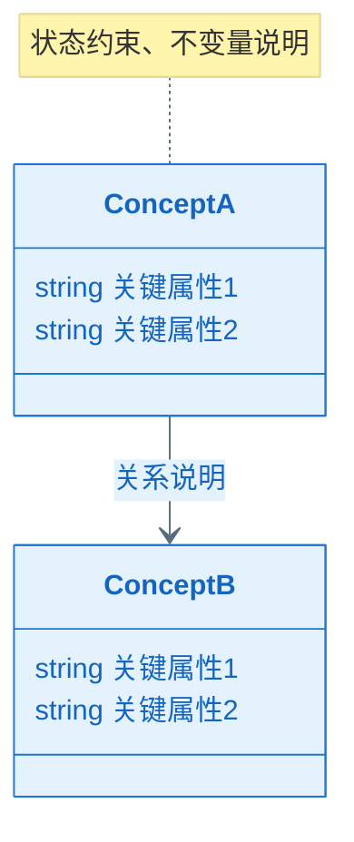
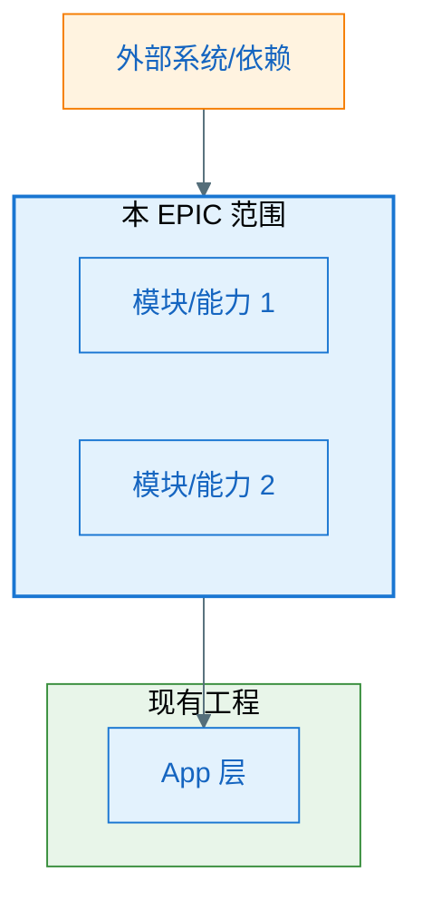
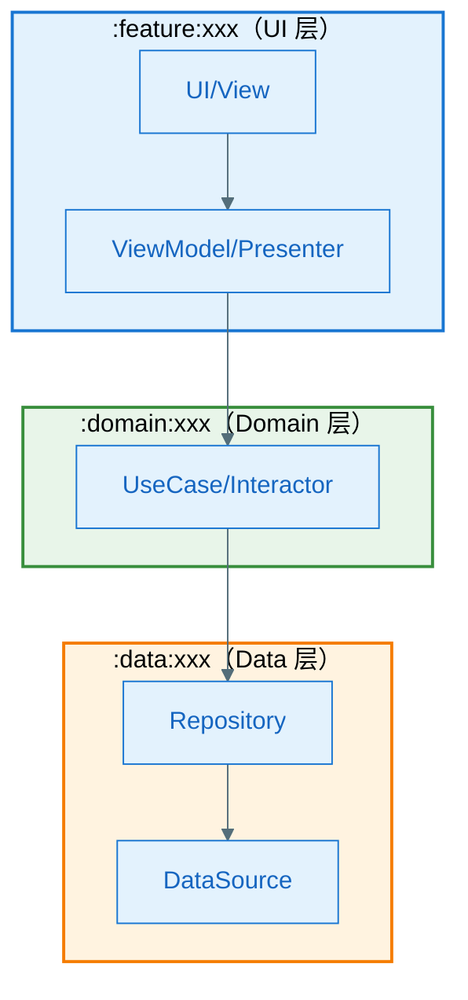
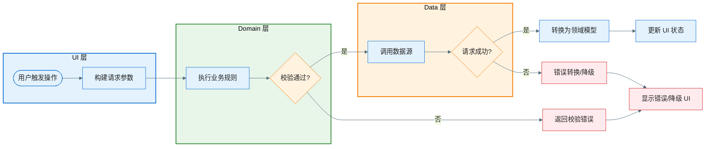
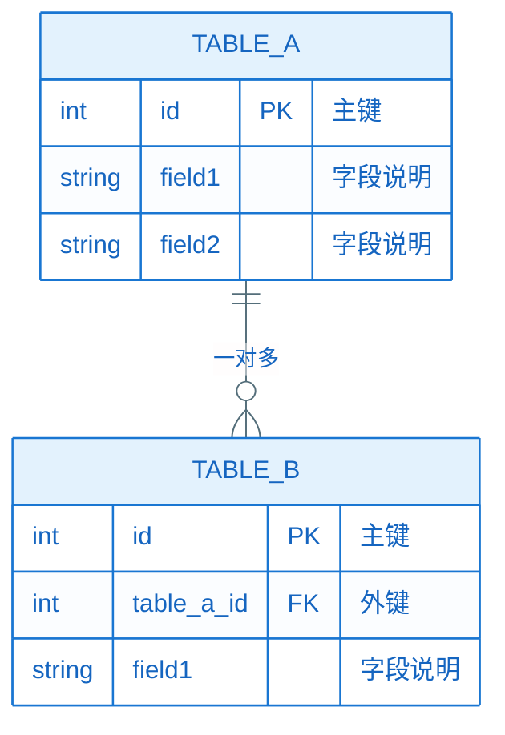
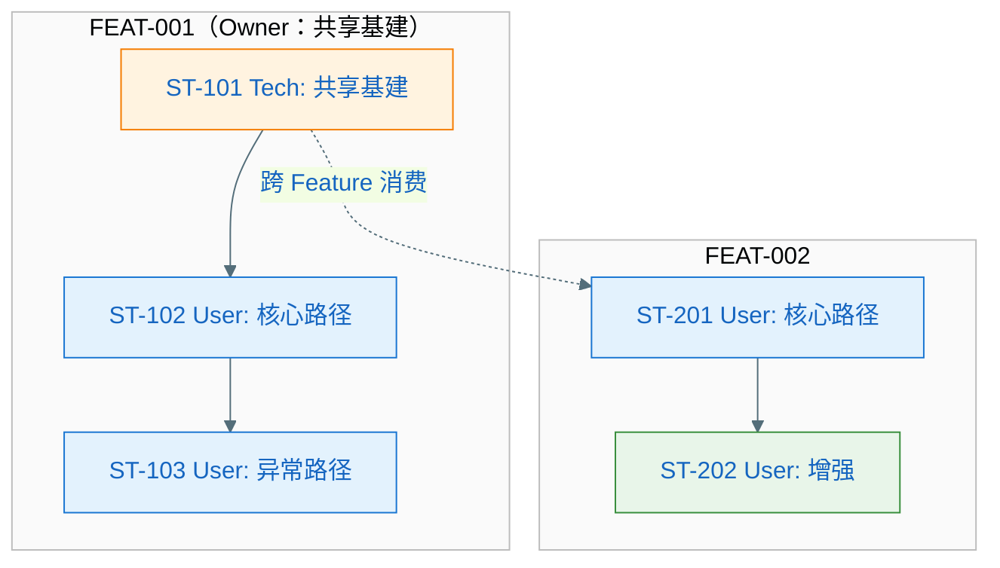

# EPIC 软件设计说明书：EPIC-[编号] - [EPIC 名称]

> **定位**：EPIC 需求级别的技术设计方案，面向人类评审与后续 Task 拆解、Implement 阶段的 AI 编码参考。与各 Feature 的 `plan.md`（技术规约）共同约束 tasks.md 与代码实现。
>
> **输入**：`epic.md`、`epic-plan.md`、各 `features/*/spec.md`、各 `features/*/plan.md`、`ux-design.md`（若已产出）、现有工程代码
>
> **图表规范**：样式遵循 `.cursor/rules/mermaid-style-guide.mdc`；**内容与结构**须基于本工程实际架构与真实代码，遵循 `.cursor/rules/specify-diagram-requirements.mdc`。

**Epic**：EPIC-[编号] - [名称]
**Epic Version**：v0.1.0（来自 `epic.md`）
**设计说明书 Version**：v0.1.0
**创建/更新日期**：[YYYY-MM-DD]
**当前工作分支**：`[epic/... 或 story/... ]`
**EPIC 目录**：`specs/epics/EPIC-[编号]-[short-name]/`

**本 EPIC 设计文件组成**：

| 文件 | 对应章节 | 内容 |
| ---- | -------- | ---- |
| `epic-design.md`（本文件） | 全部章节（摘要/引用/Gate） | EPIC 设计总览，各章节摘要与 Gate 确认 |
| `key-func-design.md` | §六 | 关键功能疑难点/亮点设计策略、方案流程图、Feature 流程图集 |
| `key-diagram.md` | §七 | 全景骨架类图、Feature 子类图（含方法签名）、关键时序图 |
| `features/FEAT-xxx/story_detail_design.md` | §十三 | 各 Story 落码级详细设计（L2） |

---

## 变更记录（增量变更）


| 版本     | 日期           | 变更范围（EPIC/Feature/Story） | 变更摘要 | 影响模块 | 是否需要回滚设计 |
| ------ | ------------ | ------------------------ | ---- | ---- | -------- |
| v0.1.0 | [YYYY-MM-DD] | EPIC                     | 初始版本 | —    | 否        |


---

## 分阶段设计说明（必须遵循）

> **核心原则**：设计从全局到细节逐层推进，每一层确认后才能继续下一层。上层设计不稳定时，下层内容保持占位状态，避免无效返工。

### 设计阶段与 Gate 总览

```
┌─────────────────────────────────────────────────────────────┐
│  Gate 0  │ §一～§四  │ 零层架构     │ 边界 / 外部依赖 / 领域概念   │
├─────────────────────────────────────────────────────────────┤
│  Gate 1  │ §五      │ 一层架构     │ 分层 / 组件职责 / 技术选型   │
├─────────────────────────────────────────────────────────────┤
│  Gate 2  │ §六+§七.1│ 关键设计策略  │ 疑难点 / 亮点 / 逻辑流程图   │
├─────────────────────────────────────────────────────────────┤
│  Gate 3  │ §七.2+.3 │ 全景类图与时序│ 类图签名 / 方法调用时序      │
├─────────────────────────────────────────────────────────────┤
│  Gate 4  │ §八～§十一│ 质量与契约   │ 风险评估 / 接口 / 数据库 / 埋点│
├─────────────────────────────────────────────────────────────┤
│  Gate 5  │ §十二     │ Story 拆解  │ 范围覆盖 / 工作量 / 依赖关系  │
├─────────────────────────────────────────────────────────────┤
│  Gate 6  │ §十三     │ L2 详细设计  │ 按 Story 逐个落码级设计      │
└─────────────────────────────────────────────────────────────┘
```

### 占位规则

- **当前 Gate 未通过时**，后续所有章节内容保持占位状态，仅保留章节标题和 `> 📌 占位：待 Gate X 通过后填写` 提示
- **AI 生成时**：每个阶段只生成当前 Gate 范围内的章节，其余章节输出占位标题；等待人工确认通过后，再继续下一阶段
- **人工评审时**：对照各 Gate 检查清单逐项确认，填写确认结论后方可继续

---

## 设计前置检查（必须，在开始设计前完成）

> **目的**：确保本 EPIC 设计基于整体规划，跨 Feature 技术策略已明确，避免各 Feature 重复设计共享组件。与各 Feature 的 plan.md「Plan 前置检查」形成上下级一致（本 EPIC 设计确立策略，各 Feature plan 复用并落单）。
>
> **强制规则**：
>
> - 在开始 EPIC 设计之前，**必须完成以下检查**
> - 共享能力须在 `epic.md` 的「跨 Feature 技术策略」中明确 Owner Feature，各 Feature 的 plan 须复用、不得另起炉灶
> - 若在设计过程中发现新的共享需求，**必须先更新 epic.md 的「跨 Feature 技术策略」**，再在本文中引用

### 前置检查清单

- 已阅读 `epic.md` 的「跨 Feature 技术策略」章节（若尚未定稿，本设计说明书产出后须与之同步）
- 已阅读 `epic-plan.md`，确认本 EPIC 下各 Feature 的**执行顺序与依赖关系**
- 本 EPIC 涉及的**共享能力**已在 `epic.md` 中登记 Owner Feature（或将在本设计说明书中拟定并回流至 epic.md）
- 若已有部分 Feature 的 **plan.md**，已阅读并识别可复用的组件/接口与约束，避免本设计说明书与既有 plan 冲突

### 本 EPIC 跨 Feature 共享能力登记情况（与 epic.md 一致）

> 列出本 EPIC 范围内由各 Feature 提供或复用的共享能力，与 `epic.md`「跨 Feature 技术策略」保持一致。设计说明书中的架构（§四、§五）应与此表对齐。


| 共享能力名称       | Owner Feature | 消费方 Feature        | 设计/契约位置（本文或 plan 章节）               |
| ------------ | ------------- | ------------------ | ---------------------------------- |
| [例如：UI 基础框架] | FEAT-001      | FEAT-002, FEAT-003 | 本文 §5.3 组件清单 / FEAT-001 plan.md §五 |
| [例如：错误处理]    | FEAT-001      | FEAT-002           | 本文 §5.3 / FEAT-001 plan.md §五      |


> 若某共享能力 Owner 的 plan 尚未完成，后续 Feature 的 plan 需**等待**或与其**协商接口契约**后再设计（见各 Feature plan.md 前置检查）。

### 前置检查结论

- **检查日期**：[YYYY-MM-DD]
- **检查人**：[姓名/角色]
- **结论**：通过 / 需先更新 epic.md 或 epic-plan.md / 需等待 [外部依赖或评审]
- **备注**：[如有阻塞或需协商事项]

---

## 一、简介

### 1.1 目的和对象

说明本文的目的和适合阅读的对象。如：该文档用于描述XX产品的XX版本xx软件设计。适用于设计人员、开发人员、测试人员、资料开发人员等。

### 1.2 范围

说明该文档设计的软件范围，并说明其相关的设计关系，可直接描述，如有相关文档最好指明(如已完成的特性，不完成的特性等等）。

## 二、需求概述

### 2.1 需求背景

说明需求的历史发展过程、当前提出需求的背景（市场变化、技术变化、用户痛点等）、需求来源（提出人或组织）等。

### 2.2 需求范围及限制

说明需求的适用范围、场景和限制。比如：

1. 高、中、低端机是否全部适用
2. 地区是否都适用：内销、外销、欧盟；
3. 支持的机型品牌范围
4. 是否支持升级：项目升级上来以后是否支持新的需求功能
5. 是否支持回落：比如是否支持回落到低版本的机型上
6. 是否需要保密

## 三、领域模型

### 3.1 领域概念（Domain Concepts / Glossary，必须）

> **目的**：统一命名与语义口径，成为后续"架构图/流程图/类图/时序图/接口契约"的**命名权威**。
>
> 要求：
>
> - 只写本 EPIC/Feature 涉及或新引入的领域概念；已有概念可引用来源（其他 Feature/EPIC/已有模块文档）
> - 每个概念必须给出：名称、定义、关键属性/状态、与其他概念的关系（可用表格或简易概念图）

### 3.2 领域概念词汇表（必须）


| 概念（中文） | 名称（英文/代码名） | 定义（一句话） | 关键属性/状态（Top3） | 不变量/约束 | 关联概念 |
| ------ | ---------- | ------- | ------------- | ------ | ---- |
|        |            |         |               |        |      |


### 3.3 概念关系图（推荐，可选）

> **目的**：用类图语法表达**业务领域概念**之间的关系（非技术实现）。
>
> ⚠️ **重要区分**：本节（领域概念图）与 §7.2 全景类图（技术类图）的区别
>
>
> | 维度       | §三 领域概念图             | §7.2 全景类图                                                             |
> | -------- | -------------------- | --------------------------------------------------------------------- |
> | **目的**   | 统一业务语言，建立领域模型        | 定义技术实现的静态结构                                                           |
> | **视角**   | 业务视角（产品/领域专家能看懂）     | 技术视角（开发者能实现）                                                          |
> | **内容**   | 业务实体、值对象、聚合关系        | 按项目架构（Clean Architecture/MVP/MVC/MVVM 等）的技术类                          |
> | **方法**   | 只写关键业务属性，不写方法        | 必须写完整的方法签名                                                            |
> | **示例**   | `订单`、`用户`、`商品`（业务概念） | `OrderRepository`、`OrderUseCase` 或 Presenter/Controller 等（技术组件，依架构而定） |
> | **来源**   | 来自需求分析、DDD 领域建模      | 来自架构设计（Clean Architecture / MVP / MVC / MVVM 等）                       |
> | **修改频率** | 业务需求变化时修改            | 技术方案调整时修改                                                             |
>
>
> **使用建议**：
>
> - 若 Feature 的业务概念较复杂（多实体/复杂关系），推荐画此图
> - 若 Feature 业务简单（如单一 CRUD），可省略此图
> - 此图中的业务概念（如 `订单`）通常在 §7 全景类图中会对应多个技术类（如 `OrderEntity`、`OrderDTO`、`OrderUseCase`）




## 四、零层架构（EPIC 与外部/现有工程边界）

> **目的**：一张图展示本 EPIC 在整体系统中的位置、与外部的关系、内部主要子系统或模块。
>
> 要求：
>
> - 明确 EPIC 边界：哪些是本 EPIC 新增/修改的，哪些是复用已有的
> - 明确系统对外部的依赖，外部依赖的**故障模式**与应对策略，依赖的承接方与交付的产物
> - 无论 EPIC 大小，都必须产出全景图（小 EPIC 图更简单，但不能省略）

### 4.1 边界说明

- **EPIC 范围**：[本 EPIC 与上游/下游系统、现有 App 模块的边界；哪些在 EPIC 内、哪些复用现有]
- **主要子系统/模块**：[高层模块或能力块列表，可与 Feature 或跨 Feature 能力对应]

### 4.2 零层架构图（必须）

> 一张图展示：EPIC 边界、内部核心组件、外部依赖、数据/控制流向




### 4.3 架构设计说明（必须：理由/决策/思考）

> 用文字把"为什么这样画"说清楚，便于评审与后续实现期不走样。
> **注意**：本节聚焦架构设计原理与决策，不涉及具体代码实现。

- **边界与职责**：为什么这些能力属于本 Feature（而不是其他模块）；哪些能力明确不做（Out of Scope）
- **分层与依赖方向**：为何这样分层；为何允许/禁止某些跨层依赖（例如 UI 不直连 DataSource）
- **关键数据流**：数据从哪里来、去哪里（System of Record）、缓存策略与一致性假设
- **外部依赖策略**：对每个关键依赖的失败模式选择了什么策略（重试/退避/降级/熔断/提示），为什么
- **可演进性**：预留哪些扩展点（接口/策略注入/版本兼容）；未来变化下的最小修改面

### 4.4 外部依赖清单（若有则必填，无依赖时标注 N/A）

> **适用场景**：涉及后端 API、系统能力、第三方 SDK、已有模块等外部依赖时必填。
> 若本 Feature 为纯本地功能（如纯 UI 组件、本地计算），可标注 N/A 并简述原因。


| 依赖项      | 类型     | 提供方（团队名称） | 提供的能力 | 通信方式   | 故障模式      | 我方策略  |
| -------- | ------ | --------- | ----- | ------ | --------- | ----- |
| [后端 API] | 内部服务   | [团队名称]    | 数据读写  | HTTPS  | 超时/限流/不可用 | 重试+降级 |
| [系统能力]   | OS/SDK | [系统/平台]   | 权限/存储 | 系统 API | 权限拒绝/不支持  | 提示+引导 |
| [已有模块]   | 内部模块   | [团队名称]    | 认证/日志 | 函数调用   | —         | —     |


---

## ✅ Gate 0 评审确认：零层架构（通过后方可继续 §五）

> **范围**：§一～§四，包含简介、需求概述、领域模型、零层架构。
>
> **确认人**：Tech Lead / 架构师 / 开发负责人
>
> **AI 生成提示**：Gate 0 章节输出完成后，须停止并等待人工确认，**不得自动继续生成 §五及后续章节**。

### Gate 0 自检清单

- [ ] EPIC 边界清晰，范围与 `epic.md` 一致，无遗漏也无超出
- [ ] 所有外部依赖已识别完整，故障模式与应对策略已考虑
- [ ] 领域概念词汇表完整，核心概念定义无歧义
- [ ] 零层架构图已绘制，EPIC 内部组件与外部边界清晰
- [ ] 架构设计决策（§4.3）已说明理由，无重大异议

### Gate 0 确认结论

- **确认人**：[姓名/角色]
- **确认日期**：[YYYY-MM-DD]
- **结论**：通过 / 有保留意见（详见备注）/ 不通过（须修改后重新确认）
- **遗留问题**：[若有，列出并标注处理计划；无则填「无」]

---

## 五、一层架构（分层与模块职责）

> **目的**：用一张框架图 + 配套说明，把所设计的系统的内部组件划分、依赖关系、协作机制、数据流讲清楚。
>
> **要求**：
>
> - **必须在图上明确标注所属的代码工程模块名称**（如 `:feature:xxx`、`:core:data`），subgraph 或组件旁须可见模块归属
> - **静态结构**：用**实线箭头**（`-->`）表示依赖/调用方向
> - **动态协作**：用**虚线箭头**（`-..->`）表示事件/回调/异步消息
> - **架构**：必须基于本工程**实际代码**、**实际模块**与既有架构绘制，禁止照搬 Clean Architecture 等模板。参见 `.cursor/rules/specify-diagram-requirements.mdc`。

### 5.1 一层框架图（必须）

> 须在图上明确标注所属的代码工程模块名称（如 `:feature:xxx`、`:core:data`）。静态依赖用实线箭头，动态协作用虚线箭头。




> **跨层约束**：[例如：UI 不得直接依赖 DataSource；Domain 不得依赖 UI]

### 5.2 组件清单与职责（必须）

> **组件定义**：组件是职责内聚的一组类/接口构成的**子模块**，粒度介于工程模块与单个类之间。本表是 EPIC 的**组件目录**，从架构视角自顶向下设计，与各 Feature plan.md 中定义的接口与契约须保持**双向一致**——组件的对外接口须能支撑 Feature 契约，Feature 契约的变更须回检组件边界。若本表调整了组件边界或接口，须通过增量变更流程同步更新相关 Feature 的 plan.md。


| 组件    | 所属模块          | 职责（一句话） | 输入/输出   | 依赖          | 约束             |
| ----- | ------------- | ------- | ------- | ----------- | -------------- |
| [组件A] | `:module:xxx` | [做什么]   | [输入→输出] | [依赖哪些组件/外部] | [线程/生命周期/并发约束] |


### 5.3 组件协作流程图（必须）

> **目的**：用带分区的流程图展示组件之间的**端到端协作流程**，覆盖正常 + 关键异常路径。每个 subgraph 分区对应 5.2 中的组件/模块边界，与 5.1 框架图形成互补——5.1 展示静态结构，本图展示动态控制流与异常分支。
>
> 本图从架构视角设计，须与各 Feature plan.md 中定义的接口契约保持**双向一致**；若全局视角下发现组件协作方式与 Feature 契约存在矛盾，须通过增量变更流程双向同步。
>
> **要求**：
>
> - subgraph 分区须与 5.2 组件清单中的组件/模块对应，不得遗漏关键组件
> - 从触发端到所有可能的结束状态，控制流须完整、无断点
> - 判断节点须覆盖正常 + 关键异常分支




### 5.4 技术方案选型

> **说明**：仅纳入**存在真实方案取舍**的技术决策点——候选方案之间各有优劣、需要论证才能确定选择的场景。显而易见、无争议的技术选择不列入本节。
>
> 每个决策点用一个独立小节呈现：先用表格对比候选方案，再给出采用结论与理由。

#### 选型 1：[技术决策点名称]


| 方案            | 描述     | 优点        | 缺点        |
| ------------- | ------ | --------- | --------- |
| 方案 A：[名称]     | [简要描述] | [优点1；优点2] | [缺点1；缺点2] |
| 方案 B：[名称]     | [简要描述] | [优点1；优点2] | [缺点1；缺点2] |
| 方案 C：[名称]（可选） | [简要描述] | [优点1；优点2] | [缺点1；缺点2] |


**采用方案 A（[名称]），理由如下：**

1. [理由 1]
2. [理由 2]
3. [理由 3]

#### 选型 2：[技术决策点名称]

（结构同选型 1：候选方案对比表 + 采用结论与理由）

---

## ✅ Gate 1 评审确认：一层架构（通过后方可继续 §六）

> **范围**：§五，包含一层框架图、组件清单与职责、组件协作流程图、技术方案选型。
>
> **确认人**：Tech Lead / 架构师 / 开发负责人
>
> **AI 生成提示**：Gate 1 章节输出完成后，须停止并等待人工确认，**不得自动继续生成 §六及后续章节**。

### Gate 1 自检清单

- [ ] 一层框架图已绘制，模块名称已标注（如 `:feature:xxx`），静态/动态依赖方向正确
- [ ] 所有组件已在 §5.2 清单中登记，职责单一、边界清晰
- [ ] 跨 Feature 共享能力已识别并登记 Owner，与「设计前置检查」表格一致
- [ ] 组件协作流程图覆盖正常 + 关键异常分支
- [ ] 所有技术选型决策已列出且有明确理由
- [ ] 跨层约束已明确（如 UI 不直连 DataSource）

### Gate 1 确认结论

- **确认人**：[姓名/角色]
- **确认日期**：[YYYY-MM-DD]
- **结论**：通过 / 有保留意见（详见备注）/ 不通过（须修改后重新确认）
- **遗留问题**：[若有，列出并标注处理计划；无则填「无」]

---

## 六、关键功能与疑难点/亮点设计

> 📌 **占位提示**：Gate 1 通过前，本节保持占位状态，不填写实质内容。

> **定位**：面向方案评审，将重难点模块的**设计策略与决策逻辑**讲清楚。聚焦"为什么难 → 怎么解决 → 方案的处理流程"，抽象层级与 §五（模块/组件级）对齐，不下沉到类/方法级细节（类图、时序图见 §七）。
>
> **内容文件**：详细内容写在独立文件 **`key-func-design.md`** 中（模板见 `.specify/templates/key-func-design-template.md`），本节仅保留摘要与引用。
>
> **何时省略**：若无疑难点且无方案亮点，可在下方标注「本 EPIC 无关键疑难点/亮点，省略」。

### 6.1 关键设计清单（摘要）

> 列出 `key-func-design.md` 中所有关键设计点，便于评审者快速了解范围。详细内容见引用文件。

| 编号   | 设计点名称   | 类型        | 关联 §七      |
| ------ | ------------ | ----------- | ------------- |
| KD-001 | [设计点名称] | 疑难点/亮点 | SEQ-xxx / §7.2 [类名] / — |
| KD-002 | [设计点名称] | 疑难点/亮点 | —             |

### 6.2 详细设计引用

→ **`key-func-design.md`**（含关键设计策略、方案流程图、Feature 流程图集）

---

## ✅ Gate 2 评审确认：关键设计策略（通过后方可继续 §七）

> **范围**：§六 + §七.1（关键设计疑难点/亮点 + Feature 流程图集）。
>
> **确认人**：Tech Lead / 架构师 / 开发负责人
>
> **AI 生成提示**：Gate 2 章节输出完成后，须停止并等待人工确认，**不得自动继续生成 §七.2 及后续章节**。

### Gate 2 自检清单

- [ ] 所有技术疑难点已识别并给出解决方案，无遗漏关键风险点
- [ ] 每个疑难点的方案选型有候选方案对比和理由，不是"拍脑袋"决策
- [ ] 关键流程图（§7.1）覆盖正常 + 所有关键异常分支，流程无断点
- [ ] 流程图中的节点与 §5.2 组件清单对应，无未定义组件
- [ ] §六 的疑难点解决方案与 §五 一层架构不冲突

### Gate 2 确认结论

- **确认人**：[姓名/角色]
- **确认日期**：[YYYY-MM-DD]
- **结论**：通过 / 有保留意见（详见备注）/ 不通过（须修改后重新确认）
- **遗留问题**：[若有，列出并标注处理计划；无则填「无」]

---

## 七、全景类图与关键流程/时序（EPIC 或主 Feature 级）

> 📌 **占位提示**：Gate 2 通过前，本节保持占位状态，不填写实质内容。

> **定位**：EPIC/主 Feature 级的**结构纵览与主流程说明**，服务于方案评审与 Task 对设计的引用。
>
> **内容文件**：详细内容写在独立文件 **`key-diagram.md`** 中（模板见 `.specify/templates/key-diagram-template.md`），本节仅保留摘要与引用。
>
> **与 §十三 L2（story_detail_design.md）的区别**：
>
> | 维度     | §七 本节（全景级）                                      | §十三 L2（Story 级）                        |
> | ------ | ------------------------------------------------ | ---------------------------------------- |
> | 层级     | EPIC / 主 Feature 级                              | Story 级（按 ST-xxx 分节）                    |
> | 类图/时序图 | 骨架类图（无方法签名）+ Feature 子类图（含方法签名）+ 主流程时序图          | 本 Story 的完整详细类图/时序图                      |
> | 目的     | 评审用整体视图；Task 引用设计所在章节                            | tasks/implement 的详细设计事实源，落码级指导           |
> | 何时必做   | 本节必须产出                                           | 仅当 Story 技术复杂度高或需落码级指导时补充                |

### 7.1 图表概览（摘要）

> 列出 `key-diagram.md` 中包含的骨架类图、Feature 子类图和时序图，便于评审者快速定位。详细图表见引用文件。

**骨架类图**：→ `key-diagram.md` §7.2

**Feature 子类图清单**：

| Feature    | 子类图位置                        | 关键类/接口（Top3）    |
| ---------- | -------------------------------- | -------------------- |
| FEAT-001   | `key-diagram.md` §7.2.1          | [类名1, 类名2, 类名3] |
| FEAT-002   | `key-diagram.md` §7.2.2          | [类名1, 类名2]        |

**时序图索引**：

| Seq ID  | 所属 Feature | 流程名称   | 关联 KD    |
| ------- | ---------- | ------ | -------- |
| SEQ-001 | FEAT-001   | [流程名称] | KD-xxx / — |
| SEQ-002 | FEAT-002   | [流程名称] | —        |

### 7.2 详细图表引用

→ **`key-diagram.md`**（含全景骨架类图、Feature 子类图、关键时序图、图表一致性自检）

---

## ✅ Gate 3 评审确认：全景类图与关键时序（通过后方可继续 §八）

> **范围**：`key-diagram.md`，包含全景骨架类图、Feature 子类图（含方法签名）、关键时序图。
>
> **确认人**：Tech Lead / 架构师 / 开发负责人
>
> **AI 生成提示**：Gate 3 章节输出完成后，须停止并等待人工确认，**不得自动继续生成 §八及后续章节**。

### Gate 3 自检清单

- [ ] 骨架类图已绘制，跨 Feature 接口/抽象类与各 Feature 核心入口类之间关系清晰
- [ ] 每个 Feature 子类图（§7.2.x）已完成，公共方法均有完整签名（方法名 + 参数 + 返回值）
- [ ] 子类图覆盖了 §5.2 中所有关键组件，依赖方向正确（上层依赖下层）
- [ ] 每个 Feature 至少有 1 张关键时序图，participant 使用真实类名
- [ ] 时序图端到端完整，从触发端到最终响应无断链
- [ ] 时序图包含 alt/else 异常分支，异常调用链有实际代码支撑
- [ ] §7.4 图表一致性自检全部通过

### Gate 3 确认结论

- **确认人**：[姓名/角色]
- **确认日期**：[YYYY-MM-DD]
- **结论**：通过 / 有保留意见（详见备注）/ 不通过（须修改后重新确认）
- **遗留问题**：[若有，列出并标注处理计划；无则填「无」]

---

## 八、技术风险与评估（必须量化）

> 📌 **占位提示**：Gate 3 通过前，本节保持占位状态，不填写实质内容。

> **说明**：本节涵盖技术风险、边界异常、算法/功耗/性能/内存/安全/兼容性的**完整评估**。各子节标注「如适用」的，若不适用须标注 N/A 并简述原因。
>
> **与 spec.md NFR 的关系**：`spec.md` 的 NFR 定义**验收目标**（如"p95 ≤ 200ms"）；本节基于设计方案进行**技术评估与实测**，验证方案是否满足 NFR 目标。若评估结果超标，须调整设计方案或协商 NFR 目标变更（走 CR 流程）。

### 8.1 技术风险与消解策略（绑定 Feature/Story）

> **风险维度（须逐类审视，如不适用可标注 N/A 或省略该行）**：
>
> - **算法快稳省**：时延/吞吐、稳定性（崩溃/超时/降级）、资源占用（CPU/内存/电量/带宽）
> - **算法效果**：准确率/召回率/效果达标、离线与线上一致性、数据分布变化带来的效果漂移
> - **技术方案**：选型可行性、依赖/兼容性、可维护性、技术债与演进成本
> - **数据安全与隐私**：敏感数据存储/传输/脱敏、合规（如 GDPR、个保法）、权限与审计
> - **成本**：算力/存储/带宽/第三方 API 成本、人力与排期成本
> - **用户体验**：卡顿/等待时长、错误提示与降级体验、可访问性、多端一致性
> - **其他**：合规、供应链、运维/发布等；按项目需要补充。


| 风险ID     | 风险类别                                    | 风险描述 | 触发条件 | 影响范围 | 严重度          | 消解策略 | 对应 Feature/Story  |
| -------- | --------------------------------------- | ---- | ---- | ---- | ------------ | ---- | ----------------- |
| RISK-001 | [选填：算法快稳省/算法效果/技术方案/数据安全与隐私/成本/用户体验/其他] |      |      |      | High/Med/Low |      | FEAT-xxx / ST-??? |


### 8.2 边界与异常场景枚举（数据/状态/生命周期/并发/用户行为）

> **范围**：仅列出**关键的**、或**难以洞察发现的**边界与异常场景。显而易见、常规处理的无需逐一罗列。

- **数据边界**：[空/超大/非法/重复/过期等]
- **状态边界**：[状态机不可达/回退/重入等]
- **生命周期**：[前后台切换/旋转/进程被杀/恢复等]
- **并发**：[多线程/协程/并发写/竞态等]
- **用户行为**：[快速连点/断网/弱网/权限拒绝等]

#### 8.2.1 场景 → 应对措施对照表（必须）

> 目的：把"枚举"落到"可执行对策"，并与 §7.1 流程图 / §7.3 时序图的异常分支互校。
>
> **对策类型说明**：
>
> - **技术对策**：通过代码/架构层面解决（重试/退避/降级/回滚/补偿/去重/限流等）
> - **设计对策**：需产品/设计层面介入（交互引导/文案提示/流程简化/功能裁剪等），标注 `TODO(PM)` 或 `TODO(UX)` 待确认


| Feature 名称    | 场景名称   | 场景及影响描述          | 严重程度         | 发生频率         | 技术对策        | 设计对策（产品/UX）     |
| ------------- | ------ | ---------------- | ------------ | ------------ | ----------- | --------------- |
| [FEAT-xxx 名称] | [场景名称] | [场景描述及对用户/系统的影响] | High/Med/Low | High/Med/Low | [重试/降级/...] | [引导文案/流程简化/N/A] |


### 8.3 算法评估（如适用）

> 适用于：推荐算法、检测算法、分类算法、生成算法等涉及机器学习/AI 的场景。不适用时标注 N/A。

#### 8.3.1 客观指标（必须量化）


| 指标              | 目标值       | 备注         |
| --------------- | --------- | ---------- |
| 准确率 (Precision) | ≥ [阈值]%   | 例如：≥ 90%   |
| 召回率 (Recall)    | ≥ [阈值]%   | 例如：≥ 85%   |
| 响应时延 (p95)      | ≤ [阈值] ms | 例如：≤ 200ms |
| [其他指标]          | [目标值]     | 根据算法类型补充   |


#### 8.3.2 主观指标（如适用）

- **可用性评分**：≥ **4.0 分** (满分 5 分，用户样本 ≥ 100 人)
- **评分维度**：[相关性/准确性/易用性等]
- **达标标准**：平均分 ≥ 4.0，且 < 3 分的比例 ≤ 10%

#### 8.3.3 降级策略（必须）


| 触发条件    | 降级策略         |
| ------- | ------------ |
| 低端设备/弱网 | 使用轻量模型、本地缓存  |
| 算法失败    | 降级到规则策略或默认推荐 |


### 8.4 功耗评估（必须量化，基于场景）

> **计算公式**：
>
> - 单次功耗 (mAh) = 平均电流增量 (mA) × 使用时长 (秒) / 3600
> - 每日功耗增量 (mAh) = 单次功耗 × 每日使用次数 × 功能渗透率 / 5%
>
> **温升计算公式**（工程估算）：
>
> - 温升 (°C) ≈ (电流增量 (mA) / 1000 × 3.7V) × 热阻 (8°C/W) × 修正系数
> - 修正系数：短时操作（<10s）约 0.4，持续操作（>1min）约 1.0

#### 8.4.1 Top 5% 重度用户模型


| 维度   | 定义                   |
| ---- | -------------------- |
| 设备型号 | [例如：中端机型，4000mAh 电池] |
| 使用频次 | [例如：每天使用功能 X 次]      |
| 使用场景 | [前台使用/后台运行]          |


#### 8.4.2 功耗与温升场景评估（逐场景列出）

##### 场景 1：[场景名称]


| 参数         | 数值             | 计算                            |
| ---------- | -------------- | ----------------------------- |
| 电流增量       | [例如：30 mA]     | 相对 Baseline                   |
| 使用时长       | [例如：5 秒]       | 单次操作时长                        |
| 每日使用次数     | [例如：3 次]       | Top5% 用户                      |
| 功能渗透率      | [例如：1%]        | 实际使用用户占比                      |
| **每日功耗增量** | **[计算结果] mAh** | 30×5/3600×3×1%/5% = 0.025 mAh |
| **预估温升**   | **[计算结果] °C**  | 0.111×8×0.4 = 0.36°C ✅        |


##### 场景 2：[场景名称]

（同上结构，按需添加）

#### 8.4.3 汇总与验收标准


| 场景     | 每日功耗 (mAh) | 温升 (°C) | 是否达标 |
| ------ | ---------- | ------- | ---- |
| 场景 1   | 0.025      | 0.36    | ✅    |
| 场景 2   | [实测]       | [实测]    | ✅/❌  |
| **总计** | **[汇总]**   | —       | —    |


**验收标准**：

- 每日功耗增量：≤ [阈值] mAh（例如：≤ 10 mAh）
- 单场景温升：≤ **0.5°C**（任何场景）
- 失败处置：超标必须优化，不得上线

#### 8.4.4 降级策略（必须）


| 触发条件        | 降级策略          |
| ----------- | ------------- |
| 功耗/温升超标     | 降低执行频率、间歇执行   |
| 低电量模式（<20%） | 关闭后台任务，仅前台触发  |
| 高温保护（>40°C） | 暂停功能，待温度降低后恢复 |


### 8.5 性能评估（必须量化，基于场景）

#### 8.5.1 测试设备基线


| 维度   | 定义               |
| ---- | ---------------- |
| 设备型号 | [例如：小米 11（中端机型）] |
| 系统版本 | [例如：Android 12]  |
| 网络环境 | [例如：4G 良好信号]     |


#### 8.5.2 性能场景与指标（根据功能类型选择适用场景）

##### 启动/加载场景（如适用）


| 场景           | 指标   | 验收标准 (p95) | 实测   |
| ------------ | ---- | ---------- | ---- |
| 冷启动          | 启动耗时 | ≤ 2000ms   | [实测] |
| 热启动          | 启动耗时 | ≤ 1000ms   | [实测] |
| 页面首屏加载 (TTI) | 加载耗时 | ≤ 1000ms   | [实测] |
| 功能模块初始化      | 加载耗时 | ≤ 1500ms   | [实测] |


**性能预算分解**（关键场景必填）：

- [场景名称] 总预算 [X]ms = 网络 [X]ms + 解析 [X]ms + 渲染 [X]ms + 其他 [X]ms

##### UI 交互场景（必须，统一验收标准）

> **通用 UI 性能标准**（适用于所有点击、滑动、输入、动画等交互）：


| 指标类型            | 验收标准                   | 说明                |
| --------------- | ---------------------- | ----------------- |
| 点击/输入响应 (p95)   | ≤ 200ms                | 用户操作到视觉反馈的时延      |
| 页面切换/动画流畅度      | 平均 ≥ 55fps，p95 ≥ 50fps | 动画、过渡、滑动等场景       |
| 卡顿率 (Jank Rate) | ≤ 5%                   | 单帧耗时 >16.67ms 的比例 |


**本功能涉及的 UI 交互场景**（列出关键场景即可）：

- [场景 1]：[例如：商品列表滑动] → 遵循通用标准
- [场景 2]：[例如：页面切换动画] → 遵循通用标准
- [场景 3]：[例如：搜索输入响应] → 遵循通用标准

##### 后台任务场景（如适用）


| 场景      | 指标   | 验收标准 (p95) | 实测   |
| ------- | ---- | ---------- | ---- |
| 后台数据同步  | 完成时间 | ≤ 30s      | [实测] |
| 文件下载/上传 | 完成时间 | [根据文件大小]   | [实测] |
| 后台计算任务  | 完成时间 | ≤ 10s      | [实测] |


**约束**：CPU 占用平均 ≤ 10%，避免影响前台

#### 8.5.3 验收标准汇总


| 场景类型      | 核心指标 | 验收标准 (p95)                  |
| --------- | ---- | --------------------------- |
| 冷启动       | 启动耗时 | ≤ 2000ms                    |
| 页面加载      | TTI  | ≤ 1000ms                    |
| UI 交互（通用） | 响应时延 | ≤ 200ms                     |
| UI 交互（通用） | 帧率   | ≥ 55fps (平均), ≥ 50fps (p95) |
| 后台任务      | 完成时间 | ≤ 30s（根据任务调整）               |


**失败处置**：性能超标必须优化，不得上线

#### 8.5.4 降级策略（必须）


| 触发条件            | 降级策略              |
| --------------- | ----------------- |
| 低端设备            | 降低动画帧率、简化 UI、减少并发 |
| 弱网环境（< 100KB/s） | 启用缓存、降低图片质量       |
| 高负载（CPU > 80%）  | 延迟非关键任务、降低刷新频率    |


### 8.6 内存评估（必须量化，基于场景）

#### 8.6.1 内存场景与增量分解


| 场景              | 验收标准             | 主要内存来源                | 预估 (MB) | 实测 (MB) | 优化方向      |
| --------------- | ---------------- | --------------------- | ------- | ------- | --------- |
| 前台正常使用          | PSS ≤ 50MB       | 图片缓存、UI 视图、数据缓存       | [预估]    | [实测]    | [优化方向]    |
| 前台重度使用（峰值）      | PSS ≤ 100MB      | 图片缓存、临时数据、并发任务        | [预估]    | [实测]    | [优化方向]    |
| 后台驻留            | 内存占用 ≤ 20MB      | 核心服务、必要缓存             | [预估]    | [实测]    | [优化方向]    |
| 长时间使用（30分钟）     | 无持续增长            | 累积缓存、可能泄漏点            | [预估]    | [实测]    | [优化方向]    |
| 内存泄漏检测（进出 10 次） | 回到 Baseline ±5MB | Activity/Fragment、监听器 | —       | [实测]    | [修复泄漏]    |
| 内存抖动            | GC ≤ 10 次/分钟     | 频繁对象创建                | —       | [实测]    | 对象复用、减少分配 |


**失败处置**：内存增量超标（>100MB）或内存泄漏，必须修复，不得上线

### 8.7 安全评估（如适用）

> 适用于：涉及用户数据、网络通信、存储、权限的功能；不适用标注 N/A。

#### 8.7.1 数据安全（如涉及用户数据）


| 安全点    | 防护措施                   | 验收标准          |
| ------ | ---------------------- | ------------- |
| 敏感数据存储 | 加密存储（AES-256/Keystore） | 无明文密码/Token   |
| 数据传输   | HTTPS + 证书校验           | 所有接口 HTTPS    |
| 日志安全   | 敏感字段脱敏                 | Release 无敏感日志 |


#### 8.7.2 权限安全（如申请敏感权限）

> **说明**：列出本技术方案**新增的权限**及申请/配置方式。若涉及**预授权**（需在系统侧或配置侧预先开通的权限），须明确在**哪些 OS 版本**上配置、由谁配置、配置入口（如系统设置、预装配置、MDM 等）。


| 权限（Android 权限名/ID）        | 使用场景   | 申请或配置方式                     | 是否预授权 | 预授权配置的 OS 版本/条件                       | 拒绝或未授权时处理    |
| ------------------------- | ------ | --------------------------- | ----- | ------------------------------------- | ------------ |
| [例如：ACCESS_FINE_LOCATION] | [具体场景] | 运行时申请 / Manifest 声明 / 系统预配置 | 否 / 是 | 若预授权：Android X+、需在 [系统设置/预装清单/MDM] 配置 | 功能降级/引导设置/提示 |


**填写说明**：

- **申请或配置方式**：运行时动态申请、Manifest 声明、或需厂商/系统侧预配置（预授权）
- **预授权**：若权限需在系统/预装/MDM 等侧预先开通才能使用，选「是」，并在「预授权配置的 OS 版本/条件」列写明：在哪些 Android 版本（如 Android 10+）、哪些机型或渠道需要配置，以及配置入口（如 Settings、预装 xml、企业策略）
- **原则**：最小权限、运行时能申请则运行时申请、拒绝后降级或引导

#### 8.7.3 代码安全与合规性

- **代码混淆**：ProGuard/R8 混淆（Release 版本）
- **合规性**：GDPR/个人信息保护法（隐私政策 + 用户同意）

### 8.8 兼容性评估（必须）

**兼容性检查清单**：

- **系统版本兼容**：支持的 Android API 范围（如 API 24+），需测试的关键版本（如 API 24/31/33）
- **设备兼容**：低端机（2GB RAM）降级方案、折叠屏/平板适配方案
- **屏幕兼容**：使用 dp/sp、响应式布局、适配刘海屏/挖孔屏（WindowInsets）
- **网络兼容**：弱网/断网降级方案（缓存/提示）
- **数据库升级**：Room Migration 方案、向前兼容、跨版本升级支持、失败回滚策略
- **APK 版本升级**：覆盖安装兼容、数据迁移策略、灰度发布计划、回滚方案
- **第三方库兼容**：依赖库版本与最低 API 要求
- **权限兼容**：新增权限在合适时机申请（非启动时）、老版本权限保留
- **不兼容场景**：低版本系统/低端设备/特殊机型的处理策略

**兼容性结论**：[一句话总结兼容性风险评估，例如："本需求兼容 API 24+，需重点测试数据库迁移和低端机降级方案，整体兼容性风险较低"]

---

## 九、接口设计

> 📌 **占位提示**：Gate 3 通过前，本节保持占位状态，不填写实质内容。

> **定位**：面向方案评审，完整描述本 EPIC 对外提供的接口与依赖的外部接口，与各 Feature 的 `plan.md`「接口规约」章节对齐，确保接口契约在评审阶段得到充分论证。
>
> **与 plan.md 的关系**：各 Feature 的 `plan.md` 中定义了接口的**完整规约**（参数、返回值、错误码等），本章节从 EPIC 维度汇总与评审关键接口，不重复定义细节，以引用为主。

### 9.1 对外提供的接口

> **适用场景**：本 EPIC 对其他模块、Feature 或外部系统暴露的接口（SDK API、服务接口、组件接口、进程间通信等）。若无对外接口标注 N/A。

#### 9.1.1 接口清单


| 接口ID    | 接口名称   | 接口类型                   | 所属模块/Feature | 消费方        | 规约位置                   |
| ------- | ------ | ---------------------- | ------------ | ---------- | ---------------------- |
| API-001 | [接口名称] | [REST/SDK/IPC/函数调用/事件] | FEAT-xxx     | [消费方模块/外部] | FEAT-xxx plan.md §接口规约 |


#### 9.1.2 关键接口详述

> 仅对评审中需要重点论证的关键接口进行展开描述，常规接口在 plan.md 中维护即可。

##### API-001：[接口名称]

- **接口类型**：REST API / SDK 函数 / IPC / 函数调用 / 事件
- **所属模块**：[模块名称]
- **消费方**：[调用方模块或系统]
- **接口描述**：[一句话说明接口用途]
- **请求/调用**：

```
[方法 / 函数签名 / 请求路径]
参数：
  - [参数名]：[类型] — [说明]
  - [参数名]：[类型] — [说明]
```

- **响应/返回值**：

```
[返回类型]
字段：
  - [字段名]：[类型] — [说明]
```

- **错误码/异常**：


| 错误码   | 含义   | 处理建议   |
| ----- | ---- | ------ |
| [错误码] | [含义] | [处理建议] |


- **并发/幂等/版本约束**：[如：幂等、限流、版本兼容性说明]
- **规约完整定义**：→ `FEAT-xxx plan.md §接口规约`

##### API-002：[接口名称]

（结构同 API-001）

### 9.2 依赖的外部接口

> **适用场景**：本 EPIC 依赖的外部系统、后端服务、第三方 SDK、OS 能力等提供的接口。与 §4.4 外部依赖清单对应，本节聚焦接口层面的契约描述。若无外部接口依赖标注 N/A。

#### 9.2.1 外部接口清单


| 接口ID    | 接口名称   | 接口类型             | 提供方        | 所属 Feature | 规约位置                   |
| ------- | ------ | ---------------- | ---------- | ---------- | ---------------------- |
| EXT-001 | [接口名称] | [REST/SDK/系统API] | [提供方团队/系统] | FEAT-xxx   | [文档链接 / plan.md §接口规约] |


#### 9.2.2 关键外部接口详述

> 仅对评审中需要重点论证的关键外部依赖接口进行展开，重点说明契约假设与故障应对。

##### EXT-001：[接口名称]

- **接口类型**：REST API / SDK / 系统 API
- **提供方**：[团队名称 / 系统]
- **接口描述**：[一句话说明接口用途]
- **请求/调用**：

```
[方法 / 函数签名 / 请求路径]
关键参数：
  - [参数名]：[类型] — [说明]
```

- **响应/返回值**：

```
关键字段：
  - [字段名]：[类型] — [说明]
```

- **契约假设**：[SLA 约定、响应时延预期、数据一致性假设等]
- **故障模式与应对**：[超时/限流/不可用时的降级或重试策略，与 §4.4 对应]
- **规约完整定义**：→ `FEAT-xxx plan.md §接口规约` / [外部文档链接]

##### EXT-002：[接口名称]

（结构同 EXT-001）

### 9.3 接口一致性自检

- 所有对外接口（§9.1）已在对应 Feature 的 `plan.md` 中有完整规约定义
- 所有外部接口依赖（§9.2）与 §4.4 外部依赖清单条目一一对应
- 关键接口的错误码/异常场景已在 §8.2 边界与异常场景中覆盖
- 接口版本兼容性已在 §8.8 兼容性评估中说明（如适用）

---

## 十、数据库设计

> 📌 **占位提示**：Gate 3 通过前，本节保持占位状态，不填写实质内容。

> **定位**：面向方案评审，完整描述本 EPIC 涉及的所有数据库表结构设计，与各 Feature 的 `plan.md`「数据规约」章节对齐，确保数据模型在评审阶段得到充分论证。
>
> **与 plan.md 的关系**：各 Feature 的 `plan.md` 中定义了数据存储的**完整规约**（字段类型、约束、索引等），本章节从 EPIC 维度汇总与评审关键数据表，以整体视角描述数据模型。
>
> **适用场景**：本 EPIC 涉及本地数据库（Room/SQLite）、云端数据库、键值存储等持久化数据结构设计。若无数据库设计标注 N/A。

### 10.1 数据库概览

#### 10.1.1 数据存储清单


| 存储ID   | 存储名称       | 存储类型                                   | 所属 Feature | 表/集合数量 | 规约位置                   |
| ------ | ---------- | -------------------------------------- | ---------- | ------ | ---------------------- |
| DB-001 | [数据库/存储名称] | [Room/SQLite/SharedPrefs/DataStore/云端] | FEAT-xxx   | [N 张表] | FEAT-xxx plan.md §数据规约 |


#### 10.1.2 数据库 ER 图（推荐）

> 用 ER 图展示关键数据表之间的关系，便于评审者理解整体数据模型。




### 10.2 数据表详细设计

> 每张表一节，完整描述字段含义、类型、约束和索引。

#### 10.2.1 [表名 / TABLE_A]

- **所属模块**：[模块名称]
- **所属 Feature**：FEAT-xxx
- **用途描述**：[一句话说明该表存储什么数据、用于什么场景]

##### 字段设计


| 字段名     | 类型                       | 是否必填 | 默认值     | 说明       | 约束                        |
| ------- | ------------------------ | ---- | ------- | -------- | ------------------------- |
| `id`    | INTEGER                  | 是    | 自增      | 主键       | PRIMARY KEY AUTOINCREMENT |
| `[字段名]` | [TEXT/INTEGER/REAL/BLOB] | 是/否  | [默认值/-] | [字段含义说明] | [UNIQUE/NOT NULL/外键等]     |


##### 索引设计


| 索引名             | 索引字段  | 索引类型          | 用途说明     |
| --------------- | ----- | ------------- | -------- |
| `idx_[表名]_[字段]` | [字段名] | UNIQUE / 普通索引 | [查询场景说明] |


##### 版本迁移


| 版本号 | 变更内容        | 迁移策略                   |
| --- | ----------- | ---------------------- |
| v1  | 初始建表        | 创建表                    |
| v2  | [新增字段/修改字段] | [ALTER TABLE / 数据迁移脚本] |


- **规约完整定义**：→ `FEAT-xxx plan.md §数据规约`

#### 10.2.2 [表名 / TABLE_B]

（结构同 10.2.1）

### 10.3 数据设计说明

> 说明关键的数据设计决策，包括数据一致性策略、缓存策略、数据生命周期管理等。

- **数据一致性**：[本地与远端数据的一致性策略，如 Single Source of Truth、乐观锁、最终一致性等]
- **缓存策略**：[缓存失效机制、缓存大小上限、LRU 策略等]
- **数据生命周期**：[数据保留策略、过期清理机制、用户注销后的数据处理]
- **数据迁移策略**：[版本升级时的 Migration 策略，与 §8.8 兼容性评估中数据库升级项对应]
- **敏感数据处理**：[加密字段、脱敏策略，与 §8.7 安全评估对应]

### 10.4 数据库设计一致性自检

- 所有数据表已在对应 Feature 的 `plan.md` 中有完整的数据规约定义
- §10.1 ER 图中的表关系与 §三 领域模型概念一致
- 所有外键关联已在字段约束中明确标注
- 数据库版本迁移策略已在 §8.8 兼容性评估中覆盖
- 敏感字段已在 §8.7 安全评估中标注加密/脱敏要求

---

## 十一、埋点技术方案

> 📌 **占位提示**：Gate 3 通过前，本节保持占位状态，不填写实质内容。

> **说明**：列出本 EPIC 所有需要采集的埋点事件及其字段规约。仅列出本 EPIC 新增或修改的埋点，复用已有埋点可引用来源文档。


| app_id | event_id   | 事件名称描述      | 字段 ID      | 字段描述     | 值数据类型                 | 字段值范围    | 字段长度   | 字段示例  | 触发条件/机制                           |
| ------ | ---------- | ----------- | ---------- | -------- | --------------------- | -------- | ------ | ----- | --------------------------------- |
| 2006   | [event_id] | [事件名称及用途说明] | [field_id] | [字段含义说明] | [String/Int/Bool/...] | [枚举值或范围] | [最大长度] | [示例值] | [什么场景下触发采集，如：用户点击按钮/页面曝光/请求成功回调等] |


---

## ✅ Gate 4 评审确认：质量与契约（通过后方可继续 §十二）

> **范围**：§八 技术风险与评估 + §九 接口设计 + §十 数据库设计 + §十一 埋点技术方案。
>
> **确认人**：Tech Lead / 架构师 / 开发负责人（§九 接口部分建议同步后端接口负责人评审）
>
> **AI 生成提示**：Gate 4 章节输出完成后，须停止并等待人工确认，**不得自动继续生成 §十二及后续章节**。

### Gate 4 自检清单

**§八 技术风险**
- [ ] 风险表已覆盖算法/性能/内存/安全/兼容性等关键维度，无适用项不得缺漏
- [ ] 所有风险有明确消解策略，高风险项有对应 Story 或 Task 绑定
- [ ] 性能/功耗/内存评估已量化（含具体数值），不得只写定性描述
- [ ] 兼容性评估已说明目标 API 范围和数据库迁移策略（如适用）

**§九 接口设计**
- [ ] 所有对外接口已在清单（§9.1）中登记，关键接口有详细描述
- [ ] 所有外部接口依赖已在清单（§9.2）中登记，与 §4.4 外部依赖清单一致
- [ ] 错误码/异常场景与 §8.2 边界场景对应

**§十 数据库设计**
- [ ] ER 图已绘制，表间关系清晰
- [ ] 关键数据表已有字段设计和索引设计
- [ ] 数据库版本迁移策略已说明（如适用）

**§十一 埋点**
- [ ] 所有关键用户行为和业务事件已登记
- [ ] 埋点字段完整，触发条件明确

### Gate 4 确认结论

- **确认人**：[姓名/角色]
- **确认日期**：[YYYY-MM-DD]
- **结论**：通过 / 有保留意见（详见备注）/ 不通过（须修改后重新确认）
- **遗留问题**：[若有，列出并标注处理计划；无则填「无」]

---

## 十二、Story 拆解

> 📌 **占位提示**：Gate 4 通过前，本节保持占位状态，不填写实质内容。

> **说明**：Story 拆解采用**混合模式**——以 **User Story（用户功能视角）为主干**，以 **Tech Story（技术准备视角）为补充**，按 Feature 分组组织。每个 Feature 下的 Story 须构成端到端可验证的功能增量。Task 在 tasks.md 中拆解，须引用本设计说明书及（若存在）story_detail_design.md。
>
> **下游同步**：Story 拆解完成后，须回填各 Feature 的 `plan.md`「Story 索引表」和 `spec.md`「需求追溯表」，确保上下游一致。

### 12.1 拆解策略

#### 混合模式：User Story 为主干，Tech Story 为补充


| Story 类别       | 定义                                                | 占比     | 验收者           | 使用场景                            |
| -------------- | ------------------------------------------------- | ------ | ------------- | ------------------------------- |
| **User Story** | 以用户操作路径为切入，每个 Story 贯穿所有技术层，交付一个**端到端可验证的最小功能闭环** | 70-80% | PM / QA 可演示验收 | 核心功能路径、异常路径、体验增强                |
| **Tech Story** | 以技术准备为目的，为多个 User Story 提供共同前置依赖或补充非功能性工作         | 20-30% | 开发者自验         | 共享技术基建、纯技术债/重构、非功能性需求（监控/安全/性能） |


**核心原则**：垂直切片优先。每个 User Story 应贯穿 UI → 业务逻辑 → 数据层，完成后即可独立演示。禁止将一个 Feature 全部拆成按技术层水平切割的 Tech Story。

```
✅ 推荐：垂直切片                    ❌ 避免：水平分层
┌────┐┌────┐┌────┐┌────┐          ┌─────────────────────┐
│ UI ││ UI ││ UI ││ UI │          │      UI 层          │
│    ││    ││    ││    │          ├─────────────────────┤
│逻辑││逻辑││逻辑││逻辑│          │    业务逻辑层        │
│    ││    ││    ││    │          ├─────────────────────┤
│数据││数据││数据││数据│          │     数据层          │
└────┘└────┘└────┘└────┘          └─────────────────────┘
 US1   US2   US3   US4             TS1→TS2→TS3→TS4
 (每个可独立演示验证)               (前面的无法独立验证)
```

#### User Story 拆解维度（按优先级排序）


| 维度                      | 适用场景              | 示例                          |
| ----------------------- | ----------------- | --------------------------- |
| **按用户操作路径**             | Feature 有多条独立操作入口 | 登录：账号密码登录 / 第三方登录 / 自动登录    |
| **按业务规则/变体**            | 同一操作存在不同业务规则      | 价格计算：基础计算 / 满减优惠 / 多券叠加     |
| **按 Happy Path + 异常路径** | 需先走通核心再补齐异常       | 搜索：正常搜索结果 / 无结果空状态 / 网络异常处理 |
| **按渐进增强**               | 功能可分多个阶段迭代        | 收藏：添加+查看 / 取消收藏 / 分组管理      |
| **按数据来源/输入方式**          | 功能涉及多种输入方式        | 搜索：文本输入 / 语音输入 / 拍照搜索       |


#### Tech Story 合理使用场景（仅以下三种）


| 场景          | 判断标准                                     | 示例                               |
| ----------- | ---------------------------------------- | -------------------------------- |
| **共同前置依赖**  | 多个 User Story 的共享技术前提，无法内嵌到任一 User Story | 申请配置第三方 SDK 密钥、搭建通用网络层           |
| **纯技术债/重构** | 无直接用户行为变化，但影响工程健康度                       | 迁移 Callback 到 Coroutine、统一错误处理框架 |
| **非功能性需求**  | 用户不直接操作但影响质量属性                           | 接入 APM 监控、数据加密、性能优化              |


### 12.2 拆分约束

- **工作量**：单个 Story 预估 **≤ 10 人天**（约 2 周），建议 **3–8 人天**；含编码、联调、CR、自检，按普通程序员评估
- **组件边界**：Story 须在 §5 组件边界内，不得新增未在设计中定义的组件
- **依赖关系**：须清晰、无环；可并行的须标注，改动路径不重叠
- **粒度判断**：


| 信号   | Story 太大         | Story 太小             |
| ---- | ---------------- | -------------------- |
| 工作量  | 超过 10 人天         | —                    |
| 验收条件 | AC 超过 5 条        | 无法独立验证（必须合并其他 Story） |
| 描述特征 | 出现"并且"、"同时"等并列逻辑 | 不构成有意义的功能增量          |
| 技术决策 | 涉及超过 2 个独立技术决策点  | —                    |


### 12.3 Story INVEST 自检清单（必须通过）

> 每个 Story 须满足 INVEST 原则；其中 Tech Story 在「V-有价值」维度以技术价值替代用户价值。

- **I-独立**：能否不依赖其他未完成 Story 独立开发？（允许依赖已完成的前置 Story）
- **N-可协商**：范围是否可与 PM/Tech Lead 协商调整？
- **V-有价值**：User Story → 完成后可向 PM 演示什么？Tech Story → 明确的消费方 Story 是哪些？
- **E-可估算**：团队能否给出工时估算？（若不能，说明太大或太模糊，须继续拆）
- **S-足够小**：预估工作量 ≤ 10 人天？（超过则继续拆分）
- **T-可测试**：能否写出明确的验收条件（AC）？
- Story 依赖关系清晰、无循环？可并行的 Story 改动路径不重叠？
- Story 在 §5 组件边界内？

### 12.4 Story 列表（按 Feature 分组）

> **组织方式**：按 Feature 分组，每个 Feature 下先列 Tech Story（前置技术准备），再列 User Story（按优先级排序：核心路径 → 常见异常 → 增强体验 → 边界处理）。所有 Story 必须归属到某个 Feature。
>
> **共享 Tech Story 归属规则**：当某个 Tech Story 服务于多个 Feature 时，将其归入 **Owner Feature**（与 §前置检查 中「跨 Feature 共享能力」的 Owner 机制一致），并在「消费方」字段标注其他受益 Feature。Owner Feature 的确定依据：该 Tech Story 的主要产出由哪个 Feature 的开发人员负责实现和维护。
>
> **编号规则**：`ST-[Feature 序号][Story 序号]`，如 FEAT-001 下的 Story 为 ST-101、ST-102……；FEAT-002 下为 ST-201、ST-202……

#### FEAT-001：[Feature 名称] 的 Story 拆解

> **拆解思路**：[一句话说明本 Feature 的拆解策略——按哪个维度拆、为什么这样拆]
>
> **用户操作路径概要**：[简述用户在本 Feature 中的核心操作路径，作为 User Story 拆解依据]

##### Tech Story（前置技术准备，如有）

###### ST-101：[标题]

- **类别**：Tech Story — [前置依赖 / 纯技术债 / 非功能性需求]
- **共享能力**：是 / 否（若是，标注消费方 Feature：FEAT-yyy, FEAT-zzz）
- **描述**：[做什么、为什么需要前置]
- **目标**：[可验证的结果]
- **消费方**：本 Feature 内的 ST-1xx；跨 Feature 的 FEAT-yyy / ST-2xx（若为共享 Tech Story）
- **预估工作量**：[X 人天]（必填，≤ 10 人天）
- **覆盖 FR/NFR**：NFR-???
- **依赖**：[其他 Story / 外部依赖 / 无]
- **可并行**：是/否
- **关键风险**：是/否（关联 RISK-???）
- **验收标准**：[开发者自验的技术验收条件]
- **交付物**：[代码/文档/配置]

##### User Story（按优先级排序）

###### ST-102：[用户可以……]

- **类别**：User Story
- **描述**：[作为 XX，我想要 XX，以便 XX]
- **目标**：[可向 PM 演示的结果]
- **预估工作量**：[X 人天]
- **覆盖 FR/NFR**：FR-???
- **依赖**：[其他 Story / 外部依赖 / 无]
- **可并行**：是/否
- **关键风险**：是/否（关联 RISK-???）
- **验收条件（AC）**：
  1. [具体、可测试的验收条件]
  2. [具体、可测试的验收条件]
- **交付物**：[代码]

###### ST-103：[用户可以……]

（同上结构）

##### 收尾 Tech Story（如有）

> 本 Feature 的非功能性补充工作（监控、安全、性能优化等），放在 User Story 之后。

###### ST-1xx：[标题]

- **类别**：Tech Story — 非功能性需求
- （结构同 Tech Story 模板）

#### FEAT-002：[Feature 名称] 的 Story 拆解

> （结构同 FEAT-001：拆解思路 → 用户操作路径概要 → Tech Story → User Story → 收尾 Tech Story）

### 12.5 Story 依赖关系图（推荐）

> 按 Feature 分组展示 Story 间的依赖关系。各 Feature 的 Story 用 subgraph 分组。User Story 用蓝色，Tech Story 用橙色，收尾/增强 Story 用绿色。跨 Feature 依赖用虚线箭头标注。




> **图例**：🟠 橙色 = Tech Story | 🔵 蓝色 = User Story | 🟢 绿色 = 收尾/增强 Story。实线箭头 = Feature 内依赖；虚线箭头 = 跨 Feature 依赖。

### 12.6 Feature → Story 覆盖矩阵

> 确保每个 Feature 的 FR/NFR 被其下属 Story 完整覆盖，无遗漏。共享 Tech Story 在 Owner Feature 行中标注，同时在消费方 Feature 行中以「依赖 ST-xxx（Owner: FEAT-yyy）」形式引用。


| Feature  | FR/NFR ID    | 覆盖的 Story ID               | Story 类别   | 备注                 |
| -------- | ------------ | -------------------------- | ---------- | ------------------ |
| FEAT-001 | FR-001       | ST-102                     | User Story | 核心路径               |
| FEAT-001 | FR-002       | ST-103                     | User Story | 异常路径               |
| FEAT-001 | NFR-xxx      | ST-101                     | Tech Story | 共享基建（消费方：FEAT-002） |
| FEAT-001 | NFR-PERF-001 | ST-1xx                     | Tech Story | 性能优化               |
| FEAT-002 | FR-003       | ST-201, ST-202             | User Story | 主流程+增强             |
| FEAT-002 | （依赖）         | 依赖 ST-101（Owner: FEAT-001） | —          | 跨 Feature 依赖       |


### 12.7 Story 工作量汇总（按 Feature 分组）


| Feature      | Story ID | 类别   | 共享           | 预估工作量（人天）    | 依赖关系             | 是否可并行          |
| ------------ | -------- | ---- | ------------ | ------------ | ---------------- | -------------- |
| **FEAT-001** | ST-101   | Tech | 是（→FEAT-002） | 3            | 无                | —              |
|              | ST-102   | User | 否            | 5            | ST-101           | 否              |
|              | ST-103   | User | 否            | 3            | ST-102           | 是（与 ST-201 并行） |
|              |          |      |              | **小计：11**    |                  |                |
| **FEAT-002** | ST-201   | User | 否            | 4            | ST-101（FEAT-001） | 是（与 ST-103 并行） |
|              | ST-202   | User | 否            | 3            | ST-201           | 否              |
|              |          |      |              | **小计：7**     |                  |                |
|              |          |      |              | **总计：18 人天** |                  |                |


> **估算基准**：按普通程序员水平，含编码、联调、Code Review、用例自检（含单元/集成测试）。可并行 Story 的实际日历时间可缩短。
>
> **User Story / Tech Story 比例检查**：User Story [X] 个，占比 [X]%；Tech Story [Y] 个，占比 [Y]%。若 Tech Story 占比 > 30%，须审视是否存在过度水平分层。

---

## ✅ Gate 5 评审确认：Story 拆解（通过后方可继续 §十三）

> **范围**：§十二，包含 Story 拆解策略、Story 列表、依赖关系图、覆盖矩阵、工作量汇总。
>
> **确认人**：Tech Lead + PM（Story 工作量与范围须与 PM 对齐）
>
> **AI 生成提示**：Gate 5 章节输出完成后，须停止并等待人工确认，**不得自动继续生成 §十三及后续章节**。

### Gate 5 自检清单

- [ ] 所有 FR/NFR 均被 Story 覆盖（§12.6 覆盖矩阵无遗漏）
- [ ] 每个 Story 工作量 ≤ 10 人天，单个 Story 不超过 5 条 AC
- [ ] Tech Story 占比 ≤ 30%，无过度水平分层
- [ ] Story 依赖关系无环，可并行的 Story 已标注
- [ ] 所有 Story 已通过 INVEST 自检（§12.3）
- [ ] Story 拆解完成后已回填各 Feature 的 `plan.md` Story 索引表和 `spec.md` 需求追溯表

### Gate 5 确认结论

- **确认人**：[姓名/角色（Tech Lead + PM）]
- **确认日期**：[YYYY-MM-DD]
- **结论**：通过 / 有保留意见（详见备注）/ 不通过（须修改后重新确认）
- **遗留问题**：[若有，列出并标注处理计划；无则填「无」]

---

## 十三、二层 Story 详细设计（L2）索引

> 📌 **占位提示**：Gate 5 通过前，本节保持占位状态，不填写实质内容。L2 详细设计按 Story 逐个产出，每个 Story 的 L2 完成后需单独确认（见 Gate 6-ST）。

> **定位**：按 **Story** 的完整详细设计（含完整类图/时序图、触发条件与系统响应），是 tasks.md 与 implement 阶段的**详细设计事实源**，提供落码级指导。与 §七（全景类图/关键流程）的关系：§七 为 EPIC/主 Feature 级纵览，本节所索引的 L2 为各 Story 的局部完整设计，二者层级与粒度不同（参见 §七 开头的对比表）。
>
> **规则**：L2 详细设计**统一写在各 Feature 目录下的 `story_detail_design.md`** 中（模板见 `.specify/templates/story_detail_design_template.md`），本节仅保留索引表。这样做的目的是：避免设计说明书过于庞大、支持 Feature 级独立评审、便于 tasks/implement 阶段精准引用。
>
> **何时需要 L2**：当 Story 的技术复杂度较高、涉及多组件协作或需要落码级指导时，须补充 L2 详细设计（按 Story 序号覆盖，不得遗漏）。
>
> tasks.md 的每个 Task 须明确引用 `story_detail_design.md:ST-xxx:功能设计:类图/时序图`。

### 13.1 L2 设计索引表


| Story ID | 标题   | 所属 Feature | L2 设计位置                                               | 状态      |
| -------- | ---- | ---------- | ----------------------------------------------------- | ------- |
| ST-001   | [标题] | FEAT-xxx   | `features/FEAT-xxx-.../story_detail_design.md:ST-001` | 待设计/已完成 |
| ST-002   | [标题] | FEAT-xxx   | `features/FEAT-xxx-.../story_detail_design.md:ST-002` | 待设计/已完成 |


### 13.2 L2 覆盖度检查

- 所有 §十二 Story 拆解中的 ST-xxx 在索引表中有对应条目
- 所有 L2 设计状态为「已完成」（design-ready 关卡前置条件）

---

## 附录 A：设计说明书与 plan/tasks 的对应关系


| 本设计说明书章节                          | plan.md 对应关系      | tasks.md 设计引用                                  |
| --------------------------------- | ----------------- | ---------------------------------------------- |
| 一、简介                              | —                 | 范围/背景参考                                        |
| 二、需求概述                            | —                 | 需求边界参考                                         |
| 三、领域模型                            | —                 | 命名权威参考                                         |
| 四、零层架构                            | plan.md §一 一致性互校  | 阶段/边界参考                                        |
| 五、一层架构                            | plan.md §三 架构约束   | 模块/组件参考                                        |
| 六、疑难点/亮点（策略+流程图）                  | —                 | 设计决策参考；评审时配合 §7 类图/时序讲解                        |
| 七、全景类图/流程图/时序                     | —                 | 具体 Task 引用 §7 或 §13.x                          |
| 八、技术风险与评估（完整）                     | —                 | NFR/风险参考；Task 验收标准                             |
| 九、接口设计                            | plan.md §接口规约 对齐  | 接口契约参考；Task 接口实现依据                             |
| 十、数据库设计                           | plan.md §数据规约 对齐  | 数据表结构参考；Task 数据层实现依据                           |
| 十一、埋点技术方案                         | —                 | 埋点事件参考                                         |
| 十二、Story 拆解                       | plan.md Story 索引表 | 每个 Task 绑定 ST-xxx                              |
| 十三、L2 索引 → story_detail_design.md | —                 | 设计引用：story_detail_design.md:ST-xxx:功能设计:类图/时序图 |


---

## ✅ Gate 6 评审确认：L2 详细设计完整性（设计说明书 Design-Ready 前置条件）

> **范围**：§十三 L2 索引 + 各 Feature 的 `story_detail_design.md`。
>
> **说明**：L2 是**按 Story 逐个产出**的，分两级确认：
> - **Gate 6-ST**：每个 Story 的 L2 完成时在 `story_detail_design.md` 中单独确认（由负责该 Story 的开发者自验）
> - **Gate 6-整体**：所有 Story 的 L2 全部完成后，在此处做完整性确认
>
> **确认人**：Tech Lead / 开发负责人
>
> **AI 生成提示**：L2 设计须按 Story 逐个输出，每个 Story 的 L2 完成后提示人工确认，**不得一次性批量生成所有 Story 的 L2**。

### Gate 6 自检清单（整体完整性）

- [ ] §十三 索引表中所有 ST-xxx 均有对应条目，无遗漏
- [ ] 所有状态为「待设计」的 Story 已全部完成 L2，状态更新为「已完成」
- [ ] 每个 L2（`story_detail_design.md:ST-xxx`）均已完成 Gate 6-ST 单 Story 确认
- [ ] L2 类图/时序图与 §七 全景类图/时序图无冲突，若有差异已通过增量变更流程同步
- [ ] tasks.md 中每个 Task 已明确引用对应的 `story_detail_design.md:ST-xxx`

### Gate 6 确认结论（整体）

- **确认人**：[姓名/角色]
- **确认日期**：[YYYY-MM-DD]
- **结论**：通过（Design-Ready ✅）/ 有保留意见（详见备注）/ 不通过（须补全后重新确认）
- **遗留问题**：[若有，列出并标注处理计划；无则填「无」]

---

## 附录 B：复杂度跟踪（仅当合规性检查存在需说明理由的违规项时填写）


| 违规项                | 必要性说明  | 舍弃更简单方案的原因   |
| ------------------ | ------ | ------------ |
| [例如：某子项不满足 NFR 阈值] | [当前需求] | [为何更简单方案不满足] |


