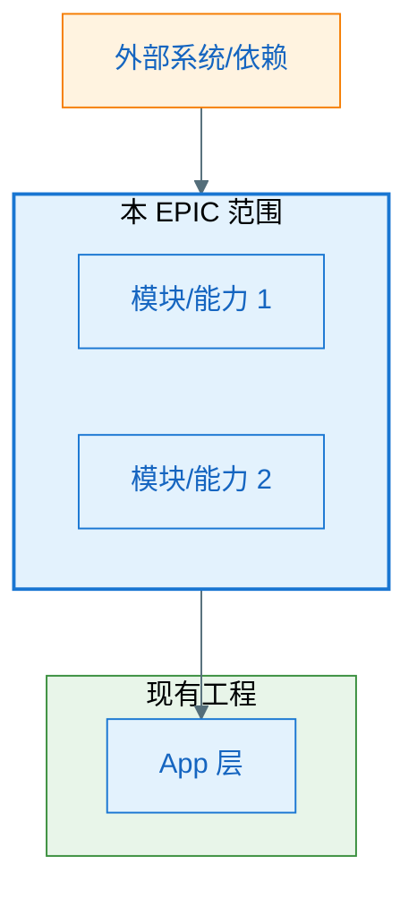
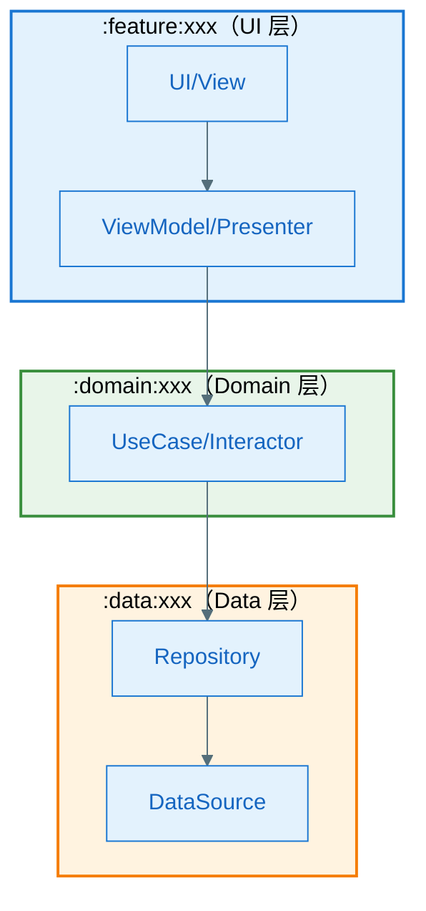
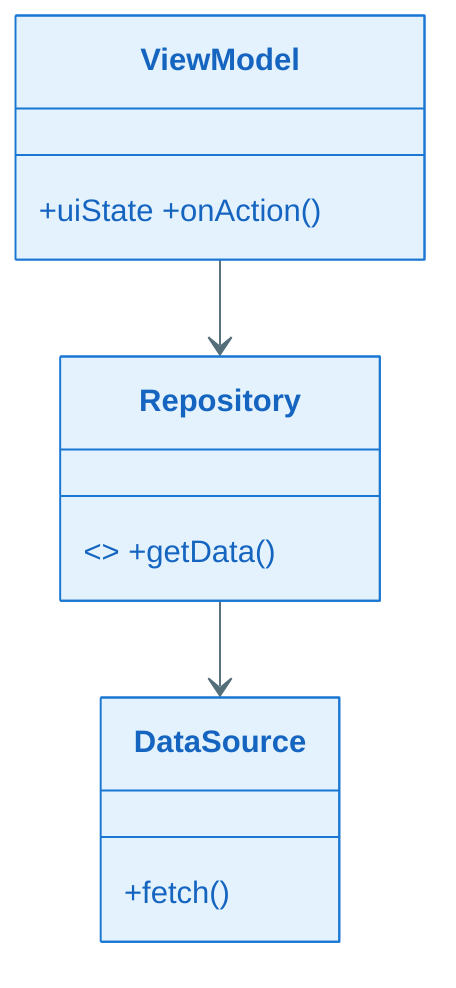
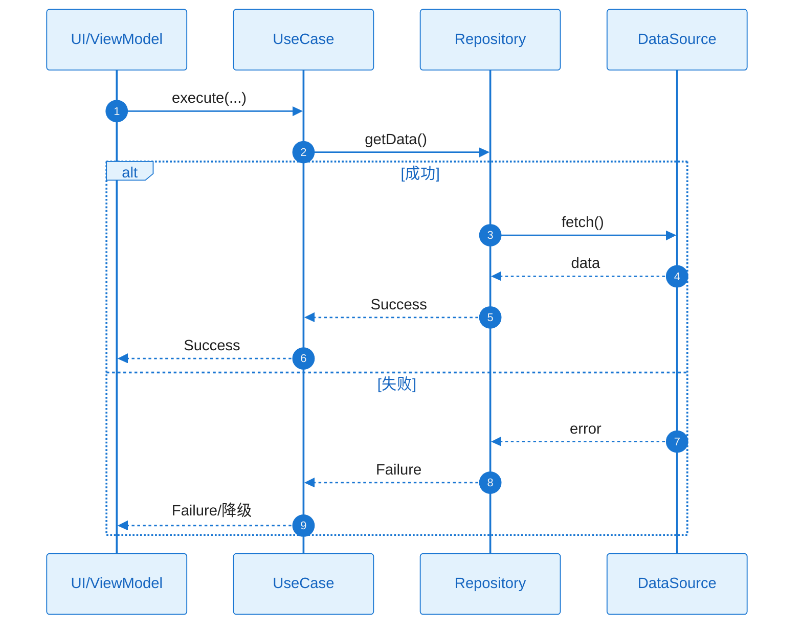
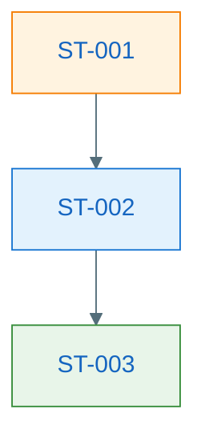

# EPIC 软件设计说明书：EPIC-[编号] - [EPIC 名称]

> **定位**：EPIC 需求级别的技术设计方案，面向人类评审与后续 Task 拆解、Implement 阶段的 AI 编码参考。与各 Feature 的 `plan.md`（技术规约）共同约束 tasks.md 与代码实现。
>
> **输入**：`epic.md`、`epic-plan.md`、各 `features/*/spec.md`、各 `features/*/plan.md`、现有工程代码
>
> **图表规范**：样式遵循 `.cursor/rules/mermaid-style-guide.mdc`；内容与结构须基于本工程实际架构与真实代码，遵循 `.cursor/rules/specify-diagram-requirements.mdc`。

**Epic**：EPIC-[编号] - [名称]
**Epic Version**：v0.1.0（来自 `epic.md`）
**设计说明书 Version**：v0.1.0
**创建/更新日期**：[YYYY-MM-DD]

---

## 变更记录（增量变更）

| 版本 | 日期 | 变更范围 | 变更摘要 | 影响 Feature/Story |
|------|------|----------|----------|-------------------|
| v0.1.0 | [YYYY-MM-DD] | 初始 | 初版 | — |

---

## 一、0 层架构（EPIC 与外部/现有工程边界）

> **目的**：一张图展示本 EPIC 在整体系统中的位置、与外部的关系、内部主要子系统或模块。

### 1.1 边界说明

- **EPIC 范围**：[本 EPIC 与上游/下游系统、现有 App 模块的边界；哪些在 EPIC 内、哪些复用现有]
- **主要子系统/模块**：[高层模块或能力块列表，可与 Feature 或跨 Feature 能力对应]

### 1.2 0 层架构图（必须）

### 1.3 外部依赖清单（若有则必填）

| 依赖项 | 类型 | 提供方 | 提供的能力 | 通信方式 | 故障模式 | 我方策略 |
|--------|------|--------|-----------|----------|----------|----------|
| [示例] | 内部服务/OS/SDK | [团队/系统] | [能力] | HTTPS/系统 API | 超时/不可用 | 重试+降级 |

---

## 二、1 层架构（分层与模块职责）

> **目的**：明确 EPIC 内各层/模块的职责与依赖方向，与现有代码分层衔接。

### 2.1 分层说明

- **分层**：[表示层 / 领域层 / 数据层 或本项目实际分层；与现有工程对应关系]
- **模块职责**：[各模块职责一句话；哪些由哪个 Feature Owner 设计见 epic.md「跨 Feature 技术策略」]

### 2.2 1 层架构图（必须）

> 须在图上明确标注所属的代码工程模块名称（如 `:feature:xxx`、`:core:data`）。静态依赖用实线箭头，动态协作用虚线箭头。

### 2.3 组件清单与职责（必须）

| 组件 | 所属模块 | 职责（一句话） | 输入/输出 | 依赖 | 约束 |
|------|----------|----------------|-----------|------|------|
| [组件A] | `:module:xxx` | [做什么] | [输入→输出] | [依赖哪些组件/外部] | [线程/生命周期/并发约束] |

---

## 三、关键功能与疑难功能设计

> **适用**：仅纳入技术方案上的疑难点（易踩坑、需专项论证）或亮点（最佳实践/创新点）。简单、显而易见的设计不纳入。

### 3.1 疑难点/亮点 1：[设计点名称]

- **类型**：疑难点 | 方案亮点
- **背景/亮点说明**：[为何是疑难点或亮点，涉及哪些组件，易出现哪些坑或可复用价值]
- **核心方案**：[如何解决 / 设计要点、关键约束、取舍理由]
- **边界条件与注意事项**：[关键边界、异常、并发/生命周期等]

### 3.2 疑难点/亮点 2：[设计点名称]

（结构同上）

---

## 四、全景类图与关键时序（Feature 级）

> **目的**：从 EPIC 或主 Feature 纵览关键类/接口关系与主流程时序，便于评审与 Task 引用。须基于本工程实际架构与真实代码。

### 4.1 全景类图（必须）

> 须覆盖所有关键类/接口及方法签名；依赖方向正确（上层依赖下层）。参见 `.cursor/rules/specify-diagram-requirements.mdc`。

**关键类职责说明**：

| 类/接口 | 层级 | 职责 | 关键方法 |
|---------|------|------|----------|
| [类名] | UI/Domain/Data | [做什么] | [方法]：用途 |

### 4.2 关键时序图（必须：主流程 + 关键异常）

> 每个关键流程 1 张时序图，覆盖正常 + 关键异常（alt/else）。participant 使用真实类名。

###### 流程 1：[流程名称]

---

## 五、Story 拆解

> **说明**：Story 从技术视角拆分 EPIC/Feature，服务于并行开发、提交原子性与避免冲突。Task 在 tasks.md 中拆解，须引用本设计说明书及（若存在）story_detail_design.md。

### 5.1 拆分规则（摘要）

- Story 类型：**Functional** / **Design-Enabler** / **Infrastructure** / **Optimization**
- 单个 Story 预估工作量 **≤ 10 人天**，建议 3–8 人天
- 依赖关系须清晰、无环；可并行的须标注

### 5.2 Story 列表

#### ST-001：[标题]

- **类型**：Functional / Design-Enabler / Infrastructure / Optimization
- **描述**：[做什么、为什么]
- **目标**：[可验证的结果]
- **预估工作量**：[X 人天]
- **覆盖 FR/NFR**：FR-???；NFR-???
- **依赖**：[其他 Story / 无]
- **可并行**：是/否
- **验收/验证方式（高层）**：[如何判断完成]
- **交付物**：[代码/文档/配置]

#### ST-002：[标题]

（同上结构）

### 5.3 Story 依赖关系图（推荐）

### 5.4 Feature → Story 覆盖矩阵

| FR/NFR ID | 覆盖的 Story ID | 备注 |
|-----------|-----------------|------|
| FR-001 | ST-001, ST-003 | 主流程 |
| NFR-PERF-001 | ST-004 | 性能 |

---

## 六、二层 Story 详细设计（L2）索引

> **规则**：L2 详细设计**统一写在各 Feature 目录下的 `story_detail_design.md`** 中（模板见 `.specify/templates/story_detail_design_template.md`），本节仅保留索引表。这样做的目的是：避免设计说明书过于庞大、支持 Feature 级独立评审、便于 tasks/implement 阶段精准引用。
>
> tasks.md 的每个 Task 须明确引用 `story_detail_design.md:ST-xxx:功能设计:类图/时序图`。

### 6.1 L2 设计索引表

| Story ID | 标题 | 所属 Feature | L2 设计位置 | 状态 |
|----------|------|-------------|-------------|------|
| ST-001 | [标题] | FEAT-xxx | `features/FEAT-xxx-.../story_detail_design.md:ST-001` | 待设计/已完成 |
| ST-002 | [标题] | FEAT-xxx | `features/FEAT-xxx-.../story_detail_design.md:ST-002` | 待设计/已完成 |

### 6.2 L2 覆盖度检查

- [ ] 所有 §5 Story 拆解中的 ST-xxx 在索引表中有对应条目
- [ ] 所有 L2 设计状态为「已完成」（design-ready 关卡前置条件）

---

## 附录：设计说明书与 plan/tasks 的对应关系

| 本设计说明书章节 | plan.md 引用 | tasks.md 设计引用 |
|------------------|--------------|---------------------|
| 一、0 层架构 | §一 一致性互校 | 阶段/边界参考 |
| 二、1 层架构 | §三 架构约束 | 模块/组件参考 |
| 四、全景类图/时序 | §三/§五 | 具体 Task 引用 §4 或 §6.x |
| 五、Story 拆解 | Story 索引表 | 每个 Task 绑定 ST-xxx |
| 六、L2 索引 → story_detail_design.md | — | 设计引用：story_detail_design.md:ST-xxx:功能设计:类图/时序图 |
