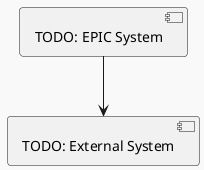
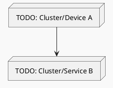
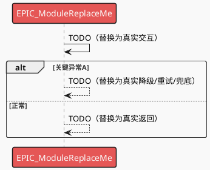
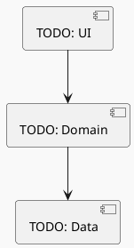
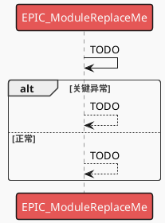

# EPIC Full Design：[EPIC 名称]

**EPIC ID**：EPIC-[编号]
**EPIC Version**：v0.1.0
**EPIC Full Design Version**：v0.1.0
**日期**：[YYYY-MM-DD]

**输入工件**：
- `specs/epics/<EPIC-xxx-...>/epic.md`（EPIC 总览）
- 各 Feature 的 `spec.md` / `plan.md` / `tasks.md` / `full-design.md`（按实际存在）

> Agent 规则（强制）：
> - 本文档只做**跨 Feature 的整合与一致性呈现**，不得新增新的技术决策。
> - 若发现冲突或缺口，只能标注 `TODO(Clarify)` 并指向应修改的 Feature/Plan。

## 变更记录（增量变更）

| 版本 | 日期 | 变更摘要 | 影响 Feature | 是否需要回滚设计 |
|---|---|---|---|---|
| v0.1.0 | [YYYY-MM-DD] | 初始版本 |  | 否 |

## 1. EPIC 总览（来自 epic.md）

- **背景/目标/价值**：
- **范围 In/Out**：
- **约束与假设**：
- **整体 FR/NFR（EPIC Level）**：
- **通用能力（Capability）**：

## 2. 0 层架构设计（EPIC 级：对外系统边界、部署、通信、交互）

> 定义：0 层架构设计反映“本系统与外部系统之间的关系”。在 EPIC 级别，本节用于跨 Feature 汇总对外边界、部署拓扑、通信与交互方式，并显式暴露差异与冲突。
>
> 说明：基于各 Feature 的 `plan.md` 进行汇总；若存在差异必须显式指出来源差异，不得强行统一。

### 2.1 外部系统与依赖汇总（跨 Feature）

| 外部系统/依赖 | 类型 | 涉及 Feature | 通信方式（协议/鉴权） | SLA/限流/超时 | 故障模式 | 我方策略 | 差异/冲突点（如有） | 引用来源 |
|---|---|---|---|---|---|---|---|---|
|  |  |  |  |  |  |  |  | FEAT-xxx plan.md:A2.1 |

### 2.2 0 层架构图（EPIC 级视图）

### 2.3 部署视图（EPIC 级视图）

### 2.4 通信与交互方式汇总（跨 Feature）

- **协议**：REST / gRPC / WebSocket / MQ / 文件 / 设备能力（按实际汇总）
- **鉴权**：OAuth2 / JWT / mTLS / API Key（按实际汇总）
- **超时与重试**：阈值与退避策略（标注差异与来源）
- **幂等**：幂等键/语义（标注差异与来源）
- **限流**：外部限流与我方退避/降级（标注差异与来源）
- **一致性与补偿**：强一致/最终一致、补偿策略（标注差异与来源）

## 3. 1 层架构设计一致性（跨 Feature：框架图、模块拆分、接口协议）

> 定义：1 层架构设计描述“系统内部的模块拆分与协作”。在 EPIC 级别，本节用于汇总各 Feature 的 1 层框架与关键模块设计，并显式标注不一致之处与对齐建议（不新增决策）。

### 3.0 EPIC 模块目录（EPIC Module Catalog）与映射关系（跨 Feature，核心）

> 目标：从 EPIC 视角定义“模块/能力”的全局目录，并把它与各 Feature 的模块拆分建立明确映射，支持端到端一致性评审。
>
> 概念区分（必须遵守）：
> - **Feature 模块/组件**：来自各 Feature 的 `plan.md:A3.1 组件清单与职责`（实现落码视角，目录权威）。
> - **EPIC 模块**：EPIC 级别的能力/子系统视角，用于跨 Feature 对齐边界与契约；通常由多个 Feature 模块**归并/抽象**而来。
>
> 规则：
> - 本节只做“汇总、归并、映射、暴露差异”，不得新增技术决策；若归并规则存在争议，标注 `TODO(Clarify)` 并指向应修改的 Feature plan。
> - 所有引用必须指向来源 Feature 的 `plan.md`（优先：A3.1/A3.4/B4）或 `contracts/` 工件。

#### 3.0.1 EPIC 模块目录（Catalog）

| EPIC 模块 | 职责边界（一句话） | 涉及 Feature | 提供的接口/契约（引用） | 依赖的接口/契约（引用） | NFR 责任（性能/功耗/内存/安全/可观测性/可靠性） | 差异/冲突点（如有） | 引用来源 |
|---|---|---|---|---|---|---|---|
| [EPIC 模块A] |  | FEAT-xxx, FEAT-yyy | FEAT-xxx plan.md:B4.1 / contracts/ | FEAT-yyy plan.md:B4.2 | PERF/POWER/MEM/SEC/OBS/REL |  | epic.md + FEAT-xxx plan |

#### 3.0.2 EPIC 模块 ↔ Feature 模块映射（Module Mapping）

> 要求：将每个 Feature 的 `A3.1` 组件/模块**逐行映射**到某个 EPIC 模块；若无法映射，必须标注原因与 `TODO(Clarify)`。

| EPIC 模块 | 来源 Feature | Feature 模块/组件（来自 FEAT plan.md:A3.1） | 关系类型（Owned-by/Consumed-by/Adapter/Shared） | 引用来源（A3.1/A3.4/B4） | 备注/差异 |
|---|---|---|---|---|---|
| [EPIC 模块A] | FEAT-xxx | [模块名] | Owned-by | FEAT-xxx plan.md:A3.1 / A3.4 |  |

#### 3.0.3 EPIC 模块级 UML 总览（全局查看入口，只引用 Feature Plan）

> 目标：从 EPIC 角度“一页看全”各 EPIC 模块的 UML 视图入口（类图 + 全景时序：同图含正常+异常）。
>
> 规则：EPIC Full Design 不复制粘贴各 Feature 的模块 UML 图；只提供索引入口，图的权威内容在各 Feature `plan.md:A3.4`。

| EPIC 模块 | 类图入口（引用） | 时序图入口（同图含正常+异常，引用） | 关键异常（摘要） | 涉及 Feature |
|---|---|---|---|---|---|
| [EPIC 模块A] | FEAT-xxx plan.md:A3.4:[模块X]:UML类图 | FEAT-xxx plan.md:A3.4:[模块X]:时序图（全景） |  | FEAT-xxx, FEAT-yyy |

#### 3.0.4 EPIC 模块级 UML（EPIC 视角一致性视图，建议）

> 目标：从 EPIC 角度给出“模块/能力”的整体静态/动态视图，便于端到端一致性评审。
>
> 规则（严格）：
> - 本节是**一致性视图**：必须完全基于 3.0.1/3.0.2 的 Catalog/Mapping 与各 Feature 的 plan/契约工件推导；不得引入新的模块边界决策。
> - 若无法从现有 Feature 工件推导出该视图（例如契约缺失/边界不清），必须标注 `TODO(Clarify)` 并指向应补齐的 Feature plan（优先：A3.1/A3.4/B4）。
> - 视图粒度：只画**模块边界/接口契约/关键数据流**，不下沉到 Feature 内部实现类细节（那属于各 Feature 的 plan.md）。

##### EPIC 模块级类图（静态视图）

```plantuml
@startuml
!theme mars

' TODO: 以 EPIC 模块为中心画边界与契约（接口/数据），不画实现细节
' 若存在冲突，标注 TODO(Clarify) 并指向来源 Feature plan
' 注意：落地时替换/删除占位
class EPIC_ModuleReplaceMe {
  + contract: String
  + invoke(input): Output
}

@enduml
```

##### EPIC 端到端时序图（同图含正常+异常，动态视图）

### 3.1 1 层框架图（EPIC 级一致性视图）

### 3.2 模块与接口协议一致性问题（汇总）

| 模块/能力 | 涉及 Feature | 接口/协议/契约（引用） | 版本/兼容策略 | 不一致点 | 风险 | 处理建议（指向应修改的 Feature/Plan） |
|---|---|---|---|---|---|---|
|  |  |  |  |  |  |  |

### 3.3 关键模块设计汇总（跨 Feature）

| 关键模块 | 涉及 Feature | 设计要点（引用来源） | 策略/取舍（引用来源） | NFR 责任（性能/功耗/内存/安全/可观测性） | 风险 |
|---|---|---|---|---|---|
|  |  |  |  |  |  |

### 3.3.1 关键模块设计（EPIC 模块级：思想/决策/原理 + 模块全景类图 + 模块时序图 + 关键流程）

> 目标：在 EPIC 视角下，把“关键模块/能力”的设计说明写到可评审、可对齐的粒度。
>
> **必须包含（不可省略）**：
> - **模块设计思想 / 关键设计决策 / 原理说明**（边界、契约、依赖方向、可演进性）
> - **模块全景类图（EPIC 模块级）**：以“模块边界与契约（接口/数据）”为中心，不下沉到 Feature 内部实现类
> - **模块时序图（EPIC 模块级）**：同一张图覆盖正常 + 全部关键异常（用 `alt/else`）；不得拆分成功/异常两张图
> - **关键流程（EPIC 模块视角）**：可包含多个；每个流程必须同图覆盖正常 + 全部关键异常分支，并标注跨 Feature 边界点
>
> 规则：EPIC Full Design **不得新增决策**；若无法从现有 Feature 工件推导，必须写 `TODO(Clarify)` 并指向应补齐的 Feature/Plan（优先：各 Feature 的 `plan.md:A3.1/A3.2/A3.3.1/A3.3.2/A3.4` 与 `contracts/`）。

#### EPIC 模块：[模块名]

- **模块定位/边界**：
- **模块设计思想**：TODO(Clarify): 引用 FEAT-xxx plan/full-design...
- **关键设计决策**：TODO(Clarify): 引用 FEAT-xxx plan/full-design...
- **原理/机制说明**：TODO(Clarify): 引用 FEAT-xxx plan/full-design...
- **提供的接口/契约**：引用 `plan.md:B4.1` / `contracts/`
- **依赖的接口/契约**：引用 `plan.md:B4.2` / `contracts/`
- **失败与降级策略**：跨 Feature 一致性差异需显式标注
- **可观测性信号**：关键日志/埋点/指标（引用来源）
- **NFR 责任与预算**：PERF/POWER/MEM/SEC/OBS/REL（引用来源）

##### 模块全景类图（EPIC 模块级，必须）

##### 模块时序图（同图含正常+异常，必须）

##### 模块关键流程（必须：可多个；每个流程同图含正常+异常）

```plantuml
@startuml
!theme mars

' TODO: EPIC 模块视角关键流程（同图含正常+异常），标注跨 Feature 边界点与外部依赖
start
:Start;
stop

@enduml
```

### 3.4 数据模型与存储/契约一致性（跨 Feature）（汇总）

> 目的：把“数据模型/表结构/存储键结构”和“接口契约（对外提供/对外依赖）”在 EPIC 级做一致性检查，避免各 Feature 各写各的导致联调与迁移风险。
>
> 规则：只汇总与指出差异；任何对齐决策必须回到对应 Feature 的 plan/spec 里修改。

#### 3.4.1 数据模型/存储一致性问题

| 数据实体/表/存储键 | 涉及 Feature | 物理结构与约束（引用） | 版本/迁移策略（引用） | 不一致点 | 风险 | 处理建议（指向应修改的 Feature/Plan） |
|---|---|---|---|---|---|---|
|  |  |  |  |  |  |  |

#### 3.4.2 对外提供接口（Capability/跨模块接口）一致性问题

| 能力/接口 | 提供方 Feature | 调用方 Feature | 契约工件（plan.md B4.1 / contracts/ 引用） | 版本/兼容策略 | 不一致点 | 风险 |
|---|---|---|---|---|---|---|
|  |  |  |  |  |  |  |

#### 3.4.3 外部依赖接口（依赖契约）一致性问题

| 依赖项 | 涉及 Feature | 调用级契约（plan.md B4.2 引用） | 超时/重试/限流策略 | 故障模式与降级策略 | 不一致点 | 风险 |
|---|---|---|---|---|---|---|
|  |  |  |  |  |  |  |

## 4. 关键流程设计（EPIC 级：端到端流程，每个流程一张流程图，含正常 + 全部异常）

> 定义：在 EPIC 级别，关键流程应覆盖跨 Feature 的端到端用户旅程/系统链路（例如登录→鉴权→下单→支付→回调→通知）。
>
> 要求：
> - 每个关键流程必须用 PlantUML 活动图（Activity Diagram）绘制，且同一张图内覆盖正常流程与全部关键异常分支（失败/超时/限流/并发/生命周期等）。
> - 流程图中必须标注“跨 Feature 边界点”（哪些步骤属于哪个 Feature/模块），并引用来源（对应 Feature 的 plan/full-design）。
> - 若不同 Feature 的流程定义不一致，必须显式标注差异，并用 `TODO(Clarify)` 指向应修改的 Feature/Plan。

### 流程 1：[流程名称]

### 流程 2：[流程名称]

## 5. Feature → Story → Task 汇总追溯

### 5.1 Feature 列表与状态（来自 epic.md Feature Registry）

| Feature | 分支 | Feature Version | Plan Version | Tasks Version | 状态 |
|---|---|---|---|---|---|
|  |  |  |  |  |  |

### 5.2 Story 汇总（跨 Feature）

| Feature | Story ID | 类型 | 目标 | 覆盖 FR/NFR | 依赖 | 关键风险 |
|---|---|---|---|---|---|---|
|  | ST-001 |  |  |  |  |  |

### 5.3 追溯矩阵（EPIC-FR/NFR → Feature-FR/NFR → Story → Task）

| EPIC FR/NFR | Feature | Feature FR/NFR | Story | Task | 验证方式 | 备注 |
|---|---|---|---|---|---|---|
| EPIC-NFR-PERF-001 |  | NFR-PERF-001 | ST-??? | T??? |  |  |

## 6. 跨 Feature 通用能力设计（来自 epic.md + 各 Feature plan）

| 能力 | 设计要点（引用来源） | 关键接口/契约（引用来源） | 风险 | 影响 Feature |
|---|---|---|---|---|
|  |  |  |  |  |

### 6.0 常见 Capability Feature 汇总（建议）

> 说明：当 EPIC 存在横切能力（埋点/动效/算法）时，建议将其作为 Capability Feature 独立交付，并在 EPIC Full Design 中汇总其“交付物与接入契约”，以便业务 Feature 对齐接入方式与验收口径。

#### 6.1 埋点与可观测性（产品埋点 + 技术埋点）

| Capability Feature | 事件/指标范围 | 字段口径/隐私策略 | 接入方式（SDK/API） | 版本/兼容策略 | 影响的业务 Feature | 引用来源 |
|---|---|---|---|---|---|---|
| FEAT-??? |  |  |  |  |  | epic.md + FEAT-??? plan/full-design |

#### 6.2 动效与交互组件库

| Capability Feature | 资产/组件范围 | 性能预算与验收 | 接入方式（组件/API） | 兼容策略 | 影响的业务 Feature | 引用来源 |
|---|---|---|---|---|---|---|
| FEAT-??? |  |  |  |  |  | epic.md + FEAT-??? plan/full-design |

#### 6.3 算法能力（每模型/每能力一个 Feature）

| Capability Feature | 模型/能力 | 推理部署（端侧/服务端） | SDK/API 契约 | 评估指标与监控 | 回退/降级策略 | 影响的业务 Feature | 引用来源 |
|---|---|---|---|---|---|---|---|
| FEAT-??? |  |  |  |  |  |  | epic.md + FEAT-??? plan/full-design |

## 7. 风险与一致性问题（汇总）

- **跨 Feature 冲突**：TODO(Clarify)
- **接口/数据模型不一致**：TODO(Clarify)
- **NFR 预算冲突（性能/功耗/内存）**：TODO(Clarify)

## 8. 执行指引（不新增 Task）

- 每个 Feature 按各自 `tasks.md` 执行
- 任何跨 Feature 变更必须先更新对应 Feature 的 plan/spec，并运行 `/speckit.epicsync` 更新总览

