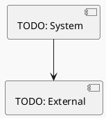
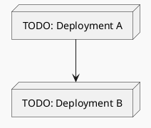
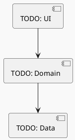
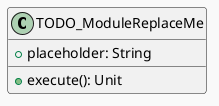
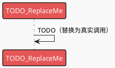
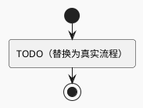

# Full Design：[Feature 名称]

**Epic**：EPIC-[编号] - [名称]
**Feature ID**：FEAT-[编号或沿用分支号，例如 001]
**Feature Version**：v0.1.0
**Plan Version**：v0.1.0
**Tasks Version**：v0.1.0（若 tasks.md 尚未生成，标注为 N/A）
**Full Design Version**：v0.1.0

**分支**：`[###-feature-short-name]`
**日期**：[YYYY-MM-DD]
**输入工件**：
- `spec.md`
- `plan.md`
- `tasks.md`（可选）
- `research.md` / `data-model.md` / `contracts/` / `quickstart.md`（按实际存在）

> Agent 规则（强制）：
> - 本文档**只能整合现有产物**（spec/plan/tasks 等），**不得新增技术决策**。
> - 若遇到决策缺口，只能标注为 `TODO(Clarify): ...` 并指向应补齐的来源文档/章节。
> - 本文档用于评审与执行：层次必须清晰、结构化、可追溯。

## 变更记录（增量变更）

| 版本 | 日期 | 变更范围（Feature/Story/Task） | 变更摘要 | 影响模块 | 是否需要回滚设计 |
|---|---|---|---|---|---|
| v0.1.0 | [YYYY-MM-DD] | Feature | 初始版本 |  | 否 |

## 1. 背景与范围（来自 spec.md）

- **背景**：
- **目标**：
- **价值**：
- **In Scope**：
- **Out of Scope**：
- **依赖关系**：

## 2. 领域概念（Domain Concepts / Glossary）（来自 plan.md，必须）

> 目的：统一命名与语义口径，成为后续“架构图/流程图/类图/时序图/接口契约”的命名权威。
>
> 规则：只允许整合 `plan.md:Plan-A:A0` 的内容；不得新增概念或修改定义。缺口请用 `TODO(Clarify)` 指回 plan。

- **词汇表入口**：`plan.md:Plan-A:A0.1`
- **概念关系图入口（如有）**：`plan.md:Plan-A:A0.2`

## 3. 0 层架构设计（对外系统边界、部署、通信、交互）（来自 plan.md）

> 定义：0 层架构设计反映“本系统与外部系统之间的关系”。必须覆盖：结构、部署、通信方式、交互方式与边界。
>
> 规则：本节只允许**复用/整合** `plan.md` 中已经明确的内容；不得新增技术决策。若 plan 缺失，用 `TODO(Clarify)` 指回 plan 对应章节补齐。

### 3.1 外部系统与依赖清单（来自 plan.md）

| 外部系统/依赖 | 类型 | 关键能力/数据 | 通信方式（协议/鉴权） | SLA/限流/超时 | 故障模式 | 我方策略 | 引用来源 |
|---|---|---|---|---|---|---|---|
|  |  |  |  |  |  |  | plan.md:A2.1 |

### 3.2 0 层架构图（系统边界 + 外部交互）（来自 plan.md）

### 3.3 部署视图（来自 plan.md）

### 3.4 通信与交互说明（来自 plan.md）

- **协议**：
- **鉴权**：
- **超时与重试**：
- **幂等**：
- **限流**：
- **数据一致性**：

## 4. 1 层架构设计（系统内部框架图 + 模块拆分 + 接口协议）（来自 plan.md）

> 定义：1 层架构设计描述“系统内部的模块拆分与协作”，包括框架图、模块职责、模块交互、通信方式、接口协议等。
>
> 一致性要求（必须）：
> - `plan.md:Plan-B:B0` 的互校结论必须成立（Plan-A 与 Plan-B 无冲突）
> - 组件/模块目录以 `plan.md:A3.1 组件清单与职责` 为准；Full Design 只能引用/整合，不得新增或改名

### 4.1 1 层框架图（来自 plan.md）

### 4.2 组件/模块拆分与职责（来自 plan.md）

> 来源对齐：以 `plan.md:A3.1 组件清单与职责` 为准（若你的 plan 仍使用“模块”命名，也可沿用，但必须与 plan 表格逐行一致）。

| 组件/模块 | 职责 | 输入/输出 | 依赖 | 约束 |
|---|---|---|---|---|
|  |  |  |  |  |

### 4.3 模块协作与通信方式（来自 plan.md）

- **调用关系**：
- **通信方式**：
- **接口协议**：数据结构、版本策略、错误码、重试/幂等约束（优先引用 plan.md:Plan-B:B4.1/B4.2 与 `contracts/`）
- **并发与线程模型**：

### 4.4 关键模块设计（模块设计思想/决策/原理 + 模块全景类图 + 模块时序图 + 关键流程）（来自 plan.md）

> 说明：本节用于整合 plan 中“关键模块/高风险模块/承载 NFR 的模块”的详细设计与取舍。
>
> **必须包含（不可省略）**：
> - **模块设计思想 / 设计决策 / 原理说明**（为什么这样分层/抽象/依赖）
> - **模块全景类图**：包含该模块所有关键类/接口，且类/接口必须写出成员变量与方法签名
> - **模块全景时序图（同图）**：同一张 PlantUML 时序图中覆盖正常 + 全部关键异常（用 `alt/else`）；不得拆分成功/异常两张图
> - **模块关键流程**：可包含多个流程图；每张流程图必须覆盖正常 + 全部关键异常分支
>
> 规则：本文档不得新增决策；若 plan 缺失，用 `TODO(Clarify)` 指回 plan 对应章节补齐（优先：`plan.md:A3.4` 与 `plan.md:A3.3.1/A3.3.2`）。

#### 模块：[模块名]

- **模块定位**：
- **设计目标**：
- **模块设计思想**：TODO(Clarify): 引用 plan.md:...
- **关键设计决策**：TODO(Clarify): 引用 plan.md:...
- **原理/机制说明**：TODO(Clarify): 引用 plan.md:...
- **核心数据结构/状态**：
- **对外接口（协议）**：
- **策略与算法**：
- **失败与降级**：
- **安全与隐私**：
- **可观测性**：
- **优缺点与替代方案**：

##### 模块全景类图（必须，来自 plan.md）

##### 模块时序图 - 全景（同图含正常+异常，必须，来自 plan.md）

##### 模块关键流程（必须：可多个；每个流程同图含正常+异常）

```plantuml
@startuml
!theme mars

' 直接复用 plan.md 的流程图（同图含正常+异常）；不得新增分支决策
start
:Start;
stop

@enduml
```

### 4.5 数据模型与存储设计（物理）（来自 plan.md）

> 要求：本节用于汇总可落地的“表/键/文件结构 + 迁移策略”，避免仅停留在逻辑实体描述。
> - 若存在 `data-model.md`：在此引用其“物理模型”部分
> - 否则：引用 plan.md:Plan-B:B3.2（表结构/键结构/迁移策略）

### 4.6 模块级 UML 总览（全局查看入口，只引用 plan.md）

> 目标：在 Feature 级 Full Design 中提供“全局视角”入口，方便评审/开发快速浏览每个模块的整体设计。
>
> 规则：
> - 模块/组件清单以 `plan.md:A3.1 组件清单与职责` 为准（行数/名称必须一致）。
> - 本节只做索引与引用，不复制粘贴整张图；模块级 UML 的权威内容在 `plan.md:A3.4`。

| 模块/组件（来自 plan.md:A3.1） | 职责（摘要） | UML 类图入口（plan.md:A3.4） | 时序图入口（同图含正常+异常，plan.md:A3.4） | 流程图入口（同图含正常+异常，plan.md:A3.4） | 关键异常（摘要） | NFR 责任（摘要） |
|---|---|---|---|---|---|---|
| [模块A] |  | plan.md:A3.4:[模块A]:UML类图 | plan.md:A3.4:[模块A]:时序图（全景） | plan.md:A3.4:[模块A]:流程图（全景） |  | PERF/POWER/MEM/SEC/OBS/REL |

### 4.7 模块级 UML（按模块汇总，来自 plan.md）

> 目标：在 Full Design 中直接呈现每个模块的 UML（类图 + 时序图 + 流程图，均要求同图含正常+异常），便于评审与全局浏览。
>
> 规则：
> - 本节内容必须**逐字复用/复制** `plan.md:A3.4` 的模块级 UML；不得新增模块、不得新增新的分支决策。
> - 模块小节顺序必须与 `plan.md:A3.1 组件清单与职责` 一致。
> - 若某个模块在 plan.md 尚未补齐 UML，必须标注 `TODO(Clarify)` 并指回 plan.md 对应模块小节补齐。

#### 模块/组件：[模块名]（来自 plan.md:A3.1）

##### UML 类图（来自 plan.md:A3.4）

##### UML 时序图 - 全景（同图含正常+异常，来自 plan.md:A3.4）

##### UML 流程图 - 全景（同图含正常+异常，来自 plan.md:A3.4）

## 5. 关键流程设计（每个流程一张流程图，含正常 + 全部异常）（来自 plan.md）

> 定义：每个关键流程必须用 PlantUML 活动图（Activity Diagram）绘制，且同一张图内覆盖正常流程与全部关键异常分支（失败/超时/并发/生命周期等）。
> 若 plan 仍为拆分的“正常/异常”两张图，需在 plan 侧对齐后再整合到本节（否则标注 `TODO(Clarify)` 指回 plan）。

### 流程 1：[流程名称]

#### 流程 1 - 异常分支映射（必须，来自 plan.md）

| 分支ID | 对应异常ID（EX-xxx） | 触发条件 | 对策（重试/降级/回滚/补偿） | 用户提示 | 覆盖的 NFR | 引用来源 |
|---|---|---|---|---|---|---|
| BR-001 | EX-001 |  |  |  |  | plan.md:A3.3.2 |

### 流程 2：[流程名称]

## 6. Feature → Story → Task 追溯关系

> 规则：
> - Feature 层：FR/NFR（来自 spec.md）
> - Story 层：ST-xxx（来自 plan.md 的 Story Breakdown）
> - Task 层：Txxx（来自 tasks.md；若缺失则先留空并标注“待生成”）

### 6.1 Story 列表（来自 plan.md）

| Story ID | 类型 | 目标 | 覆盖 FR/NFR | 依赖 | 关键风险 | Story 详细设计入口（来自 plan.md） |
|---|---|---|---|---|---|---|
| ST-001 |  |  |  |  |  | plan.md:Story Detailed Design:ST-001 |

### 6.2 追溯矩阵（FR/NFR → Story → Task）

| FR/NFR ID | Story ID | Task ID | 验证方式（来自 tasks.md） | 备注 |
|---|---|---|---|---|
| FR-001 | ST-001 | T??? | [待 tasks.md] |  |

## 7. 技术风险与消解策略（来自 plan.md）

| 风险ID | 风险描述 | 触发条件 | 影响范围 | 严重度 | 消解策略 | 对应 Story/Task |
|---|---|---|---|---|---|---|
| RISK-001 |  |  |  |  |  |  |

## 8. 异常 & 边界场景梳理（来自 spec.md + plan.md）

- **数据边界**：
- **状态边界**：
- **生命周期**：
- **并发**：
- **用户行为**：

### 8.1 场景 → 应对措施对照（来自 plan.md，推荐）

> 建议直接复用 `plan.md:A5.1` 的“场景→对策表”，确保可执行且可追溯。

- **入口**：`plan.md:A5.1`

## 9. 埋点/可观测性设计（来自 spec.md NFR-OBS + plan.md 约束）

> 注意：只整合既有要求；不要新增指标口径或埋点策略决策。

| 事件/指标 | 触发点 | 字段 | 采样/频率 | 用途 | 关联 FR/NFR |
|---|---|---|---|---|---|
|  |  |  |  |  |  |

## 10. 算法 / 性能 / 功耗 / 内存评估结果（来自 plan.md）

### 算法评估

- **目标**：
- **指标**：
- **验收标准**：
- **测试方法**：

### 性能评估

- **前台**：
- **后台**：
- **阈值与验收**：
- **降级策略**：

### 功耗评估

- **Top5% 用户模型**：
- **预估增量**：
- **验收上限**：
- **降级策略**：

### 内存评估

- **峰值/平均增量**：
- **生命周期**：
- **验收标准**：

## 11. 执行说明（只引用 tasks.md，不新增 Task）

- **执行入口**：`tasks.md`
- **验证入口**：各 Task 的验证清单 + Plan 的验收指标
- **禁止事项**：Implement 期不得修改 Plan 设计；变更走增量变更流程并提升版本

