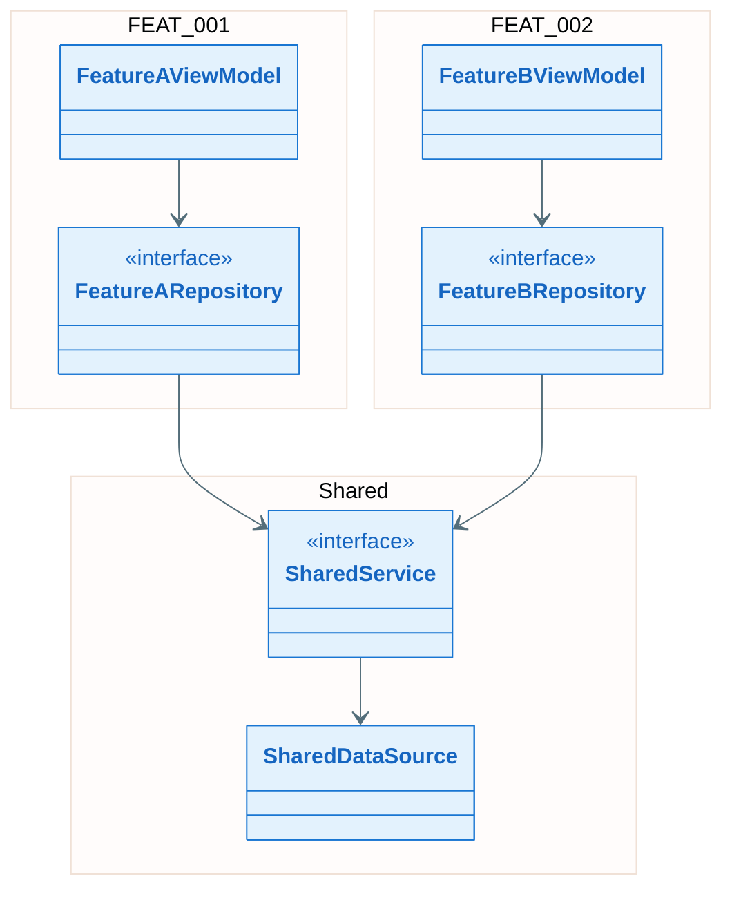
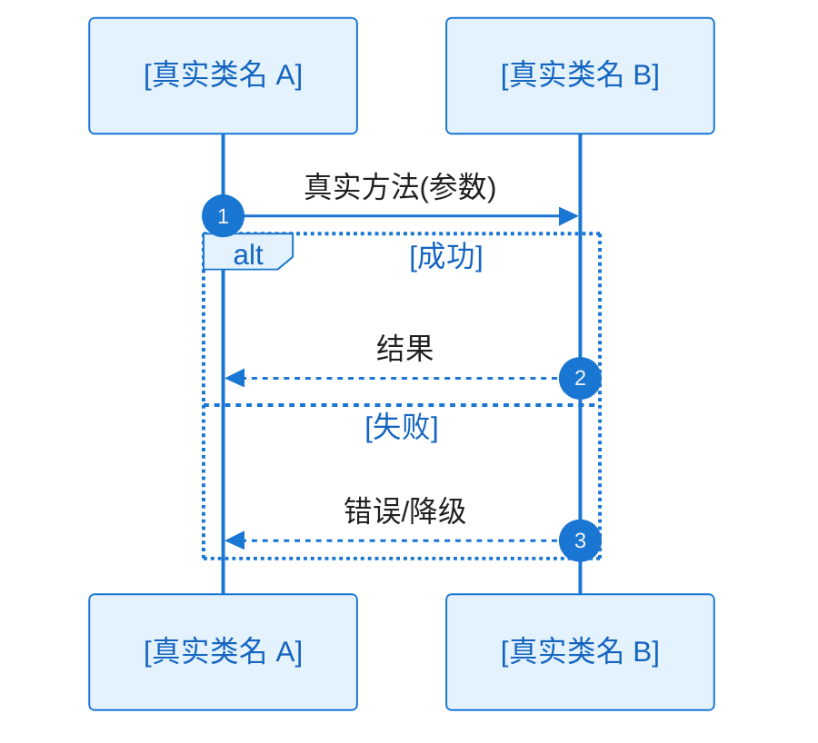

# 全景骨架类图与跨 Feature 时序：EPIC-[编号] - [EPIC 名称]

> **定位**：本文件为 `epic-design.md` §八的 **EPIC 级**部分——全景骨架类图（跨 Feature 依赖关系）+ 可选 **跨 Feature** 完整时序图。各 Feature 的**子类图（全量签名与变更标识）与本 Feature 内完整时序**分别写在 **`features/FEAT-xxx/key-diagram.md`**（模板 `.specify/templates/key-diagram-feature-template.md`）。**不再**使用 EPIC 根目录单一 `key-diagram.md`。
>
> **所属 EPIC**：`epic-design.md` → §八 全景类图与关键流程/时序
>
> **输入**：`key-func-design/KD_*_*.md`、`epic-design.md` §五组件清单、各 `features/FEAT-xxx/key-diagram.md`（产出后用于一致性互校）
>
> **与 L2（`l2_design/`）的区别**：本文件为 EPIC/跨 Feature 结构纵览；Story 级落码细节在各 Feature 的 `l2_design/ST-xxx_*.md`。

**Epic**：EPIC-[编号] - [名称]
**关联文件**：`epic-design.md` | `key-func-design/KD_*_*.md` | 各 `features/*/key-diagram.md`
**创建/更新日期**：[YYYY-MM-DD]

---

## 8.2 全景骨架类图（必须）

> **目的**：从 EPIC 视角展示跨 Feature 的**接口/抽象类**与各 Feature **核心入口类**之间的依赖关系，让评审者一眼理解整体结构。
>
> **粒度约束**：
>
> - **只画**跨 Feature 共享的接口/抽象类 + 每个 Feature 的 1-3 个核心入口类（如 ViewModel、Repository 接口）
> - **不含方法签名**——方法签名在对应 **`features/FEAT-xxx/key-diagram.md`** 子类图中展示
> - 用 `namespace` 或注释标注所属 Feature，便于对照 `epic-design.md` §5.2 组件清单
> - 依赖方向正确（上层依赖下层）

### 骨架类图说明

| 类/接口 | 所属 Feature        | 层级             | 变更     | 职责（一句话） |
| ---- | ----------------- | -------------- | ------ | ------- |
| [类名] | FEAT-xxx / Shared | UI/Domain/Data | 新增/修改/— | [做什么]   |

---

## 8.3 跨 Feature 关键时序图集（可选）

> **何时需要**：当关键业务流程**必须**多个 Feature 的类协作、且不宜拆分到单一 Feature 的 `key-diagram.md` 时，在此绘制跨 Feature 完整时序图。若本 EPIC 无此类流程，本节标注 **N/A** 并一句话说明。
>
> **图后文字说明（必须）**：每张时序图代码块**紧下方**须有「**协作过程**」小节（见 `.cursor/rules/specify-diagram-requirements.mdc` §四）。

### 时序图索引（跨 Feature）

| Seq ID  | 流程名称   | 涉及 Feature | 关联 KD    |
| ------- | ------ | ---------- | -------- |
| SEQ-XF-001 | [流程名称] | FEAT-001, FEAT-002 | KD-xxx / — |

---

### SEQ-XF-001：[跨 Feature 流程名称]

**协作过程**（必须详尽）：

1. [触发与入口]
2. [协作链与职责]
3. [工作过程与数据流]
4. [分支与异常]
5. [结束条件]

---

## 8.4 图表一致性自检（建议）

- `epic-design.md` §5.1 框架图中的组件 **100% 覆盖** §5.2 组件清单
- §5.2 组件清单中的每个组件在本文件 §8.2 骨架类图或**某一** `features/FEAT-xxx/key-diagram.md` 子类图中至少有 1 个对应类/接口
- 本文件 §8.2 骨架类图中的所有类/接口在对应 Feature 的 `key-diagram.md` 中有**含字段与方法签名**的完整定义（若只属于单一 Feature，则仅在该 Feature 文件中定义即可）
- 各 `features/FEAT-xxx/key-diagram.md` 中：本 EPIC 新增的类/接口均有 `<<新增>>` 标注 + 绿色样式；有改动的类/接口均有 `<<修改>>` 标注 + 橙色样式
- 跨 Feature 时序（§8.3）中的 participant 在 §8.2 骨架类图或对应 Feature 子类图中有对应类/接口
- 每张时序图**紧下方**均有**详细**「协作过程」文字说明
