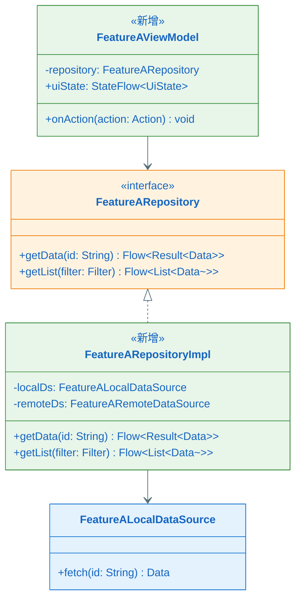
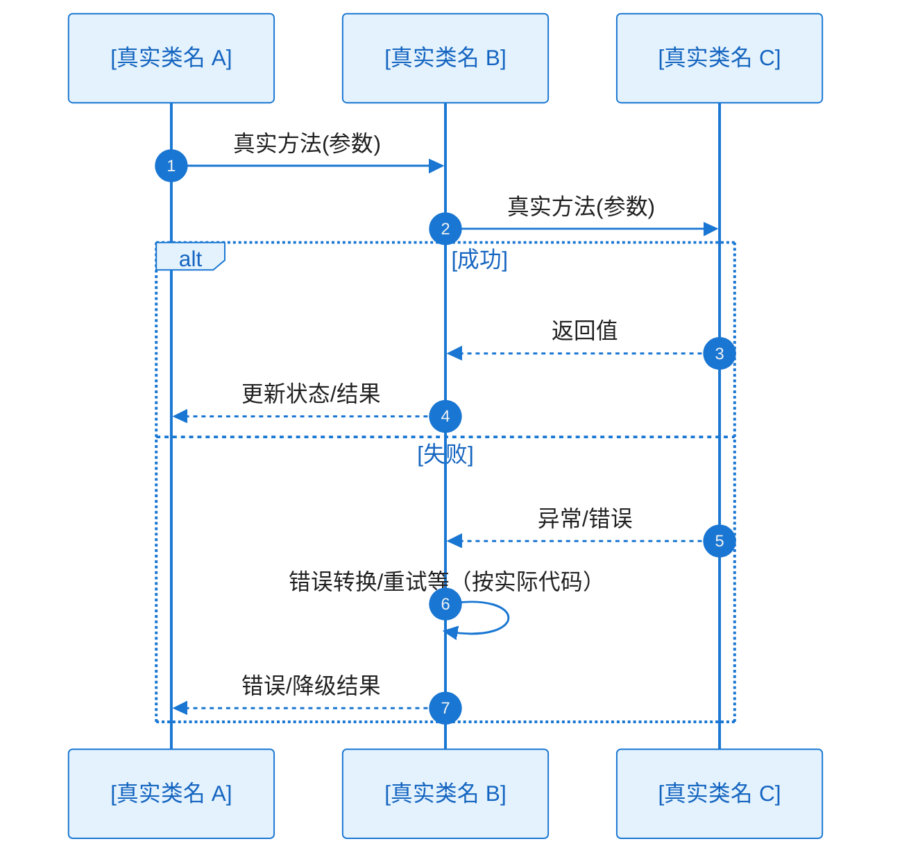

# 全景类图与关键时序：FEAT-[编号] - [Feature 名称]

> **定位**：本文件对应 `epic-design.md` §八中 **本 Feature** 的图表条目。在 §七（各 KD）确认方案可行后，在此将本 Feature 的设计**精确化到可编码级别**——**子类图**（全量公共 API、字段与方法签名、变更标识）+ **本 Feature 内完整时序图**（穷举关键流程的全部分支）。EPIC 级全景骨架与跨 Feature 时序见 EPIC 根目录 [`key-diagram-epic.md`](../../key-diagram-epic.md)。
>
> **输入**：`key-func-design/KD_*_*.md`（与本 Feature 相关的 KD）、`epic-design.md` §五组件清单、`key-diagram-epic.md` §8.2
>
> **与 L2（story_detail_design.md）的区别**：本文件为 **Feature 级**全貌；Story 级落码细节在 `story_detail_design.md`。

**Epic**：EPIC-[编号] - [名称]
**Feature**：FEAT-[编号] - [名称]
**关联文件**：[`epic-design.md`](../../epic-design.md) | [`key-diagram-epic.md`](../../key-diagram-epic.md) | `key-func-design/KD_*_*.md`
**创建/更新日期**：[YYYY-MM-DD]

---

## 子类图（必须）

> 本 Feature 的所有关键类/接口，须写清：
>
> - **字段**：所有公共字段（属性），含完整类型（如 `+userId: String`、`+items: List~Item~`）
> - **方法**：所有公共方法的完整签名（方法名 + 参数类型 + 返回值类型）
> - **变更标识**（必须）：
>   - 本 EPIC 中**新增**的类/接口：在类中添加 `<<新增>>` 标注，并使用绿色样式 `style ClassName fill:#E8F5E9,stroke:#388E3C`
>   - 在现有类/接口上有**改动**（新增/修改字段或方法）的：添加 `<<修改>>` 标注，并使用橙色样式 `style ClassName fill:#FFF3E0,stroke:#F57C00`
>   - 已有类/接口**无改动**（纯引用/依赖）：不加任何标注，使用默认样式
>
> 通过变更标识，评审者一眼可判断本 EPIC 在本 Feature 内的改动边界。

### 关键类职责说明

| 类/接口 | 层级             | 变更     | 职责    | 关键字段/方法      |
| ---- | -------------- | ------ | ----- | ------------ |
| [类名] | UI/Domain/Data | 新增/修改/— | [做什么] | [字段/方法签名]：用途 |

---

## 关键时序图集（完整版，必须）

> **与 §七 关键类图 / 核心时序的区别**：§七 各 KD 中的**核心调用链时序**仅主干 + 关键异常；本节须**精确化 + 穷举全分支**，使可直接指导编码。
>
> **范围**：本 Feature 内挑选 **1-2 个最关键/最复杂的流程**绘制完整时序图。更多时序在 `story_detail_design.md` 中按 Story 粒度补充。**跨多个 Feature 的协作时序**写在 EPIC 根目录 `key-diagram-epic.md` §8.3。
>
> **图后文字说明（必须）**：每张时序图代码块**紧下方**须有「**协作过程**」小节（见 `.cursor/rules/specify-diagram-requirements.mdc` §四）。

### 时序图索引（本 Feature）

| Seq ID  | 流程名称   | 对应逻辑流程 | 覆盖的异常（EX-xxx）  | 关联 KD    |
| ------- | ------ | ---------- | -------------- | -------- |
| SEQ-001 | [流程名称] | 流程 1       | EX-001, EX-002 | KD-xxx / — |

---

### SEQ-001：[流程名称]

> **绘制要求**：participant 为本 Feature 内**真实类名**，消息为**真实方法调用**；从触发端到终点完整无断链；异常分支画出实际代码中的调用链。

**协作过程**（必须详尽，与图中消息一一可对读）：

1. [触发与入口：谁发起、条件、对应 autonumber 起始几步]
2. [逐跳协作：每对 participant 之间的调用目的、参数/返回值语义、与模块职责的关系]
3. [工作过程：中间业务逻辑、状态或数据落点（内存/DB/网络等）]
4. [成功路径：结果如何逐层返回，UI/调用方最终可见行为]
5. [异常路径：alt/else 各分支如何进入、错误如何转换/重试/降级、最终可见结果]

---

## 图表一致性自检（建议）

- 本子类图中的类/接口与 `key-diagram-epic.md` §8.2 中本 Feature 入口一致、无断链
- 所有公共**字段**含类型，所有公共**方法**含完整签名
- §关键时序图中的 participant 均在本子类图中有对应类/接口
- 每张时序图**紧下方**均有**详细**「协作过程」文字说明
