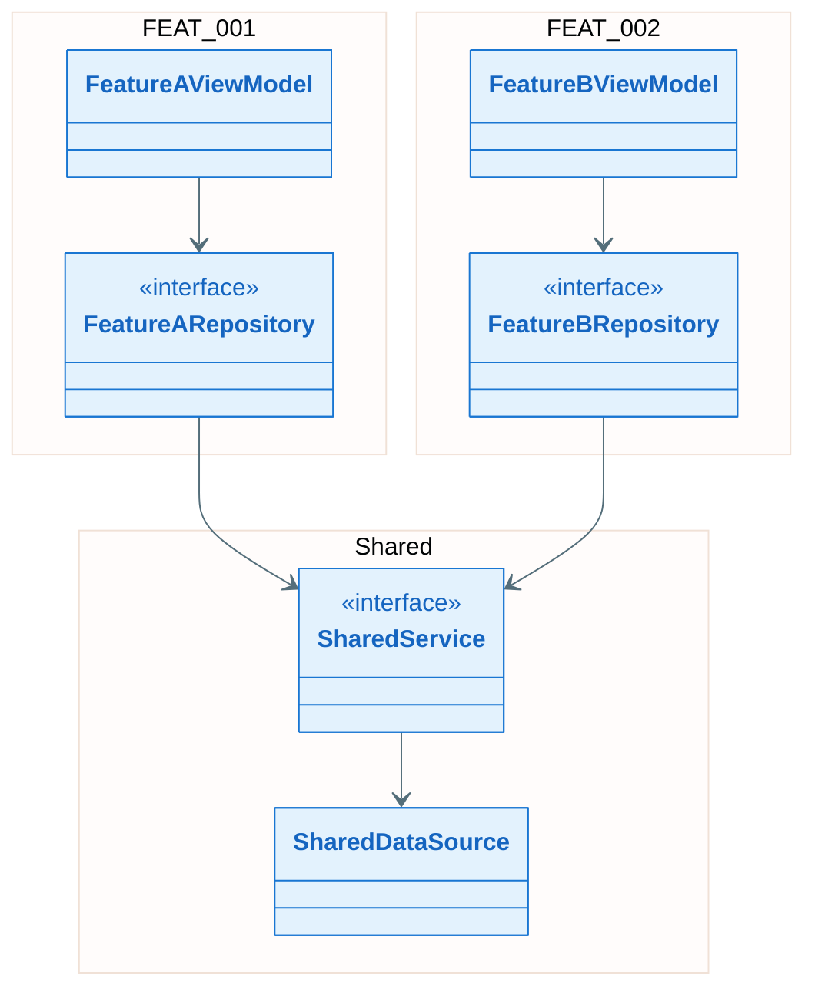
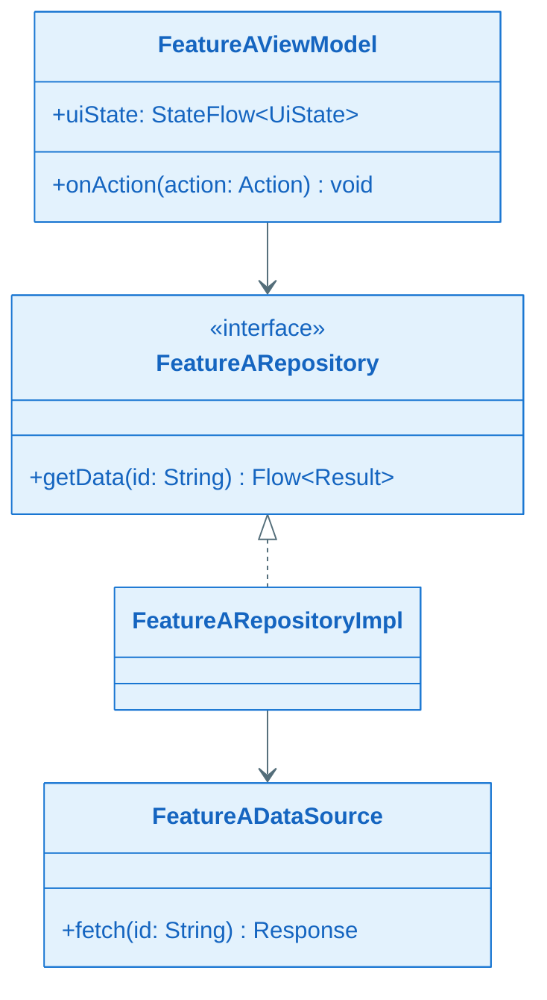
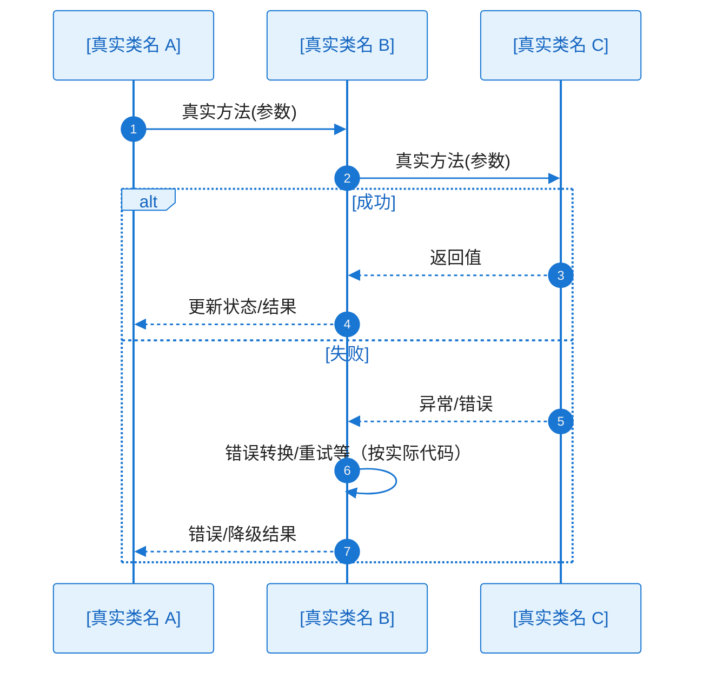

# 全景类图与关键时序：EPIC-[编号] - [EPIC 名称]

> **定位**：本文件对应 `epic-design.md` §七，存放 EPIC/主 Feature 级的**全景类图与关键时序图**，服务于方案评审与 Task 对设计的引用。与 `key-func-design.md` 强关联——流程图中的策略在此落实到类结构和方法调用。
>
> **所属 EPIC**：`epic-design.md` → §七 全景类图与关键流程/时序
>
> **输入**：`key-func-design.md`（关键设计策略已通过 Gate 2 确认）、`epic-design.md` §五组件清单
>
> **与 L2（story_detail_design.md）的区别**：
>
> | 维度     | 本文件（全景级）                                          | story_detail_design.md（Story 级）        |
> | ------ | ------------------------------------------------- | --------------------------------------- |
> | 层级     | EPIC / 主 Feature 级                               | Story 级（按 ST-xxx 分节）                   |
> | 类图/时序图 | 骨架类图（无方法签名）+ Feature 子类图（含方法签名）+ 主流程时序图           | 本 Story 的完整详细类图/时序图                     |
> | 目的     | 评审用整体视图；Task 引用设计所在章节                             | tasks/implement 的详细设计事实源，落码级指导          |
> | 何时必做   | 本文件必须产出                                           | 仅当 Story 技术复杂度高或需落码级指导时补充               |

**Epic**：EPIC-[编号] - [名称]
**关联文件**：`epic-design.md` | `key-func-design.md`
**创建/更新日期**：[YYYY-MM-DD]

---

## 7.2 全景骨架类图（必须）

> **目的**：从 EPIC 视角展示跨 Feature 的**接口/抽象类**与各 Feature **核心入口类**之间的依赖关系，让评审者一眼理解整体结构。
>
> **粒度约束**：
>
> - **只画**跨 Feature 共享的接口/抽象类 + 每个 Feature 的 1-3 个核心入口类（如 ViewModel、Repository 接口）
> - **不含方法签名**——方法签名在 §7.2.x 子类图中展示
> - 用 `namespace` 或注释标注所属 Feature，便于对照 `epic-design.md` §5.2 组件清单
> - 依赖方向正确（上层依赖下层）

### 骨架类图说明

| 类/接口 | 所属 Feature        | 层级             | 职责（一句话） |
| ---- | ----------------- | -------------- | ------- |
| [类名] | FEAT-xxx / Shared | UI/Domain/Data | [做什么]   |

---

## 7.2.1 Feature 子类图：FEAT-001 [Feature 名称]

> 本 Feature 的关键类/接口及**完整方法签名**。粒度：覆盖该 Feature 的所有关键类，公共方法写出完整签名（方法名 + 参数 + 返回值）。

### 关键类职责说明

| 类/接口 | 层级             | 职责    | 关键方法      |
| ---- | -------------- | ----- | --------- |
| [类名] | UI/Domain/Data | [做什么] | [方法签名]：用途 |

---

## 7.2.2 Feature 子类图：FEAT-002 [Feature 名称]

（结构同 7.2.1：类图 + 关键类职责说明表）

---

## 7.3 关键时序图集（方法调用流程，必须）

> **范围**：每个 Feature 仅挑选 **1-2 个最关键/最复杂的流程**绘制时序图，简单流程、常规 CRUD 等不在此列——更多时序图在 `story_detail_design.md` 中按 Story 粒度补充。
>
> **端到端完整性（必须）**：每张时序图须根据**本工程实际架构与真实代码**绘制**完整调用链路**，不得省略关键方法调用。
>
> - **participant 与调用链**：按工程真实分层与类来画，从触发端到最终响应/持久化/网络等真实终点**无断链**
> - **异常分支**：alt/else 中的异常处理路径也须画出**实际代码中的调用链**，不得只写"失败"而缺具体调用
>
> **粒度**：participant 使用**真实类名**，消息使用**真实方法名（可带关键参数）**。
>
> **关联**：
>
> - **关联 key-func-design.md**：若时序图对应某个疑难点/亮点，在索引表中标注「关联 KD-xxx」
> - **关联流程图**：在索引表中标注对应的逻辑流程，确保逻辑流程与方法调用时序一一对应

### 时序图索引

| Seq ID  | 所属 Feature | 流程名称   | 对应逻辑流程 | 覆盖的异常（EX-xxx）  | 关联 KD    |
| ------- | ---------- | ------ | ---------- | -------------- | -------- |
| SEQ-001 | FEAT-001   | [流程名称] | 流程 1       | EX-001, EX-002 | KD-xxx / — |
| SEQ-002 | FEAT-002   | [流程名称] | 流程 2       | EX-003         | —        |
| SEQ-003 | 跨 Feature  | [流程名称] | —          | —              | KD-xxx / — |

---

### SEQ-001：[流程名称]（FEAT-001）

> **绘制要求**：participant 为本 Feature 内**真实类名**，消息为**真实方法调用**；从触发端到终点完整无断链；异常分支画出实际代码中的调用链。

---

### SEQ-002：[流程名称]（FEAT-002）

（结构同 SEQ-001：时序图 + alt/else 异常分支）

---

### SEQ-003：[跨 Feature 流程名称]（跨 Feature，如适用）

> 当关键流程涉及多个 Feature 的类协作时，在此绘制跨 Feature 时序图。若无跨 Feature 关键流程可省略。

---

## 7.4 图表一致性自检（建议）

- `epic-design.md` §5.1 框架图中的组件 **100% 覆盖** §5.2 组件清单
- §5.2 组件清单中的每个组件在 §7.2 骨架类图或 §7.2.x 子类图中至少有 1 个对应类/接口
- §7.2 骨架类图中的所有类/接口在 §7.2.x 子类图中都有**含方法签名**的完整定义
- §7.2.x 子类图中的类/接口包含**所有必要字段**，公共方法均写出**完整签名**
- §7.3 时序图中的所有 participant 在 §7.2 骨架类图或 §7.2.x 子类图中都有对应类/接口
- §7.3 每张时序图**端到端完整**：按本工程实际架构与真实代码绘制完整调用链，无断链；异常分支画出实际代码中的调用链
