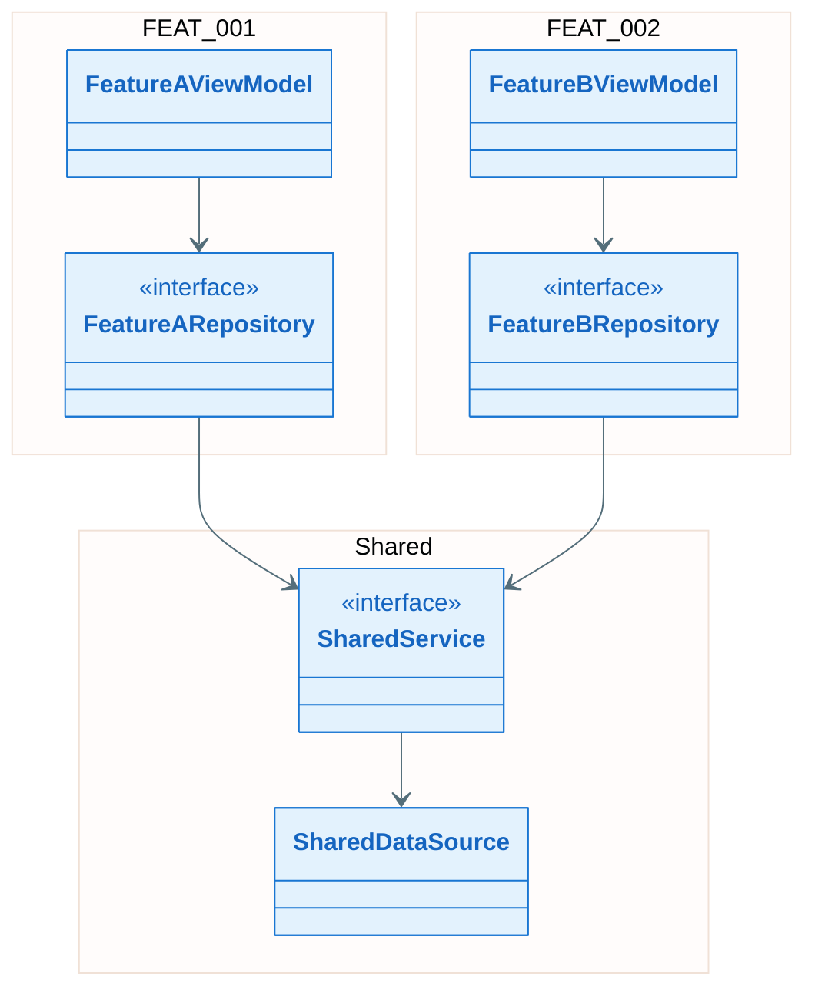
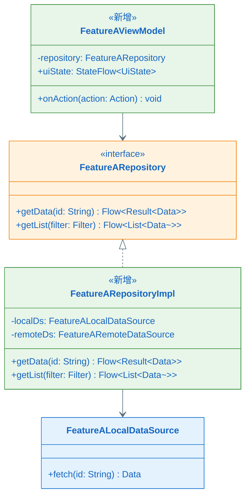
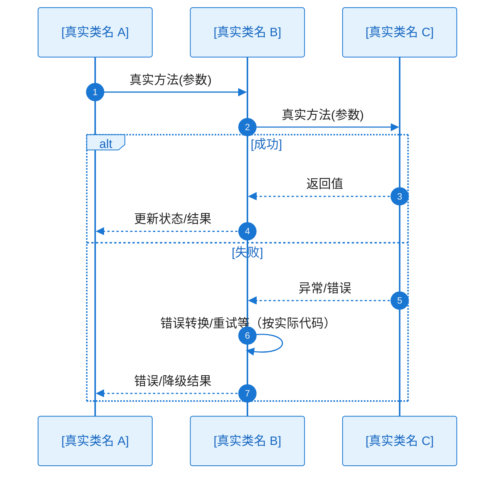

# 全景类图与关键时序：EPIC-[编号] - [EPIC 名称]

> **定位**：本文件对应 `epic-design.md` §八，提供 **EPIC/Feature 级结构视角**——在 §七（关键设计）确认方案可行后，从整体到局部呈现类结构与协作关系，作为进入 L2 前的结构全貌层：全景骨架类图（EPIC 视角跨 Feature 依赖关系）+ Feature 子类图（含完整接口、字段、方法签名与变更标识）+ 完整时序图（含全量异常分支）。与 **`key-func-design/KD_*_*.md`** 强关联——各 KD 内已产出**关键类图**（关键类/接口 + 关键字段与方法）与**核心调用链时序图**；本节在其基础上**补全全量签名、变更标识、全景/子类图与全分支时序**。
>
> **所属 EPIC**：`epic-design.md` → §八 全景类图与关键流程/时序
>
> **输入**：`key-func-design/KD_*_*.md`（各 KD **核心方案**、**关键类图**、**核心调用链时序**、方案流程图已互证；`epic-design.md` §7.1 清单与依赖已一致）、`epic-design.md` §五组件清单
>
> **与 L2（story_detail_design.md）的区别**：
>
> | 维度     | 本文件（全景级）                                                     | story_detail_design.md（Story 级）        |
> | ------ | ------------------------------------------------------------ | --------------------------------------- |
> | 层级     | EPIC / Feature 级                                            | Story 级（按 ST-xxx 分节）                   |
> | 类图/时序图 | 骨架类图（EPIC 跨 Feature 依赖）+ Feature 子类图（含字段/方法签名/变更标识）+ 完整时序图（全异常分支） | 本 Story 的完整详细类图/时序图                     |
> | 目的     | 进入 L2 前对整体结构与协作关系的全貌呈现，评审者一眼知道改了什么、加了什么               | tasks/implement 的详细设计事实源，落码级指导          |
> | 何时必做   | 本文件必须产出                                                       | 仅当 Story 技术复杂度高或需落码级指导时补充               |

**Epic**：EPIC-[编号] - [名称]
**关联文件**：`epic-design.md` | `key-func-design/KD_*_*.md`
**创建/更新日期**：[YYYY-MM-DD]

---

## 8.2 全景骨架类图（必须）

> **目的**：从 EPIC 视角展示跨 Feature 的**接口/抽象类**与各 Feature **核心入口类**之间的依赖关系，让评审者一眼理解整体结构。
>
> **粒度约束**：
>
> - **只画**跨 Feature 共享的接口/抽象类 + 每个 Feature 的 1-3 个核心入口类（如 ViewModel、Repository 接口）
> - **不含方法签名**——方法签名在 §8.2.x 子类图中展示
> - 用 `namespace` 或注释标注所属 Feature，便于对照 `epic-design.md` §5.2 组件清单
> - 依赖方向正确（上层依赖下层）

### 骨架类图说明

| 类/接口 | 所属 Feature        | 层级             | 变更     | 职责（一句话） |
| ---- | ----------------- | -------------- | ------ | ------- |
| [类名] | FEAT-xxx / Shared | UI/Domain/Data | 新增/修改/— | [做什么]   |

---

## 8.2.1 Feature 子类图：FEAT-001 [Feature 名称]

> 本 Feature 的所有关键类/接口，须写清：
>
> - **字段**：所有公共字段（属性），含完整类型（如 `+userId: String`、`+items: List~Item~`）
> - **方法**：所有公共方法的完整签名（方法名 + 参数类型 + 返回值类型）
> - **变更标识**（必须）：
>   - 本 EPIC 中**新增**的类/接口：在类中添加 `<<新增>>` 标注，并使用绿色样式 `style ClassName fill:#E8F5E9,stroke:#388E3C`
>   - 在现有类/接口上有**改动**（新增/修改字段或方法）的：添加 `<<修改>>` 标注，并使用橙色样式 `style ClassName fill:#FFF3E0,stroke:#F57C00`
>   - 已有类/接口**无改动**（纯引用/依赖）：不加任何标注，使用默认样式
>
> 通过变更标识，评审者一眼可判断本 EPIC 的改动边界。

### 关键类职责说明

| 类/接口 | 层级             | 变更     | 职责    | 关键字段/方法      |
| ---- | -------------- | ------ | ----- | ------------ |
| [类名] | UI/Domain/Data | 新增/修改/— | [做什么] | [字段/方法签名]：用途 |

---

## 8.2.2 Feature 子类图：FEAT-002 [Feature 名称]

（结构同 8.2.1：类图 + 关键类职责说明表）

---

## 8.3 关键时序图集（完整版，必须）

> **与 §七 关键类图 / 核心时序的区别**：§七 各 KD 中的**关键类图**已给出方案离不开的类/接口及**关键**字段与方法；本节 Feature 子类图须**补全全量**公共 API、变更标识与跨类关系。**核心调用链时序**在 §七 仅主干 + 关键异常；本节时序须**精确化 + 穷举全分支**，使可直接指导编码。
>
> **范围**：每个 Feature 仅挑选 **1-2 个最关键/最复杂的流程**绘制完整时序图，简单流程、常规 CRUD 等不在此列——更多时序图在 `story_detail_design.md` 中按 Story 粒度补充。
>
> **端到端完整性（必须）**：每张时序图须根据**本工程实际架构与真实代码**绘制**完整调用链路**，不得省略关键方法调用。
>
> **图后文字说明（必须）**：每张时序图代码块**紧下方**须有「**协作过程**」小节，**详细**解释协作过程、工作过程及图中各分支（见 `.cursor/rules/specify-diagram-requirements.mdc` §四）；不得省略或用单句概括。
>
> - **participant 与调用链**：按工程真实分层与类来画，从触发端到最终响应/持久化/网络等真实终点**无断链**
> - **异常分支**：alt/else 中的异常处理路径也须画出**实际代码中的调用链**，不得只写"失败"而缺具体调用
>
> **粒度**：participant 使用**真实类名**，消息使用**真实方法名（含关键参数和返回值类型）**。
>
> **关联**：
>
> - **关联 KD 文件**：若时序图对应某个疑难点/亮点，在索引表中标注「关联 KD-xxx」及对应 `KD_*_*.md`
> - **关联流程图**：在索引表中标注对应的逻辑流程，确保逻辑流程与方法调用时序一一对应

### 时序图索引

| Seq ID  | 所属 Feature | 流程名称   | 对应逻辑流程 | 覆盖的异常（EX-xxx）  | 关联 KD    |
| ------- | ---------- | ------ | ---------- | -------------- | -------- |
| SEQ-001 | FEAT-001   | [流程名称] | 流程 1       | EX-001, EX-002 | KD-xxx / — |
| SEQ-002 | FEAT-002   | [流程名称] | 流程 2       | EX-003         | —        |
| SEQ-003 | 跨 Feature  | [流程名称] | —          | —              | KD-xxx / — |

---

### SEQ-001：[流程名称]（FEAT-001）

> **绘制要求**：participant 为本 Feature 内**真实类名**，消息为**真实方法调用**；从触发端到终点完整无断链；异常分支画出实际代码中的调用链。

**协作过程**（必须详尽，与图中消息一一可对读）：

1. [触发与入口：谁发起、条件、对应 autonumber 起始几步]
2. [逐跳协作：每对 participant 之间的调用目的、参数/返回值语义、与模块职责的关系]
3. [工作过程：中间业务逻辑、状态或数据落点（内存/DB/网络等）]
4. [成功路径：结果如何逐层返回，UI/调用方最终可见行为]
5. [异常路径：alt/else 各分支如何进入、错误如何转换/重试/降级、最终可见结果]

---

### SEQ-002：[流程名称]（FEAT-002）

（结构同 SEQ-001：时序图 + 协作过程文字描述）

---

### SEQ-003：[跨 Feature 流程名称]（跨 Feature，如适用）

> 当关键流程涉及多个 Feature 的类协作时，在此绘制跨 Feature 时序图。若无跨 Feature 关键流程可省略。

（结构同 SEQ-001：时序图 + 协作过程文字描述）

---

## 8.4 图表一致性自检（建议）

- `epic-design.md` §5.1 框架图中的组件 **100% 覆盖** §5.2 组件清单
- §5.2 组件清单中的每个组件在 §8.2 骨架类图或 §8.2.x 子类图中至少有 1 个对应类/接口
- §8.2 骨架类图中的所有类/接口在 §8.2.x 子类图中都有**含字段与方法签名**的完整定义
- §8.2.x 子类图中：所有公共**字段**含类型，所有公共**方法**含完整签名（名称 + 参数类型 + 返回值类型）
- §8.2.x 子类图中：本 EPIC 新增的类/接口均有 `<<新增>>` 标注 + 绿色样式；有改动的类/接口均有 `<<修改>>` 标注 + 橙色样式
- §8.3 时序图中的所有 participant 在 §8.2 骨架类图或 §8.2.x 子类图中都有对应类/接口
- §8.3 每张时序图**端到端完整**：按本工程实际架构与真实代码绘制完整调用链，无断链；异常分支画出实际代码中的调用链
- §8.3 每张时序图**紧下方**均有**详细**「协作过程」文字说明（触发、逐跳协作、分支、结束条件），符合 `.cursor/rules/specify-diagram-requirements.mdc` §四
