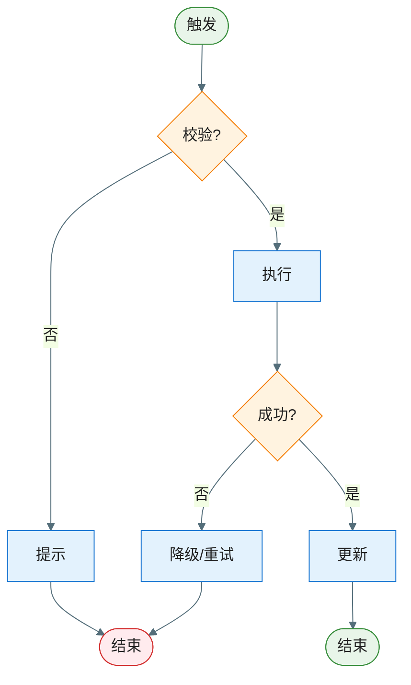

# Feature 流程图集：EPIC-[编号] - [EPIC 名称]

> **定位**：本文件位于 EPIC 目录 **`key-func-design/feature-flows.md`**，汇总跨 Feature 或不便归入单一 KD 的**关键逻辑流程**（正常 + 全异常分支）。与 `epic-design.md` §七 中对该文件的引用对应。
>
> **与各 KD 文档的关系（必须遵守）**：**每个 KD 的方案流程图仍须直接画在对应 `KD_*_*.md` 内**（见 `key-func-design-kd-template.md`「方案流程图」节）。本文件**不替代**各 KD 内流程图，仅补充**跨多个 KD、跨 Feature 或端到端总览**类流程；若某流程只属于单一 KD，应只在该 KD 中绘制，不必重复到本文件。
>
> **何时需要**：存在多个 KD 共用的业务流程、或流程粒度大于单 KD、或需要单独的总览流程文档时产出。
>
> **关联**：[`epic-design.md`](../epic-design.md) §七 | 各 [`KD_*_*.md`](./)（按需互链）

**Epic**：EPIC-[编号] - [名称]
**创建/更新日期**：[YYYY-MM-DD]

---

## Feature 流程图集（逻辑流程）

> **范围**：仅列出**关键流程**，简单、显而易见的流程可不列入。
>
> **完整性**：凡列入的每个关键流程，须**详细完整**——一张流程图覆盖**正常 + 所有异常分支**，从触发条件到所有可能结束状态的完整逻辑路径不得遗漏。

### 流程 1：[流程名称]

| 分支   | 异常ID   | 触发条件 | 对策    |
| ---- | ------ | ---- | ----- |
| 校验失败 | EX-001 |      | 提示用户  |
| 执行失败 | EX-002 |      | 降级/重试 |

**工作流程**：

1. [步骤 1：触发条件和入口]
2. [步骤 2：校验什么、通过/失败分别怎么处理]
3. [步骤 3：核心执行逻辑]
4. [步骤 4：结果处理和异常降级]

### 流程 2：[流程名称]

（结构同流程 1：流程图 + 异常分支表 + 工作流程文字描述）
