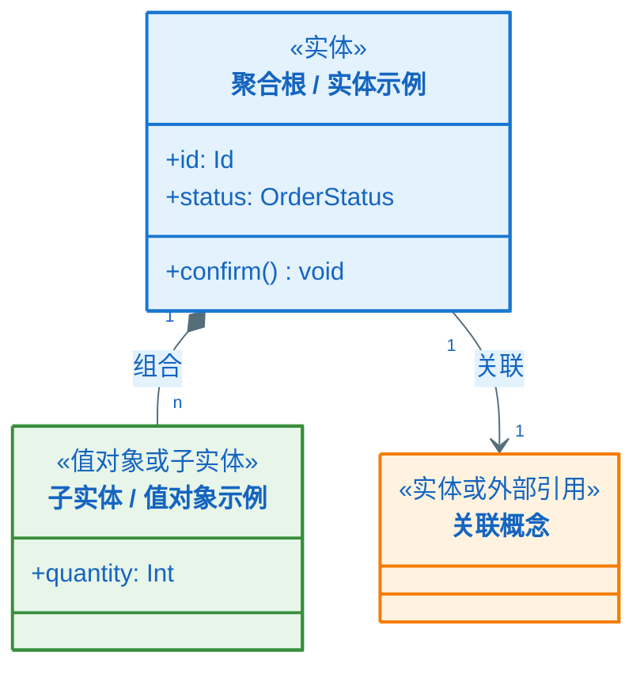
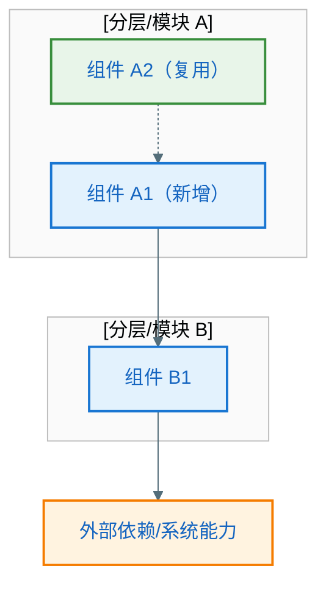
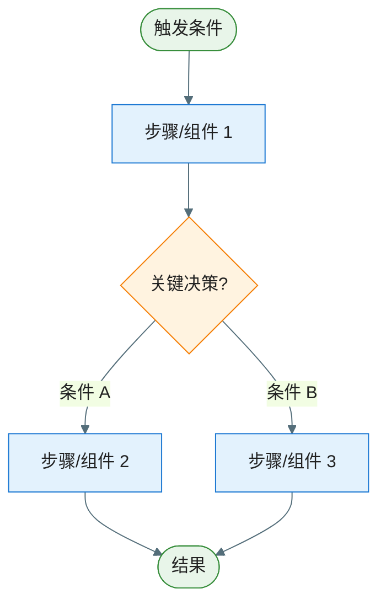
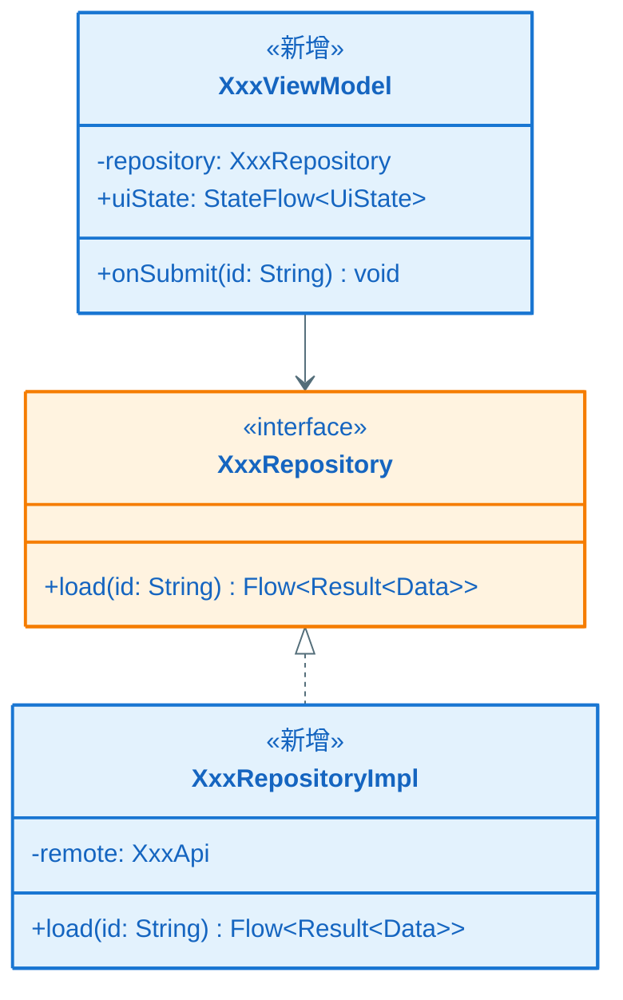
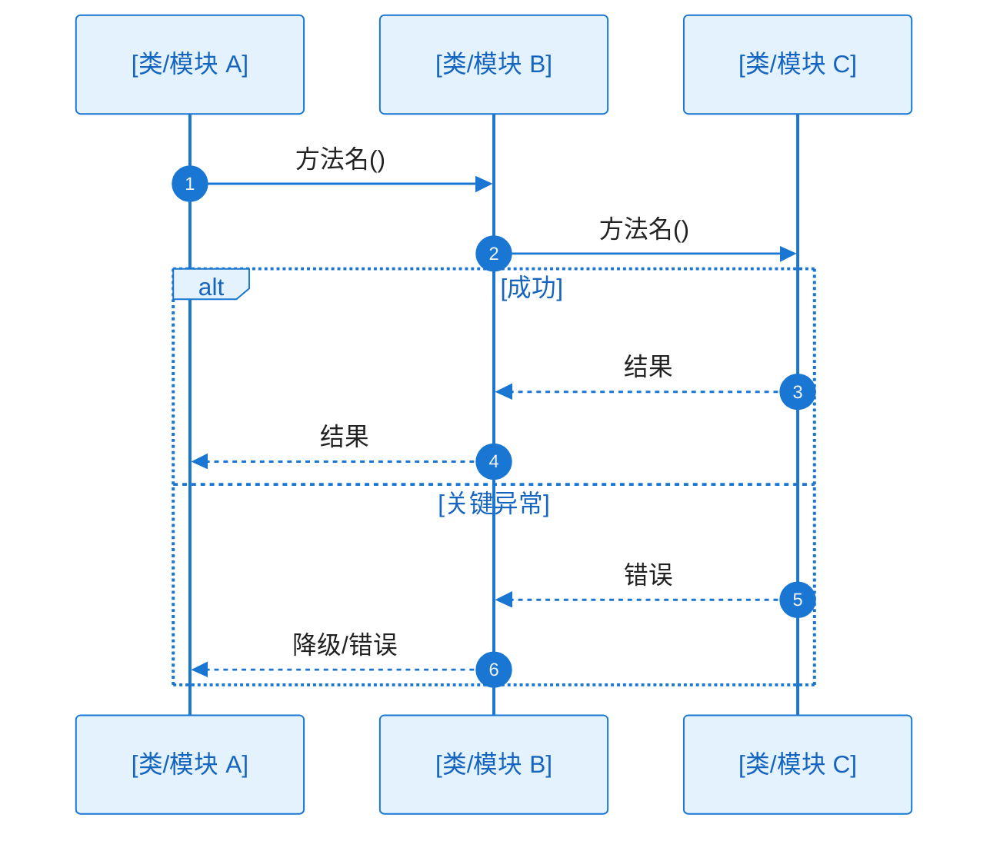

# KD-001：[设计点名称]

> **EPIC 内文件路径**（示例）：`key-func-design/KD_001_<short_slug>.md`  
> **命名规则**：`KD_${三位序号}_${精炼slug}.md`（序号与 `epic-design.md` §7.1 中 **KD-001** 对齐；slug 建议英文/拼音，仅字母、数字、下划线）。
>
> **回链**：[`epic-design.md`](../epic-design.md) §七（关键设计清单与引用以该节为准；**不**使用 EPIC 根目录 `key-func-design.md`）。
>
> **关联**：[`key-diagram-epic.md`](../key-diagram-epic.md)（EPIC 全景骨架、跨 Feature 时序）| 涉及具体 Feature 的全量子图/时序见 **`../features/<FEAT-目录名>/key-diagram.md`**（将 `<FEAT-目录名>` 换为本 KD 主归属 Feature 的实际目录名）| 按需 [`feature-flows.md`](./feature-flows.md)（**仅**作跨 KD/跨 Feature 补充；**不可替代**下文「方案流程图」）
>
> **流程图归属（必须）**：本 KD 的**方案流程图**（及按需的**方案架构图**）**须直接绘制在本文档内**的对应章节（Mermaid），**不得**仅写在 `feature-flows.md` 或其他文件中而不在本 KD 落地。若本设计点确无分支、单线逻辑且无需图示，须在「### 方案流程图」节标注 **N/A** 并一句话说明理由。
>
> **图表规范**：Mermaid 样式遵循 `.cursor/rules/mermaid-style-guide.mdc`；内容与真实代码一致遵循 `.cursor/rules/specify-diagram-requirements.mdc`。每张 `sequenceDiagram` **紧下方**须有「未读图也能理解分支差异」的协作者与过程说明。

**Epic**：EPIC-[编号] - [名称]
**KD 编号**：KD-001
**创建/更新日期**：[YYYY-MM-DD]

---

## 依赖的其他 KD

> 若无前置依赖，表格填 `—`，并写明「无前置依赖」。多个前置用多行；**须与 `epic-design.md` §7.1 中「前置 KD / 依赖」列一致**。

| 前置 KD | 对应文件（相对本目录） | 本 KD 如何建立在其上 |
| ------- | ---------------------- | -------------------- |
| —       | —                      | 无前置依赖 / 或示例：KD-001 → `./KD_001_xxx.md`，本 KD 复用其会话契约与生命周期约定 |

---

- **类型**：疑难点 | 方案亮点
- **背景/亮点说明**：疑难点→[为何是疑难点，涉及哪些组件或跨层关注点，易出现哪些坑]；亮点→[为何是亮点，创新点或最佳实践，可复用价值]
- **方案选型与取舍**：[对比了哪些候选方案，各自优劣，为什么选当前方案]（疑难点必填，亮点选填）
- **核心方案**：用**清晰、易懂**的中文，把**设计方案与实现**写细写透；**不强制**按「第几段」切分，可按叙述需要自然组织，但**禁止**仅用标题或条目堆砌代替说明。须满足：

  > - **全覆盖**：凡本设计点涉及的**技术点**（协议、存储、线程/协程、缓存、序列化、安全、与系统或第三方交互等），均应在叙述中露面，并形成可核对的技术语境。  
  > - **全链路**：从触发到结果，覆盖**每一条相关的**技术链路（含主路径及方案中明确纳入的异常/降级路径）；链路须**闭环**（入口、中间环节、出口或副作用交代清楚），初读者能跟着文字走通。  
  > - **每环可落地**：对链路上**每一环**说明「**如何达成**」——采用什么机制/ API / 数据结构 / 约定，谁负责，状态与数据如何传递与落盘，关键约束（性能、一致性、生命周期、兼容性等）如何满足；避免只写「会调用某某」而不写**怎样**调用、**为何**可行。  
  > - **与图互证**：叙述应与本节**模型架构图**（若有）、**方案架构图**（若有）、**关键类图**、流程图、时序图一致；图中出现的概念/实体/模块/类名与消息，在文字中应有对应关系，便于交叉检查。

  （模板中的以上引用块为撰稿提示，正式文档中删除引用块，改为连续正文即可。）
- **关联决策**：[零层/一层架构中的决策点]（若适用）
- **边界条件与注意事项**：[关键边界、异常、并发/生命周期等]（疑难点必填，亮点选填）

### 模型架构图（领域/概念建模；推荐）

> **定位**：描述本 KD 涉及的**领域模型**——核心概念、实体与值对象、属性要点、实体间关系（关联/组合/聚合）、可选状态枚举或生命周期、与 `epic-design.md` **§三 领域模型**可对齐但**范围缩至本设计点**。用于在讨论「组件怎么协作」（方案架构图）之前，先把「业务对象是什么、如何关联」说清楚。
>
> **何时需要**：涉及**新业务实体**、**复杂状态与流转**、**多实体一致性/事务边界**、**领域规则依赖的概念关系**时**推荐**绘制。若本 KD 仅为纯基础设施/纯 UI 壳层且无新增领域语义，可省略本节或标注 **N/A** 并说明理由。
>
> **与「方案架构图」的分工**：
>
> | 维度 | 模型架构图（本节） | 方案架构图（下一节） |
> |---|---|---|
> | 视角 | **业务/领域语义**（概念、数据与规则承载物） | **工程/运行时**（模块、组件、分层、调用与依赖） |
> | 典型元素 | 实体、值对象、枚举、关联、聚合边界 | ViewModel、Repository、DataSource、Feature 模块 |
> | 回答的问题 | 处理的对象是什么、它们如何关联 | 谁在运行时协作、数据如何流经各层 |
>
> **表达形式**：优先使用 Mermaid `classDiagram`（概念级类图：可只列关键属性/关联，**不必**等同于 §八 落码级类图）；涉及强表结构预览时可用 `erDiagram`。须与 `epic-design.md` §三 术语一致，**禁止**引入 §三 未定义且无说明的新概念名。
>
> **要求**：标注只读/可变、拥有方（如订单「拥有」订单行）；关系箭头与基数（1、*、0..1）须与正文「核心方案」一致。

**模型说明**：

- **概念与职责**：列出图中每个核心概念的一句话领域含义（与 §三 词汇表对应）。
- **关系与约束**：说明关联/组合/聚合的业务理由； cardinality 与不变量（如「一个 X 至多一个 Y」）。
- **状态与事件**（若适用）：关键状态枚举、允许迁移，或与后续方案流程图中分支的对应关系。

### 方案架构图（涉及多组件/跨模块协作时推荐）

> **何时需要**：当本设计点涉及**多个组件/模块协作**、**跨层调用**或**引入新的架构元素**时，用架构图先将参与方与依赖关系可视化；**建议在已理解领域模型（上一节）后再画本节**。若设计点局限于单一模块内部逻辑且无跨组件协作，可省略本节。
>
> **与 epic-design §四/§五 的区别**：§四/§五 是 EPIC 级全局架构，本节是**设计点局部架构**——仅展示与本 KD 直接相关的组件/模块及其关系，粒度更细、聚焦更窄。
>
> **要求**：
>
> - subgraph 按职责或技术分层组织，标注所属工程模块名称（如 `:feature:xxx`）
> - 静态依赖用实线箭头（`-->`），动态协作/事件/回调用虚线箭头（`-.->`）
> - 须标注关键数据流方向与协议（如 Flow、Callback、Intent 等）
> - 新增组件用蓝色主色，复用已有组件用绿色成功色，外部依赖用橙色警告色

**架构说明**：

- **参与组件**：[列出本设计点涉及的所有组件，说明各自在本设计点中的角色]
- **依赖与协作关系**：[说明组件间的依赖方向与协作方式——谁调用谁、数据如何流转、事件如何传递]
- **新增 vs 复用**：[哪些是本设计点新增的组件/接口，哪些是复用已有的，复用时有无适配/扩展]

### 方案流程图（验逻辑分支；**默认必须在本 KD 文档内绘制**）

> **强制**：流程图代码块**放在本文件本节**，与 `epic-design.md` §七「每个设计点同时给出流程图」一致。用流程图将核心方案的**处理逻辑**可视化：先做什么、再做什么、什么条件走哪条分支。粒度与 epic-design §五 对齐（组件/模块级），节点使用组件或步骤名称。涉及多步决策、分支或异常路径时**不可省略**；仅当确无分支且评审无需图示时，本节写 **N/A** + 理由。

**工作流程**：

1. [步骤 1：触发条件是什么，发生了什么]
2. [步骤 2：关键决策点——根据什么条件走哪条分支]
3. [步骤 3：各分支分别做什么，最终结果是什么]

### 关键类图（验方案可行性；必须）

> **定位**：用 **Mermaid `classDiagram`** 固化本 KD 涉及的**关键类与接口**（工程真实类名/接口名，须与代码或已定命名一致），并写出与方案直接相关的**关键字段**与**关键方法**（含参数/返回值类型或 Kotlin/Java 可辨识的简写），验证「类型与职责是否撑得起方案」。**本节为必填**；若确无新增/涉及类型（极罕见），须写 **N/A** 并说明理由。
>
> **与 §八（`key-diagram-epic.md` + `features/FEAT-xxx/key-diagram.md`）的分工**：
>
> | 维度 | 本节「关键类图」（§七 / 本 KD 文档） | §八 精确化文件 |
> |---|---|---|
> | **范围** | 仅本 KD 方案**离不开**的类/接口（宜控制在「能讲清主干」的最小集合） | EPIC 骨架见 **`key-diagram-epic.md`**；各 Feature **全量**子类图、公共 API、字段与方法签名、变更标识见 **`features/<FEAT>/key-diagram.md`** |
> | **字段与方法** | **必须体现**与方案相关的关键成员（可省略与方案无关的次要成员） | **完整**公共接口：全方法签名、全字段类型 |
> | **目的** | 方案在类型层面是否闭合？关键协作点由谁承担？ | 能否**直接编码**、与全景/子类图及全量时序对齐 |
>
> **要求**：
>
> - **类名/接口名**：须为本工程**真实**或设计已定稿名称；新增类型在类旁注释 `<<新增>>` 并可用主色样式，改动现有类型用 `<<修改>>` 与警告色样式（与 §八 约定一致，便于评审扫读）。
> - **字段**：列出与状态、数据流、持久化、跨层传递**直接相关**的属性（含类型）。
> - **方法**：列出本 KD 核心调用链上会出现的**关键方法**（建议写出完整签名；若篇幅受限，至少写清方法名 + 关键参数与返回类型）。
> - **关系**：`-->` 依赖、`<|..` 实现、`<|--` 继承等须与「核心方案」叙述及下文**核心调用链时序图**的 participant 一致。
> - **顺序建议**：先完成本节类图，再画**核心调用链时序图**，避免 participant 与类型脱节。

**类图说明**：

- **各类/接口职责**：各用一句话说明在本 KD 方案中的角色。
- **关键成员与方案**：字段/方法如何支撑「核心方案」中的数据与调用；哪些成员在核心时序中会出现。
- **与模型架构图**：若上文有模型架构图，说明领域概念如何映射到本图类/接口（不必逐字重复，标出对应关系即可）。

### 核心调用链时序图（验方案可行性；必须）

> 用时序图验证方案在类协作层面**走不走得通**：谁调谁、职责分配是否合理、核心调用链是否有断点。**participant 须与上一节「关键类图」中的类/接口一致**（名称一致；若时序中需抽象为模块，须在「协作过程」中说明与具体类的对应关系）。
>
> **图后文字说明（必须）**：本节每张时序图代码块**紧下方**须有「**协作过程**」等小节，**详细**说明协作链、工作过程与 `alt/else` 分支含义（见 `.cursor/rules/specify-diagram-requirements.mdc` §四），不得仅列步骤标题而无实质内容。
>
> **与 §八 完整时序图的区别**：
>
> | 维度 | §七 核心时序（本节） | §八 完整时序（`features/<FEAT>/key-diagram.md` 或 `key-diagram-epic.md` §8.3 跨 Feature） |
> |---|---|---|
> | **participant** | 按验证需要列出，覆盖方案涉及的关键类/模块 | 同左 |
> | **路径覆盖** | 主干成功路径 + 1~2 个关键异常分支 | 穷举所有异常分支（alt/else 完整覆盖） |
> | **消息粒度** | 方法名即可，参数可省略或简写 | 真实方法签名（含关键参数和返回值类型） |
> | **目的** | 这条路走得通吗？职责分配合理吗？ | 每个方法签名对得上吗？可以直接编码吗？ |

**协作过程**（须按下列结构**逐项展开**，每项必须有实质性内容，不得仅列标题或一句话带过；目标是**未读图也能理解主干协作与分支差异**）：

1. **触发与入口**
   - 谁（哪个角色/组件）在什么条件下发起交互，对应图中的首条或首批消息
   - 触发的前置状态是什么（如页面已加载、用户已登录、数据已就绪等）

2. **协作链与职责**
   - 沿调用方向，**逐跳**说明「谁调用谁、为了什么、方法语义、输入/输出数据是什么」
   - 每一跳的调用方与被调用方分别承担什么职责——为什么由它来做而不是其他组件
   - 与 epic-design §五 一层架构中的分层/模块边界是什么关系（跨层调用还是同层协作）

3. **工作过程与原理**
   - **处理逻辑**：每个关键环节内部做了什么（如校验规则、数据转换逻辑、状态机变迁、算法核心步骤等）——不只写"处理数据"，要写**怎么处理、为什么这样处理**
   - **数据流转**：数据从哪来（内存/缓存/持久化/网络）、经过什么变换、落到哪里去；中间状态如何传递与保持
   - **关键机制/原理**：涉及的核心技术机制（如协程调度、线程切换、缓存策略、序列化方式、加密算法、生命周期绑定等）须交代清楚——采用什么机制、为何选这个机制、关键约束（性能/一致性/线程安全等）如何满足
   - **业务决策点**：关键业务判断在哪个环节做出、依据什么条件/规则、决策结果如何影响后续流程

4. **分支与异常**
   - 对图中**每个 `alt/else`**（及重要的 `opt/loop`）**分别**说明：
     - 进入条件：什么情况下走这条分支
     - 差异行为：各分支在处理逻辑、调用链、数据流上有什么不同
     - 可见结果：最终对调用方/用户的可见结果是什么（返回值、UI 状态、副作用等）
   - 异常分支须说明错误传播路径（谁产生错误→谁捕获→谁处理→最终用户看到什么）

5. **结束条件**
   - 正常结束：最终产出什么结果、系统/UI 处于什么状态
   - 异常结束：各类异常路径最终的可见结果分别是什么
   - 与流程图或其他设计章节的一致性说明（如适用）

- **精确化与补全**：→ `key-diagram-epic.md` §8.2（全景骨架）+ **`features/<FEAT>/key-diagram.md`** 子类图与 SEQ-[xxx]（在**本节关键类图 / 核心时序**基础上，补全**全量**签名、变更标识及**全分支**时序）
