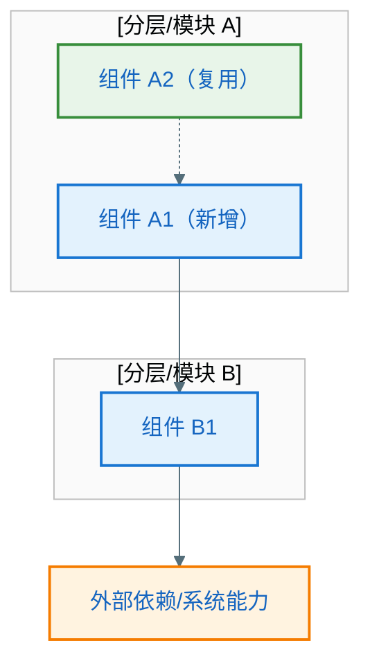
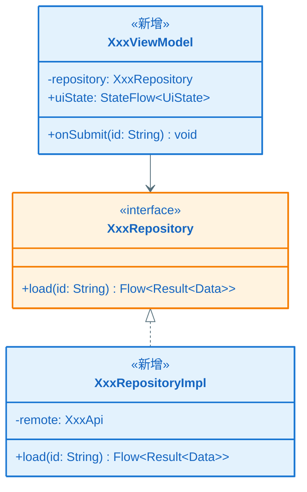
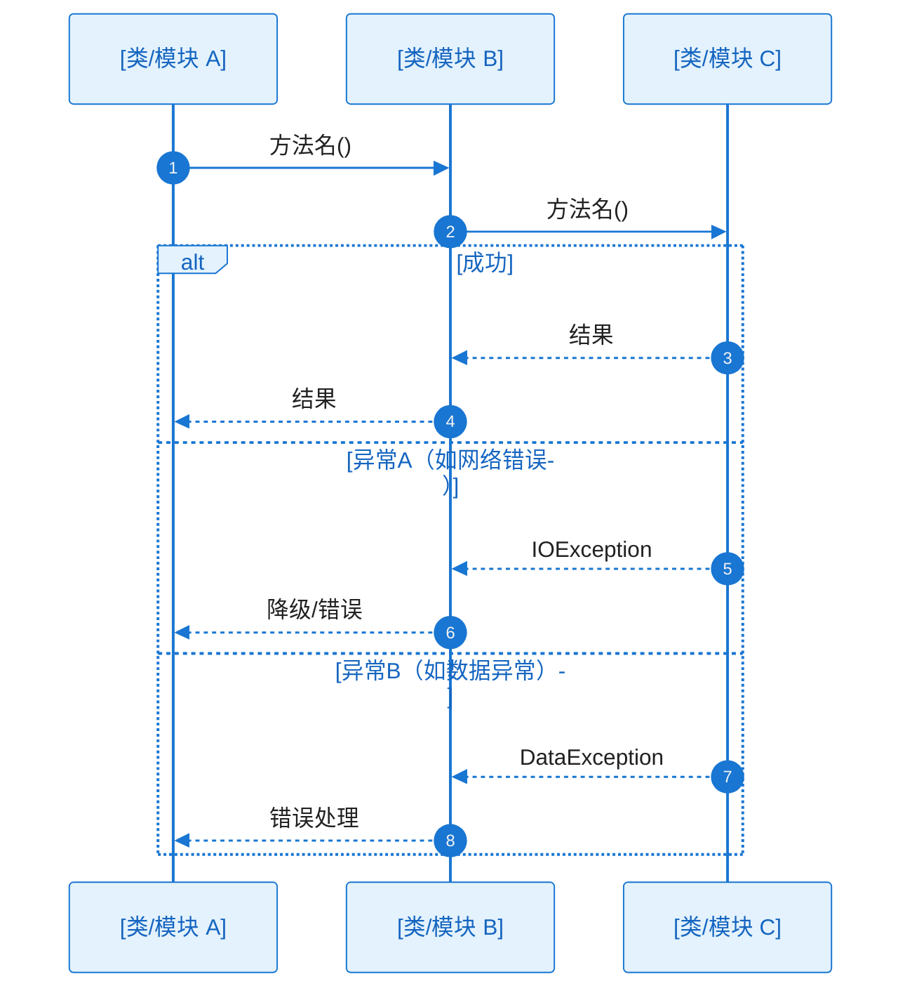

# KD-001：[设计点名称]

> **EPIC 内文件路径**（示例）：`key-func-design/KD_001_<short_slug>.md`
> **命名规则**：`KD_${三位序号}_${精炼slug}.md`（序号与 `epic-design.md` §7.1 中 **KD-001** 对齐；slug 建议英文/拼音，仅字母、数字、下划线）。
>
> **回链**：[`epic-design.md`](../epic-design.md) §七（关键设计清单与引用以该节为准；**不**使用 EPIC 根目录 `key-func-design.md`）。
>
> **KD 与 Feature 关系**：KD 是围绕关键技术方案、疑难点或方案亮点组织的设计单元，**不要求与 Feature 一一对应**；一个 KD 可支撑多个 Feature，一个 Feature 也可拆出多个 KD。
>
> **定位（必读）**：KD 的核心目的是**提前验证 EPIC 中关键疑难点的技术 / 算法可行性链路，并锁定关键设计**——把核心技术方案与实现思路讲明白即可，不追求章节完整。
>
> **图表规范**：Mermaid 样式遵循 `.cursor/rules/mermaid-style-guide.mdc`；内容与真实代码一致遵循 `.cursor/rules/specify-diagram-requirements.mdc`。每张 `sequenceDiagram` **紧下方**须有「未读图也能理解分支差异」的协作者与过程说明。

**Epic**：EPIC-[编号] - [名称]
**KD 编号**：KD-001
**创建/更新日期**：[YYYY-MM-DD]

---

## 依赖的其他 KD

> 若无前置依赖，表格填 `—`，并写明「无前置依赖」。多个前置用多行；**须与 `epic-design.md` §7.1 中「前置 KD / 依赖」列一致**。

| 前置 KD | 对应文件（相对本目录） | 本 KD 如何建立在其上 |
| ------- | ---------------------- | -------------------- |
| —       | —                      | 无前置依赖 / 或示例：KD-001 → `./KD_001_xxx.md`，本 KD 复用其会话契约与生命周期约定 |

---

- **类型**：疑难点 | 方案亮点
- **背景/亮点说明**：疑难点→[为何是疑难点，涉及哪些组件或跨层关注点，易出现哪些坑]；亮点→[为何是亮点，创新点或最佳实践，可复用价值]
- **方案选型与取舍**：[对比了哪些候选方案，各自优劣，为什么选当前方案]（疑难点必填，亮点选填）
- **核心方案**：用**清晰、易懂、不过度冗长**的中文讲清本 KD 的**技术实现链路**，让评审者能据此判断方案是否可行。正文不强制按「第几段」切分，可按叙述需要自然组织，但**禁止**仅用标题或条目堆砌代替说明。重点不是罗列所有细节，而是把关键链路、关键机制和关键取舍讲到可验证。须满足：

  > - **链路闭环**：从触发到结果讲清主路径，必要时覆盖关键异常/降级路径；入口、中间处理、出口或副作用要交代清楚，读者能跟着文字走通。
  > - **关键技术点露面**：凡影响方案可行性的技术点（协议、存储、线程/协程、缓存、序列化、安全、系统或第三方交互等）必须说明；无关或显而易见的实现细节不展开。
  > - **关键环节可落地**：对链路中的关键环节说明「如何达成」——采用什么机制 / API / 数据结构 / 约定，谁负责，状态与数据如何传递或落盘，关键约束（性能、一致性、生命周期、兼容性等）如何满足；避免只写「会调用某某」而不写**怎样**调用、**为何**可行。
  > - **与图互证**：叙述应与本 KD 的**关键类图**、**核心调用链时序图**（及若有的**方案架构图**）一致；图中出现的核心模块、类名与关键消息，在文字中应有对应关系，便于交叉检查。

  （模板中的以上引用块为撰稿提示，正式文档中删除引用块，改为连续正文即可。）
- **关联决策**：[零层/一层架构中的决策点]（若适用）
- **边界条件与注意事项**：[关键边界、异常、并发/生命周期等]（疑难点必填，亮点选填）

### 方案架构图（涉及多组件/跨模块协作时推荐；可省略）

> **何时需要**：当本设计点涉及**多个组件/模块协作**、**跨层调用**或**引入新的架构元素**，且仅用类图/时序图难以表达整体协作关系时绘制。若设计点局限于单一模块内部逻辑，或类图与时序图已能讲清协作，本节直接写 **N/A** 并一句话说明理由。
>
> **与 epic-design §四/§五 的区别**：§四/§五 是 EPIC 级全局架构，本节是**设计点局部架构**——仅展示与本 KD 直接相关的组件/模块及其关系，粒度更细、聚焦更窄。
>
> **要求**（绘制时）：
>
> - subgraph 按职责或技术分层组织，标注所属工程模块名称（如 `:feature:xxx`）
> - 静态依赖用实线箭头（`-->`），动态协作/事件/回调用虚线箭头（`-.->`）
> - 须标注关键数据流方向与协议（如 Flow、Callback、Intent 等）
> - 新增组件用蓝色主色，复用已有组件用绿色成功色，外部依赖用橙色警告色

**架构说明**（绘制时填写；省略时无需此段）：

- **参与组件**：[列出本设计点涉及的所有组件，说明各自在本设计点中的角色]
- **依赖与协作关系**：[说明组件间的依赖方向与协作方式——谁调用谁、数据如何流转、事件如何传递]
- **新增 vs 复用**：[哪些是本设计点新增的组件/接口，哪些是复用已有的，复用时有无适配/扩展]

### 关键类图（验方案可行性；必须）

> **定位**：用 **Mermaid `classDiagram`** 固化本 KD 涉及的**关键类与接口**（工程真实类名/接口名，须与代码或已定命名一致），并写出与方案直接相关的**关键字段**与**关键方法**（含参数/返回值类型或 Kotlin/Java 可辨识的简写），验证「类型与职责是否撑得起方案」。**本节为必填**；若确无新增/涉及类型（极罕见），须写 **N/A** 并说明理由。
>
> **要求**：
>
> - **类名/接口名**：须为本工程**真实**或设计已定稿名称；新增类型在类旁注释 `<<新增>>` 并可用主色样式，改动现有类型用 `<<修改>>` 与警告色样式（便于评审扫读）。
> - **字段**：列出与状态、数据流、持久化、跨层传递**直接相关**的属性（含类型）。
> - **方法**：须列出本 KD 涉及的所有**公共方法**（含完整签名：方法名 + 参数类型 + 返回值类型）。不得省略任何公共 API，哪怕是辅助方法——key-diagram 层已删除，全量签名由本节保障。
> - **关系**：`-->` 依赖、`<|..` 实现、`<|--` 继承等须与「核心方案」叙述及下文**核心调用链时序图**的 participant 一致。
> - **顺序建议**：先完成本节类图，再画**核心调用链时序图**，避免 participant 与类型脱节。

**类图说明**：

- **各类/接口职责**：各用一句话说明在本 KD 方案中的角色。
- **关键成员与方案**：字段/方法如何支撑「核心方案」中的数据与调用；哪些成员在核心时序中会出现。

### 核心调用链时序图（讲清协作/调用流程；必须）

> 用时序图讲清本 KD 的**工作流程、协作流程与核心方法调用流程**，验证方案在类协作层面**走不走得通**：谁触发、谁负责、谁调用谁、关键数据如何返回、职责分配是否合理、核心调用链是否有断点。**participant 须与上一节「关键类图」中的类/接口一致**（名称一致；若时序中需抽象为模块，须在「协作过程」中说明与具体类的对应关系）。
>
> **图后文字说明（必须）**：本节每张时序图代码块**紧下方**须有「**协作过程**」等小节，在 **KD 粒度**说明协作链、工作过程与 `alt/else` 分支含义（见 `.cursor/rules/specify-diagram-requirements.mdc` §四），不得仅列步骤标题而无实质内容，也不需要展开到 L2 落码细节。
>
> **粒度控制**：KD 阶段重点讲清**主干成功路径 + 影响方案可行性的关键异常/降级分支**；不要求展开到每个局部实现细节、内部私有方法或 Story 级边界条件。更细的方法调用、字段级转换、UI 细节和单 Story 专属分支，放到 L2 Story 设计中细化。

**协作过程**（按下列结构在 **KD 粒度**展开；每项应有实质内容，不得仅列标题或一句话带过；目标是**未读图也能理解主干协作与关键分支差异**）：

1. **触发与入口**
   - 谁（哪个角色/组件）在什么条件下发起交互，对应图中的首条或首批消息
   - 触发的前置状态是什么（如页面已加载、用户已登录、数据已就绪等）

2. **协作链与职责**
   - 沿调用方向，**逐跳**说明「谁调用谁、为了什么、方法语义、输入/输出数据是什么」
   - 每一跳的调用方与被调用方分别承担什么职责——为什么由它来做而不是其他组件
   - 与 epic-design §五 一层架构中的分层/模块边界是什么关系（跨层调用还是同层协作）

3. **工作过程与数据流**
   - **主干流程**：说明核心环节按什么顺序协作，关键判断发生在哪里，判断结果如何影响后续流程
   - **数据流转**：说明关键输入从哪来（内存/缓存/持久化/网络等）、经过哪些核心组件、最终输出到哪里；字段级转换和局部实现细节留给 L2
   - **关键机制**：只说明影响方案可行性的机制（如协程调度、缓存策略、序列化方式、加密方式、生命周期绑定等），讲清采用什么、为什么可行、满足什么关键约束

4. **分支与异常**
   - 对图中**每个 `alt/else`**（及重要的 `opt/loop`）**分别**说明：
     - 进入条件：什么情况下走这条分支
     - 差异行为：各分支在处理逻辑、调用链、数据流上有什么不同
     - 可见结果：最终对调用方/用户的可见结果是什么（返回值、UI 状态、副作用等）
   - 异常分支须说明错误传播路径（谁产生错误→谁捕获→谁处理→最终用户看到什么）

5. **结束条件**
   - 正常结束：最终产出什么结果、系统/UI 处于什么状态
   - 异常结束：各类异常路径最终的可见结果分别是什么

- **精确化与补全**：各 Story 的 L2 详细设计（`l2_design/ST-xxx_*.md`）在本 KD 类图/时序基础上，按 Story 切片补充本 Story 的细化类图/时序；KD 已讲清的主干协作不重复展开，只补充 Story 专属细节、边界条件与落码级调用。
