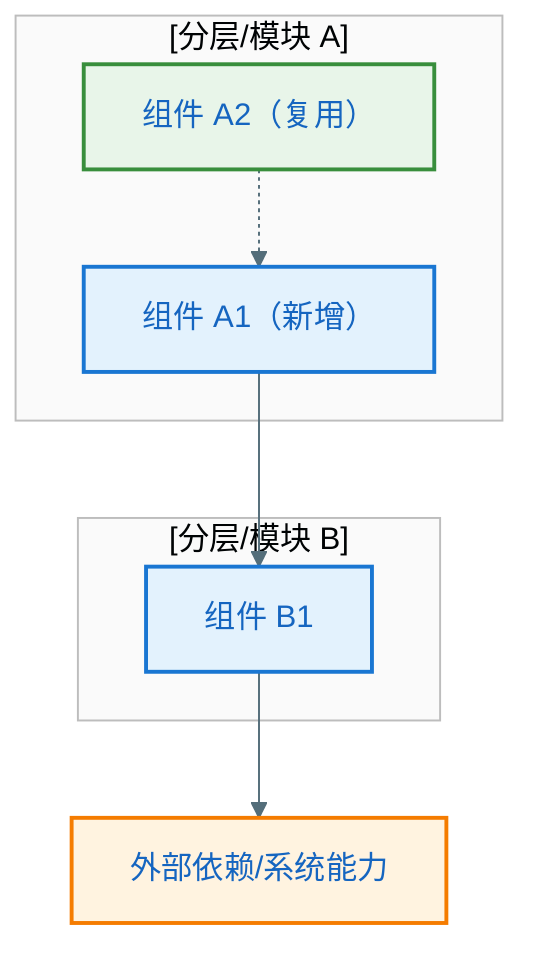
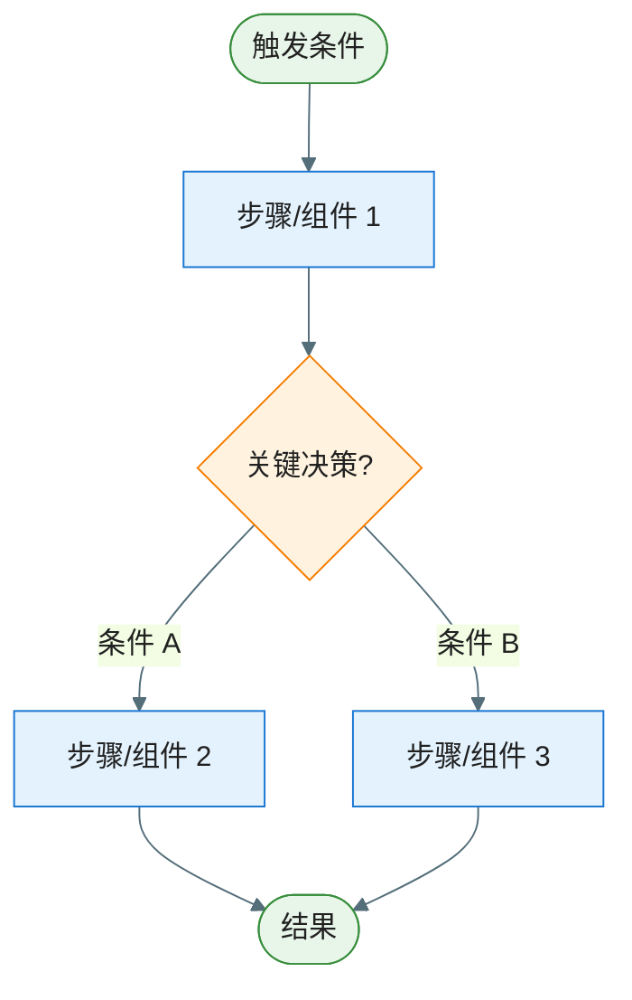
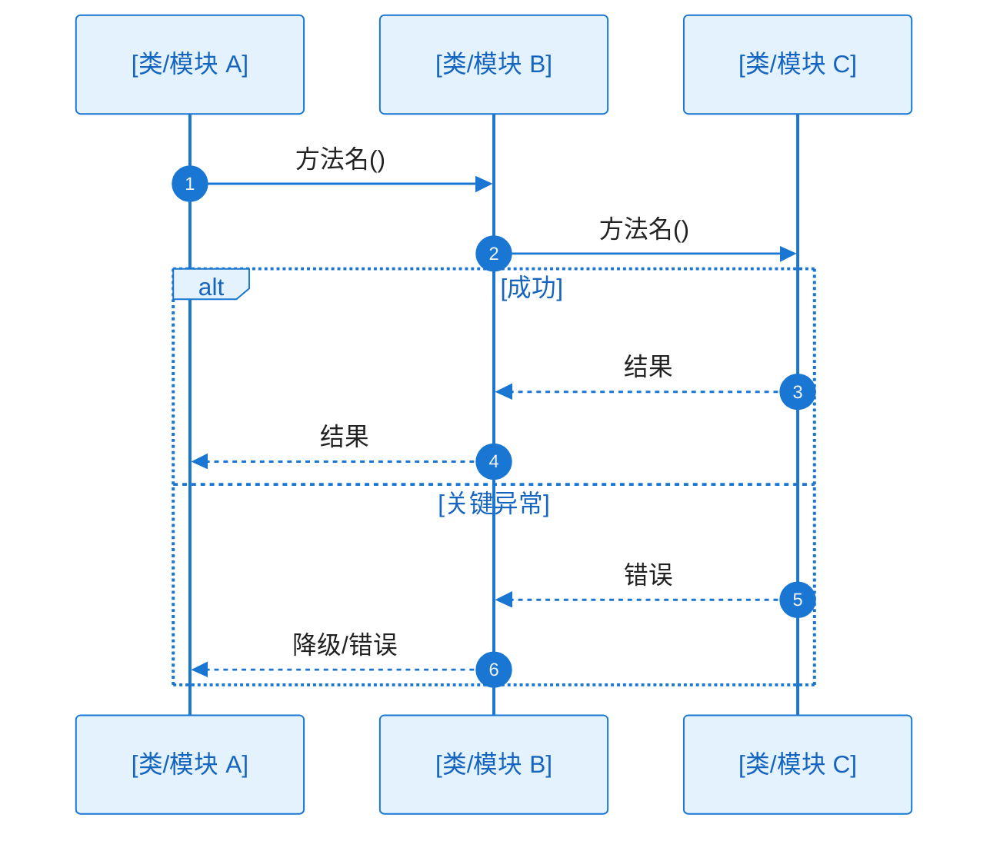

# 关键功能与疑难点/亮点设计：EPIC-[编号] - [EPIC 名称]

> **定位**：本文件对应 `epic-design.md` §七，面向方案评审，将重难点模块的**设计策略与决策逻辑**讲清楚。聚焦"为什么难 → 怎么解决 → 方案是否可行"。每个设计点同时给出**流程图**（验逻辑分支）和**核心调用链时序图**（验方案主干可行性），使 §七 阶段即可判断方案是否 ok。完整类图（含方法签名）与全量时序图（穷举异常分支）见 `key-diagram.md`（§八）。
>
> **所属 EPIC**：`epic-design.md` → §七 关键功能与疑难点/亮点设计
>
> **输入**：`epic-design.md` §五（一层架构已通过 Gate 1 确认）
>
> **适用**：仅纳入**技术方案设计上的**疑难点（易踩坑、需专项论证）或亮点（可作为最佳实践/创新点）。简单、显而易见的设计不纳入。
>
> **何时省略**：若无疑难点且无方案亮点，可在 `epic-design.md` §七引用处标注「本 EPIC 无关键疑难点/亮点，省略本文件」。

**Epic**：EPIC-[编号] - [名称]
**关联文件**：`epic-design.md` | `key-diagram.md`
**创建/更新日期**：[YYYY-MM-DD]

---

## 关键设计清单

> 列出本文件包含的所有关键设计点，便于快速定位。

| 编号   | 设计点名称   | 类型         | 关联 key-diagram.md |
| ------ | ------------ | ------------ | ------------------- |
| KD-001 | [设计点名称] | 疑难点/亮点  | §8.2 [类名] / SEQ-xxx / — |
| KD-002 | [设计点名称] | 疑难点/亮点  | — |

---

## KD-001：[设计点名称]

- **类型**：疑难点 | 方案亮点
- **背景/亮点说明**：疑难点→[为何是疑难点，涉及哪些组件或跨层关注点，易出现哪些坑]；亮点→[为何是亮点，创新点或最佳实践，可复用价值]
- **方案选型与取舍**：[对比了哪些候选方案，各自优劣，为什么选当前方案]（疑难点必填，亮点选填）
- **核心方案**：用**清晰、易懂**的中文，把**设计方案与实现**写细写透；**不强制**按「第几段」切分，可按叙述需要自然组织，但**禁止**仅用标题或条目堆砌代替说明。须满足：

  > - **全覆盖**：凡本设计点涉及的**技术点**（协议、存储、线程/协程、缓存、序列化、安全、与系统或第三方交互等），均应在叙述中露面，并形成可核对的技术语境。  
  > - **全链路**：从触发到结果，覆盖**每一条相关的**技术链路（含主路径及方案中明确纳入的异常/降级路径）；链路须**闭环**（入口、中间环节、出口或副作用交代清楚），初读者能跟着文字走通。  
  > - **每环可落地**：对链路上**每一环**说明「**如何达成**」——采用什么机制/ API / 数据结构 / 约定，谁负责，状态与数据如何传递与落盘，关键约束（性能、一致性、生命周期、兼容性等）如何满足；避免只写「会调用某某」而不写**怎样**调用、**为何**可行。  
  > - **与图互证**：叙述应与本节流程图、时序图一致；图中出现的模块/类名与消息，在文字中应有对应关系，便于交叉检查。

  （模板中的以上引用块为撰稿提示，正式文档中删除引用块，改为连续正文即可。）
- **关联决策**：[零层/一层架构中的决策点]（若适用）
- **边界条件与注意事项**：[关键边界、异常、并发/生命周期等]（疑难点必填，亮点选填）

### 方案架构图（涉及多组件/跨模块协作时推荐）

> **何时需要**：当本设计点涉及**多个组件/模块协作**、**跨层调用**或**引入新的架构元素**时，用架构图先将参与方与依赖关系可视化，建立全局理解后再看流程图和时序图会更加清晰。若设计点局限于单一模块内部逻辑，可省略本节。
>
> **与 §四/§五 的区别**：§四/§五 是 EPIC 级全局架构，本节是**设计点局部架构**——仅展示与本 KD 直接相关的组件/模块及其关系，粒度更细、聚焦更窄。
>
> **要求**：
>
> - subgraph 按职责或技术分层组织，标注所属工程模块名称（如 `:feature:xxx`）
> - 静态依赖用实线箭头（`-->`），动态协作/事件/回调用虚线箭头（`-.->`）
> - 须标注关键数据流方向与协议（如 Flow、Callback、Intent 等）
> - 新增组件用蓝色主色，复用已有组件用绿色成功色，外部依赖用橙色警告色

**架构说明**：

- **参与组件**：[列出本设计点涉及的所有组件，说明各自在本设计点中的角色]
- **依赖与协作关系**：[说明组件间的依赖方向与协作方式——谁调用谁、数据如何流转、事件如何传递]
- **新增 vs 复用**：[哪些是本设计点新增的组件/接口，哪些是复用已有的，复用时有无适配/扩展]

### 方案流程图（验逻辑分支；方案涉及多步决策或分支逻辑时必须）

> 用流程图将核心方案的**处理逻辑**可视化：先做什么、再做什么、什么条件走哪条分支。粒度与 §五 对齐（组件/模块级），节点使用组件或步骤名称。

**工作流程**：

1. [步骤 1：触发条件是什么，发生了什么]
2. [步骤 2：关键决策点——根据什么条件走哪条分支]
3. [步骤 3：各分支分别做什么，最终结果是什么]

### 核心调用链时序图（验方案可行性；必须）

> 用时序图验证方案在类协作层面**走不走得通**：谁调谁、职责分配是否合理、核心调用链是否有断点。
>
> **图后文字说明（必须）**：本节每张时序图代码块**紧下方**须有「**协作过程**」等小节，**详细**说明协作链、工作过程与 `alt/else` 分支含义（见 `.cursor/rules/specify-diagram-requirements.mdc` §四），不得仅列步骤标题而无实质内容。
>
> **与 §八 完整时序图的区别**：
>
> | 维度 | §七 核心时序（本节） | §八 完整时序（key-diagram.md） |
> |---|---|---|
> | **participant** | 按验证需要列出，覆盖方案涉及的关键类/模块 | 同左 |
> | **路径覆盖** | 主干成功路径 + 1~2 个关键异常分支 | 穷举所有异常分支（alt/else 完整覆盖） |
> | **消息粒度** | 方法名即可，参数可省略或简写 | 真实方法签名（含关键参数和返回值类型） |
> | **目的** | 这条路走得通吗？职责分配合理吗？ | 每个方法签名对得上吗？可以直接编码吗？ |

**协作过程**（须按下列结构**逐项展开**，每项必须有实质性内容，不得仅列标题或一句话带过；目标是**未读图也能理解主干协作与分支差异**）：

1. **触发与入口**
   - 谁（哪个角色/组件）在什么条件下发起交互，对应图中的首条或首批消息
   - 触发的前置状态是什么（如页面已加载、用户已登录、数据已就绪等）

2. **协作链与职责**
   - 沿调用方向，**逐跳**说明「谁调用谁、为了什么、方法语义、输入/输出数据是什么」
   - 每一跳的调用方与被调用方分别承担什么职责——为什么由它来做而不是其他组件
   - 与 §五 一层架构中的分层/模块边界是什么关系（跨层调用还是同层协作）

3. **工作过程与原理**
   - **处理逻辑**：每个关键环节内部做了什么（如校验规则、数据转换逻辑、状态机变迁、算法核心步骤等）——不只写"处理数据"，要写**怎么处理、为什么这样处理**
   - **数据流转**：数据从哪来（内存/缓存/持久化/网络）、经过什么变换、落到哪里去；中间状态如何传递与保持
   - **关键机制/原理**：涉及的核心技术机制（如协程调度、线程切换、缓存策略、序列化方式、加密算法、生命周期绑定等）须交代清楚——采用什么机制、为何选这个机制、关键约束（性能/一致性/线程安全等）如何满足
   - **业务决策点**：关键业务判断在哪个环节做出、依据什么条件/规则、决策结果如何影响后续流程

4. **分支与异常**
   - 对图中**每个 `alt/else`**（及重要的 `opt/loop`）**分别**说明：
     - 进入条件：什么情况下走这条分支
     - 差异行为：各分支在处理逻辑、调用链、数据流上有什么不同
     - 可见结果：最终对调用方/用户的可见结果是什么（返回值、UI 状态、副作用等）
   - 异常分支须说明错误传播路径（谁产生错误→谁捕获→谁处理→最终用户看到什么）

5. **结束条件**
   - 正常结束：最终产出什么结果、系统/UI 处于什么状态
   - 异常结束：各类异常路径最终的可见结果分别是什么
   - 与流程图或其他设计章节的一致性说明（如适用）

- **完整类图 / 时序图**：→ `key-diagram.md` §8.2 [相关类/接口名] + SEQ-[xxx]（§八补全方法签名与全量异常分支）

---

## KD-002：[设计点名称]

（结构同上：类型、背景/亮点说明、方案选型与取舍、核心方案、关联决策、边界条件、方案架构图（可选）、方案流程图 + 工作流程、核心调用链时序图 + 协作过程、完整类图/时序图引用）

---

## Feature 流程图集（逻辑流程，必须）

> **范围**：仅列出**关键流程**，简单、显而易见的流程可不列入。
>
> **完整性**：凡列入的每个关键流程，须**详细完整**——一张流程图覆盖**正常 + 所有异常分支**，从触发条件到所有可能结束状态的完整逻辑路径不得遗漏。

### 流程 1：[流程名称]

| 分支   | 异常ID   | 触发条件 | 对策    |
| ---- | ------ | ---- | ----- |
| 校验失败 | EX-001 |      | 提示用户  |
| 执行失败 | EX-002 |      | 降级/重试 |

**工作流程**：

1. [步骤 1：触发条件和入口]
2. [步骤 2：校验什么、通过/失败分别怎么处理]
3. [步骤 3：核心执行逻辑]
4. [步骤 4：结果处理和异常降级]

### 流程 2：[流程名称]

（结构同流程 1：流程图 + 异常分支表 + 工作流程文字描述）
