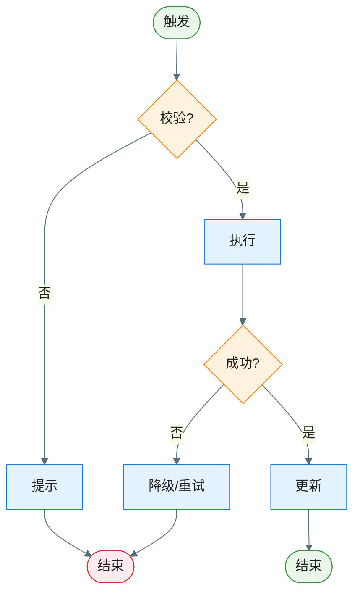

# 关键功能与疑难点/亮点设计：EPIC-[编号] - [EPIC 名称]

> **定位**：本文件对应 `epic-design.md` §六，面向方案评审，将重难点模块的**设计策略与决策逻辑**讲清楚。聚焦"为什么难 → 怎么解决 → 方案的处理流程"，抽象层级与 §五（模块/组件级）对齐，不下沉到类/方法级细节（类图、时序图见 `key-diagram.md`）。
>
> **所属 EPIC**：`epic-design.md` → §六 关键功能与疑难点/亮点设计
>
> **输入**：`epic-design.md` §五（一层架构已通过 Gate 1 确认）
>
> **适用**：仅纳入**技术方案设计上的**疑难点（易踩坑、需专项论证）或亮点（可作为最佳实践/创新点）。简单、显而易见的设计不纳入。
>
> **何时省略**：若无疑难点且无方案亮点，可在 `epic-design.md` §六引用处标注「本 EPIC 无关键疑难点/亮点，省略本文件」。

**Epic**：EPIC-[编号] - [名称]
**关联文件**：`epic-design.md` | `key-diagram.md`
**创建/更新日期**：[YYYY-MM-DD]

---

## 关键设计清单

> 列出本文件包含的所有关键设计点，便于快速定位。

| 编号   | 设计点名称   | 类型         | 关联 key-diagram.md |
| ------ | ------------ | ------------ | ------------------- |
| KD-001 | [设计点名称] | 疑难点/亮点  | §7.2 [类名] / SEQ-xxx / — |
| KD-002 | [设计点名称] | 疑难点/亮点  | — |

---

## KD-001：[设计点名称]

- **类型**：疑难点 | 方案亮点
- **背景/亮点说明**：疑难点→[为何是疑难点，涉及哪些组件或跨层关注点，易出现哪些坑]；亮点→[为何是亮点，创新点或最佳实践，可复用价值]
- **方案选型与取舍**：[对比了哪些候选方案，各自优劣，为什么选当前方案]（疑难点必填，亮点选填）
- **核心方案**：[核心设计策略——用什么思路解决，关键约束是什么，分 2-3 段把方案讲透]
- **关联决策**：[零层/一层架构中的决策点]（若适用）
- **边界条件与注意事项**：[关键边界、异常、并发/生命周期等]（疑难点必填，亮点选填）

### 方案流程图（推荐，方案涉及多步决策或分支逻辑时必须）

> 用流程图将核心方案的**处理逻辑**可视化：先做什么、再做什么、什么条件走哪条分支。粒度与 §五 对齐（组件/模块级），节点使用组件或步骤名称，不涉及具体类名和方法签名。

- **类图 / 时序图位置**：→ `key-diagram.md` §7.2 [相关类/接口名] + SEQ-[xxx]（评审时配合本节一起讲解）

---

## KD-002：[设计点名称]

（结构同上：类型、背景/亮点说明、方案选型与取舍、核心方案、关联决策、边界条件、方案流程图、类图/时序图位置）

---

## Feature 流程图集（逻辑流程，必须）

> **范围**：仅列出**关键流程**，简单、显而易见的流程可不列入。
>
> **完整性**：凡列入的每个关键流程，须**详细完整**——一张流程图覆盖**正常 + 所有异常分支**，从触发条件到所有可能结束状态的完整逻辑路径不得遗漏。

### 流程 1：[流程名称]

| 分支   | 异常ID   | 触发条件 | 对策    |
| ---- | ------ | ---- | ----- |
| 校验失败 | EX-001 |      | 提示用户  |
| 执行失败 | EX-002 |      | 降级/重试 |

### 流程 2：[流程名称]

（结构同流程 1）
