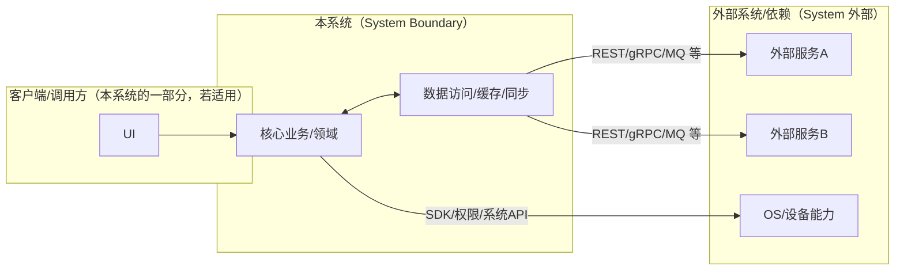
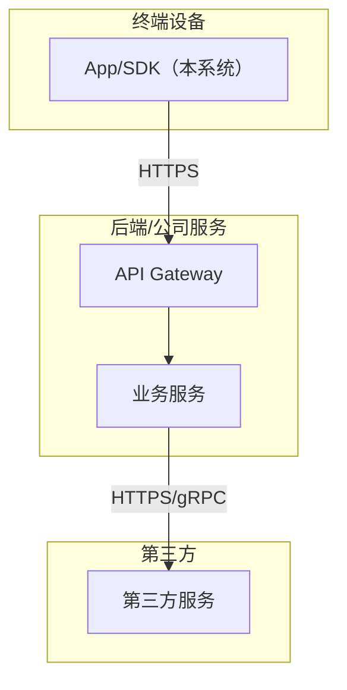
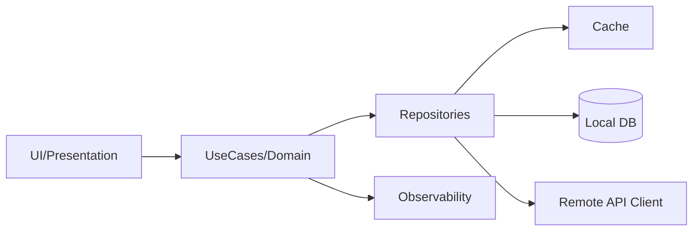
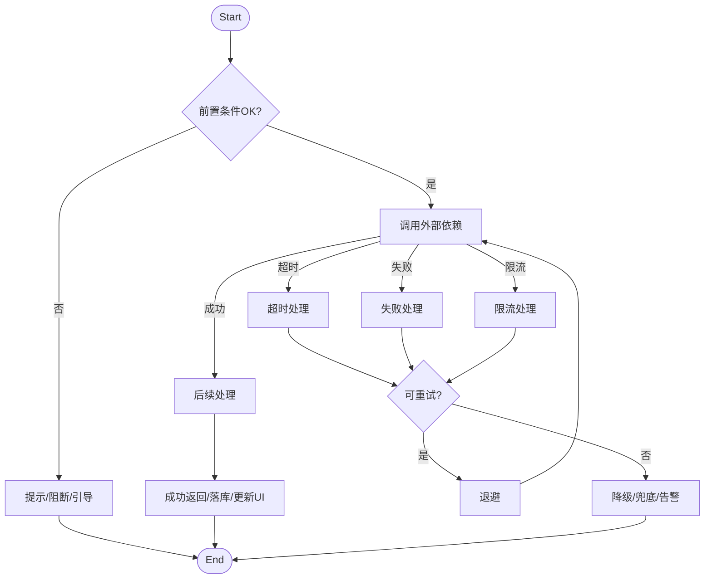
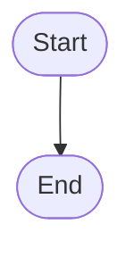

# Plan（工程级蓝图）：[Feature 名称]

**Epic**：EPIC-[编号] - [名称]
**Feature ID**：FEAT-[编号，例如 001]
**Feature Version**：v0.1.0（来自 `spec.md`）
**Plan Version**：v0.1.0
**当前工作分支**：`[epic/... 或 story/... ]`
**Feature 目录**：`specs/epics/EPIC-[编号]-[short-name]/features/FEAT-[编号]-[short-name]/`
**日期**：[YYYY-MM-DD]
**输入**：来自 `Feature 目录/spec.md`

> 规则：
> - Plan 阶段必须包含工程决策、风险评估、算法/功耗/性能/内存评估（量化 + 验收指标）。
> - Implement 阶段**不得**擅自改写 Plan 的技术决策；若必须变更，走增量变更流程并提升 Version。

## 变更记录（增量变更）

| 版本 | 日期 | 变更范围（Feature/Story/Task） | 变更摘要 | 影响模块 | 是否需要回滚设计 |
|---|---|---|---|---|---|
| v0.1.0 | [YYYY-MM-DD] | Feature | 初始版本 |  | 否 |

## 概述

[摘自 Feature 规格说明：核心需求 + 本 Plan 的关键工程决策与取舍]

## Plan-A：工程决策 & 风险评估（必须量化）

### A1. 技术选型（候选方案对比 + 决策理由）

| 决策点 | 候选方案 | 优缺点 | 约束/风险 | 决策 | 决策理由 |
|---|---|---|---|---|---|
| [例如：本地存储] | A / B / C |  |  |  |  |

### A2. 0 层架构设计（对外系统边界、部署、通信、交互）

> 定义：0 层架构设计反映“本系统与外部系统之间的关系”。必须覆盖：结构、部署、通信方式、交互方式与边界。
>
> 要求：
> - 同时给出“一句话描述每个模块/外部系统的职责与边界”。
> - 明确外部依赖的**故障模式**（超时/限流/不可用/返回不一致）与本系统应对策略（重试/降级/兜底/提示）。
> - 明确通信方式（协议/鉴权/重试/幂等/超时/限流）与部署拓扑（端/服务/第三方）。

#### A2.1 外部系统与依赖清单（必须）

| 外部系统/依赖 | 类型（三方/内部服务/设备能力） | 关键能力/数据 | 通信方式（协议/鉴权） | SLA/限流/超时 | 故障模式 | 我方策略 |
|---|---|---|---|---|---|---|
| [例如：Auth Service] | 内部服务 | Token/权限 | HTTPS+OAuth2 | p95≤? / QPS≤? / timeout=? | 超时/限流 | 重试+降级 |

#### A2.2 0 层架构图（系统边界 + 外部交互）



#### A2.3 部署视图（必须）

> 要求：说明各节点部署位置（端上/服务端/第三方）、网络边界、以及关键链路的通信方式。



#### A2.4 通信与交互说明（必须）

- **协议**：REST / gRPC / WebSocket / MQ / 文件 / 设备能力（按实际选择）
- **鉴权**：OAuth2 / JWT / mTLS / API Key（按实际选择）
- **超时与重试**：超时阈值、最大重试次数、退避策略、重试白名单接口
- **幂等**：哪些请求必须幂等、幂等键策略
- **限流**：外部限流策略与我方退避/降级
- **数据一致性**：强一致/最终一致、补偿策略

### A3. 1 层架构设计（系统内部框架图 + 模块拆分 + 接口协议）

> 定义：1 层架构设计描述“系统内部的模块拆分与协作”，包括框架图、模块职责、模块交互、通信方式、接口协议等。

#### A3.1 1 层框架图（必须）



#### A3.2 模块拆分与职责（必须）

> **重要（模块级 UML 规范）**：
> - 本表是本 Feature 的**模块清单（Module Catalog）**，用于驱动后续“模块级详细设计”章节。
> - `A3.4 关键模块设计` 必须 **1:1 覆盖**本表的每个模块（模块名称必须一致；不得遗漏/不得新增幽灵模块）。
> - 对每个模块，必须产出：**1 张 UML 类图（静态） + 2 张 UML 时序图（动态：成功/异常分开）**，并补齐关键异常清单与对策，确保开发可按图落码。

| 模块 | 职责 | 输入/输出 | 依赖 | 约束 |
|---|---|---|---|---|
| [模块A] |  |  |  |  |

#### A3.3 模块协作与通信方式（必须）

> 要求：写清楚“谁调用谁、通过什么方式、传什么、失败如何处理”。如果是异步（队列/事件），必须写清楚消费语义与重放/去重。

- **调用关系**：[模块A → 模块B → 模块C]
- **通信方式**：函数调用 / Binder / HTTP / gRPC / MQ / 事件总线（按实际）
- **接口协议**：数据结构、版本策略、错误码、重试/幂等约束（引用 B4 或 contracts/）
- **并发与线程模型**：关键协作点的并发策略与共享状态保护

#### A3.4 关键模块设计（详细设计 + 取舍，必须）

> 要求：对“关键模块/高风险模块/承载 NFR 的模块”做细化。若包含多个模块，则分模块说明。
>
> **强制（模块级 UML 输出）**：
> - 以 `A3.2 模块拆分与职责` 为准：每个模块必须在本节拥有一个对应小节。
> - 每个模块小节必须包含：
>   - **UML 类图（1 张）**：描述模块内部关键类/接口/数据结构，以及依赖方向（仅画关键点，避免过度细节）
>   - **UML 时序图（成功，1 张）**：描述主调用链路（包含线程/协程边界点、关键状态更新点）
>   - **UML 时序图（异常，1 张）**：用 `alt/else` 覆盖关键异常（超时/IO失败/权限/并发重入/取消/数据损坏等，按模块实际选择）
>   - **异常清单表**：列出异常 → 对策（可重试/不可重试、回滚、一致性、用户提示、可观测性），并与“异常时序图”互相校验，避免遗漏。

##### 模块：[模块名，如 Cache / Sync Engine / Auth / Scheduler]

- **模块定位**：[它解决什么问题、在 1 层架构中的位置]
- **设计目标**：[性能/功耗/一致性/可扩展性/可观测性等]
- **核心数据结构/状态**：[关键实体/状态机/缓存键/索引]
- **对外接口（协议）**：[输入/输出、错误码、版本策略、幂等要求]
- **策略与算法**：[缓存淘汰/LRU、批处理、合并、退避、优先级等]
- **失败与降级**：[超时/限流/不可用/数据损坏/回滚策略]
- **安全与隐私**：[敏感数据处理、加密、权限]
- **可观测性**：[关键日志/指标/埋点]
- **优缺点**：
  - **优点**：[为什么这样做更好]
  - **缺点/代价**：[维护复杂度/资源消耗/边界问题]
  - **替代方案与否决理由**：[A/B/C 对比与否决原因]

###### UML 类图（静态，必须）

```mermaid
classDiagram
  %% TODO: 画清模块边界内的关键类/接口/数据结构，以及依赖方向
  %% 建议：接口（API/Repository/UseCase）+ 核心实现类 + Error/Entity/DTO
```

###### UML 时序图 - 成功链路（动态，必须）

```mermaid
sequenceDiagram
  %% TODO: 主成功链路
  %% 要求：体现调用方/被调用方、返回值、线程/协程上下文切换点、关键状态更新点
```

###### UML 时序图 - 异常链路（动态，必须）

```mermaid
sequenceDiagram
  %% TODO: 异常链路（用 alt/else 覆盖关键异常）
  %% 要求：每个异常分支必须能落到“异常清单表”的对应行
```

###### 关键异常清单（必须，且与异常时序图互校）

| 异常ID | 触发点（步骤/组件） | 触发条件 | 错误类型/错误码 | 可重试 | 对策（降级/回滚/一致性） | 用户提示 | 日志/埋点字段 | 关联 NFR |
|---|---|---|---|---|---|---|---|---|
| EX-001 |  |  |  | 是/否 |  |  |  | NFR-OBS-??? |

> 互校规则（必须通过）：
> - 异常清单表每一行都能在“异常时序图”中找到对应 `alt/else` 分支；
> - 异常时序图中的每个失败分支，也必须在异常清单表中有明确对策（不要只写“记录日志”）。

#####（Capability Feature 场景）交付物与接入契约（若适用则必填）

> 适用：本 Feature 为“埋点/可观测性”“动效合集/组件库”“算法能力/模型SDK”等横切能力时。

- **交付物形态**：SDK / 资源包 / 配置 / 模型文件 / 服务接口（按实际）
- **对外接口（业务接入）**：初始化方式、调用方式、依赖注入点、生命周期要求
- **事件/协议/契约**：事件名/字段/版本；API 协议；资源命名规范；模型输入输出张量定义（按实际）
- **版本与兼容策略**：SemVer/灰度/回滚；向后兼容策略；弃用策略
- **验收标准**：可测量的完成定义（性能/正确性/稳定性/合规），并明确验证入口

#####（算法 Capability Feature 场景）算法交付与工程化清单（若适用则必填）

- **模型提供**：模型来源/版本/训练数据假设（引用来源，不在此新增训练决策）
- **推理部署**：端侧/服务端；运行时（如 NNAPI/自研 runtime）；模型下发/更新策略
- **工程化封装**：算法 SDK/API；线程与资源控制；缓存；降级与回退（无模型/低端机/失败）
- **评估与监控**：离线/线上指标；漂移监测；告警；灰度策略

### A4. 关键流程设计（每个流程一张流程图，含正常 + 全部异常）

> 定义：关键流程设计必须用**流程图（flowchart）**描述，且流程图中必须覆盖正常流程与所有关键异常分支（失败/超时/并发/生命周期等）。
>
> 要求：
> - 若存在多个关键流程（如“登录”“同步”“下单”“上传”等），则每个流程单独一张图。
> - 每张图必须包含：触发条件、关键决策点、外部依赖调用、重试/降级/兜底路径、最终可观测信号（日志/指标/埋点）。

#### 流程 1：[流程名称]



#### 流程 2：[流程名称]



### A5. 技术风险与消解策略（绑定 Story/Task）

| 风险ID | 风险描述 | 触发条件 | 影响范围 | 严重度 | 消解策略 | 对应 Story/Task |
|---|---|---|---|---|---|---|
| RISK-001 |  |  |  | High/Med/Low |  | ST-??? / T??? |

### A6. 边界 & 异常场景枚举（数据/状态/生命周期/并发/用户行为）

- **数据边界**：[空/超大/非法/重复/过期等]
- **状态边界**：[状态机不可达/回退/重入等]
- **生命周期**：[前后台切换/旋转/进程被杀/恢复等]
- **并发**：[多线程/协程/并发写/竞态等]
- **用户行为**：[快速连点/断网/弱网/权限拒绝等]

### A7. 算法评估（如适用）

- **目标**：[要优化什么？]
- **指标**：[准确率/召回率/误报率/时延等]
- **验收标准**：[量化阈值]
- **测试方法**：[离线数据集/线上灰度/AB/回放]
- **风险**：[数据漂移/极端样本/可解释性]

### A8. 功耗评估（必须量化）

- **Top5% 用户模型**：[设备/网络/使用频次/场景]
- **测量口径**：[电流/唤醒/网络请求/定位等]
- **预估增量**：每日 \(mAh\) 增量 ≤ [阈值]（或每次操作平均 ≤ [阈值]）
- **验收上限**：[明确上限与失败处置]
- **降级策略**：[达到阈值时如何降级/关闭]

### A9. 性能评估（必须量化）

- **前台**：[关键路径 p50/p95/p99 时延预算与阈值]
- **后台**：[任务时延/调度频次/失败重试]
- **验收指标**：[阈值 + 测试方法]
- **降级策略**：[缓存/降采样/降精度/延后等]

### A10. 内存评估（必须量化）

- **峰值增量**：≤ [阈值] MB
- **平均增量**：≤ [阈值] MB
- **生命周期**：[在哪些生命周期阶段常驻/释放]
- **风险与对策**：[泄漏点/大对象/缓存策略]
- **验收标准**：[测试方法 + 阈值]

## Plan-B：技术规约 & 实现约束（保留原 spec-kit 输出内容）

### B1. 技术背景（用于统一工程上下文）

> 注意：为保证工具链自动提取信息，下列字段名需保留英文 Key（括号内可补充中文）。

**Language/Version**：[例如：Kotlin 2.x / Java 17 / 需明确]
**Primary Dependencies**：[例如：Jetpack Compose、Room、Ktor 或 需明确]
**Storage**：[如适用，例如：Room/SQLite、DataStore、文件 或 N/A]
**Test Framework**：[例如：JUnit、Robolectric、XCTest、pytest 或 需明确]
**Target Platform**：[例如：Android 8+、iOS 15+、Linux server 或 需明确]
**Project Type**：[single / web / mobile - 决定源码结构]
**Performance Targets**：[例如：60fps、启动耗时、p95 时延等 或 需明确]
**Constraints**：[例如：p95 <200ms、内存 <100MB、离线可用等 或 需明确]
**Scale/Scope**：[例如：DAU、数据规模、页面数等 或 需明确]

### B2. 架构细化（实现必须遵循）

- **分层约束**：[例如：UI 只能调用 Domain；Domain 不能依赖 UI]
- **线程/并发模型**：[主线程/IO/协程/锁策略]
- **错误处理规范**：[统一错误码/异常封装/用户提示]
- **日志与可观测性**：[结构化字段、采样、敏感信息脱敏]

### B3. 数据模型（引用或内联）

- 若已有 `data-model.md`：在此引用并补充关键约束
- 若未单独拆分：在此列出实体、字段、关系、状态机与校验规则

#### B3.1 存储形态与边界（必须）

> 目的：先明确“数据落在哪里、谁负责持久化、数据生命周期”，再谈表结构/键结构。

- **存储形态**：Room/SQLite / DataStore / SharedPreferences / 文件（JSON/CSV/二进制） / 远端服务 / N/A
- **System of Record（权威来源）**：哪一份数据是权威（例如：DB 为准、文件为准、服务端为准）
- **缓存与派生数据**：哪些字段是派生/可重建的（可用于迁移与降级）
- **生命周期**：常驻/前台/后台/退出时持久化；清理/归档策略
- **数据规模与增长**：数量级、写入频次、读写热点（用于索引与分页策略）

#### B3.2 物理数据结构（若使用持久化存储则必填）

> 要求：写到“可实现/可评审/可迁移”的粒度。
> - 若使用数据库：必须列出每张表的字段、约束、索引、外键、典型查询与迁移策略。
> - 若使用 KV/文件：必须写出键名/文件名规则、序列化结构（JSON schema/字段表）、版本与迁移策略。

#####（数据库）表结构清单

| 表 | 用途 | 主键/唯一约束 | 索引 | 外键 | 典型查询（Top3） | 数据量级 |
|---|---|---|---|---|---|---|
|  |  |  |  |  |  |  |

#####（数据库）字段说明模板（每表一份）

**表**：`<table_name>`

| 字段 | 类型 | 约束（NOT NULL/默认值/范围） | 含义 | 来源/生成方式 | 用途（读写场景） |
|---|---|---|---|---|---|
|  |  |  |  |  |  |

#####（数据库）迁移与兼容策略

- **Schema 版本**：v1 / v2 / …（例如：Room `version`）
- **向后兼容**：新增列默认值；字段废弃策略；索引变更策略
- **迁移策略**：Migration 列表、失败回滚/重试策略、数据回填/重建策略

#####（KV/文件）键/文件结构清单（如适用）

| Key/文件 | 用途 | 结构版本 | Schema/字段说明位置 | 迁移策略 |
|---|---|---|---|---|
|  |  |  |  |  |

### B4. 接口规范/协议（引用或内联）

- 若已有 `contracts/`：在此引用端点/协议文件（OpenAPI/Proto/JSON Schema 等）
- 明确版本策略、兼容策略、错误响应格式

#### B4.1 本 Feature 对外提供的接口（必须：Capability Feature/跨模块复用场景）

> 目的：把“能力交付物”写成可联调的契约（不是仅写类名/方法名）。

- **接口清单**：对外暴露的 API/SDK/Repository 接口列表（含用途、调用方）
- **输入/输出**：字段含义、必填/可选、默认值、范围、示例
- **错误语义**：错误码/错误类型、可重试/不可重试、用户可见提示策略
- **幂等与副作用**：哪些调用必须幂等、幂等键/语义、重复调用的效果
- **并发/线程模型**：调用是否线程安全；协程/线程调度要求；取消语义
- **版本与兼容**：SemVer/接口版本号；新增/弃用策略；向后兼容约束

#### B4.2 本 Feature 依赖的外部接口/契约（必须：存在外部依赖时）

> 目的：把 A2.1 的“依赖清单”下沉到“调用级契约”，避免实现期口径不一致。

- **依赖接口清单**：依赖的模块/服务/API（含 owner/路径）
- **调用约束**：超时/重试/退避/限流；缓存策略；一致性假设
- **失败模式与降级**：超时/限流/不一致/不可用时如何处理（与 A2.1 对齐）

#### B4.3 契约工件（contracts/）与引用方式（推荐）

> 推荐：把可机读的契约沉淀为文件，便于测试与演进。

- **contracts/**：`openapi.yaml` / `*.proto` / `json-schema/*.json` / `errors.md` 等
- **变更流程**：契约变更必须更新版本 + 兼容策略 + 关联 Story/Task

### B5. 合规性检查（关卡）

*关卡：必须在进入 Implement 前通过；若不通过，必须明确整改项并绑定到 Story/Task。*

[基于章程/合规性文件确定的检查项]

### B6. 项目结构（本 Feature）

```text
specs/[###-feature-short-name]/
├── spec.md                     # Feature 规格说明（/speckit.specify）
├── plan.md                     # 本文件（/speckit.plan）
├── full-design.md               # 全量技术方案文档（/speckit.fulldesign）
├── tasks.md                    # 任务拆解（/speckit.tasks）
├── research.md                 # 可选：调研产物
├── data-model.md               # 可选：数据模型
├── quickstart.md               # 可选：快速验证/联调指南
└── contracts/                  # 可选：接口契约
```

### B7. 源代码结构（代码库根目录）

<!--
  需执行操作：将下方的占位目录树替换为该功能的具体目录结构。
  删除未使用的选项，并使用实际路径扩展选定的结构（例如：apps/admin、packages/something）。
-->

```text
# 选项1：单项目（默认）
src/
tests/

# 选项2：Web 应用
backend/
frontend/

# 选项3：移动应用 + 接口
api/
android/ 或 ios/
```

**结构决策**：[记录选定的结构，并引用上述捕获的实际目录]

## Story Breakdown（Plan 阶段末尾，必须）

> 规则：
> - Story 是 Feature 的最小可开发单元，用于覆盖对应 FR/NFR。
> - Story 类型必须标注：Functional / Design-Enabler / Infrastructure / Optimization。
> - 这里**只做拆分与映射**，不生成 Task；Task 在 `/speckit.tasks` 阶段生成，且不得改写这里的设计决策。

### Story 列表

#### ST-001：[标题]

- **类型**：Functional / Design-Enabler / Infrastructure / Optimization
- **描述**：[做什么、为什么]
- **目标**：[可验证的结果]
- **覆盖 FR/NFR**：FR-???；NFR-???
- **依赖**：[其他 Story / 外部依赖]
- **可并行**：是/否（原因）
- **关键风险**：是/否（关联 RISK-???）
- **验收/验证方式（高层）**：[如何判断完成；细化到 tasks.md]

#### ST-002：[标题]

- （同上结构）

### Feature → Story 覆盖矩阵

| FR/NFR ID | 覆盖的 Story ID | 备注 |
|---|---|---|
| FR-001 | ST-001 |  |
| NFR-PERF-001 | ST-002 |  |

## Story Detailed Design（L2 二层详细设计：面向开发落码，强烈建议）

> 目标：把每个 Story 的“实现方法”写清楚，做到**不写每行代码**也能明确指导开发如何落地。
>
> 规则：
> - 本节内容属于 Plan 的一部分，视为**权威技术决策输入**（必须纳入版本管理与变更记录）。
> - tasks.md 的每个 Task 应明确引用对应 Story 的详细设计入口（例如：`plan.md:ST-001:4.2 时序图`）。
> - 对每个 Story，必须同时覆盖：**静态结构（类/接口/数据）**、**动态交互（时序）**、**异常矩阵（无遗漏）**、**并发/取消语义**、**验证方式**。

### ST-001 Detailed Design：[标题]

#### 1) 目标 & Done 定义（DoD）

- **目标**：[一句话说明交付能力]
- **DoD（可验证）**：
  - [ ] [功能验收：引用 FR-xxx]
  - [ ] [性能/功耗/内存阈值：引用 NFR-xxx，给出测量方法]
  - [ ] [可靠性/可观测性：引用 NFR-xxx，给出日志/埋点/告警最小集]

#### 2) 代码落点与边界（开发导航）

- **新增/修改目录与文件（建议到包/文件级）**：
  - `app/src/main/...` / `src/...`：[文件路径与职责]
- **分层与依赖约束**：复用 Plan-B:B2（必要时补充本 Story 的额外约束）
- **对外暴露点**：[Repository/UseCase/ViewModel/Service 等；列出函数签名级别的入口]

#### 3) 核心接口与数据契约（签名级别 + 错误语义）

- **接口清单**：
  - `interface XxxRepository { ... }`
  - `class XxxUseCase { ... }`
- **输入/输出约束**：必填/可选、默认值、范围、示例
- **错误语义**：错误类型（Sealed Class/错误码）、可重试/不可重试、用户可见提示策略
- **取消语义**：协程取消/线程中断时必须保证的资源释放与一致性（避免半写入）

#### 4) 静态结构设计（类图/关系图）

```mermaid
classDiagram
  %% TODO: 画清本 Story 新增/修改的核心类、接口、依赖方向
  %% 要求：至少包含 UI/ViewModel/UseCase/Repository/DataSource(若有)/Error/Entity
```

#### 5) 动态交互设计（时序图）

##### 5.1 主成功链路（Happy Path）

```mermaid
sequenceDiagram
  %% TODO: 主链路时序
  %% 要求：体现调用顺序、返回值、线程/协程上下文（主线程/IO）、关键状态更新点
```

##### 5.2 关键异常链路（Failure Paths，必须覆盖全部关键异常）

```mermaid
sequenceDiagram
  %% TODO: 用 alt/else 覆盖关键异常：权限/超时/IO失败/数据损坏/重复/并发重入/取消 等
```

#### 6) 异常场景矩阵（无遗漏清单）

| 场景ID | 触发点（组件/步骤） | 触发条件 | 错误类型/错误码 | 是否可重试 | 用户提示/引导 | 回滚与一致性策略 | 日志/埋点字段 | 覆盖 NFR |
|---|---|---|---|---|---|---|---|---|
| EX-001 |  |  |  | 是/否 |  |  |  | NFR-OBS-??? |

> 校验规则（必须通过）：
> - 上表每一条异常都能在“时序图-异常链路”中找到对应分支；
> - “时序图-异常链路”中的每个失败分支也必须在上表中有明确对策。

#### 7) 并发 / 生命周期 / 资源管理

- **并发策略**：串行/并行；互斥（Mutex/队列）；共享状态保护
- **线程/协程模型**：哪些在主线程、哪些在 IO；切线程边界点
- **生命周期**：旋转/前后台切换/进程被杀（若在范围内则写恢复策略；不适用写原因）
- **资源释放**：文件句柄/游标/连接/缓存的释放时机

#### 8) 验证与测试设计（可执行）

- **单元测试**：覆盖核心逻辑与错误分支（与异常矩阵对齐）
- **集成/端到端**：覆盖用户主流程与关键异常流程
- **NFR 验证**：性能/功耗/内存测量方法、数据集/设备模型、阈值

#### 9) 与 Tasks 的映射（可选但推荐）

| 设计要点 | 建议 Task | 备注 |
|---|---|---|
|  | T??? |  |

### ST-002 Detailed Design：[标题]

（复用 ST-001 的结构）

## 复杂度跟踪（仅当合规性检查存在需说明理由的违规项时填写）

| 违规项 | 必要性说明 | 舍弃更简单方案的原因 |
|---|---|---|
| [例如：第4个子项目] | [当前需求] | [为何更简单方案不满足] |