# Plan（工程级蓝图）：[Feature 名称]

**Epic**：EPIC-[编号] - [名称]
**Feature ID**：FEAT-[编号，例如 001]
**Feature Version**：v0.1.0（来自 `spec.md`）
**Plan Version**：v0.1.0
**Plan Level**：Lite / Standard / Deep（按风险选择；高风险/高不确定性选 Deep）
**当前工作分支**：`[epic/... 或 story/... ]`
**Feature 目录**：`specs/epics/EPIC-[编号]-[short-name]/features/FEAT-[编号]-[short-name]/`
**日期**：[YYYY-MM-DD]
**输入**：来自 `Feature 目录/spec.md`

> 规则：
> - Plan 阶段必须包含工程决策、风险评估、算法/功耗/性能/内存评估（量化 + 验收指标）。
> - Implement 阶段**不得**擅自改写 Plan 的技术决策；若必须变更，走增量变更流程并提升 Version。
> - Plan Level 选择建议：
>   - **Lite**：小改动/低风险（无新契约、无持久化迁移、无复杂动效/并发）— 覆盖 A2、A3.1（第一层）、A3.2（第二层）、Story Breakdown
>   - **Standard**：默认 — 在 Lite 基础上补齐风险/预算落点；A3.3（组件详细设计）**可选**
>   - **Deep**：新契约/持久化迁移/复杂动效与性能预算/并发竞态/灰度回滚等 — 需补齐 A3.3 与关键 Story 的 L2
>
> **图表规范**：所有 Mermaid 图表必须遵循 `.cursor/rules/mermaid-style-guide.mdc` 中定义的 Material Design 配色方案。

## 变更记录（增量变更）

| 版本 | 日期 | 变更范围（Feature/Story/Task） | 变更摘要 | 影响模块 | 是否需要回滚设计 |
|---|---|---|---|---|---|
| v0.1.0 | [YYYY-MM-DD] | Feature | 初始版本 |  | 否 |

## Plan 前置检查（必须，在开始设计前完成）

> **目的**：确保本 Feature 的 plan 设计基于 EPIC 整体考虑，避免与其他 Feature 重复设计共享组件。
>
> **强制规则**：
> - 在开始 Plan 设计之前，**必须完成以下检查**
> - 若 EPIC 的"跨 Feature 技术策略"中已有 Owner Feature 负责某共享能力，本 Feature **必须复用**，不得另起炉灶
> - 若发现新的共享需求，**必须先更新 epic.md 的"跨 Feature 技术策略"章节**，再继续本 plan

### 前置检查清单

- [ ] 已阅读 `epic.md` 的"跨 Feature 技术策略"章节
- [ ] 已确认本 Feature 在 Plan 执行顺序中的位置（是否有前置依赖）
- [ ] 已检查前置 Feature 的 plan（如果存在），识别可复用组件
- [ ] 本 Feature 需要设计的共享能力已在 EPIC 级登记为 Owner

### 依赖的共享能力（从其他 Feature 复用）

> 列出本 Feature 需要使用但由其他 Feature 设计的共享能力。

| 依赖的共享能力 | Owner Feature | Owner Plan 状态 | 如何获取/引用 |
|---|---|---|---|
| [例如：UI 基础框架] | FEAT-001 | Plan Ready / 待设计 | 引用 FEAT-001 plan.md:A3.3:UIModule |
| [例如：错误处理] | FEAT-001 | Plan Ready | 引用 FEAT-001 plan.md:A3.3:ErrorHandler |

> 若 Owner Feature 的 plan 尚未完成，需要：
> - **等待**：Owner Feature 完成 plan 后再继续本 Feature
> - **协商**：与 Owner Feature 负责人协商接口契约，先行设计

### 本 Feature 提供的共享能力（供其他 Feature 复用）

> 若本 Feature 是某共享能力的 Owner，列出需要设计并提供给其他 Feature 的能力。

| 共享能力名称 | 消费方 Feature | 设计位置（本 plan 章节） | 接口/契约位置 |
|---|---|---|---|
| [例如：主题系统] | FEAT-002, FEAT-003 | A3.3:ThemeModule | Plan-B:B4.1 |

### 前置检查结论

- **检查日期**：[YYYY-MM-DD]
- **检查人**：[姓名/角色]
- **结论**：通过 / 需等待 [Feature] / 需先更新 epic.md
- **备注**：[如有阻塞或协商事项]

---

## 概述

[摘自 Feature 规格说明：核心需求 + 本 Plan 的关键工程决策与取舍]

## Plan-A：工程决策 & 风险评估（必须量化）

### A0. 领域概念（Domain Concepts / Glossary，必须）

> **目的**：统一命名与语义口径，成为后续"架构图/流程图/类图/时序图/接口契约"的**命名权威**。
>
> 要求：
> - 只写本 Feature 涉及或新引入的领域概念；已有概念可引用来源（其他 Feature/EPIC/已有模块文档）
> - 每个概念必须给出：名称、定义、关键属性/状态、与其他概念的关系（可用表格或简易概念图）

#### A0.1 领域概念词汇表（必须）

| 概念（中文） | 名称（英文/代码名） | 定义（一句话） | 关键属性/状态（Top3） | 不变量/约束 | 关联概念 |
|---|---|---|---|---|---|
|  |  |  |  |  |  |

#### A0.2 概念关系图（推荐，可选）

> **目的**：用类图语法表达**业务领域概念**之间的关系（非技术实现）。
>
> ⚠️ **重要区分**：本节与 A3.2.1 技术类图的区别
>
> | 维度 | A0.2 领域概念图 | A3.2.1 技术类图 |
> |------|-----------------|---------------|
> | **目的** | 统一业务语言，建立领域模型 | 定义技术实现的静态结构 |
> | **视角** | 业务视角（产品/领域专家能看懂） | 技术视角（开发者能实现） |
> | **内容** | 业务实体、值对象、聚合关系 | UI/ViewModel/UseCase/Repository 等技术类 |
> | **方法** | 只写关键业务属性，不写方法 | 必须写完整的方法签名 |
> | **示例** | `订单`、`用户`、`商品`（业务概念） | `OrderRepository`、`OrderUseCase`（技术组件） |
> | **来源** | 来自需求分析、DDD 领域建模 | 来自架构设计、Clean Architecture |
> | **修改频率** | 业务需求变化时修改 | 技术方案调整时修改 |
>
> **使用建议**：
> - 若 Feature 的业务概念较复杂（多实体/复杂关系），推荐画此图
> - 若 Feature 业务简单（如单一 CRUD），可省略此图，直接进入 A3.2.1 技术类图
> - 此图中的业务概念（如 `订单`）通常在 A3.2.1 中会对应多个技术类（如 `OrderEntity`、`OrderDTO`、`OrderUseCase`）

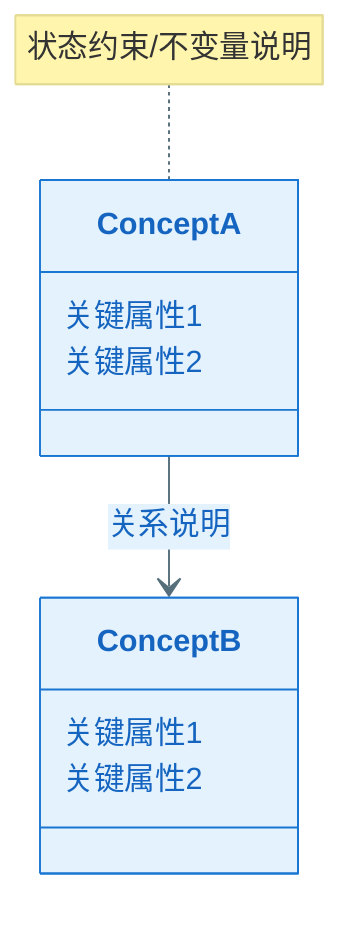

### A1. 技术选型（候选方案对比 + 决策理由）

| 决策点 | 候选方案 | 优缺点 | 约束/风险 | 决策 | 决策理由 |
|---|---|---|---|---|---|
| [例如：本地存储] | A / B / C |  |  |  |  |

### A2. Feature 全景架构（0 层框架图：边界 + 外部依赖）

> **目的**：一张图展示本 Feature 的全貌——它在系统中的位置、与外部的关系、内部的核心组件。
>
> 要求：
> - 明确 Feature 边界：哪些是本 Feature 新增/修改的，哪些是复用已有的
> - 明确外部依赖的**故障模式**与应对策略
> - 无论 Feature 大小，都必须产出全景图（小 Feature 图更简单，但不能省略）

#### A2.1 Feature 全景架构图（必须）

> 一张图展示：Feature 边界、内部核心组件、外部依赖、数据/控制流向

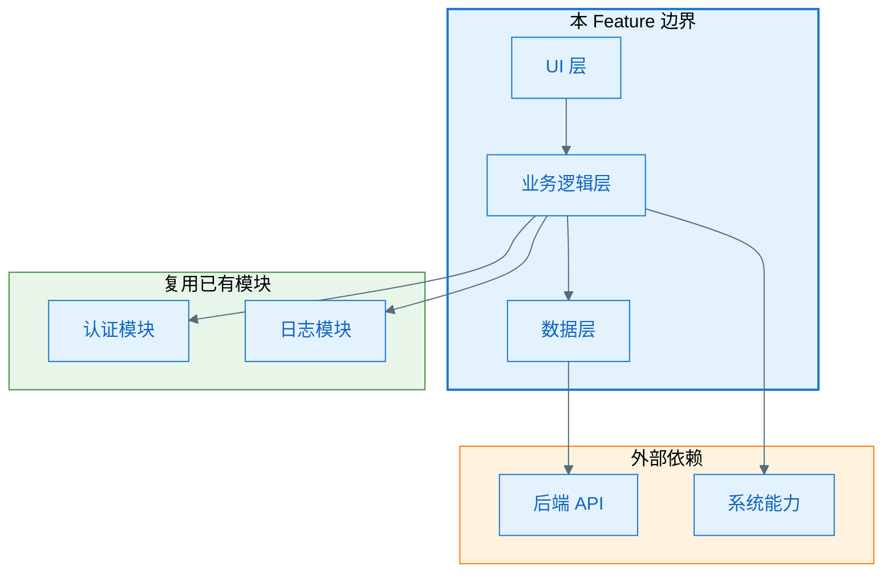

#### A2.1.1 架构设计说明（必须：理由/决策/思考）

> 用文字把"为什么这样画"说清楚，便于评审与后续实现期不走样。
> **注意**：本节聚焦架构设计原理与决策，不涉及具体代码实现。

- **边界与职责**：为什么这些能力属于本 Feature（而不是其他模块）；哪些能力明确不做（Out of Scope）
- **分层与依赖方向**：为何这样分层；为何允许/禁止某些跨层依赖（例如 UI 不直连 DataSource）
- **关键数据流**：数据从哪里来、去哪里（System of Record）、缓存策略与一致性假设
- **外部依赖策略**：对每个关键依赖的失败模式选择了什么策略（重试/退避/降级/熔断/提示），为什么
- **可演进性**：预留哪些扩展点（接口/策略注入/版本兼容）；未来变化下的最小修改面

#### A2.2 外部依赖清单（若有则必填，无依赖时标注 N/A）

> **适用场景**：涉及后端 API、系统能力、第三方 SDK、已有模块等外部依赖时必填。
> 若本 Feature 为纯本地功能（如纯 UI 组件、本地计算），可标注 N/A 并简述原因。

| 依赖项 | 类型 | 提供方（团队名称） | 提供的能力 | 通信方式 | 故障模式 | 我方策略 |
|--------|------|------------------|-----------|----------|----------|----------|
| [后端 API] | 内部服务 | [团队名称] | 数据读写 | HTTPS | 超时/限流/不可用 | 重试+降级 |
| [系统能力] | OS/SDK | [系统/平台] | 权限/存储 | 系统 API | 权限拒绝/不支持 | 提示+引导 |
| [已有模块] | 内部模块 | [团队名称] | 认证/日志 | 函数调用 | — | — |

#### A2.3 通信与交互约束（必须）

- **协议**：REST / gRPC / 函数调用 / 系统 API（按实际选择）
- **超时与重试**：超时阈值、重试次数、退避策略
- **错误处理**：统一错误类型、用户提示策略
- **数据一致性**：强一致/最终一致、补偿策略（如适用）

### A3. Feature 内部设计

> **目的**：展示 Feature 内部"长什么样"——组件划分、类/接口关系、协作方式。
>
> **层次结构**：
> - **第一层（整体框架）**：组件框架图 + 总体设计说明（必须）
> - **第二层（Feature 全景）**：全景类图 + Feature 级时序图/流程图（必须）
> - **第三层（组件详细设计）**：组件内部的类图/时序图/流程图（可选，Plan Level = Deep 时补充）

---

#### A3.1 第一层：整体框架设计（必须）

> **目的**：用一张框架图 + 配套说明，把 Feature 的内部组件划分、依赖关系、协作机制讲清楚。

##### A3.1.1 内部总体框架图（必须）

> **要求**：
> - **必须标注所属工程模块名称**（如 `:feature:gallery`、`:core:data`）
> - **静态结构**：用**实线箭头**（`-->`）表示依赖/调用方向（谁依赖谁）
> - **动态协作**：用**虚线箭头**（`-..->`）表示事件/回调/异步消息
> - **跨层约束**：明确禁止的依赖（如：UI 不得直接依赖 DataSource）

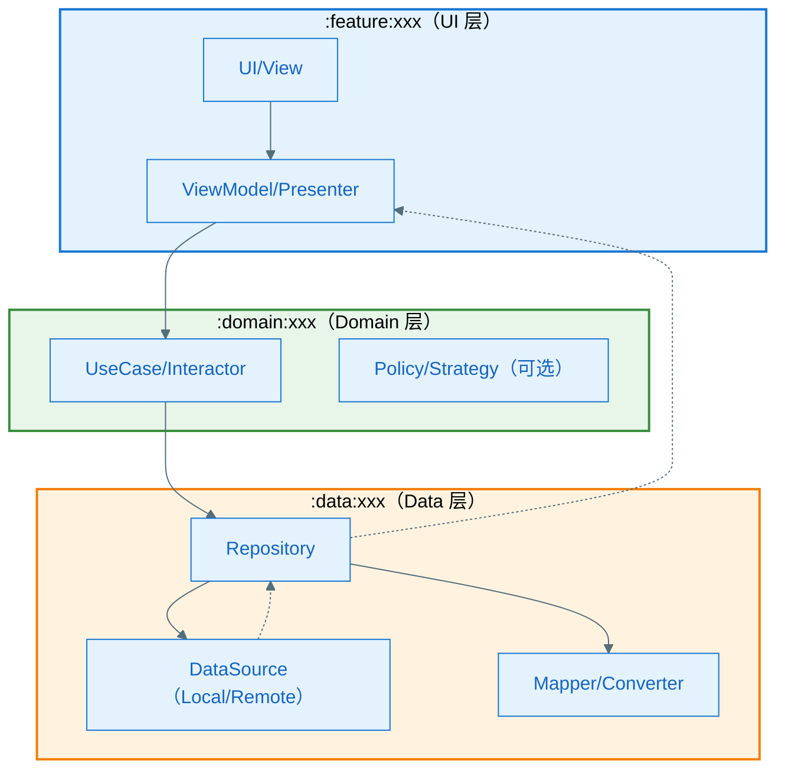

> **跨层约束**：UI 不得直接依赖 DataSource；Domain 不得依赖 UI

##### A3.1.2 总体设计说明（必须）

###### A3.1.2.1 组件清单与职责（必须）

> **重要**：本表是 Feature 的**组件目录（Component Catalog）**，驱动后续设计。

| 组件 | 所属模块 | 职责（一句话） | 输入/输出 | 依赖 | 约束 |
|------|----------|---------------|-----------|------|------|
| [组件A] | `:module:xxx` | [做什么] | [输入→输出] | [依赖哪些组件/外部] | [线程/生命周期/并发约束] |

###### A3.1.2.2 组件协作时序图（必须）

> **目的**：用时序图展示组件之间的**端到端协作流程**，覆盖正常 + 关键异常。
> **与第二层区别**：本节聚焦"组件间协作概览"，第二层 A3.2.2 聚焦"类/方法级调用细节"。

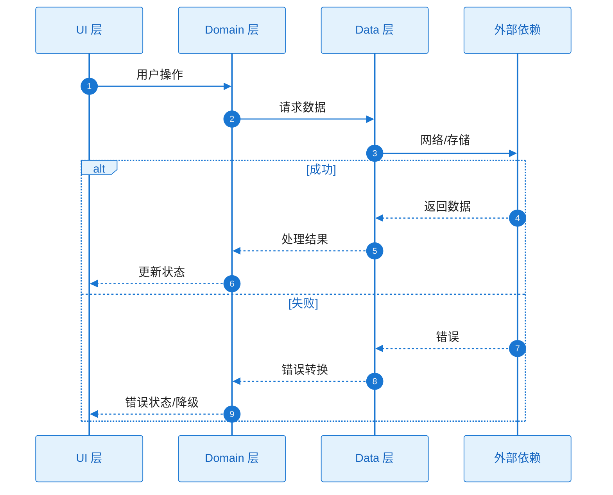

###### A3.1.2.3 关键设计决策（必须）

> **目的**：记录"为什么这样设计"的关键决策，便于评审与后续追溯。

| 决策点 | 候选方案 | 决策 | 决策理由 | 影响范围 | 引用来源 |
|--------|----------|------|----------|----------|----------|
| [例如：状态管理] | A/B/C |  |  | [组件/接口/数据] | spec.md / plan.md:A1 |
| [例如：缓存策略] | A/B/C |  |  |  | Plan-B:B3 |
| [例如：错误体系] | A/B/C |  |  |  | Plan-B:B2/B4 |

###### A3.1.2.4 主要风险与权衡

- **权衡点**：[例如：实时性 vs 功耗]
- **已知风险**：[例如：外部依赖 SLA 不稳定 → 需降级]（详见 A4 风险与消解策略）

---

#### A3.2 第二层：Feature 全景（必须）

> **目的**：从整个 Feature 纵览全局——静态结构（类图）+ 动态行为（时序图/流程图）。

##### A3.2.1 全景类图（必须）

> **要求**：
> - **必须覆盖所有关键类/接口**：UI / ViewModel / UseCase / Repository / DataSource / Entity / DTO / Error / Mapper
> - **类与接口必须写出方法签名**：方法名 + 参数 + 返回值
> - **依赖方向必须正确**：上层依赖下层，禁止"下层反依赖上层"

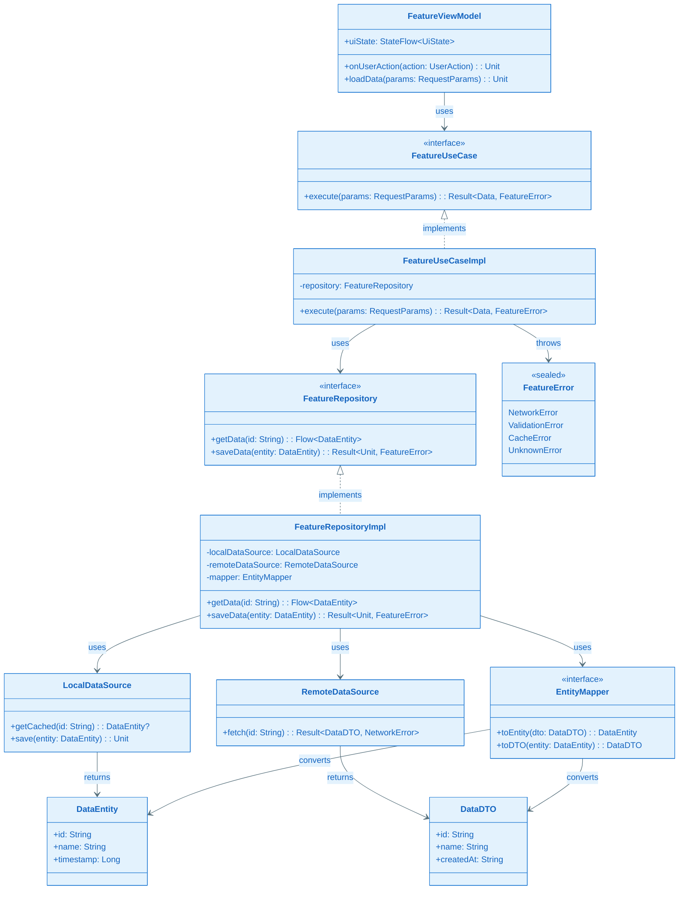

###### 关键类职责说明

| 类/接口 | 层级 | 职责 | 关键方法 |
|---------|------|------|----------|
| `FeatureViewModel` | UI | 管理 UI 状态，处理用户交互 | `onUserAction()`, `loadData()` |
| `FeatureUseCase` | Domain | 封装业务逻辑，协调数据流 | `execute()` |
| `FeatureRepository` | Data | 数据访问抽象层，协调本地/远程数据源 | `getData()`, `saveData()` |
| `LocalDataSource` | Data | 本地缓存数据访问 | `getCached()`, `save()` |
| `RemoteDataSource` | Data | 远程 API 数据访问 | `fetch()` |
| `EntityMapper` | Data | 数据模型转换（DTO ↔ Entity） | `toEntity()`, `toDTO()` |
| `DataEntity` | Domain | 领域数据模型（业务层使用） | - |
| `DataDTO` | Data | 数据传输对象（网络层使用） | - |
| `FeatureError` | Domain | 错误类型体系 | - |

##### A3.2.2 Feature 时序图集（方法调用流程，必须）

> **要求**：
> - 列出 Feature 级别的所有关键流程
> - 每个流程 1 张时序图，覆盖**类/方法级调用细节**
> - 同图包含正常 + 关键异常（用 `alt/else`）

| Seq ID | 流程名称 | 覆盖的异常（EX-xxx） |
|--------|----------|----------------------|
| SEQ-001 | [流程名称] | EX-001, EX-002 |

###### SEQ-001：[流程名称]

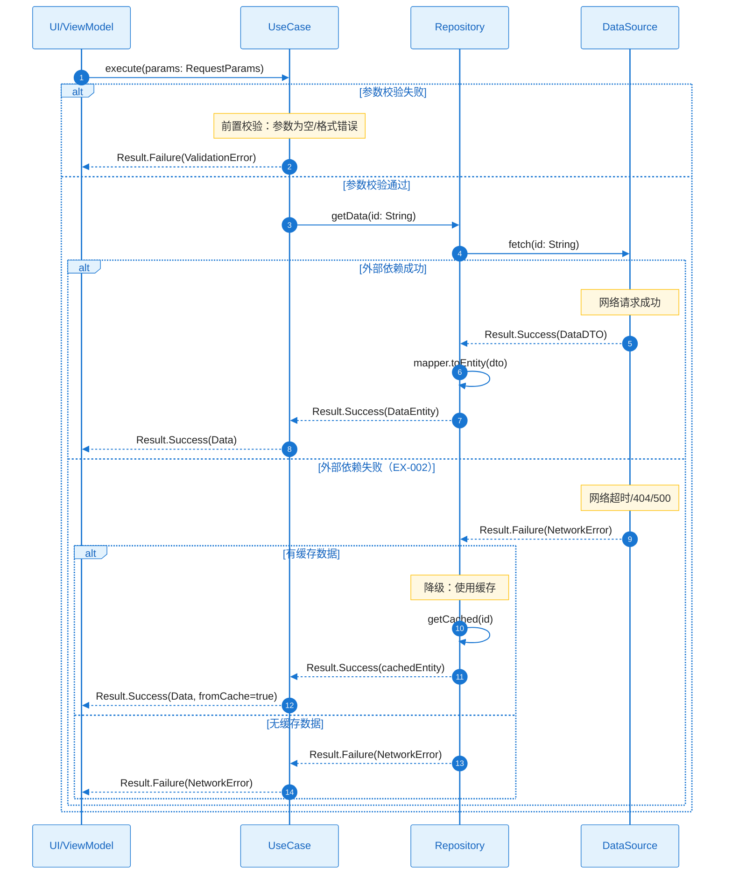

###### 方法签名对照表（与类图 A3.2.1 保持一致）

| 参与者 | 方法调用 | 完整签名 | 返回值说明 |
|--------|----------|----------|------------|
| UI → UseCase | `execute(params)` | `execute(params: RequestParams): Result<Data, FeatureError>` | 成功返回 Data，失败返回 FeatureError |
| UseCase → Repository | `getData(id)` | `getData(id: String): Flow<DataEntity>` | 返回数据流 |
| Repository → DataSource | `fetch(id)` | `fetch(id: String): Result<DataDTO, NetworkError>` | 网络请求结果 |
| Repository → Mapper | `toEntity(dto)` | `toEntity(dto: DataDTO): DataEntity` | DTO 转换为 Entity |
| Repository → Cache | `getCached(id)` | `getCached(id: String): DataEntity?` | 可能为空 |

##### A3.2.3 Feature 流程图集（逻辑流程，必须）

> **要求**：
> - 列出 Feature 级别的所有关键流程（与 A3.2.2 时序图一一对应）
> - 每个流程 1 张流程图，覆盖正常 + 异常分支

###### 流程 1：[流程名称]

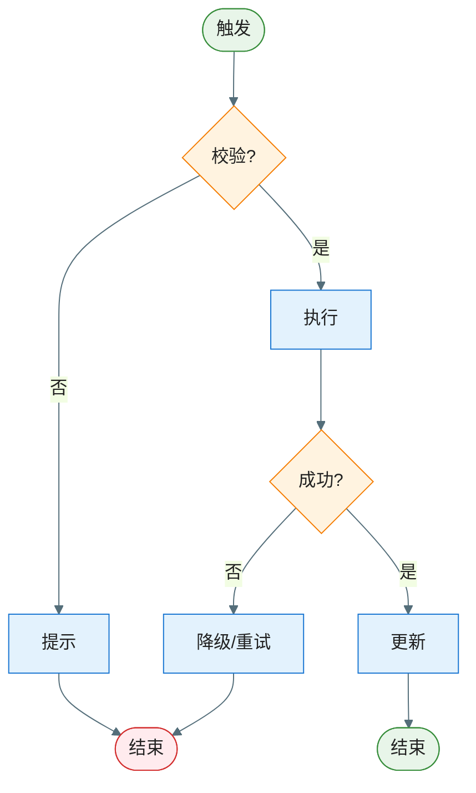

| 分支 | 异常ID | 触发条件 | 对策 |
|------|--------|----------|------|
| 校验失败 | EX-001 |  | 提示用户 |
| 执行失败 | EX-002 |  | 降级/重试 |

---

#### A3.3 第三层：组件内部详细设计（可选）

> **定位**：当第二层（全景类图 + Feature 时序图/流程图）已足够指导开发时，本节可省略。
>
> **何时需要补充**：
> - 组件内部逻辑复杂（多状态机/多策略/复杂校验）
> - 组件有独立的异常处理体系
> - Plan Level = Deep（新契约/持久化迁移/并发竞态等）
>
> **输出要求**：对需要细化的组件，产出：类图 + 时序图 + 流程图 + 异常清单

##### 组件：[组件名]

- **定位**：[解决什么问题]
- **对外接口**：[方法签名、错误类型]
- **失败与降级**：[异常处理策略]

###### 组件类图

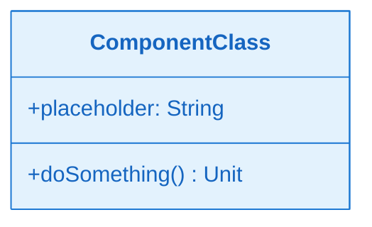

###### 组件时序图（含正常+异常）

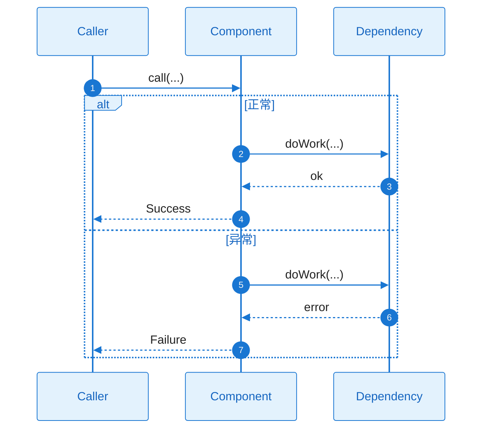

###### 组件流程图（含正常+异常）

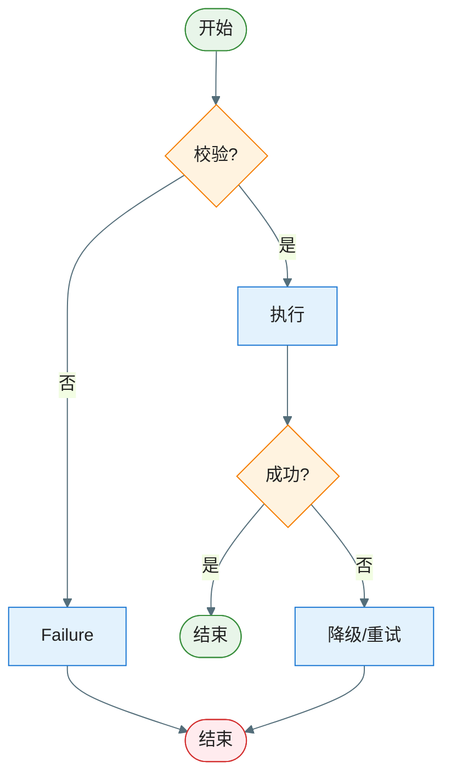

###### 异常清单

| 异常ID | 触发条件 | 错误类型 | 可重试 | 对策 |
|--------|----------|----------|--------|------|
| EX-001 |  |  | 是/否 |  |

---

#### A3.4 附录：设计规范与自检（模板说明，实际输出时可删除）

> ⚠️ **模板说明**：本节为写作指南，实际输出 plan.md 时可删除或折叠。

##### 类图粒度控制

**✅ 应该包含**：
- 公共接口/抽象类（组件间契约）
- 核心实现类
- 数据模型（Entity、DTO）
- 错误类型体系
- 公共方法签名（参数 + 返回值）

**❌ 不应该包含**：
- 私有辅助方法
- 自动生成的 getter/setter
- 第三方库的类（除非自定义扩展）
- Android SDK 基类

##### 图表一致性自检清单

- [ ] `A3.1.1` 框架图中的组件 **100% 覆盖** `A3.1.2.1` 的组件清单
- [ ] `A3.1.2.1` 组件清单中的每个组件在 `A3.2.1` 类图中至少有 1 个对应类/接口
- [ ] `A3.2.1` 类图中的所有公共方法都写了**完整签名**
- [ ] `A3.2.2` 时序图中的所有 `participant` 在 `A3.2.1` 类图中都有对应类/接口
- [ ] `A3.2.2` 时序图中的所有方法调用在 `A3.2.1` 类图中都有对应定义
- [ ] `A3.2.2` 时序图集与 `A3.2.3` 流程图集一一对应
- [ ] `A3.3`（若启用）对相关组件提供完整的细化设计

---

#### A3.5 Capability/算法 Feature 附加章节（若适用）

##### （Capability Feature）交付物与接入契约

> 适用于：埋点/组件库/算法SDK 等横切能力 Feature

- **交付物形态**：SDK / 资源包 / 配置 / 服务接口
- **对外接口**：初始化、调用方式、生命周期
- **版本与兼容**：SemVer、向后兼容策略
- **验收标准**：可测量的完成定义

##### （算法 Feature）算法交付清单

- **模型提供**：来源/版本/输入输出
- **推理部署**：端侧/服务端、运行时
- **降级策略**：无模型/低端机/失败时的兜底
- **监控**：指标/告警/灰度

### A4. 技术风险与消解策略（绑定 Story/Task）

| 风险ID | 风险描述 | 触发条件 | 影响范围 | 严重度 | 消解策略 | 对应 Story/Task |
|---|---|---|---|---|---|---|
| RISK-001 |  |  |  | High/Med/Low |  | ST-??? / T??? |

### A5. 边界 & 异常场景枚举（数据/状态/生命周期/并发/用户行为）

- **数据边界**：[空/超大/非法/重复/过期等]
- **状态边界**：[状态机不可达/回退/重入等]
- **生命周期**：[前后台切换/旋转/进程被杀/恢复等]
- **并发**：[多线程/协程/并发写/竞态等]
- **用户行为**：[快速连点/断网/弱网/权限拒绝等]

#### A5.1 场景 → 应对措施对照表（必须）

> 目的：把"枚举"落到"可执行对策"，并与 A3.2.3 / A3.2.2 / A3.3 的异常分支互校。
>
> **对策类型说明**：
> - **技术对策**：通过代码/架构层面解决（重试/退避/降级/回滚/补偿/去重/限流等）
> - **设计对策**：需产品/设计层面介入（交互引导/文案提示/流程简化/功能裁剪等），标注 `TODO(PM)` 或 `TODO(UX)` 待确认

| 场景ID | 场景类别 | 触发条件（可复现） | 影响 | 预期行为（对用户/对系统） | 技术对策 | 设计对策（产品/UX） | 观测信号（日志/埋点/指标） | 映射（流程/时序/异常ID） |
|---|---|---|---|---|---|---|---|---|
| SC-001 | 数据 |  |  |  | [重试/降级/...] | [引导文案/流程简化/N/A] |  | 流程1 / SEQ-001 / EX-001 |

### A6. 算法评估（如适用）

> 适用于：推荐算法、检测算法、分类算法、生成算法等涉及机器学习/AI 的场景。

#### A6.1 客观指标（必须量化）

| 指标 | 目标值 | 备注 |
|---|---|---|
| 准确率 (Precision) | ≥ [阈值]% | 例如：≥ 90% |
| 召回率 (Recall) | ≥ [阈值]% | 例如：≥ 85% |
| 响应时延 (p95) | ≤ [阈值] ms | 例如：≤ 200ms |
| [其他指标] | [目标值] | 根据算法类型补充 |

#### A6.2 主观指标（如适用）

- **可用性评分**：≥ **4.0 分** (满分 5 分，用户样本 ≥ 100 人)
- **评分维度**：[相关性/准确性/易用性等]
- **达标标准**：平均分 ≥ 4.0，且 < 3 分的比例 ≤ 10%

#### A6.3 降级策略（必须）

| 触发条件 | 降级策略 |
|---|---|
| 低端设备/弱网 | 使用轻量模型、本地缓存 |
| 算法失败 | 降级到规则策略或默认推荐 |

### A7. 功耗评估（必须量化，基于场景）

> **计算公式**：
> - 单次功耗 (mAh) = 平均电流增量 (mA) × 使用时长 (秒) / 3600
> - 每日功耗增量 (mAh) = 单次功耗 × 每日使用次数 × 功能渗透率 / 5%
>
> **温升计算公式**（工程估算）：
> - 温升 (°C) ≈ (电流增量 (mA) / 1000 × 3.7V) × 热阻 (8°C/W) × 修正系数
> - 修正系数：短时操作（<10s）约 0.4，持续操作（>1min）约 1.0

#### A7.1 Top 5% 重度用户模型

| 维度 | 定义 |
|---|---|
| 设备型号 | [例如：中端机型，4000mAh 电池] |
| 使用频次 | [例如：每天使用功能 X 次] |
| 使用场景 | [前台使用/后台运行] |

#### A7.2 功耗与温升场景评估（逐场景列出）

##### 场景 1：[场景名称]

| 参数 | 数值 | 计算 |
|---|---|---|
| 电流增量 | [例如：30 mA] | 相对 Baseline |
| 使用时长 | [例如：5 秒] | 单次操作时长 |
| 每日使用次数 | [例如：3 次] | Top5% 用户 |
| 功能渗透率 | [例如：1%] | 实际使用用户占比 |
| **每日功耗增量** | **[计算结果] mAh** | 30×5/3600×3×1%/5% = 0.025 mAh |
| **预估温升** | **[计算结果] °C** | 0.111×8×0.4 = 0.36°C ✅ |

##### 场景 2：[场景名称]

（同上结构，按需添加）

#### A7.3 汇总与验收标准

| 场景 | 每日功耗 (mAh) | 温升 (°C) | 是否达标 |
|---|---|---|---|
| 场景 1 | 0.025 | 0.36 | ✅ |
| 场景 2 | [实测] | [实测] | ✅/❌ |
| **总计** | **[汇总]** | - | - |

**验收标准**：
- 每日功耗增量：≤ [阈值] mAh（例如：≤ 10 mAh）
- 单场景温升：≤ **0.5°C**（任何场景）
- 失败处置：超标必须优化，不得上线

#### A7.4 降级策略（必须）

| 触发条件 | 降级策略 |
|---|---|
| 功耗/温升超标 | 降低执行频率、间歇执行 |
| 低电量模式（<20%） | 关闭后台任务，仅前台触发 |
| 高温保护（>40°C） | 暂停功能，待温度降低后恢复 |

### A8. 性能评估（必须量化，基于场景）

#### A8.1 测试设备基线

| 维度 | 定义 |
|---|---|
| 设备型号 | [例如：小米 11（中端机型）] |
| 系统版本 | [例如：Android 12] |
| 网络环境 | [例如：4G 良好信号] |

#### A8.2 性能场景与指标（根据功能类型选择适用场景）

##### A8.2.1 启动/加载场景（如适用）

| 场景 | 指标 | 验收标准 (p95) | 实测 |
|---|---|---|---|
| 冷启动 | 启动耗时 | ≤ 2000ms | [实测] |
| 热启动 | 启动耗时 | ≤ 1000ms | [实测] |
| 页面首屏加载 (TTI) | 加载耗时 | ≤ 1000ms | [实测] |
| 功能模块初始化 | 加载耗时 | ≤ 1500ms | [实测] |

**性能预算分解**（关键场景必填）：
- [场景名称] 总预算 [X]ms = 网络 [X]ms + 解析 [X]ms + 渲染 [X]ms + 其他 [X]ms

##### A8.2.2 UI 交互场景（必须，统一验收标准）

> **通用 UI 性能标准**（适用于所有点击、滑动、输入、动画等交互）：

| 指标类型 | 验收标准 | 说明 |
|---|---|---|
| 点击/输入响应 (p95) | ≤ 200ms | 用户操作到视觉反馈的时延 |
| 页面切换/动画流畅度 | 平均 ≥ 55fps，p95 ≥ 50fps | 动画、过渡、滑动等场景 |
| 卡顿率 (Jank Rate) | ≤ 5% | 单帧耗时 >16.67ms 的比例 |

**本功能涉及的 UI 交互场景**（列出关键场景即可）：
- [场景 1]：[例如：商品列表滑动] → 遵循通用标准
- [场景 2]：[例如：页面切换动画] → 遵循通用标准
- [场景 3]：[例如：搜索输入响应] → 遵循通用标准

##### A8.2.3 后台任务场景（如适用）

| 场景 | 指标 | 验收标准 (p95) | 实测 |
|---|---|---|---|
| 后台数据同步 | 完成时间 | ≤ 30s | [实测] |
| 文件下载/上传 | 完成时间 | [根据文件大小] | [实测] |
| 后台计算任务 | 完成时间 | ≤ 10s | [实测] |

**约束**：CPU 占用平均 ≤ 10%，避免影响前台

#### A8.3 验收标准汇总

| 场景类型 | 核心指标 | 验收标准 (p95) |
|---|---|---|
| 冷启动 | 启动耗时 | ≤ 2000ms |
| 页面加载 | TTI | ≤ 1000ms |
| UI 交互（通用） | 响应时延 | ≤ 200ms |
| UI 交互（通用） | 帧率 | ≥ 55fps (平均), ≥ 50fps (p95) |
| 后台任务 | 完成时间 | ≤ 30s（根据任务调整） |

**失败处置**：性能超标必须优化，不得上线

#### A8.4 降级策略（必须）

| 触发条件 | 降级策略 |
|---|---|
| 低端设备 | 降低动画帧率、简化 UI、减少并发 |
| 弱网环境（< 100KB/s） | 启用缓存、降低图片质量 |
| 高负载（CPU > 80%） | 延迟非关键任务、降低刷新频率 |

### A9. 内存评估（必须量化，基于场景）

#### A9.1 测试设备基线

| 维度 | 定义 |
|---|---|
| 设备型号 | [例如：小米 11，8GB RAM] |
| 测试场景 | 前台使用 + 后台驻留 + 生命周期切换 |

#### A9.2 内存场景与指标

| 场景 | 指标 | 验收标准 | 实测 |
|---|---|---|---|
| 前台正常使用 | 内存增量 (PSS) | ≤ 50MB | [实测] |
| 前台重度使用（峰值） | 内存增量 (PSS) | ≤ 100MB | [实测] |
| 后台驻留 | 内存占用 | ≤ 20MB | [实测] |
| 长时间使用（30分钟） | 内存趋势 | 无持续增长 | [实测] |
| 内存泄漏检测 | 反复进入退出 10 次 | 回到 Baseline ±5MB | [实测] |
| 内存抖动 | GC 频率 | ≤ 10 次/分钟 | [实测] |

#### A9.3 内存增量分解（用于优化指导）

| 内存来源 | 预估 (MB) | 实测 (MB) | 占比 | 优化方向 |
|---|---|---|---|---|
| 图片/位图缓存 | [预估] | [实测] | [%] | LRU 缓存、降低分辨率 |
| 数据缓存 | [预估] | [实测] | [%] | 限制缓存大小 |
| UI 视图 | [预估] | [实测] | [%] | 简化布局、复用 View |
| [其他] | [预估] | [实测] | [%] | - |
| **总计** | **[预估]** | **[实测]** | **100%** | - |

#### A9.4 内存泄漏风险点（必须）

| 风险点 | 典型原因 | 预防措施 |
|---|---|---|
| Activity/Fragment 泄漏 | 静态引用、单例持有、监听器未移除 | 使用 ApplicationContext、onDestroy 取消注册 |
| Bitmap 泄漏 | 缓存策略不当 | 使用图片库（Glide/Coil）、LRU 缓存 |
| 线程泄漏 | AsyncTask/Thread 持有 Activity | 使用协程、及时取消 |
| 集合类泄漏 | Map/List 无限增长 | 使用 LRU、限制大小 |

#### A9.5 降级策略（必须）

| 触发条件 | 降级策略 |
|---|---|
| 可用内存 < 200MB | 清理缓存 |
| 可用内存 < 100MB | 停止预加载、降低图片质量 |
| 低内存设备（< 4GB RAM） | 降低缓存大小、减少并发 |
| onTrimMemory 回调 | 根据级别清理缓存 |

**失败处置**：内存增量超标（>100MB）或内存泄漏，必须修复，不得上线

### A10. 安全评估（如适用）

> 适用于：涉及用户数据、网络通信、存储、权限的功能；不适用标注"N/A"。

#### A10.1 数据安全（如涉及用户数据）

| 安全点 | 防护措施 | 验收标准 |
|---|---|---|
| 敏感数据存储 | 加密存储（AES-256/Keystore） | 无明文密码/Token |
| 数据传输 | HTTPS + 证书校验 | 所有接口 HTTPS |
| 日志安全 | 敏感字段脱敏 | Release 无敏感日志 |

#### A10.2 权限安全（如申请敏感权限）

| 权限类型 | 使用场景 | 申请时机 | 拒绝后处理 |
|---|---|---|---|
| [例如：位置] | [场景] | 首次使用时 | 功能降级/提示 |

**原则**：最小权限、运行时申请、拒绝后降级

#### A10.3 代码安全 & 合规性

- **代码混淆**：ProGuard/R8 混淆（Release 版本）
- **合规性**：GDPR/个人信息保护法（隐私政策 + 用户同意）

---

### A11. 兼容性评估（必须）

#### A11.1 系统版本兼容

| 平台 | 支持范围 | 测试覆盖 |
|---|---|---|
| Android | API 24+ (Android 7.0+) | API 24, 28, 31, 33 |
| iOS | iOS 13+ | iOS 13, 15, 16 |

#### A11.2 设备兼容

| 设备类型 | 测试机型 | 降级方案 |
|---|---|---|
| 低端机（2GB RAM） | 小米 Redmi 9A | 降低图片质量、关闭动画 |
| 中端机（6GB RAM） | 小米 11 | 无需降级 |
| 高端机/折叠屏/平板 | [机型] | 适配大屏/多窗口 |

#### A11.3 屏幕兼容

- **适配要点**：使用 dp/sp、响应式布局、适配刘海屏/挖孔屏（WindowInsets）
- **测试覆盖**：小屏（720p）、常规屏（1080p）、全面屏、折叠屏

#### A11.4 网络兼容

| 网络环境 | 降级方案 |
|---|---|
| 弱网（< 100KB/s） | 启用缓存、降低图片质量 |
| 断网 | 提示无网络、显示缓存数据 |

#### A11.5 数据库升级兼容（如涉及数据库）

> **目的**：确保老用户升级到新版本时，数据库能正常迁移，不丢失数据。

##### A11.5.1 数据库升级场景

| 升级路径 | 变更内容 | 升级策略 | 回滚策略 |
|---|---|---|---|
| v1 → v2 | 新增表/字段 | Migration 自动迁移 | 兼容降级（不删除旧字段） |
| v1 → v2 | 删除表/字段 | 迁移前备份 + 数据迁移 | 恢复备份 |
| v1 → v2 | 字段类型变更 | 数据转换 + 迁移 | 保留旧数据格式兼容 |
| 跨版本升级 | v1 → v3（跳过 v2） | 支持连续 Migration 链 | 降级到 v1 |

##### A11.5.2 数据库 Schema 版本管理

```kotlin
// 示例（Room）
@Database(
    entities = [User::class, Order::class],
    version = 3,  // 当前版本
    exportSchema = true
)
abstract class AppDatabase : RoomDatabase() {
    companion object {
        val MIGRATION_1_2 = object : Migration(1, 2) {
            override fun migrate(database: SupportSQLiteDatabase) {
                // v1 → v2：新增字段
                database.execSQL("ALTER TABLE User ADD COLUMN age INTEGER DEFAULT 0")
            }
        }
        
        val MIGRATION_2_3 = object : Migration(2, 3) {
            override fun migrate(database: SupportSQLiteDatabase) {
                // v2 → v3：新增表
                database.execSQL("CREATE TABLE IF NOT EXISTS `Order` ...")
            }
        }
    }
}
```

##### A11.5.3 数据库兼容性验收

- **向前兼容**：老版本 DB 升级到新版本，数据正常迁移
- **降级兼容**：新版本 DB 可被老版本识别（保留旧字段）
- **跨版本兼容**：支持跨版本升级（v1 → v3）
- **失败处理**：Migration 失败时，保留原数据不损坏，提示用户

##### A11.5.4 测试场景（必须）

| 测试场景 | 验收标准 |
|---|---|
| 老用户升级（v1 → v2） | 数据完整、功能正常 |
| 跨版本升级（v1 → v3） | 数据完整、功能正常 |
| Migration 失败 | 不损坏原数据、提示用户 |
| 降级（v2 → v1） | 老版本能读取数据（如支持） |

#### A11.6 APK 版本升级兼容（必须）

> **目的**：确保老用户升级到新版本时，功能正常、数据不丢失、体验平滑。

##### A11.6.1 版本升级路径

| 升级路径 | 变更类型 | 兼容性要求 | 测试场景 |
|---|---|---|---|
| v1.0 → v1.1（小版本） | Bug 修复、功能增强 | 完全兼容 | 覆盖安装 |
| v1.0 → v2.0（大版本） | 新功能、架构升级 | 向后兼容 | 覆盖安装 + 数据迁移 |
| 跨版本升级 | v1.0 → v3.0（跳过 v2.0） | 支持跨版本升级 | 覆盖安装 + 连续迁移 |

##### A11.6.2 升级兼容性检查清单

- **数据兼容**：
  - [ ] SharedPreferences / DataStore 数据能正常读取
  - [ ] 数据库能正常升级（见 A11.5）
  - [ ] 本地文件（缓存/下载）能正常访问
  
- **功能兼容**：
  - [ ] 核心功能正常（登录、主流程）
  - [ ] 用户设置保留（偏好、配置）
  - [ ] 历史数据正常展示
  
- **UI 兼容**：
  - [ ] 启动画面正常（无崩溃/白屏）
  - [ ] 导航流程正常（深度链接/通知跳转）
  
- **权限兼容**：
  - [ ] 新增权限在合适时机申请（非启动时）
  - [ ] 老版本已授予的权限保留

##### A11.6.3 升级灰度策略

| 灰度阶段 | 覆盖用户 | 观测指标 | 回滚条件 |
|---|---|---|---|
| 灰度 1% | 新用户 + 活跃老用户 | Crash 率 < 0.5% | Crash 率 > 1% |
| 灰度 10% | 随机抽样 | Crash 率 < 0.5%，核心流程正常 | 核心流程成功率 < 95% |
| 灰度 50% | 随机抽样 | 用户反馈无严重问题 | 严重 Bug 报告 > 5 个 |
| 全量 100% | 所有用户 | 持续监控 | 随时回滚 |

##### A11.6.4 版本回滚方案

| 回滚场景 | 回滚策略 |
|---|---|
| 严重 Bug/Crash 率高 | 紧急回滚到上个稳定版本 |
| 数据迁移失败 | 恢复数据库备份，回滚版本 |
| 兼容性问题 | 特定机型/系统版本定向回滚 |

##### A11.6.5 测试场景（必须）

| 测试场景 | 验收标准 |
|---|---|
| 覆盖安装升级 | 功能正常、数据保留 |
| 卸载重装 | 首次安装流程正常 |
| 跨版本升级（v1 → v3） | 功能正常、数据完整 |
| 降级安装（v2 → v1） | 提示不支持或兼容处理 |
| 杀进程后重启 | 状态恢复正常 |

#### A11.7 第三方库兼容（如使用）

| 依赖库 | 版本 | 最低 API 要求 |
|---|---|---|
| [例如：Glide] | 4.x | API 19+ |

#### A11.8 不兼容场景处理

| 场景 | 处理策略 |
|---|---|
| 低版本系统 | 提示升级或不支持 |
| 低端设备 | 功能降级 |
| 特殊机型 | 黑名单 + 降级方案 |
| 数据库升级失败 | 提示用户、保留原数据 |
| APK 降级安装 | 提示不支持或兼容处理 |

---

## Plan-B：技术规约 & 实现约束（保留原 spec-kit 输出内容）

### B0. Plan-A ↔ Plan-B 一致性与互校（必须）

> **目的**：保证 Plan-A 的架构/决策在 Plan-B 的规约/契约/数据模型中有明确落点，避免"上层说一套、规约写一套"。

| Plan-A（决策/假设/约束） | Plan-B（落点） | 自检规则（必须通过） |
|---|---|---|
| A0 领域概念命名 | B3/B4/Story | 术语一致；中英文/代码名一致 |
| A1 技术选型 | B1/B2 | 依赖与分层规约匹配；无矛盾 |
| A2 外部依赖与故障策略 | B4.2 | 超时/重试/降级/错误语义一致 |
| A3 数据一致性/缓存假设 | B3.1/B3.2 | SoR、缓存、迁移策略一致 |
| A3 错误与失败传播 | B2/B4 | 错误分类/错误码/用户提示一致 |


### B1. 技术背景（用于统一工程上下文）

> 注意：为保证工具链自动提取信息，下列字段名需保留英文 Key（括号内可补充中文）。

**Language/Version**：[例如：Kotlin 2.x / Java 17 / 需明确]
**Primary Dependencies**：[例如：Jetpack Compose、Room、Ktor 或 需明确]
**Storage**：[如适用，例如：Room/SQLite、DataStore、文件 或 N/A]
**Test Framework**：[例如：JUnit、Robolectric、XCTest、pytest 或 需明确]
**Target Platform**：[例如：Android 8+、iOS 15+、Linux server 或 需明确]
**Project Type**：[single / web / mobile - 决定源码结构]
**Performance Targets**：[例如：60fps、启动耗时、p95 时延等 或 需明确]
**Constraints**：[例如：p95 <200ms、内存 <100MB、离线可用等 或 需明确]
**Scale/Scope**：[例如：DAU、数据规模、页面数等 或 需明确]

### B2. 架构细化（实现必须遵循）

- **分层约束**：[例如：UI 只能调用 Domain；Domain 不能依赖 UI]
- **线程/并发模型**：[主线程/IO/协程/锁策略]
- **错误处理规范**：[统一错误码/异常封装/用户提示]
- **日志与可观测性**：[结构化字段、采样、敏感信息脱敏]

### B3. 数据模型（引用或内联）

- 若已有 `data-model.md`：在此引用并补充关键约束
- 若未单独拆分：在此列出实体、字段、关系、状态机与校验规则

#### B3.1 存储形态与边界（必须）

> 目的：先明确"数据落在哪里、谁负责持久化、数据生命周期"，再谈表结构/键结构。

- **存储形态**：Room/SQLite / DataStore / SharedPreferences / 文件（JSON/CSV/二进制） / 远端服务 / N/A
- **System of Record（权威来源）**：哪一份数据是权威（例如：DB 为准、文件为准、服务端为准）
- **缓存与派生数据**：哪些字段是派生/可重建的（可用于迁移与降级）
- **生命周期**：常驻/前台/后台/退出时持久化；清理/归档策略
- **数据规模与增长**：数量级、写入频次、读写热点（用于索引与分页策略）

#### B3.2 物理数据结构（若使用持久化存储则必填）

> 要求：写到"可实现/可评审/可迁移"的粒度。
> - 若使用数据库：必须列出每张表的字段、约束、索引、外键、典型查询与迁移策略。
> - 若使用 KV/文件：必须写出键名/文件名规则、序列化结构（JSON schema/字段表）、版本与迁移策略。

##### （数据库）表结构清单

| 表 | 用途 | 主键/唯一约束 | 索引 | 外键 | 典型查询（Top3） | 数据量级 |
|---|---|---|---|---|---|---|
|  |  |  |  |  |  |  |

##### （数据库）字段说明模板（每表一份）

**表**：`<table_name>`

| 字段 | 类型 | 约束（NOT NULL/默认值/范围） | 含义 | 来源/生成方式 | 用途（读写场景） |
|---|---|---|---|---|---|
|  |  |  |  |  |  |

##### （数据库）迁移与兼容策略

- **Schema 版本**：v1 / v2 / …（例如：Room `version`）
- **向后兼容**：新增列默认值；字段废弃策略；索引变更策略
- **迁移策略**：Migration 列表、失败回滚/重试策略、数据回填/重建策略

##### （KV/文件）键/文件结构清单（如适用）

| Key/文件 | 用途 | 结构版本 | Schema/字段说明位置 | 迁移策略 |
|---|---|---|---|---|
|  |  |  |  |  |

### B4. 接口规范/协议（引用或内联）

- 若已有 `contracts/`：在此引用端点/协议文件（OpenAPI/Proto/JSON Schema 等）
- 明确版本策略、兼容策略、错误响应格式

#### B4.1 本 Feature 对外提供的接口（必须：Capability Feature/跨模块复用场景）

> 目的：把"能力交付物"写成可联调的契约（不是仅写类名/方法名）。

- **接口清单**：对外暴露的 API/SDK/Repository 接口列表（含用途、调用方）
- **输入/输出**：字段含义、必填/可选、默认值、范围、示例
- **错误语义**：错误码/错误类型、可重试/不可重试、用户可见提示策略
- **幂等与副作用**：哪些调用必须幂等、幂等键/语义、重复调用的效果
- **并发/线程模型**：调用是否线程安全；协程/线程调度要求；取消语义
- **版本与兼容**：SemVer/接口版本号；新增/弃用策略；向后兼容约束

#### B4.2 本 Feature 依赖的外部接口/契约（必须：存在外部依赖时）

> 目的：把 A2.2 的"依赖清单"下沉到"调用级契约"，避免实现期口径不一致。

- **依赖接口清单**：依赖的模块/服务/API（含 owner/路径）
- **调用约束**：超时/重试/退避/限流；缓存策略；一致性假设
- **失败模式与降级**：超时/限流/不一致/不可用时如何处理（与 A2.2 对齐）

#### B4.3 契约工件（contracts/）与引用方式（推荐）

> 推荐：把可机读的契约沉淀为文件，便于测试与演进。

- **contracts/**：`openapi.yaml` / `*.proto` / `json-schema/*.json` / `errors.md` 等
- **变更流程**：契约变更必须更新版本 + 兼容策略 + 关联 Story/Task

### B5. 合规性检查（关卡）

*关卡：必须在进入 Implement 前通过；若不通过，必须明确整改项并绑定到 Story/Task。*

[基于章程/合规性文件确定的检查项]

### B6. 项目结构（本 Feature）

```text
specs/[###-feature-short-name]/
├── spec.md                     # Feature 规格说明（/speckit.specify）
├── plan.md                     # 本文件（/speckit.plan）
├── tasks.md                    # 任务拆解（/speckit.tasks）
├── research.md                 # 可选：调研产物
├── data-model.md               # 可选：数据模型
├── quickstart.md               # 可选：快速验证/联调指南
└── contracts/                  # 可选：接口契约
```

### B7. 源代码结构（代码库根目录）

<!--
  需执行操作：将下方的占位目录树替换为该功能的具体目录结构。
  删除未使用的选项，并使用实际路径扩展选定的结构（例如：apps/admin、packages/something）。
-->

```text
# 选项1：单项目（默认）
src/
tests/

# 选项2：Web 应用
backend/
frontend/

# 选项3：移动应用 + 接口
api/
android/ 或 ios/
```

**结构决策**：[记录选定的结构，并引用上述捕获的实际目录]

## Story Breakdown（Plan 阶段末尾，必须）

> **核心原则**：
> - **Feature** = 需求视角，必须可独立交付用户价值
> - **Story** = 技术视角，按技术边界拆分 Feature，不要求独立交付，允许依赖关系
>
> **拆分规则**：
> - Story 是 Feature 的最小可开发单元，用于覆盖对应 FR/NFR。
> - Story 类型必须标注：Functional / Design-Enabler / Infrastructure / Optimization。
> - **工作量约束**：单个 Story 预估工作量 **≤ 10 人天**（约 2 周），建议 **3-8 人天**。
> - **粒度判断**：若 Story 预估超过 10 人天，必须继续拆分（按层/按模块/按风险/按场景）。
> - 这里**只做拆分与映射**，不生成 Task；Task 在 `/speckit.tasks` 阶段生成，且不得改写这里的设计决策。

### Story 拆分策略（选择合适的策略）

> 根据 Feature 特点选择拆分策略，可组合使用。

#### 策略 1：按架构层次拆分（水平拆分）

适用于：新功能开发、模块重构、各层可并行

```
ST-001: Data 层 - 数据存储与网络请求 (Infrastructure, 3-5天)
ST-002: Domain 层 - 业务逻辑与用例 (Design-Enabler, 3-5天)
ST-003: UI 层 - 界面展示与交互 (Functional, 4-6天)
```

**优点**：各层独立开发，适合团队并行  
**注意**：需定义清晰的接口契约，ST-003 完成后 Feature 才可交付

#### 策略 2：Walking Skeleton + 增量（端到端拆分）

适用于：复杂功能、高不确定性、需快速验证端到端链路

```
ST-001: 搭建端到端骨架 (Infrastructure, 3-5天)
  └─ 最小可用链路：UI → Domain → Data（Mock 数据）
  
ST-002: 完善核心功能 (Functional, 4-6天)
  └─ 接入真实数据、错误处理、状态管理
  
ST-003: 扩展与优化 (Functional/Optimization, 3-5天)
  └─ 高级功能、性能优化、边界处理
```

**优点**：快速验证技术方案，降低风险  
**注意**：ST-001 虽不可交付，但能跑通完整链路

#### 策略 3：按风险隔离拆分

适用于：技术风险高、依赖第三方 SDK、算法/性能敏感

```
ST-001: 高风险技术预研 (Infrastructure, 3-5天, RISK-HIGH)
  └─ SDK 选型、兼容性测试、降级方案
  
ST-002: 核心功能实现 (Functional, 4-6天)
  └─ 依赖 ST-001，实现业务逻辑
  
ST-003: 完善与优化 (Optimization, 2-4天)
  └─ 性能优化、边界处理
```

**优点**：先攻克风险，避免返工  
**注意**：ST-001 必须产出明确的技术决策与可用方案

#### 策略 4：按依赖关系拆分（自底向上）

适用于：基础设施升级、框架迁移、共享能力建设

```
ST-001: 基础设施搭建 (Infrastructure, 3-5天)
  └─ 网络框架、数据库、日志系统
  
ST-002: 核心模块迁移 (Design-Enabler, 4-6天)
  └─ 依赖 ST-001，迁移关键业务模块
  
ST-003: 批量迁移与清理 (Functional, 4-6天)
  └─ 依赖 ST-002，迁移剩余模块，移除旧框架
```

**优点**：依赖关系清晰，便于分阶段推进  
**注意**：ST-001/ST-002 不可交付，ST-003 完成后 Feature 才可交付

#### 策略 5：按场景/流程拆分（垂直拆分）

适用于：复杂流程、多个子场景、可独立验证的功能点

```
ST-001: 主流程实现 (Functional, 5-7天)
  └─ 正常路径：用户操作 → 业务处理 → 结果展示
  
ST-002: 异常处理 (Functional, 3-5天)
  └─ 网络异常、数据异常、用户取消等
  
ST-003: 扩展场景 (Functional, 3-5天)
  └─ 高级功能、特殊场景、边界情况
```

**优点**：每个 Story 相对完整，便于验收  
**注意**：避免场景过于零碎，保持合理粒度

### Story 拆分自检清单（必须通过）

**拆分前检查**：
- [ ] Story 预估工作量 ≤ 10 人天？（若超过，继续拆分）
- [ ] Story 在 A3.1.2.1 组件边界内？（不得新增组件）
- [ ] Story 依赖关系清晰？（无循环依赖）
- [ ] Story 有明确的技术验收标准？（DoD 可验证）
- [ ] Story 覆盖至少 1 个 FR 或 NFR？（避免无价值 Story）

**拆分粒度检查**：
- [ ] 若 Story > 10 人天：按层/按模块/按风险继续拆分
- [ ] 若 Story < 2 人天且无法独立验收：考虑合并到其他 Story
- [ ] 若 Story 包含"和""或""以及"等连接词过多：可能粒度过粗

**依赖关系检查**：
- [ ] Infrastructure/Design-Enabler 类型的 Story 有明确的消费方？
- [ ] Functional 类型的 Story 依赖的前置 Story 已明确？
- [ ] Story 链路清晰？（可画 DAG 依赖图）

### Story 列表

#### ST-001：[标题]

- **类型**：Functional / Design-Enabler / Infrastructure / Optimization
- **描述**：[做什么、为什么]
- **目标**：[可验证的结果]
- **预估工作量**：[X 人天]（必填，≤ 10 人天）
- **覆盖 FR/NFR**：FR-???；NFR-???
- **依赖**：[其他 Story / 外部依赖 / 无]
- **可并行**：是/否（原因）
- **关键风险**：是/否（关联 RISK-???）
- **验收/验证方式（高层）**：[如何判断完成；细化到 tasks.md]
- **交付物**：[代码/文档/配置/方案]

#### ST-002：[标题]

- （同上结构）

### Story 依赖关系图（推荐，便于可视化依赖）

> 使用 Mermaid 图表展示 Story 之间的依赖关系与执行顺序

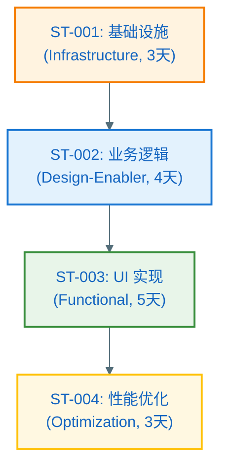

> 说明：箭头表示依赖方向（例如 ST-002 依赖 ST-001）

### Feature → Story 覆盖矩阵

| FR/NFR ID | 覆盖的 Story ID | 备注 |
|---|---|---|
| FR-001 | ST-001, ST-003 | 主流程 |
| FR-002 | ST-003 | UI 交互 |
| NFR-PERF-001 | ST-004 | 性能优化 |

### Story 工作量汇总（用于 Feature 整体评估）

| Story ID | 类型 | 预估工作量（人天） | 依赖关系 | 是否并行 |
|---|---|---|---|---|
| ST-001 | Infrastructure | 3 | 无 | - |
| ST-002 | Design-Enabler | 4 | ST-001 | 否 |
| ST-003 | Functional | 5 | ST-002 | 否 |
| ST-004 | Optimization | 3 | ST-003 | 否 |
| **总计** | - | **15 人天** | - | - |

> 说明：
> - 若有并行 Story，实际日历时间可缩短
> - 预估仅供参考，实际执行时在 tasks.md 中细化

## Story Detailed Design（L2 二层详细设计：面向开发落码，建议在 L0/L1 定稿后补齐）

> 目标：在 L0（全景边界）与 L1（组件/协作）方案评审通过后，再把每个 Story 的"落码方式"写清楚；做到**不写每行代码**也能明确指导开发如何落地。
> 建议顺序：先完成 Plan-A 的 A2/A3（0/1 层设计）→ 再按需补齐本节（L2）。
>
> 规则：
> - 本节内容属于 Plan 的一部分，视为**权威技术决策输入**（必须纳入版本管理与变更记录）。
> - tasks.md 的每个 Task 应明确引用对应 Story 的详细设计入口（例如：`plan.md:ST-001:4.2 时序图`）。
> - 对每个 Story，必须同时覆盖：**静态结构（类/接口/数据）**、**动态交互（时序）**、**异常矩阵（无遗漏）**、**并发/取消语义**、**验证方式**。
>
> **硬约束（Story 级设计边界）**：
> - **Story 级设计不得新增组件级概念**。Story Detailed Design 只能在 A3.1.2.1/A3.3 已定义的组件边界内做细化，不得：
>   - 新增组件（A3.1.2.1 未列出的组件）
>   - 新增核心类/接口（A3.2.1 全景类图未定义的关键抽象）
>   - 新增错误类型/错误码体系（A3.3 异常清单未覆盖的错误分类）
> - **若发现需要新增上述内容**，必须：
>   1. 回到 A3.1.2.1/A3.3 修订组件级设计
>   2. 提升 Plan Version（例如 v0.1.0 → v0.2.0）
>   3. 在变更记录中注明影响范围
> - **Review 否决依据**：任何违反此约束的 Story 设计输出，应被驳回并要求修订。

### 📊 设计粒度对比表（必读：避免设计层级混乱）

> **目的**：明确 Feature 级、组件级、Story 级设计的粒度差异，确保设计层次清晰、不重复、不遗漏。

| 设计层级 | 章节 | 类图粒度 | 时序图粒度 | 何时产出 | 典型内容 |
|---------|------|----------|------------|----------|----------|
| **Feature 全局设计** | A3.2.1 | 所有关键类的公共接口（签名级别） | 端到端主流程（跨组件交互） | **必须产出** | UI/ViewModel/UseCase/Repository/DataSource/Entity/DTO/Error/Mapper 的完整静态结构 |
| **组件详细设计** | A3.3 | 组件内部所有类（含 private 类） | 组件内部交互（方法间调用） | Plan Level = Deep 时产出 | 复杂组件（如状态机、策略模式）的内部实现 |
| **Story 详细设计** | C1 (Story Detailed Design) | 仅涉及本 Story 的类（可细化到 private 方法） | Story 实现路径（可细化到实现细节） | Plan Level = Deep 时产出 | 单个 Story 的落码方案，包含并发、取消、测试设计 |

#### 🎯 粒度判断规则

##### Feature 级设计（A3.2，必须）

**何时使用**：任何 Feature 都必须产出

**类图包含**：
- ✅ 所有组件的公共接口/抽象类（如 `interface FeatureRepository`）
- ✅ 核心实现类（如 `class FeatureRepositoryImpl`）
- ✅ 数据模型（Entity、DTO）
- ✅ 错误体系（Sealed Class）
- ✅ 工具类（Mapper、Converter）
- ❌ 私有辅助类
- ❌ 方法内部实现细节

**时序图包含**：
- ✅ UI → ViewModel → UseCase → Repository → DataSource 的完整调用链
- ✅ 正常流程 + 关键异常分支（用 alt/else）
- ❌ 方法内部的 if/else 分支
- ❌ 循环/重试的实现细节

##### 组件级设计（A3.3，可选）

**何时使用**：
- 组件内部逻辑复杂（多状态机/多策略）
- Plan Level = Deep
- 新增契约/持久化迁移/并发竞态

**类图包含**：
- ✅ 组件内部所有类（含 private 类）
- ✅ 状态机/策略模式的结构
- ✅ 复杂校验器的类设计

**时序图包含**：
- ✅ 组件内部方法间的调用关系
- ✅ 状态转换的时序逻辑

##### Story 级设计（C1，可选）

**何时使用**：
- Plan Level = Deep
- Story 实现路径复杂（多条件分支/并发/取消语义）
- 需要明确落码方案

**类图包含**：
- ✅ 仅涉及本 Story 的类（从 A3.2.1 中提取）
- ✅ 可细化到 private 方法（如有必要）
- ❌ 不得新增 A3.2.1 未定义的核心类/接口

**时序图包含**：
- ✅ Story 的完整实现路径（可细化到实现细节）
- ✅ 并发/取消/资源释放的时序
- ✅ 单元测试/集成测试的验证点

#### 🔀 粒度选择决策树

```
开始
  ↓
是否是新 Feature？
  ├─ 是 → 必须产出 A3.2.1 全景类图 + A3.2.2 时序图集
  └─ 否 → 跳过
  ↓
组件逻辑是否复杂？（多状态机/策略模式/新契约）
  ├─ 是 → 产出 A3.3 组件详细设计
  └─ 否 → 跳过
  ↓
Plan Level 是否为 Deep？
  ├─ 是 → 产出 C1 Story 详细设计
  └─ 否 → 在 A3.2 基础上直接进入 tasks.md
```

#### ⚠️ 常见错误与纠正

| 错误做法 | 为什么错 | 正确做法 |
|---------|---------|---------|
| 在 Story 设计中新增核心类 | 违反组件边界，影响全局设计 | 回到 A3.2.1 修订全景类图，提升 Plan Version |
| Feature 类图画了 private 方法 | 过度设计，维护成本高 | 只画公共接口，private 方法在 Story 级细化 |
| 时序图画了每个 if/else 分支 | 可读性差，维护成本高 | 合并为关键异常分支（用 alt/else） |
| Story 设计省略了并发/取消语义 | 实现时容易出现竞态条件/资源泄漏 | 在 Story 设计中明确并发策略和取消处理 |
| Feature 类图缺少 Mapper | 数据转换逻辑散落在 Repository 中 | 在 A3.2.1 中补充 EntityMapper 类 |

### ST-001 Detailed Design：[标题]

#### 1) 目标 & Done 定义（DoD）

- **目标**：[一句话说明交付能力]
- **DoD（可验证）**：
  - [ ] [功能验收：引用 FR-xxx]
  - [ ] [性能/功耗/内存阈值：引用 NFR-xxx，给出测量方法]
  - [ ] [可靠性/可观测性：引用 NFR-xxx，给出日志/埋点/告警最小集]

#### 2) 代码落点与边界（开发导航）

- **新增/修改目录与文件（建议到包/文件级）**：
  - `app/src/main/...` / `src/...`：[文件路径与职责]
- **分层与依赖约束**：复用 Plan-B:B2（必要时补充本 Story 的额外约束）
- **对外暴露点**：[Repository/UseCase/ViewModel/Service 等；列出函数签名级别的入口]

#### 3) 核心接口与数据契约（签名级别 + 错误语义）

- **接口清单**：
  - `interface XxxRepository { ... }`
  - `class XxxUseCase { ... }`
- **输入/输出约束**：必填/可选、默认值、范围、示例
- **错误语义**：错误类型（Sealed Class/错误码）、可重试/不可重试、用户可见提示策略
- **取消语义**：协程取消/线程中断时必须保证的资源释放与一致性（避免半写入）

#### 4) 静态结构设计（类图/关系图）

##### 技术路径实现说明（必须：先讲清楚"怎么实现"，再画类图）

> **目的**：用精炼的文字说清楚该 Story 的实现核心与关键技术路径，让评审者和开发者在看类图前就理解"为什么这样设计"。
>
> **要求**：
> - 3-5 段精炼文字（每段 2-3 句话）
> - 覆盖：核心实现思路、关键技术选型、主要类职责、数据流向、失败处理策略
> - 不写代码细节，聚焦技术方案的"为什么"和"怎么做"

**核心实现思路**：
- [一句话说明本 Story 的实现核心]
- [关键技术决策：为什么选择这个方案而非其他方案]

**关键类与职责划分**：
- [列出 2-4 个核心类，每个类一句话说明职责]
- [说明类之间的协作关系：谁依赖谁，为什么这样分层]

**数据流向与转换**：
- [输入数据从哪里来，经过哪些转换，最终到哪里去]
- [如涉及缓存/持久化，说明数据一致性策略]

**失败处理与边界**：
- [关键错误场景的处理策略：重试/降级/提示]
- [资源释放与取消语义：协程取消时如何保证一致性]

**性能/并发考量**（如适用）：
- [是否涉及并发/异步，如何保证线程安全]
- [是否有性能优化点：缓存/预加载/懒加载]

**示例（供参考）**：

<details>
<summary>展开示例</summary>

**核心实现思路**：
本 Story 实现"离线优先"的数据加载策略。优先从本地缓存读取，后台异步刷新远程数据。选择 Flow + Room 方案而非 LiveData，因为需要支持多订阅者和背压控制。

**关键类与职责划分**：
- `CachedDataRepository`：协调本地/远程数据源，实现离线优先策略
- `LocalDataSource`（Room DAO）：提供本地缓存的响应式查询
- `RemoteDataSource`（Retrofit）：封装网络请求，处理 HTTP 错误
- `DataSyncScheduler`：后台同步协调器，使用 WorkManager 定期刷新

**数据流向与转换**：
用户触发查询 → Repository 立即返回缓存（Flow） → 同时发起远程请求 → 远程成功后写入 Room → Flow 自动推送更新。DTO 到 Entity 的转换在 Repository 层完成（使用 EntityMapper），确保 Domain 层不依赖网络数据结构。

**失败处理与边界**：
网络请求失败时，若有缓存则继续使用缓存（标记为 stale），若无缓存则返回错误。协程取消时，Repository 通过 `ensureActive()` 检查点中断长时间操作，避免无效网络请求。

**性能/并发考量**：
Room 的 Flow 查询在 IO 线程执行，ViewModel 在主线程订阅。使用 `distinctUntilChanged()` 避免重复 UI 更新。远程请求使用 `Mutex` 防止并发重复刷新。

</details>

---

##### 类图（必须）

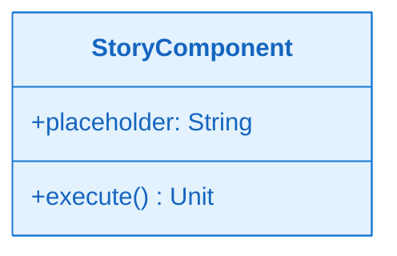

##### 关键类职责说明（必须：与技术路径说明呼应）

> **目的**：对类图中的每个类进行职责说明，与上面的"技术路径实现说明"相呼应，确保设计意图清晰。
>
> **要求**：
> - 每个类说明其核心职责（做什么）
> - 关键方法说明其用途（为什么需要这个方法）
> - 设计考量说明技术决策（为什么这样设计）

| 类/接口 | 核心职责 | 关键方法说明 | 设计考量 |
|---|---|---|---|
| [类名] | [做什么] | [方法1]：用途；[方法2]：用途 | [为何这样设计] |

#### 5) 时序图（含正常+异常）

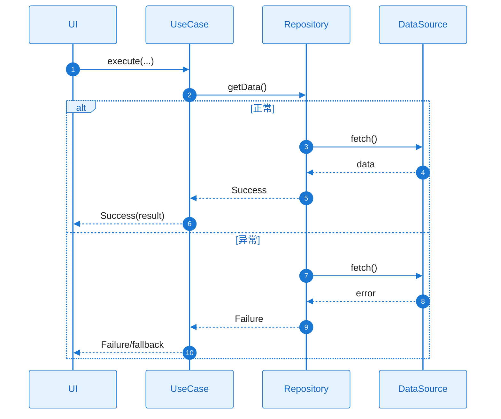

#### 6) 异常矩阵

| 异常ID | 触发条件 | 错误类型 | 可重试 | 对策 |
|---|---|---|---|---|
| EX-001 |  |  | 是/否 |  |

#### 7) 并发 / 生命周期 / 资源管理

- **并发策略**：串行/并行；互斥（Mutex/队列）；共享状态保护
- **线程/协程模型**：哪些在主线程、哪些在 IO；切线程边界点
- **生命周期**：旋转/前后台切换/进程被杀（若在范围内则写恢复策略；不适用写原因）
- **资源释放**：文件句柄/游标/连接/缓存的释放时机

#### 8) 验证与测试设计（可执行）

- **单元测试**：覆盖核心逻辑与错误分支（与异常矩阵对齐）
- **集成/端到端**：覆盖用户主流程与关键异常流程
- **NFR 验证**：性能/功耗/内存测量方法、数据集/设备模型、阈值

#### 9) 与 Tasks 的映射（可选但推荐）

| 设计要点 | 建议 Task | 备注 |
|---|---|---|
|  | T??? |  |

### ST-002 Detailed Design：[标题]

（复用 ST-001 的结构）

## 复杂度跟踪（仅当合规性检查存在需说明理由的违规项时填写）

| 违规项 | 必要性说明 | 舍弃更简单方案的原因 |
|---|---|---|
| [例如：第4个子项目] | [当前需求] | [为何更简单方案不满足] |
