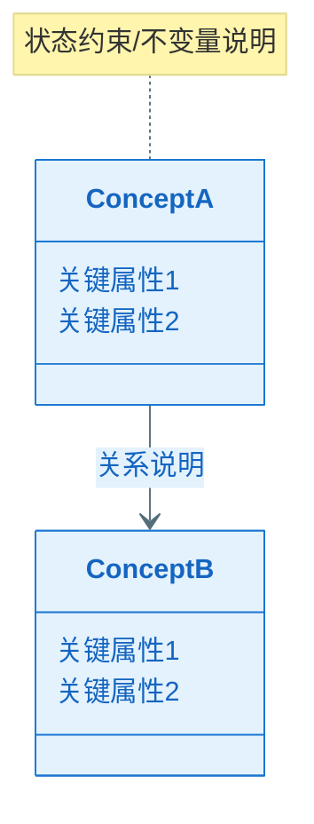
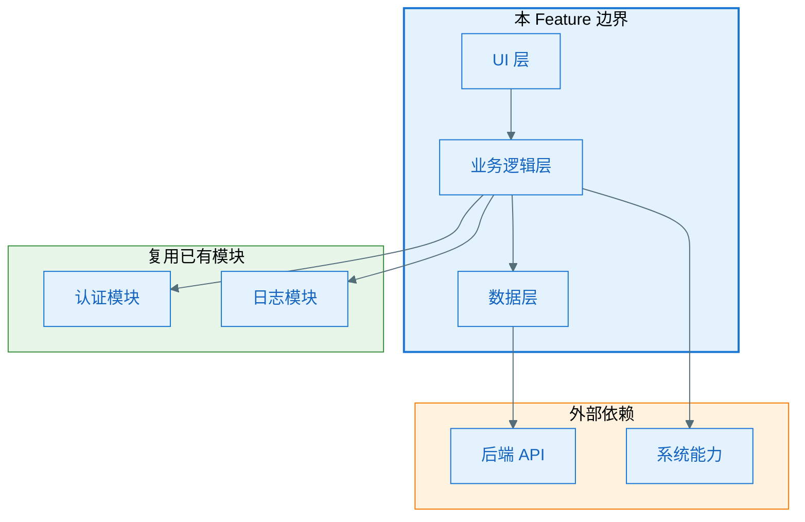
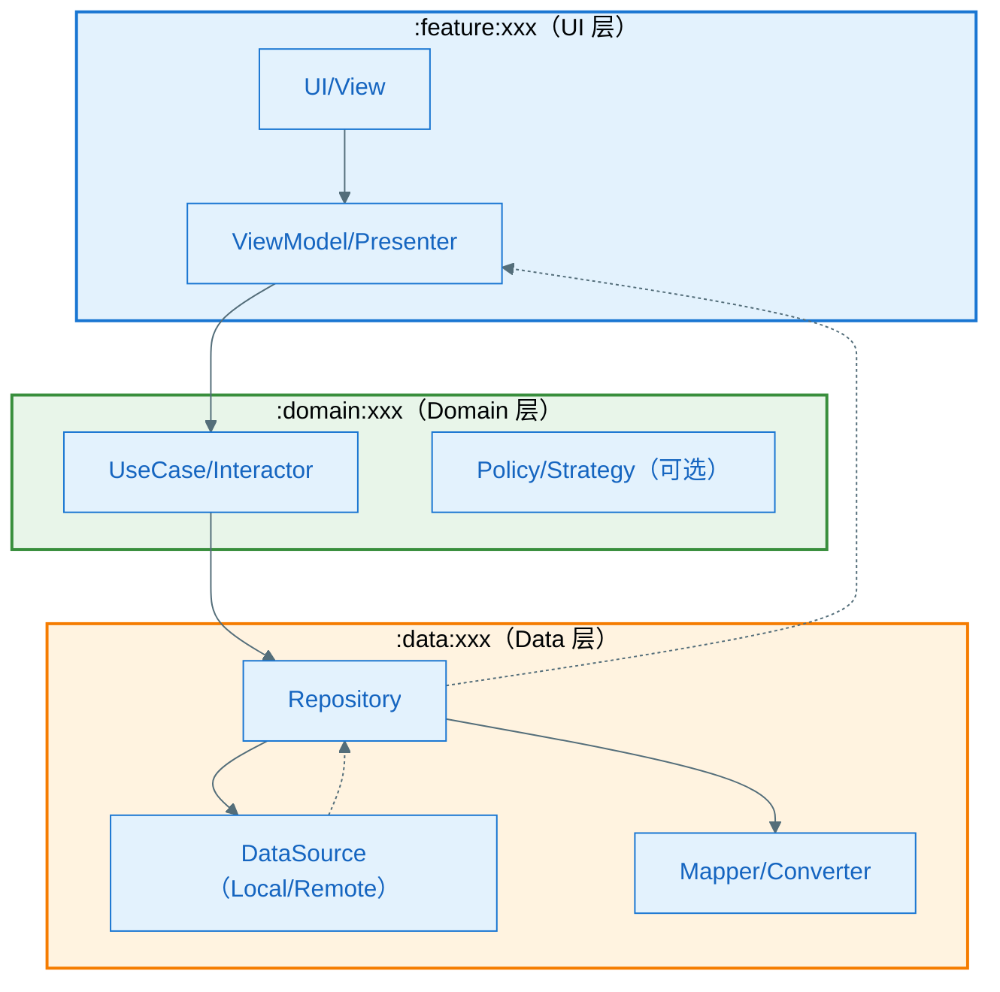
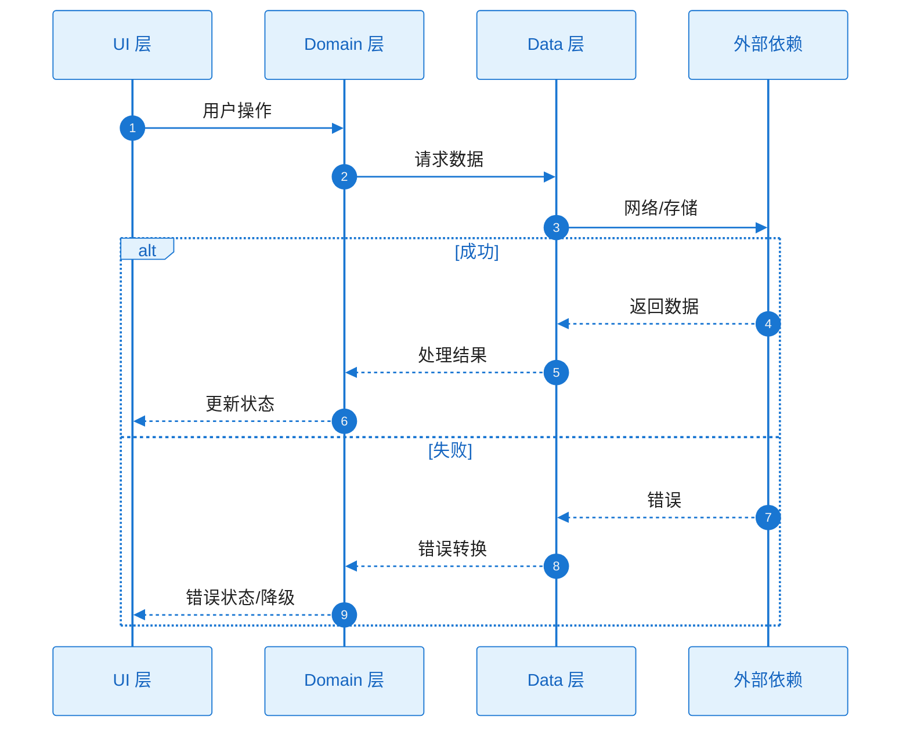
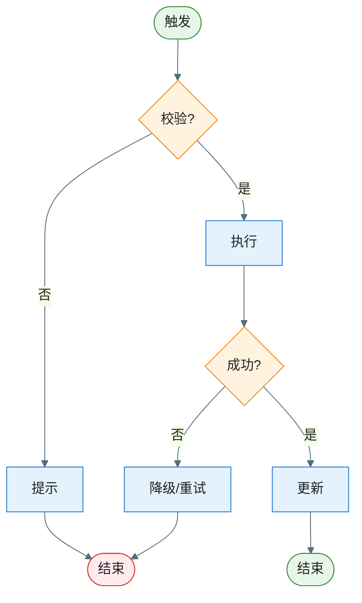
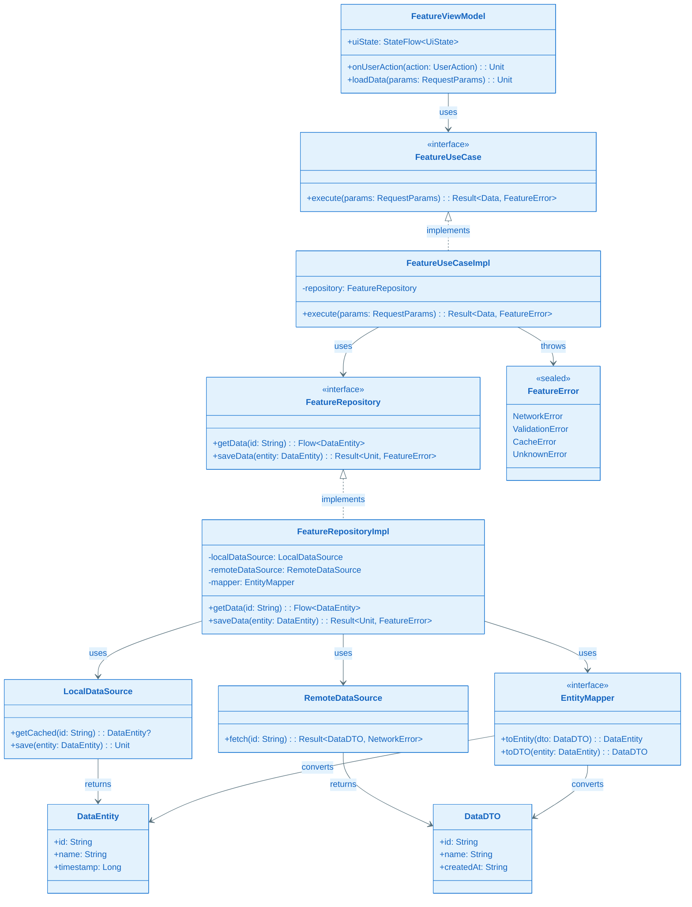
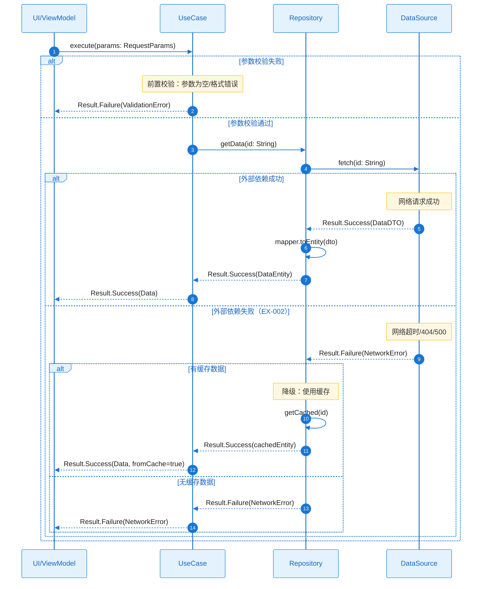
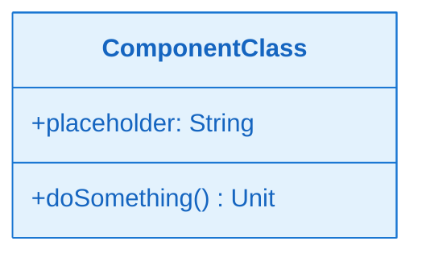
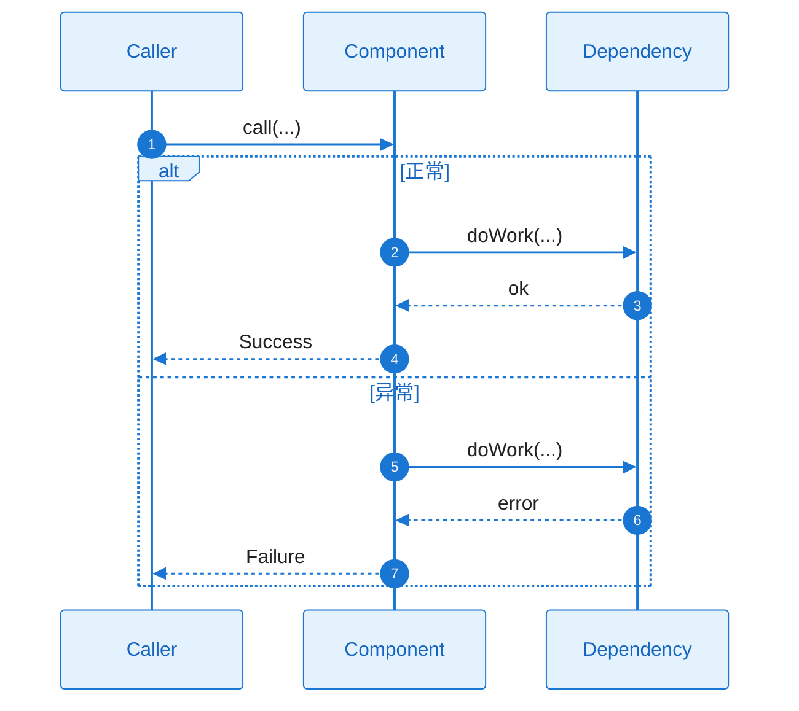
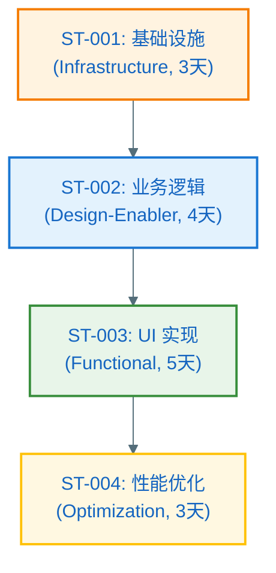

# Plan（工程级蓝图）：[Feature 名称]

**Epic**：EPIC-[编号] - [名称]
**Feature ID**：FEAT-[编号，例如 001]
**Feature Version**：v0.1.0（来自 `spec.md`）
**Plan Version**：v0.1.0
**Plan Level**：Lite / Standard / Deep（按风险选择；高风险/高不确定性选 Deep）
**当前工作分支**：`[epic/... 或 story/... ]`
**Feature 目录**：`specs/epics/EPIC-[编号]-[short-name]/features/FEAT-[编号]-[short-name]/`
**日期**：[YYYY-MM-DD]
**输入**：来自 `Feature 目录/spec.md`

> 规则：
> - Plan 阶段必须包含工程决策、风险评估、算法/功耗/性能/内存评估（量化 + 验收指标）。
> - Implement 阶段**不得**擅自改写 Plan 的技术决策；若必须变更，走增量变更流程并提升 Version。
> - Plan Level 选择建议：
>   - **Lite**：小改动/低风险（无新契约、无持久化迁移、无复杂动效/并发）— 覆盖 A2、A3.1（第一层）、A3.2（第二层）
>   - **Standard**：默认 — 在 Lite 基础上补齐 A3.3（组件详细设计）、Story Breakdown、A4-A11（技术风险、边界异常、算法/功耗/性能/内存/安全/兼容性评估）
>   - **Deep**：新契约/持久化迁移/复杂动效与性能预算/并发竞态/灰度回滚等 — 在 Standard 基础上，补齐关键 Story 的 L2 详细设计
>
> **图表规范**：样式遵循 `.cursor/rules/mermaid-style-guide.mdc`；**内容与结构**须基于本工程实际架构与真实代码，遵循 `.cursor/rules/specify-diagram-requirements.mdc`。

## 变更记录（增量变更）

| 版本 | 日期 | 变更范围（Feature/Story/Task） | 变更摘要 | 影响模块 | 是否需要回滚设计 |
|---|---|---|---|---|---|
| v0.1.0 | [YYYY-MM-DD] | Feature | 初始版本 |  | 否 |

## Plan 前置检查（必须，在开始设计前完成）

> **目的**：确保本 Feature 的 plan 设计基于 EPIC 整体考虑，避免与其他 Feature 重复设计共享组件。
>
> **强制规则**：
> - 在开始 Plan 设计之前，**必须完成以下检查**
> - 若 EPIC 的"跨 Feature 技术策略"中已有 Owner Feature 负责某共享能力，本 Feature **必须复用**，不得另起炉灶
> - 若发现新的共享需求，**必须先更新 epic.md 的"跨 Feature 技术策略"章节**，再继续本 plan

### 前置检查清单

- [ ] 已阅读 `epic.md` 的"跨 Feature 技术策略"章节
- [ ] 若 EPIC 根下存在 **`epic-arch.md`**，已阅读并在其 **0 层/1 层架构与规范约束**下做 A2、A3.1（不得脱离 EPIC 架构另画一套）
- [ ] 已确认本 Feature 在 Plan 执行顺序中的位置（是否有前置依赖）
- [ ] 已检查前置 Feature 的 plan（如果存在），识别可复用组件
- [ ] 本 Feature 需要设计的共享能力已在 EPIC 级登记为 Owner

### 依赖的共享能力（从其他 Feature 复用）

> 列出本 Feature 需要使用但由其他 Feature 设计的共享能力。

| 依赖的共享能力 | Owner Feature | Owner Plan 状态 | 如何获取/引用 |
|---|---|---|---|
| [例如：UI 基础框架] | FEAT-001 | Plan Ready / 待设计 | 引用 FEAT-001 plan.md:A3.3:UIModule |
| [例如：错误处理] | FEAT-001 | Plan Ready | 引用 FEAT-001 plan.md:A3.3:ErrorHandler |

> 若 Owner Feature 的 plan 尚未完成，需要：
> - **等待**：Owner Feature 完成 plan 后再继续本 Feature
> - **协商**：与 Owner Feature 负责人协商接口契约，先行设计

### 本 Feature 提供的共享能力（供其他 Feature 复用）

> 若本 Feature 是某共享能力的 Owner，列出需要设计并提供给其他 Feature 的能力。

| 共享能力名称 | 消费方 Feature | 设计位置（本 plan 章节） | 接口/契约位置 |
|---|---|---|---|
| [例如：主题系统] | FEAT-002, FEAT-003 | A3.3:ThemeModule | Plan-B:B4.1 |

### 前置检查结论

- **检查日期**：[YYYY-MM-DD]
- **检查人**：[姓名/角色]
- **结论**：通过 / 需等待 [Feature] / 需先更新 epic.md
- **备注**：[如有阻塞或协商事项]

---

## 概述

[摘自 Feature 规格说明：核心需求 + 本 Plan 的关键工程决策与取舍]

## Plan-A：工程决策 & 风险评估（必须量化）

### A0. 领域概念（Domain Concepts / Glossary，必须）

> **目的**：统一命名与语义口径，成为后续"架构图/流程图/类图/时序图/接口契约"的**命名权威**。
>
> 要求：
> - 只写本 Feature 涉及或新引入的领域概念；已有概念可引用来源（其他 Feature/EPIC/已有模块文档）
> - 每个概念必须给出：名称、定义、关键属性/状态、与其他概念的关系（可用表格或简易概念图）

#### A0.1 领域概念词汇表（必须）

| 概念（中文） | 名称（英文/代码名） | 定义（一句话） | 关键属性/状态（Top3） | 不变量/约束 | 关联概念 |
|---|---|---|---|---|---|
|  |  |  |  |  |  |

#### A0.2 概念关系图（推荐，可选）

> **目的**：用类图语法表达**业务领域概念**之间的关系（非技术实现）。
>
> ⚠️ **重要区分**：本节与 A3.2.2 技术类图的区别
>
> | 维度 | A0.2 领域概念图 | A3.2.2 技术类图 |
> |------|-----------------|---------------|
> | **目的** | 统一业务语言，建立领域模型 | 定义技术实现的静态结构 |
> | **视角** | 业务视角（产品/领域专家能看懂） | 技术视角（开发者能实现） |
> | **内容** | 业务实体、值对象、聚合关系 | 按项目架构（Clean Architecture/MVP/MVC/MVVM 等）的技术类 |
> | **方法** | 只写关键业务属性，不写方法 | 必须写完整的方法签名 |
> | **示例** | `订单`、`用户`、`商品`（业务概念） | `OrderRepository`、`OrderUseCase` 或 Presenter/Controller 等（技术组件，依架构而定） |
> | **来源** | 来自需求分析、DDD 领域建模 | 来自架构设计（Clean Architecture / MVP / MVC / MVVM 等） |
> | **修改频率** | 业务需求变化时修改 | 技术方案调整时修改 |
>
> **使用建议**：
> - 若 Feature 的业务概念较复杂（多实体/复杂关系），推荐画此图
> - 若 Feature 业务简单（如单一 CRUD），可省略此图，直接进入 A3.2.2 技术类图
> - 此图中的业务概念（如 `订单`）通常在 A3.2.2 中会对应多个技术类（如 `OrderEntity`、`OrderDTO`、`OrderUseCase`）


```mermaid
%%{init: {'theme': 'base', 'themeVariables': { 'primaryColor': '#E3F2FD', 'primaryTextColor': '#1565C0', 'primaryBorderColor': '#1976D2', 'lineColor': '#546E7A'}}}%%
classDiagram
    direction TB
    
    class ConceptA {
        关键属性1
        关键属性2
    }
    
    class ConceptB {
        关键属性1
        关键属性2
    }
    
    ConceptA --> ConceptB : 关系说明
    
    note for ConceptA "状态约束/不变量说明"
```

### A1. 技术方案选型

> **范围**：仅列举**关键**的技术方案选型（存在多种可行方案、需要权衡取舍、影响架构或后续演进）。显而易见的选型（如项目已有约定、无争议的惯例）无需逐一罗列。
>
> **格式**：优势、劣势若有多条，可按序号列举（1. 2. 3. …）。

#### [X]技术方案选型

| 方案 | 优势 | 劣势 |
|---|---|---|
| 方案 A |  |  |
| 方案 B |  |  |

采用方案 A。理由如下：

- 

#### [Y]技术方案选型

| 方案 | 优势 | 劣势 |
|---|---|---|
| 方案 A |  |  |
| 方案 B |  |  |

采用方案 B。理由如下：

-

### A2. Feature 0层设计

> **目的**：一张图展示本 Feature 的全貌——它在系统中的位置、与外部的关系、内部的核心组件。
>
> 要求：
> - 明确 Feature 边界：哪些是本 Feature 新增/修改的，哪些是复用已有的
> - 明确外部依赖的**故障模式**与应对策略
> - 无论 Feature 大小，都必须产出全景图（小 Feature 图更简单，但不能省略）

#### A2.1 Feature 0层架构图（必须）

> 一张图展示：Feature 边界、内部核心组件、外部依赖、数据/控制流向


```mermaid
%%{init: {'theme': 'base', 'themeVariables': { 'primaryColor': '#E3F2FD', 'primaryTextColor': '#1565C0', 'primaryBorderColor': '#1976D2', 'lineColor': '#546E7A'}}}%%
flowchart TB
    subgraph FeatureBoundary["本 Feature 边界"]
        UI["UI 层"]
        Logic["业务逻辑层"]
        Data["数据层"]
    end

    subgraph Reused["复用已有模块"]
        Auth["认证模块"]
        Logger["日志模块"]
    end

    subgraph External["外部依赖"]
        API["后端 API"]
        OS["系统能力"]
    end

    UI --> Logic
    Logic --> Data
    Logic --> Auth
    Logic --> Logger
    Data --> API
    Logic --> OS

    style FeatureBoundary fill:#E3F2FD,stroke:#1976D2,stroke-width:2px
    style Reused fill:#E8F5E9,stroke:#388E3C
    style External fill:#FFF3E0,stroke:#F57C00
```

#### A2.1.1 架构设计说明（必须：理由/决策/思考）

> 用文字把"为什么这样画"说清楚，便于评审与后续实现期不走样。
> **注意**：本节聚焦架构设计原理与决策，不涉及具体代码实现。

- **边界与职责**：为什么这些能力属于本 Feature（而不是其他模块）；哪些能力明确不做（Out of Scope）
- **分层与依赖方向**：为何这样分层；为何允许/禁止某些跨层依赖（例如 UI 不直连 DataSource）
- **关键数据流**：数据从哪里来、去哪里（System of Record）、缓存策略与一致性假设
- **外部依赖策略**：对每个关键依赖的失败模式选择了什么策略（重试/退避/降级/熔断/提示），为什么
- **可演进性**：预留哪些扩展点（接口/策略注入/版本兼容）；未来变化下的最小修改面

#### A2.2 外部依赖清单（若有则必填，无依赖时标注 N/A）

> **适用场景**：涉及后端 API、系统能力、第三方 SDK、已有模块等外部依赖时必填。
> 若本 Feature 为纯本地功能（如纯 UI 组件、本地计算），可标注 N/A 并简述原因。

| 依赖项 | 类型 | 提供方（团队名称） | 提供的能力 | 通信方式 | 故障模式 | 我方策略 |
|--------|------|------------------|-----------|----------|----------|----------|
| [后端 API] | 内部服务 | [团队名称] | 数据读写 | HTTPS | 超时/限流/不可用 | 重试+降级 |
| [系统能力] | OS/SDK | [系统/平台] | 权限/存储 | 系统 API | 权限拒绝/不支持 | 提示+引导 |
| [已有模块] | 内部模块 | [团队名称] | 认证/日志 | 函数调用 | — | — |

#### A2.3 通信与交互约束（必须）

- **协议**：REST / gRPC / 函数调用 / 系统 API（按实际选择）
- **超时与重试**：超时阈值、重试次数、退避策略
- **错误处理**：统一错误类型、用户提示策略
- **数据一致性**：强一致/最终一致、补偿策略（如适用）

### A3. Feature 1层设计

> **目的**：展示 Feature 内部"长什么样"——组件划分、类/接口关系、协作方式。
>
> **层次结构**：
> - **第一层（整体框架）**：组件框架图 + 总体设计说明（必须）
> - **第二层（Feature 全景）**：全景类图 + Feature 级时序图/流程图 + 疑难点与亮点设计详解（若适用）
> - **第三层（组件详细设计）**：组件内部的详细类图 + 完整详细时序图（Plan Level = Standard 时补充）

---

#### A3.1 第一层：整体框架设计（必须）

> **目的**：用一张框架图 + 配套说明，把 Feature 的内部组件划分、依赖关系、协作机制讲清楚。

##### A3.1.1 内部总体框架图（必须）

> **要求**：
> - **必须在图上明确标注所属的代码工程模块名称**（如 `:feature:gallery`、`:core:data`），subgraph 或组件旁须可见模块归属
> - **静态结构**：用**实线箭头**（`-->`）表示依赖/调用方向（谁依赖谁）
> - **动态协作**：用**虚线箭头**（`-..->`）表示事件/回调/异步消息
> - **跨层约束**：明确禁止的依赖（如：UI 不得直接依赖 DataSource）
>
> **架构**：必须基于本工程**实际代码**、**实际模块**与既有架构绘制，禁止照搬 Clean Architecture 等模板。参见 `.cursor/rules/specify-diagram-requirements.mdc`。


```mermaid
%%{init: {'theme': 'base', 'themeVariables': { 'primaryColor': '#E3F2FD', 'primaryTextColor': '#1565C0', 'primaryBorderColor': '#1976D2', 'lineColor': '#546E7A'}}}%%
flowchart TB
    subgraph UILayer[":feature:xxx（UI 层）"]
        UI["UI/View"]
        VM["ViewModel/Presenter"]
    end

    subgraph DomainLayer[":domain:xxx（Domain 层）"]
        UC["UseCase/Interactor"]
        Policy["Policy/Strategy（可选）"]
    end

    subgraph DataLayer[":data:xxx（Data 层）"]
        Repo["Repository"]
        DS["DataSource（Local/Remote）"]
        Mapper["Mapper/Converter"]
    end

    %% 静态依赖（同步调用）- 实线箭头
    UI --> VM
    VM --> UC
    UC --> Repo
    Repo --> DS
    Repo --> Mapper

    %% 动态协作（异步/事件）- 虚线箭头
    DS -.-> Repo
    Repo -.-> VM

    style UILayer fill:#E3F2FD,stroke:#1976D2,stroke-width:2px
    style DomainLayer fill:#E8F5E9,stroke:#388E3C,stroke-width:2px
    style DataLayer fill:#FFF3E0,stroke:#F57C00,stroke-width:2px
```

> **跨层约束**：UI 不得直接依赖 DataSource；Domain 不得依赖 UI

##### A3.1.2 总体设计说明（必须）

###### A3.1.2.1 组件清单与职责（必须）

> **组件定义**：组件是职责内聚的一组类/接口构成的**子模块**，粒度介于工程模块（如 `:feature:xxx`）与单个类之间。一个组件通常对应 1 个或多个类/接口，有清晰的对外接口与内部协作。例如：UseCase 及其实现、Repository + DataSource + Mapper、ViewModel + StateHolder 等。
>
> **重要**：本表是 Feature 的**组件目录（Component Catalog）**，驱动后续设计。

| 组件 | 所属模块 | 职责（一句话） | 输入/输出 | 依赖 | 约束 |
|------|----------|---------------|-----------|------|------|
| [组件A] | `:module:xxx` | [做什么] | [输入→输出] | [依赖哪些组件/外部] | [线程/生命周期/并发约束] |

###### A3.1.2.2 组件协作时序图（必须）

> **目的**：用时序图展示组件之间的**端到端协作流程**，覆盖正常 + 关键异常。
>
> **要求**：
> - **不得遗漏任一关键组件**：A3.1.2.1 组件清单中的组件均须作为 participant 参与相应时序
> - **功能技术链路完整**：从触发端到结果端的调用链须完整、无断点
>
> **与第二层区别**：本节聚焦"组件间协作概览"，第二层 A3.2.3 聚焦"类/方法级调用细节"。


```mermaid
%%{init: {'theme': 'base', 'themeVariables': { 'actorBkg': '#E3F2FD', 'actorBorder': '#1976D2', 'actorTextColor': '#1565C0', 'signalColor': '#1976D2', 'signalTextColor': '#212121', 'noteBkgColor': '#FFF8E1', 'noteBorderColor': '#FFC107'}}}%%
sequenceDiagram
    autonumber
    
    participant UI as UI 层
    participant Domain as Domain 层
    participant Data as Data 层
    participant External as 外部依赖

    UI->>Domain: 用户操作
    Domain->>Data: 请求数据
    Data->>External: 网络/存储
    
    alt 成功
        External-->>Data: 返回数据
        Data-->>Domain: 处理结果
        Domain-->>UI: 更新状态
    else 失败
        External-->>Data: 错误
        Data-->>Domain: 错误转换
        Domain-->>UI: 错误状态/降级
    end
```

---

#### A3.2 第二层：Feature 全景（必须）

> **目的**：从整个 Feature 纵览全局——先确认逻辑流程正确合理，再展开静态结构（类图）与方法调用流程（时序图）。

##### A3.2.1 Feature 流程图集（逻辑流程，必须）

> **要求**：
> - 列出 Feature 级别的所有关键流程（与 A3.2.3 时序图一一对应）
> - 每个流程 1 张流程图，覆盖正常 + 异常分支
> - **完整性要求**：流程图必须从 Feature 全局视角完整，覆盖从触发条件到所有可能结束状态的完整逻辑路径，不得遗漏关键分支

###### 流程 1：[流程名称]


```mermaid
%%{init: {'theme': 'base', 'themeVariables': { 'primaryColor': '#E3F2FD', 'primaryTextColor': '#212121', 'primaryBorderColor': '#1976D2', 'lineColor': '#546E7A'}}}%%
flowchart TD
    Start([触发]) --> Check{校验?}
    Check -->|否| Fail[提示]
    Fail --> EndFail([结束])
    Check -->|是| Execute[执行]
    Execute --> Result{成功?}
    Result -->|是| Update[更新]
    Update --> EndOK([结束])
    Result -->|否| Handle[降级/重试]
    Handle --> EndFail

    style Start fill:#E8F5E9,stroke:#388E3C
    style EndOK fill:#E8F5E9,stroke:#388E3C
    style EndFail fill:#FFEBEE,stroke:#D32F2F
    style Check fill:#FFF3E0,stroke:#F57C00
    style Result fill:#FFF3E0,stroke:#F57C00
```

| 分支 | 异常ID | 触发条件 | 对策 |
|------|--------|----------|------|
| 校验失败 | EX-001 |  | 提示用户 |
| 执行失败 | EX-002 |  | 降级/重试 |

##### A3.2.2 全景类图（必须）

> **要求**：
> - **必须覆盖所有关键类/接口**：根据**项目实际架构模式**确定，而非固定清单。例如：
>   - Clean Architecture：UI / ViewModel / UseCase / Repository / DataSource / Entity / DTO / Error / Mapper
>   - MVVM 无 UseCase：UI / ViewModel / Repository / DataSource / Entity / DTO
>   - MVP：View / Presenter / Model / DataSource
>   - 其他模式：按项目既有分层与命名规范覆盖对应关键类/接口
> - **类与接口必须包含**：所有关键成员、方法；所有公开的接口与字段；方法须写出完整签名（方法名 + 参数 + 返回值）
> - **依赖方向必须正确**：上层依赖下层，禁止"下层反依赖上层"
>
> **架构**：基于本工程实际架构与真实代码，类/接口按实际架构命名, 禁止照搬例图中的Clean Arch。参见 `.cursor/rules/specify-diagram-requirements.mdc`。


```mermaid
%%{init: {'theme': 'base', 'themeVariables': { 'primaryColor': '#E3F2FD', 'primaryTextColor': '#1565C0', 'primaryBorderColor': '#1976D2', 'lineColor': '#546E7A'}}}%%
classDiagram
    direction TB

    class FeatureViewModel {
        +uiState: StateFlow~UiState~
        +onUserAction(action: UserAction): Unit
        +loadData(params: RequestParams): Unit
    }

    class FeatureUseCase {
        <<interface>>
        +execute(params: RequestParams): Result~Data, FeatureError~
    }

    class FeatureUseCaseImpl {
        -repository: FeatureRepository
        +execute(params: RequestParams): Result~Data, FeatureError~
    }

    class FeatureRepository {
        <<interface>>
        +getData(id: String): Flow~DataEntity~
        +saveData(entity: DataEntity): Result~Unit, FeatureError~
    }

    class FeatureRepositoryImpl {
        -localDataSource: LocalDataSource
        -remoteDataSource: RemoteDataSource
        -mapper: EntityMapper
        +getData(id: String): Flow~DataEntity~
        +saveData(entity: DataEntity): Result~Unit, FeatureError~
    }

    class LocalDataSource {
        +getCached(id: String): DataEntity?
        +save(entity: DataEntity): Unit
    }

    class RemoteDataSource {
        +fetch(id: String): Result~DataDTO, NetworkError~
    }

    class DataEntity {
        +id: String
        +name: String
        +timestamp: Long
    }

    class DataDTO {
        +id: String
        +name: String
        +createdAt: String
    }

    class EntityMapper {
        <<interface>>
        +toEntity(dto: DataDTO): DataEntity
        +toDTO(entity: DataEntity): DataDTO
    }

    class FeatureError {
        <<sealed>>
        NetworkError
        ValidationError
        CacheError
        UnknownError
    }

    FeatureViewModel --> FeatureUseCase : uses
    FeatureUseCase <|.. FeatureUseCaseImpl : implements
    FeatureUseCaseImpl --> FeatureRepository : uses
    FeatureUseCaseImpl --> FeatureError : throws
    FeatureRepository <|.. FeatureRepositoryImpl : implements
    FeatureRepositoryImpl --> LocalDataSource : uses
    FeatureRepositoryImpl --> RemoteDataSource : uses
    FeatureRepositoryImpl --> EntityMapper : uses
    RemoteDataSource --> DataDTO : returns
    LocalDataSource --> DataEntity : returns
    EntityMapper --> DataEntity : converts
    EntityMapper --> DataDTO : converts
```

###### 关键类职责说明（按 A3.2.2 要求，与项目实际架构一致）

| 类/接口 | 层级 | 职责 | 关键方法 |
|---------|------|------|----------|
| `FeatureViewModel` | UI | 管理 UI 状态，处理用户交互 | `onUserAction()`, `loadData()` |
| `FeatureUseCase` | Domain | 封装业务逻辑，协调数据流 | `execute()` |
| `FeatureRepository` | Data | 数据访问抽象层，协调本地/远程数据源 | `getData()`, `saveData()` |
| `LocalDataSource` | Data | 本地缓存数据访问 | `getCached()`, `save()` |
| `RemoteDataSource` | Data | 远程 API 数据访问 | `fetch()` |
| `EntityMapper` | Data | 数据模型转换（DTO ↔ Entity） | `toEntity()`, `toDTO()` |
| `DataEntity` | Domain | 领域数据模型（业务层使用） | - |
| `DataDTO` | Data | 数据传输对象（网络层使用） | - |
| `FeatureError` | Domain | 错误类型体系 | - |

##### A3.2.3 关键时序图集（方法调用流程，必须）

> **要求**：
> - **架构**：基于本工程实际架构与真实代码，participant 使用真实类名。参见 `.cursor/rules/specify-diagram-requirements.mdc`。
> - 列出 Feature 级别的所有关键流程
> - 每个流程 1 张时序图，覆盖**类/方法级调用细节**
> - 同图包含正常 + 关键异常（用 `alt/else`）
> - **完整性要求**：时序图必须从 Feature 全局视角完整，覆盖从用户触发到最终响应的完整调用链，不得遗漏关键方法调用
> - **participant 命名**：基于本工程实际架构与真实代码绘制，participant 使用真实类名，禁止照搬例图；

| Seq ID | 流程名称 | 覆盖的异常（EX-xxx） |
|--------|----------|----------------------|
| SEQ-001 | [流程名称] | EX-001, EX-002 |

###### SEQ-001：[流程名称]


```mermaid
%%{init: {'theme': 'base', 'themeVariables': { 'actorBkg': '#E3F2FD', 'actorBorder': '#1976D2', 'actorTextColor': '#1565C0', 'signalColor': '#1976D2', 'signalTextColor': '#212121', 'noteBkgColor': '#FFF8E1', 'noteBorderColor': '#FFC107'}}}%%
sequenceDiagram
    autonumber
    
    participant UI as UI/ViewModel
    participant UC as UseCase
    participant Repo as Repository
    participant DS as DataSource

    UI->>UC: execute(params: RequestParams)
    
    alt 参数校验失败
        Note over UC: 前置校验：参数为空/格式错误
        UC-->>UI: Result.Failure(ValidationError)
    else 参数校验通过
        UC->>Repo: getData(id: String)
        Repo->>DS: fetch(id: String)
        
        alt 外部依赖成功
            Note over DS: 网络请求成功
            DS-->>Repo: Result.Success(DataDTO)
            Repo->>Repo: mapper.toEntity(dto)
            Repo-->>UC: Result.Success(DataEntity)
            UC-->>UI: Result.Success(Data)
        else 外部依赖失败（EX-002）
            Note over DS: 网络超时/404/500
            DS-->>Repo: Result.Failure(NetworkError)
            
            alt 有缓存数据
                Note over Repo: 降级：使用缓存
                Repo->>Repo: getCached(id)
                Repo-->>UC: Result.Success(cachedEntity)
                UC-->>UI: Result.Success(Data, fromCache=true)
            else 无缓存数据
                Repo-->>UC: Result.Failure(NetworkError)
                UC-->>UI: Result.Failure(NetworkError)
            end
        end
    end
```

##### A3.2.4 疑难点与亮点设计详解（若适用）

> **适用条件**：仅纳入 **技术方案设计上的** 疑难点（易踩坑、需专项论证）或 亮点（可作为最佳实践/创新点）。简单、显而易见的设计不纳入。
>
> **何时省略**：若无疑难点且无方案亮点，可省略本节。
>
> **与 A3.3 的区分**：
> - **本节聚焦**：技术方案设计上的疑难点（为何难、易踩哪些坑、如何解决）与亮点（为何是亮点、创新点/最佳实践、可复用价值）。不在此重复展开详细设计（类图/时序图/流程图）。
> - **A3.3 负责**：疑难点/亮点涉及的组件的**详细设计方案**（详细类图 + 完整详细时序图）。A3.3 对应组件处可标注「详见 A3.2.4 疑难点/亮点 X」建立互引，避免重复画图。

###### 疑难点/亮点 1：[设计点名称]

- **类型**：疑难点 | 方案亮点
- **背景/亮点说明**：疑难点→[为何是疑难点，涉及哪些组件或跨层关注点，易出现哪些坑]；亮点→[为何是亮点，创新点或最佳实践，可复用价值]
- **核心方案**：疑难点→[如何解决：核心思路、关键约束、取舍理由]；亮点→[设计要点、实现思路]
- **关联决策**：A1 技术选型 → [决策点名称]（若适用）
- **边界条件与注意事项**：[关键边界、异常、并发/生命周期等]（疑难点必填，亮点选填）
- **详细设计位置**：→ A3.3 组件 [组件名]

###### 疑难点/亮点 2：[设计点名称]

（结构同上：类型、背景/亮点说明、核心方案、关联决策、边界条件、详细设计位置）

---

#### A3.3 第三层：组件内部详细设计（Plan Level = Standard 时执行）

> **定位**：Plan Level = Standard 时必须补充本节；Plan Level = Lite 时可省略。
>
> **组件**：参见 A3.1.2.1 组件定义——职责内聚的子模块，一个组件对应 1 个或多个类/接口。
>
> **与 A3.2.4 的区分**：本节产出组件的**详细设计方案**（详细类图 + 完整详细时序图）。若某组件涉及 A3.2.4 疑难点/亮点，在本节展开详细设计，并标注「详见 A3.2.4 疑难点/亮点 X」建立互引。
>
> **何时需要补充**：
> - Plan Level = Standard：默认需要补充组件内部设计（详细类图 + 完整详细时序图）
> - Plan Level = Deep：在 Standard 基础上，还需要补充关键 Story 的 L2 详细设计（见后文 Story Detailed Design）
>
> **输出要求**：对需要细化的组件，产出：详细类图 + 完整详细时序图 + 异常清单

##### 组件：[组件名]

- **定位**：[解决什么问题]
- **对外接口**：[方法签名、错误类型]
- **失败与降级**：[异常处理策略]

###### 组件详细类图

> **要求**：类与接口必须包含**所有必要的字段和方法**，不得遗漏关键成员。
>
> **架构**：基于本工程实际架构与真实代码，使用真实类名。参见 `.cursor/rules/specify-diagram-requirements.mdc`。


```mermaid
%%{init: {'theme': 'base', 'themeVariables': { 'primaryColor': '#E3F2FD', 'primaryTextColor': '#1565C0', 'primaryBorderColor': '#1976D2', 'lineColor': '#546E7A'}}}%%
classDiagram
    direction TB
    
    class ComponentClass {
        +placeholder: String
        +doSomething() Unit
    }
```

###### 组件完整详细时序图（含正常+异常）

> **要求**：详细绘制**完整的方法调用流程**，每张图须同时包含正常与异常分支（用 `alt/else`）。若组件有多个关键流程，须提供**多张时序图**，逐流程覆盖。
>
> **架构**：基于本工程实际架构与真实代码，participant 使用真实类名。参见 `.cursor/rules/specify-diagram-requirements.mdc`。
>
> **完整性要求**：时序图必须在组件职责边界内**完整详细**，覆盖从调用入口到返回结果的完整调用链，不得遗漏组件内部的关键协作步骤。


```mermaid
%%{init: {'theme': 'base', 'themeVariables': { 'actorBkg': '#E3F2FD', 'actorBorder': '#1976D2', 'actorTextColor': '#1565C0', 'signalColor': '#1976D2', 'signalTextColor': '#212121', 'noteBkgColor': '#FFF8E1', 'noteBorderColor': '#FFC107'}}}%%
sequenceDiagram
    autonumber
    
    participant Caller as Caller
    participant Component as Component
    participant Dep as Dependency

    Caller->>Component: call(...)
    
    alt 正常
        Component->>Dep: doWork(...)
        Dep-->>Component: ok
        Component-->>Caller: Success
    else 异常
        Component->>Dep: doWork(...)
        Dep-->>Component: error
        Component-->>Caller: Failure
    end
```

> 若组件有多个关键流程，此处增加「时序图 2：[流程名称]」等，逐流程绘制。

###### 异常清单

| 异常ID | 触发条件 | 错误类型 | 可重试 | 对策 |
|--------|----------|----------|--------|------|
| EX-001 |  |  | 是/否 |  |

---

#### A3.4 附录：设计规范与自检（模板说明，实际输出时可删除）

> ⚠️ **模板说明**：本节为写作指南，实际输出 plan.md 时可删除或折叠。

##### 类图粒度控制

**✅ 应该包含**：
- 公共接口/抽象类（组件间契约）
- 核心实现类
- 数据模型（Entity、DTO）
- 错误类型体系
- **所有必要的字段**（公开的接口与字段）
- **公共方法完整签名**（方法名 + 参数 + 返回值）

**❌ 不应该包含**：
- 私有辅助方法
- 自动生成的 getter/setter
- 第三方库的类（除非自定义扩展）
- Android SDK 基类

##### 时序图要求

**✅ 必须满足**：
- 每张时序图须同时包含正常与异常分支（用 `alt/else`）
- 多关键流程须提供多张时序图，逐流程覆盖
- 覆盖从调用入口到返回结果的完整调用链，不得遗漏关键协作步骤

##### 图表一致性自检清单

- [ ] `A3.1.1` 框架图中的组件 **100% 覆盖** `A3.1.2.1` 的组件清单
- [ ] `A3.1.2.1` 组件清单中的每个组件在 `A3.2.2` 类图中至少有 1 个对应类/接口
- [ ] `A3.2.2` 类图中的类/接口包含**所有必要字段**，公共方法都写了**完整签名**
- [ ] `A3.2.3` 时序图中的所有 `participant` 在 `A3.2.2` 类图中都有对应类/接口
- [ ] `A3.2.3` 时序图中的所有方法调用在 `A3.2.2` 类图中都有对应定义
- [ ] `A3.2.1` 流程图集与 `A3.2.3` 时序图集一一对应
- [ ] `A3.2.4`（若启用）每个疑难点/亮点与 A1 技术选型或 A3.2 全景图有对应引用
- [ ] `A3.3`（若启用）对相关组件产出详细类图（含所有必要字段与方法）+ 完整详细时序图（多关键流程时提供多张，每张含正常+异常）

---

#### A3.5 Capability/算法 Feature 附加章节（若适用）

##### （Capability Feature）交付物与接入契约

> 适用于：埋点/组件库/算法SDK 等横切能力 Feature

- **交付物形态**：SDK / 资源包 / 配置 / 服务接口
- **对外接口**：初始化、调用方式、生命周期
- **版本与兼容**：SemVer、向后兼容策略
- **验收标准**：可测量的完成定义

##### （算法 Feature）算法交付清单

- **模型提供**：来源/版本/输入输出
- **推理部署**：端侧/服务端、运行时
- **降级策略**：无模型/低端机/失败时的兜底
- **监控**：指标/告警/灰度

### A4. 技术风险与消解策略（绑定 Story/Task）（Plan Level = Standard 时输出）

| 风险ID | 风险描述 | 触发条件 | 影响范围 | 严重度 | 消解策略 | 对应 Story/Task |
|---|---|---|---|---|---|---|
| RISK-001 |  |  |  | High/Med/Low |  | ST-??? / T??? |

### A5. 边界 & 异常场景枚举（数据/状态/生命周期/并发/用户行为）（Plan Level = Standard 时输出）

> **范围**：仅列出**关键的**、或**难以洞察发现的**边界与异常场景。显而易见、常规处理的无需逐一罗列。

- **数据边界**：[空/超大/非法/重复/过期等]
- **状态边界**：[状态机不可达/回退/重入等]
- **生命周期**：[前后台切换/旋转/进程被杀/恢复等]
- **并发**：[多线程/协程/并发写/竞态等]
- **用户行为**：[快速连点/断网/弱网/权限拒绝等]

#### A5.1 场景 → 应对措施对照表（必须）

> 目的：把"枚举"落到"可执行对策"，并与 A3.2.1 / A3.2.3 / A3.2.4（若启用）/ A3.3 的异常分支互校。
>
> **对策类型说明**：
> - **技术对策**：通过代码/架构层面解决（重试/退避/降级/回滚/补偿/去重/限流等）
> - **设计对策**：需产品/设计层面介入（交互引导/文案提示/流程简化/功能裁剪等），标注 `TODO(PM)` 或 `TODO(UX)` 待确认

| 场景ID | 场景类别 | 触发条件（可复现） | 影响 | 预期行为（对用户/对系统） | 技术对策 | 设计对策（产品/UX） | 观测信号（日志/埋点/指标） | 映射（流程/时序/异常ID） |
|---|---|---|---|---|---|---|---|---|
| SC-001 | 数据 |  |  |  | [重试/降级/...] | [引导文案/流程简化/N/A] |  | 流程1 / SEQ-001 / EX-001 |

### A6. 算法评估（如适用）（Plan Level = Standard 时输出）

> 适用于：推荐算法、检测算法、分类算法、生成算法等涉及机器学习/AI 的场景。

#### A6.1 客观指标（必须量化）

| 指标 | 目标值 | 备注 |
|---|---|---|
| 准确率 (Precision) | ≥ [阈值]% | 例如：≥ 90% |
| 召回率 (Recall) | ≥ [阈值]% | 例如：≥ 85% |
| 响应时延 (p95) | ≤ [阈值] ms | 例如：≤ 200ms |
| [其他指标] | [目标值] | 根据算法类型补充 |

#### A6.2 主观指标（如适用）

- **可用性评分**：≥ **4.0 分** (满分 5 分，用户样本 ≥ 100 人)
- **评分维度**：[相关性/准确性/易用性等]
- **达标标准**：平均分 ≥ 4.0，且 < 3 分的比例 ≤ 10%

#### A6.3 降级策略（必须）

| 触发条件 | 降级策略 |
|---|---|
| 低端设备/弱网 | 使用轻量模型、本地缓存 |
| 算法失败 | 降级到规则策略或默认推荐 |

### A7. 功耗评估（必须量化，基于场景）（Plan Level = Standard 时输出）

> **计算公式**：
> - 单次功耗 (mAh) = 平均电流增量 (mA) × 使用时长 (秒) / 3600
> - 每日功耗增量 (mAh) = 单次功耗 × 每日使用次数 × 功能渗透率 / 5%
>
> **温升计算公式**（工程估算）：
> - 温升 (°C) ≈ (电流增量 (mA) / 1000 × 3.7V) × 热阻 (8°C/W) × 修正系数
> - 修正系数：短时操作（<10s）约 0.4，持续操作（>1min）约 1.0

#### A7.1 Top 5% 重度用户模型

| 维度 | 定义 |
|---|---|
| 设备型号 | [例如：中端机型，4000mAh 电池] |
| 使用频次 | [例如：每天使用功能 X 次] |
| 使用场景 | [前台使用/后台运行] |

#### A7.2 功耗与温升场景评估（逐场景列出）

##### 场景 1：[场景名称]

| 参数 | 数值 | 计算 |
|---|---|---|
| 电流增量 | [例如：30 mA] | 相对 Baseline |
| 使用时长 | [例如：5 秒] | 单次操作时长 |
| 每日使用次数 | [例如：3 次] | Top5% 用户 |
| 功能渗透率 | [例如：1%] | 实际使用用户占比 |
| **每日功耗增量** | **[计算结果] mAh** | 30×5/3600×3×1%/5% = 0.025 mAh |
| **预估温升** | **[计算结果] °C** | 0.111×8×0.4 = 0.36°C ✅ |

##### 场景 2：[场景名称]

（同上结构，按需添加）

#### A7.3 汇总与验收标准

| 场景 | 每日功耗 (mAh) | 温升 (°C) | 是否达标 |
|---|---|---|---|
| 场景 1 | 0.025 | 0.36 | ✅ |
| 场景 2 | [实测] | [实测] | ✅/❌ |
| **总计** | **[汇总]** | - | - |

**验收标准**：
- 每日功耗增量：≤ [阈值] mAh（例如：≤ 10 mAh）
- 单场景温升：≤ **0.5°C**（任何场景）
- 失败处置：超标必须优化，不得上线

#### A7.4 降级策略（必须）

| 触发条件 | 降级策略 |
|---|---|
| 功耗/温升超标 | 降低执行频率、间歇执行 |
| 低电量模式（<20%） | 关闭后台任务，仅前台触发 |
| 高温保护（>40°C） | 暂停功能，待温度降低后恢复 |

### A8. 性能评估（必须量化，基于场景）（Plan Level = Standard 时输出）

#### A8.1 测试设备基线

| 维度 | 定义 |
|---|---|
| 设备型号 | [例如：小米 11（中端机型）] |
| 系统版本 | [例如：Android 12] |
| 网络环境 | [例如：4G 良好信号] |

#### A8.2 性能场景与指标（根据功能类型选择适用场景）

##### A8.2.1 启动/加载场景（如适用）

| 场景 | 指标 | 验收标准 (p95) | 实测 |
|---|---|---|---|
| 冷启动 | 启动耗时 | ≤ 2000ms | [实测] |
| 热启动 | 启动耗时 | ≤ 1000ms | [实测] |
| 页面首屏加载 (TTI) | 加载耗时 | ≤ 1000ms | [实测] |
| 功能模块初始化 | 加载耗时 | ≤ 1500ms | [实测] |

**性能预算分解**（关键场景必填）：
- [场景名称] 总预算 [X]ms = 网络 [X]ms + 解析 [X]ms + 渲染 [X]ms + 其他 [X]ms

##### A8.2.2 UI 交互场景（必须，统一验收标准）

> **通用 UI 性能标准**（适用于所有点击、滑动、输入、动画等交互）：

| 指标类型 | 验收标准 | 说明 |
|---|---|---|
| 点击/输入响应 (p95) | ≤ 200ms | 用户操作到视觉反馈的时延 |
| 页面切换/动画流畅度 | 平均 ≥ 55fps，p95 ≥ 50fps | 动画、过渡、滑动等场景 |
| 卡顿率 (Jank Rate) | ≤ 5% | 单帧耗时 >16.67ms 的比例 |

**本功能涉及的 UI 交互场景**（列出关键场景即可）：
- [场景 1]：[例如：商品列表滑动] → 遵循通用标准
- [场景 2]：[例如：页面切换动画] → 遵循通用标准
- [场景 3]：[例如：搜索输入响应] → 遵循通用标准

##### A8.2.3 后台任务场景（如适用）

| 场景 | 指标 | 验收标准 (p95) | 实测 |
|---|---|---|---|
| 后台数据同步 | 完成时间 | ≤ 30s | [实测] |
| 文件下载/上传 | 完成时间 | [根据文件大小] | [实测] |
| 后台计算任务 | 完成时间 | ≤ 10s | [实测] |

**约束**：CPU 占用平均 ≤ 10%，避免影响前台

#### A8.3 验收标准汇总

| 场景类型 | 核心指标 | 验收标准 (p95) |
|---|---|---|
| 冷启动 | 启动耗时 | ≤ 2000ms |
| 页面加载 | TTI | ≤ 1000ms |
| UI 交互（通用） | 响应时延 | ≤ 200ms |
| UI 交互（通用） | 帧率 | ≥ 55fps (平均), ≥ 50fps (p95) |
| 后台任务 | 完成时间 | ≤ 30s（根据任务调整） |

**失败处置**：性能超标必须优化，不得上线

#### A8.4 降级策略（必须）

| 触发条件 | 降级策略 |
|---|---|
| 低端设备 | 降低动画帧率、简化 UI、减少并发 |
| 弱网环境（< 100KB/s） | 启用缓存、降低图片质量 |
| 高负载（CPU > 80%） | 延迟非关键任务、降低刷新频率 |

### A9. 内存评估（必须量化，基于场景）（Plan Level = Standard 时输出）

#### A9.1 内存场景与增量分解

| 场景 | 验收标准 | 主要内存来源 | 预估 (MB) | 实测 (MB) | 优化方向 |
|---|---|---|---|---|---|
| 前台正常使用 | PSS ≤ 50MB | 图片缓存、UI 视图、数据缓存 | [预估] | [实测] | [优化方向] |
| 前台重度使用（峰值） | PSS ≤ 100MB | 图片缓存、临时数据、并发任务 | [预估] | [实测] | [优化方向] |
| 后台驻留 | 内存占用 ≤ 20MB | 核心服务、必要缓存 | [预估] | [实测] | [优化方向] |
| 长时间使用（30分钟） | 无持续增长 | 累积缓存、可能泄漏点 | [预估] | [实测] | [优化方向] |
| 内存泄漏检测（进出 10 次） | 回到 Baseline ±5MB | Activity/Fragment、监听器 | - | [实测] | [修复泄漏] |
| 内存抖动 | GC ≤ 10 次/分钟 | 频繁对象创建 | - | [实测] | 对象复用、减少分配 |

**失败处置**：内存增量超标（>100MB）或内存泄漏，必须修复，不得上线

### A10. 安全评估（如适用）（Plan Level = Standard 时输出）

> 适用于：涉及用户数据、网络通信、存储、权限的功能；不适用标注"N/A"。

#### A10.1 数据安全（如涉及用户数据）

| 安全点 | 防护措施 | 验收标准 |
|---|---|---|
| 敏感数据存储 | 加密存储（AES-256/Keystore） | 无明文密码/Token |
| 数据传输 | HTTPS + 证书校验 | 所有接口 HTTPS |
| 日志安全 | 敏感字段脱敏 | Release 无敏感日志 |

#### A10.2 权限安全（如申请敏感权限）

| 权限类型 | 使用场景 | 申请时机 | 拒绝后处理 |
|---|---|---|---|
| [例如：位置] | [场景] | 首次使用时 | 功能降级/提示 |

**原则**：最小权限、运行时申请、拒绝后降级

#### A10.3 代码安全 & 合规性

- **代码混淆**：ProGuard/R8 混淆（Release 版本）
- **合规性**：GDPR/个人信息保护法（隐私政策 + 用户同意）

---

### A11. 兼容性评估（必须）（Plan Level = Standard 时输出）

**兼容性检查清单**：

- [ ] **系统版本兼容**：支持的 Android API 范围（如 API 24+），需测试的关键版本（如 API 24/31/33）
- [ ] **设备兼容**：低端机（2GB RAM）降级方案、折叠屏/平板适配方案
- [ ] **屏幕兼容**：使用 dp/sp、响应式布局、适配刘海屏/挖孔屏（WindowInsets）
- [ ] **网络兼容**：弱网/断网降级方案（缓存/提示）
- [ ] **数据库升级**：Room Migration 方案、向前兼容、跨版本升级支持、失败回滚策略
- [ ] **APK 版本升级**：覆盖安装兼容、数据迁移策略、灰度发布计划、回滚方案
- [ ] **第三方库兼容**：依赖库版本与最低 API 要求
- [ ] **权限兼容**：新增权限在合适时机申请（非启动时）、老版本权限保留
- [ ] **不兼容场景**：低版本系统/低端设备/特殊机型的处理策略

**兼容性结论**：[一句话总结兼容性风险评估，例如："本需求兼容 API 24+，需重点测试数据库迁移和低端机降级方案，整体兼容性风险较低"]

---

## Plan-B：技术规约 & 实现约束（保留原 spec-kit 输出内容）

### B0. Plan-A ↔ Plan-B 一致性与互校（必须）

> **目的**：保证 Plan-A 的架构/决策在 Plan-B 的规约/契约/数据模型中有明确落点，避免"上层说一套、规约写一套"。

| Plan-A（决策/假设/约束） | Plan-B（落点） | 自检规则（必须通过） |
|---|---|---|
| A0 领域概念命名 | B3/B4/Story | 术语一致；中英文/代码名一致 |
| A1 技术选型 | B1/B2 | 依赖与分层规约匹配；无矛盾 |
| A2 外部依赖与故障策略 | B4.2 | 超时/重试/降级/错误语义一致 |
| A3 数据一致性/缓存假设 | B3.1/B3.2 | SoR、缓存、迁移策略一致 |
| A3 错误与失败传播 | B2/B4 | 错误分类/错误码/用户提示一致 |


### B1. 技术背景（用于统一工程上下文）

> 注意：为保证工具链自动提取信息，下列字段名需保留英文 Key（括号内可补充中文）。

**Language/Version**：[例如：Kotlin 2.x / Java 17 / 需明确]
**Primary Dependencies**：[例如：Jetpack Compose、Room、Ktor 或 需明确]
**Storage**：[如适用，例如：Room/SQLite、DataStore、文件 或 N/A]
**Test Framework**：[例如：JUnit、Robolectric、XCTest、pytest 或 需明确]
**Target Platform**：[例如：Android 8+、iOS 15+、Linux server 或 需明确]
**Project Type**：[single / web / mobile - 决定源码结构]
**Performance Targets**：[例如：60fps、启动耗时、p95 时延等 或 需明确]
**Constraints**：[例如：p95 <200ms、内存 <100MB、离线可用等 或 需明确]
**Scale/Scope**：[例如：DAU、数据规模、页面数等 或 需明确]

### B2. 架构细化（实现必须遵循）

- **分层约束**：[例如：UI 只能调用 Domain；Domain 不能依赖 UI]
- **线程/并发模型**：[主线程/IO/协程/锁策略]
- **错误处理规范**：[统一错误码/异常封装/用户提示]
- **日志与可观测性**：[结构化字段、采样、敏感信息脱敏]

### B3. 数据模型（引用或内联）

- 若已有 `data-model.md`：在此引用并补充关键约束
- 若未单独拆分：在此列出实体、字段、关系、状态机与校验规则

#### B3.1 存储形态与边界（必须）

> 目的：先明确"数据落在哪里、谁负责持久化、数据生命周期"，再谈表结构/键结构。

- **存储形态**：Room/SQLite / DataStore / SharedPreferences / 文件（JSON/CSV/二进制） / 远端服务 / N/A
- **System of Record（权威来源）**：哪一份数据是权威（例如：DB 为准、文件为准、服务端为准）
- **缓存与派生数据**：哪些字段是派生/可重建的（可用于迁移与降级）
- **生命周期**：常驻/前台/后台/退出时持久化；清理/归档策略
- **数据规模与增长**：数量级、写入频次、读写热点（用于索引与分页策略）

#### B3.2 物理数据结构（若使用持久化存储则必填）

> 要求：写到"可实现/可评审/可迁移"的粒度。
> - 若使用数据库：必须列出每张表的字段、约束、索引、外键、典型查询与迁移策略。
> - 若使用 KV/文件：必须写出键名/文件名规则、序列化结构（JSON schema/字段表）、版本与迁移策略。

##### （数据库）表结构清单

| 表 | 用途 | 主键/唯一约束 | 索引 | 外键 | 典型查询（Top3） | 数据量级 |
|---|---|---|---|---|---|---|
|  |  |  |  |  |  |  |

##### （数据库）字段说明模板（每表一份）

**表**：`<table_name>`

| 字段 | 类型 | 约束（NOT NULL/默认值/范围） | 含义 | 来源/生成方式 | 用途（读写场景） |
|---|---|---|---|---|---|
|  |  |  |  |  |  |

##### （数据库）迁移与兼容策略

- **Schema 版本**：v1 / v2 / …（例如：Room `version`）
- **向后兼容**：新增列默认值；字段废弃策略；索引变更策略
- **迁移策略**：Migration 列表、失败回滚/重试策略、数据回填/重建策略

##### （KV/文件）键/文件结构清单（如适用）

| Key/文件 | 用途 | 结构版本 | Schema/字段说明位置 | 迁移策略 |
|---|---|---|---|---|
|  |  |  |  |  |

### B4. 接口规范/协议（引用或内联）

- 若已有 `contracts/`：在此引用端点/协议文件（OpenAPI/Proto/JSON Schema 等）
- 明确版本策略、兼容策略、错误响应格式

#### B4.1 本 Feature 对外提供的接口（必须：Capability Feature/跨模块复用场景）

> 目的：把"能力交付物"写成可联调的契约（不是仅写类名/方法名）。

- **接口清单**：对外暴露的 API/SDK/Repository 接口列表（含用途、调用方）
- **输入/输出**：字段含义、必填/可选、默认值、范围、示例
- **错误语义**：错误码/错误类型、可重试/不可重试、用户可见提示策略
- **幂等与副作用**：哪些调用必须幂等、幂等键/语义、重复调用的效果
- **并发/线程模型**：调用是否线程安全；协程/线程调度要求；取消语义
- **版本与兼容**：SemVer/接口版本号；新增/弃用策略；向后兼容约束

#### B4.2 本 Feature 依赖的外部接口/契约（必须：存在外部依赖时）

> 目的：把 A2.2 的"依赖清单"下沉到"调用级契约"，避免实现期口径不一致。

- **依赖接口清单**：依赖的模块/服务/API（含 owner/路径）
- **调用约束**：超时/重试/退避/限流；缓存策略；一致性假设
- **失败模式与降级**：超时/限流/不一致/不可用时如何处理（与 A2.2 对齐）

#### B4.3 契约工件（contracts/）与引用方式（推荐）

> 推荐：把可机读的契约沉淀为文件，便于测试与演进。

- **contracts/**：`openapi.yaml` / `*.proto` / `json-schema/*.json` / `errors.md` 等
- **变更流程**：契约变更必须更新版本 + 兼容策略 + 关联 Story/Task

### B5. 合规性检查（关卡）

*关卡：必须在进入 Implement 前通过；若不通过，必须明确整改项并绑定到 Story/Task。*

[基于章程/合规性文件确定的检查项]

### B6. 项目结构（本 Feature）

```text
specs/[###-feature-short-name]/
├── spec.md                     # Feature 规格说明（/speckit.specify）
├── plan.md                     # 本文件（/speckit.plan）
├── tasks.md                    # 任务拆解（/speckit.tasks）
├── research.md                 # 可选：调研产物
├── data-model.md               # 可选：数据模型
├── quickstart.md               # 可选：快速验证/联调指南
└── contracts/                  # 可选：接口契约
```

### B7. 源代码结构（代码库根目录）

<!--
  需执行操作：将下方的占位目录树替换为该功能的具体目录结构。
  删除未使用的选项，并使用实际路径扩展选定的结构（例如：apps/admin、packages/something）。
-->

```text
# 选项1：单项目（默认）
src/
tests/

# 选项2：Web 应用
backend/
frontend/

# 选项3：移动应用 + 接口
api/
android/ 或 ios/
```

**结构决策**：[记录选定的结构，并引用上述捕获的实际目录]

## Story Breakdown（Plan Level = Standard 时执行）

> **核心原则**：
> - **Feature** = 需求视角，必须可独立交付用户价值
> - **Story** = 技术视角，按技术边界拆分 Feature，不要求独立交付，允许依赖关系
>
> **拆分规则**：
> - Story 是 Feature 的最小可开发单元，用于覆盖对应 FR/NFR。
> - Story 类型必须标注：Functional / Design-Enabler / Infrastructure / Optimization。
> - **工作量约束**：单个 Story 预估工作量 **≤ 10 人天**（约 2 周），建议 **3-8 人天**。
> - **粒度判断**：若 Story 预估超过 10 人天，必须继续拆分（按层/按模块/按风险/按场景）。
> - **推荐拆解维度（五类 Story，可依依赖排序）**：
>   1. **数据库与表构建 Story**（Infrastructure）：创建/迁移 DB、定义并创建数据库表结构、升级脚本等。不包含数据模型类与业务侧数据访问接口。
>   2. **数据模型与数据访问接口 Story**（Infrastructure / Design-Enabler）：Entity/DTO、Repository/DataSource 接口与实现、CRUD/查询等数据访问 API。依赖「数据库与表」Story；不包含 UI、ViewModel 与建表 DDL。
>   3. **能力/算法 Story**（Functional / Design-Enabler）：**每一个**独立能力或算法（如识别引擎、规则引擎、加密模块、格式化器）单独拆为一个 Story，便于独立验收、替换与并行开发。
>   4. **ViewModel Story**（Functional / Design-Enabler）：主流程与业务逻辑、状态管理、与数据层/能力层交互、错误与边界处理。不包含 UI 布局与主题、也不包含建表与数据访问实现。
>   5. **UI Story**（Functional）：界面实现——布局与组件、多屏幕适配、亮暗色主题、与 ViewModel 的绑定与交互。不包含业务逻辑与数据库/表创建。
> - 依赖顺序建议：**数据库与表** → **数据模型与数据访问接口** → **能力/算法**（若依赖数据）→ **ViewModel** → **UI**；接口契约需在数据/能力 Story 中明确，供下游消费。
> - 这里**只做拆分与映射**，不生成 Task；Task 在 `/speckit.tasks` 阶段生成，且不得改写这里的设计决策。

### 其他拆分策略（当五类拆解不适用时）

> **含 UI + 数据 + 业务逻辑的 Feature**：直接采用上方「推荐拆解维度」五类 Story，无需在本节另选策略。  
> 以下策略仅在**无 UI、纯迁移、高不确定性**等场景下作为补充参考，可组合使用。

| 场景 | 策略要点 | 示例 |
|------|----------|------|
| **无 UI（纯后端/库/SDK）** | 按架构层次：Data → Domain（或按能力拆） | ST-001 Data 层，ST-002 业务/能力层 |
| **高不确定性、需快速验证** | Walking Skeleton：先端到端骨架（Mock），再完善真实数据与扩展 | ST-001 最小链路，ST-002 完善，ST-003 优化 |
| **技术风险高、依赖第三方** | 按风险隔离：先预研/选型 Story，再核心实现、再优化 | ST-001 预研，ST-002 核心，ST-003 优化 |
| **框架迁移、基础设施升级** | 自底向上：基础设施 → 核心模块迁移 → 批量迁移与清理 | ST-001 基础设施，ST-002 迁移，ST-003 清理 |
| **多子场景、按流程验收** | 按场景/流程：主流程 → 异常处理 → 扩展场景 | ST-001 主流程，ST-002 异常，ST-003 扩展 |

### Story 拆分自检清单（必须通过）

**拆分前检查**：
- [ ] Story 预估工作量 ≤ 10 人天？（若超过，继续拆分）
- [ ] Story 在 A3.1.2.1 组件边界内？（不得新增组件）
- [ ] Story 依赖关系清晰？（无循环依赖）
- [ ] Story 有明确的技术验收标准？（DoD 可验证）
- [ ] Story 覆盖至少 1 个 FR 或 NFR？（避免无价值 Story）

**拆分粒度检查**：
- [ ] 若 Story > 10 人天：按层/按模块/按风险继续拆分
- [ ] 若 Story < 2 人天且无法独立验收：考虑合并到其他 Story
- [ ] 若 Story 包含"和""或""以及"等连接词过多：可能粒度过粗

**依赖关系检查**：
- [ ] Infrastructure/Design-Enabler 类型的 Story 有明确的消费方？
- [ ] Functional 类型的 Story 依赖的前置 Story 已明确？
- [ ] Story 链路清晰？（可画 DAG 依赖图）

**五类 Story 拆解检查**（按推荐维度）：
- [ ] 数据库与表（建库、建表、迁移）已单独拆为「数据库与表构建」Story？
- [ ] 数据模型与数据访问接口（Entity/DTO、Repository/DataSource、CRUD/查询）已单独拆为「数据模型与数据访问接口」Story？
- [ ] 每个独立能力、每个算法是否各拆为一个 Story？（便于独立验收与替换）
- [ ] ViewModel（主流程、业务逻辑、状态管理）已单独拆为 ViewModel Story？
- [ ] UI（界面、多屏适配、亮暗色主题）已单独拆为 UI Story？

### Story 列表

#### ST-001：[标题]

- **类型**：Functional / Design-Enabler / Infrastructure / Optimization
- **描述**：[做什么、为什么]
- **目标**：[可验证的结果]
- **预估工作量**：[X 人天]（必填，≤ 10 人天）
- **覆盖 FR/NFR**：FR-???；NFR-???
- **依赖**：[其他 Story / 外部依赖 / 无]
- **可并行**：是/否（原因）
- **关键风险**：是/否（关联 RISK-???）
- **验收/验证方式（高层）**：[如何判断完成；细化到 tasks.md]
- **交付物**：[代码/文档/配置/方案]

#### ST-002：[标题]

- （同上结构）

### Story 依赖关系图（推荐，便于可视化依赖）

> 使用 Mermaid 图表展示 Story 之间的依赖关系与执行顺序


```mermaid
%%{init: {'theme': 'base', 'themeVariables': { 'primaryColor': '#E3F2FD', 'primaryTextColor': '#1565C0', 'primaryBorderColor': '#1976D2', 'lineColor': '#546E7A'}}}%%
flowchart TD
    ST001["ST-001: 基础设施<br/>(Infrastructure, 3天)"]
    ST002["ST-002: 业务逻辑<br/>(Design-Enabler, 4天)"]
    ST003["ST-003: UI 实现<br/>(Functional, 5天)"]
    ST004["ST-004: 性能优化<br/>(Optimization, 3天)"]
    
    ST001 --> ST002
    ST002 --> ST003
    ST003 --> ST004
    
    style ST001 fill:#FFF3E0,stroke:#F57C00,stroke-width:2px
    style ST002 fill:#E3F2FD,stroke:#1976D2,stroke-width:2px
    style ST003 fill:#E8F5E9,stroke:#388E3C,stroke-width:2px
    style ST004 fill:#FFF8E1,stroke:#FFC107,stroke-width:2px
```

> 说明：箭头表示依赖方向（例如 ST-002 依赖 ST-001）

### Feature → Story 覆盖矩阵

| FR/NFR ID | 覆盖的 Story ID | 备注 |
|---|---|---|
| FR-001 | ST-001, ST-003 | 主流程 |
| FR-002 | ST-003 | UI 交互 |
| NFR-PERF-001 | ST-004 | 性能优化 |

### Story 工作量汇总（用于 Feature 整体评估）

| Story ID | 类型 | 预估工作量（人天） | 依赖关系 | 是否并行 |
|---|---|---|---|---|
| ST-001 | Infrastructure | 3 | 无 | - |
| ST-002 | Design-Enabler | 4 | ST-001 | 否 |
| ST-003 | Functional | 5 | ST-002 | 否 |
| ST-004 | Optimization | 3 | ST-003 | 否 |
| **总计** | - | **15 人天** | - | - |

> 说明：
> - 若有并行 Story，实际日历时间可缩短
> - 预估仅供参考，实际执行时在 tasks.md 中细化

## Story Detailed Design（L2 二层详细设计：Plan Level = Deep 时执行）

> **定位**：Plan Level = Deep 时必须补充本节；Plan Level = Standard 时可省略。
> 
> 目标：在 L0（全景边界）与 L1（组件/协作）方案评审通过后，对关键 Story 补充"落码方式"细节，做到**不写每行代码**也能明确指导开发如何落地。
> 建议顺序：先完成 Plan-A 的 A2/A3（0 层/1 层设计）→ 再按需补齐关键 Story 的本节（L2）。
>
> 规则：
> - 本节内容属于 Plan 的一部分，视为**权威技术决策输入**（必须纳入版本管理与变更记录）。
> - 各 Story 的 L2 详细设计写在独立文档 **[L2_story_detail_design.md](./L2_story_detail_design.md)** 中；必须与 plan.md 同目录放置。
> - tasks.md 的每个 Task 应明确引用对应 Story 的详细设计入口（例如：`L2_story_detail_design.md:ST-001:功能设计:时序图`）。
> - 对每个 Story，必须同时覆盖：**需求描述**、**功能设计（类图/时序图/触发条件/系统响应）**。
>
> **硬约束（Story 级设计边界）**：
> - **Story 级设计不得新增组件级概念**。Story Detailed Design 只能在 A3.1.2.1/A3.3 已定义的组件边界内做细化，不得：
>   - 新增组件（A3.1.2.1 未列出的组件）
>   - 新增核心类/接口（A3.2.2 全景类图未定义的关键抽象）
>   - 新增错误类型/错误码体系（A3.3 异常清单未覆盖的错误分类）
> - **若发现需要新增上述内容**，必须：
>   1. 回到 A3.1.2.1/A3.3 修订组件级设计
>   2. 提升 Plan Version（例如 v0.1.0 → v0.2.0）
>   3. 在变更记录中注明影响范围
> - **Review 否决依据**：任何违反此约束的 Story 设计输出，应被驳回并要求修订。

## 复杂度跟踪（仅当合规性检查存在需说明理由的违规项时填写）

| 违规项 | 必要性说明 | 舍弃更简单方案的原因 |
|---|---|---|
| [例如：第4个子项目] | [当前需求] | [为何更简单方案不满足] |
