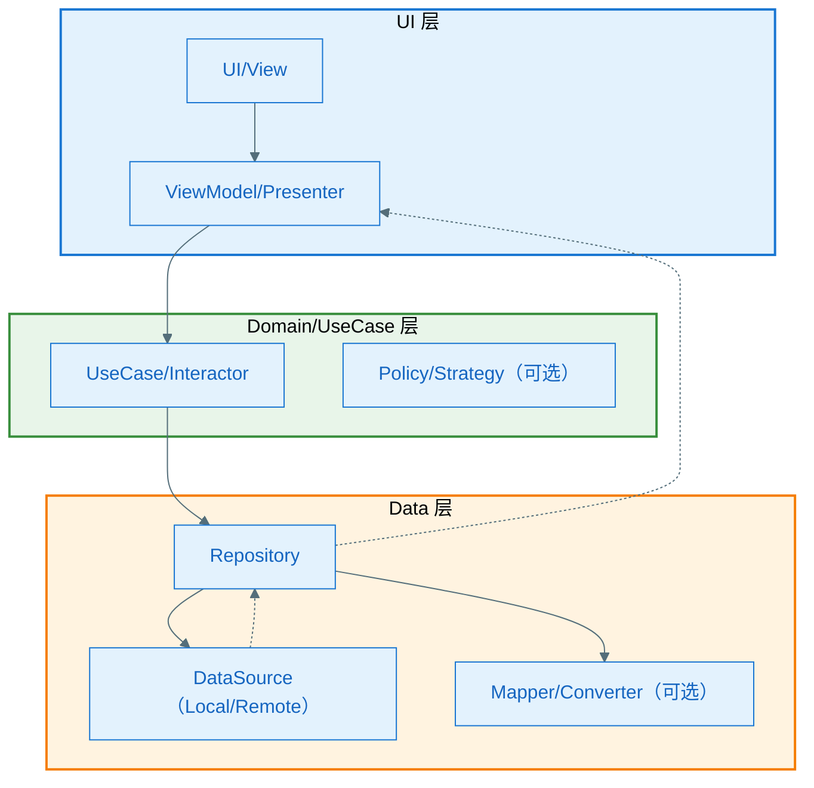
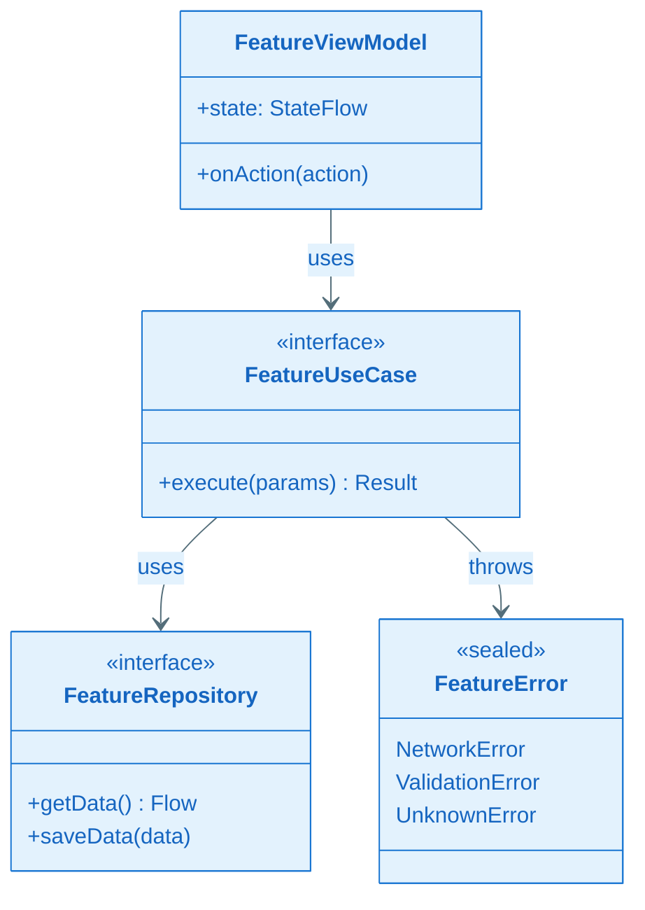
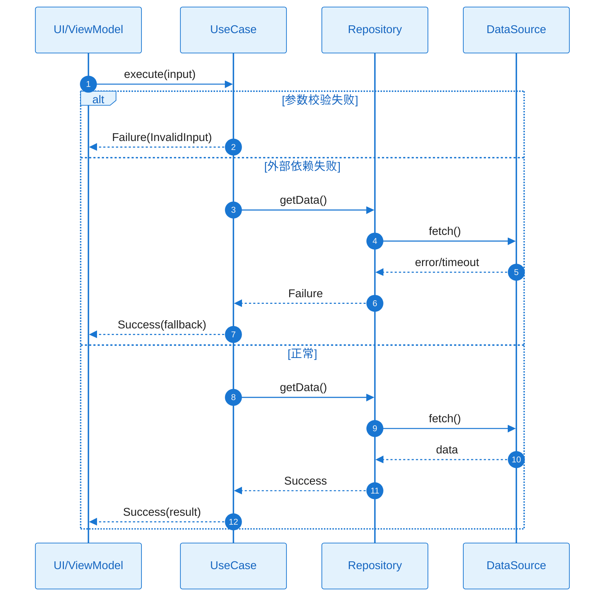

# Plan（工程级蓝图）：[Feature 名称]

**Epic**：EPIC-[编号] - [名称]
**Feature ID**：FEAT-[编号，例如 001]
**Feature Version**：v0.1.0（来自 `spec.md`）
**Plan Version**：v0.1.0
**Plan Level**：Lite / Standard / Deep（按风险选择；高风险/高不确定性选 Deep）
**当前工作分支**：`[epic/... 或 story/... ]`
**Feature 目录**：`specs/epics/EPIC-[编号]-[short-name]/features/FEAT-[编号]-[short-name]/`
**日期**：[YYYY-MM-DD]
**输入**：来自 `Feature 目录/spec.md`

> 规则：
> - Plan 阶段必须包含工程决策、风险评估、算法/功耗/性能/内存评估（量化 + 验收指标）。
> - Implement 阶段**不得**擅自改写 Plan 的技术决策；若必须变更，走增量变更流程并提升 Version。
> - Plan Level 选择建议：
>   - **Lite**：小改动/低风险（无新契约、无持久化迁移、无复杂动效/并发）— 覆盖 A2、A3.1-A3.3、Story Breakdown
>   - **Standard**：默认 — 在 Lite 基础上补齐风险/预算落点；A3.4（组件详细设计）**可选**
>   - **Deep**：新契约/持久化迁移/复杂动效与性能预算/并发竞态/灰度回滚等 — 需补齐 A3.4 与关键 Story 的 L2
>
> **图表规范**：所有 Mermaid 图表必须遵循 `.cursor/rules/mermaid-style-guide.mdc` 中定义的 Material Design 配色方案。

## 变更记录（增量变更）

| 版本 | 日期 | 变更范围（Feature/Story/Task） | 变更摘要 | 影响模块 | 是否需要回滚设计 |
|---|---|---|---|---|---|
| v0.1.0 | [YYYY-MM-DD] | Feature | 初始版本 |  | 否 |

## Plan 前置检查（必须，在开始设计前完成）

> **目的**：确保本 Feature 的 plan 设计基于 EPIC 整体考虑，避免与其他 Feature 重复设计共享组件。
>
> **强制规则**：
> - 在开始 Plan 设计之前，**必须完成以下检查**
> - 若 EPIC 的"跨 Feature 技术策略"中已有 Owner Feature 负责某共享能力，本 Feature **必须复用**，不得另起炉灶
> - 若发现新的共享需求，**必须先更新 epic.md 的"跨 Feature 技术策略"章节**，再继续本 plan

### 前置检查清单

- [ ] 已阅读 `epic.md` 的"跨 Feature 技术策略"章节
- [ ] 已确认本 Feature 在 Plan 执行顺序中的位置（是否有前置依赖）
- [ ] 已检查前置 Feature 的 plan（如果存在），识别可复用组件
- [ ] 本 Feature 需要设计的共享能力已在 EPIC 级登记为 Owner

### 依赖的共享能力（从其他 Feature 复用）

> 列出本 Feature 需要使用但由其他 Feature 设计的共享能力。

| 依赖的共享能力 | Owner Feature | Owner Plan 状态 | 如何获取/引用 |
|---|---|---|---|
| [例如：UI 基础框架] | FEAT-001 | Plan Ready / 待设计 | 引用 FEAT-001 plan.md:A3.4:UIModule |
| [例如：错误处理] | FEAT-001 | Plan Ready | 引用 FEAT-001 plan.md:A3.4:ErrorHandler |

> 若 Owner Feature 的 plan 尚未完成，需要：
> - **等待**：Owner Feature 完成 plan 后再继续本 Feature
> - **协商**：与 Owner Feature 负责人协商接口契约，先行设计

### 本 Feature 提供的共享能力（供其他 Feature 复用）

> 若本 Feature 是某共享能力的 Owner，列出需要设计并提供给其他 Feature 的能力。

| 共享能力名称 | 消费方 Feature | 设计位置（本 plan 章节） | 接口/契约位置 |
|---|---|---|---|
| [例如：主题系统] | FEAT-002, FEAT-003 | A3.4:ThemeModule | Plan-B:B4.1 |

### 前置检查结论

- **检查日期**：[YYYY-MM-DD]
- **检查人**：[姓名/角色]
- **结论**：通过 / 需等待 [Feature] / 需先更新 epic.md
- **备注**：[如有阻塞或协商事项]

---

## 概述

[摘自 Feature 规格说明：核心需求 + 本 Plan 的关键工程决策与取舍]

## Plan-A：工程决策 & 风险评估（必须量化）

### A0. 领域概念（Domain Concepts / Glossary，必须）

> **目的**：统一命名与语义口径，成为后续"架构图/流程图/类图/时序图/接口契约"的**命名权威**。
>
> 要求：
> - 只写本 Feature 涉及或新引入的领域概念；已有概念可引用来源（其他 Feature/EPIC/已有模块文档）
> - 每个概念必须给出：名称、定义、关键属性/状态、与其他概念的关系（可用表格或简易概念图）

#### A0.1 领域概念词汇表（必须）

| 概念（中文） | 名称（英文/代码名） | 定义（一句话） | 关键属性/状态（Top3） | 不变量/约束 | 关联概念 |
|---|---|---|---|---|---|
|  |  |  |  |  |  |

#### A0.2 概念关系图（推荐，可选）

> 使用 Mermaid 类图表达领域概念之间的关系


### A1. 技术选型（候选方案对比 + 决策理由）

| 决策点 | 候选方案 | 优缺点 | 约束/风险 | 决策 | 决策理由 |
|---|---|---|---|---|---|
| [例如：本地存储] | A / B / C |  |  |  |  |

### A2. Feature 全景架构（0 层框架图：边界 + 外部依赖）

> **目的**：一张图展示本 Feature 的全貌——它在系统中的位置、与外部的关系、内部的核心组件。
>
> 要求：
> - 明确 Feature 边界：哪些是本 Feature 新增/修改的，哪些是复用已有的
> - 明确外部依赖的**故障模式**与应对策略
> - 无论 Feature 大小，都必须产出全景图（小 Feature 图更简单，但不能省略）

#### A2.1 Feature 全景架构图（必须）

> 一张图展示：Feature 边界、内部核心组件、外部依赖、数据/控制流向


#### A2.1.1 架构设计说明（必须：理由/决策/思考）

> 用文字把"为什么这样画"说清楚，便于评审与后续实现期不走样。
> **注意**：本节聚焦架构设计原理与决策，不涉及具体代码实现。

- **边界与职责**：为什么这些能力属于本 Feature（而不是其他模块）；哪些能力明确不做（Out of Scope）
- **分层与依赖方向**：为何这样分层；为何允许/禁止某些跨层依赖（例如 UI 不直连 DataSource）
- **关键数据流**：数据从哪里来、去哪里（System of Record）、缓存策略与一致性假设
- **外部依赖策略**：对每个关键依赖的失败模式选择了什么策略（重试/退避/降级/熔断/提示），为什么
- **可演进性**：预留哪些扩展点（接口/策略注入/版本兼容）；未来变化下的最小修改面

#### A2.2 外部依赖清单（必须）

| 依赖项 | 类型 | 提供方（团队名称） | 提供的能力 | 通信方式 | 故障模式 | 我方策略 |
|--------|------|------------------|-----------|----------|----------|----------|
| [后端 API] | 内部服务 | [团队名称] | 数据读写 | HTTPS | 超时/限流/不可用 | 重试+降级 |
| [系统能力] | OS/SDK | [系统/平台] | 权限/存储 | 系统 API | 权限拒绝/不支持 | 提示+引导 |
| [已有模块] | 内部模块 | [团队名称] | 认证/日志 | 函数调用 | — | — |

#### A2.3 通信与交互约束（必须）

- **协议**：REST / gRPC / 函数调用 / 系统 API（按实际选择）
- **超时与重试**：超时阈值、重试次数、退避策略
- **错误处理**：统一错误类型、用户提示策略
- **数据一致性**：强一致/最终一致、补偿策略（如适用）

### A3. Feature 内部设计（1 层设计：组件拆分 + 静态结构 + 动态协作）

> **目的**：展示 Feature 内部"长什么样"——组件划分、类/接口关系、协作方式。
>
> 要求：
> - 无论 Feature 大小，都要明确内部组件划分（即使只有 1-2 个组件）
> - 必须产出：**组件清单（A3.1）+ 全局类图（A3.2）+ 端到端时序图/流程图（A3.3）**
> - A3.4 组件详细设计为**可选**，在 A2/A3.0-A3.3 评审通过后按需补充

#### A3.0 整体设计说明（必须：关键点/决策/思考）

> **目的**：先把整体方案"讲清楚"，再进入组件级拆分与细化，确保评审从整体到局部理解一致。
>
> 要求：
> - 这里写"为什么这样设计"（关键点/取舍/边界），不要堆细节实现
> - 与 A2（全景架构）保持一致：A2 讲外部边界与依赖，这里讲内部方案与协作
> - 所有结论必须可追溯：引用到 spec/plan 的决策点（必要时写 `TODO(Clarify)`）

##### A3.0.1 Feature 内部总体框架图（1 层组件图，必须）

> **目的**：用"组件图"把 Feature 内部设计**一图讲清楚**：组件边界、依赖方向（静态结构）与关键交互（动态协作）。
>
> **硬性要求（不可省略）**：
> - 图中必须覆盖 `A3.1 组件清单` 的**全部组件**（至少用同名节点表示）
> - **静态结构**：用**实线箭头**（`-->`）表示依赖/调用方向（谁依赖谁）
> - **动态协作**：用**虚线箭头**（`-..->`）表示事件/回调/异步消息（如适用；若纯同步，可省略虚线但要说明原因）
> - 图中必须标注**跨层约束**（例如：UI 不得直接依赖 DataSource）



> **跨层约束**：UI 不得直接依赖 DataSource

##### A3.0.2 总体设计说明（必须：职责/协作/关键决策/风险，一节讲清楚）

> **目的**：把"Feature 内部总体框架图"配套的设计说明一次讲清楚，避免分散在多个小标题里重复表述。
> **注意**：本节聚焦组件职责、协作机制与设计原理，不涉及具体代码实现。

- **组件职责（摘要）**：
  - 组件的**完整清单与边界**以 `A3.1 组件清单与职责` 为准；这里仅给出职责要点与协作视角的说明。
  - 每个组件必须能回答：**它负责什么 / 不负责什么 / 对外提供什么契约 / 依赖谁**。

- **组件协作（端到端）**：
  - 用 `A3.3.1 端到端全景时序图集` 覆盖**每个关键流程**（正常 + 关键异常同图 alt/else）。
  - 用 `A3.3.2 Feature 关键流程（流程图）` 覆盖**每个关键用户/系统流程**（正常 + 关键异常同图）。
  - 时序图与流程图必须互相映射：流程图的每个流程都能在时序图集中找到对应 SEQ；时序图的每个失败分支都能映射到异常清单（EX-xxx）。

- **关键技术路径（不写代码，只写机制）**：
  - **通信方式**：函数调用 / Flow / Callback / Event（按实际选择，且在图中明确同步/异步）
  - **线程/并发模型**：主线程/IO、互斥/队列/去重、取消语义（避免重入/竞态）
  - **错误与失败传播**：错误类型/错误码体系、重试/退避/降级/提示、日志字段（与 A2.2/Plan-B 对齐）
  - **数据一致性**：System of Record、缓存策略、一致性假设与补偿策略（与 Plan-B:B3 对齐）

- **关键设计决策清单（必须）**：

| 决策点 | 候选方案 | 决策 | 决策理由 | 影响范围（组件/接口/数据） | 引用来源 |
|---|---|---|---|---|---|
| [例如：状态管理] | A/B/C |  |  |  | plan.md:A3 / spec.md:? |
| [例如：缓存策略] | A/B/C |  |  |  | plan.md:A3 / plan.md:Plan-B:B3 |
| [例如：错误体系] | A/B/C |  |  |  | plan.md:A3.4 / plan.md:Plan-B:B2/B4 |

- **主要风险与权衡（必须）**：
  - **权衡点**：[例如：实时性 vs 功耗]
  - **已知风险**：[例如：外部依赖 SLA 不稳定 → 需降级]（详见 A4 风险与消解策略）

- **完整性与一致性自检（必须通过）**：
  - [ ] `A3.0.1` 图中组件 **100% 覆盖** `A3.1` 的组件清单（同名或可追溯映射）
  - [ ] `A3.2` 全局类图 **100% 覆盖**：关键 UI/VM/UseCase/Repo/DS/Entity/DTO/Error/Mapper 等抽象
  - [ ] `A3.3.1` 时序图集 **100% 覆盖** `A3.3.2` 的每个流程（且同图含异常）
  - [ ] `A3.4`（若启用）对相关组件提供细化设计（类图 + 时序图 + 流程图 + 异常清单）
  - [ ] Plan-A 与 Plan-B 的约束/契约/数据模型无冲突（见 `Plan-B:B0 一致性互校`）

#### A3.1 组件清单与职责（必须）

> **重要**：本表是 Feature 的**组件目录（Component Catalog）**，驱动后续设计。
> - `A3.2 全局类图` 与 `A3.3 端到端时序图/流程图` 必须覆盖本表的所有组件
> - `A3.4 组件详细设计`（可选）：仅对复杂组件按需补充
> - 组件粒度建议：按职责边界划分（UI/ViewModel/UseCase/Repository/DataSource 等）

| 组件 | 职责（一句话） | 输入/输出 | 依赖 | 约束 |
|------|---------------|-----------|------|------|
| [组件A] | [做什么] | [输入→输出] | [依赖哪些组件/外部] | [线程/生命周期/并发约束] |

#### A3.2 Feature 全局类图（静态结构，必须）

> 一张图展示 Feature 涉及的**所有关键类/接口/数据结构**及其依赖关系。
> 这是 Feature 的"静态全景"，后续 A3.4 会对每个组件细化。
>
> **硬性要求（不可省略）**：
> - **必须覆盖所有关键类/接口**：UI / ViewModel / UseCase(or Interactor) / Repository / DataSource(若存在) / Entity / DTO / Error(错误体系) / Mapper(or Converter) / 其他核心抽象
> - **类与接口必须写出成员变量与方法（签名级别）**：字段名 + 类型；方法名 + 参数 + 返回值（必要时标注 throws/错误类型）
> - **依赖方向必须正确**：上层依赖下层；禁止"下层反依赖上层"（除非通过接口回调且在图中显式体现）
> - **与动态图互校**：端到端时序图/流程图中出现的参与者与关键调用，必须在此类图中找到对应类/接口



#### A3.2.1 关键类职责说明

| 类/接口 | 层级 | 职责 | 关键方法 |
|---|---|---|---|
| `FeatureViewModel` | UI |  |  |
| `FeatureUseCase` | Domain |  |  |
| `FeatureRepository` | Data |  |  |

#### A3.3 组件协作与通信（必须）

> 说明组件之间"谁调用谁、传什么、失败怎么办"

- **调用关系**：[UI → ViewModel → UseCase → Repository → DataSource]
- **通信方式**：函数调用 / Flow / Callback / Event（按实际）
- **线程模型**：[主线程：UI/ViewModel] → [IO线程：Repository/DataSource]
- **错误传播**：[DataSource 抛异常 → Repository 捕获转换 → UseCase 返回 Result → ViewModel 更新 State]

#### A3.3.1 Feature 时序图集（必须）

> **要求**：
> - 每个关键流程 1 张时序图
> - 覆盖完整链路上的关键参与者/类/对象（UI→Domain→Data→External）
> - 同图包含正常流程 + 关键异常（用 `alt/else`）

| Seq ID | 流程名称 | 覆盖的异常（EX-xxx） |
|---|---|---|
| SEQ-001 | [流程名称] | EX-001, EX-002 |

##### SEQ-001：[流程名称]



#### A3.3.2 Feature 流程图集（必须）

> **要求**：每个关键流程 1 张图，同图覆盖正常 + 异常分支

##### 流程 1：[流程名称]


| 分支 | 异常ID | 触发条件 | 对策 |
|---|---|---|---|
| 校验失败 | EX-001 |  | 提示用户 |
| 执行失败 | EX-002 |  | 降级/重试 |

#### A3.4 组件详细设计（可选：在 A2/A3.0-A3.3 评审通过后按需补充）

> **定位**：当全局类图（A3.2）与端到端时序图/流程图（A3.3）已足够指导开发时，本节可省略。
>
> **何时需要补充**：
> - 组件内部逻辑复杂（多状态机/多策略/复杂校验）
> - 组件有独立的异常处理体系（需单独枚举）
> - Plan Level = Deep（新契约/持久化迁移/并发竞态等）
>
> 若需补充，对 A3.1 中的相关组件产出：类图、时序图、流程图、异常清单

##### 组件：[组件名]

- **定位**：[解决什么问题]
- **对外接口**：[方法签名、错误类型]
- **失败与降级**：[异常处理策略]

###### 组件类图（必须）


###### 类职责说明

| 类/接口 | 职责 | 关键方法 |
|---|---|---|
| [类名] | [做什么] | [方法1], [方法2] |

###### 组件时序图（含正常+异常）


###### 组件流程图（含正常+异常）


###### 异常清单

| 异常ID | 触发条件 | 错误类型 | 可重试 | 对策 |
|---|---|---|---|---|
| EX-001 |  |  | 是/否 |  |

##### （Capability Feature）交付物与接入契约（若适用）

> 适用于：埋点/组件库/算法SDK 等横切能力 Feature

- **交付物形态**：SDK / 资源包 / 配置 / 服务接口
- **对外接口**：初始化、调用方式、生命周期
- **版本与兼容**：SemVer、向后兼容策略
- **验收标准**：可测量的完成定义

##### （算法 Feature）算法交付清单（若适用）

- **模型提供**：来源/版本/输入输出
- **推理部署**：端侧/服务端、运行时
- **降级策略**：无模型/低端机/失败时的兜底
- **监控**：指标/告警/灰度

### A4. 技术风险与消解策略（绑定 Story/Task）

| 风险ID | 风险描述 | 触发条件 | 影响范围 | 严重度 | 消解策略 | 对应 Story/Task |
|---|---|---|---|---|---|---|
| RISK-001 |  |  |  | High/Med/Low |  | ST-??? / T??? |

### A5. 边界 & 异常场景枚举（数据/状态/生命周期/并发/用户行为）

- **数据边界**：[空/超大/非法/重复/过期等]
- **状态边界**：[状态机不可达/回退/重入等]
- **生命周期**：[前后台切换/旋转/进程被杀/恢复等]
- **并发**：[多线程/协程/并发写/竞态等]
- **用户行为**：[快速连点/断网/弱网/权限拒绝等]

#### A5.1 场景 → 应对措施对照表（必须）

> 目的：把"枚举"落到"可执行对策"，并与 A3.3.2 / A3.3.1 / A3.4 的异常分支互校。

| 场景ID | 场景类别 | 触发条件（可复现） | 影响 | 预期行为（对用户/对系统） | 技术对策（重试/退避/降级/回滚/补偿/去重/限流） | 观测信号（日志/埋点/指标） | 映射（流程/时序/异常ID） |
|---|---|---|---|---|---|---|---|
| SC-001 | 数据 |  |  |  |  |  | 流程1 / SEQ-001 / EX-001 |

### A6. 算法评估（如适用）

- **目标**：[要优化什么？]
- **指标**：[准确率/召回率/误报率/时延等]
- **验收标准**：[量化阈值]
- **测试方法**：[离线数据集/线上灰度/AB/回放]
- **风险**：[数据漂移/极端样本/可解释性]

### A7. 功耗评估（必须量化）

- **Top5% 用户模型**：[设备/网络/使用频次/场景]
- **测量口径**：[电流/唤醒/网络请求/定位等]
- **预估增量**：每日 \(mAh\) 增量 ≤ [阈值]（或每次操作平均 ≤ [阈值]）
- **验收上限**：[明确上限与失败处置]
- **降级策略**：[达到阈值时如何降级/关闭]

### A8. 性能评估（必须量化）

- **前台**：[关键路径 p50/p95/p99 时延预算与阈值]
- **后台**：[任务时延/调度频次/失败重试]
- **验收指标**：[阈值 + 测试方法]
- **降级策略**：[缓存/降采样/降精度/延后等]

### A9. 内存评估（必须量化）

- **峰值增量**：≤ [阈值] MB
- **平均增量**：≤ [阈值] MB
- **生命周期**：[在哪些生命周期阶段常驻/释放]
- **风险与对策**：[泄漏点/大对象/缓存策略]
- **验收标准**：[测试方法 + 阈值]

## Plan-B：技术规约 & 实现约束（保留原 spec-kit 输出内容）

### B0. Plan-A ↔ Plan-B 一致性与互校（必须）

> **目的**：保证 Plan-A 的架构/决策在 Plan-B 的规约/契约/数据模型中有明确落点，避免"上层说一套、规约写一套"。

| Plan-A（决策/假设/约束） | Plan-B（落点） | 自检规则（必须通过） |
|---|---|---|
| A0 领域概念命名 | B3/B4/Story | 术语一致；中英文/代码名一致 |
| A1 技术选型 | B1/B2 | 依赖与分层规约匹配；无矛盾 |
| A2 外部依赖与故障策略 | B4.2 | 超时/重试/降级/错误语义一致 |
| A3 数据一致性/缓存假设 | B3.1/B3.2 | SoR、缓存、迁移策略一致 |
| A3 错误与失败传播 | B2/B4 | 错误分类/错误码/用户提示一致 |


### B1. 技术背景（用于统一工程上下文）

> 注意：为保证工具链自动提取信息，下列字段名需保留英文 Key（括号内可补充中文）。

**Language/Version**：[例如：Kotlin 2.x / Java 17 / 需明确]
**Primary Dependencies**：[例如：Jetpack Compose、Room、Ktor 或 需明确]
**Storage**：[如适用，例如：Room/SQLite、DataStore、文件 或 N/A]
**Test Framework**：[例如：JUnit、Robolectric、XCTest、pytest 或 需明确]
**Target Platform**：[例如：Android 8+、iOS 15+、Linux server 或 需明确]
**Project Type**：[single / web / mobile - 决定源码结构]
**Performance Targets**：[例如：60fps、启动耗时、p95 时延等 或 需明确]
**Constraints**：[例如：p95 <200ms、内存 <100MB、离线可用等 或 需明确]
**Scale/Scope**：[例如：DAU、数据规模、页面数等 或 需明确]

### B2. 架构细化（实现必须遵循）

- **分层约束**：[例如：UI 只能调用 Domain；Domain 不能依赖 UI]
- **线程/并发模型**：[主线程/IO/协程/锁策略]
- **错误处理规范**：[统一错误码/异常封装/用户提示]
- **日志与可观测性**：[结构化字段、采样、敏感信息脱敏]

### B3. 数据模型（引用或内联）

- 若已有 `data-model.md`：在此引用并补充关键约束
- 若未单独拆分：在此列出实体、字段、关系、状态机与校验规则

#### B3.1 存储形态与边界（必须）

> 目的：先明确"数据落在哪里、谁负责持久化、数据生命周期"，再谈表结构/键结构。

- **存储形态**：Room/SQLite / DataStore / SharedPreferences / 文件（JSON/CSV/二进制） / 远端服务 / N/A
- **System of Record（权威来源）**：哪一份数据是权威（例如：DB 为准、文件为准、服务端为准）
- **缓存与派生数据**：哪些字段是派生/可重建的（可用于迁移与降级）
- **生命周期**：常驻/前台/后台/退出时持久化；清理/归档策略
- **数据规模与增长**：数量级、写入频次、读写热点（用于索引与分页策略）

#### B3.2 物理数据结构（若使用持久化存储则必填）

> 要求：写到"可实现/可评审/可迁移"的粒度。
> - 若使用数据库：必须列出每张表的字段、约束、索引、外键、典型查询与迁移策略。
> - 若使用 KV/文件：必须写出键名/文件名规则、序列化结构（JSON schema/字段表）、版本与迁移策略。

##### （数据库）表结构清单

| 表 | 用途 | 主键/唯一约束 | 索引 | 外键 | 典型查询（Top3） | 数据量级 |
|---|---|---|---|---|---|---|
|  |  |  |  |  |  |  |

##### （数据库）字段说明模板（每表一份）

**表**：`<table_name>`

| 字段 | 类型 | 约束（NOT NULL/默认值/范围） | 含义 | 来源/生成方式 | 用途（读写场景） |
|---|---|---|---|---|---|
|  |  |  |  |  |  |

##### （数据库）迁移与兼容策略

- **Schema 版本**：v1 / v2 / …（例如：Room `version`）
- **向后兼容**：新增列默认值；字段废弃策略；索引变更策略
- **迁移策略**：Migration 列表、失败回滚/重试策略、数据回填/重建策略

##### （KV/文件）键/文件结构清单（如适用）

| Key/文件 | 用途 | 结构版本 | Schema/字段说明位置 | 迁移策略 |
|---|---|---|---|---|
|  |  |  |  |  |

### B4. 接口规范/协议（引用或内联）

- 若已有 `contracts/`：在此引用端点/协议文件（OpenAPI/Proto/JSON Schema 等）
- 明确版本策略、兼容策略、错误响应格式

#### B4.1 本 Feature 对外提供的接口（必须：Capability Feature/跨模块复用场景）

> 目的：把"能力交付物"写成可联调的契约（不是仅写类名/方法名）。

- **接口清单**：对外暴露的 API/SDK/Repository 接口列表（含用途、调用方）
- **输入/输出**：字段含义、必填/可选、默认值、范围、示例
- **错误语义**：错误码/错误类型、可重试/不可重试、用户可见提示策略
- **幂等与副作用**：哪些调用必须幂等、幂等键/语义、重复调用的效果
- **并发/线程模型**：调用是否线程安全；协程/线程调度要求；取消语义
- **版本与兼容**：SemVer/接口版本号；新增/弃用策略；向后兼容约束

#### B4.2 本 Feature 依赖的外部接口/契约（必须：存在外部依赖时）

> 目的：把 A2.2 的"依赖清单"下沉到"调用级契约"，避免实现期口径不一致。

- **依赖接口清单**：依赖的模块/服务/API（含 owner/路径）
- **调用约束**：超时/重试/退避/限流；缓存策略；一致性假设
- **失败模式与降级**：超时/限流/不一致/不可用时如何处理（与 A2.2 对齐）

#### B4.3 契约工件（contracts/）与引用方式（推荐）

> 推荐：把可机读的契约沉淀为文件，便于测试与演进。

- **contracts/**：`openapi.yaml` / `*.proto` / `json-schema/*.json` / `errors.md` 等
- **变更流程**：契约变更必须更新版本 + 兼容策略 + 关联 Story/Task

### B5. 合规性检查（关卡）

*关卡：必须在进入 Implement 前通过；若不通过，必须明确整改项并绑定到 Story/Task。*

[基于章程/合规性文件确定的检查项]

### B6. 项目结构（本 Feature）

```text
specs/[###-feature-short-name]/
├── spec.md                     # Feature 规格说明（/speckit.specify）
├── plan.md                     # 本文件（/speckit.plan）
├── tasks.md                    # 任务拆解（/speckit.tasks）
├── research.md                 # 可选：调研产物
├── data-model.md               # 可选：数据模型
├── quickstart.md               # 可选：快速验证/联调指南
└── contracts/                  # 可选：接口契约
```

### B7. 源代码结构（代码库根目录）

<!--
  需执行操作：将下方的占位目录树替换为该功能的具体目录结构。
  删除未使用的选项，并使用实际路径扩展选定的结构（例如：apps/admin、packages/something）。
-->

```text
# 选项1：单项目（默认）
src/
tests/

# 选项2：Web 应用
backend/
frontend/

# 选项3：移动应用 + 接口
api/
android/ 或 ios/
```

**结构决策**：[记录选定的结构，并引用上述捕获的实际目录]

## Story Breakdown（Plan 阶段末尾，必须）

> 规则：
> - Story 是 Feature 的最小可开发单元，用于覆盖对应 FR/NFR。
> - Story 类型必须标注：Functional / Design-Enabler / Infrastructure / Optimization。
> - 这里**只做拆分与映射**，不生成 Task；Task 在 `/speckit.tasks` 阶段生成，且不得改写这里的设计决策。

### Story 列表

#### ST-001：[标题]

- **类型**：Functional / Design-Enabler / Infrastructure / Optimization
- **描述**：[做什么、为什么]
- **目标**：[可验证的结果]
- **覆盖 FR/NFR**：FR-???；NFR-???
- **依赖**：[其他 Story / 外部依赖]
- **可并行**：是/否（原因）
- **关键风险**：是/否（关联 RISK-???）
- **验收/验证方式（高层）**：[如何判断完成；细化到 tasks.md]

#### ST-002：[标题]

- （同上结构）

### Feature → Story 覆盖矩阵

| FR/NFR ID | 覆盖的 Story ID | 备注 |
|---|---|---|
| FR-001 | ST-001 |  |
| NFR-PERF-001 | ST-002 |  |

## Story Detailed Design（L2 二层详细设计：面向开发落码，建议在 L0/L1 定稿后补齐）

> 目标：在 L0（全景边界）与 L1（组件/协作）方案评审通过后，再把每个 Story 的"落码方式"写清楚；做到**不写每行代码**也能明确指导开发如何落地。
> 建议顺序：先完成 Plan-A 的 A2/A3（0/1 层设计）→ 再按需补齐本节（L2）。
>
> 规则：
> - 本节内容属于 Plan 的一部分，视为**权威技术决策输入**（必须纳入版本管理与变更记录）。
> - tasks.md 的每个 Task 应明确引用对应 Story 的详细设计入口（例如：`plan.md:ST-001:4.2 时序图`）。
> - 对每个 Story，必须同时覆盖：**静态结构（类/接口/数据）**、**动态交互（时序）**、**异常矩阵（无遗漏）**、**并发/取消语义**、**验证方式**。
>
> **硬约束（Story 级设计边界）**：
> - **Story 级设计不得新增组件级概念**。Story Detailed Design 只能在 A3.1/A3.4 已定义的组件边界内做细化，不得：
>   - 新增组件（A3.1 未列出的组件）
>   - 新增核心类/接口（A3.2 全局类图未定义的关键抽象）
>   - 新增错误类型/错误码体系（A3.4 异常清单未覆盖的错误分类）
> - **若发现需要新增上述内容**，必须：
>   1. 回到 A3.1/A3.4 修订组件级设计
>   2. 提升 Plan Version（例如 v0.1.0 → v0.2.0）
>   3. 在变更记录中注明影响范围
> - **Review 否决依据**：任何违反此约束的 Story 设计输出，应被驳回并要求修订。

### ST-001 Detailed Design：[标题]

#### 1) 目标 & Done 定义（DoD）

- **目标**：[一句话说明交付能力]
- **DoD（可验证）**：
  - [ ] [功能验收：引用 FR-xxx]
  - [ ] [性能/功耗/内存阈值：引用 NFR-xxx，给出测量方法]
  - [ ] [可靠性/可观测性：引用 NFR-xxx，给出日志/埋点/告警最小集]

#### 2) 代码落点与边界（开发导航）

- **新增/修改目录与文件（建议到包/文件级）**：
  - `app/src/main/...` / `src/...`：[文件路径与职责]
- **分层与依赖约束**：复用 Plan-B:B2（必要时补充本 Story 的额外约束）
- **对外暴露点**：[Repository/UseCase/ViewModel/Service 等；列出函数签名级别的入口]

#### 3) 核心接口与数据契约（签名级别 + 错误语义）

- **接口清单**：
  - `interface XxxRepository { ... }`
  - `class XxxUseCase { ... }`
- **输入/输出约束**：必填/可选、默认值、范围、示例
- **错误语义**：错误类型（Sealed Class/错误码）、可重试/不可重试、用户可见提示策略
- **取消语义**：协程取消/线程中断时必须保证的资源释放与一致性（避免半写入）

#### 4) 静态结构设计（类图/关系图）


##### 关键类职责说明（必须）

> 说明类图中各类的职责、关键方法用途、接口设计意图

| 类/接口 | 核心职责 | 关键方法说明 | 设计考量 |
|---|---|---|---|
| [类名] | [做什么] | [方法1]：用途；[方法2]：用途 | [为何这样设计] |

#### 5) 时序图（含正常+异常）


#### 6) 异常矩阵

| 异常ID | 触发条件 | 错误类型 | 可重试 | 对策 |
|---|---|---|---|---|
| EX-001 |  |  | 是/否 |  |

#### 7) 并发 / 生命周期 / 资源管理

- **并发策略**：串行/并行；互斥（Mutex/队列）；共享状态保护
- **线程/协程模型**：哪些在主线程、哪些在 IO；切线程边界点
- **生命周期**：旋转/前后台切换/进程被杀（若在范围内则写恢复策略；不适用写原因）
- **资源释放**：文件句柄/游标/连接/缓存的释放时机

#### 8) 验证与测试设计（可执行）

- **单元测试**：覆盖核心逻辑与错误分支（与异常矩阵对齐）
- **集成/端到端**：覆盖用户主流程与关键异常流程
- **NFR 验证**：性能/功耗/内存测量方法、数据集/设备模型、阈值

#### 9) 与 Tasks 的映射（可选但推荐）

| 设计要点 | 建议 Task | 备注 |
|---|---|---|
|  | T??? |  |

### ST-002 Detailed Design：[标题]

（复用 ST-001 的结构）

## 复杂度跟踪（仅当合规性检查存在需说明理由的违规项时填写）

| 违规项 | 必要性说明 | 舍弃更简单方案的原因 |
|---|---|---|
| [例如：第4个子项目] | [当前需求] | [为何更简单方案不满足] |
