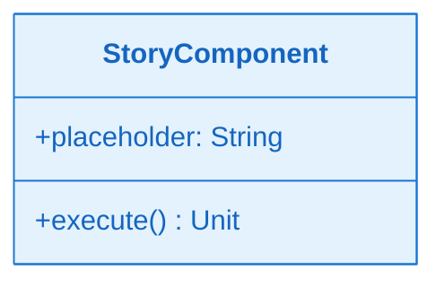
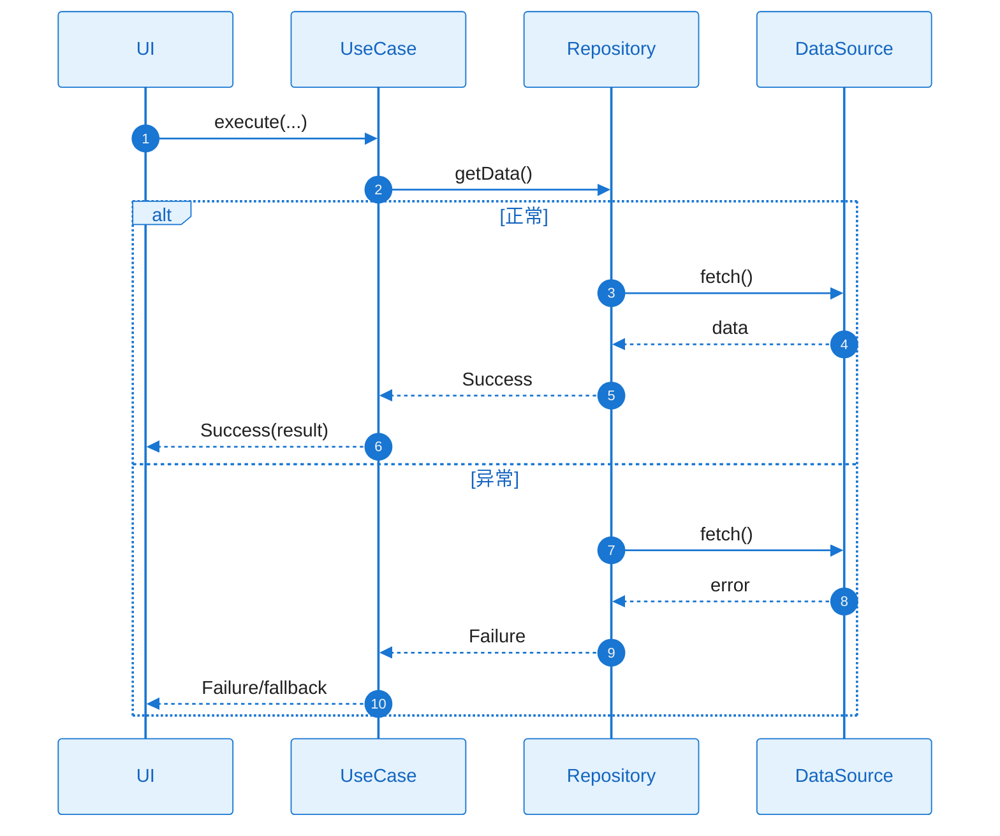

# L2 Story 详细设计（二层详细设计）

本文档与 **plan.md** 配套使用：当 Plan Level = Deep 时，各 Story 的 L2 详细设计在此文档中编写；plan.md 中通过「Story Detailed Design」章节引用本文档。

**使用方式**：必须将本文档与 plan.md 置于同一目录（如同一 Feature 目录下），便于版本管理与评审时一并查看。

**覆盖要求**：执行 Deep 阶段输出时，必须按 Story 序号（ST-001、ST-002、…）覆盖 plan.md 的 Story Breakdown 中**所有** Story 的详细设计，不得遗漏。

**L1 覆盖要求**：所有 Story 的 L2 类图合起来必须覆盖 plan.md A3.2.2 全景类图的**全部**类；每个 Story 的类图应为 L1 对应类的细化版（方法/成员 ≥ L1）。详见 `docs/speckit/story-l2-l1-coverage.md`。

---

## 文档约定

**覆盖要求**：
- 对每个 Story，必须同时覆盖：**需求描述**、**功能设计（类图/时序图/触发条件/系统响应）**。
- **禁止省略或引用**：所有内容须在本文档内完整书写，不得使用「见 A3」「同上」「参见 plan.md」等省略或引用方式。

**L1→L2 覆盖**：每个 Story 须明确列出「本 Story 覆盖的 L1 类」（来自 A3.2.2）；类图须覆盖这些 L1 类，且方法/成员粒度 ≥ L1 全景类图。

**图表完整性**：
- **类图**：须为**完整详细**的类图，覆盖本 Story 涉及的全部关键类、接口与方法签名；**不得引用** plan.md 组件设计（A3）的类图；所有 Story 类图并集 ≥ A3.2.2 全景类图。
- **时序图**：须为**完整详细**的时序图，覆盖正常流程与所有关键异常分支；**不得引用** plan.md 组件设计的时序图。
- 类图、时序图须基于本工程实际架构与真实代码，遵循 `.cursor/rules/specify-diagram-requirements.mdc`。

**引用约定**：
- tasks.md 的每个 Task 应明确引用对应 Story 的详细设计入口（例如：`story_detail_design.md:ST-001:功能设计:时序图`）。

---

### ST-001 Detailed Design：[标题]

#### 0) 本 Story 覆盖的 L1 类（来自 plan A3.2.2）

| L1 类 | 覆盖说明 |
|-------|----------|
| [类名] | [本 Story 负责细化该类的原因/范围] |

> 所有 Story 的「本 Story 覆盖的 L1 类」合起来，必须覆盖 A3.2.2 全景类图的全部类。

#### 1) 需求及描述

- **需求描述**：[Story 做什么，为什么需要，关联的 FR/NFR]
- **需求依赖**：[依赖的其他 Story、外部模块、前置条件]
- **使用范围**：[哪些模块/页面会使用，影响范围]
- **使用接口**：[对外暴露的接口/方法签名]
- **DoD（验收标准）**：
  - [ ] [功能验收：引用 FR-xxx]
  - [ ] [NFR 验收：性能/功耗/内存阈值，引用 NFR-xxx]

#### 2) 功能设计

##### 功能设计关键说明

> **目的**：用精炼的文字说清楚该 Story 的实现核心与关键技术路径。
>
> **要求**：3-5 段精炼文字（每段 2-3 句话），覆盖：核心实现思路、关键技术选型、主要类职责、数据流向、失败处理策略。

**核心实现思路**：
- [一句话说明本 Story 的实现核心]
- [关键技术决策：为什么选择这个方案而非其他方案]

**关键类与职责划分**：
- [列出 2-4 个核心类，每个类一句话说明职责]
- [说明类之间的协作关系：谁依赖谁，为什么这样分层]

**失败处理与边界**：
- [关键错误场景的处理策略：重试/降级/提示]
- [资源释放与取消语义：协程取消时如何保证一致性]

##### 类图（完整详细，不可引用）

> **完整性**：须在本文档内绘制**完整详细**的类图，覆盖本 Story 涉及的全部关键类、接口与方法签名；**不得引用** plan.md 组件设计（A3）的类图。
> **真实代码**：基于本工程实际架构与真实代码，使用真实类名。遵循 `.cursor/rules/specify-diagram-requirements.mdc`。

**关键类职责说明**：

| 类/接口 | 核心职责 | 关键方法说明 |
|---|---|---|
| [类名] | [做什么] | [方法1]：用途；[方法2]：用途 |

##### 时序图（完整详细：正常+异常，不可引用）

> **完整性**：须在本文档内绘制**完整详细**的时序图，覆盖正常流程与**所有**关键异常分支；**不得引用** plan.md 组件设计的时序图。
> **覆盖要求**：从触发到响应的完整方法调用链，不得遗漏核心交互步骤；须使用 `alt/else` 明确区分正常与异常分支。
> **真实代码**：participant 使用本工程真实类名。遵循 `.cursor/rules/specify-diagram-requirements.mdc`。

##### 触发条件与系统响应

| 触发条件 | 系统响应（正常流程） | 异常处理 |
|---|---|---|
| [用户操作/事件] | [正常流程描述] | [异常情况及对策] |

---

### ST-002 Detailed Design：[标题]

（同 ST-001 结构，含「本 Story 覆盖的 L1 类」小节）

---

*更多 Story 按相同结构追加。*

---

## L1 类覆盖矩阵（必须填写）

> 全部 Story 输出完成后，填写本矩阵。每个 A3.2.2 全景类图中的类必须至少被一个 Story 覆盖。

| L1 类（来自 plan A3.2.2） | 覆盖的 Story | 覆盖的 L2 类图位置 | 备注 |
|---------------------------|--------------|---------------------|------|
| [类名 1] | ST-xxx | ST-xxx 类图 | |
| [类名 2] | ST-xxx | ST-xxx 类图 | |
| ... | ... | ... | ... |

**自检**：上述矩阵是否包含 A3.2.2 全景类图中的**所有**类？若有遗漏，需补充到相应 Story 的 L2 设计或说明为何不需覆盖。
