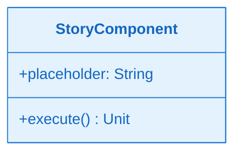
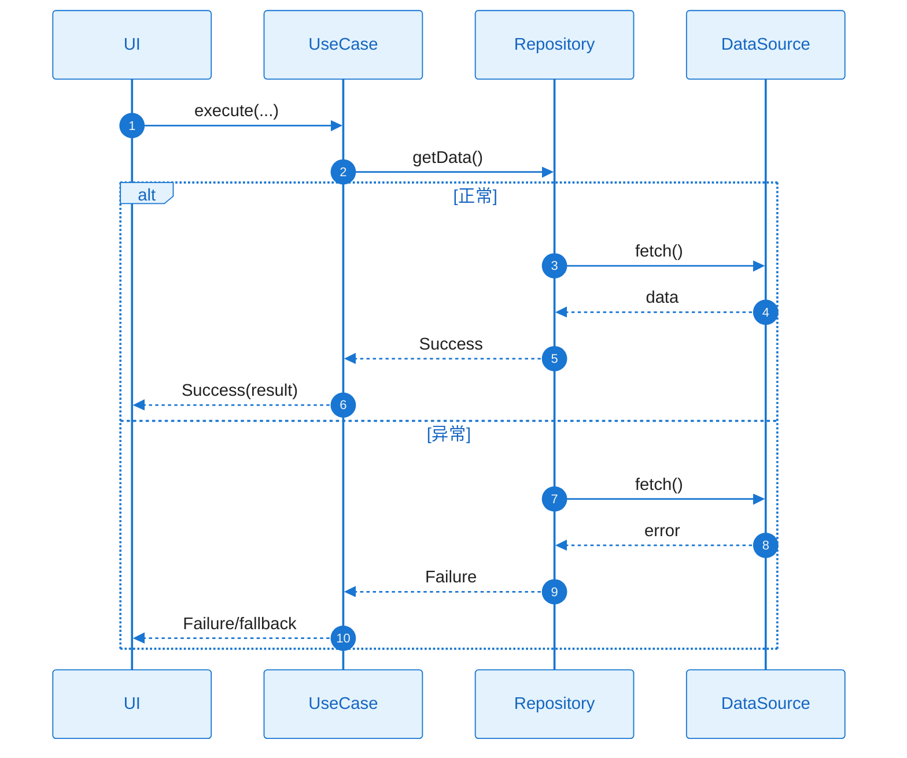

# L2 Story 详细设计：`ST-001_<slug>`（二层详细设计 · 单 Story 文件）

> **文件位置**：`specs/epics/EPIC-xxx/features/FEAT-xxx/l2_design/ST-001_<短slug>.md`（**每个 Story 独占一个文件**；文件名必须以 `ST-xxx_` 开头。）
>
> **配套**：EPIC 软件设计说明书 `epic-design.md` 的 **§十三** 为全 EPIC 的 L2 **索引与依赖总览**；本文档须与 §13.1 / §13.2 及 §十二 Story 拆解中的依赖列 **一致**。

**覆盖要求**：
- **Standard 深度**：本 Story 写入概要（需求/DoD + 简要功能设计说明）
- **Deep 深度**：本 Story 必须补齐完整详细设计（类图/时序图/触发条件/系统响应），不得遗漏

---

## L2 依赖与引用

> **必须与 `epic-design.md` §13.1 / §13.2 对齐**：此处变更时同步更新 EPIC 设计说明书中的索引与依赖图（表）。

| 类型 | 说明 |
| --- | --- |
| **前置 ST（本 Feature）** | [无则填「—」；若有，列出 ST-xxx，并链到同目录下文件，如 `./ST-000_foo.md`] |
| **前置 ST（跨 Feature）** | [无则填「—」；若有，写清 ST-xxx 与相对路径，如 `../../FEAT-other/l2_design/ST-050_bar.md`] |
| **对外契约** | [本 Story 完成后，其他 ST 可依赖的接口/模块边界摘要] |

---

## 文档约定

**覆盖要求**：
- 必须覆盖：**需求描述**、**功能设计（类图/时序图/触发条件/系统响应）**。
- **禁止省略或引用**：所有内容须在**本文件内**完整书写，不得使用「见 A3」「同上」「参见 plan.md」等省略或引用方式。

**图表完整性**：
- **类图**：须为**完整详细**的类图，覆盖本 Story 涉及的全部关键类、接口与方法签名；**不得引用** plan.md 组件设计（A3）的类图。
- **时序图**：须为**完整详细**的时序图，覆盖正常流程与所有关键异常分支；**不得引用** plan.md 组件设计的时序图。
- 类图、时序图须基于本工程实际架构与真实代码，遵循 `.cursor/rules/specify-diagram-requirements.mdc`。

**引用约定**：
- tasks.md 的每个 Task 应明确引用本文件中的设计段落（例如：`l2_design/ST-001_<slug>.md:功能设计:时序图`，或自 EPIC 根起的完整相对路径）。

---

## ST-001 Detailed Design：[标题]

#### 1) 需求及描述

- **需求描述**：[Story 做什么，为什么需要，关联的 FR/NFR]
- **需求依赖**：[依赖的其他 Story、外部模块、前置条件——与上文「L2 依赖与引用」一致]
- **使用范围**：[哪些模块/页面会使用，影响范围]
- **使用接口**：[对外暴露的接口/方法签名]
- **DoD（验收标准）**：
  > **格式约束**：每条 DoD 必须绑定 spec.md 中的 FR-xxx 或 NFR-xxx；**不得存在无 ID 的 DoD**。若暂未映射，使用 `⚠️ 待映射 FR` 占位，并在完成后补全。
  - [ ] `[FR-xxx]` [功能验收描述：用户可观测的行为或结果]
  - [ ] `[NFR-xxx]` [NFR 验收：性能/功耗/内存阈值，须为可量化指标]
  - [ ] **自检**：每条 DoD 均已映射到 spec.md 的 FR-xxx 或 NFR-xxx（不得存在无 ID 的 DoD）

#### 2) 功能设计

##### 功能设计关键说明

> **目的**：用清晰连贯的文字把该 Story 的实现核心与技术链路讲清楚、讲详细、讲通顺，确保开发能直接依据此说明动手实现。
>
> **要求**：以下各小节按需展开，内容不限长度——以「技术链路完整、逻辑自洽、开发可直接执行」为标准，不追求字数精简。

**核心实现思路**：
- [说明本 Story 要解决什么问题、整体方案是什么、关键技术路径如何走——要说清楚**怎么实现、怎么落地**，而不是只描述"做了什么"；需覆盖：入口在哪里、数据怎么流转、核心逻辑在哪个类处理、最终结果如何输出]
- [关键技术决策：**必须说明"选 A 而非 B 的原因"**，格式：`选 [方案A] 而非 [方案B]，原因：[具体理由]`；不得只写结论]

**失败处理与边界**：
- **必须区分以下三种策略，并指明由哪个类负责处理**：
  - **重试**：何种错误触发重试、最大次数、退避策略、由哪个类执行
  - **降级**：降级到什么状态（本地缓存 / 占位数据 / 空视图）、由哪个类决策
  - **透传/抛出**：哪类错误直接向上层透传、最终由谁呈现给用户
- [资源释放与取消语义：协程取消时如何保证一致性]

##### 类图（完整详细，不可引用）

> **完整性**：须在本文档内绘制**完整详细**的类图，覆盖本 Story 涉及的全部关键类、接口与方法签名；**不得引用** plan.md 组件设计（A3）的类图。
> **真实代码**：基于本工程实际架构与真实代码，使用真实类名。遵循 `.cursor/rules/specify-diagram-requirements.mdc`。

**关键类职责说明**：

| 类/接口 | 核心职责 | 关键方法说明 |
|---|---|---|
| [类名] | [做什么] | [方法1]：用途；[方法2]：用途 |

##### 时序图（完整详细：正常+异常，不可引用）

> **完整性**：须在本文档内绘制**完整详细**的时序图，覆盖正常流程与**所有**关键异常分支；**不得引用** plan.md 组件设计的时序图。
> **覆盖要求**：从触发到响应的完整方法调用链，不得遗漏核心交互步骤；须使用 `alt/else` 明确区分正常与异常分支。
> **真实代码**：participant 使用本工程真实类名。遵循 `.cursor/rules/specify-diagram-requirements.mdc`。
> **图后文字说明（必须）**：时序图代码块**紧下方**须有「**协作者与过程说明**」小节，**详细**写出触发入口、逐跳协作与职责、数据/状态变化、各 `alt/else` 分支条件与结果、正常/异常结束条件——不得用一句话概括（详见 `.cursor/rules/specify-diagram-requirements.mdc` §四）。
>
> **异常分支覆盖检查清单（生成时必须逐项判断，适用的必须在图中有对应 `alt/else`）**：
> | # | 异常类型 | 适用性 |
> |---|---------|-------|
> | 1 | 网络请求失败（超时 / 连接错误 / HTTP 错误码） | ✅ 适用 / N/A 不涉及网络 |
> | 2 | 数据解析 / 类型错误（JSON 解析异常、类型不匹配） | ✅ 适用 / N/A |
> | 3 | 本地持久化读写失败（Room / File IO 异常） | ✅ 适用 / N/A 无本地存储 |
> | 4 | 协程取消（用户离开页面 / 系统回收资源） | ✅ 适用 / N/A（几乎所有异步 Story 均适用） |
> | 5 | 运行时权限被拒绝（Camera / Location / Storage 等） | ✅ 适用 / N/A 不涉及权限 |
> | 6 | 数据为空 / 空状态（Empty State，首次加载无数据） | ✅ 适用 / N/A |
> | 7 | 并发竞争（多处同时写同一资源、重复提交） | ✅ 适用 / N/A 无并发写 |
>
> 标注为 ✅ 的项，在图中未体现 `alt/else` 分支 → **视为内容缺失**，不满足完整性要求。

**协作者与过程说明**（必须，紧随上图）：

1. **触发与入口**：[谁、在什么条件下发起；对应图中首批消息]
2. **协作链与职责**：[逐跳说明谁调谁、目的、关键参数/返回值语义]
3. **工作过程与状态**：[中间状态或数据如何变化]
4. **分支与异常**：[对图中每个 alt/else：进入条件、各分支行为、用户可见结果]
5. **结束条件**：[成功结束与各类失败/降级结束分别是什么]

##### 触发条件与系统响应

> **职责说明**：此表**专门覆盖时序图未画出的场景**，重点关注低频触发、系统级触发、后台恢复等边界情况。
> **禁止重复**：若此表行内容与时序图中已有的 `alt/else` 分支完全相同，视为未完成——须删除重复行或补充时序图中未涵盖的新场景。
> **典型补充场景（参考）**：进程被系统杀死后重新进入、DeepLink 冷启进入时状态恢复、锁屏解锁后续操、后台任务完成后前台无界面时的处理。

| 触发条件 | 系统响应（正常流程） | 异常处理 |
|---|---|---|
| [用户操作/事件——时序图主流程已覆盖，此处填时序图未画出的场景] | [正常流程描述] | [异常情况及对策] |
| [系统级触发：如进程恢复 / DeepLink / 锁屏解锁] | [对应响应] | [对应降级或兜底] |

---

> **其他 Story**：在 `l2_design/` 下**另建** `ST-002_<slug>.md`、`ST-003_<slug>.md` … 复制本模板结构并替换 `ST-001` 与章节标题中的 Story ID。
