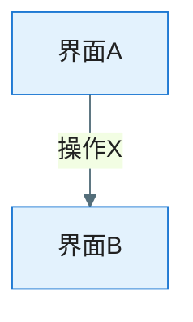

# UX 设计稿解析：FEAT-[编号] - [Feature 名称]

> **定位**：AI 综合三种设计输入来源（**本地图片 / Figma MCP / Pencil**）后，针对**本 Feature** 产出的体验呈现事实源；将原始输入转化为带来源追溯、置信度标注、与 `spec.md` 交叉比对的结构化文档。
>
> **与输入文件的关系**：交互稿与视觉稿均可来自——（1）本地图片（`design/` 截图）；（2）Figma 链接（**Figma MCP**）；（3）Pencil 文件（**Pencil MCP**）。设计素材放于本 Feature 目录 `design/`（推荐）或 EPIC 共享 `design/` 下按 Feature 分子目录。

**Epic**：EPIC-[编号] - [名称]（来自 `epic.md`）
**Feature**：FEAT-[编号] - [名称]
**Epic Version**：v0.1.0（来自 `epic.md`）
**ux-design Version**：v0.1.0
**创建/更新日期**：[YYYY-MM-DD]
**解析模式**：[交互 / 视觉 / 全量]
**输入质量等级**：[A — 交互+视觉齐备 / B — 主要界面覆盖 / C — 部分覆盖 / D — 兜底]
**需求参照**：`spec.md`（本 Feature）、`epic.md`（入口与跨 Feature 交界）

**设计素材输入**：

| # | 输入源 | 状态 | 说明 |
|---|--------|------|------|
| 1 | **本地图片**（`design/*.png` 等） | [有 / 无] | 本 Feature 交互稿/视觉稿截图 |
| 2 | **Figma 链接**（`design/figma-links.md` 或 $ARGUMENTS） | [有 / 无] | **Figma MCP** 读取节点、样式、原型 |
| 3 | **Pencil 文件**（`design/*.pen`） | [有 / 无] | **Pencil MCP** 读取节点树 |

**设计稿来源明细**：

| 序号 | 文件/链接 | 来源类型 | 稿别 | 说明 |
|------|-----------|----------|------|------|
| 1 | [路径或 URL] | 本地图片 / Figma / Pencil | 交互 / 视觉 | [界面名称、状态] |

---

## 信息架构（本 Feature）

> 本 Feature 内的页面结构、入口与对外交界。

- **Feature 入口**：[从设计稿/epic.md 识别：Tab/Deep Link/其他 Feature 跳转进入方式]
- **与 EPIC/其他 Feature 的交界**：[主导航项、共享组件、跨 Feature 跳转；若设计稿含全局壳层，在此摘要并注明是否与其他 Feature ux-design 需对齐]
- **页面/流程层级**：[本 Feature 内界面层级]
- **界面清单**：

| 界面 ID | 名称 | 用途 | 上级/入口 | 界面类型 | 设计稿来源 | 置信度 |
|---------|------|------|-----------|----------|------------|--------|
| UI-001 |  |  |  | Screen/Dialog/BottomSheet/Overlay | [design/xxx.png / Figma] | ✅/⚠️/❓ |

---

## 交互说明（交互稿解析结果）

> 从交互稿中提取的本 Feature 交互逻辑。每条规则标注来源设计稿。

### 页面流转图

### 逐屏交互规则

| 界面 | 交互元素 | 触发操作 | 响应行为 | 目标界面/状态 | 来源设计稿 | 置信度 |
|------|----------|----------|----------|---------------|------------|--------|
|  |  |  |  |  |  | ✅/⚠️/❓ |

### 状态定义

| 状态 | 视觉表现 | 触发条件 | 退出条件 | 来源设计稿 | 置信度 |
|------|----------|----------|----------|------------|--------|
| Loading |  |  |  |  | ✅/⚠️/❓ |
| 空态 |  |  |  |  | ✅/⚠️/❓ |
| 错误态 |  |  |  |  | ✅/⚠️/❓ |

### 反馈方式

| 场景 | 反馈形式 | 时机 | 持续时间 | 来源设计稿 |
|------|----------|------|----------|------------|
|  |  |  |  |  |

### 异常与边界交互

| 异常场景 | 交互对策 | 恢复方式 | 来源设计稿 |
|----------|----------|----------|------------|
|  |  |  |  |

---

## 导航与手势（本 Feature）

- **导航模式**：[Navigation Component / Compose Navigation]
- **返回行为**：[系统返回 / Toolbar / 手势返回]
- **Deep Link**：[本 Feature 是否支持、scheme 规则]
- **手势交互**：

| 手势 | 作用区域 | 行为 | 冲突处理 | 来源设计稿 |
|------|----------|------|----------|------------|
|  |  |  |  |  |

---

## 视觉规范（视觉稿解析结果）

> 本 Feature 视觉规范；若沿用 EPIC 全局主题，注明「沿用 [其他 Feature/设计系统] 并在差异处标注」。

### 主题与色板

| 色彩角色 | 色值（Light） | 色值（Dark） | 用途 | 来源 | 置信度 |
|----------|---------------|--------------|------|------|--------|
| Primary |  |  |  | [Figma / Pencil / 图片] | ✅/⚠️/❓ |

### 布局结构

**关键界面布局标注**：

| 界面 | 区域 | 宽度 | 高度 | 上间距 | 左间距 | 说明 | 来源 | 置信度 |
|------|------|------|------|--------|--------|------|------|--------|
|  |  |  |  |  |  |  |  | ✅/⚠️/❓ |

### 组件清单

| 组件 | 使用场景 | Material 组件 | 自定义样式 | 使用位置 | 来源 | 置信度 |
|------|----------|---------------|------------|----------|------|--------|
|  |  |  |  |  |  | ✅/⚠️/❓ |

### 动效/过渡

| 动效 | 场景 | 时长 | 缓动曲线 | 实现方式 | 来源 | 置信度 |
|------|------|------|----------|----------|------|--------|
|  |  |  |  |  |  | ✅/⚠️/❓ |

### 响应与适配

- [屏幕尺寸 / 折叠屏 / 字体缩放 / 横竖屏策略]

---

## 无障碍（Accessibility）

- **内容描述**、**触控区域**、**对比度**、**TalkBack**：[本 Feature 要点]

---

## AI 视觉理解验证图

> 图片存放于 `design/ai-understanding/`。

| 界面 ID | 界面名称 | 验证图 | 对应设计稿 |
|---------|----------|--------|------------|
|  |  |  |  |

**AI 理解要点**：
- [逐图说明]

---

## 设计稿索引

| 序号 | 页面/组件 | 说明 | 形式 | 路径或链接 | 映射 FR/流程 | 解析状态 |
|------|-----------|------|------|------------|--------------|----------|
|  |  |  | 图片/Figma/Pencil |  | FR-??? | 已解析/待解析 |

---

## 遗漏与待确认

> 对照**本 Feature** `spec.md` FR/NFR/AC/用户旅程。

### 设计稿未覆盖的场景

| 序号 | 来源（spec FR/AC） | 场景描述 | 严重程度 | 建议 |
|------|---------------------|----------|----------|------|
|  |  |  | 高/中/低 |  |

### 输入源冲突

| 序号 | 冲突内容 | 来源 A（已采信） | 来源 B（待确认） | 说明 |
|------|----------|------------------|------------------|------|
|  |  |  |  |  |

### 待确认项

| 序号 | 相关界面/组件 | 疑问描述 | 可能的解读 | 需确认方 |
|------|---------------|----------|------------|----------|
|  |  |  |  |  |

---

## 变更记录（增量变更）

| 版本 | 日期 | 变更范围 | 变更摘要 | 影响 spec/视觉 | 是否需回滚 |
|------|------|----------|----------|----------------|-------------|
| v0.1.0 | [YYYY-MM-DD] | 初始 | 初版 | — | 否 |
