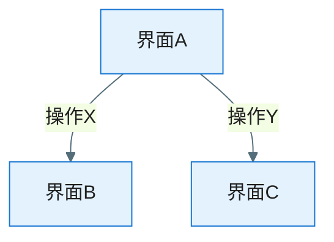

# UX 设计稿解析：EPIC-[编号] - [EPIC 名称]

> **定位**：从设计稿（交互稿/视觉稿）中**提取并结构化**交互逻辑与视觉规范，供团队验证 AI 理解是否完整、正确。所有提取内容须标注设计稿来源，并与 spec.md 交叉比对标出遗漏。

**Epic**：EPIC-[编号] - [名称]
**Epic Version**：v0.1.0（来自 `epic.md`）
**ux-design Version**：v0.1.0
**创建/更新日期**：[YYYY-MM-DD]
**解析模式**：[交互 / 视觉 / 全量]
**需求参照**：`epic.md`、各 `features/*/spec.md`
**设计稿来源**：

| 序号 | 文件/链接 | 类型 | 说明 |
|------|-----------|------|------|
| 1 | [路径或 URL] | 图片 / Pencil / Figma | [交互稿/视觉稿/综合] |

---

## 信息架构

> 从设计稿中识别出的整体页面结构与导航关系。

- **跨 Feature 导航与流程**：[从设计稿识别：底部 Tab/主导航、各 Feature 入口、跨 Feature 流程]
- **页面/流程层级**：[从设计稿识别的界面层级；可按 Feature 分节]
- **界面清单**（从设计稿中识别）：

| 界面 ID | 名称 | 所属 Feature | 用途 | 上级/入口 | 界面类型 | 设计稿来源 |
|---------|------|--------------|------|-----------|----------|------------|
| UI-001 |  |  |  |  | Screen/Dialog/BottomSheet/Overlay | [design/xxx.png / xxx.pen / Figma] |

---

## 交互说明（交互稿解析结果）

> 从交互稿中提取的所有交互逻辑和规则。每条规则标注来源设计稿。

### 页面流转图

> 用 Mermaid 还原从设计稿中提取的页面跳转关系。

### 逐屏交互规则

> 每个界面的触发操作、响应行为、状态变化。

| 界面 | 交互元素 | 触发操作 | 响应行为 | 目标界面/状态 | 来源设计稿 |
|------|----------|----------|----------|---------------|------------|
|  |  | [点击/滑动/长按/输入] |  |  | [design/xxx.png] |

### 状态定义

> 从设计稿中识别出的各状态及其视觉表现。

| 状态 | 视觉表现 | 触发条件 | 退出条件 | 来源设计稿 |
|------|----------|----------|----------|------------|
| Loading | [骨架屏/转圈/Shimmer] | [数据加载中] | [加载完成/超时/失败] |  |
| 空态 | [空状态插画+引导文案] | [无数据] | [有数据] |  |
| 错误态 | [错误提示+重试按钮] | [请求失败] | [重试成功] |  |
| 成功态 | [正常内容] | [数据就绪] | — |  |
| 离线态 | [离线提示Banner] | [网络断开] | [网络恢复] |  |

### 反馈方式

| 场景 | 反馈形式 | 时机 | 持续时间 | 来源设计稿 |
|------|----------|------|----------|------------|
| 操作成功 | [Snackbar/Toast] | [操作完成后] | [2s] |  |
| 操作失败 | [内联错误/Dialog] | [即时] | [用户关闭] |  |
| 后台处理 | [进度条/通知] | [触发后] | [处理完成] |  |

### 异常与边界交互

> 从设计稿中识别的异常处理方案。

| 异常场景 | 交互对策 | 恢复方式 | 来源设计稿 |
|----------|----------|----------|------------|
| 网络超时 | [显示错误态+重试按钮] | [点击重试] |  |
| 权限拒绝 | [引导至系统设置] | [返回后重新检测] |  |
| 断网 | [离线态Banner+本地缓存] | [网络恢复后自动刷新] |  |
| 快速连点 | [按钮防抖/Loading态禁用] | [操作完成后恢复] |  |

---

## 导航与手势

> 从设计稿中识别的 Android 导航与手势规范。

- **导航模式**：[从设计稿识别：Navigation Component/Compose Navigation]
- **返回行为**：[系统返回键/Toolbar返回/手势返回 的处理策略]
- **Deep Link**：[是否支持 Deep Link 进入，URL scheme 规则]
- **手势交互**：

| 手势 | 作用区域 | 行为 | 冲突处理 | 来源设计稿 |
|------|----------|------|----------|------------|
| 左滑 | [列表项] | [显示操作菜单] | [与系统返回手势的冲突处理] |  |
| 下拉 | [列表顶部] | [刷新] | — |  |
| 长按 | [卡片/项目] | [多选模式/上下文菜单] | — |  |

---

## 视觉规范（视觉稿解析结果）

> 从视觉稿中提取的视觉规范。每项标注来源设计稿。

### 主题与色板

- **主题**：[Material 3 / 自定义主题；支持 Light/Dark 模式]
- **色板**（从设计稿提取）：

| 色彩角色 | 色值（Light） | 色值（Dark） | 用途 | 来源设计稿 |
|----------|---------------|--------------|------|------------|
| Primary |  |  |  |  |
| Secondary |  |  |  |  |
| Background |  |  |  |  |
| Surface |  |  |  |  |
| Error |  |  |  |  |

### 布局结构

> 用 Markdown 表格展示关键界面的布局结构和间距标注。

- **栅格**：[使用 Material 3 的 Canonical Layouts 或自定义栅格]
- **间距规范**：[Spacing 规范，如 4dp/8dp/16dp/24dp]
- **安全区域**：[系统栏/刘海屏/挖孔屏 适配策略（WindowInsets）]

**关键界面布局标注**（从视觉稿提取的尺寸与间距）：

| 界面 | 区域 | 宽度 | 高度 | 上间距 | 左间距 | 说明 | 来源设计稿 |
|------|------|------|------|--------|--------|------|------------|
|  | [顶栏/内容区/底栏] |  |  |  |  |  |  |

### 组件清单

> 从设计稿中识别出的组件列表。

| 组件 | 使用场景 | Material 组件 | 自定义样式 | 使用位置 | 来源设计稿 |
|------|----------|---------------|------------|----------|------------|
| 主按钮 | [核心操作] | [FilledButton] | [颜色/圆角/字号] |  |  |
| 卡片 | [内容展示] | [ElevatedCard] | [阴影/圆角/内间距] |  |  |
| 列表 | [数据列表] | [LazyColumn] | [分隔线/间距/行高] |  |  |
| 输入框 | [用户输入] | [OutlinedTextField] | [样式/校验/提示] |  |  |
| 底部导航 | [主导航] | [NavigationBar] | [图标/标签/选中态] |  |  |

### 动效/过渡

| 动效 | 场景 | 时长 | 缓动曲线 | 实现方式 | 来源设计稿 |
|------|------|------|----------|----------|------------|
| 页面切换 | [Screen跳转] | [300ms] | [EaseInOut] | [Compose Animation / Navigation Transition] |  |
| 列表项入场 | [首次加载] | [200ms] | [EaseOut] | [AnimatedVisibility] |  |
| 按钮反馈 | [点击] | [100ms] | [Linear] | [Ripple Effect] |  |

### 响应与适配

- 屏幕尺寸分级：[Compact (<600dp) / Medium (600-840dp) / Expanded (>840dp)]
- 折叠屏适配：[展开态/折叠态 布局策略]
- 字体缩放：[支持系统字体缩放至 200%，关键 UI 不溢出]
- 横竖屏：[是否锁定方向，或提供横屏适配]

---

## 无障碍（Accessibility）

- **内容描述**：[所有交互元素须提供 contentDescription]
- **触控区域**：[最小触控区域 48dp × 48dp]
- **对比度**：[文字/背景对比度 ≥ 4.5:1（正文）、≥ 3:1（大文字）]
- **屏幕阅读器**：[TalkBack 适配要点，traversal 顺序]

---

## 设计稿索引

> **设计稿来源**（可组合使用）：**图片**（放于 `design/` 下，如 .png/.jpg/.webp）、**Pencil 文件**（`design/*.pen`）、**Figma 链接**。

| 序号 | 页面/组件 | 说明 | 所属 Feature | 形式 | 路径或链接 | 映射 FR/流程 | 解析状态 |
|------|-----------|------|--------------|------|------------|--------------|----------|
|  |  |  |  | 图片/Pencil/Figma |  | FR-??? / 流程? | 已解析/待解析/无法解析 |

---

## 遗漏与待确认

> AI 对照 spec.md FR/NFR/用户旅程，检测设计稿中未覆盖的场景和无法确定的细节。

### 设计稿未覆盖的场景

> 以下场景在 spec.md 中有定义，但在设计稿中未找到对应设计。

| 序号 | 来源（spec.md FR/AC） | 场景描述 | 严重程度 | 建议 |
|------|------------------------|----------|----------|------|
|  |  |  | 高/中/低 | [建议补充设计/可沿用通用模式/...] |

### 待确认项

> AI 无法从设计稿中明确判断的交互或视觉细节。

| 序号 | 相关界面/组件 | 疑问描述 | 可能的解读 | 需确认方 |
|------|---------------|----------|------------|----------|
|  |  |  |  | [设计师/产品] |

### 建议补充

> AI 基于常见 UX 实践建议设计师补充的内容。

| 序号 | 建议内容 | 原因 | 优先级 |
|------|----------|------|--------|
|  |  |  | 高/中/低 |

---

## 变更记录（增量变更）

| 版本 | 日期 | 变更范围 | 变更摘要 | 影响 spec/视觉 | 是否需回滚 |
|------|------|----------|----------|----------------|-------------|
| v0.1.0 | [YYYY-MM-DD] | 初始 | 初版 | — | 否 |
