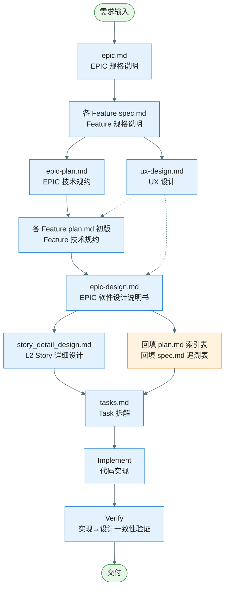
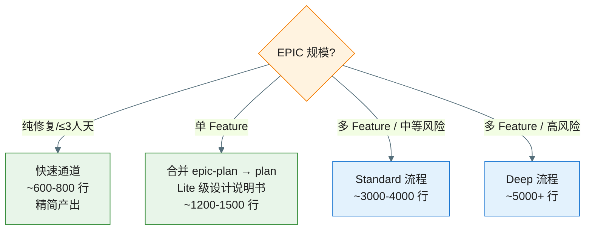
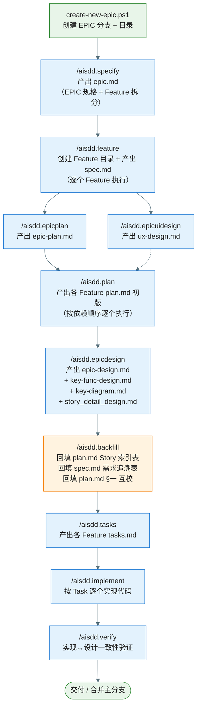
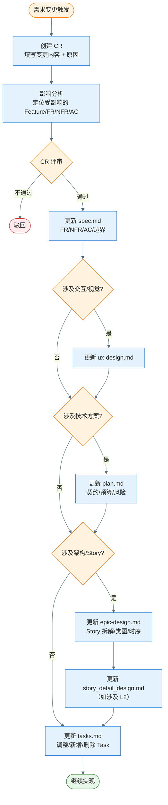
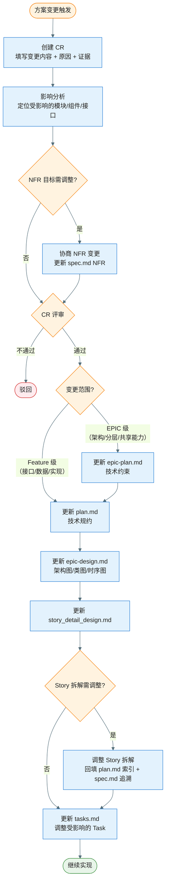

# 需求开发流程总览（Workflow Overview）

> **定位**：端到端流程速查，展示各产物的产出顺序、输入输出、事实源归属与裁剪规则。详细治理规则见 `constitution.md`。

---

## 一、端到端流程图

**说明**：实线箭头表示顺序依赖，虚线箭头表示可选输入。`ux-design.md` 与 `epic-plan.md` 可并行产出（均依赖所有 `spec.md` 完成）。

---

## 二、各阶段产出物与事实源

| 阶段 | 产出物 | 事实源归属 | 输入 | 关卡 |
|------|--------|-----------|------|------|
| **EPIC 规格** | `epic.md` | 需求边界与 Feature 拆分 | 需求描述 | — |
| **Feature 规格** | 各 `spec.md` | 需求事实源（FR/NFR/AC） | `epic.md` | Spec Ready |
| **EPIC 技术规约** | `epic-plan.md` | EPIC 技术规约事实源 | `epic.md`、各 `spec.md` | — |
| **UX 设计** | `ux-design.md` | 体验呈现事实源 | `epic.md`、各 `spec.md` | — |
| **Feature 技术规约** | 各 `plan.md`（初版） | Feature 技术规约事实源 | `spec.md`、`epic-plan.md`、`ux-design.md`（可选） | Plan Ready |
| **EPIC 设计说明书** | `epic-design.md` | 架构与设计事实源 | `epic.md`、`epic-plan.md`、各 `spec.md`、各 `plan.md`、`ux-design.md`（可选） | Design Ready |
| **L2 详细设计** | 各 `story_detail_design.md` | 落码级设计事实源 | `epic-design.md` | — |
| **回填** | 各 `plan.md` Story 索引表、各 `spec.md` 需求追溯表 | — | `epic-design.md` §十二 | — |
| **Task 拆解** | 各 `tasks.md` | 执行事实源 | `plan.md`、`epic-design.md`、`story_detail_design.md` | — |
| **实现** | 代码 | — | `tasks.md` | Implement Ready |
| **验证** | 验证报告 | 实现↔设计一致性事实源 | 代码、设计文档 | Verify Pass |
| **审批记录** | `gate-log.md` | 审批事实源 | 各关卡评审结果 | — |

---

## 三、分支策略

- 每个 EPIC 创建一个 `epic/EPIC-xxx-short-name` 分支（由 `create-new-epic.ps1` 自动创建）
- **不为 Feature 单独创建分支**——Feature 是文档组织单位（目录），而非分支单位
- 所有 Feature 的 spec/plan/tasks/代码实现均在 EPIC 分支上进行
- Story/Task 的增量提交均在 EPIC 分支上，按 Task 或逻辑分组粒度提交
- EPIC 完成后合并回主分支

详见 `constitution.md` §七.1。

---

## 四、小 EPIC 快速通道（Fast Track）

为避免小改动承担过重的文档负担，提供以下裁剪规则：

### 4.1 单 Feature EPIC（EPIC 仅含一个 Feature）

| 产物 | 裁剪规则 | 预估文档量 |
|------|----------|-----------|
| `epic-plan.md` | **可省略**，其内容合并到 `plan.md`（在 plan 中增加"EPIC 级约束"章节） | 节省 ~140 行 |
| `epic-design.md` | 仅需 **Lite** 级：§一～§五 + §十二 Story 拆解 + §十三 L2 索引；§六～§十一 按需裁剪（无风险则 N/A） | ~500 行（vs 完整 1400+） |
| `key-func-design.md` | 无疑难点/亮点可省略，在 epic-design.md §六标注「本 EPIC 无关键疑难点/亮点，省略」 | 可省 ~100 行 |
| `key-diagram.md` | 仅需骨架类图 + 1 个 Feature 子类图 + 1 张关键时序图 | ~80 行（vs 完整 185+） |
| `story_detail_design.md` | 视复杂度，简单 Story 可仅写概要（需求+DoD，功能设计部分省略类图/时序图） | ~30 行/Story |

### 4.2 纯修复/小改动（预估 ≤ 3 人天）

| 产物 | 裁剪规则 | 预估文档量 |
|------|----------|-----------|
| `epic-plan.md` | **可跳过** | 0 |
| `ux-design.md` | **可跳过** | 0 |
| `epic-design.md` | 可精简为仅含 **Story 拆解 + 关键类图**（§一～§四简写 + §十二 + 跳过其余） | ~200 行 |
| `key-func-design.md` | **可跳过** | 0 |
| `key-diagram.md` | 仅需关键变更涉及的类图片段 | ~50 行 |
| `story_detail_design.md` | **可跳过** | 0 |
| Gate 评审 | Gate 0~4 可合并为一轮快速评审，Gate 5~6 按需 | — |

### 4.3 各档位预估总文档量（参考）

| 档位 | 适用场景 | Feature 数 | 预估总文档量 | 典型编写时间 |
|------|----------|-----------|-------------|-------------|
| **快速通道** | 纯修复/≤3人天 | 1 | ~600-800 行 | 0.5-1 天 |
| **单 Feature Lite** | 单 Feature EPIC | 1 | ~1200-1500 行 | 1-2 天 |
| **Standard** | 多 Feature/中等风险 | 2-3 | ~3000-4000 行 | 2-4 天 |
| **Deep** | 高风险/高不确定性 | 3+ | ~5000+ 行 | 3-5 天 |

> **选择原则**：文档量应与 EPIC 风险和复杂度匹配。若写文档的时间超过实际编码时间的 50%，说明选择了过重的档位。

### 判断流程

详见 `constitution.md` §八。

---

## 五、ux-design.md 产出时机

- **前置条件**：所有 Feature 的 `spec.md` 已完成
- **并行窗口**：与 `epic-plan.md` 并行产出，或在其之前完成
- **下游消费**：作为各 Feature `plan.md` 和 `epic-design.md` 的**可选输入**（UI/交互约束）
- **非技术 Feature 可跳过**：纯后台/数据/SDK 类 Feature 无需 `ux-design.md`

---

## 六、命令执行顺序

以下流程图展示各 `/aisdd.*` 命令的执行顺序与产出物。

| 步骤 | 命令 | 产出物 | 执行次数 |
|------|------|--------|----------|
| 1 | `create-new-epic.ps1` | EPIC 分支 + EPIC 目录 + `epic.md`（空模板） | 每个 EPIC 一次 |
| 2 | `/aisdd.specify` | `epic.md`（填充内容：EPIC 规格 + Feature 拆分） | 每个 EPIC 一次 |
| 3 | `/aisdd.feature` | Feature 目录 + `spec.md`（填充内容） | 每个 Feature 一次 |
| 4 | `/aisdd.epicplan` | `epic-plan.md` | 每个 EPIC 一次 |
| 5 | `/aisdd.epicuidesign` | `ux-design.md` | 每个 EPIC 一次（可选，与步骤 4 并行） |
| 6 | `/aisdd.plan` | 各 Feature `plan.md` 初版 | 每个 Feature 一次（按依赖顺序） |
| 7 | `/aisdd.epicdesign` | `epic-design.md` + `key-func-design.md` + `key-diagram.md` + 各 `story_detail_design.md` | 每个 EPIC 一次（分 Gate 逐阶段） |
| 8 | `/aisdd.backfill` | `plan.md` Story 索引表 + `spec.md` 需求追溯表 + `plan.md` §一互校 | Gate 5 通过后一次 |
| 9 | `/aisdd.tasks` | 各 Feature `tasks.md` | 每个 Feature 一次 |
| 10 | `/aisdd.implement` | 代码 | 按 Task 逐个执行 |
| 11 | `/aisdd.verify` | 验证报告（模板：`verify-report-template.md`） | 按需 |

---

## 七、变更管理

任何变更通过 **Change Request（CR）** 发起，流程见 `change-request-template.md`。

核心规则：
- 变更须有影响分析 → 增量更新的闭环
- 只更新受影响的产物，不扩散修改（精准更新原则）
- 文档变更须更新 Version 与变更记录表

### 7.1 需求变更流程

> 适用场景：需求范围（Scope）、FR/NFR/AC、边界场景发生变化（来自 PM/用户反馈/评审结论等）。

**关键原则**：需求变更从 `spec.md` 出发，**自顶向下**逐层检查是否需要更新下游产物。只更新受影响范围，不扩散修改。

### 7.2 技术方案变更流程

> 适用场景：技术选型不可行、性能/功耗评估超标、实现期发现设计缺陷、架构决策需调整。

**关键原则**：
- 方案变更从 `plan.md` / `epic-plan.md` 出发，**自中间向两端**扩展——向上检查是否需要调整 NFR 目标（`spec.md`），向下更新设计说明书和 Task
- 若变更导致 NFR 超标，必须先与产品协商 NFR 目标调整（走 CR），再继续方案变更
- EPIC 级变更（架构/分层/共享能力）须先更新 `epic-plan.md`，再级联更新各 Feature 的 `plan.md`

### 7.3 变更影响速查表

| 变更类型 | 起点（事实源） | 可能影响的下游产物 |
|----------|---------------|-------------------|
| 需求范围/FR/AC | `spec.md` | `ux-design.md` → `plan.md` → `epic-design.md` → `story_detail_design.md` → `tasks.md` |
| NFR 指标调整 | `spec.md` | `plan.md`（预算） → `epic-design.md`（§八 评估） → `tasks.md`（验证阈值） |
| 交互/视觉/动效 | `ux-design.md` | `plan.md`（UI 约束） → `epic-design.md`（类图/时序） → `tasks.md` |
| EPIC 级技术约束 | `epic-plan.md` | 各 `plan.md` → `epic-design.md` → `story_detail_design.md` → `tasks.md` |
| Feature 级技术方案 | `plan.md` | `epic-design.md` → `story_detail_design.md` → `tasks.md` |
| Story 拆解调整 | `epic-design.md` §十二 | `story_detail_design.md` → `plan.md`（索引表） → `spec.md`（追溯表） → `tasks.md` |
