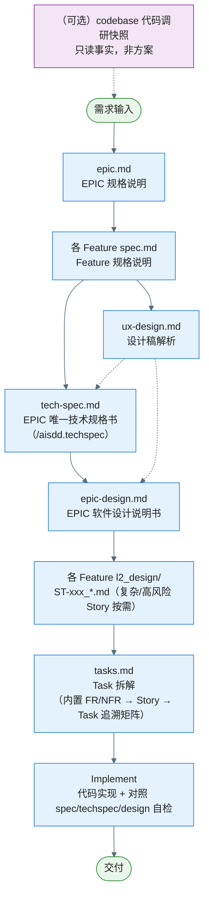
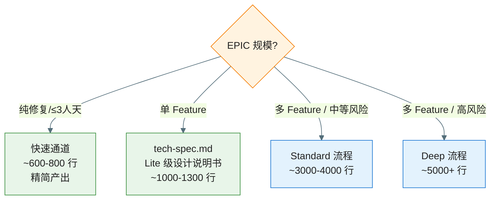
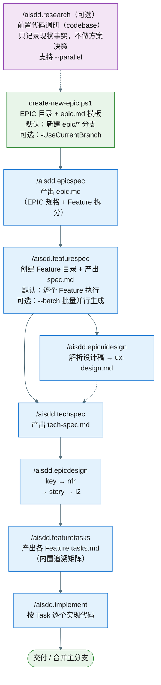
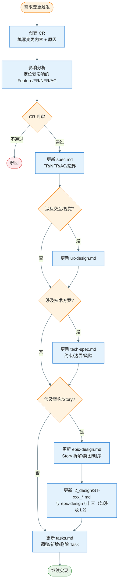
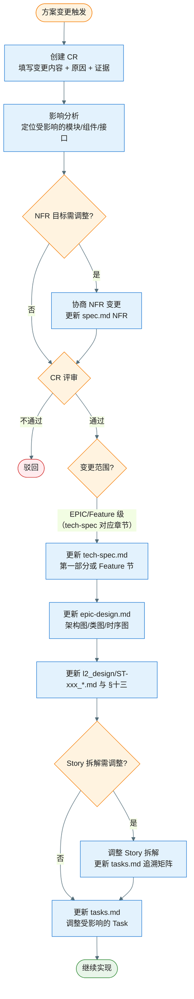
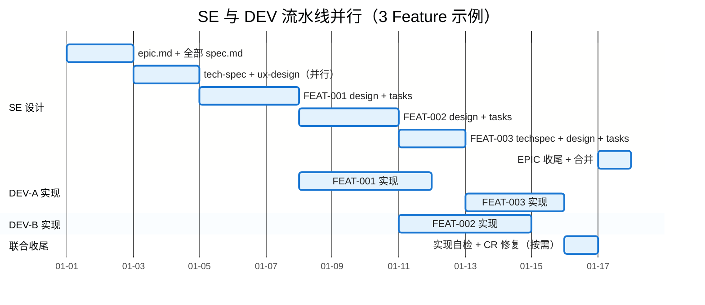
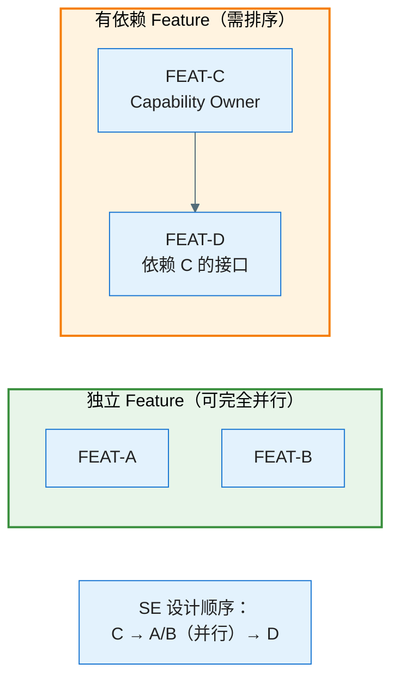
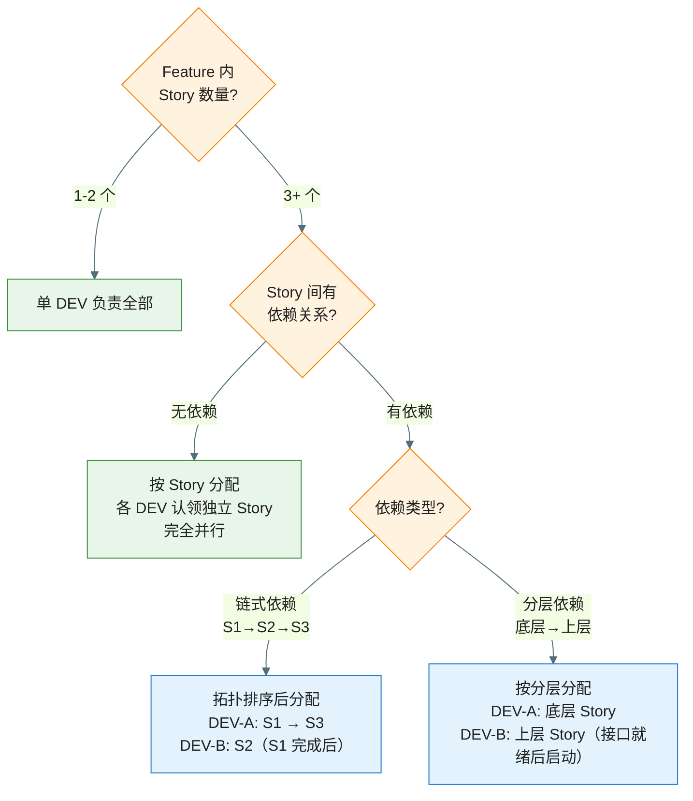

# 需求开发流程总览（Workflow Overview）

> **定位**：端到端流程速查，展示各产物的产出顺序、输入输出、事实源归属与裁剪规则。详细治理规则见 `constitution.md`。

---

## 一、端到端流程图



**说明**：实线箭头表示顺序依赖，虚线箭头表示可选输入。`ux-design.md` 与 `tech-spec.md` 可并行产出（均依赖所有 `spec.md` 完成）。**`tech-spec.md`** 为 EPIC 根目录**唯一**技术规约（合并原 `epic-plan.md` 与各 Feature `plan.md`）：第一部分 EPIC 公共约束，第二部分按 Feature 分节；详细设计由 `epic-design.md` 及子文件承接。命令：`/aisdd.techspec`（`/aisdd.epicplan`、`/aisdd.featureplan` 已废弃）。

### 新需求如何走流程

新需求从进入到交付，按上图顺序走一遍即可：

1. **（可选）前置代码调研** → 在做 EPIC/Feature 规格前，若需先熟悉相关存量模块，运行 `/aisdd.research`（**仅**考古代码，`--parallel` 可多主题）；产出为**一次性事实快照**，不做技术方案决策；后续 `techspec` / `design` / CR **不回写** `research/` 下已有报告
2. **需求输入** → 运行 `create-new-epic.ps1` 创建 EPIC 目录与空 `epic.md`；**默认**同时新建并切换 `epic/EPIC-xxx-*` 分支，**可选** `-UseCurrentBranch` 保留当前 Git 分支（见 `/aisdd.epicspec`）→ `/aisdd.epicspec` 填充 `epic.md`（EPIC 规格 + Feature 拆分）
3. **Feature 规格** → 各 Feature 产出 `spec.md`（FR/NFR/AC）
4. **技术规约与 UX** → 产出 EPIC 根 `tech-spec.md`（`/aisdd.techspec`）；可选 `ux-design.md`（可与 techspec 并行）
5. **设计说明书** → 按 `key → nfr → story → l2` 分阶段推进（范围递减、精度递增）：**`key`**（§七）按需论证关键设计方案可行性，KD 内图表（类图全量签名 + 时序穷举全分支）为完整编码蓝图；**`nfr`**（§八~§十一）按需量化验证设计方案是否满足 NFR，并仅在适用时产出 `nfr.md`、`interface-design.md`、`database-design.md`、`analytics-tracking.md`；**`story`**（§十二）拆解为可开发的 Story；**`l2`**（§十三）仅为复杂/高风险 Story 产出落码级详细设计，简单 Story 可由 `tasks.md` 的设计引用与 DoD 承接。产出 `epic-design.md`（§七清单 + 按需引用 `key-func-design/KD_*_*.md`；无根目录 `key-func-design.md`）
6. **Task 拆解** → 各 Feature 产出 `tasks.md`（内置 FR/NFR → Story → Task 追溯矩阵；不反向修改已冻结的 `spec.md` 或 `tech-spec.md`）
7. **实现** → 按 tasks 实现代码，对照 spec/tech-spec/epic-design 完成实现自检后交付

具体命令与产出物对应关系见**六、命令执行顺序**；各阶段事实源见下表。

---

## 二、各阶段产出物与事实源

| 阶段 | 产出物 | 事实源归属 | 输入 |
|------|--------|-----------|------|
| **（可选）前置代码调研** | `research/codebase-<topic>-<date>.md`（`--save` 时写入；否则仅对话输出） | **只读代码事实快照**（非约束源、非方案）；写完冻结，方案变更时不修订 | 需求描述、Android 工程源码 |
| **EPIC 规格** | `epic.md` | 需求边界与 Feature 拆分 | 需求描述、调研报告（可选） |
| **Feature 规格** | 各 `spec.md` | 需求事实源（FR/NFR/AC/完整场景矩阵） | `epic.md` |
| **EPIC 技术规格** | `tech-spec.md` | 技术规约唯一事实源：第一部分 EPIC 公共约束 + 第二部分各 Feature 规约 | `epic.md`、各 `spec.md`、`ux-design.md`（可选） |
| **UX 设计** | `ux-design.md` | 设计稿结构化解析事实源 | `epic.md`、各 `spec.md`、设计素材（图片/Pencil/Figma） |
| **EPIC 设计说明书** | `epic-design.md` | 架构与设计事实源 | `epic.md`、`tech-spec.md`、各 `spec.md`（含完整场景矩阵）、`ux-design.md`（可选） |
| **L2 详细设计** | 各 `features/*/l2_design/ST-xxx_*.md`（复杂/高风险 Story 按需） | 落码级设计事实源 | `epic-design.md` |
| **Task 拆解** | 各 `tasks.md`（内置 FR/NFR → Story → Task 追溯矩阵） | 执行事实源 | `tech-spec.md`、`epic-design.md`、各 Feature `l2_design/ST-xxx_*.md`（若有） |
| **实现** | 代码 | 交付物；实现须对照 spec/techspec/design 自检 | `tasks.md` |

---

## 三、分支策略

- **默认**：每个 EPIC 由 `create-new-epic.ps1` **新建并切换**到 `epic/EPIC-xxx-short-name` 分支，同时创建 `specs/epics/...` 与空 `epic.md`
- **可选**：脚本加 **`-UseCurrentBranch`** 时**不**创建/切换 `epic/*` 分支，仅在**当前 HEAD** 上创建 EPIC 目录与 `epic.md`（适用于热修复栈、共享分支等；见 `.cursor/commands/aisdd.epicspec.md`）
- **不为 Feature 单独创建分支**——Feature 是文档组织单位（目录），而非分支单位
- 所有 Feature 的 spec/tech-spec/tasks/代码实现均在当前工作分支（默认即 EPIC 分支）上进行
- Story/Task 的增量提交均在同一工作分支上，按 Task 或逻辑分组粒度提交
- EPIC 完成后合并回主分支

详见 `constitution.md` §七.1。

---

## 四、小 EPIC 快速通道（Fast Track）

为避免小改动承担过重的文档负担，提供以下裁剪规则：

### 4.1 单 Feature EPIC（EPIC 仅含一个 Feature）

| 产物 | 裁剪规则 | 预估文档量 |
|------|----------|-----------|
| `tech-spec.md` | 第一部分 + 唯一 Feature 第二节；`/aisdd.epicdesign` 前置：`HAS_TECH_SPEC` | ~200–350 行 |
| `epic-design.md` | 仅需 **Lite** 级：§一～§六 + §十二 Story 拆解 + §十三 L2 索引；§七～§十一 按需裁剪（无风险则 N/A） | ~500 行（vs 完整 1400+） |
| `key-func-design/*.md` | 无疑难点/亮点可省略，在 epic-design.md §七标注「本 EPIC 无关键疑难点/亮点，省略」；可不创建 KD 文件 | 可省 ~100 行 |
| `l2_design/ST-xxx_*.md` | 复杂/高风险 Story 按需生成；简单 Story 在 §十三标注由 `tasks.md` 设计引用与 DoD 承接 | ~30 行/Story |

### 4.2 纯修复/小改动（预估 ≤ 3 人天）

| 产物 | 裁剪规则 | 预估文档量 |
|------|----------|-----------|
| `tech-spec.md` | **可精简**（第一部分简写 + 涉及 Feature 节） | ~80 行 |
| `ux-design.md` | **可跳过** | 0 |
| `epic-design.md` | 可精简为仅含 **Story 拆解 + 关键类图**（§一～§四简写 + §十二 + 跳过其余） | ~200 行 |
| `key-func-design/*.md` | **可跳过** | 0 |
| `l2_design/` 下 L2 文件 | **可跳过** | 0 |

### 4.3 各档位预估总文档量（参考）

| 档位 | 适用场景 | Feature 数 | 预估总文档量 | 典型编写时间 |
|------|----------|-----------|-------------|-------------|
| **快速通道** | 纯修复/≤3人天 | 1 | ~600-800 行 | 0.5-1 天 |
| **单 Feature Lite** | 单 Feature EPIC | 1 | ~1000-1300 行 | 1-2 天 |
| **Standard** | 多 Feature/中等风险 | 2-3 | ~3000-4000 行 | 2-4 天 |
| **Deep** | 高风险/高不确定性 | 3+ | ~5000+ 行 | 3-5 天 |

> **选择原则**：文档量应与 EPIC 风险和复杂度匹配。若写文档的时间超过实际编码时间的 50%，说明选择了过重的档位。

### 判断流程



详见 `constitution.md` §八。

---

## 五、ux-design.md 产出时机

- **前置条件**：所有 Feature 的 `spec.md` 已完成；设计素材（图片/Pencil/Figma）已放入 `design/` 目录（无设计素材时进入兜底模式）
- **并行窗口**：与 `tech-spec.md` 并行产出，或在其之前完成
- **核心价值**：从设计稿中提取并结构化交互逻辑与视觉规范，与 spec.md 交叉比对标出遗漏，供团队验证 AI 理解的正确性
- **下游消费**：作为 `tech-spec.md`（第二部分各 Feature 节）与 `epic-design.md` 的**可选输入**（UI/交互约束）
- **非技术 Feature 可跳过**：纯后台/数据/SDK 类 Feature 无需 `ux-design.md`

---

## 六、命令执行顺序

以下流程图展示各 `/aisdd.*` 命令的执行顺序与产出物。



| 步骤 | 命令 | 产出物 | 执行次数 |
|------|------|--------|----------|
| 0 | `/aisdd.research` | **代码调研快照**（`--save` → `research/codebase-<topic>-<date>.md`）；只含模块地图、接口事实、调用链、依赖与观察项；**不含**方案建议/评级/下游修改清单 | **可选**；`epicspec` / `featurespec` 之前；熟悉存量代码时用；`techspec`/`design`/CR **不得**回写已有调研文件 |
| 1 | `create-new-epic.ps1` | **默认**：新建 `epic/EPIC-xxx-*` 分支 + EPIC 目录 + `epic.md`（空模板）；**可选** `-UseCurrentBranch`：不切换分支，仅创建目录与模板 | 每个 EPIC 一次 |
| 2 | `/aisdd.epicspec` | `epic.md`（填充内容：EPIC 规格 + Feature 拆分） | 每个 EPIC 一次 |
| 3 | `/aisdd.featurespec` | Feature 目录 + `spec.md`（填充内容） | **默认**：每个 Feature 单独触发一次；**`--batch` 模式**：一次触发，顺序创建所有 Feature 目录后并行生成各 `spec.md`（从 `epic.md` Feature 列表读取，适合多 Feature EPIC） |
| 3.5 | `/aisdd.challenge spec` | 挑战报告（不写入文件）：从三视角对抗性检测 spec 漏洞、NFR 可行性、范围边界 | **可选**；多 Feature EPIC 强烈推荐；单 Feature/≤3人天可跳过。进入 `techspec` 前运行 |
| 4 | `/aisdd.techspec` | `tech-spec.md` | 每个 EPIC 一次（覆盖第一部分 + 全部 Feature 第二节） |
| 4.5 | `/aisdd.challenge techspec` | 挑战报告（不写入文件）：对抗性检测 tech-spec 架构风险、技术债务、可测试性 | **可选**；多 Feature 强烈推荐；CR 变更后必须运行。进入 `epicdesign` 前运行 |
| 5 | `/aisdd.epicuidesign` | `ux-design.md`（解析设计稿 → 结构化交互/视觉规范） | 每个 EPIC 一次（可选，与步骤 4 并行） |
| 6 | `/aisdd.epicdesign` | `epic-design.md` + 子文件（`key` / `nfr` / `story` / `l2`） | 分阶段。前置：`get-epic-paths.ps1 -Json` 中 `HAS_TECH_SPEC` 为 true |
| 6.5 | `/aisdd.challenge design` | 挑战报告（不写入文件）：从三视角对抗性检测安全漏洞、性能可达性、Android 生态兼容性 | **可选**；多 Feature EPIC 强烈推荐；CR 变更后必须运行。进入 `featuretasks` 前运行 |
| 6.6 | `/aisdd.analyze epic pre-tasks` | EPIC 跨 Feature 分析报告（不写入文件） | **可选**；多 Feature EPIC；`epicdesign` 后、`featuretasks` 前；不要求 tasks.md |
| 7 | `/aisdd.featuretasks` | 各 Feature `tasks.md`（内置 FR/NFR → Story → Task 追溯矩阵） | 每个 Feature 一次 |
| 7.5 | `/aisdd.analyze epic` | EPIC 全量一致性分析报告（含各 Feature tasks） | **可选**；多 Feature 质量加码；**非** implement 前置必做 |
| 7.6 | `/aisdd.analyze` | 单 Feature 分析报告（scope=feature，默认） | **可选**；每个 Feature 至多一次；**非阻塞** implement |
| 8 | `/aisdd.implement` | 代码 | 按 Task 逐个执行；完成后对照 spec/techspec/design 自检 |
| — | `/aisdd.cr` | CR 文件 + 下游产物增量更新 | 变更时按需（自动影响分析 → 生成 CR → 分步更新） |

---

## 七、变更管理

### 变更需求如何走流程

任何**变更**（含**中途新增需求**——追加 Scope/FR/新 Feature、以及修改或删除已有 FR/NFR/AC、交互/视觉、技术方案等）统一走 **Change Request（CR）**，再按类型走下游更新。

**推荐使用 `/aisdd.cr` 命令**自动化执行以下流程（自动影响分析 → 生成 CR → 分步更新下游产物）：

1. **创建 CR**：运行 `/aisdd.cr`（或手动使用模板 [change-request-template.md](./templates/change-request-template.md)），填写「变更内容」「变更原因与证据」「影响分析」「下游更新清单」
2. **CR 评审**：结论为通过 / 有条件通过 / 不通过
3. **按类型走流程**：
   - **需求类变更**（Scope/FR/NFR/AC/边界）→ 走 [7.1 需求变更流程](#71-需求变更流程)：从更新 `spec.md` 起，自顶向下检查并更新 ux-design → tech-spec → epic-design → l2_design（各 ST 文件）→ tasks
   - **技术方案类变更**（公共约束、能力边界、接口/实现决策）→ 走 [7.2 技术方案变更流程](#72-技术方案变更流程）：从更新 `tech-spec.md` 或 `epic-design.md` 起，自中间向两端扩展，必要时先协商 NFR 再更新设计说明书与 tasks
4. **执行下游更新清单**：只更新 CR 影响分析中列出的产物，每份文档更新后填写 Version 与变更记录表（`/aisdd.cr` 会分步执行并逐步确认）

核心规则：
- 变更须有影响分析 → 增量更新的闭环
- 只更新受影响的产物，不扩散修改（精准更新原则）
- 文档变更须更新 Version 与变更记录表
- **`research/` 排除**：代码调研快照不参与 CR 下游更新；方案变更时**不**修订已有调研报告（需新认知则新建带日期的调研文件）

### 7.1 需求变更流程

> 适用场景：需求范围（Scope）、FR/NFR/AC、边界场景发生变化（来自 PM/用户反馈/评审结论等）。



**关键原则**：需求变更从 `spec.md` 出发，**自顶向下**逐层检查是否需要更新下游产物。只更新受影响范围，不扩散修改。

### 7.2 技术方案变更流程

> 适用场景：技术选型不可行、性能/功耗评估超标、实现期发现设计缺陷、架构决策需调整。



**关键原则**：
- 方案变更从受影响的事实源出发：公共约束/能力边界先更新 `tech-spec.md`（第一部分或对应 Feature 节），详细设计变更先更新 EPIC 软件设计说明书；再向上检查是否需要调整 NFR 目标（`spec.md`），向下更新 Task
- 若变更导致 NFR 超标，必须先与产品协商 NFR 目标调整（走 CR），再继续方案变更
- **spec.md 回写红线（强制）**：技术方案类变更**默认不修改 `spec.md`**；**唯一例外**是 NFR 量化指标本身的数值/口径调整。技术决策一律归 `tech-spec.md` / `epic-design.md` 及其子文件。详见 `.cursor/rules/aisdd-document-boundaries.mdc`
- EPIC 级公共约束变更更新 `tech-spec.md` **第一部分**；Feature 级变更更新 **第二部分对应 Feature 节**；NFR 量化变更更新 `nfr.md`；架构细节变更更新设计说明书，再视需要级联 tasks

### 7.3 变更影响速查表

> **spec.md 禁触红线**：下表中所有「可能影响的下游产物」涉及 `spec.md` 时，**仅允许**修改 FR / NFR（量化指标） / AC / 范围（In/Out） / 完整场景矩阵 / 依赖关系；**严禁**写入类名、接口、框架、库、模块、表/字段、SQL、API 路径、代码、包路径、线程原语、埋点字段等技术实现细节。详见 `.cursor/rules/aisdd-document-boundaries.mdc`。

| 变更类型 | 起点（事实源） | 可能影响的下游产物 | spec.md 可改字段（红线内） |
|----------|---------------|-------------------|-----------------------------|
| 需求范围/FR/AC | `spec.md` | `ux-design.md` → `tech-spec.md` → `epic-design.md` → `l2_design/ST-xxx_*.md` → `tasks.md` | FR / AC / 范围 / 场景矩阵 / 依赖关系 |
| NFR 指标调整 | `spec.md` | `tech-spec.md`（预算） → **`nfr.md`**（§八 量化评估）与 `epic-design.md` §八 摘要 → `tasks.md`（验证阈值） | **仅** NFR 行的指标值/触发条件，**不写**实现方案 |
| 交互/视觉/动效 | `ux-design.md` | `tech-spec.md`（UI 约束） → `epic-design.md`（类图/时序） → `tasks.md` | 不修改（除非附带 FR/AC 调整） |
| EPIC/Feature 技术规约 | `tech-spec.md`（第一部分或对应 Feature 节） | `epic-design.md` → `l2_design/ST-xxx_*.md` → `tasks.md` | **不修改**（技术决策不回写 spec） |
| Story 拆解调整 | `epic-design.md` §十二 | `l2_design/ST-xxx_*.md`（若有） → `tasks.md` 追溯矩阵 | **不修改**（Story 是设计层概念，不写入 spec） |
| 任意 CR 类型 | — | **不包含** `research/` | **永不修改**调研快照；新调研另建文件 |

---

## 八、SE 与多开发并行协作策略

> **适用范围**：多 Feature / 多 Story / 多 Task 的 Standard 或 Deep 档位 EPIC。单 Feature 快速通道可简化——SE 即开发者时无需分工。

### 8.1 角色定义

| 角色 | 职责 | 在 AISDD 中的产出物 |
|------|------|-------------------|
| **SE（方案设计者）** | 驱动整个设计流程：需求分析、方案设计、Story 拆解、Task 拆分；设计评审与变更管理 | `epic.md`、`spec.md`、`tech-spec.md`、`ux-design.md`、`epic-design.md`、各 Feature `l2_design/ST-xxx_*.md`、`tasks.md` |
| **DEV（开发者）** | 按 `tasks.md` 执行代码实现；编写单元测试；对照 spec/techspec/design 自验证 | 代码、单测 |

> **SE 同时可以是 DEV**——在小团队中 SE 既做设计也做实现，此时并行策略退化为串行流水线（自己设计完 Feature A → 开始实现 Feature A，同时设计 Feature B）。

### 8.2 流水线并行模型

核心思想：**SE 设计在前、DEV 实现在后，按 Feature 粒度形成流水线**。SE 不必等所有 Feature 设计完才交给 DEV，而是「完成一个、交付一个」。



**关键规则**：

1. **Feature 级交付是最小可并行单元**——SE 产出某 Feature 的 `tasks.md` 后，该 Feature 即可交给 DEV 开始实现
2. **SE 必须先完成** `epic.md`、全部 `spec.md` 与 **`tech-spec.md`** 再进入 `epic-design` / `featuretasks`
3. **Feature 内部 Story/Task 可以按依赖关系进一步拆分给多个 DEV**（见 §8.4）

### 8.3 多 Feature 并行策略

#### 8.3.1 Feature 优先级排序原则

SE 应按以下优先级排序 Feature 的设计顺序，使 DEV 尽早获得可实现的 Feature：

| 优先级 | 排序依据 | 说明 |
|--------|---------|------|
| **P0** | **被依赖最多的 Feature**（Capability Owner） | 其他 Feature 的实现依赖它的接口/数据/能力，必须最先设计并实现 |
| **P1** | **复杂度最高的 Feature** | 设计耗时长，提前开始可减少整体等待 |
| **P2** | **独立 Feature**（无跨 Feature 依赖） | 设计完成后可立即交给 DEV 并行实现 |
| **P3** | **简单 Feature / 有上游依赖的 Feature** | 等 P0 实现完成后再启动 |

#### 8.3.2 依赖关系处理



| 依赖类型 | SE 策略 | DEV 策略 |
|----------|---------|---------|
| **无依赖**（Feature 间独立） | 按复杂度排序逐个设计，或 `--batch` 并行生成 tech-spec | 各 DEV 分别认领独立 Feature，完全并行实现 |
| **接口依赖**（B 调用 A 的 API） | 先在 A 的 `tech-spec.md` 记录能力边界与调用约束，详细接口在 `interface-design.md` 或 L2 中设计；B 的 `tech-spec.md` 引用该能力边界 | DEV-1 先实现 A 的接口层（Stub/空实现）→ DEV-2 可基于接口开始 B 的实现 |
| **数据依赖**（B 消费 A 产出的数据） | 先在 A 的 `tech-spec.md` 记录 SoR 与生命周期等数据约束，详细数据模型和存储方案在 `database-design.md` 或 L2 中设计，B 引用该方案 | A 的数据层实现完毕后 B 才能联调；B 可先用 Mock 数据并行开发 |
| **紧耦合依赖**（A/B 共享状态/深度交互） | 考虑合并为同一 Feature，或在 `tech-spec.md` 中定义共享契约 | 同一 DEV 负责两者，或两 DEV 频繁同步 |

### 8.4 多 Story / 多 Task 在同一 Feature 内的分工

当一个 Feature 包含多个 Story 且有多个 DEV 可用时：

#### 分配原则

1. **按 Story 分配**（推荐）：一个 Story 完整交给一个 DEV，保持上下文一致性
2. **按 Task 分配**（谨慎使用）：同一 Story 的 Task 拆给不同 DEV，仅在 Task 间界限清晰（如一个 Task 做 UI、一个 Task 做 Repository）时可行
3. **按分层分配**（大 Feature）：DEV-A 负责 Domain/Data 层所有 Story 的对应 Task，DEV-B 负责 UI/ViewModel 层

#### 分配决策流程



### 8.5 SE 与 DEV 的交接点与协作节奏

| 阶段 | SE 产出 | 交接动作 | DEV 动作 |
|------|--------|---------|---------|
| **全部 spec 完成** | 全部 `spec.md` | SE 组织 spec Review，DEV 参与（提前了解需求） | 阅读 spec，反馈技术可行性疑问 |
| **Feature tasks.md 完成** | 某 Feature 的 `tasks.md` | **正式交接点**——SE 将该 Feature 的 Task 列表交给 DEV | DEV 认领 Task，开始实现 |
| **实现过程中** | SE 继续设计下一个 Feature | DEV 遇到设计疑问 → 同步 SE 确认 | DEV 按 Task 提交代码，对照设计文档自检 |
| **Feature 实现完成** | — | DEV 提交代码并说明 FR/Story 覆盖情况 | SE Review 实现与 spec/design 一致性 |
| **全部 Feature 完成** | SE 组织 EPIC 级走查（可选 `/aisdd.analyze epic`） | SE 确认跨 Feature 一致性后合并 | DEV 按 CR 修复偏离项 |

#### 典型协作时间线（4 Feature / 1 SE + 2 DEV）

```
时间轴 →

SE:    [epic.md + specs] [tech-spec] [FEAT-1 design+tasks] [FEAT-2 design+tasks] [FEAT-3 design+tasks] [FEAT-4 design+tasks] [EPIC 收尾]
         │                  │              │                     │                     │                     │
         ▼                  ▼              ▼                     ▼                     ▼                     ▼
DEV-A:                                [====== FEAT-1 实现 ======] [===== FEAT-3 实现 =====]   [修复偏离]
DEV-B:                                                          [====== FEAT-2 实现 ======] [= FEAT-4 实现 =] [修复偏离]
```

### 8.6 并行协作的风险与应对

| 风险 | 场景 | 应对措施 |
|------|------|---------|
| **设计变更波及已实现代码** | SE 设计 FEAT-3 时发现需修改 FEAT-1 的接口 | 走 `/aisdd.cr` 变更流程；SE 评估影响范围后通知 DEV-A 同步修改 |
| **DEV 等待 SE 设计** | SE 设计速度跟不上 DEV 实现速度 | SE 优先产出被依赖最多的 Feature；DEV 空闲时可协助 Review 或写单测 |
| **跨 Feature 接口不一致** | DEV-A 和 DEV-B 对共享接口理解不同 | `tech-spec.md` 中明确共享能力 Owner 与能力边界，`interface-design.md` 中明确详细接口；SE 在交接时重点说明接口约束 |
| **Story 间依赖导致阻塞** | DEV-B 的 Story 依赖 DEV-A 尚未完成的 Story | 依赖方先用 Mock/Stub 并行开发；SE 在 `tasks.md` 中标注依赖关系和建议的实现顺序 |
| **合并冲突** | 多 DEV 同时修改相近模块 | 按分层/模块划分 Story 归属，减少文件级冲突；频繁 rebase 主分支 |

### 8.7 SE 自身的并行策略（AI 辅助场景）

在 AI 辅助设计的场景下，SE 可利用工具并行加速：

| 并行点 | 命令/手段 | 说明 |
|--------|----------|------|
| 批量生成 spec | `/aisdd.featurespec --batch` | 所有 Feature 的 `spec.md` 并行生成 |
| tech-spec 与 ux-design 并行 | `/aisdd.techspec` + `/aisdd.epicuidesign` | 两者仅依赖 `spec.md`，互不依赖 |
| 分阶段 epicdesign | `/aisdd.epicdesign diagram FEAT-xxx` | 按 Feature 逐个产出类图/时序图，完成一个即可交出 tasks |
| 多模块代码调研 | `/aisdd.research --parallel` | 并行考古代码多个不相关主题 |

---

## 九、版本记录

| 版本 | 日期 | 变更摘要 |
|------|------|---------|
| v1.7.2 | 2026-06-05 | 术语统一：「Plan 阶段」→ techspec（`tech-spec.md`）；章程、模板、命令、脚本与流程图节点去过时 plan 表述 |
| v1.7.1 | 2026-06-05 | 修复 epic-plan 合并后的文档替换残留；§六 命令表步骤编号与流程图对齐；命令 front matter（featuretasks/clarify/epicdesign）与 implement/featuretasks 遗留 spec-kit 引用 |
| v1.7.0 | 2026-05-22 | **方案 C**：合并 `epic-plan.md` + 各 Feature `plan.md` → EPIC 根唯一 `tech-spec.md`；新增 `/aisdd.techspec`、`setup-techspec.ps1`、`tech-spec-template.md`；废弃 `/aisdd.epicplan`、`/aisdd.featureplan`；`get-epic-paths.ps1` 改为 `HAS_TECH_SPEC` |
| v1.6.5 | 2026-05-22 | 删除已合并的 `/aisdd.epicanalyze` 重定向命令文件（`.cursor` / `.claude`）；统一使用 `/aisdd.analyze epic` |
| v1.6.4 | 2026-05-22 | 文档边界与 Story 拆解迁至 Cursor Rule：合并 `aisdd-document-boundaries.mdc`、新增 `aisdd-story-splitting.mdc`；删除 `docs/aisdd/spec-vs-*-boundary.md` 与 `story-splitting-guide.md` |
| v1.6.3 | 2026-05-22 | 明确 `/aisdd.analyze` 全流程可选、非阻塞，不 gate `implement`；`featuretasks` 默认 handoff 仅指向 implement |
| v1.6.2 | 2026-05-22 | 合并 `/aisdd.epicanalyze` → `/aisdd.analyze epic`（保留 epicanalyze 为重定向说明）；删除 checklist 命令 |
| v1.6.1 | 2026-05-22 | §一 流程图移除已废弃的 Verify 节点；与 implement 自检交付一致 |
| v1.6.0 | 2026-05-22 | 移除 `/aisdd.verify` 命令、`verify-report-template.md` 与 `aisdd-verify.mdc`；实现阶段改为对照 spec/plan/design 自检后交付；同步更新 workflow、constitution、implement/cr/challenge |
| v1.5.0 | 2026-05-22 | 新增 spec.md 纯净度治理：§7.2 增加「spec.md 回写红线」强制约束；§7.3 速查表新增「spec.md 可改字段（红线内）」列；新增 `.cursor/rules/aisdd-document-boundaries.mdc` 三方边界文档；spec-template / featurespec / epicspec / cr / change-request-template / featureplan / epicdesign 全线增强守护规则 |
| v1.4.0 | 2026-04-04 | 新增 §八「SE 与多开发并行协作策略」：角色定义、流水线并行模型、多 Feature/Story/Task 分工策略、交接点与协作节奏、并行风险应对、SE 自身 AI 辅助并行加速；版本记录调整为 §九 |
| v1.3.1 | 2026-05-22 | `/aisdd.research` 收窄为**仅 codebase 代码考古**：只记录事实快照，禁止方案/评级/下游修改建议；`research/` 写完冻结，plan/design/CR 不得回写；新增 `research-template.md` |
| v1.3.0 | 2026-03-22 | 新增 `/aisdd.research` 前置调研命令（platform / library / pattern / feasibility / codebase 五类型，支持 `--parallel` 并行子 Agent、`--save` 写文件）；升级 `/aisdd.verify` 为三级验证模式（L1 Story / L2 Feature / L3 EPIC，L3 并行子 Agent，新增 `--quick` / `--save` 标志）；`/aisdd.epicdesign` 完成报告补充 `/aisdd.challenge design` 推荐节点；同步更新 §一 流程图、§一新需求走流程、§二产出物表、§六命令执行顺序 |
| v1.2.0 | — | 新增 `/aisdd.challenge` 对抗性挑战（spec / plan / design 三阶段）；`/aisdd.techspec` 支持 `--batch` 依赖感知并行生成；`/aisdd.featurespec` 支持 `--batch` 批量并行；`/aisdd.cr` 变更请求自动化流程；更新 §六 命令表含 3.5 / 6.5 / 7.5 challenge 步骤 |
| v1.1.0 | — | 单 Feature EPIC 快速通道（精简 `tech-spec.md` 与 Lite 级 `epic-design.md`）；Fast Track 小改动档位（§四）；`get-epic-paths.ps1` `HAS_TECH_SPEC` 判定逻辑 |
| v1.0.0 | — | 初始版本：端到端流程（epicspec → featurespec → epicplan → epicuidesign → featureplan → epicdesign → featuretasks → implement → verify）；§一～§七 全章节 |
