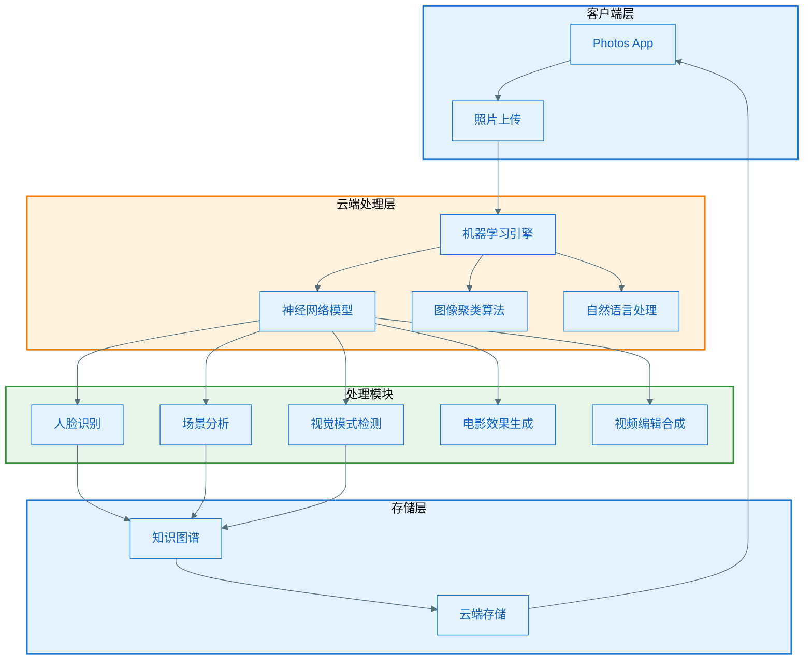
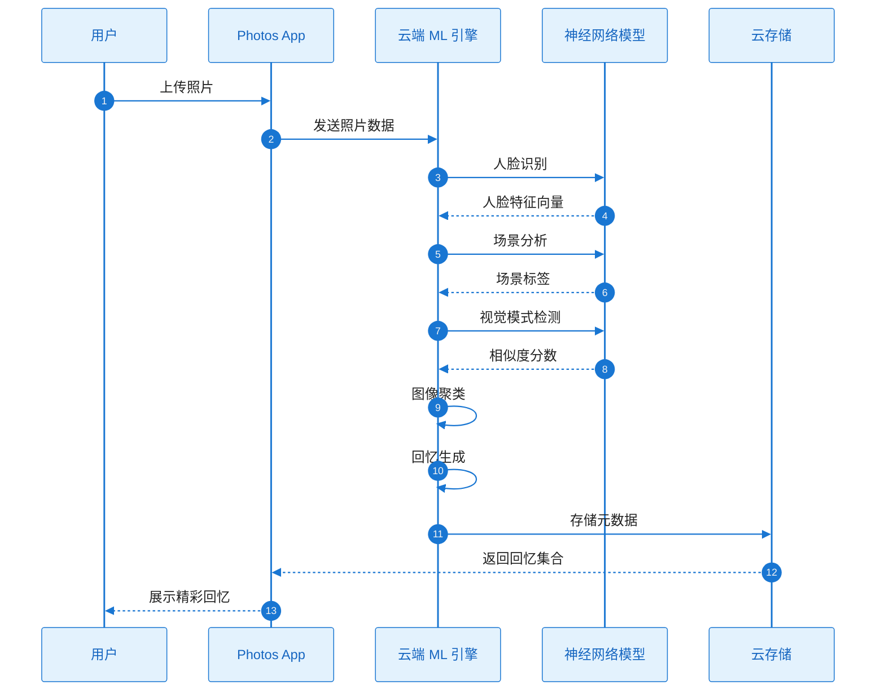
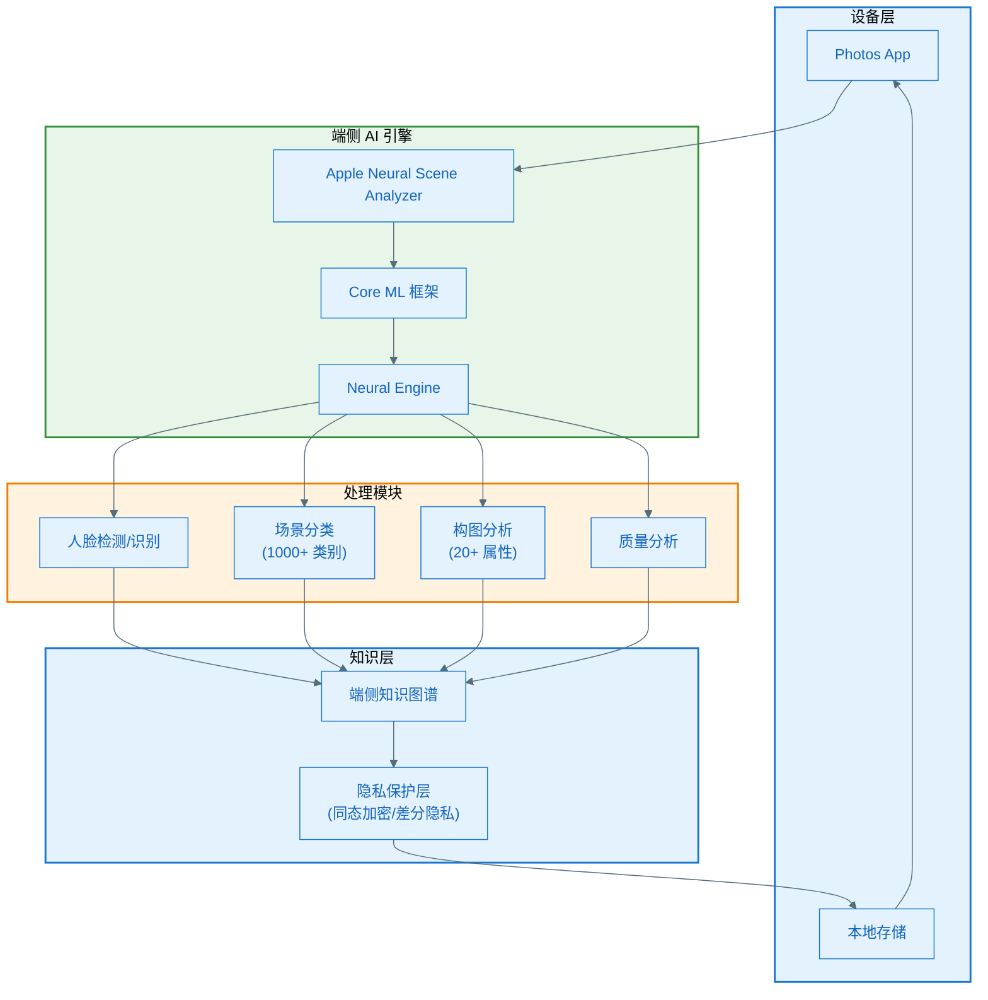
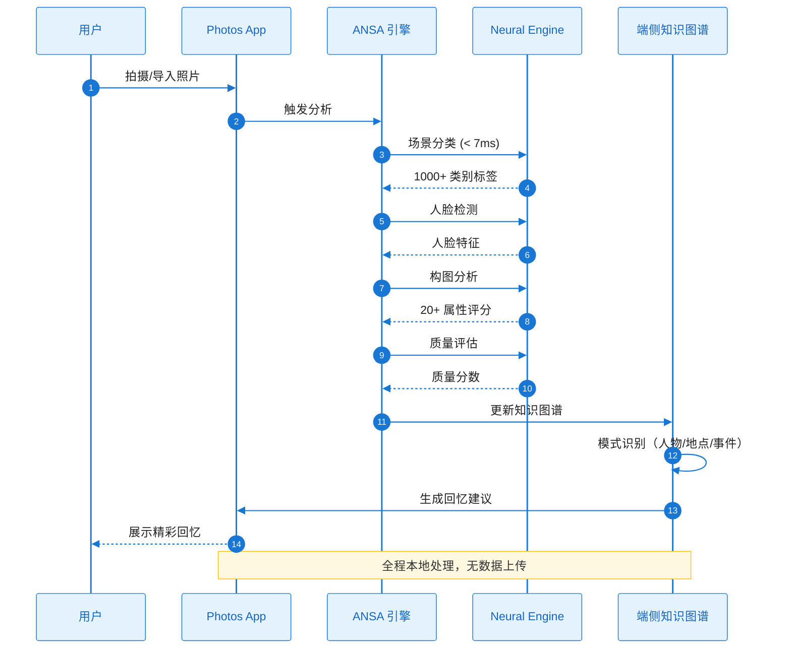
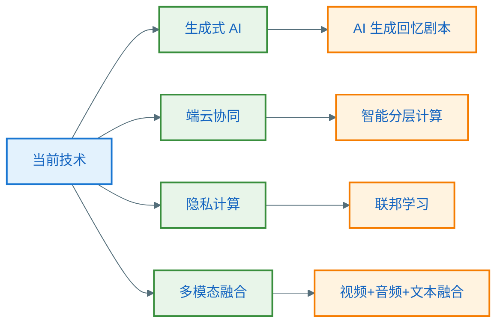
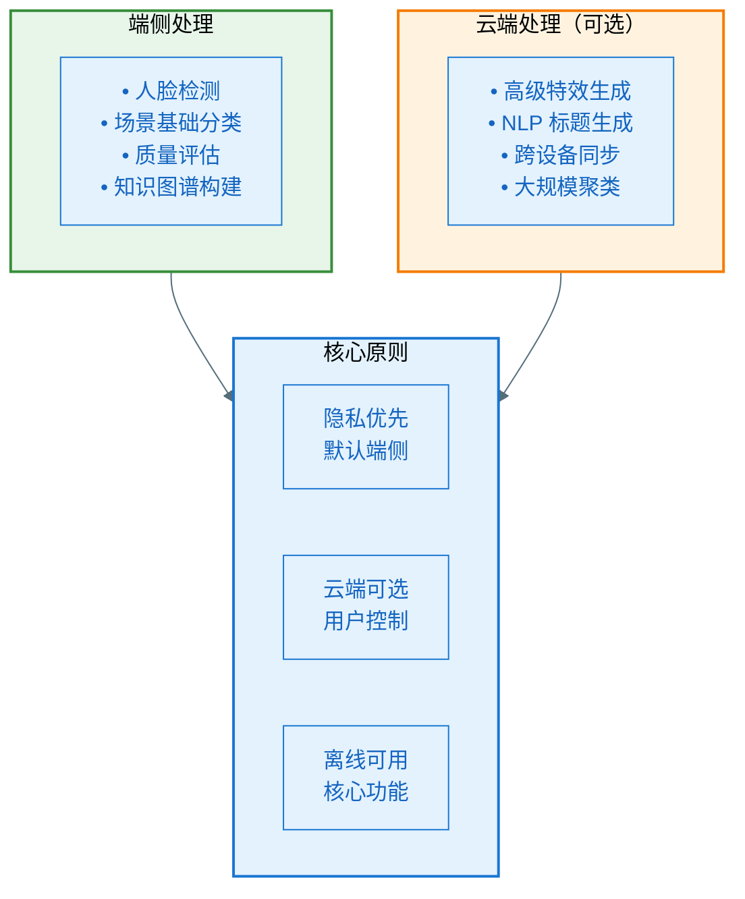

# 精彩回忆功能竞品分析：谷歌相册 vs Apple 相册

> 分析日期：2026-01-28  
> 分析对象：Google Photos Memories / Apple Photos Memories

---

## 一、技术实现方案对比

### 1.1 谷歌相册 (Google Photos Memories)

#### 技术架构

#### 核心技术组件

| 技术模块 | 实现方案 | 技术细节 |
|---------|---------|---------|
| **机器学习架构** | 云端神经网络 | • 深度学习模型运行在 Google 云端 • 计算摄影技术增强 • 支持大规模并行计算 |
| **图像聚类** | 大规模最近邻搜索算法 | • 处理数十亿级图像 • 线性复杂度 O(n) k-means 聚类 • 基于密度的聚类识别形状 |
| **人脸识别** | 云端人脸分组 | • 跨照片识别同一人物 • 自动分组和标记 • 支持面部表情理解 |
| **场景理解** | 深度神经网络 | • 识别事件类型 • 理解照片上下文 • 分析视觉模式（形状、颜色） |
| **电影效果** | 3D 照片生成 | • 使用神经网络创建 3D 版本照片 • 景深估算 • 视差映射 |
| **视频合成** | 自动视频编辑 | • AI 驱动的剪辑选择 • 音乐自动合成 • 转场效果生成 |
| **内容生成** | NLP 标题生成 | • 生成式 AI 创建标题建议 • 自然语言处理 • 上下文理解 |

#### 数据处理流程

---

### 1.2 Apple 相册 (Apple Photos Memories)

#### 技术架构

#### 核心技术组件

| 技术模块 | 实现方案 | 技术细节 |
|---------|---------|---------|
| **机器学习架构** | 完全端侧处理 | • 所有计算在设备本地完成 • 无需网络连接 • 利用 CPU/GPU/Neural Engine |
| **神经网络引擎** | ANSA (Apple Neural Scene Analyzer) | • 统一多任务神经网络 • 卷积层架构（非 Transformer） • 兼容所有 iPhone/iPad/Mac/Apple TV |
| **执行性能** | 超低延迟处理 | • A12 芯片：110 亿次运算 < 7ms • 所有任务完成 < 数十毫秒 • 实时响应交互 |
| **场景分析** | 1000+ 类别识别 | • 物体和场景分类 • 20+ 主观构图属性 • 人物和宠物识别 • 质量和音频分类 |
| **知识图谱** | 端侧私有图谱 | • 识别重要人物 • 常去地点 • 过往旅行 • 事件模式 |
| **隐私保护** | 端到端加密 | • 同态加密 • 差分隐私 • Apple 无法访问照片 |
| **视频生成** | 主题视频片段 | • 基于主题自动创建 • 音乐匹配 • 智能剪辑 |

#### 数据处理流程

---

## 二、技术竞争力对比分析

### 2.1 核心技术维度对比

| 技术维度 | 谷歌相册 | Apple 相册 | 优势方 |
|---------|---------|-----------|-------|
| **计算架构** | 云端分布式计算 | 端侧芯片加速 | 各有优势 |
| **处理能力** | 无限云端算力 | 受限于设备性能 | 🏆 谷歌 |
| **响应速度** | 依赖网络延迟 | 毫秒级本地响应 | 🏆 Apple |
| **隐私保护** | 数据上传云端 | 完全端侧处理 | 🏆 Apple |
| **离线能力** | 需要网络连接 | 完全离线工作 | 🏆 Apple |
| **模型复杂度** | 大规模复杂模型 | 优化压缩模型 | 🏆 谷歌 |
| **功能丰富度** | 电影效果、NLP 生成 | 专注核心回忆 | 🏆 谷歌 |
| **能耗** | 低（云端计算） | 中（本地计算） | 🏆 谷歌 |
| **存储成本** | 云存储订阅 | 本地存储免费 | 🏆 Apple |

### 2.2 SWOT 分析

#### 谷歌相册 Memories

**优势 (Strengths)**
- ✅ 无限云端算力，支持更复杂的 AI 模型
- ✅ 大规模数据训练优势，模型持续进化
- ✅ 跨设备无缝同步，数据永不丢失
- ✅ 功能创新快，电影效果、NLP 标题生成等前沿技术
- ✅ 月活 5 亿+用户，市场占有率高

**劣势 (Weaknesses)**
- ❌ 依赖网络连接，离线不可用
- ❌ 隐私担忧，用户数据存储在云端
- ❌ 网络延迟影响用户体验
- ❌ 需要订阅存储空间（超过免费额度）

**机会 (Opportunities)**
- 🎯 生成式 AI 浪潮，NLP 和图像生成技术领先
- 🎯 与 Google 其他服务深度整合（搜索、地图）
- 🎯 跨平台优势，支持 iOS/Android/Web

**威胁 (Threats)**
- ⚠️ 隐私法规趋严（GDPR、CCPA）
- ⚠️ 端侧 AI 技术成熟，云端优势削弱
- ⚠️ 用户对隐私意识提升

---

#### Apple Photos Memories

**优势 (Strengths)**
- ✅ 完全端侧处理，隐私保护最强
- ✅ 毫秒级响应，用户体验流畅
- ✅ 离线完全可用，无需网络
- ✅ Neural Engine 硬件加速，效率极高
- ✅ 与 iOS 生态深度整合

**劣势 (Weaknesses)**
- ❌ 受限于设备算力，模型复杂度有限
- ❌ 功能迭代较慢，创新不如谷歌激进
- ❌ 仅限 Apple 生态，跨平台受限
- ❌ 老设备性能不足，体验打折扣

**机会 (Opportunities)**
- 🎯 端侧 AI 趋势，Apple Silicon 性能持续提升
- 🎯 隐私作为核心卖点，差异化竞争
- 🎯 Apple Intelligence 生态整合

**威胁 (Threats)**
- ⚠️ 谷歌云端功能创新速度更快
- ⚠️ 端侧存储空间有限
- ⚠️ 跨平台用户流失

---

## 三、技术亮点深度解析

### 3.1 谷歌相册技术亮点

#### 🌟 亮点 1：大规模图像聚类算法

**技术原理**
- 采用大规模最近邻搜索（Large Scale Nearest Neighbor Search）
- 线性复杂度 O(n) 的 k-means 聚类
- 密度聚类识别不规则形状

**应用价值**
- 可处理数十亿级图像库
- 自动发现用户未意识到的照片关联（如 3 张以上共享视觉特征）
- 数据压缩，用聚类 ID 替代原始特征

**竞争力评估**
- 🔥🔥🔥🔥🔥 (5/5) - 业界领先的规模化能力

---

#### 🌟 亮点 2：电影效果照片生成（Cinematic Photos）

**技术原理**
- 使用神经网络估算深度信息
- 从 2D 照片生成 3D 版本
- 视差映射和景深效果

**应用价值**
- 赋予静态照片动态效果
- 增强回忆的沉浸感
- 差异化的视觉体验

**竞争力评估**
- 🔥🔥🔥🔥 (4/5) - 创新功能，但计算成本高

---

#### 🌟 亮点 3：生成式 AI 标题生成

**技术原理**
- 自然语言处理（NLP）模型
- 图像内容理解 + 上下文语义
- "Help me title" 功能

**应用价值**
- 自动生成有创意的回忆标题
- 降低用户编辑门槛
- 个性化表达

**竞争力评估**
- 🔥🔥🔥🔥🔥 (5/5) - 生成式 AI 时代的标志性功能

---

#### 🌟 亮点 4：自动视频编辑与音乐合成

**技术原理**
- AI 驱动的片段选择
- 音乐节奏匹配算法
- 转场效果生成

**应用价值**
- 零操作生成高质量回忆视频
- 音乐情感匹配照片主题
- 降低视频制作门槛

**竞争力评估**
- 🔥🔥🔥🔥 (4/5) - 实用功能，但依赖云端计算

---

### 3.2 Apple 相册技术亮点

#### 🌟 亮点 1：超低延迟端侧 AI

**技术原理**
- Apple Neural Scene Analyzer (ANSA)
- A12 芯片：110 亿次运算 < 7ms
- 所有任务完成 < 数十毫秒

**应用价值**
- 实时响应用户交互
- 无网络延迟，体验流畅
- 边拍边分析，即时可用

**竞争力评估**
- 🔥🔥🔥🔥🔥 (5/5) - 端侧 AI 的天花板级性能

---

#### 🌟 亮点 2：完全端侧隐私保护

**技术原理**
- 同态加密（Homomorphic Encryption）
- 差分隐私（Differential Privacy）
- Apple 无法访问用户照片

**应用价值**
- 极致隐私保护
- 满足最严格的隐私法规
- 用户信任度高

**竞争力评估**
- 🔥🔥🔥🔥🔥 (5/5) - 隐私保护的黄金标准

---

#### 🌟 亮点 3：多任务统一神经网络架构

**技术原理**
- ANSA 统一处理多种任务
- 卷积层架构（非 Transformer）
- 兼容所有设备（包括无 Neural Engine 设备）

**应用价值**
- 单一模型完成多种分析
- 降低模型部署复杂度
- 老设备也能享受 AI 功能

**竞争力评估**
- 🔥🔥🔥🔥 (4/5) - 工程优化的典范

---

#### 🌟 亮点 4：端侧知识图谱

**技术原理**
- 本地构建私有知识图谱
- 识别人物、地点、事件模式
- 关联分析和推理

**应用价值**
- 智能理解用户生活模式
- 无需上传数据即可个性化
- 离线状态下持续学习

**竞争力评估**
- 🔥🔥🔥🔥 (4/5) - 端侧智能的核心能力

---

## 四、技术实现复杂度分析

### 4.1 谷歌相册实现难点

| 难点 | 技术挑战 | 解决方案 |
|-----|---------|---------|
| **规模化处理** | 数十亿图像的实时处理 | 分布式计算、高效聚类算法 |
| **网络延迟** | 云端往返影响体验 | CDN 加速、预加载优化 |
| **隐私合规** | GDPR/CCPA 法规要求 | 数据加密、用户控制选项 |
| **存储成本** | 海量图像存储 | 压缩技术、分层存储 |
| **模型训练** | 持续数据标注和训练 | 主动学习、半监督学习 |

### 4.2 Apple 相册实现难点

| 难点 | 技术挑战 | 解决方案 |
|-----|---------|---------|
| **性能优化** | 毫秒级响应要求 | 硬件协同设计、模型压缩 |
| **模型压缩** | 在有限设备上运行复杂模型 | 量化、剪枝、知识蒸馏 |
| **设备兼容** | 支持老设备无 Neural Engine | 多后端适配（CPU/GPU/NE） |
| **离线智能** | 无云端辅助的智能化 | 端侧知识图谱、增量学习 |
| **存储限制** | 设备存储空间有限 | 高效特征存储、按需加载 |

---

## 五、市场数据与用户反馈

### 5.1 市场表现

| 指标 | 谷歌相册 | Apple 相册 |
|-----|---------|-----------|
| **月活跃用户** | Memories 功能 5 亿+ | 未公开（估计与 iPhone 用户量相当） |
| **市场规模** | 数字照片管理市场预计 2027 年超 200 亿美元 | - |
| **用户评分** | 4.4/5 (Google Play) | 集成在系统中，无单独评分 |

### 5.2 用户体验对比

| 体验维度 | 谷歌相册 | Apple 相册 |
|---------|---------|-----------|
| **响应速度** | ⭐⭐⭐ (依赖网络) | ⭐⭐⭐⭐⭐ (毫秒级) |
| **功能丰富度** | ⭐⭐⭐⭐⭐ | ⭐⭐⭐⭐ |
| **隐私感知** | ⭐⭐⭐ | ⭐⭐⭐⭐⭐ |
| **跨平台能力** | ⭐⭐⭐⭐⭐ | ⭐⭐ (仅 Apple 生态) |
| **离线可用性** | ⭐⭐ | ⭐⭐⭐⭐⭐ |
| **定制化** | ⭐⭐⭐⭐ | ⭐⭐⭐ |

---

## 六、技术趋势与未来展望

### 6.1 技术发展方向

### 6.2 潜在技术演进

#### 谷歌相册可能的演进
1. **增强生成能力**：AI 生成完整回忆故事脚本
2. **实时协作**：多用户共同编辑回忆
3. **AR/VR 整合**：沉浸式回忆体验
4. **视频理解增强**：从视频中提取更丰富的语义

#### Apple 相册可能的演进
1. **端云混合计算**：轻量任务端侧，复杂任务云端（可选）
2. **Apple Intelligence 深度整合**：与 Siri、Shortcuts 联动
3. **跨设备协同**：iPhone/iPad/Mac 分布式计算
4. **更强端侧生成能力**：端侧运行小型生成式模型

---

## 七、对 Android 相册应用的启示

### 7.1 技术选型建议

**推荐架构：端云混合方案**

### 7.2 关键技术要点

| 维度 | 建议方案 | 理由 |
|-----|---------|------|
| **计算架构** | 端云混合 | 结合两者优势，用户可选 |
| **隐私策略** | 默认端侧，云端可选 | 满足隐私要求，提供高级功能 |
| **模型选择** | TensorFlow Lite / ONNX | 跨平台、优化好 |
| **硬件加速** | NNAPI / GPU Delegate | 充分利用 Android 硬件 |
| **离线能力** | 核心功能必须离线 | 基础体验不依赖网络 |
| **个性化** | 端侧知识图谱 | 隐私保护下的智能化 |

### 7.3 实现优先级

**Phase 1: MVP（3-6 个月）**
- ✅ 端侧人脸检测和聚类
- ✅ 基础场景分类（100+ 类别）
- ✅ 简单回忆生成（按时间/地点）
- ✅ 本地视频拼接

**Phase 2: 增强（6-12 个月）**
- ✅ 端侧知识图谱
- ✅ 高级场景理解（1000+ 类别）
- ✅ 智能回忆推荐
- ✅ 云端备份和同步（可选）

**Phase 3: 高级（12+ 个月）**
- ✅ 电影效果生成
- ✅ NLP 标题生成
- ✅ 跨设备协同计算
- ✅ AR 回忆体验

---

## 八、总结与建议

### 8.1 核心竞争力总结

**谷歌相册 Memories**
- 🏆 **最强优势**：云端算力 + 生成式 AI 能力
- 🎯 **适合场景**：功能丰富度优先、不敏感隐私、有网络环境
- ⚠️ **主要劣势**：隐私担忧、网络依赖

**Apple Photos Memories**
- 🏆 **最强优势**：隐私保护 + 超低延迟
- 🎯 **适合场景**：隐私优先、离线使用、Apple 生态
- ⚠️ **主要劣势**：功能迭代慢、跨平台受限

### 8.2 对 Verity 项目的建议

**战略定位**
- 采用**端云混合**架构，兼顾隐私和功能
- 以**隐私为默认**，云端功能作为增值选项
- 针对 Android 生态优化，利用 Android 硬件特性

**技术路线**
1. 优先实现端侧核心功能（参考 Apple）
2. 云端提供高级特效和生成能力（参考谷歌）
3. 用户完全控制数据上传与否
4. 离线状态下核心功能完全可用

**差异化竞争**
- 🎯 开源模型 + 自定义训练，成本可控
- 🎯 端侧 + 云端灵活切换，用户自主选择
- 🎯 深度定制，满足中国用户特殊需求（如微信/QQ 照片导入）
- 🎯 轻量化设计，低端设备也能流畅运行

---

## 参考资料

1. Google Research: [Clustering Billions of Images with Large Scale Nearest Neighbor Search](https://research.google/pubs/clustering-billions-of-images-with-large-scale-nearest-neighbor-search/)
2. Apple Machine Learning: [Recognizing People in Photos Through Private On-Device Machine Learning](https://machinelearning.apple.com/research/recognizing-people-photos)
3. Apple Machine Learning: [A Multi-Task Neural Architecture for On-Device Scene Analysis](https://machinelearning.apple.com/research/on-device-scene-analysis)
4. Medium: [A snapshot of AI-powered reminiscing in Google Photos](https://medium.com/people-ai-research/a-snapshot-of-ai-powered-reminiscing-in-google-photos-5a05d2f2aa46)
5. Google Blog: [New Memories features in Google Photos](https://blog.google/products/photos/new-memories-features-look-back)

---

> 文档版本：v1.0  
> 最后更新：2026-01-28  
> 分析深度：⭐⭐⭐⭐⭐
