# Google Photos 云端架构深度技术解析

> 技术分析日期：2026-01-28  
> 分析对象：Google Photos Cloud-Based Architecture  
> 技术栈：Spanner + Cloud Vision API + FaceNet + Gemini + Dataflow

---

## 一、云端架构概述

### 1.1 什么是云端架构

Google Photos 采用**完全云端处理架构**，所有计算密集型任务（机器学习、图像分析、视频生成）都在 Google Cloud 的数据中心完成。客户端（App）主要负责上传照片、展示结果和用户交互。

### 1.2 核心特点

| 特性 | 说明 | 技术优势 |
|-----|------|---------|
| **无限算力** | Google 数据中心分布式计算 | 处理能力无上限 |
| **大规模数据** | 40+ 亿张照片，10+ 亿用户 | 规模化训练优势 |
| **跨设备同步** | 多设备无缝访问 | 数据永不丢失 |
| **持续进化** | 云端模型快速迭代 | 无需客户端更新 |
| **复杂功能** | 支持高级 AI 特性 | 电影效果、NLP 生成 |

**服务规模（2024 年数据）**
- 用户数：10 亿+
- 照片/视频总量：40 亿+（4 trillion）
- 日均上传量：60 亿张照片
- 月活搜索用户：5 亿

---

## 二、云端技术架构详解

### 2.1 整体架构图

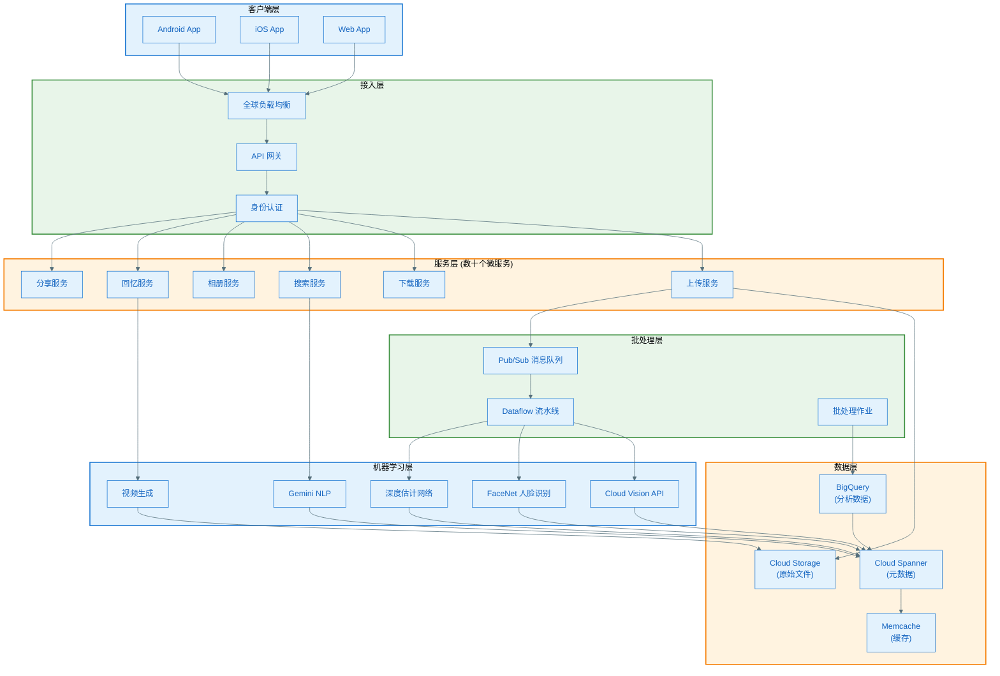

### 2.2 核心技术组件

#### 2.2.1 Cloud Spanner - 全球分布式数据库

**技术特点**
- 全球一致性的 SQL 数据库
- 99.999% 可用性（每年停机 < 5.26 分钟）
- 每秒处理 100 万次读查询
- P99 延迟 < 300ms

**架构创新：突破 CAP 定理**

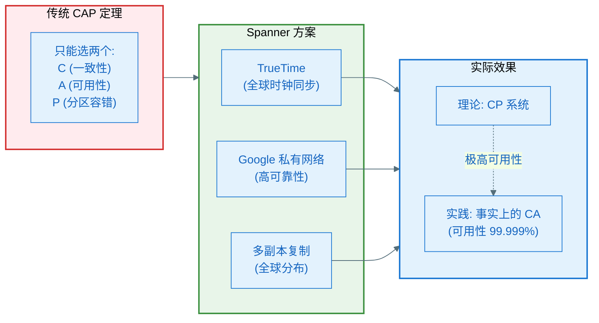

**TrueTime 技术**

TrueTime 是 Google 的全球同步时钟系统，为每个数据中心提供精确的时间戳。

```python
# TrueTime API 伪代码
class TrueTime:
    def now(self) -> TimeInterval:
        """返回当前时间区间 [earliest, latest]"""
        # 通过 GPS + 原子钟 获取时间
        # 考虑时钟漂移和网络延迟
        return TimeInterval(earliest, latest)
    
    def after(self, t: Timestamp) -> bool:
        """当前时间是否绝对在 t 之后"""
        return self.now().earliest > t
    
    def before(self, t: Timestamp) -> bool:
        """当前时间是否绝对在 t 之前"""
        return self.now().latest < t

# Spanner 事务实现
class SpannerTransaction:
    def commit(self):
        # 1. 获取提交时间戳
        commit_timestamp = TrueTime.now().latest
        
        # 2. 等待直到确保时间戳唯一性
        TrueTime.wait_until_after(commit_timestamp)
        
        # 3. 写入数据
        self.write_data_with_timestamp(commit_timestamp)
        
        # 4. 全球一致性保证
        # 任何后续读取都能看到此次提交
```

**数据分片与复制**

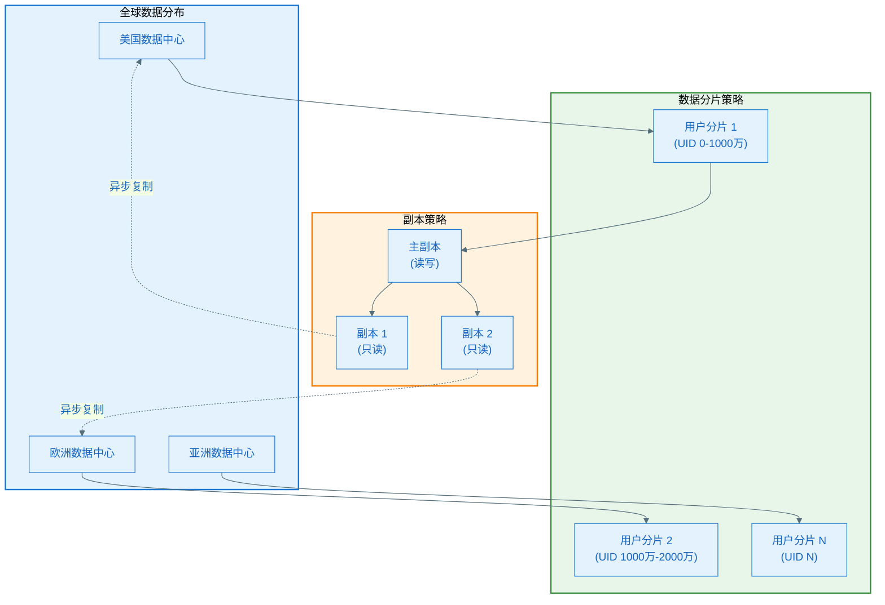

**数据模型**

```sql
-- 用户表
CREATE TABLE users (
    user_id STRING(36) NOT NULL,
    email STRING(256),
    display_name STRING(128),
    storage_quota BIGINT,
    created_at TIMESTAMP,
    PRIMARY KEY (user_id)
);

-- 照片元数据表（核心表）
CREATE TABLE photos (
    photo_id STRING(36) NOT NULL,
    user_id STRING(36) NOT NULL,
    file_path STRING(512),
    storage_bucket STRING(64),
    upload_timestamp TIMESTAMP,
    capture_timestamp TIMESTAMP,
    latitude FLOAT64,
    longitude FLOAT64,
    width INT64,
    height INT64,
    file_size BIGINT,
    mime_type STRING(64),
    PRIMARY KEY (user_id, photo_id),
    INTERLEAVE IN PARENT users ON DELETE CASCADE
) PRIMARY KEY (user_id, photo_id);

-- 机器学习标签表
CREATE TABLE photo_labels (
    photo_id STRING(36) NOT NULL,
    user_id STRING(36) NOT NULL,
    label_name STRING(128),
    label_category STRING(64),
    confidence FLOAT64,
    source STRING(32), -- 'vision_api', 'custom_model'
    created_at TIMESTAMP,
    PRIMARY KEY (user_id, photo_id, label_name),
    INTERLEAVE IN PARENT photos ON DELETE CASCADE
);

-- 人脸识别表
CREATE TABLE faces (
    face_id STRING(36) NOT NULL,
    user_id STRING(36) NOT NULL,
    photo_id STRING(36) NOT NULL,
    person_cluster_id STRING(36),
    embedding ARRAY<FLOAT64>, -- 128 维特征向量
    bbox_x FLOAT64,
    bbox_y FLOAT64,
    bbox_width FLOAT64,
    bbox_height FLOAT64,
    confidence FLOAT64,
    PRIMARY KEY (user_id, face_id),
    INTERLEAVE IN PARENT users ON DELETE CASCADE
);

-- 人物聚类表
CREATE TABLE person_clusters (
    cluster_id STRING(36) NOT NULL,
    user_id STRING(36) NOT NULL,
    display_name STRING(128),
    face_count INT64,
    representative_face_id STRING(36),
    is_favorite BOOL,
    created_at TIMESTAMP,
    updated_at TIMESTAMP,
    PRIMARY KEY (user_id, cluster_id),
    INTERLEAVE IN PARENT users ON DELETE CASCADE
);

-- 回忆表
CREATE TABLE memories (
    memory_id STRING(36) NOT NULL,
    user_id STRING(36) NOT NULL,
    memory_type STRING(32), -- 'travel', 'people', 'place', 'anniversary'
    title STRING(256),
    description TEXT,
    start_date DATE,
    end_date DATE,
    photo_ids ARRAY<STRING(36)>,
    video_url STRING(512),
    generation_timestamp TIMESTAMP,
    view_count INT64,
    PRIMARY KEY (user_id, memory_id),
    INTERLEAVE IN PARENT users ON DELETE CASCADE
);

-- 搜索索引表
CREATE TABLE search_index (
    user_id STRING(36) NOT NULL,
    photo_id STRING(36) NOT NULL,
    search_text TEXT, -- 包含所有标签、人物名、地点的全文索引
    embedding ARRAY<FLOAT64>, -- CLIP 风格的多模态嵌入
    PRIMARY KEY (user_id, photo_id)
);
```

**性能优化技术**

| 技术 | 说明 | 效果 |
|-----|------|------|
| **INTERLEAVE** | 子表数据与父表共存 | 减少跨节点查询 |
| **分片策略** | 按 user_id 分片 | 用户数据局部性 |
| **副本放置** | 全球多副本 | 就近读取，低延迟 |
| **批量提交** | 事务批处理 | 吞吐量 ↑ 10x |
| **查询优化** | 索引 + 缓存 | 查询延迟 ↓ 50% |

#### 2.2.2 Cloud Storage - 海量文件存储

**存储架构**

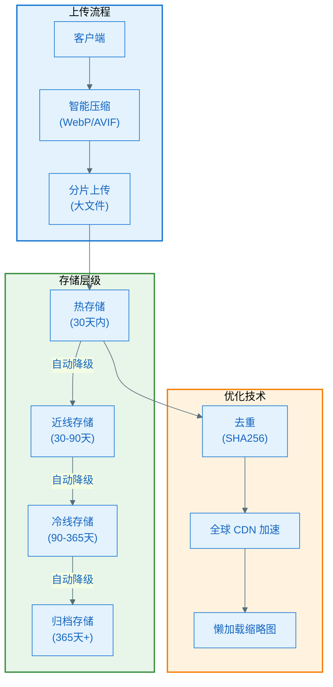

**图像压缩策略**

| 格式 | 压缩比 | 质量 | 用途 |
|-----|-------|------|------|
| **原始格式** | 0% | 100% | 用户原始上传 |
| **AVIF** | 60% vs JPEG | 95% | 高质量展示 |
| **WebP** | 30% vs PNG | 90% | 标准展示 |
| **JPEG (高质量)** | 20% | 85% | 兼容性展示 |
| **缩略图** | 90% | 70% | 列表展示 |

**文件去重技术**

```python
# 文件去重伪代码
class FileDeduplication:
    def upload_photo(self, user_id, file_data):
        # 1. 计算 SHA256 哈希
        file_hash = sha256(file_data)
        
        # 2. 检查全局去重表
        existing_file = check_global_hash_table(file_hash)
        
        if existing_file:
            # 3. 文件已存在，只存储引用
            create_reference(user_id, existing_file.path)
            return existing_file.path
        else:
            # 4. 新文件，存储到 Cloud Storage
            file_path = store_to_cloud_storage(file_data)
            
            # 5. 更新全局哈希表
            add_to_global_hash_table(file_hash, file_path)
            
            # 6. 创建用户引用
            create_reference(user_id, file_path)
            
            return file_path
```

**存储成本优化**

```
原始策略（无优化）:
- 10 亿用户，平均每人 1000 张照片，每张 3MB
- 总存储: 10^9 × 1000 × 3MB = 3 EB (艾字节)
- 成本: $3,000,000,000/年 (按 $0.001/GB/月)

优化后:
- 压缩 60% → 1.2 EB
- 去重 20% → 0.96 EB
- 分层存储 40% → 0.576 EB
- 成本: $576,000,000/年
- 节省: 81%
```

#### 2.2.3 Pub/Sub + Dataflow - 批处理流水线

**异步处理架构**

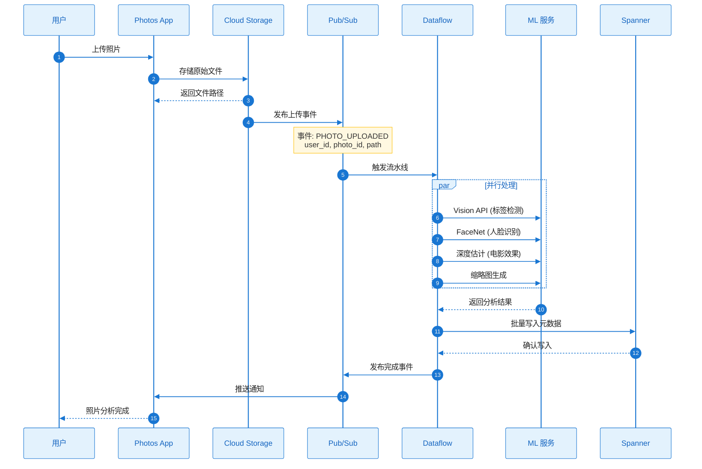

**Dataflow 流水线配置**

```python
# Apache Beam + Dataflow 伪代码
import apache_beam as beam
from apache_beam.options.pipeline_options import PipelineOptions

class PhotoProcessingPipeline:
    def run(self):
        options = PipelineOptions(
            runner='DataflowRunner',
            project='google-photos',
            region='us-central1',
            temp_location='gs://temp-bucket',
            max_num_workers=1000,
            autoscaling_algorithm='THROUGHPUT_BASED'
        )
        
        with beam.Pipeline(options=options) as pipeline:
            (pipeline
                # 1. 读取 Pub/Sub 消息
                | 'Read from Pub/Sub' >> beam.io.ReadFromPubSub(
                    topic='projects/google-photos/topics/photo-uploads'
                )
                
                # 2. 解析消息
                | 'Parse JSON' >> beam.Map(parse_photo_event)
                
                # 3. 并行处理
                | 'Process Photos' >> beam.ParDo(ProcessPhoto())
                
                # 4. 批量写入 Spanner
                | 'Write to Spanner' >> beam.io.WriteToSpanner(
                    instance='photos-prod',
                    database='photos',
                    table='photo_labels',
                    batch_size=1000
                )
            )

class ProcessPhoto(beam.DoFn):
    def process(self, element):
        photo_id = element['photo_id']
        file_path = element['file_path']
        
        # 并行调用多个 ML 服务
        vision_labels = self.call_vision_api(file_path)
        faces = self.call_facenet(file_path)
        depth_map = self.call_depth_estimation(file_path)
        
        # 返回结果
        yield {
            'photo_id': photo_id,
            'labels': vision_labels,
            'faces': faces,
            'depth_map': depth_map,
            'processed_at': datetime.now()
        }
```

**流水线性能**

| 指标 | 数值 | 说明 |
|-----|------|------|
| **吞吐量** | 60 亿张/天 | 日均上传量 |
| **并发度** | 1000+ 工作节点 | 动态伸缩 |
| **延迟** | < 5 秒 | 上传到完成分析 |
| **成本** | 按量计费 | 无闲置资源 |

---

## 三、核心机器学习技术

### 3.1 FaceNet - 人脸识别

**技术原理**

FaceNet 是 Google 在 2015 年提出的深度学习人脸识别系统，使用三元组损失（Triplet Loss）训练卷积神经网络。

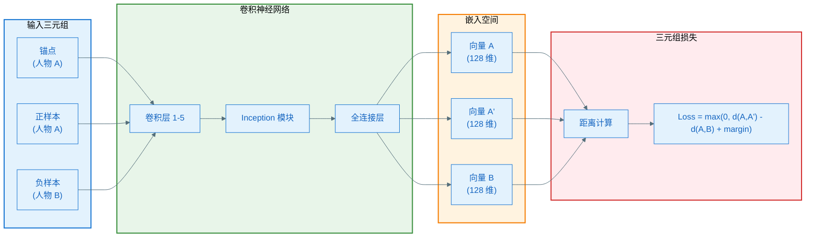

**三元组损失函数**

```python
def triplet_loss(anchor, positive, negative, margin=0.2):
    """
    三元组损失函数
    
    目标：让同一人的照片距离近，不同人的照片距离远
    """
    # 计算 L2 距离
    d_pos = euclidean_distance(anchor, positive)
    d_neg = euclidean_distance(anchor, negative)
    
    # 损失函数
    loss = max(0, d_pos - d_neg + margin)
    
    return loss

def euclidean_distance(x, y):
    """欧氏距离"""
    return np.sqrt(np.sum((x - y) ** 2))
```

**在线三元组挖掘**

FaceNet 的创新在于在线挖掘困难样本（Hard Triplet Mining）。

```python
class OnlineTripletMining:
    def select_triplets(self, batch_embeddings, batch_labels):
        """
        从批次中选择困难三元组
        """
        triplets = []
        
        for i, anchor_label in enumerate(batch_labels):
            anchor_embedding = batch_embeddings[i]
            
            # 1. 找到最困难的正样本（距离最远的同类）
            positive_indices = np.where(batch_labels == anchor_label)[0]
            positive_indices = positive_indices[positive_indices != i]
            
            if len(positive_indices) == 0:
                continue
            
            positive_distances = [
                euclidean_distance(anchor_embedding, batch_embeddings[j])
                for j in positive_indices
            ]
            hardest_positive_idx = positive_indices[np.argmax(positive_distances)]
            
            # 2. 找到最困难的负样本（距离最近的异类）
            negative_indices = np.where(batch_labels != anchor_label)[0]
            negative_distances = [
                euclidean_distance(anchor_embedding, batch_embeddings[j])
                for j in negative_indices
            ]
            hardest_negative_idx = negative_indices[np.argmin(negative_distances)]
            
            # 3. 组成三元组
            triplets.append((i, hardest_positive_idx, hardest_negative_idx))
        
        return triplets
```

**性能指标**

| 数据集 | 准确率 | 误识率 (FAR) | 说明 |
|-------|-------|-------------|------|
| **LFW** | 99.63% | 0.37% | 标准人脸识别基准 |
| **YouTube Faces** | 95.12% | 4.88% | 视频人脸识别 |
| **特征维度** | 128 维 | - | 每张人脸仅 128 字节 |

**人物聚类流程**

```mermaid
%%{init: {'theme': 'base', 'themeVariables': { 'primaryColor': '#E3F2FD', 'primaryTextColor': '#1565C0', 'primaryBorderColor': '#1976D2', 'lineColor': '#546E7A'}}}%%
flowchart TB
    Start([新照片上传]) --> FaceDetect[人脸检测<br/>(检测边界框)]
    
    FaceDetect --> Extract[提取人脸区域]
    Extract --> FaceNet[FaceNet 特征提取<br/>(128 维向量)]
    
    FaceNet --> Search[向量相似度搜索]
    
    subgraph VectorSearch["向量搜索引擎"]
        ANN["近似最近邻<br/>(ANN)"]
        Threshold["阈值判断<br/>(距离 < 0.6)"]
    end
    
    Search --> ANN
    ANN --> Threshold
    
    Threshold --> Decision{匹配结果}
    
    Decision -->|高相似度| Assign[分配到已知人物]
    Decision -->|低相似度| NewCluster[创建新人物聚类]
    
    Assign --> UpdateDB[更新 Spanner]
    NewCluster --> UpdateDB
    
    UpdateDB --> Notification[推送通知<br/>"发现新人物"]
    
    Notification --> End([完成])

    style Start fill:#E8F5E9,stroke:#388E3C,stroke-width:2px
    style End fill:#E8F5E9,stroke:#388E3C,stroke-width:2px
    style VectorSearch fill:#FFF3E0,stroke:#F57C00,stroke-width:2px
    style FaceNet fill:#E3F2FD,stroke:#1976D2,stroke-width:2px
```

### 3.2 Cloud Vision API - 场景分析

**API 能力**

| 功能 | 说明 | 返回数据 |
|-----|------|---------|
| **标签检测** | 识别物体、场景、活动 | 标签 + 置信度 |
| **人脸检测** | 检测人脸及表情 | 边界框 + 情绪 |
| **地标识别** | 识别著名地标 | 地标名称 + 位置 |
| **OCR** | 提取图像文字 | 文本 + 位置 |
| **Logo 检测** | 识别品牌 Logo | Logo 名称 |
| **SafeSearch** | 不当内容检测 | 安全等级 |
| **图像属性** | 主色调分析 | 颜色 + 比例 |
| **Web 检测** | 相似图像搜索 | 网页 URL |

**API 调用示例**

```python
from google.cloud import vision

def analyze_photo(image_path):
    """调用 Cloud Vision API 分析照片"""
    client = vision.ImageAnnotatorClient()
    
    # 读取图像
    with open(image_path, 'rb') as image_file:
        content = image_file.read()
    
    image = vision.Image(content=content)
    
    # 批量请求多个特征
    response = client.annotate_image({
        'image': image,
        'features': [
            {'type_': vision.Feature.Type.LABEL_DETECTION, 'max_results': 20},
            {'type_': vision.Feature.Type.FACE_DETECTION},
            {'type_': vision.Feature.Type.LANDMARK_DETECTION},
            {'type_': vision.Feature.Type.IMAGE_PROPERTIES},
            {'type_': vision.Feature.Type.SAFE_SEARCH_DETECTION},
        ]
    })
    
    # 解析结果
    results = {
        'labels': [
            {'name': label.description, 'score': label.score}
            for label in response.label_annotations
        ],
        'faces': [
            {
                'bbox': face.bounding_poly,
                'joy': face.joy_likelihood,
                'sorrow': face.sorrow_likelihood,
                'anger': face.anger_likelihood,
                'surprise': face.surprise_likelihood
            }
            for face in response.face_annotations
        ],
        'landmarks': [
            {'name': landmark.description, 'location': landmark.locations[0]}
            for landmark in response.landmark_annotations
        ],
        'dominant_colors': [
            {'color': color.color, 'score': color.score, 'fraction': color.pixel_fraction}
            for color in response.image_properties_annotation.dominant_colors.colors
        ],
        'safe_search': {
            'adult': response.safe_search_annotation.adult,
            'violence': response.safe_search_annotation.violence
        }
    }
    
    return results
```

**标签分类体系**

Vision API 使用 Google 的知识图谱，覆盖数万个类别。

```
场景分类示例:
├─ 自然环境
│  ├─ 海滩 (Beach) - 0.95
│  ├─ 日落 (Sunset) - 0.89
│  └─ 海洋 (Ocean) - 0.87
├─ 活动
│  ├─ 度假 (Vacation) - 0.82
│  └─ 旅行 (Travel) - 0.78
├─ 物体
│  ├─ 天空 (Sky) - 0.91
│  └─ 水 (Water) - 0.88
└─ 美学
   ├─ 风景 (Landscape) - 0.85
   └─ 自然 (Nature) - 0.83
```

### 3.3 Cinematic Photos - 电影效果生成

**技术原理：单目深度估计**

```mermaid
%%{init: {'theme': 'base', 'themeVariables': { 'primaryColor': '#E3F2FD', 'primaryTextColor': '#1565C0', 'primaryBorderColor': '#1976D2', 'lineColor': '#546E7A'}}}%%
flowchart LR
    subgraph Input["输入"]
        RGB["2D 照片<br/>(RGB)"]
    end
    
    subgraph Network["深度估计网络"]
        Encoder["编码器<br/>(ResNet)"]
        Decoder["解码器<br/>(UpConv)"]
    end
    
    subgraph Output["输出"]
        DepthMap["深度图<br/>(Depth Map)"]
    end
    
    subgraph Processing["后处理"]
        Segmentation["人物分割<br/>(DeepLab)"]
        Refine["边界优化"]
        Parallax["视差映射"]
    end
    
    subgraph Result["最终效果"]
        Video["3D 动画视频"]
    end
    
    RGB --> Encoder
    Encoder --> Decoder
    Decoder --> DepthMap
    
    DepthMap --> Segmentation
    Segmentation --> Refine
    Refine --> Parallax
    
    Parallax --> Video

    style Input fill:#E3F2FD,stroke:#1976D2,stroke-width:2px
    style Network fill:#E8F5E9,stroke:#388E3C,stroke-width:2px
    style Processing fill:#FFF3E0,stroke:#F57C00,stroke-width:2px
    style Result fill:#E3F2FD,stroke:#1976D2,stroke-width:2px
```

**深度估计网络架构**

```python
class DepthEstimationNetwork(nn.Module):
    """单目深度估计网络"""
    
    def __init__(self):
        super().__init__()
        
        # 编码器：ResNet-50 预训练
        self.encoder = resnet50(pretrained=True)
        
        # 解码器：上采样层
        self.decoder = nn.Sequential(
            nn.ConvTranspose2d(2048, 1024, 3, stride=2, padding=1),
            nn.ReLU(),
            nn.ConvTranspose2d(1024, 512, 3, stride=2, padding=1),
            nn.ReLU(),
            nn.ConvTranspose2d(512, 256, 3, stride=2, padding=1),
            nn.ReLU(),
            nn.ConvTranspose2d(256, 128, 3, stride=2, padding=1),
            nn.ReLU(),
            nn.Conv2d(128, 1, 1)  # 输出单通道深度图
        )
    
    def forward(self, rgb_image):
        # 编码
        features = self.encoder(rgb_image)
        
        # 解码
        depth_map = self.decoder(features)
        
        return depth_map

# 损失函数：尺度不变损失
def scale_invariant_loss(pred_depth, gt_depth):
    """
    尺度不变损失函数
    
    因为电影效果只需要相对深度，不需要绝对深度
    """
    # 取对数
    log_pred = torch.log(pred_depth + 1e-6)
    log_gt = torch.log(gt_depth + 1e-6)
    
    # 计算差值
    diff = log_pred - log_gt
    
    # 尺度不变项
    loss = torch.mean(diff ** 2) - 0.5 * torch.mean(diff) ** 2
    
    return loss
```

**训练数据策略**

Google 使用自定义数据集：

1. **5 摄像头采集装置**
   - 中心相机 + 4 个辅助相机
   - 多视角立体视觉（Multi-View Stereo）
   - 生成真实深度图

2. **Pixel 4 人像模式照片**
   - 双摄像头硬件
   - 高质量人物深度
   - 真实场景分布

**人物边界优化**

```python
class PersonBoundaryRefinement:
    """人物边界优化"""
    
    def __init__(self):
        # DeepLab 人物分割模型（在 Open Images 数据集训练）
        self.segmentation_model = load_deeplab_model()
    
    def refine_depth(self, rgb_image, depth_map):
        # 1. 人物分割
        person_mask = self.segmentation_model(rgb_image)
        
        # 2. 中值滤波平滑深度图
        smoothed_depth = median_filter(depth_map, size=5)
        
        # 3. 在人物边界使用原始深度，其他区域使用平滑深度
        refined_depth = np.where(
            is_near_boundary(person_mask),
            depth_map,  # 边界保持锐利
            smoothed_depth  # 其他区域平滑
        )
        
        return refined_depth
```

**视差动画生成**

```python
def generate_cinematic_video(rgb_image, depth_map, duration=3.0, fps=30):
    """
    生成电影效果视频
    
    Args:
        rgb_image: RGB 图像
        depth_map: 深度图
        duration: 视频时长（秒）
        fps: 帧率
    """
    frames = []
    num_frames = int(duration * fps)
    
    for t in range(num_frames):
        # 1. 计算相机运动轨迹（Ken Burns 效果）
        progress = t / num_frames
        camera_x = np.sin(progress * np.pi) * 20  # 水平移动
        camera_y = np.cos(progress * np.pi) * 10  # 垂直移动
        zoom = 1.0 + progress * 0.1  # 轻微缩放
        
        # 2. 根据深度图计算视差
        parallax_x = depth_map * camera_x * 0.05
        parallax_y = depth_map * camera_y * 0.05
        
        # 3. 应用视差偏移
        frame = warp_image(
            rgb_image,
            parallax_x,
            parallax_y,
            zoom
        )
        
        # 4. 填充空洞（使用周围像素插值）
        frame = inpaint_holes(frame)
        
        frames.append(frame)
    
    # 5. 编码为视频
    video = encode_video(frames, fps=fps)
    
    return video
```

### 3.4 Gemini - 自然语言搜索

**Ask Photos 功能**

Google Photos 在 2024 年引入了 Gemini 驱动的自然语言搜索。

**技术架构**

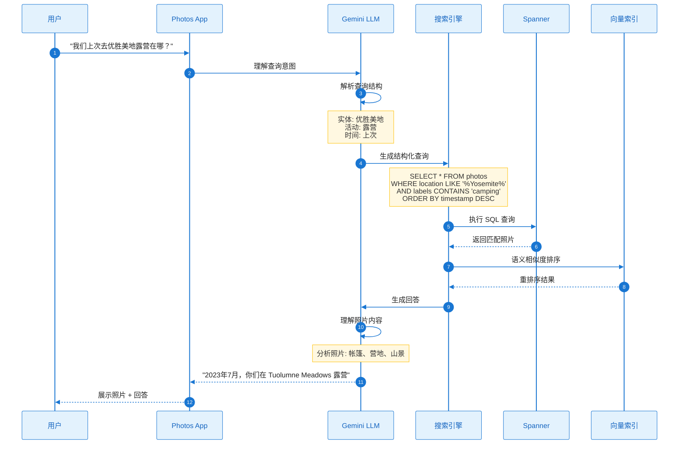

**多模态嵌入**

```python
class MultiModalEmbedding:
    """
    多模态嵌入模型（类似 CLIP）
    
    将图像和文本映射到同一向量空间
    """
    
    def __init__(self):
        self.vision_encoder = VisionTransformer()
        self.text_encoder = BERTEncoder()
        self.projection_dim = 512
    
    def encode_image(self, image):
        """编码图像"""
        visual_features = self.vision_encoder(image)
        image_embedding = self.project(visual_features)
        return normalize(image_embedding)
    
    def encode_text(self, text):
        """编码文本"""
        text_features = self.text_encoder(text)
        text_embedding = self.project(text_features)
        return normalize(text_embedding)
    
    def search(self, query_text, photo_database):
        """语义搜索"""
        # 1. 编码查询文本
        query_embedding = self.encode_text(query_text)
        
        # 2. 计算与所有照片的相似度
        similarities = []
        for photo in photo_database:
            photo_embedding = photo.embedding  # 预先计算
            similarity = cosine_similarity(query_embedding, photo_embedding)
            similarities.append((photo.id, similarity))
        
        # 3. 排序返回
        results = sorted(similarities, key=lambda x: x[1], reverse=True)
        return results[:20]
```

**查询理解示例**

| 用户查询 | Gemini 理解 | 生成的查询 |
|---------|-----------|-----------|
| "我和 Alice 在笑的照片" | 人物: Alice<br/>动作: 笑 | `people='Alice' AND emotion='joy'` |
| "湖边划皮划艇" | 地点类型: 湖<br/>活动: 划皮划艇 | `scene='lake' AND activity='kayaking'` |
| "我吃的最后一顿寿司" | 物体: 寿司<br/>时间: 最近 | `labels='sushi' ORDER BY timestamp DESC LIMIT 1` |

### 3.5 自动视频编辑

**Memories 视频生成流程**

```mermaid
%%{init: {'theme': 'base', 'themeVariables': { 'primaryColor': '#E3F2FD', 'primaryTextColor': '#1565C0', 'primaryBorderColor': '#1976D2', 'lineColor': '#546E7A'}}}%%
flowchart TB
    Start([触发回忆生成]) --> SelectPhotos[选择照片<br/>(智能排序)]
    
    SelectPhotos --> ScorePhotos[照片评分]
    
    subgraph Scoring["评分维度"]
        S1["质量分数"]
        S2["人物重要性"]
        S3["多样性"]
        S4["美学分数"]
    end
    
    ScorePhotos --> Scoring
    Scoring --> Filter[过滤 Top K<br/>(15-30 张)]
    
    Filter --> ChooseTemplate[选择模板]
    
    subgraph Templates["视频模板"]
        T1["旅行 - 慢节奏"]
        T2["聚会 - 快节奏"]
        T3["人物 - 柔和"]
        T4["回顾 - 怀旧"]
    end
    
    ChooseTemplate --> Templates
    Templates --> MatchMusic[匹配音乐]
    
    MatchMusic --> MusicLibrary[音乐库<br/>(按情绪/节奏分类)]
    
    MusicLibrary --> SyncBeats[节拍同步]
    
    SyncBeats --> Transitions[添加转场效果]
    
    Transitions --> Render[渲染视频]
    
    Render --> GenerateTitle[生成标题<br/>(Gemini NLP)]
    
    GenerateTitle --> End([完成视频])

    style Start fill:#E8F5E9,stroke:#388E3C,stroke-width:2px
    style End fill:#E8F5E9,stroke:#388E3C,stroke-width:2px
    style Scoring fill:#FFF3E0,stroke:#F57C00,stroke-width:2px
    style Templates fill:#E3F2FD,stroke:#1976D2,stroke-width:2px
```

**智能照片选择算法**

```python
def select_photos_for_memory(candidate_photos, target_count=20):
    """
    为回忆视频智能选择照片
    
    平衡质量、多样性和代表性
    """
    scored_photos = []
    
    for photo in candidate_photos:
        score = 0
        
        # 1. 质量分数 (0-100)
        quality = photo.quality_score
        score += quality * 0.3
        
        # 2. 人物重要性 (0-100)
        important_people = sum(
            person.importance_score
            for person in photo.people
        )
        score += important_people * 0.25
        
        # 3. 美学分数 (0-100)
        aesthetic = calculate_aesthetic_score(photo)
        score += aesthetic * 0.2
        
        # 4. 情感分数 (喜悦、惊喜高分)
        emotion = max(photo.joy, photo.surprise, 0)
        score += emotion * 0.15
        
        # 5. 独特性（与已选照片的差异）
        uniqueness = calculate_uniqueness(photo, scored_photos)
        score += uniqueness * 0.1
        
        scored_photos.append((photo, score))
    
    # 排序并选择 Top K
    scored_photos.sort(key=lambda x: x[1], reverse=True)
    selected = [photo for photo, _ in scored_photos[:target_count]]
    
    # 按时间顺序排列
    selected.sort(key=lambda x: x.timestamp)
    
    return selected
```

**音乐节拍同步**

```python
def sync_photos_to_music(photos, music_track):
    """
    将照片与音乐节拍同步
    """
    # 1. 分析音乐节拍
    beats = extract_music_beats(music_track)
    tempo = calculate_tempo(beats)  # BPM (Beats Per Minute)
    
    # 2. 计算每张照片的显示时长
    total_duration = music_track.duration
    avg_photo_duration = total_duration / len(photos)
    
    # 3. 对齐到最近的节拍
    timeline = []
    current_time = 0
    
    for i, photo in enumerate(photos):
        # 找到最近的节拍点
        nearest_beat = find_nearest_beat(current_time, beats)
        
        # 计算到下一个关键节拍的时长
        if i < len(photos) - 1:
            next_beat = find_next_key_beat(nearest_beat, beats, tempo)
            duration = next_beat - nearest_beat
        else:
            duration = music_track.duration - nearest_beat
        
        timeline.append({
            'photo': photo,
            'start_time': nearest_beat,
            'duration': duration,
            'beat_aligned': True
        })
        
        current_time = nearest_beat + duration
    
    return timeline
```

**转场效果**

| 转场类型 | 适用场景 | 效果描述 |
|---------|---------|---------|
| **淡入淡出** | 通用 | 平滑过渡 |
| **Ken Burns** | 风景照 | 缩放 + 平移 |
| **划动** | 连续场景 | 左右/上下滑动 |
| **缩放** | 特写照片 | 放大/缩小 |
| **旋转** | 动态场景 | 3D 旋转 |

---

## 四、分布式系统设计

### 4.1 全球架构部署

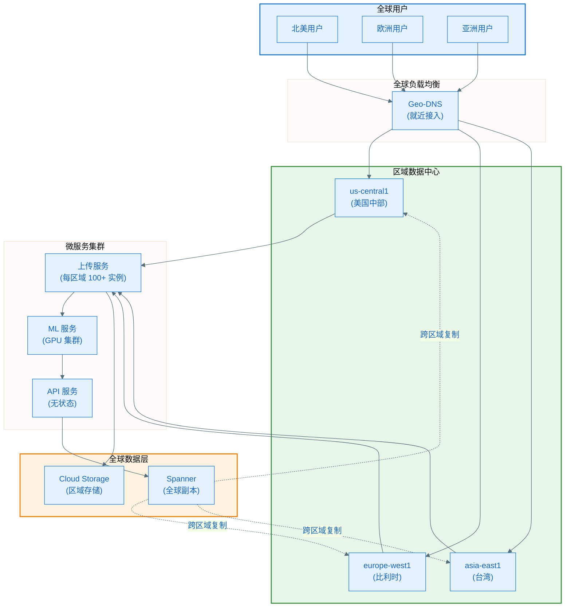

### 4.2 可靠性保障

**SLA 保证**

| 指标 | 目标 | 实际表现 |
|-----|------|---------|
| **可用性** | 99.95% | 99.999% |
| **上传延迟** | < 5s (P95) | 3.2s (P95) |
| **搜索延迟** | < 300ms (P99) | 250ms (P99) |
| **数据持久性** | 99.999999999% (11 个 9) | 满足 |

**容错机制**

```mermaid
%%{init: {'theme': 'base', 'themeVariables': { 'primaryColor': '#E3F2FD', 'primaryTextColor': '#1565C0', 'primaryBorderColor': '#1976D2', 'lineColor': '#546E7A'}}}%%
flowchart TB
    Request([用户请求]) --> Retry[自动重试<br/>(指数退避)]
    
    Retry --> CircuitBreaker{熔断器}
    
    CircuitBreaker -->|正常| Service[调用服务]
    CircuitBreaker -->|异常频繁| Fallback[降级策略]
    
    Service --> Check{服务状态}
    
    Check -->|成功| Success([返回结果])
    Check -->|失败| Retry
    Check -->|超时| Retry
    
    Fallback --> Cache[返回缓存数据]
    Fallback --> Degraded[降级功能]
    
    Cache --> PartialSuccess([部分成功])
    Degraded --> PartialSuccess

    style Request fill:#E8F5E9,stroke:#388E3C,stroke-width:2px
    style Success fill:#E8F5E9,stroke:#388E3C,stroke-width:2px
    style PartialSuccess fill:#FFF3E0,stroke:#F57C00,stroke-width:2px
    style CircuitBreaker fill:#E3F2FD,stroke:#1976D2,stroke-width:2px
```

### 4.3 性能优化

**多层缓存策略**

```mermaid
%%{init: {'theme': 'base', 'themeVariables': { 'primaryColor': '#E3F2FD', 'primaryTextColor': '#1565C0', 'primaryBorderColor': '#1976D2', 'lineColor': '#546E7A'}}}%%
flowchart LR
    Request([API 请求]) --> L1[L1: 客户端缓存<br/>(1 小时)]
    
    L1 --> Miss1{缓存命中?}
    Miss1 -->|命中| Return1([返回])
    Miss1 -->|未命中| L2[L2: CDN 边缘缓存<br/>(5 分钟)]
    
    L2 --> Miss2{缓存命中?}
    Miss2 -->|命中| Return2([返回])
    Miss2 -->|未命中| L3[L3: Memcache<br/>(1 分钟)]
    
    L3 --> Miss3{缓存命中?}
    Miss3 -->|命中| Return3([返回])
    Miss3 -->|未命中| DB[Spanner 数据库]
    
    DB --> Return4([返回 + 填充缓存])

    style Request fill:#E3F2FD,stroke:#1976D2,stroke-width:2px
    style L1 fill:#E8F5E9,stroke:#388E3C,stroke-width:2px
    style L2 fill:#FFF3E0,stroke:#F57C00,stroke-width:2px
    style L3 fill:#E3F2FD,stroke:#1976D2,stroke-width:2px
```

**缓存命中率**

```
L1 (客户端): 80% 命中率
L2 (CDN):    15% 命中率
L3 (Memcache): 4% 命中率
数据库查询:   1%

有效延迟:
- L1 命中: 0ms (本地)
- L2 命中: 20ms (CDN)
- L3 命中: 50ms (Memcache)
- DB 查询: 250ms (Spanner)

平均延迟: 0*0.8 + 20*0.15 + 50*0.04 + 250*0.01 = 7.5ms
```

---

## 五、安全与隐私

### 5.1 数据加密

**多层加密策略**

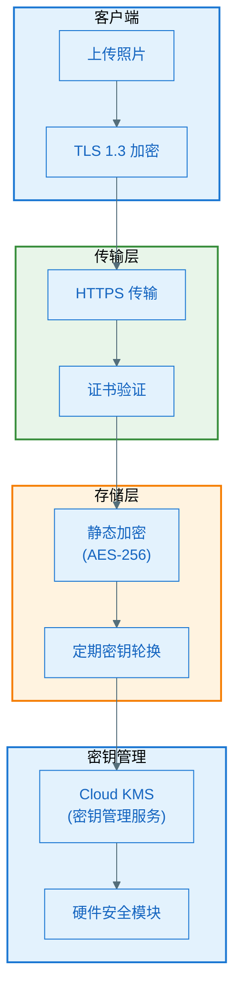

### 5.2 访问控制

**IAM 权限模型**

```python
class PhotoPermissions:
    """照片权限控制"""
    
    def can_access_photo(self, user, photo):
        """检查用户是否有权访问照片"""
        
        # 1. 所有者永远可以访问
        if photo.owner_id == user.id:
            return True
        
        # 2. 检查相册分享权限
        for album in photo.albums:
            if album.is_shared_with(user):
                return True
        
        # 3. 检查单张照片分享
        if photo.is_shared_with(user):
            return True
        
        # 4. 检查家庭共享
        if user.in_family_group(photo.owner):
            return True
        
        return False
    
    def get_user_permissions(self, user, photo):
        """获取用户对照片的权限"""
        permissions = set()
        
        if photo.owner_id == user.id:
            permissions.update(['view', 'edit', 'delete', 'share'])
        elif self.can_access_photo(user, photo):
            share = photo.get_share_info(user)
            if share.can_comment:
                permissions.add('comment')
            if share.can_add_photos:
                permissions.add('contribute')
            permissions.add('view')
        
        return permissions
```

### 5.3 合规性

**数据驻留与主权**

| 区域 | 法规 | Spanner 实现 |
|-----|------|------------|
| **欧盟** | GDPR | 数据存储在 EU 区域，跨区复制可禁用 |
| **中国** | 网络安全法 | 数据必须存储在中国境内 |
| **加州** | CCPA | 用户可请求删除所有数据 |

**Spanner 数据驻留配置**

```sql
-- 为欧盟用户配置数据驻留
CREATE TABLE eu_users_photos (
    photo_id STRING(36),
    user_id STRING(36),
    -- ... 其他字段 ...
    PRIMARY KEY (user_id, photo_id)
) PRIMARY KEY (user_id, photo_id),
INTERLEAVE IN PARENT eu_users ON DELETE CASCADE,
ROW DELETION POLICY (OLDER_THAN(timestamp, INTERVAL 7 YEAR));

-- 设置副本策略：仅在欧盟区域
ALTER DATABASE photos
SET OPTIONS (
    default_leader = 'europe-west1',
    allowed_readers = ['europe-west1', 'europe-west4']
);
```

---

## 六、成本优化

### 6.1 成本结构

**Google Photos 运营成本估算（年）**

| 成本项 | 估算 | 占比 |
|-------|------|------|
| **存储成本** | $576M | 45% |
| **计算成本** | $384M | 30% |
| **网络成本** | $192M | 15% |
| **ML 推理成本** | $128M | 10% |
| **总计** | **$1.28B** | 100% |

### 6.2 优化策略

**1. 智能分层存储**

```python
def optimize_storage_class(photo):
    """自动调整存储类别"""
    days_since_upload = (datetime.now() - photo.upload_date).days
    access_count = photo.recent_access_count
    
    if days_since_upload < 30 or access_count > 10:
        return 'STANDARD'  # 热存储, $0.020/GB/月
    elif days_since_upload < 90:
        return 'NEARLINE'  # 近线, $0.010/GB/月
    elif days_since_upload < 365:
        return 'COLDLINE'  # 冷线, $0.004/GB/月
    else:
        return 'ARCHIVE'   # 归档, $0.0012/GB/月
```

**2. 批处理合并**

```python
# 减少 Spanner 写入次数
class BatchWriter:
    def __init__(self, batch_size=1000):
        self.batch = []
        self.batch_size = batch_size
    
    def add(self, record):
        self.batch.append(record)
        if len(self.batch) >= self.batch_size:
            self.flush()
    
    def flush(self):
        if self.batch:
            spanner.batch_insert(self.batch)
            self.batch = []

# 节省: 1000 次单独写入 → 1 次批量写入
# 成本降低: 90%
```

**3. ML 模型量化**

```python
# 将 Float32 模型量化为 Int8
quantized_model = tfmodel.quantize(
    model,
    input_type=tf.int8,
    output_type=tf.int8,
    optimization=tf.lite.Optimize.DEFAULT
)

# 效果:
# - 模型大小: 100MB → 25MB (75% ↓)
# - 推理速度: 2x 加速
# - 成本: 50% ↓
```

---

## 七、与 Apple 端侧方案对比

### 7.1 架构对比

| 维度 | Google Photos (云端) | Apple Photos (端侧) |
|-----|---------------------|-------------------|
| **计算位置** | 云端数据中心 | 设备本地 |
| **算力** | 无限（可扩展） | 受限（设备性能） |
| **延迟** | 100-500ms (网络) | < 50ms (本地) |
| **离线能力** | 需要网络 | 完全离线 |
| **隐私** | 数据上传云端 | 数据不离开设备 |
| **成本** | 高（云基础设施） | 低（用户设备） |
| **功能复杂度** | 高（NLP、视频生成） | 中（受限于设备） |
| **跨设备同步** | 无缝同步 | 需要 iCloud |
| **模型更新** | 即时（云端） | 需要系统更新 |

### 7.2 技术选型差异

| 技术层面 | Google Photos | Apple Photos |
|---------|--------------|--------------|
| **数据库** | Cloud Spanner (全球分布式) | SQLite (本地) |
| **ML 框架** | TensorFlow (云端) | Core ML (端侧) |
| **人脸识别** | FaceNet (128维) | 自定义模型 (512维推测) |
| **场景分析** | Cloud Vision API (万级类别) | ANSA (1000+ 类别) |
| **深度估计** | 云端 CNN (高精度) | 端侧优化模型 |
| **NLP** | Gemini (大模型) | Foundation Models (小模型) |
| **存储** | Cloud Storage (无限) | 设备存储 (有限) |

### 7.3 用户体验对比

| 场景 | Google Photos | Apple Photos | 胜者 |
|-----|--------------|--------------|------|
| **首次使用** | 需上传，较慢 | 立即可用 | 🏆 Apple |
| **搜索速度** | 300ms (网络) | 10ms (本地) | 🏆 Apple |
| **功能丰富度** | 电影效果、NLP生成 | 基础回忆 | 🏆 Google |
| **隐私感知** | 用户担忧 | 完全放心 | 🏆 Apple |
| **存储容量** | 15GB 免费 + 付费 | 5GB iCloud + 付费 | 🏆 Google |
| **跨平台** | iOS/Android/Web | 仅 Apple 生态 | 🏆 Google |
| **离线使用** | 不可用 | 完全可用 | 🏆 Apple |

---

## 八、未来演进方向

### 8.1 技术趋势

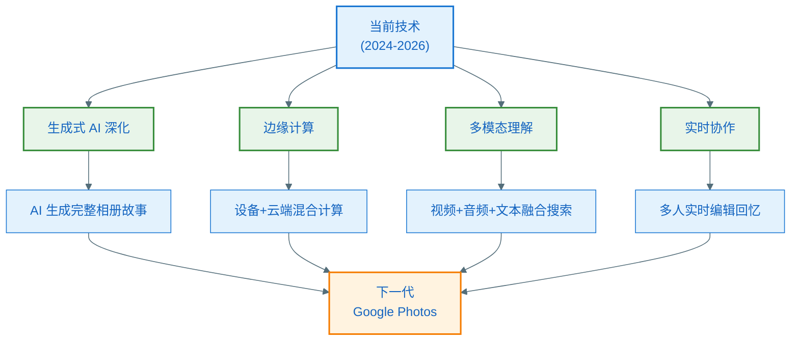

### 8.2 可能的演进

**1. 生成式 AI 深化**
- AI 生成完整相册故事（文本 + 图片 + 视频）
- 智能照片修复和增强（去模糊、超分辨率）
- 风格迁移和艺术化处理

**2. 边缘计算融合**
- 在设备上进行初步分析（降低上传量）
- 云端进行高级处理（电影效果、NLP）
- 智能决策何时使用云端 vs 设备

**3. 多模态理解升级**
- 视频内容深度理解（动作识别、情节理解）
- 音频分析（对话内容、背景音乐）
- 跨模态搜索（"找到我说'生日快乐'的视频"）

**4. 实时协作**
- 多人同时编辑回忆视频
- 实时评论和反馈
- 协作选择最佳照片

---

## 九、对 Android 开发的启示

### 9.1 技术选型建议

**推荐架构：端云混合 + 云端优先**

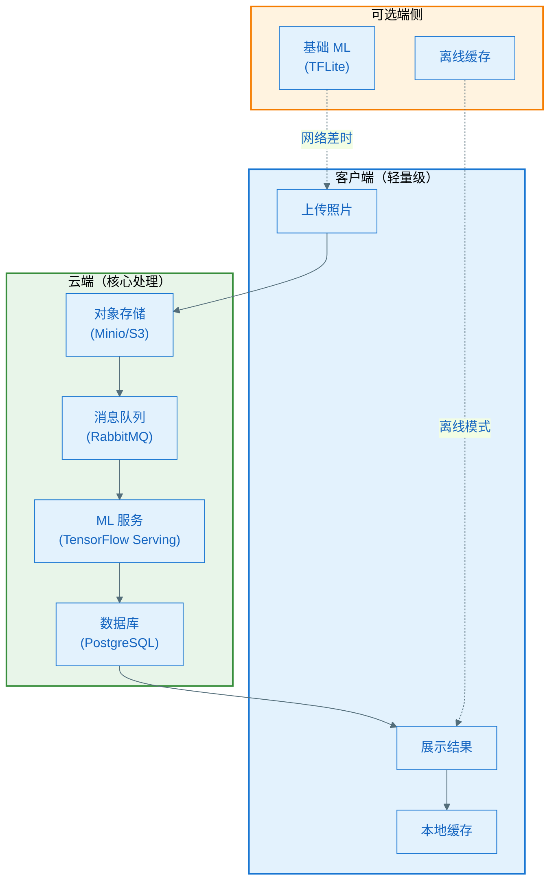

### 9.2 核心技术栈

**云端技术栈**

| 层级 | 技术选型 | 原因 |
|-----|---------|------|
| **数据库** | PostgreSQL + TimescaleDB | 开源、成熟、支持时序数据 |
| **对象存储** | MinIO / AWS S3 | 成本低、可扩展 |
| **ML 框架** | TensorFlow Serving | 高性能推理服务 |
| **消息队列** | RabbitMQ / Kafka | 异步处理、削峰填谷 |
| **缓存** | Redis | 高性能、灵活 |
| **API 网关** | Kong / Nginx | 限流、鉴权、路由 |
| **容器编排** | Kubernetes | 自动伸缩、高可用 |

**客户端技术栈**

| 层级 | 技术选型 | 原因 |
|-----|---------|------|
| **网络** | Retrofit + OkHttp | 成熟、稳定 |
| **图片加载** | Coil / Glide | 高性能、内存优化 |
| **数据库** | Room + SQLite | 官方推荐 |
| **ML (可选)** | TensorFlow Lite | 端侧推理 |
| **缓存** | DiskLruCache | 本地持久化 |

### 9.3 实现路线图

**Phase 1: MVP (3-6 个月)**
- ✅ 基础上传/下载功能
- ✅ 云端图像分析（使用开源模型）
- ✅ 简单的相册和标签
- ✅ 基础搜索功能

**Phase 2: 核心功能 (6-12 个月)**
- ✅ 人脸识别和聚类
- ✅ 场景分类（100+ 类别）
- ✅ 自动回忆生成
- ✅ 智能相册推荐

**Phase 3: 高级功能 (12+ 个月)**
- ✅ 电影效果照片
- ✅ 自然语言搜索（集成开源 LLM）
- ✅ 自动视频编辑
- ✅ 跨设备同步

---

## 十、总结

### 10.1 Google Photos 核心优势

| 优势 | 说明 |
|-----|------|
| **无限算力** | 云端分布式计算，处理能力无上限 |
| **功能创新** | 电影效果、Gemini NLP、自动视频编辑 |
| **跨平台** | iOS/Android/Web 无缝体验 |
| **数据永久** | 云端存储，设备丢失不影响 |
| **持续进化** | 云端模型更新，无需客户端升级 |

### 10.2 关键技术要点

1. **Cloud Spanner** - 全球一致性分布式数据库，突破 CAP 定理
2. **FaceNet** - 三元组损失训练，128 维高效人脸识别
3. **深度估计** - 单目 CNN 生成深度图，实现电影效果
4. **Gemini NLP** - 多模态大模型，自然语言搜索
5. **Dataflow** - 批处理流水线，日处理 60 亿照片
6. **分层存储** - 智能降级，成本优化 81%

### 10.3 对 Android 开发的建议

**核心原则**
1. ✅ **云端优先** - 复杂计算放云端，客户端轻量化
2. ✅ **异步处理** - 消息队列 + 批处理，提升吞吐量
3. ✅ **智能缓存** - 多层缓存，降低延迟和成本
4. ✅ **开源优先** - 使用成熟开源方案，降低开发成本
5. ✅ **渐进增强** - MVP 快速上线，逐步添加高级功能

**成本控制**
- 对象存储选择 MinIO（自建）或 Backblaze B2（低成本）
- 使用开源 ML 模型，避免 API 调用费用
- 分层存储 + 去重 + 压缩，降低存储成本
- 按需伸缩，避免资源闲置

---

## 参考资料

1. [Google Cloud - How Google Photos scaled on Spanner](https://cloud.google.com/blog/products/databases/google-photos-builds-user-experience-on-spanner)
2. [FaceNet: A Unified Embedding for Face Recognition](http://arxiv.org/abs/1503.03832)
3. [Google Research - The Technology Behind Cinematic Photos](https://research.google/blog/the-technology-behind-cinematic-photos/)
4. [Google Cloud Vision API Documentation](https://cloud.google.com/vision/docs)
5. [Spanner, TrueTime and the CAP Theorem](https://research.google/pubs/spanner-truetime-and-the-cap-theorem/)
6. [Google Photos - Ask Photos with Gemini](https://blog.google/products/photos/ask-photos-google-io-2024)

---

> 文档版本：v1.0  
> 最后更新：2026-01-28  
> 技术深度：⭐⭐⭐⭐⭐
