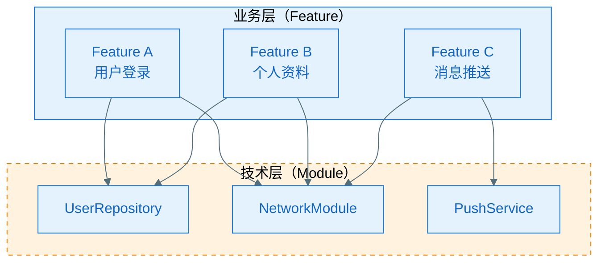
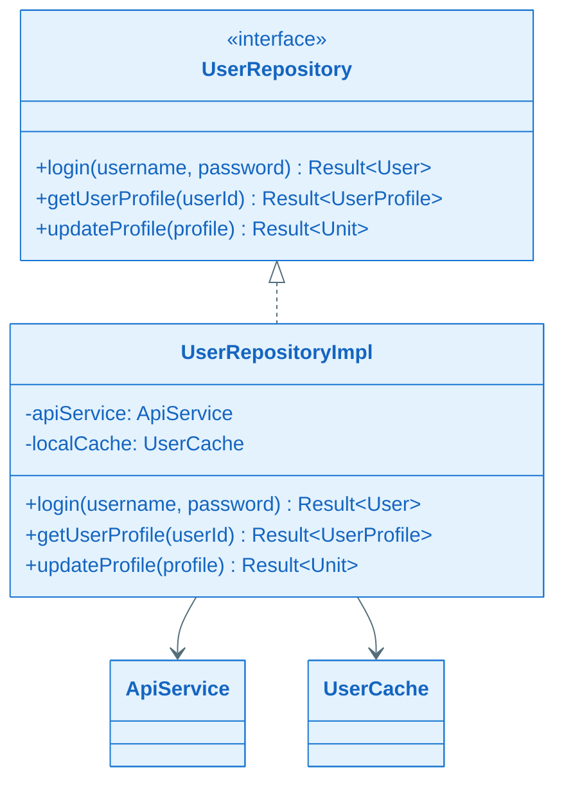
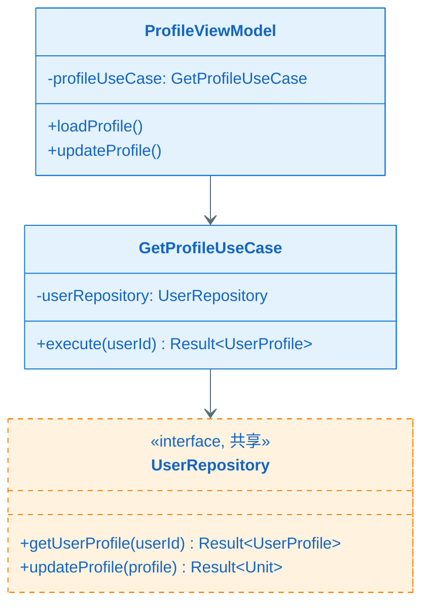
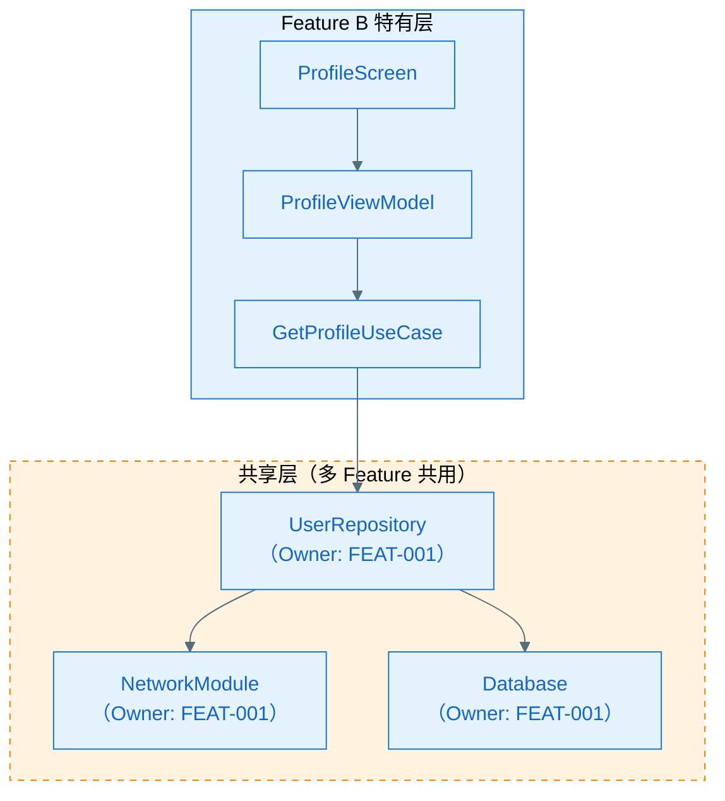
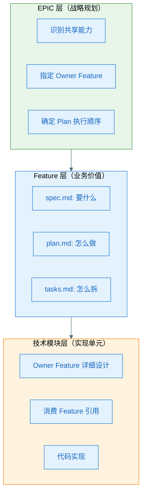
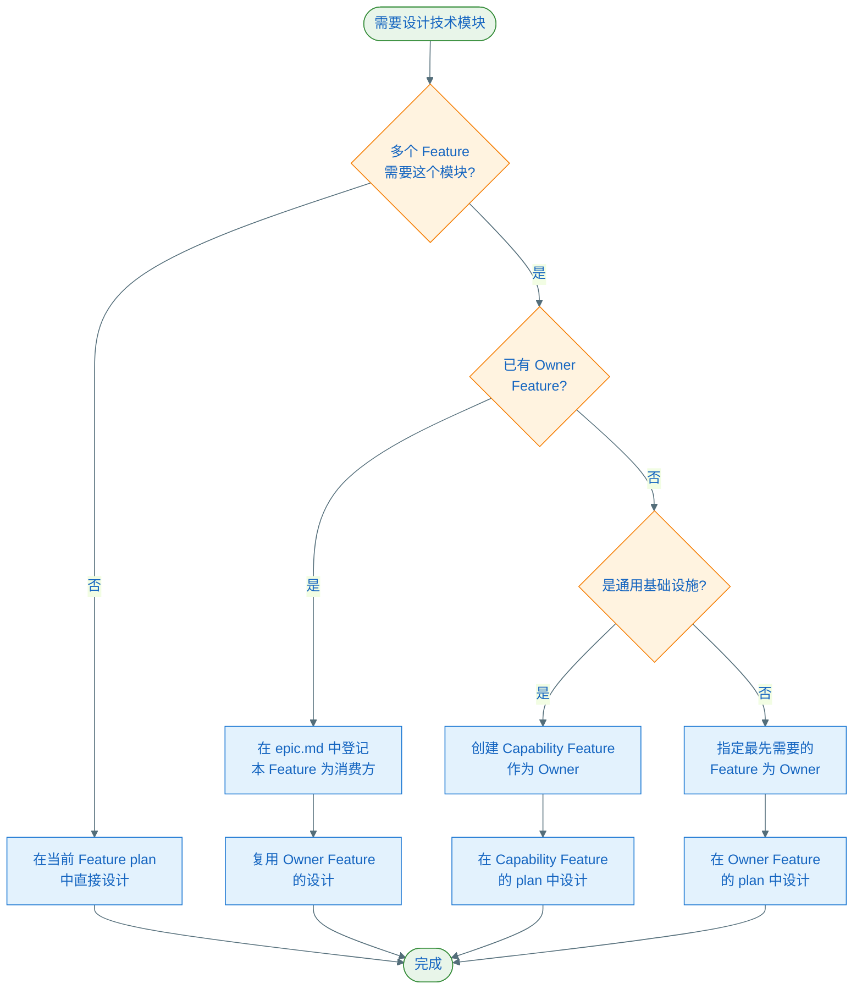

# Feature 业务功能与技术模块关系指南

本文档系统性地说明 **Feature（业务功能）** 与 **技术模块（Technical Module）** 之间的关系，以及在 Speckit 文档体系中如何正确处理它们。

> **适用场景**：当多个 Feature 需要共享底层技术模块时，如何避免重复设计、如何在架构图中表达、如何在文档中体现。

---

## 1. 核心概念区分

### 1.1 Feature（业务功能）= 用户价值单元

**定义**：面向用户的、可独立交付的业务能力

**特征**：
- 有明确的用户场景和验收标准（AC）
- 可独立测试、独立上线、独立回滚
- 文档产物：`spec.md`（要什么）+ `plan.md`（怎么做）+ `tasks.md`（怎么拆）

**示例**：
- Feature A：用户登录
- Feature B：个人资料编辑
- Feature C：消息推送

### 1.2 技术模块（Technical Module）= 技术实现单元

**定义**：为实现业务功能提供技术支撑的代码组件

**特征**：
- 无独立用户价值（不能单独交付给用户）
- 可被多个 Feature 复用
- 文档位置：在 Owner Feature 的 `plan.md` 中设计

**示例**：
- 技术模块 1：`UserRepository`（数据访问层）
- 技术模块 2：`NetworkModule`（网络请求封装）
- 技术模块 3：`ThemeEngine`（主题系统）

---

## 2. 关系模型：Feature 使用技术模块

### 2.1 一对多关系



**关键点**：
- **1 个 Feature 可以使用多个技术模块**
- **1 个技术模块可以被多个 Feature 共用**
- 技术模块没有独立的 `spec.md`（因为它们不是用户功能）

### 2.2 Owner Feature 机制（避免重复设计）

#### 问题场景

假设场景：
- Feature A（用户登录）需要 `UserRepository`
- Feature B（个人资料）也需要 `UserRepository`

**错误做法**：❌ A 和 B 各自设计一套 `UserRepository`

**正确做法**：✅ 指定 Feature A 为 Owner，B 复用 A 的设计

#### Owner 机制在文档中的体现

**在 `epic.md` 的"跨 Feature 技术策略"中登记**：

```markdown
## 跨 Feature 技术策略

### 共享技术能力清单

| 共享能力 | Owner Feature | 消费方 Feature | 设计位置 |
|---|---|---|---|
| UserRepository | FEAT-001（登录） | FEAT-002（资料）, FEAT-003（设置） | FEAT-001/plan.md:A3.4 |
| NetworkModule | FEAT-001（登录） | FEAT-002, FEAT-003, FEAT-004 | FEAT-001/plan.md:A3.4 |
| ThemeEngine | FEAT-002（资料） | FEAT-003 | FEAT-002/plan.md:A3.4 |

### Plan 执行顺序

1. **Phase 1（基础能力）**：FEAT-001（登录）— 提供 UserRepository、NetworkModule
2. **Phase 2（依赖 Phase 1）**：FEAT-002（资料）、FEAT-003（设置）
```

---

## 3. 在 Plan 文档中的处理方式

### 3.1 Owner Feature 的 plan.md（详细设计）

**Feature A（登录）的 `plan.md`**：

````markdown
## A3.4 组件详细设计

### UserRepository（共享模块，本 Feature 为 Owner）

#### 基本信息
- **共享范围**：FEAT-001（登录）、FEAT-002（资料）、FEAT-003（设置）
- **责任**：统一用户数据访问接口，封装 API 调用和本地缓存
- **位置**：`data/repository/UserRepository.kt`

#### 接口设计（供消费方 Feature 引用）

```kotlin
interface UserRepository {
    suspend fun login(username: String, password: String): Result<User>
    suspend fun getUserProfile(userId: String): Result<UserProfile>
    suspend fun updateProfile(profile: UserProfile): Result<Unit>
}
```

#### 类图



#### 失败模式与降级策略
- **网络失败**：返回缓存数据（如果可用）
- **缓存失败**：降级为仅网络模式
- **验证失败**：返回明确的错误码
````

### 3.2 消费方 Feature 的 plan.md（引用设计）

**Feature B（个人资料）的 `plan.md`**：

````markdown
## Plan 前置检查

### 依赖的共享能力（从其他 Feature 复用）

| 依赖的共享能力 | Owner Feature | Owner Plan 状态 | 如何获取/引用 |
|---|---|---|---|
| UserRepository | FEAT-001（登录） | Plan Ready | 引用 FEAT-001/plan.md:A3.4:UserRepository |
| NetworkModule | FEAT-001（登录） | Plan Ready | 引用 FEAT-001/plan.md:A3.4:NetworkModule |

---

## A3.2 全局类图



**架构图说明**：
- 本 Feature 只设计 `ProfileViewModel` 和 `GetProfileUseCase`
- `UserRepository` 由 FEAT-001 设计，本 Feature 直接复用
- 用虚线框 + 橙色标注"共享"，避免读者误以为是本 Feature 的设计
````

---

## 4. 架构图中的标注约定

### 4.1 视觉标识规则

#### ✅ 推荐标注方式

**1. 颜色区分**：
- **特有组件**：蓝色（`#E3F2FD`, `#1976D2`）
- **共享组件**：橙色（`#FFF3E0`, `#F57C00`）+ 虚线框

**2. 文字说明**：
- 在组件名后加标注：`UserRepository（共享，Owner: FEAT-001）`
- 或使用 Mermaid 注释：`<<interface, 共享>>`

**3. 图例说明**：

```markdown
**架构图图例**：
- 🔵 蓝色实线框：本 Feature 设计的组件
- 🟠 橙色虚线框：共享组件（由其他 Feature 设计）
```

### 4.2 分层架构图示例



---

## 5. 实践中的处理原则

### 5.1 技术模块的归属规则

| 场景 | Owner Feature 选择 | 理由 |
|---|---|---|
| 多个 Feature 都需要某能力 | **最先需要的 Feature** | 按自然依赖顺序，避免循环依赖 |
| 某能力是某 Feature 的核心价值 | **该 Feature** | 如"主题切换" Feature 拥有 ThemeEngine |
| 某能力是通用基础设施 | **创建独立的 Capability Feature** | 如"埋点框架"可以是 FEAT-000（基础能力） |

### 5.2 Plan 执行顺序规则

**硬规则**：
1. **Owner Feature 必须先完成 plan**，消费方 Feature 才能开始
2. 在开始每个 Feature plan 之前，必须完成 `plan.md` 中的"Plan 前置检查"
3. 若发现新的共享需求，必须先更新 `epic.md` 的"跨 Feature 技术策略"

**示例**：

```text
依赖关系：
- FEAT-001（登录）提供 UserRepository、NetworkModule
- FEAT-002（资料）依赖 FEAT-001 的共享模块
- FEAT-003（设置）依赖 FEAT-001 的共享模块

执行顺序：
1. Phase 1：FEAT-001 完成 plan（设计共享模块）
2. Phase 2：FEAT-002 和 FEAT-003 并行开始 plan（引用共享模块）
```

### 5.3 "Capability Feature"模式（可选）

当某技术模块过于通用（如日志、监控、网络层），可以创建专门的 Capability Feature：

```text
EPIC-001（用户系统）
├── FEAT-000-infrastructure（基础设施 Feature，Capability 类型）
│   ├── spec.md（描述要提供的技术能力，AC 是接口契约）
│   ├── plan.md（设计 NetworkModule、LogModule 等）
│   └── tasks.md
├── FEAT-001-login（业务 Feature，依赖 FEAT-000）
├── FEAT-002-profile（业务 Feature，依赖 FEAT-000）
```

**Capability Feature 的特点**：
- 有 `spec.md`，但 AC 是"提供稳定的技术接口"而非用户功能
- 优先级通常最高（其他 Feature 依赖它）
- 在 `epic.md` 中明确标注为"技术支撑 Feature"

---

## 6. 常见错误与避免方法

### ❌ 错误 1：Feature 等价于技术模块

**错误思路**：
- "Feature A 就是 UserRepository"
- "每个技术模块都创建一个 Feature"

**问题**：
- 丢失了用户价值视角
- 无法独立交付和验收

**正确做法**：
- Feature 必须面向用户价值（如"用户登录功能"）
- 技术模块是实现手段，在 Feature 的 plan 中设计

---

### ❌ 错误 2：每个 Feature 都重复设计相同模块

**错误做法**：
- Feature A 的 plan 里设计一套 `NetworkModule`
- Feature B 的 plan 里又设计一套 `NetworkModule`

**问题**：
- 重复设计成本高
- 实现时产生不一致
- 维护成本爆炸

**正确做法**：
- 在 `epic.md` 中识别共享能力
- 指定 Owner Feature 统一设计
- 其他 Feature 引用复用

---

### ❌ 错误 3：共享模块没有明确 Owner

**错误表现**：
- 多个 Feature 都说"我用 UserRepository"
- 但没人负责设计和维护它

**问题**：
- 接口演进无主导
- 变更时相互扯皮

**正确做法**：
- 在 `epic.md` 明确登记 Owner Feature
- Owner Feature 负责设计、维护和演进
- 变更接口时，Owner Feature 负责评估影响

---

### ❌ 错误 4：消费方 Feature 不标注共享组件

**错误做法**：
- Feature B 的架构图中画了 `UserRepository`
- 但没有标注它是共享组件
- 读者误以为是 Feature B 自己设计的

**问题**：
- 文档阅读者困惑
- 维护时不知道该改哪个 Feature 的 plan

**正确做法**：
- 用虚线框 + 橙色标注共享组件
- 在组件名后标注 Owner Feature
- 在"Plan 前置检查"中列出依赖清单

---

## 7. 总结：三层理解模型



### 关键原则

1. **Feature 是产品视角**：面向用户价值，有独立的 spec（验收标准）
2. **技术模块是实现视角**：在 Owner Feature 的 plan 中设计，供多个 Feature 复用
3. **EPIC 级统筹**：在 `epic.md` 中规划共享策略，避免重复和冲突
4. **Owner 机制**：每个共享模块必须有明确的 Owner Feature 负责设计和演进
5. **文档自包含**：每个 Feature 的 plan 都画完整架构图，用标注区分"特有"和"共享"

---

## 8. 快速决策流程图



---

## 9. 相关文档

- **Speckit 最佳实践**：`docs/speckit-best-practices.md`
- **工作流治理**：`docs/speckit-workflow-governance.md`
- **Plan 模板**：`.specify/templates/plan-template.md`
- **Epic 模板**：`.specify/templates/epic-template.md`
- **Mermaid 样式规范**：`.cursor/rules/mermaid-style-guide.mdc`

---

## 10. 常见问题 FAQ

### Q1: 如果 Owner Feature 的 plan 还没完成，消费方 Feature 怎么办？

**答**：有两种处理方式：

1. **等待**：Owner Feature 完成 plan 后再继续本 Feature
2. **协商**：与 Owner Feature 负责人协商接口契约，先行设计（风险：接口可能变化）

在 `plan.md` 的"Plan 前置检查"中记录依赖状态。

### Q2: 多个 Feature 都想成为某个模块的 Owner 怎么办？

**答**：在 `epic.md` 的"跨 Feature 技术策略"评审时明确：

- **按自然依赖顺序**：谁最先需要谁就是 Owner
- **按核心价值**：如果某模块是某 Feature 的核心能力，由该 Feature 拥有
- **创建 Capability Feature**：如果争议大，提升为独立的基础能力 Feature

### Q3: 共享模块的接口需要变更怎么办？

**答**：由 Owner Feature 主导：

1. Owner Feature 发起 CR（Change Request）
2. 评估对所有消费方 Feature 的影响
3. 更新 Owner Feature 的 `plan.md`（提升版本）
4. 通知所有消费方 Feature 更新引用
5. 按依赖顺序实施变更

### Q4: 架构图中共享层和特有层如何区分？

**答**：使用视觉标识：

- **特有层**：蓝色实线框（`#E3F2FD`, `#1976D2`）
- **共享层**：橙色虚线框（`#FFF3E0`, `#F57C00`, `stroke-dasharray: 5 5`）
- **文字标注**：`UserRepository（共享，Owner: FEAT-001）`
- **添加图例**：在架构图下方说明颜色含义

### Q5: Capability Feature 什么时候创建？

**答**：满足以下条件时考虑创建：

- **通用性强**：被 3 个以上 Feature 使用
- **基础设施**：如网络层、日志、监控、埋点
- **独立演进**：有独立的技术演进路线
- **避免争议**：多个 Feature 都想要 Owner 权限

---

**文档版本**：v1.0.0  
**最后更新**：2026-01-28  
**维护者**：Speckit Team
