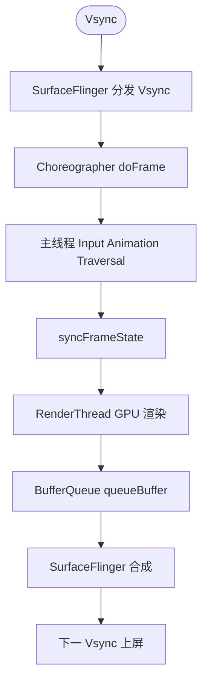

# Android 图形绘制系统 · 学习地图

> 版本：2026-03
> 适用深度：系统深入
> 预计总学时：40~60 小时（视基础而定）

---

## 1. 这个领域在学什么

Android 图形绘制系统回答一个核心问题：**一个像素，是怎么从代码走到屏幕的？**

具体包括四个层次的问题：

1. **应用层**：View/Compose 如何描述"要画什么"——测量、布局、绘制、硬件加速
2. **同步层**：Vsync 信号如何让应用和硬件节拍一致——Choreographer、帧调度
3. **渲染层**：绘制指令如何被 GPU 执行——RenderThread、DisplayList、OpenGL ES / Vulkan / Skia
4. **合成层**：多个 Surface 如何被合成显示到屏幕——SurfaceFlinger、BufferQueue、HWC

---

## 2. 为什么值得学

| 场景 | 没学这块的困境 | 学完后的能力 |
|------|-------------|------------|
| 排查卡顿/掉帧 | 只知道"主线程太忙"，无法精确定位 | 能用 Perfetto 看 Vsync/帧边界，定位是 measure/layout/draw/sync 哪步超时 |
| 自定义 View | draw() 里随意操作，不知道为什么会触发全量重绘 | 能设计最小 dirty region，理解 invalidate 的传播链 |
| 动画卡顿 | 不知道属性动画和帧动画的底层区别 | 能判断动画是在 UI 线程还是 RenderThread 执行 |
| HDR/色彩管理 | 不知道为什么图片颜色不对 | 理解 Surface 的色彩空间和 BufferQueue 的颜色格式协商 |
| 理解 Compose | Recomposition 太频繁但不知道为什么 | 理解 Compose 的 DrawLayer 和 RenderNode 机制 |
| 系统稳定性 | SurfaceFlinger 崩溃看不懂 | 能读懂 BufferQueue 相关的错误日志 |

---

## 3. 适合什么目标的人学习

- **入门合适**：已有 1 年以上 Android 开发经验，了解 View 体系基础，有过卡顿问题困扰的开发者
- **特别适合**：性能优化工程师、自定义 View / 动画开发者、想读图形相关源码的工程师
- **不太适合**：刚入门 Android，还在学四大组件的开发者（建议先补 View 基础）

---

## 4. 前置知识

学习图形系统前，建议先掌握：

| 前置知识 | 说明 | 掌握程度要求 |
|---------|------|------------|
| Android 线程模型 | 知道主线程/工作线程，知道 Handler/Looper | 能用就行 |
| View 基础 | 知道 View.onDraw()、Canvas、Paint | 写过自定义 View |
| 应用生命周期 | Activity/Window 的基本概念 | 了解即可 |
| JNI 基础 | 知道 Java/Native 边界（不需要会写） | 了解即可 |
| Linux 基础 | 知道文件描述符、共享内存、进程 | 了解即可 |

---

## 5. 领域知识树

```
Android 图形绘制系统
│
├── 【A】View 绘制体系（应用层）
│   ├── A1  measure / layout / draw 三步曲
│   ├── A2  invalidate / requestLayout 的触发与传播
│   ├── A3  硬件加速：DisplayList / RenderNode
│   └── A4  Canvas / Paint / Shader / Bitmap
│
├── 【B】帧调度体系（同步层）
│   ├── B1  Vsync 信号机制
│   ├── B2  Choreographer：帧节拍的指挥者
│   ├── B3  帧回调链：Input → Animation → Traversal
│   └── B4  FrameMetrics：帧耗时分析
│
├── 【C】渲染执行体系（渲染层）
│   ├── C1  RenderThread：独立于主线程的渲染线程
│   ├── C2  DisplayList 录制与回放
│   ├── C3  HWUI：Android 的 2D 渲染引擎
│   ├── C4  Skia：向量图形库
│   └── C5  OpenGL ES / Vulkan：GPU 执行层
│
├── 【D】Surface 与 Buffer 体系（合成层）
│   ├── D1  Surface / SurfaceHolder / SurfaceView
│   ├── D2  BufferQueue：生产者-消费者模型
│   ├── D3  SurfaceFlinger：系统合成器
│   ├── D4  HWC（Hardware Composer）：硬件合成
│   └── D5  显示管线：从 SurfaceFlinger 到屏幕
│
├── 【E】Compose 绘制体系（现代 UI 层）
│   ├── E1  Compose 的绘制模型与 RenderNode
│   ├── E2  Modifier.drawBehind / Canvas 操作
│   └── E3  Compose 动画与帧调度
│
└── 【F】调试与性能工具
    ├── F1  Perfetto：图形相关 trace 分析
    ├── F2  GPU Rendering Profile：过度绘制可视化
    ├── F3  FrameMetrics API
    └── F4  SurfaceFlinger dumpsys
```

---

## 6. 推荐学习路径

### 路径一：理解全链路（推荐大多数人）

```
A1（View绘制三步曲）
  → B1（Vsync）→ B2（Choreographer）
    → C1（RenderThread）→ C2（DisplayList）
      → D2（BufferQueue）→ D3（SurfaceFlinger）
        → F1（Perfetto 验证）
```

> 适合：想完整理解"一帧是怎么画出来的"的工程师
> 学完收益：能看懂 Perfetto 的图形 trace，能定位卡顿原因

---

### 路径二：性能优化方向

```
A1 → A2（invalidate/requestLayout）→ A3（硬件加速）
  → B2（Choreographer）→ B4（FrameMetrics）
    → C1（RenderThread）→ F1（Perfetto）→ F2（过度绘制）
```

> 适合：正在做性能优化的工程师
> 学完收益：能系统排查卡顿、掉帧、过度绘制问题

---

### 路径三：自定义 View 深入

```
A1 → A4（Canvas/Paint）→ A3（硬件加速限制）
  → A2（invalidate 机制）→ B2（Choreographer）→ C2（DisplayList）
```

> 适合：做复杂自定义 View / 动画的工程师
> 学完收益：能写高性能自定义 View，理解 Canvas 操作的性能边界

---

### 路径四：Compose 方向

```
A1（先了解 View 绘制基础）→ B2（Choreographer）→ C1（RenderThread）
  → E1（Compose 绘制模型）→ E2（Compose Canvas）→ E3（Compose 动画）
```

> 适合：主要用 Compose 开发，想理解其底层原理的工程师

---

### 路径五：源码阅读方向

```
A1 → B2 → C1 → D2 → D3
  （每个主题都深入源码层）
  → 配合 AOSP 源码阅读
```

> 适合：想读 AOSP 图形相关源码的工程师

---

## 7. 子主题标记表

| 子主题 | 简码 | 难度 | 优先级 | 适合目标 | 前置知识 | 可跳过？ | 学完收益 |
|--------|------|------|--------|----------|----------|---------|---------|
| View 绘制三步曲 | A1 | 入门 | ⭐ 建议优先 | 所有人 | 写过自定义 View | 否 | 理解 measure/layout/draw 的触发与执行 |
| invalidate / requestLayout | A2 | 入门 | ⭐ 建议优先 | 所有人 | A1 | 否 | 能写高效的 View 更新逻辑 |
| 硬件加速 / DisplayList / RenderNode | A3 | 进阶 | ⭐ 建议优先 | 性能优化 | A1、A2 | 否 | 理解为什么某些 Canvas 操作在硬件加速下不支持 |
| Canvas / Paint / Shader | A4 | 入门 | 按需 | 自定义 View | A1 | 部分可跳过 | 能写出各种绘制效果 |
| Vsync 信号机制 | B1 | 进阶 | ⭐ 建议优先 | 性能优化 | 无 | 否 | 理解帧率与刷新率的关系 |
| Choreographer | B2 | 进阶 | ⭐ 建议优先 | 所有人 | B1 | 否 | 理解帧调度核心，能自己监控帧率 |
| 帧回调链 | B3 | 进阶 | 按需 | 性能深入 | B2 | 部分可跳过 | 理解 Input/Animation/Traversal 优先级 |
| FrameMetrics | B4 | 进阶 | 按需 | 性能监控 | B2 | 可跳过 | 能用 API 上报真实帧耗时 |
| RenderThread | C1 | 深入 | ⭐ 建议优先 | 性能深入 | A3、B2 | 否 | 理解渲染与主线程的解耦机制 |
| DisplayList 录制与回放 | C2 | 深入 | ⭐ 建议优先 | 性能深入 | A3、C1 | 否 | 理解为什么硬件加速能提升性能 |
| HWUI | C3 | 深入 | 按需 | 源码阅读 | C1、C2 | 可跳过（应用开发不需要深入） | 了解 Android 2D 渲染引擎内部 |
| Skia | C4 | 深入 | 可后置 | 图形引擎 | C3 | 可跳过 | 了解底层向量图形库 |
| OpenGL ES / Vulkan | C5 | 深入 | 可后置 | 图形/游戏 | C3 | 可跳过（非游戏开发可后置） | 能直接操作 GPU 绘制 |
| Surface / SurfaceView | D1 | 进阶 | ⭐ 建议优先 | 媒体/游戏 | A1、C1 | 按需 | 理解 Surface 的本质，能用 SurfaceView 做视频渲染 |
| BufferQueue | D2 | 深入 | ⭐ 建议优先 | 性能深入 | D1 | 否 | 理解生产者消费者模型，能排查 Buffer 相关的掉帧 |
| SurfaceFlinger | D3 | 深入 | 按需 | 系统/框架 | D2 | 按需 | 理解系统合成机制，能读懂 SurfaceFlinger 日志 |
| HWC（Hardware Composer） | D4 | 深入 | 可后置 | 系统/框架 | D3 | 可跳过 | 了解 GPU 合成与硬件合成的区别 |
| 显示管线 | D5 | 深入 | 可后置 | 系统/框架 | D3、D4 | 可跳过 | 理解帧从 SurfaceFlinger 到屏幕的物理路径 |
| Compose 绘制模型 | E1 | 进阶 | 按需（Compose 用户） | Compose 开发 | A3、B2、C1 | 按需 | 理解 Compose 底层绘制与 View 的关系 |
| Compose Canvas 操作 | E2 | 进阶 | 按需 | Compose 开发 | E1 | 可跳过 | 能在 Compose 中做自定义绘制 |
| Compose 动画与帧调度 | E3 | 进阶 | 按需 | Compose 开发 | E1、B2 | 可跳过 | 理解 Compose 动画的帧调度原理 |
| Perfetto 图形 trace | F1 | 进阶 | ⭐ 建议优先 | 性能优化 | B2、C1 | 否（性能优化必学） | 能用 Perfetto 精确定位图形卡顿 |
| GPU Rendering Profile | F2 | 入门 | 按需 | 日常开发 | A1 | 可跳过 | 快速发现过度绘制 |
| FrameMetrics API | F3 | 进阶 | 按需 | 性能监控 | B2 | 可跳过 | 能在线上采集帧耗时数据 |
| SurfaceFlinger dumpsys | F4 | 深入 | 可后置 | 系统调试 | D3 | 可跳过 | 能从 dumpsys 读出合成信息 |

---

## 8. 一帧的完整旅程（全景速览）

理解整个图形系统最好的方式，是先有一张"一帧是怎么走完的"全景图：



> 更细的时序与分支见 [05-合成与显示：像素上屏全程.md](./05-合成与显示：像素上屏全程.md) 第 6 节。

**协作者与过程说明**

1. **触发与入口**：硬件显示器（或 SurfaceFlinger 内部的软件模拟）产生 Vsync 信号，这是整个帧流水线的节拍器，通常为 60Hz（16.67ms）、90Hz 或 120Hz。
2. **协作链**：Vsync → SurfaceFlinger 内的 EventThread → 通过 Binder/Unix socket 分发给各 App 进程的 Choreographer → 主线程的 doFrame()。
3. **主线程工作**：按固定优先级执行 Input（输入事件）→ Animation（属性动画等）→ Traversal（View 树的 measure/layout/draw），最后通过 DisplayListCanvas 将绘制指令录制为 DisplayList。
4. **主线程→渲染线程同步**：主线程的 draw 完成后，通过 syncFrameState 将 RenderNode 树（包含 DisplayList）同步给 RenderThread，主线程随即可以处理下一帧的事件。
5. **RenderThread 执行**：RenderThread 将 DisplayList 转换为 OpenGL ES（或 Vulkan）命令，从 BufferQueue 取一块 GraphicBuffer，GPU 执行渲染，将结果写回 Buffer，再 queueBuffer 给 SurfaceFlinger。
6. **SurfaceFlinger 合成**：SurfaceFlinger 在下一个 Vsync 到来时，把所有 App 的 Surface Layer 通过 HWC（硬件合成）或 GPU（叠加合成）进行合成，提交给显示控制器。
7. **正常结束**：帧在下一个 Vsync 前完成合成，显示器在新的 Vsync 周期刷新显示内容。
8. **异常分支（掉帧）**：若 RenderThread 在下一个 Vsync 前未能 queueBuffer，SurfaceFlinger 没有新帧可用，显示器会重复上一帧，导致掉帧（Jank）。

---

## 9. 各主题解决什么问题

| 子主题 | 典型疑问/场景 | 学完能解决 |
|--------|-------------|----------|
| A1 View三步曲 | "为什么我调用 invalidate 之后有时候没有立即刷新？" | 理解绘制的触发时机与流程 |
| A2 invalidate机制 | "requestLayout 和 invalidate 什么时候用哪个？" | 精确控制 View 更新范围 |
| A3 硬件加速 | "为什么某些 Canvas 操作没有效果？" | 理解硬件加速的支持限制 |
| B2 Choreographer | "如何在应用层精确监控每一帧的耗时？" | 自己实现帧率监控工具 |
| C1 RenderThread | "为什么主线程不阻塞，画面还是会掉帧？" | 理解渲染线程的工作范围 |
| D2 BufferQueue | "视频播放时为什么会出现画面撕裂？" | 理解双/三缓冲机制 |
| D3 SurfaceFlinger | "为什么透明窗口比不透明的性能差？" | 理解 Layer 合成的性能开销 |
| F1 Perfetto | "Perfetto 的图形 trace 里那么多 slice，怎么看？" | 能定位到具体是哪个环节慢 |

---

## 10. 建议先学的 3 个子主题

根据"理解全链路"路径，建议从以下 3 个子主题开始：

### ① A1 + A2：View 绘制三步曲 + invalidate 机制
- **为什么先学这个**：这是最靠近应用开发者的一层，有直接的开发经验可以激活认知
- **适合目标**：所有人
- **学完后**：能准确理解每次绘制的触发原因，写出更高效的 View 更新逻辑

### ② B2：Choreographer
- **为什么接着学这个**：它是整个帧调度的入口，学完后可以自己实现帧率监控，也是后续理解 RenderThread 的基础
- **适合目标**：所有人
- **学完后**：能理解一帧的时间边界是从哪里开始、到哪里结束

### ③ C1 + D2：RenderThread + BufferQueue
- **为什么第三个学这个**：理解了前两步后，这里补全"谁真正执行了 GPU 渲染"和"渲染结果如何传递给 SurfaceFlinger"
- **适合目标**：性能优化、想理解全链路的工程师
- **学完后**：能在 Perfetto 里看懂 RenderThread 的 trace，理解 Buffer 相关的掉帧原因

---

## 11. 下一步

**请告诉我你想从哪个子主题开始，或者选择一条学习路径：**

- 输入 `A1` 或 "View 绘制三步曲"，进入该主题的问题前置环节，再生成深度学习包
- 输入 `B2` 或 "Choreographer"，同上
- 输入 `全链路`，按"路径一"顺序生成完整学习包（会比较长，建议分步进行）
- 输入 `性能优化`，按"路径二"进行
- 输入任意其他子主题编码或名称

> 你也可以告诉我你的背景（比如"我在做性能优化"、"我遇到了掉帧问题"）和你最好奇/困惑的具体问题，我会据此调整学习顺序和侧重点。
