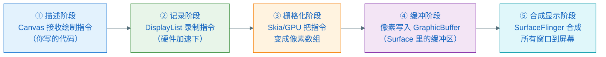

# 本次学习路线图：像素是如何从代码走到屏幕的

> 根据你的问题定制，作为整个学习包的导航与自检基准。

---

## 你提出的问题清单

学完所有文档后，回来逐一对照这些问题，检验自己是否真的答上来了：

1. Canvas 到底是什么？它是一块"画布"吗？
2. 矩阵变换是什么？translate/rotate/scale 底层怎么工作的？
3. Bitmap 是什么？像素存在哪里？
4. Canvas 与 Bitmap 是什么关系？
5. Surface 是什么？它和 Bitmap 的本质区别是什么？
6. 像素是如何被"生成"出来的？CPU 做还是 GPU 做？
7. 生成的像素最终是如何"填充"到 Surface 里的？
8. Surface 里的内容是如何"显示"到屏幕上的？
9. 硬件加速和软件渲染有什么本质区别？
10. 我在 View.onDraw() 里写的代码，最终经历了哪几个阶段才变成屏幕上的像素？

---

## 核心猜测题（先猜，再学）

在看后面文档之前，先在这里写下你的猜测，学完后对照：

| # | 问题 | 你的猜测（先写） | 学完后的答案 |
|---|------|----------------|------------|
| 1 | Canvas 是不是就是一块可以画东西的内存区域？ | | |
| 2 | Surface 和 Bitmap 都能存像素，它们有什么本质区别？ | | |
| 3 | 在 View.onDraw() 里调用 canvas.drawRect()，像素是立刻写到内存里了吗？ | | |
| 4 | 硬件加速下，主线程和 GPU 各做什么事？ | | |
| 5 | 屏幕上同时显示多个 App 的窗口，像素是怎么合并在一起的？ | | |

---

## 学习路线：像素的五段旅程

本次学习围绕一条主线展开——**一个像素从 `canvas.drawXxx()` 到屏幕点亮，经历了哪五个阶段**：

---

## 文档索引

| 文件 | 覆盖阶段 | 回答的核心问题 |
|------|---------|-------------|
| `02-Canvas与Bitmap：绘制的基础.md` | ① 描述阶段 | Canvas 是什么、Bitmap 是什么、两者关系、矩阵变换 |
| `03-硬件加速与DisplayList.md` | ② 记录阶段 + ③ 栅格化阶段 | 硬件加速如何工作、指令如何变成 GPU 命令、像素如何生成 |
| `04-Surface：像素的归宿.md` | ④ 缓冲阶段 | Surface 是什么、Bitmap 与 Surface 的关系、像素如何写入 Surface |
| `05-合成与显示：像素上屏全程.md` | ⑤ 合成显示阶段 | SurfaceFlinger 如何合成多窗口、最终如何刷新屏幕 |
| `06-自测与延伸学习.md` | 全部 | 自检题、费曼输出、间隔复习计划 |

---

## 建议阅读顺序

按文件编号 02 → 03 → 04 → 05 → 06 顺序读完，再回来对照本文档的问题清单。

如果你有特别感兴趣的具体问题，可以跳读：

- 只想搞清楚"Canvas 是什么" → 先看 **02**
- 只想理解"为什么硬件加速更快" → 先看 **03**
- 只想搞清楚"Surface 和 Bitmap 的区别" → 先看 **04**
- 想知道"屏幕最终是怎么刷新的" → 先看 **05**
