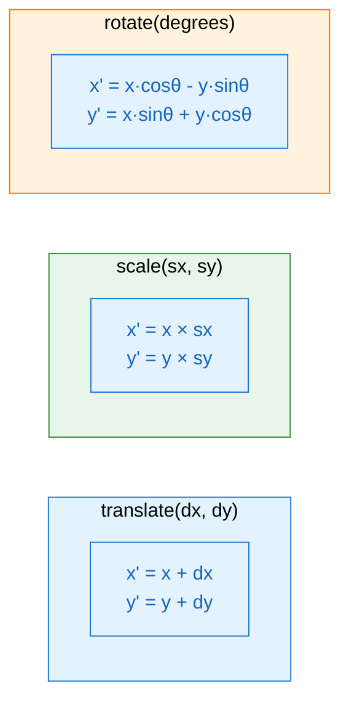
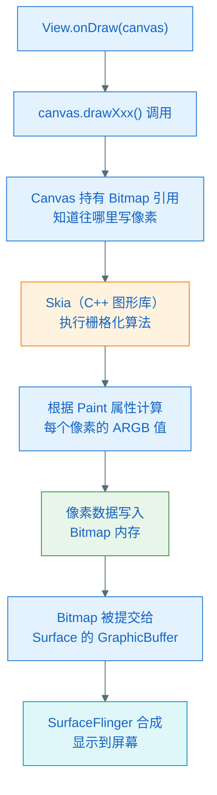
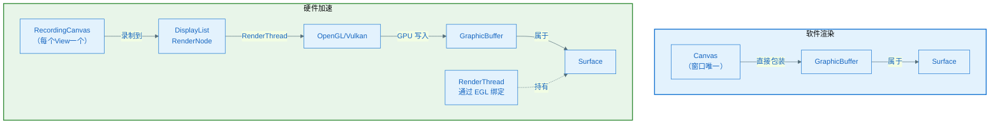

# Canvas 与 Bitmap：绘制的基础

> **一句话理解**：Bitmap 是内存里的像素数组，Canvas 是"告诉系统往哪里画、怎么画"的指令接收者——它本身不一定是像素容器。

---

## 1. 先破除一个误解：Canvas 不是"画布"

Canvas 的中文直译是"画布"，这个翻译其实有误导性。

真实的画布是有像素的：你在上面画一笔，颜料就涂在那里了。

**但 Android 的 Canvas 不是这样**。Canvas 更像一个**绘图员**，你给它发指令（"在坐标 (10,10) 画一个红色圆"），它负责把这些指令交给真正的"像素存储区"去执行。

Canvas 本身不存像素，它需要和一个"目标"绑定，才知道把像素写在哪里。

这个"目标"有两种情况：

| 情况 | Canvas 绑定的目标 | 指令去哪了 |
|------|-----------------|----------|
| **软件渲染**（未开启硬件加速） | 一块 Bitmap（内存像素数组） | 指令立刻被 Skia 执行，像素写入 Bitmap |
| **硬件加速**（默认开启） | 一个 DisplayList 记录器 | 指令被录制下来，稍后由 RenderThread 让 GPU 执行 |

这是理解整个图形系统的最关键前提，记住这两种情况。

---

## 2. Bitmap 是什么

### 2.1 本质

Bitmap 就是一块内存，里面排列着每个像素的颜色值。

最简单的理解：一张 100×100 的 ARGB_8888 Bitmap，就是内存里的一个数组，有 100×100 = 10000 个元素，每个元素是 4 字节（A、R、G、B 各 1 字节），总共占 40000 字节（约 39KB）。

```
内存布局（ARGB_8888 格式，100x100 图片）：
[像素(0,0)][像素(1,0)][像素(2,0)]...[像素(99,0)]  ← 第 0 行
[像素(0,1)][像素(1,1)]...                          ← 第 1 行
...
[像素(0,99)]...[像素(99,99)]                       ← 第 99 行

每个像素 = 4 字节 = [A][R][G][B]
总大小 = 100 × 100 × 4 = 40000 字节
```

### 2.2 Bitmap 存在哪里

- **Android 2.3 及以前**：像素数据存在 Native 内存（C++ 堆），Java 对象只是个引用
- **Android 3.0~7.x**：像素数据移到 Java 堆
- **Android 8.0 及以后**：像素数据又回到 Native 堆（通过 `NativeAllocationRegistry` 管理），但 Java 对象的 GC 会自动释放 Native 内存

实际意义：Bitmap 占的内存很大，它不在 Java 堆里（Android 8+），不会被 Java GC 压力统计进去，但一样会 OOM。

### 2.3 创建 Bitmap

```kotlin
// 方式 1：创建空白 Bitmap（全部像素初始化为 0，即透明黑色）
val bitmap = Bitmap.createBitmap(100, 100, Bitmap.Config.ARGB_8888)

// 方式 2：从资源文件解码
val bitmap = BitmapFactory.decodeResource(resources, R.drawable.photo)

// 方式 3：从字节数组
val bitmap = BitmapFactory.decodeByteArray(bytes, 0, bytes.size)
```

### 2.3.1 decodeResource 内部做了什么

`decodeResource` 不是"解析像素后再复制"，而是**解压缩 + 直接写入**——Skia 解码时一边解压、一边把像素直接写入最终的 Bitmap 内存，不会产生一份完整的中间像素副本。

**调用链**：

```
BitmapFactory.decodeResource(resources, R.drawable.photo)
  │
  ├─ Resources.openRawResource()     // 从 APK ZIP 包打开文件流
  ├─ BitmapFactory.decodeStream()
  └─ native nativeDecodeStream()     // 进入 C++ 层
       └─ Skia SkCodec               // 真正干活的地方
```

**Native 层的核心步骤**（以 JPEG / PNG 为例）：

```
① 读文件头（magic bytes）识别格式
     FF D8 FF        → JPEG
     89 50 4E 47     → PNG
     52 49 46 46...  → WebP

② 按目标尺寸分配 Native 内存（Android 8+ 用 NativeAllocationRegistry）
     大小 = width × height × 每像素字节数

③ Skia 流式解码，直接写入上一步分配好的内存：
     JPEG：反 Huffman → 反量化 → 反 DCT → YCbCr→RGB → 写入
     PNG： zlib 解压 → 还原扫描行 filter → 写入

④ 按 BitmapFactory.Options 做后处理：
     inSampleSize > 1  → 降采样（JPEG 可在 DCT 阶段直接降，更高效）
     inPreferredConfig → 像素格式转换（如强制 RGB_565）
     inBitmap          → 复用已有 Bitmap 内存，避免重新分配
```

**三种创建方式的本质差异**：

| 创建方式 | 内存分配时机 | 有无解码过程 | 备注 |
|---------|------------|------------|------|
| `createBitmap(w, h, config)` | 立刻分配，全部填零 | 无 | 透明黑色空白 |
| `decodeResource / decodeStream` | 解码开始前分配 | 有（解压缩） | 流式解码直接写入 |
| `decodeByteArray(bytes, ...)` | 解码开始前分配 | 有（解压缩） | byte[] 是**图片文件的字节**，不是原始像素 |

**一个常见误解**：`decodeByteArray` 的 `bytes` 是一个完整 JPEG/PNG 文件的字节内容（含文件头、压缩数据），不是 ARGB 原始像素数组。如果你有原始像素想直接写入 Bitmap，需要用 `Bitmap.copyPixelsFromBuffer(ByteBuffer)`。

**APK 里的图片文件会被 ZIP 再压缩吗**？PNG/JPEG/WebP 通常以 `STORED`（不压缩）方式存入 APK，因为它们本身已经是压缩格式，再压缩收益极低。

### 2.4 Bitmap.Config 是什么

Config 决定每个像素用多少字节存储：

| Config | 每像素字节数 | 说明 |
|--------|------------|------|
| `ARGB_8888` | 4 字节 | 最常用，支持透明度，色彩最丰富 |
| `RGB_565` | 2 字节 | 不支持透明度，节省内存，色彩略差 |
| `ALPHA_8` | 1 字节 | 只存透明通道，用于遮罩 |
| `RGBA_F16` | 8 字节 | HDR 用，每通道 16 位浮点 |

### 2.5 Bitmap 能"放大"吗？

Bitmap 一旦创建，像素数组的尺寸是固定的，**不能原地扩大**。

"放大 Bitmap"的唯一方式是用 `createScaledBitmap()` **生成一张更大的新 Bitmap**：

```kotlin
val original = BitmapFactory.decodeResource(resources, R.drawable.photo)
// original: 100×100 像素，40KB

val scaled = Bitmap.createScaledBitmap(original, 200, 200, true)
// scaled: 200×200 像素，160KB（内存翻 4 倍）
// original 不变；scaled 是一张全新的 Bitmap

// 第四个参数 filter = true：双线性插值（放大更平滑）
// 第四个参数 filter = false：最近邻插值（放大有锯齿，像素风格）
```

放大的本质是**插值**——对原有像素之间的空白，用周围像素的颜色推算填充，不会凭空增加细节：

```
原始 100×100：          放大到 200×200（双线性插值）：
┌──┬──┬──┐             ┌──┬──┬──┬──┐
│R │G │B │             │R │R'│G │G'│   ← R' 是 R 和 G 之间插值的颜色
└──┴──┴──┘             │R"│  │  │  │
                        └──┴──┴──┴──┘
```

放大后的 Bitmap 文件更大、内存更多，但清晰度不会提升（没有新信息，只有插值）。

---

## 3. Canvas 与 Bitmap 的关系

### 3.1 在 Bitmap 上绘制

最简单、最直接的关系：把 Bitmap 传给 Canvas，所有绘制都写入这块 Bitmap。

```kotlin
// 创建一块空白 Bitmap
val bitmap = Bitmap.createBitmap(200, 200, Bitmap.Config.ARGB_8888)

// 创建一个 Canvas，绑定到这块 Bitmap
val canvas = Canvas(bitmap)

// 在 canvas 上绘制 → 实际上是在 bitmap 的像素数组里写数据
val paint = Paint().apply { color = Color.RED }
canvas.drawCircle(100f, 100f, 50f, paint)

// 现在 bitmap 里就有一个红色圆的像素数据了
imageView.setImageBitmap(bitmap)
```

**这个流程的关键**：`Canvas(bitmap)` 构造后，Canvas 内部持有一个指向 Bitmap 像素数据的指针。每次 `drawXxx()` 调用，最终都会通过 Skia 把颜色数据写入 Bitmap 对应位置的字节。

### 3.2 类比

把 Bitmap 想象成一张白纸，Canvas 是一支笔。白纸（Bitmap）存储最终结果，笔（Canvas）负责执行绘制动作。

但有时候"笔"是录音机——它先把你的绘制指令录下来（DisplayList），稍后找 GPU 去执行。这时 Canvas 没有直接绑定 Bitmap，但最终像素还是会写到某个 Bitmap-like 的缓冲区（GraphicBuffer）里。

### 3.3 在 View.onDraw() 里的 Canvas 是哪种？

```kotlin
override fun onDraw(canvas: Canvas) {
    // 这个 canvas 是哪种？
    canvas.drawRect(0f, 0f, 100f, 100f, paint)
}
```

- **未开启硬件加速**：`canvas` 是 `Canvas(bitmap)` 形式，直接画到像素
- **开启硬件加速（默认）**：`canvas` 是 `RecordingCanvas`（继承自 `Canvas`），你写的 `drawRect` 被录制为 `DisplayListOp`，不立刻生成像素

这就是为什么某些 Canvas 操作在硬件加速下"不支持"——不是 Canvas API 不支持，而是 DisplayList 里的某些操作 GPU 没法执行，只能回退到软件渲染。

---

## 4. Paint 是什么

如果 Canvas 是"绘图动作的发起者"，Paint 就是"绘制风格的描述"。

```kotlin
val paint = Paint().apply {
    color = Color.BLUE          // 颜色
    style = Paint.Style.FILL    // 填充 or 描边 or 两者
    strokeWidth = 4f            // 线宽
    isAntiAlias = true          // 抗锯齿
    shader = LinearGradient(…)  // 渐变着色器
    maskFilter = BlurMaskFilter(…) // 模糊滤镜
    colorFilter = ColorMatrixColorFilter(…) // 颜色矩阵
}
canvas.drawCircle(100f, 100f, 50f, paint)
```

Paint 里的各种属性最终影响 Skia 的栅格化算法——它决定"一个像素该填什么颜色"。

---

## 5. 矩阵变换：Canvas 坐标系的魔法

### 5.1 矩阵是什么

矩阵（Matrix）是一张**坐标变换规则表**——9 个数字，描述"如何把一个点从旧位置映射到新位置"。

Android 2D 图形用 3×3 矩阵（2D 仿射变换）：

```
┌ a  b  tx ┐
│ c  d  ty │
└ 0  0   1 ┘

对点 (x, y) 变换的结果：
  x' = a·x + b·y + tx
  y' = c·x + d·y + ty
```

三种基本变换的矩阵形式：

| 变换 | a | b | tx | c | d | ty | 效果 |
|------|---|---|----|---|---|----|------|
| 平移(dx,dy) | 1 | 0 | dx | 0 | 1 | dy | x'=x+dx, y'=y+dy |
| 缩放(sx,sy) | sx| 0 | 0  | 0 |sy | 0  | x'=x·sx, y'=y·sy |
| 旋转 θ      |cosθ|-sinθ|0 |sinθ|cosθ|0 | 绕原点旋转 |

**矩阵的强大之处**：多个变换可以相乘合并成一个矩阵，GPU 对所有点只需做一次矩阵乘法，这是 GPU 高效变换的数学基础。

### 5.2 Canvas 矩阵变换：变换的是坐标系，不是像素

Canvas 内部维护一个 **CTM（Current Transformation Matrix，当前变换矩阵）**。

`canvas.translate/rotate/scale` 修改的是 CTM，**不移动任何已有像素**。每次 `drawXxx(x, y)` 时，(x, y) 先乘以 CTM 得到实际像素坐标，再写入 Bitmap。

```
你写的坐标（逻辑坐标）  ×  CTM  →  实际像素坐标
       (0, 0)          × translate(100,50)  →  (100, 50)
```

**类比**：Canvas 是放在 Bitmap 上的描图纸。`translate(100, 50)` = 把描图纸向右移 100、向下移 50。你在描图纸 (0,0) 处画的圆，印到 Bitmap 上是 (100, 50) 的位置。已经印好的像素不会因为移动描图纸而改变。



### 5.3 Bitmap 矩阵变换：两种完全不同的情况

Bitmap 矩阵变换和 Canvas 矩阵变换是完全不同的两件事：

**情况 A：`canvas.drawBitmap(bitmap, matrix, paint)` — 变换绘制位置**

```kotlin
val matrix = Matrix()
matrix.setScale(2f, 2f)
canvas.drawBitmap(sourceBitmap, matrix, paint)
// 效果：sourceBitmap 被放大 2 倍后画到 canvas 上
// sourceBitmap 本身没有变化（像素数组不动）
```

变换的是"如何把 Bitmap 的像素投影到 Canvas 目标上"。原始 Bitmap 的像素数组完全不变。

**情况 B：`Bitmap.createBitmap(source, x, y, w, h, matrix, filter)` — 生成新 Bitmap**

```kotlin
val matrix = Matrix()
matrix.setScale(2f, 2f)
val newBitmap = Bitmap.createBitmap(sourceBitmap, 0, 0,
    sourceBitmap.width, sourceBitmap.height, matrix, true)
// 生成了一张新 Bitmap，内容是 sourceBitmap 放大 2 倍后的像素
// sourceBitmap 本身不变；newBitmap 内存是 sourceBitmap 的 4 倍
```

变换的是"用原 Bitmap 生成一张新 Bitmap"，创建了新的像素数组。

| 操作 | 变换了什么 | 原 Bitmap 变？ | 内存开销 |
|------|----------|--------------|---------|
| `canvas.drawBitmap(bmp, matrix, paint)` | 绘制时的坐标映射 | 不变 | 几乎为零 |
| `Bitmap.createBitmap(..., matrix, ...)` | 生成了新像素数组 | 不变 | 新 Bitmap 全部内存 |

**结论：Bitmap 本身是不可变的像素数组，所有"变换"要么是绘制映射，要么是生成新 Bitmap。**

### 5.4 save / restore：状态栈，不是像素操作

`save()` 和 `restore()` 操作的是 Canvas 的**当前状态**（CTM + clip region），与像素无关。

```kotlin
canvas.drawRect(0f, 0f, 100f, 100f, paint)  // 像素永久写入 Bitmap

canvas.save()                  // 把当前 (CTM, clip) 压栈
canvas.translate(200f, 0f)     // 修改 CTM
canvas.drawCircle(0f, 0f, 50f, paint)  // 圆落在 (200, 0)

canvas.restore()               // 弹栈，CTM 恢复原状
                               // ⚠️ 之前画的矩形和圆仍在 Bitmap 里，不会消失
canvas.drawLine(0f, 0f, 50f, 50f, paint)  // 这条线在 (0,0)，CTM 已恢复
```

栈的运作方式：
```
save()  → 把 (CTM, clip) 压入栈顶
restore() → 弹出栈顶，覆盖当前状态

栈：[ CTM1,clip1 | CTM2,clip2 | CTM3,clip3 ]  ← 栈顶
restore() 后：[ CTM1,clip1 | CTM2,clip2 ]
```

### 5.5 saveLayer()：唯一真正创建新缓冲区的操作

**`drawXxx()` 不创建新层**，直接写当前目标（Bitmap 或 DisplayList）。

**`saveLayer()` 才创建新层**——分配一块新的离屏缓冲区（Offscreen Buffer）：

```kotlin
// save()：零开销，只存状态
canvas.save()
canvas.drawXxx(...)  // 画到底层 Bitmap
canvas.restore()

// saveLayer()：分配新内存，有显著开销
canvas.saveLayer(left, top, right, bottom, paint)
canvas.drawXxx(...)  // 画到新的离屏缓冲区
canvas.restore()     // 把离屏缓冲区按 paint 的 alpha/Xfermode 合并回底层 Bitmap
```

| 操作 | 保存了什么 | 创建新缓冲区？ | 已有像素变化？ | 开销 |
|------|----------|-------------|-------------|------|
| `save()` | CTM + clip | 否 | 否 | 极低 |
| `restore()` | 恢复栈顶 | 否 | 否 | 极低 |
| `saveLayer()` | CTM + clip + 新离屏缓冲区 | **是** | 否 | **高** |
| `drawXxx()` | 无 | 否 | **是** | 取决于绘制复杂度 |

**saveLayer() 的使用场景**（非必要不用）：
- 对一组图形整体设置半透明（不能分开设置 alpha）
- 使用需要"整组操作"的 `PorterDuff Xfermode`（如 `DST_IN` 做遮罩）

```kotlin
// ❌ 对 ViewGroup 设置 alpha 可能触发 saveLayer（每帧创建离屏缓冲区，性能差）
container.alpha = 0.5f

// ✅ 如果可以，对叶子 View 分别设 alpha（不触发 saveLayer）
textView.alpha = 0.5f
imageView.alpha = 0.5f
```

### 5.6 矩阵在 View 系统里的应用

View 的 `translationX`、`translationY`、`rotation`、`scaleX`、`scaleY` 底层是 RenderNode 的矩阵属性。硬件加速下，这些变换直接由 GPU 执行，不需要重新录制 DisplayList——这就是属性动画比 invalidate+draw 高效得多的原因。

---

## 6. 软件渲染下的完整流程

在没有硬件加速的情况下，绘制流程是这样的：



**栅格化（Rasterization）**是关键步骤：把矢量的绘制指令（"在 (10,10) 画半径 50 的圆"）变成位图的像素数据（"第 (10,60) 个像素是红色，第 (11,60) 个像素也是红色……"）。这个计算由 CPU 完成（Skia 库）。

---

## 7. 每个窗口有几个 Canvas？Canvas 与 Surface 是什么关系？

这两个问题放在一起回答，因为答案取决于同一个前提：**是否开启硬件加速**。

### 7.1 软件渲染：1 个 Canvas，直接绑定 Surface

整个窗口只有 **1 个 Canvas**，它直接锁定了 Surface 的 GraphicBuffer：

```
Surface.lockCanvas(dirty)
  → 从 BufferQueue 取出一块 GraphicBuffer
  → 把这块内存包装成 Canvas 返回

整个 View 树共用这一个 Canvas 顺序绘制：
  ViewGroup.draw(canvas)
    → 子 View.draw(canvas)
      → 孙 View.draw(canvas)

绘制完后：
Surface.unlockCanvasAndPost(canvas)
  → 把 GraphicBuffer 提交给 BufferQueue
```

**关系**：Canvas **直接是** Surface 里 GraphicBuffer 的写入接口。Canvas 和 Surface 之间是强绑定——Canvas 的每一笔都立刻写入 Surface 的缓冲区。

### 7.2 硬件加速：每个 View 一个 RecordingCanvas，与 Surface 无直接关系

每个需要重绘的 View 都会得到自己的 **RecordingCanvas**，但这些 Canvas 和 Surface 没有任何直接联系：

```
View 树绘制时（顺序执行）：
  RootView  → RenderNode.beginRecording() → RecordingCanvas A → endRecording()
  ChildView → RenderNode.beginRecording() → RecordingCanvas B → endRecording()
  GrandView → RenderNode.beginRecording() → RecordingCanvas C → endRecording()

每个 Canvas 录制完后生成该 View 的 DisplayList，Canvas 对象即销毁/回收
```

Surface 在哪里？Surface 由 **RenderThread** 通过 EGL 独立持有，Canvas 完全不知道 Surface 的存在：

```
ThreadedRenderer 初始化时：
  EGLSurface = eglCreateWindowSurface(..., nativeWindow)
                                           ↑
                                    nativeWindow = Surface 的 Native 层

RenderThread 每帧渲染完成后：
  eglSwapBuffers(display, eglSurface)
    → 内部调用 Surface.queueBuffer()
    → GraphicBuffer 提交给 SurfaceFlinger
```

### 7.3 对比总结



| 对比 | 软件渲染 | 硬件加速 |
|------|---------|---------|
| Canvas 数量 | 1 个（整个窗口共用） | N 个（每个 View 一个 RecordingCanvas） |
| Canvas 绑定的目标 | Surface 的 GraphicBuffer | RenderNode 的 DisplayList |
| Canvas 与 Surface 的关系 | **直接绑定**，Canvas 就是 GraphicBuffer 的写入接口 | **无直接关系**，Surface 由 RenderThread 通过 EGL 独立管理 |
| 像素写入时机 | `drawXxx()` 调用时立刻写入 | GPU 渲染时（syncFrameState 之后） |

---

## 8. ImageView、Drawable、Bitmap 是什么关系？

### 8.1 三者的层次

```
ImageView（View）
  └── 持有一个 Drawable（抽象接口）
        ├── BitmapDrawable    ← setImageBitmap() 时，Bitmap 被包装成这个
        ├── VectorDrawable    ← res/drawable/*.xml 矢量图
        ├── AnimatedVectorDrawable
        ├── NinePatchDrawable ← .9.png
        └── 其他 Drawable 子类
```

- **Bitmap**：原始像素数组，只管存数据
- **Drawable**：抽象的"可被绘制的东西"，知道如何把自己画到 Canvas 上
- **BitmapDrawable**：用 Drawable 接口包装 Bitmap 的容器
- **ImageView**：只认识 Drawable，不直接持有 Bitmap

### 8.2 各种 setImage 方法的本质

```kotlin
imageView.setImageBitmap(bitmap)
// 内部：val d = BitmapDrawable(resources, bitmap)
//        setImageDrawable(d)

imageView.setImageResource(R.drawable.photo)
// 内部：val d = context.getDrawable(R.drawable.photo)
//        setImageDrawable(d)

imageView.setImageDrawable(drawable)  // 底层方法，上面两个最终都调它
```

### 8.3 放大 ImageView 的图片，放大了什么？

**放大的是 Drawable 的绘制变换矩阵（drawMatrix），Bitmap 像素和 View 尺寸都不变。**

ImageView 通过 `scaleType` 计算一个 `drawMatrix`，在 `onDraw()` 时 `canvas.concat(drawMatrix)` 后再让 Drawable 绘制自己：

```kotlin
// ImageView.onDraw() 内部（简化）：
override fun onDraw(canvas: Canvas) {
    canvas.concat(mDrawMatrix)        // 应用缩放/平移矩阵
    mDrawable.draw(canvas)            // Drawable 把 Bitmap 画到 canvas 上
}
```

捏合放大（Pinch-to-zoom）的实现：

```kotlin
imageView.scaleType = ImageView.ScaleType.MATRIX
val matrix = imageView.imageMatrix
matrix.postScale(scaleFactor, scaleFactor, focusX, focusY)
imageView.imageMatrix = matrix
// 只改了绘制矩阵，Bitmap 像素不变，View 边界不变
// 超出 View 边界的部分被裁切（因为 View 有固定大小）
```

所有 `scaleType` 效果（FIT_CENTER、CENTER_CROP 等）的本质都是计算不同的 `drawMatrix`，没有一种会修改 Bitmap 像素或 View 尺寸。

---

## 9. View 的宽高可以超过屏幕吗？

**可以，完全没有限制。** View 的宽高由 measure/layout 过程决定，与屏幕尺寸没有强制关联。

```xml
<!-- 合法：高度远超屏幕 -->
<View
    android:layout_width="match_parent"
    android:layout_height="5000dp"
    android:background="#FF0000"/>
```

### 9.1 常见场景

- `ScrollView` 里的内容：高度是所有子 View 高度之和，可以是屏幕的数倍
- `RecyclerView` 的全部条目：每个条目独立测量，总高度可以很大
- 自定义 View 的展开状态：折叠/展开动画中高度动态超过屏幕

### 9.2 超出部分的处理

超出父容器边界的部分默认被**裁切（clip）**不显示：

```kotlin
// 父容器默认裁切超出自身范围的子 View
// 关闭裁切（谨慎使用，会让子 View 绘制在父容器外面）：
parent.clipChildren = false
parent.clipToPadding = false
```

### 9.3 View 坐标系

View 使用自己的局部坐标系，原点是自身左上角 (0, 0)。View 的 `width`/`height` 是 measure 决定的逻辑尺寸，和屏幕像素尺寸无关（受 density 缩放影响）。

---

## 10. 常见误区

| 误区 | 真相 |
|------|------|
| "Canvas 就是一块像素内存" | Canvas 是绘制接口，像素存在 Bitmap 或 GraphicBuffer 里 |
| "调用 canvas.draw() 像素就立刻写好了" | 硬件加速下只是录制指令，GPU 稍后才执行 |
| "canvas.drawXxx() 会创建新的画布层" | 不会，直接写当前目标；只有 `saveLayer()` 才创建离屏缓冲区 |
| "canvas.save() / restore() 只影响矩阵" | 也会保存/恢复裁切区域（clip region），但不影响任何已有像素 |
| "canvas.restore() 会撤销已画的内容" | restore 只恢复坐标系状态，已写入的像素永远留在那里 |
| "Bitmap.createBitmap() 很快，可以随时创建" | 需要分配 native 内存，4000×3000 的图片约 46MB，很慢且耗内存 |
| "canvas.scale(2f,2f) 会让已有像素变大" | scale 只改 CTM，影响之后的 draw 坐标，已有像素不动 |
| "放大 ImageView 的图片会修改 Bitmap" | 只是改了 drawMatrix，Bitmap 像素、View 尺寸都不变 |
| "Bitmap 可以直接放大" | Bitmap 尺寸固定，只能用 createScaledBitmap() 生成更大的新 Bitmap（插值） |
| "ImageView 直接持有 Bitmap" | ImageView 持有 Drawable；Bitmap 被包装成 BitmapDrawable 后才给 ImageView |

---

## 11. 小结

这一章回答了：
- Canvas 是绘制指令的接收者，不是像素容器；它有两种工作模式：绑定 Bitmap 的软件渲染和录制 DisplayList 的硬件加速
- Bitmap 是内存里的像素数组，是真正存像素的地方；Android 8+ 存储在 Native 堆，尺寸固定，"放大"只能用 `createScaledBitmap()` 生成新 Bitmap
- 矩阵是坐标变换规则表（3×3 九个数字），Canvas 内部的 CTM 决定 drawXxx() 的实际落点；`translate/rotate/scale` 改的是坐标系，不移动已有像素
- `save()/restore()` 操作的是状态栈（CTM + clip），已写入的像素永远不会消失；`saveLayer()` 才会创建离屏缓冲区，开销显著
- 软件渲染：1 个 Canvas 直接绑定 Surface 的 GraphicBuffer，像素立刻写入
- 硬件加速：每个 View 有自己的 RecordingCanvas，与 Surface 无直接关系；Surface 由 RenderThread 通过 EGL 独立持有
- ImageView 持有的是 Drawable（抽象接口），不直接持有 Bitmap；`setImageBitmap()` 内部会把 Bitmap 包装成 BitmapDrawable 再设置
- 放大 ImageView 里的图片，改变的是 drawMatrix（绘制变换矩阵），Bitmap 像素和 View 尺寸都不变
- View 的宽高可以超过屏幕，超出父容器的部分默认被裁切（clip）

下一章：**硬件加速如何改变这一切，以及 GPU 是如何生成像素的。**
