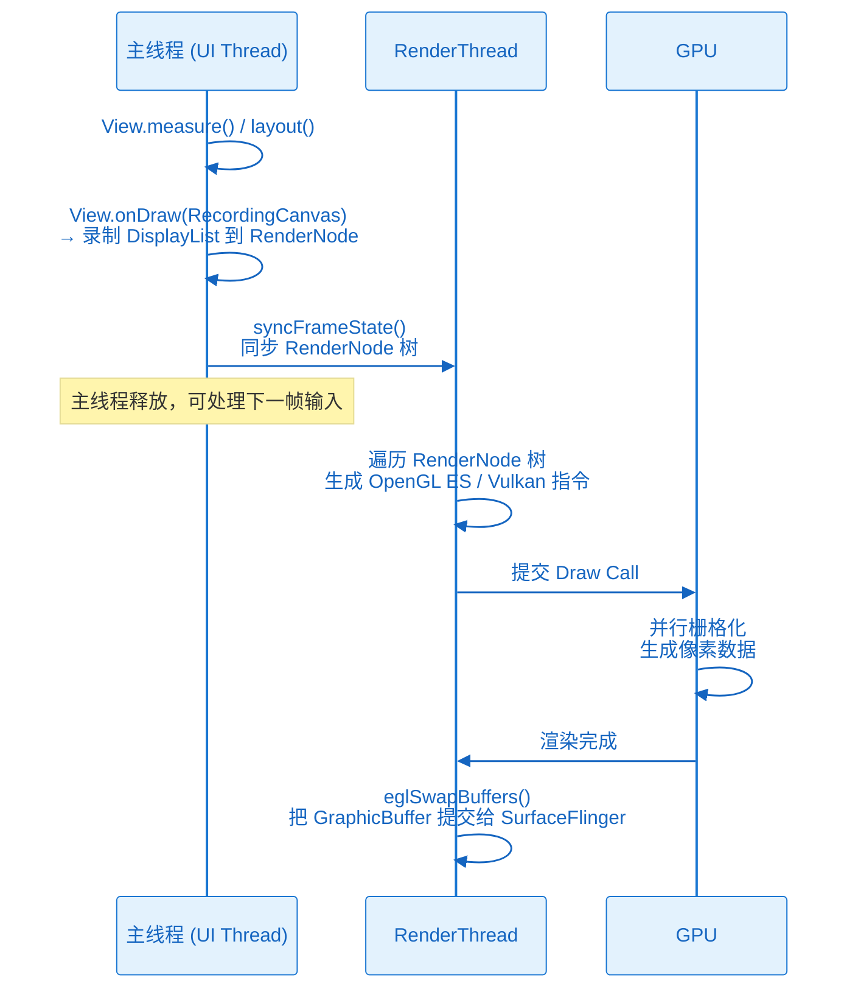
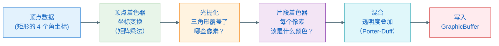

# 硬件加速与 DisplayList：指令如何变成 GPU 像素

> **一句话理解**：硬件加速把"立刻画"改成"先记下来，让 GPU 去画"——主线程录指令，RenderThread 执行，GPU 生成像素。

---

## 1. 为什么需要硬件加速

软件渲染（Skia + CPU）的问题：

- **CPU 做栅格化很慢**：把矢量指令变像素需要大量像素级计算，CPU 是串行的，算力有限
- **全量重绘**：每次有任何 View 更新，整个视图树都要重新 draw 一遍（dirty region 优化有限）
- **主线程阻塞**：渲染和 UI 逻辑争用同一个 CPU，耗时长就掉帧

GPU 的优势：
- **并行计算**：GPU 有数千个小核心，可以同时计算数千个像素的颜色
- **专为图形设计**：矩阵运算、纹理采样、颜色混合都有硬件加速

**硬件加速的思路**：把绘制指令录制成一个列表（DisplayList），不立刻计算像素，由独立的 RenderThread 提交给 GPU 去执行。

---

## 2. DisplayList：绘制指令的录音机

### 2.1 什么是 DisplayList

DisplayList（显示列表）是绘制指令的序列化表示。类似于乐谱——不是声音本身，而是"什么时候弹哪个音"的描述。

当硬件加速开启时，View.onDraw() 里的每个 canvas 调用，都被录制成一条 `DisplayListOp`：

```
canvas.drawRect(0, 0, 100, 100, paint)
  → DrawRectOp { left=0, top=0, right=100, bottom=100, paint=... }

canvas.drawBitmap(bitmap, 0, 0, null)
  → DrawBitmapOp { bitmap=..., x=0, y=0 }

canvas.drawText("Hello", 0, 0, paint)
  → DrawTextOp { text="Hello", x=0, y=0, paint=... }
```

这些 Op 被存储在 `RenderNode` 里。每个 View 对应一个 `RenderNode`。

### 2.2 RenderNode 是什么

`RenderNode` 是 Android 硬件加速渲染的核心单元，每个 View 都有一个：

```
View  ──has──▶  RenderNode
                  ├── DisplayList（绘制指令序列）
                  ├── 矩阵属性（translationX, scaleX, rotation...）
                  ├── 透明度（alpha）
                  ├── 裁切区域（clipRect）
                  └── 子 RenderNode 列表
```

**关键洞察**：矩阵变换（`translationX`、`scaleX` 等）存在 RenderNode 上，不在 DisplayList 里。这意味着修改 `view.translationX = 10f`，**不需要重新录制 DisplayList**，只需要更新 RenderNode 的矩阵属性，RenderThread 下一帧直接用新矩阵重新执行同一份 DisplayList。

这就是属性动画为什么高效：修改 `translationX`/`scaleX`/`alpha` 完全在 RenderThread 里执行，主线程不参与。

### 2.3 录制时用什么 Canvas

硬件加速下，系统传给 View.onDraw() 的 Canvas 实际类型是 `RecordingCanvas`（继承自 `Canvas`）。

`RecordingCanvas` 实现了 Canvas 的所有接口，但每个 `drawXxx()` 不执行栅格化，而是生成一个 `DisplayListOp` 追加到 RenderNode 的 DisplayList 里。

---

## 3. 主线程做什么，RenderThread 做什么

这是理解硬件加速最核心的分工：



**协作者与过程说明**

1. **触发与入口**：Choreographer 的 Vsync 回调触发主线程 doFrame()，进入 View 树遍历（measure → layout → draw）
2. **主线程的工作**：在 draw 阶段，对每个需要更新的 View 调用 `onDraw()`，使用 `RecordingCanvas` 把绘制指令录制到 RenderNode 的 DisplayList 里。**注意**：这一步只是"录音"，不执行任何像素计算。
3. **同步点（syncFrameState）**：主线程的录制完成后，通过 `syncFrameState()` 把 RenderNode 树的状态（新的 DisplayList、矩阵属性等）同步给 RenderThread。这是主线程和 RenderThread 之间唯一的同步点，之后两个线程可以并行工作。
4. **RenderThread 的工作**：遍历 RenderNode 树，把 DisplayListOp 翻译成 OpenGL ES 或 Vulkan 的绘图命令（Draw Call），提交给 GPU。
5. **GPU 并行栅格化**：GPU 用数千个着色器核心并行计算，每个核心负责若干像素的颜色，结果写入 GraphicBuffer。
6. **提交**：RenderThread 调用 `eglSwapBuffers()`，把渲染完成的 GraphicBuffer 提交到 BufferQueue，通知 SurfaceFlinger 有新帧可用。
7. **异常分支**：若主线程的 `syncFrameState()` 耗时太长（超过一帧预算），RenderThread 会等待，导致掉帧。若 GPU 渲染超时，同样掉帧。

---

## 4. GPU 如何生成像素

GPU 执行的过程称为**渲染管线（Render Pipeline）**，简化理解：



1. **顶点数据**：一个矩形被分成两个三角形（GPU 的基本图元是三角形），每个三角形有 3 个顶点坐标
2. **顶点着色器**：对每个顶点做矩阵变换（这里就是 RenderNode 的矩阵属性起作用的地方）
3. **光栅化**：判断哪些像素点在三角形内部（这步是硬件固定逻辑，速度极快）
4. **片段着色器**：对每个在三角形内的像素，计算颜色（纹理采样、颜色混合、渐变等都在这里）
5. **混合**：如果有透明度（alpha），当前像素颜色与背景色按 Porter-Duff 规则混合
6. **写入**：最终颜色值写入 GraphicBuffer 对应位置

GPU 的优势就在步骤 3→4：数千个着色器核心同时计算不同像素，真正并行。

---

## 5. 硬件加速的两大优势（对应软件渲染的痛点）

### 优势 1：增量更新（只重录变化的 View）

软件渲染需要全量重绘整个 View 树（或较大的 dirty region）。

硬件加速下，每个 View 有独立的 RenderNode 和 DisplayList。只有调用了 `invalidate()` 的 View 才需要重新录制 DisplayList；其他 View 的 DisplayList 直接复用。

```
第 1 帧：所有 View 录制 DisplayList
第 2 帧：只有 Button 调用了 invalidate()
         → 只重新录制 Button 的 DisplayList
         → 其他 View 的 DisplayList 不变，直接重用
```

### 优势 2：属性动画完全在 RenderThread

`translationX`、`translationY`、`rotation`、`scaleX`、`scaleY`、`alpha` 这六类属性变化，只需更新 RenderNode 的属性，不需要 `invalidate()` + `onDraw()`。

```kotlin
// 这个动画：主线程只负责修改 RenderNode 属性，不录制 DisplayList
// RenderThread 在每一帧自动用新属性重新渲染
ObjectAnimator.ofFloat(view, "translationX", 0f, 200f).start()
```

---

## 6. 硬件加速的限制

有些 Canvas API 在硬件加速下不支持（或降级软件渲染），常见的：

| API | 硬件加速支持情况 |
|-----|----------------|
| `canvas.drawBitmap()` | 支持 |
| `canvas.drawPath()` | 支持（API 28+ 完全支持） |
| `canvas.drawText()` | 支持 |
| `Paint.setXfermode(PorterDuffXfermode)` | 部分支持，某些 Xfermode 需要离屏缓冲 |
| `canvas.clipPath()` with non-rect | API 18 前不支持，18+ 支持 |
| `Paint.setMaskFilter(BlurMaskFilter)` | 软件渲染（会创建 bitmap 离屏渲染） |

遇到不支持的 API，系统会降级：在一个临时的 Bitmap 上用软件渲染执行这段绘制，再把结果作为纹理贴回 GPU。

---

## 7. 一个完整的帧：主线程视角

```
Vsync 信号到来
  ↓
Choreographer.doFrame()
  ↓
  ├── [Input 阶段] 处理触摸/按键事件
  ├── [Animation 阶段] 推进属性动画值，更新 RenderNode 属性
  └── [Traversal 阶段] ViewRootImpl.performTraversals()
       ├── performMeasure()  → measure 整个 View 树
       ├── performLayout()   → layout 整个 View 树
       └── performDraw()
            └── 对每个 dirty View 调用 onDraw(RecordingCanvas)
                 → 录制 DisplayList 到 RenderNode
  ↓
syncFrameState()
  → 把 RenderNode 树同步给 RenderThread
  ↓
主线程释放 ← 可以处理下一帧的 Input 了
```

---

## 8. 小结与关键结论

| 概念 | 本质 |
|------|------|
| DisplayList | 绘制指令的录制结果，不是像素 |
| RenderNode | 每个 View 对应的渲染单元，持有 DisplayList + 变换属性 |
| RecordingCanvas | 硬件加速下传给 onDraw() 的 Canvas，功能是录制而非直接绘制 |
| RenderThread | 独立线程，负责把 DisplayList 翻译成 GPU 命令 |
| 像素生成者 | GPU（通过 OpenGL ES / Vulkan 着色器） |

**最重要的一句话**：硬件加速下，`onDraw()` 里的代码不直接生成像素——它录制指令，GPU 生成像素。

下一章：**像素生成之后，去了哪里——Surface 与 GraphicBuffer 的本质。**
