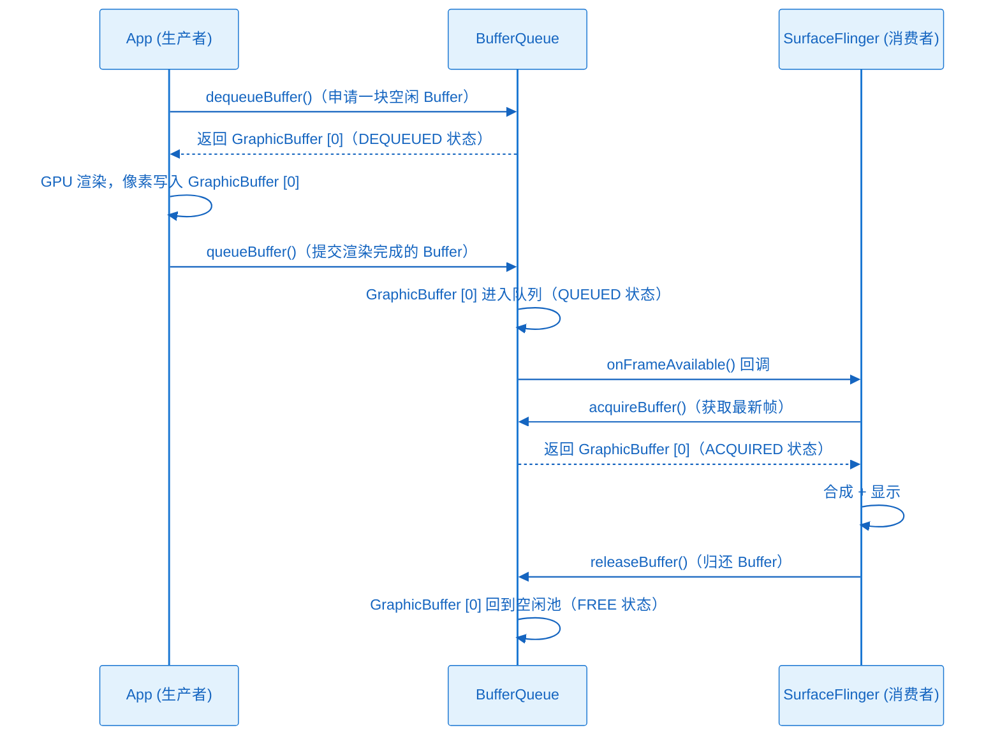
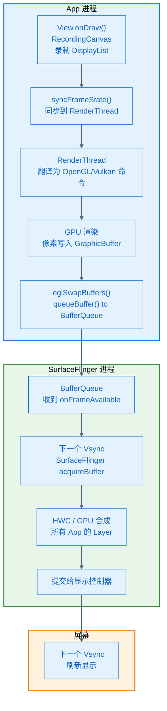

# Surface：像素的归宿

> **一句话理解**：Surface 是一个窗口的绘制目标——它不是像素容器本身，而是管理一组"共享内存像素缓冲区（GraphicBuffer）"的队列，让 App 和 SurfaceFlinger 能安全地交换帧。

---

## 1. 先理解问题：像素生成了，然后呢？

上一章讲到，GPU 把像素写入了 GraphicBuffer。但这里有个问题：

- App 在写这一帧的像素
- SurfaceFlinger 同时在读上一帧的像素（显示在屏幕上）

如果只有一块内存，App 写到一半，SurfaceFlinger 读到了不完整的数据，屏幕就会出现"撕裂"（屏幕上半部分是新帧，下半部分是旧帧）。

解决方案：**双缓冲（Double Buffering）**——至少准备两块 GraphicBuffer：
- App 写 Buffer A（Back Buffer）
- SurfaceFlinger 读 Buffer B（Front Buffer）
- App 写完后，两者交换角色

这个"管理多块 GraphicBuffer、在 App 和 SurfaceFlinger 之间调度它们"的机制，就是 **BufferQueue**，而 **Surface** 是 App 操作 BufferQueue 的接口。

---

## 2. Surface 是什么

### 2.1 从 App 视角看

Surface 代表一个**可以被渲染的窗口**。每个 Activity 有一个 Surface（通过 `Window → WindowManager → SurfaceFlinger` 创建）。App 向 Surface 里"写"像素，SurfaceFlinger 从 Surface 里"读"像素显示到屏幕。

Surface 是 `android.view.Surface`，是 Java 层的包装，背后对应 Native 层的 `ANativeWindow`。

### 2.2 Surface 的内部结构

```
Surface（Java）
  │
  └── ANativeWindow（Native 层接口）
       │
       └── BufferQueueProducer（生产者端）
            │
            └──▶ BufferQueue（在 SurfaceFlinger 进程里）
                  ├── GraphicBuffer [0]  ← 可能正在被 App 写
                  ├── GraphicBuffer [1]  ← 可能正在被 GPU 渲染
                  └── GraphicBuffer [2]  ← 可能正在被 SurfaceFlinger 显示
```

**关键**：Surface 只是 BufferQueue 的"生产者端"接口。真正的像素在 `GraphicBuffer` 里。BufferQueue 本身运行在 SurfaceFlinger 进程。

### 2.3 GraphicBuffer 是什么

GraphicBuffer 是一块**可以被 GPU 直接访问的共享内存**，通过 `gralloc`（图形内存分配器 HAL）分配。

它和 Bitmap 的相同点：都是像素的容器。
不同点见下表：

| 对比维度 | Bitmap | GraphicBuffer |
|---------|--------|---------------|
| 所在内存 | App 进程的 Native 堆 | 由 gralloc 分配的特殊共享内存 |
| GPU 可访问 | 需要上传为纹理（glTexImage2D） | 直接可访问（zero-copy） |
| 跨进程共享 | 不支持（需要序列化） | 支持（通过文件描述符传递） |
| 创建者 | App（BitmapFactory / Bitmap.create） | SurfaceFlinger 或 App 请求系统分配 |
| 用途 | App 内部图像处理、展示 | 窗口渲染结果的传递载体 |

---

## 3. Bitmap 与 Surface 的关系

这是你问的核心问题之一，答案比较反直觉：

**Bitmap 和 Surface 之间没有直接的包含关系。**

它们是两个独立的像素容器体系：

```
Bitmap 体系（App 内部）
  Bitmap → 存放在 App 进程 native 堆
  用于：图片处理、临时绘制结果、资源存储

Surface / GraphicBuffer 体系（跨进程）
  GraphicBuffer → 存放在 gralloc 共享内存
  用于：窗口帧数据，在 App 进程和 SurfaceFlinger 进程之间传递
```

它们的关系是**转换关系**，不是包含关系：
- 如果你要把 Bitmap 的内容显示到屏幕上，系统会把 Bitmap 作为纹理上传给 GPU（`glTexImage2D`），GPU 渲染后写入 GraphicBuffer → 进入 Surface → SurfaceFlinger 显示。
- 如果你想把 Surface 里的内容拿到 App 里处理（截图场景），需要把 GraphicBuffer 的像素 readback 成一个 Bitmap（开销很大）。

### 类比

- **Bitmap** = 你自己的速写本（只有你能看）
- **Surface / GraphicBuffer** = 公告栏上的展示板（你写完，裱起来展示给所有人看）

---

## 4. 向 Surface 写入像素的两种方式

### 方式 1：软件渲染（lockCanvas / unlockCanvasAndPost）

```kotlin
val holder: SurfaceHolder = surfaceView.holder

val canvas = holder.lockCanvas()  // 从 BufferQueue 取一块 GraphicBuffer，包装成 Canvas
// 在 canvas 上绘制（软件渲染，CPU 执行 Skia 栅格化）
canvas.drawRect(...)
holder.unlockCanvasAndPost(canvas)  // 把渲染完成的 GraphicBuffer 提交回 BufferQueue
```

这里的 `lockCanvas()` 返回的 Canvas 内部绑定的是 GraphicBuffer（不是普通 Bitmap），Skia 直接把像素写入 GraphicBuffer 的内存。

### 方式 2：硬件渲染（RenderThread + EGL）

这是 View 系统默认使用的方式，不需要应用代码显式操作：

1. RenderThread 创建 EGLSurface（OpenGL 层的 Surface 包装），绑定到 App 的 Surface
2. GPU 渲染时，通过 `eglSwapBuffers()` 把渲染结果写入 GraphicBuffer，并通知 SurfaceFlinger

### 方式 3：视频解码器直接写入（zero-copy）

视频解码时，可以把 Surface 直接传给 `MediaCodec`，解码器把每一帧直接写入 GraphicBuffer，完全不经过 App 进程的内存，零拷贝：

```kotlin
val surface = surfaceView.holder.surface
mediaCodec.configure(format, surface, null, 0)
// 解码结果直接写入 Surface 的 GraphicBuffer，SurfaceFlinger 直接显示
```

---

## 5. BufferQueue：生产者-消费者模型

BufferQueue 是 Surface 背后的核心机制，负责在生产者（App）和消费者（SurfaceFlinger）之间调度 GraphicBuffer：



**协作者与过程说明**

1. **触发与入口**：RenderThread 完成 GPU 渲染后，调用 `eglSwapBuffers()`，内部触发 `queueBuffer()`
2. **Buffer 状态机**：每块 GraphicBuffer 有四种状态：FREE（空闲可申请）→ DEQUEUED（已被 App 持有，写入中）→ QUEUED（已提交等待消费）→ ACQUIRED（已被 SurfaceFlinger 持有，读取中）→ FREE
3. **双缓冲**：同时存在 2 块 Buffer，一块被 App 写，一块被 SurfaceFlinger 读，交替使用
4. **三缓冲（Android 4.1+ Jelly Bean）**：增加第 3 块 Buffer，减少 App 等待空闲 Buffer 的概率，降低掉帧率
5. **异常分支（Buffer Starvation）**：若 App 渲染太慢，SurfaceFlinger 在下一个 Vsync 到来时没有新的 QUEUED Buffer，只能重复显示上一帧，产生掉帧（Jank）

---

## 6. SurfaceView 和 TextureView 的区别

这是 Surface 体系最容易混淆的地方：

| 对比 | SurfaceView | TextureView |
|------|------------|-------------|
| 有没有独立 Surface | 有（独立的 Layer） | 没有（借用所在 View 的 Layer） |
| 渲染线程 | 可以在非主线程渲染 | 必须通过 UI 线程的 RenderThread |
| 与 View 层级的关系 | **独立层**，不受 View 动画影响 | **属于 View 层级**，可以做 View 动画 |
| 合成位置 | SurfaceFlinger 层面单独合成 | 作为纹理被渲染到父 View 的 Layer |
| 适用场景 | 视频播放、相机预览、游戏 | 需要做动画的视频、需要截图的视频 |
| 性能开销 | 更低（zero-copy） | 更高（需要一次纹理拷贝） |

**SurfaceView 为什么在 View 动画里会"穿帮"**：SurfaceView 有独立的 Layer，它在 SurfaceFlinger 里是单独的一个图层，与其他 View 的图层在不同平面。View 动画（`translationX` 等）只影响自己 Layer 里的 View，不影响 SurfaceView 的独立 Layer，所以 SurfaceView 不会随 View 动画移动。TextureView 没有这个问题，因为它就在 View Layer 里。

---

## 7. 完整的像素旅程：到 Surface 为止



---

## 8. 常见误区

| 误区 | 真相 |
|------|------|
| "Surface 就是一块 Bitmap" | Surface 管理 GraphicBuffer 队列，不是单一的内存块 |
| "SurfaceView 比 View 性能好" | SurfaceView 适合持续高帧率渲染（视频/游戏）；普通静态 UI 用 SurfaceView 反而复杂且没必要 |
| "TextureView 和 SurfaceView 只是 API 不同" | 底层架构完全不同，TextureView 多一次纹理拷贝 |
| "lockCanvas() 返回的 Canvas 和 Canvas(bitmap) 一样" | lockCanvas() 的 Canvas 绑定的是 GraphicBuffer，不是普通 Bitmap |
| "App 在 Surface 上画完，SurfaceFlinger 立刻就能显示" | 有 BufferQueue 队列，SurfaceFlinger 在下一个 Vsync 才消费 |

---

## 9. 小结

| 概念 | 本质 |
|------|------|
| Surface | BufferQueue 的生产者端接口，代表一个可绘制的窗口 |
| GraphicBuffer | GPU 可访问的共享内存像素容器，实际的像素存放处 |
| BufferQueue | 在 App 和 SurfaceFlinger 之间调度 GraphicBuffer 的队列 |
| Bitmap | App 进程内部的像素容器，不能直接被 SurfaceFlinger 访问 |
| SurfaceView | 有独立 Surface/Layer，适合视频/游戏 |
| TextureView | 没有独立 Surface，作为纹理集成在 View 层级里 |

**Bitmap vs Surface 的核心区别**：
Bitmap 是 App 自己用的草稿纸；GraphicBuffer/Surface 是系统用来显示的展示板，两块进程都能访问的共享内存。

下一章：**SurfaceFlinger 拿到所有 App 的 GraphicBuffer 之后，如何合成并最终显示到屏幕上。**
