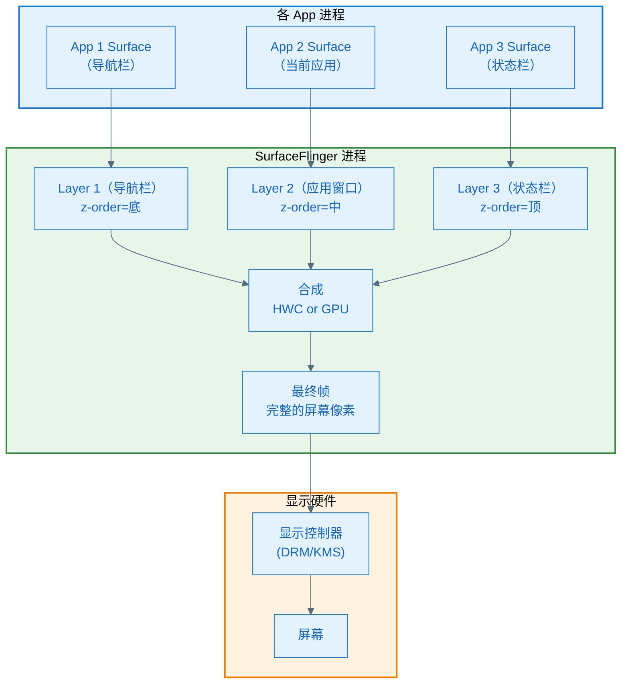
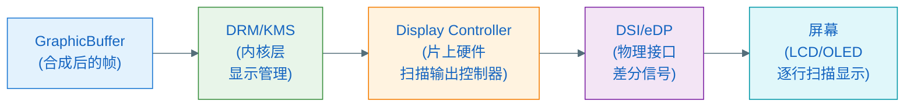
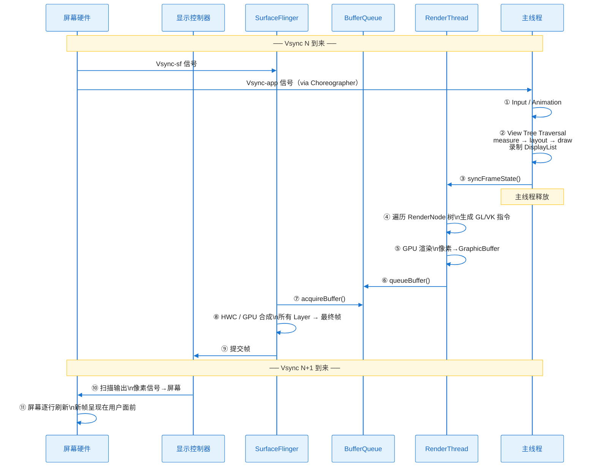

# 合成与显示：像素上屏全程

> **一句话理解**：SurfaceFlinger 是系统级的"图层合并员"——它把每个 App 的 GraphicBuffer（图层）像叠透明膜一样合并成一帧，在 Vsync 节点提交给显示控制器，驱动屏幕刷新。

---

## 1. 为什么需要合成

屏幕上同时显示着很多东西：状态栏、导航栏、当前 App 的窗口、可能还有浮窗。每个窗口各自有自己的 Surface（GraphicBuffer）。

屏幕只有一块，最终只接受一帧完整的像素数据。所以需要有人把这些图层按 z-order（前后关系）叠加起来，形成最终的一帧——这个工作就是**合成（Composition）**，执行者是 **SurfaceFlinger**。

---

## 2. SurfaceFlinger 是什么

SurfaceFlinger 是 Android 系统的一个系统服务进程（`/system/bin/surfaceflinger`），运行在独立进程中，职责：

1. 管理所有应用的 Surface（每个 Surface 对应 SurfaceFlinger 里的一个 **Layer**）
2. 在每个 Vsync 周期，从每个 Layer 的 BufferQueue 里取最新帧
3. 把所有 Layer 合成为一帧最终画面
4. 提交给显示控制器（Display Controller / DRM）刷新屏幕



---

## 3. Vsync：节拍器

### 3.1 什么是 Vsync

屏幕每秒刷新 N 次（60Hz = 每 16.67ms 一次，120Hz = 每 8.33ms 一次），每次刷新时会产生一个 **Vsync 信号（Vertical Synchronization）**。

Vsync 信号告诉所有参与者："现在可以准备下一帧了"。

### 3.2 双 Vsync 架构（Android 4.1 Jelly Bean 引入）

Android 同时维护两种 Vsync 信号：

| 信号 | 触发对象 | 作用 |
|------|---------|------|
| `VSYNC-app` | App 进程的 Choreographer | 触发 App 开始录制/渲染下一帧 |
| `VSYNC-sf` | SurfaceFlinger | 触发 SurfaceFlinger 合成并提交当前帧 |

两者之间有一个 **Offset**（偏移量），目的是让 App 的渲染和 SurfaceFlinger 的合成不在同一时刻抢占 CPU/GPU，减少竞争。

```
时间轴：
|──── 16.67ms ────|──── 16.67ms ────|──── 16.67ms ────|
▲                  ▲                  ▲
Vsync-app          Vsync-app          Vsync-app
  ▲                  ▲                  ▲
  Vsync-sf           Vsync-sf           Vsync-sf
  (offset后)

App 在 Vsync-app 开始渲染 → 在 Vsync-sf 到来前完成 → SurfaceFlinger 合成 → 下一个屏幕刷新时显示
```

### 3.3 一帧的时间预算

以 60Hz 为例，一帧的总预算是 16.67ms，分配大约如下：

```
[App 渲染时间] + [SurfaceFlinger 合成时间] ≤ 16.67ms
典型分配：App ~10ms，SurfaceFlinger ~4ms，留 ~2ms 余量
```

任何一部分超时，就会错过当前 Vsync，产生掉帧（Jank）。

---

## 4. 合成的两种方式：HWC vs GPU 合成

SurfaceFlinger 合成图层有两种方式，由 **HWC（Hardware Composer HAL）** 决定：

### 4.1 HWC 合成（首选）

**直接硬件合成**：把各个 Layer 的 GraphicBuffer 地址直接告诉显示控制器（DRM），由显示硬件在扫描输出时直接从各缓冲区读取并叠加。

- **优点**：不需要 GPU 参与，功耗低，延迟小
- **限制**：硬件能处理的 Layer 数量有限（通常 4~8 个），只支持简单的叠加（不支持复杂混合效果）

### 4.2 GPU 合成（降级方案）

当 Layer 数量超出 HWC 硬件能力，或某个 Layer 有特殊混合模式时，SurfaceFlinger 用 GPU 把需要合成的 Layer 先画到一个临时的 GraphicBuffer（FramebufferTarget）里，再交给 HWC 显示。

- **优点**：支持所有混合效果，Layer 数量不受限
- **缺点**：消耗 GPU，功耗高，有额外的渲染延迟

### 4.3 为什么透明窗口/模糊效果性能差

- **透明窗口（`TRANSLUCENT` windowBackground）**：SurfaceFlinger 无法用 HWC 合成，必须用 GPU 做 alpha 混合
- **实时模糊（Blur Layer）**：需要对多个 Layer 做采样和卷积，强制走 GPU 合成路径

这就是为什么系统提示"减少透明 View 层级可以提升性能"——每增加一个透明 Layer，HWC 就可能放弃硬件合成，降级为 GPU 合成。

---

## 5. 从 GraphicBuffer 到屏幕：物理显示链路



1. **DRM/KMS（Direct Rendering Manager / Kernel Mode Setting）**：Linux 内核的显示子系统，负责管理显示控制器，接受 SurfaceFlinger 的帧提交
2. **Display Controller**：SoC 片上的硬件模块，在每个 Vsync 周期，按行扫描从 GraphicBuffer 读取像素，通过物理接口发送给屏幕
3. **DSI/eDP**：屏幕物理接口（手机用 MIPI DSI，笔记本用 eDP），传输的是差分信号
4. **屏幕**：收到信号，逐行点亮/熄灭每个像素（OLED）或调节液晶透光率（LCD）

**像素的最终形态**：
- **OLED**：每个像素是独立的有机发光二极管，数据控制其亮度和颜色（R/G/B 子像素各自发光）
- **LCD**：背光板提供白光，液晶层调节透光率，彩色滤光片分离 RGB，三者叠加形成颜色

---

## 6. 完整的"一帧"全景时序



**协作者与过程说明**

1. **触发**：屏幕硬件产生 Vsync，分两路：`Vsync-app` 触发 Choreographer → 主线程开始工作；`Vsync-sf` 触发 SurfaceFlinger 合成。
2. **主线程①②**：处理输入事件、推进动画、遍历 View 树录制 DisplayList（硬件加速路径）。
3. **同步③**：主线程通过 `syncFrameState()` 把 RenderNode 树状态同步给 RenderThread，之后主线程可自由处理下一帧的输入。
4. **渲染④⑤⑥**：RenderThread 独立执行，把 DisplayList 翻译成 GPU 命令，GPU 渲染后 `queueBuffer()` 提交到 BufferQueue。
5. **合成⑦⑧⑨**：SurfaceFlinger 在 `Vsync-sf` 时从各 Layer 的 BufferQueue 取最新帧，通过 HWC 或 GPU 合成，提交给 DRM/KMS。
6. **显示⑩⑪**：显示控制器在下一个 Vsync 周期扫描输出帧数据，屏幕逐行刷新，用户看到新画面。
7. **正常结束**：整个流程在一个 Vsync 周期（16.67ms / 8.33ms）内完成，帧率稳定。
8. **异常（掉帧）**：若主线程/RenderThread/GPU/SurfaceFlinger 任何一环超时，`queueBuffer()` 或合成在下一个 Vsync 前未能完成，SurfaceFlinger 重复显示上一帧，用户感知到卡顿。

---

## 7. 用 Perfetto 观察这条链路

Perfetto 是 Google 的系统级 trace 工具，能可视化上述每个环节：

```
在 Perfetto 的 Timeline 视图里：

主线程 (com.example.app):
  │ Choreographer#doFrame  │ 这一帧主线程总耗时
  │   measure              │
  │   layout               │
  │   draw (录制 DL)        │
  │   syncFrameState       │

RenderThread:
  │                    │ DrawFrame  │ RT 渲染耗时
  │                    │ GPU fence  │ 等 GPU 完成

SurfaceFlinger:
  │                         │ onMessageReceived │ 合成耗时
  │                         │ HWC              │
```

**关键观察点**：
- `Choreographer#doFrame` 超过 16ms → 主线程超时，掉帧
- `DrawFrame` 超时 → RenderThread 超时，掉帧
- `gpu fence` 很长 → GPU 压力大，掉帧
- 两帧之间有空档 → App 渲染太慢，主动掉帧

---

## 8. 全章总结：像素的五段旅程回顾

```mermaid
%%{init: {'theme': 'base', 'themeVariables': { 'primaryColor': '#E3F2FD', 'primaryTextColor': '#1565C0', 'primaryBorderColor': '#1976D2', 'lineColor': '#546E7A'}}}%%
flowchart LR
    A["① 描述\nonDraw() 写指令\nRecordingCanvas"]
    B["② 录制\nDisplayList\n存入 RenderNode"]
    C["③ 栅格化\nGPU 执行着色器\n像素→GraphicBuffer"]
    D["④ 缓冲\nqueueBuffer()\nBufferQueue 调度"]
    E["⑤ 合成显示\nSurfaceFlinger\n→ 屏幕"]

    A -->|syncFrameState| B -->|RenderThread| C -->|eglSwapBuffers| D -->|Vsync-sf| E

    style A fill:#E3F2FD,stroke:#1976D2,stroke-width:2px
    style B fill:#E8F5E9,stroke:#388E3C,stroke-width:2px
    style C fill:#FFF3E0,stroke:#F57C00,stroke-width:2px
    style D fill:#F3E5F5,stroke:#7B1FA2,stroke-width:2px
    style E fill:#E0F7FA,stroke:#0097A7,stroke-width:2px
```



| 阶段 | 执行者 | 输出物 | 对应文档 |
|------|--------|--------|---------|
| ① 描述 | 主线程 | 绘制指令 | 02 Canvas 与 Bitmap |
| ② 录制 | 主线程 RecordingCanvas | DisplayList / RenderNode | 03 硬件加速 |
| ③ 栅格化 | RenderThread + GPU | 像素数据（GraphicBuffer） | 03 硬件加速 |
| ④ 缓冲 | BufferQueue | 帧队列 | 04 Surface |
| ⑤ 合成显示 | SurfaceFlinger + 显示控制器 | 屏幕画面 | 本章 |

---

## 9. 常见误区

| 误区 | 真相 |
|------|------|
| "App 的帧直接显示在屏幕上" | 经过 SurfaceFlinger 合成，和其他 Layer 叠加后才显示 |
| "减少 View 数量能提升帧率" | View 数量影响 measure/layout 时间；Layer 数量（Surface 数量）影响 SurfaceFlinger 合成效率 |
| "60fps 和 60Hz 是同一件事" | 60Hz 是屏幕刷新率（硬件），60fps 是 App 的帧率（软件）。App 60fps 才能填满屏幕 60Hz 的每次刷新 |
| "掉帧一定是主线程卡顿" | RenderThread 超时、GPU 渲染超时、SurfaceFlinger 合成超时都能导致掉帧 |
| "开启硬件加速后 CPU 就没有图形工作了" | CPU 还负责录制 DisplayList（onDraw）、syncFrameState、矩阵计算等，只是像素生成移交 GPU |

---

下一篇：**`06-自测与延伸学习.md`** ——检验你是否真正掌握了这五段旅程。
